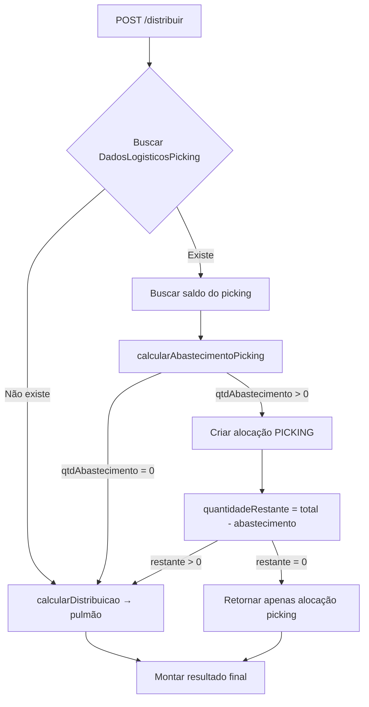
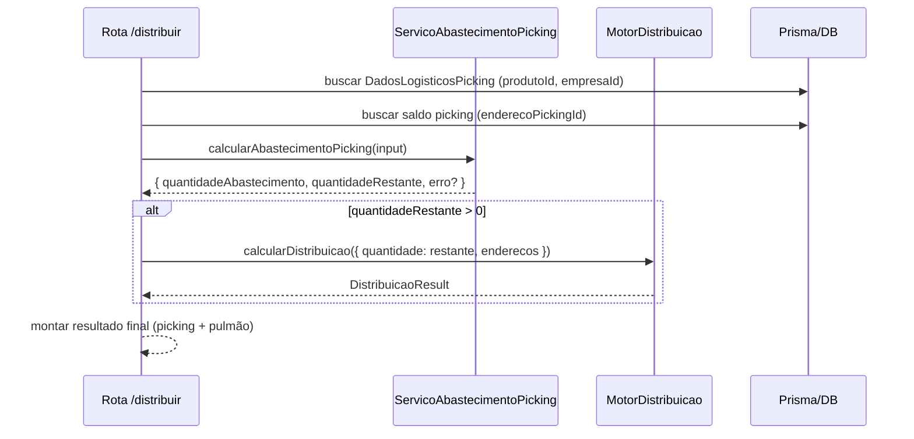

# Design — Abastecimento Automático do Picking no Endereçamento

## Visão Geral

Este documento descreve o design técnico para implementar o abastecimento automático do picking durante o fluxo de endereçamento inteligente. O serviço de cálculo é uma **função pura** (sem side-effects) que determina a quantidade a ser alocada no picking antes de distribuir o restante no pulmão via motor de distribuição existente.

A arquitetura segue o padrão já estabelecido no módulo `enderecamento-inteligente`: funções puras para cálculo + camada de orquestração nas rotas para I/O e persistência.

### Decisões de Design

1. **Serviço puro para cálculo**: O `calcularAbastecimentoPicking` é uma função pura que recebe dados pré-fetched e retorna o resultado do cálculo. Isso facilita testes e reutilização.
2. **Integração na cadeia existente**: O abastecimento é invocado ANTES do `calcularDistribuicao` (motor de distribuição), reduzindo a quantidade passada ao pulmão.
3. **Graceful degradation**: Falhas no picking não bloqueiam o fluxo principal — a quantidade integral segue para o pulmão.
4. **Múltiplos endereços de picking**: Suporte a múltiplos registros de `DadosLogisticosPicking` por produto, processados em ordem de `sequencia`.

## Arquitetura



### Fluxo de Dados



## Componentes e Interfaces

### 1. Serviço de Cálculo: `abastecimento-picking.service.ts`

Localização: `src/modules/enderecamento-inteligente/abastecimento-picking.service.ts`

```typescript
// ── Tipos de Entrada ──────────────────────────────────────────────────

export interface DadosPickingConfig {
  enderecoPickingId: string
  enderecoCompleto: string
  capacidade: number          // capacidadePicking (unidades master)
  pontoReposicao: number | null  // null = sempre abastecer quando há espaço
  saldoAtual: number          // saldo físico atual no picking
  enderecoAtivo: boolean      // status do endereço
  sequencia: number           // ordem de processamento
}

export interface AbastecimentoPickingInput {
  quantidadeRestante: number  // quantidade total a endereçar (em unidade master)
  dadosPicking: DadosPickingConfig[]  // pode ser vazio (sem picking configurado)
}

// ── Tipos de Saída ────────────────────────────────────────────────────

export interface AlocacaoPicking {
  enderecoId: string
  enderecoCompleto: string
  quantidadeAlocada: number
  areaArmazenagem: 'PICKING'
  capacidadeTotal: number
  saldoAnterior: number
  saldoResultante: number
}

export interface AbastecimentoPickingResult {
  alocacoes: AlocacaoPicking[]
  quantidadeAbastecida: number   // soma de todas alocações picking
  quantidadeRestante: number     // quantidade disponível para pulmão
  avisos: string[]               // warnings (capacidade inválida, endereço inativo, etc.)
}

export interface AbastecimentoPickingError {
  tipo: 'PARAMETROS_INVALIDOS' | 'ERRO_INESPERADO'
  mensagem: string
}

export type AbastecimentoPickingOutput =
  | { sucesso: true; resultado: AbastecimentoPickingResult }
  | { sucesso: false; erro: AbastecimentoPickingError }
```

### 2. Função Principal: `calcularAbastecimentoPicking`

```typescript
/**
 * Calcula a quantidade a ser alocada no(s) endereço(s) de picking.
 * Função PURA — sem side-effects, sem I/O.
 *
 * Regras:
 * 1. Validar parâmetros de entrada
 * 2. Para cada DadosPickingConfig (em ordem de sequência):
 *    a. Pular se endereço inativo
 *    b. Pular se capacidade <= 0 (registrar aviso)
 *    c. Verificar ponto de reposição (se configurado e saldo > ponto, pular)
 *    d. Calcular: min(quantidadeRestante, capacidade - saldoAtual)
 *    e. Se resultado > 0: criar alocação e decrementar quantidadeRestante
 * 3. Retornar resultado com alocações e quantidade restante
 */
export function calcularAbastecimentoPicking(
  input: AbastecimentoPickingInput
): AbastecimentoPickingOutput
```

### 3. Função Auxiliar: `calcularQuantidadeUnitaria`

```typescript
/**
 * Calcula a quantidade de abastecimento para um único endereço de picking.
 * Fórmula: max(0, min(quantidadeRestante, capacidade - saldoAtual))
 *
 * Pré-condições (validadas pelo chamador):
 * - quantidadeRestante >= 0
 * - saldoAtual >= 0
 * - capacidade >= 1
 */
export function calcularQuantidadeUnitaria(
  quantidadeRestante: number,
  capacidade: number,
  saldoAtual: number
): number
```

### 4. Integração na Rota `/distribuir`

A rota existente em `enderecamento-inteligente.routes.ts` será modificada para:

1. **Antes** de chamar `executarCadeiaPrioridade`, buscar dados de picking e invocar `calcularAbastecimentoPicking`
2. Montar alocações de picking no resultado
3. Passar `quantidadeRestante` (reduzida) para `executarCadeiaPrioridade`
4. Combinar resultados (picking primeiro, depois pulmão)

### 5. Tipo de Resultado Estendido

```typescript
export interface DistribuicaoComPickingResult {
  alocacoes: (AlocacaoPicking | AlocacaoPulmao)[]
  quantidadeTotal: number
  quantidadeAlocada: number
  quantidadeRestante: number
  completa: boolean
  pickingInfo?: {
    capacidadeTotal: number
    saldoResultante: number
    quantidadeAbastecida: number
  }
}

export interface AlocacaoPulmao {
  enderecoId: string
  enderecoCompleto: string
  rua: string
  predio: string
  nivel: string
  apartamento: string
  quantidadeAlocada: number
  areaArmazenagem: 'PULMAO'
}
```

## Modelos de Dados

### Modelos Existentes Utilizados

| Modelo | Uso |
|--------|-----|
| `DadosLogisticosPicking` | Configuração de picking por produto (capacidade, pontoReposicao, enderecoPickingId, sequencia) |
| `Endereco` | Endereço físico com status, tipo, areaArmazenagem, empresaId |
| `SaldoEndereco` | Saldo atual por endereço/produto/lote |
| `LogMovimentacao` | Registro de movimentação (tipo ENDERECAMENTO) |

### Consultas Necessárias

```typescript
// 1. Buscar configurações de picking do produto
prisma.dadosLogisticosPicking.findMany({
  where: { produtoId, /* join com produto.empresaId */ },
  orderBy: { sequencia: 'asc' },
})

// 2. Buscar saldo do endereço de picking
prisma.saldoEndereco.aggregate({
  where: { enderecoId: enderecoPickingId, produtoId },
  _sum: { quantidade: true },
})

// 3. Verificar status do endereço
prisma.endereco.findUnique({
  where: { id: enderecoPickingId },
  select: { id: true, status: true, enderecoCompleto: true, empresaId: true },
})
```

### Filtro Multi-Tenant

Todas as consultas devem incluir filtro por `empresaId`:
- `DadosLogisticosPicking`: filtrar via join com `Produto` que possui `empresaId`
- `SaldoEndereco`: filtrar via `endereco.empresaId`
- `Endereco`: filtrar diretamente por `empresaId`

> **Nota**: O modelo `DadosLogisticosPicking` não possui `empresaId` diretamente. O isolamento é garantido filtrando o `produtoId` que pertence à empresa do usuário (validado na busca do produto).

## Propriedades de Corretude

*Uma propriedade é uma característica ou comportamento que deve ser verdadeiro em todas as execuções válidas de um sistema — essencialmente, uma declaração formal sobre o que o sistema deve fazer. Propriedades servem como ponte entre especificações legíveis por humanos e garantias de corretude verificáveis por máquina.*

### Propriedade 1: Corretude da Fórmula de Abastecimento

*Para qualquer* entrada válida (quantidadeRestante >= 0, saldoAtual >= 0, capacidade >= 1), a quantidade de abastecimento calculada para um único endereço de picking deve ser igual a `min(quantidadeRestante, max(0, capacidade - saldoAtual))`.

**Valida: Requisitos 2.1, 2.3, 2.4**

### Propriedade 2: Não-Negatividade do Resultado

*Para qualquer* entrada válida, a quantidade de abastecimento calculada deve ser sempre maior ou igual a zero.

**Valida: Requisitos 2.5**

### Propriedade 3: Prevenção de Overflow de Capacidade

*Para qualquer* entrada válida, a soma `saldoAtual + quantidadeAbastecimento` deve ser sempre menor ou igual à `capacidade` do endereço de picking.

**Valida: Requisitos 2.6**

### Propriedade 4: Rejeição de Parâmetros Inválidos

*Para qualquer* entrada onde `quantidadeRestante < 0`, ou `saldoAtual < 0`, ou `capacidade < 1`, o serviço deve retornar um erro de parâmetros inválidos sem realizar cálculo.

**Valida: Requisitos 2.7**

### Propriedade 5: Conservação de Quantidade

*Para qualquer* distribuição completa (flag `completa = true`), a soma da quantidade alocada no picking mais a soma das quantidades alocadas no pulmão deve ser igual à quantidade total de entrada.

**Valida: Requisitos 4.6, 3.2**

### Propriedade 6: Estrutura de Alocações

*Para qualquer* resultado de distribuição que inclua alocação no picking, a alocação de picking deve aparecer como primeiro item na lista e toda alocação (picking ou pulmão) deve possuir o campo `areaArmazenagem` corretamente definido como `'PICKING'` ou `'PULMAO'`.

**Valida: Requisitos 5.1, 5.2**

### Propriedade 7: Gate do Ponto de Reposição

*Para qualquer* produto com `pontoReposicao` configurado (não-nulo e > 0), se o saldo atual do picking é maior que o `pontoReposicao`, a quantidade de abastecimento deve ser zero. Se o saldo é menor ou igual ao `pontoReposicao`, a fórmula padrão deve ser aplicada. Se `pontoReposicao` é nulo, zero ou negativo, a fórmula padrão deve ser aplicada sempre que houver espaço disponível.

**Valida: Requisitos 6.1, 6.2, 6.3, 6.4**

### Propriedade 8: Ordem de Processamento Sequencial

*Para qualquer* produto com múltiplos registros de `DadosLogisticosPicking`, os endereços de picking devem ser processados em ordem crescente do campo `sequencia`, e a quantidade restante deve ser decrementada progressivamente entre cada processamento.

**Valida: Requisitos 8.4**

## Tratamento de Erros

| Cenário | Comportamento | Log |
|---------|--------------|-----|
| `DadosLogisticosPicking` não existe | Retorna abastecimento = 0, tudo vai para pulmão | Nenhum (fluxo normal) |
| `enderecoPickingId` é nulo | Pula o registro, registra aviso | Warning |
| Endereço picking não existe no DB | Pula, registra aviso | Warning com produtoId e enderecoPickingId |
| Endereço picking inativo (status=false) | Pula, registra aviso | Warning |
| Capacidade <= 0 | Pula, registra aviso | Warning com produtoId e valor inválido |
| Erro ao buscar saldo | Pula, registra erro | Error com stack trace |
| `empresaId` ausente no contexto | Rejeita operação com erro | Error |
| Erro inesperado no serviço | Captura exceção, retorna tudo para pulmão | Error com stack trace |
| Motor de distribuição falha após picking | Retorna resultado parcial com picking + restante | Warning |

### Estratégia de Graceful Degradation

```typescript
try {
  const resultadoPicking = calcularAbastecimentoPicking(input)
  if (!resultadoPicking.sucesso) {
    // Log do erro, mas continua com quantidade total para pulmão
    logger.error('Erro no cálculo de picking', resultadoPicking.erro)
    quantidadeParaPulmao = quantidadeTotal
  } else {
    quantidadeParaPulmao = resultadoPicking.resultado.quantidadeRestante
  }
} catch (err) {
  // Erro inesperado — graceful degradation
  logger.error('Erro inesperado no abastecimento picking', err)
  quantidadeParaPulmao = quantidadeTotal
}
```

## Estratégia de Testes

### Testes de Propriedade (Property-Based Testing)

**Biblioteca**: [fast-check](https://github.com/dubzzz/fast-check) — biblioteca PBT para TypeScript/JavaScript.

**Configuração**: Mínimo de 100 iterações por teste de propriedade.

Cada propriedade de corretude (seção anterior) será implementada como um teste de propriedade individual usando `fast-check`:

- **Property 1**: Gerar `quantidadeRestante ∈ [0, 10000]`, `saldoAtual ∈ [0, 10000]`, `capacidade ∈ [1, 10000]` → verificar fórmula
- **Property 2**: Mesmos geradores → verificar resultado >= 0
- **Property 3**: Mesmos geradores → verificar saldo + resultado <= capacidade
- **Property 4**: Gerar valores inválidos (negativos, capacidade 0) → verificar erro retornado
- **Property 5**: Gerar cenários completos com picking + pulmão → verificar conservação
- **Property 6**: Gerar distribuições com picking → verificar ordenação e campos
- **Property 7**: Gerar combinações de saldo e pontoReposicao → verificar gate
- **Property 8**: Gerar listas de 2-5 configs com sequências aleatórias → verificar ordem

**Tag format**: `Feature: abastecimento-picking-enderecamento, Property {N}: {título}`

### Testes Unitários (Example-Based)

| Cenário | Entrada | Saída Esperada |
|---------|---------|----------------|
| Sem DadosLogisticosPicking | `dadosPicking: []` | `quantidadeAbastecida: 0, quantidadeRestante: total` |
| enderecoPickingId nulo | Config com id nulo | Pula, aviso registrado |
| Endereço inativo | `enderecoAtivo: false` | Pula, aviso registrado |
| Picking consome tudo | `qtdRestante: 5, capacidade: 10, saldo: 0` | `abastecido: 5, restante: 0` |
| Picking parcial | `qtdRestante: 20, capacidade: 10, saldo: 3` | `abastecido: 7, restante: 13` |
| Picking cheio | `qtdRestante: 10, capacidade: 5, saldo: 5` | `abastecido: 0, restante: 10` |
| empresaId ausente | Sem empresaId no contexto | Erro retornado |
| Erro inesperado | Simular exceção | Graceful degradation |

### Testes de Integração

- Verificar que a rota `/distribuir` invoca o serviço de picking antes do motor de distribuição
- Verificar que `/confirmar` registra `LogMovimentacao` com tipo ENDERECAMENTO para alocações de picking
- Verificar isolamento multi-tenant (dados de outra empresa não aparecem)
- Verificar que o fluxo manual (`confirmar-coletor`) não é afetado

### Estrutura de Arquivos de Teste

```
src/modules/enderecamento-inteligente/
├── abastecimento-picking.service.ts          # Serviço puro
├── abastecimento-picking.service.spec.ts     # Testes unitários + propriedade
├── motor-distribuicao.service.ts             # Existente
├── enderecamento-inteligente.routes.ts       # Modificado (orquestração)
└── ...
```
