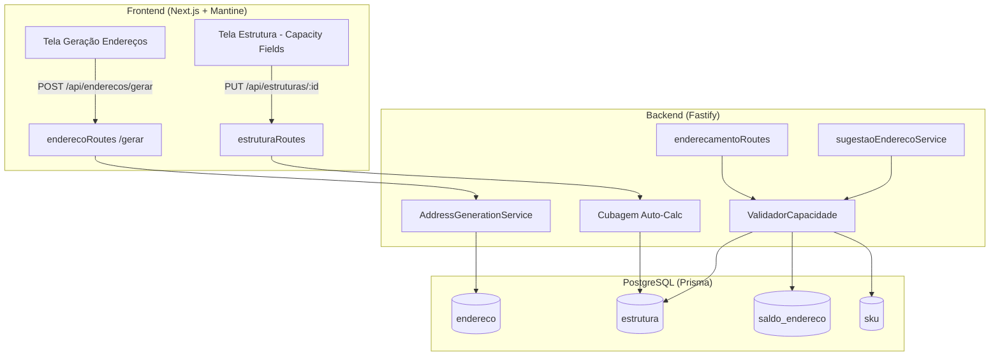

# Design Document: Address Generation & Capacity Control

## Overview

This feature adds two complementary capabilities to the VisioFab WMS:

1. **Parameterized Batch Address Generation** — An enhanced `/api/enderecos/gerar` endpoint and corresponding frontend screen that replaces the legacy Delphi `CadEnderecoAutomatico.pas` functionality. Operators define ranges for Rua, Prédio, Nível, and Apartamento along with classification parameters, and the system generates addresses in bulk with duplicate detection, parity filtering (Par/Ímpar), and barcode generation.

2. **Capacity Validation Service** — A new `ValidadorCapacidade` service that enforces weight (kg) and volume (m³) constraints during storage operations. It calculates cumulative load at an address from `SaldoEndereco` records and compares against the `Estrutura` limits before allowing product placement.

### Design Decisions

| Decision | Rationale |
|----------|-----------|
| Extend existing `Estrutura` model with capacity fields | Avoids a new table; capacity is intrinsic to the structure type |
| Capacity validation as a standalone service | Decouples from the generation flow; can be called from enderecamento, ressuprimento, or any storage operation |
| Cubagem auto-calculated on save | Prevents inconsistency between dimensions and volume |
| Batch generation uses `createMany` with skip-duplicates | Leverages Prisma's built-in dedup for performance on large batches |
| Lado filter applied in the generation loop (not post-filter) | Avoids generating then discarding addresses, improving memory efficiency |

---

## Architecture



### Integration Points

1. **Address Generation** → Creates records in `endereco` table with all associations
2. **Estrutura CRUD** → Extended to handle capacity fields with auto-cubagem calculation
3. **Enderecamento Flow** → `enderecamento-automatico` and `sugestao-endereco.service.ts` call `ValidadorCapacidade` before placing products
4. **Capacity Query** → New endpoint exposes utilization data for operator decision-making

---

## Components and Interfaces

### 1. AddressGenerationService

Encapsulates the batch generation logic extracted from the current inline route handler.

```typescript
interface GenerationParams {
  centroDistribuicaoId: string
  depositoId: string
  codigoDeposito: string
  codigoZona: string
  zonaId: string
  estruturaId: string
  classificacaoProdutoId?: string
  ambienteArmazenagemId?: string
  formaArmazenagemId?: string
  areaArmazenagem: 'PULMAO' | 'PICKING'
  situacao: string
  lado: 'PAR' | 'IMPAR' | 'AMBOS'
  ruaInicio: number
  ruaFim: number
  predioInicio: number
  predioFim: number
  nivelInicio: number
  nivelFim: number
  aptoInicio: number
  aptoFim: number
}

interface GenerationResult {
  criados: number
  ignorados: number
  total: number
  enderecos: Array<{ enderecoCompleto: string; codigoBarras: string }>
}

class AddressGenerationService {
  async generate(params: GenerationParams): Promise<GenerationResult>
  private buildAddressList(params: GenerationParams): AddressCandidate[]
  private filterByLado(rua: number, lado: 'PAR' | 'IMPAR' | 'AMBOS'): boolean
  private formatSegment(value: number): string  // zero-pad to 3 digits
  private generateBarcode(enderecoCompleto: string): string
}
```

### 2. ValidadorCapacidade

Standalone service for weight/volume capacity validation.

```typescript
interface CapacityCheckInput {
  enderecoId: string
  produtoId: string
  quantidade: number
}

interface CapacityCheckResult {
  permitido: boolean
  pesoAtual: number       // kg
  pesoIncoming: number    // kg
  pesoLimite: number      // kg (from Estrutura.capacidade)
  volumeAtual: number     // m³
  volumeIncoming: number  // m³
  volumeLimite: number    // m³ (from Estrutura.cubagem)
  motivo?: string         // rejection reason if not allowed
}

interface CapacityUtilization {
  pesoUtilizacao: number      // percentage 0-100
  volumeUtilizacao: number    // percentage 0-100
  pesoDisponivel: number      // remaining kg
  volumeDisponivel: number    // remaining m³
  pesoAtual: number           // current kg
  volumeAtual: number         // current m³
  pesoLimite: number          // max kg
  volumeLimite: number        // max m³
}

class ValidadorCapacidade {
  async validar(input: CapacityCheckInput): Promise<CapacityCheckResult>
  async getUtilization(enderecoId: string): Promise<CapacityUtilization>
  private async calcularPesoAtual(enderecoId: string): Promise<number>
  private async calcularVolumeAtual(enderecoId: string): Promise<number>
}
```

### 3. API Endpoints

| Method | Path | Description |
|--------|------|-------------|
| POST | `/api/enderecos/gerar` | Enhanced batch generation with full parameters |
| GET | `/api/enderecos/:id/capacidade` | Get capacity utilization for an address |
| POST | `/api/enderecos/validar-capacidade` | Validate if a product can be stored |
| PUT | `/api/estruturas/:id` | Extended to accept capacity fields |

### 4. Frontend Components

| Component | Location | Description |
|-----------|----------|-------------|
| `GeracaoEnderecoForm` | `src/app/(interna)/configurador/enderecos/gerar/page.tsx` | Full generation form with range inputs |
| `CapacidadeEstrutura` | Integrated in Estrutura edit form | Capacity fields (largura, altura, comprimento, capacidade) |
| `IndicadorCapacidade` | Reusable component | Visual capacity bar for weight/volume |

---

## Data Models

### Estrutura (Extended)

```prisma
model Estrutura {
  id            String   @id @default(uuid())
  descricao     String   @db.VarChar(150)
  tipo          String   @db.VarChar(30)
  capacidade    Decimal? @db.Decimal(10,3)    // max weight in kg
  largura       Decimal? @db.Decimal(10,3)    // width in meters
  altura        Decimal? @db.Decimal(10,3)    // height in meters
  comprimento   Decimal? @db.Decimal(10,3)    // depth in meters
  cubagem       Decimal? @db.Decimal(10,6)    // max volume in m³ (auto-calculated)
  status        Boolean  @default(true)
  criadoEm      DateTime @default(now()) @map("criado_em")

  enderecos     Endereco[]

  @@map("estrutura")
}
```

### Endereco (Extended)

New fields added to support the generation parameters:

```prisma
model Endereco {
  // ... existing fields ...
  codigoBarras            String?  @db.VarChar(30) @map("codigo_barras")
  areaArmazenagem         String?  @db.VarChar(20) @map("area_armazenagem") // PULMAO, PICKING
  estado                  String   @default("LIVRE") @db.VarChar(20) @map("estado") // LIVRE, OCUPADO, BLOQUEADO
  formaArmazenagemId      String?  @map("forma_armazenagem_id")
  formaArmazenagem        FormaArmazenagem? @relation(fields: [formaArmazenagemId], references: [id])
  ambienteArmazenagemId   String?  @map("ambiente_armazenagem_id")
  ambienteArmazenagem     AmbienteArmazenagem? @relation(fields: [ambienteArmazenagemId], references: [id])
  classificacaoProdutoId  String?  @map("classificacao_produto_id")
  classificacaoProduto    ClassificacaoProduto? @relation(fields: [classificacaoProdutoId], references: [id])
  // ... existing relations ...
}
```

### Migration Summary

| Table | Change | Fields |
|-------|--------|--------|
| `estrutura` | ADD COLUMNS | `capacidade`, `largura`, `altura`, `comprimento`, `cubagem` |
| `endereco` | ADD COLUMNS | `codigo_barras`, `area_armazenagem`, `estado`, `forma_armazenagem_id`, `ambiente_armazenagem_id`, `classificacao_produto_id` |

---

## Correctness Properties

*A property is a characteristic or behavior that should hold true across all valid executions of a system — essentially, a formal statement about what the system should do. Properties serve as the bridge between human-readable specifications and machine-verifiable correctness guarantees.*

### Property 1: Address format composition

*For any* valid numeric values for deposito, zona, rua, predio, nivel, and apto segments, the composed `enderecoCompleto` string SHALL equal `{dep}-{zona}-{rua}-{predio}-{nivel}-{apto}` where each of rua, predio, nivel, apto is zero-padded to exactly 3 digits.

**Validates: Requirements 1.4**

### Property 2: Lado parity filtering

*For any* generation parameters with a Lado value of PAR or IMPAR, all generated addresses SHALL have Rua numbers whose parity matches the specified Lado (even for PAR, odd for IMPAR).

**Validates: Requirements 1.6, 1.7**

### Property 3: Generation order invariant

*For any* valid ranges (ruaInicio..ruaFim, predioInicio..predioFim, nivelInicio..nivelFim, aptoInicio..aptoFim), the generated addresses SHALL appear in nested iteration order where Apartamento varies fastest, then Nível, then Prédio, then Rua varies slowest.

**Validates: Requirements 1.1**

### Property 4: Duplicate detection preserves count invariant

*For any* generation run against a set of existing addresses, the sum of `criados + ignorados` SHALL equal the total number of addresses that would have been generated (accounting for Lado filtering).

**Validates: Requirements 2.2, 2.3**

### Property 5: Range validation rejects invalid ranges

*For any* range pair where start > end (for any of Rua, Prédio, Nível, or Apartamento), the system SHALL reject the request and create zero addresses.

**Validates: Requirements 3.1**

### Property 6: Cubagem auto-calculation

*For any* Estrutura with non-null largura, altura, and comprimento values, the persisted cubagem SHALL equal largura × altura × comprimento.

**Validates: Requirements 4.3, 4.4**

### Property 7: Weight capacity enforcement

*For any* storage operation at an address with an associated Estrutura, the operation SHALL be allowed if and only if (sum of existing quantities × pesoBruto) + (incoming quantity × pesoBruto) ≤ Estrutura.capacidade.

**Validates: Requirements 5.1, 5.2, 5.3, 5.4**

### Property 8: Volume capacity enforcement

*For any* storage operation at an address with an associated Estrutura that has cubagem > 0, and a product with volume > 0, the operation SHALL be allowed if and only if (sum of existing quantities × volume) + (incoming quantity × volume) ≤ Estrutura.cubagem.

**Validates: Requirements 6.1, 6.2, 6.3, 6.4**

### Property 9: Capacity utilization calculation correctness

*For any* address with an associated Estrutura, the reported weight utilization percentage SHALL equal (currentWeight / capacidade) × 100, and the remaining capacity SHALL equal capacidade − currentWeight. The same relationship holds for volume utilization with cubagem.

**Validates: Requirements 7.1, 7.2, 7.3, 7.4**

### Property 10: Generated addresses carry all specified associations

*For any* generation with specified estruturaId, zonaId, classificacaoProdutoId, and ambienteArmazenagemId, every generated address SHALL have all four foreign keys set to the specified values.

**Validates: Requirements 8.1, 8.2, 8.3, 8.4**

### Property 11: Barcode uniqueness within batch

*For any* batch generation, all generated `codigoBarras` values SHALL be unique (no two addresses in the same batch share a barcode).

**Validates: Requirements 1.5**

---

## Error Handling

| Scenario | HTTP Status | Error Response |
|----------|-------------|----------------|
| Start > End for any range | 400 | `{ message: "Valor inicial da {campo} deve ser menor ou igual ao valor final" }` |
| Referenced Depósito/Zona/Estrutura not found | 404 | `{ message: "{entidade} não encontrado(a)" }` |
| Invalid Área de Armazenagem value | 400 | `{ message: "Área de armazenagem deve ser PULMAO ou PICKING" }` |
| Weight capacity exceeded | 422 | `{ message: "Capacidade de peso excedida", pesoAtual, pesoIncoming, pesoLimite }` |
| Volume capacity exceeded | 422 | `{ message: "Capacidade de volume excedida", volumeAtual, volumeIncoming, volumeLimite }` |
| Address not found for capacity query | 404 | `{ message: "Endereço não encontrado" }` |
| Estrutura has no capacity defined | — | Validation skipped (operation allowed) |
| SKU has no volume defined | — | Volume validation skipped |

### Graceful Degradation

- If `Estrutura.capacidade` is null/zero → weight validation is skipped
- If `Estrutura.cubagem` is null/zero → volume validation is skipped
- If `Sku.pesoBruto` is null → weight validation is skipped for that product
- If `Sku.volume` is null → volume validation is skipped for that product
- If `Endereco.estruturaId` is null → all capacity validation is skipped

---

## Testing Strategy

### Property-Based Tests (Vitest + fast-check)

The project uses Vitest as the test runner. Property-based tests will use `fast-check` for random input generation.

Each property test runs a minimum of **100 iterations** and is tagged with a comment referencing the design property.

| Property | Test File | What's Generated |
|----------|-----------|-----------------|
| P1: Address format | `address-generation.property.test.ts` | Random numeric segments (1-999) |
| P2: Lado filtering | `address-generation.property.test.ts` | Random ranges + Lado values |
| P3: Generation order | `address-generation.property.test.ts` | Random small ranges (1-5 per dimension) |
| P4: Count invariant | `address-generation.property.test.ts` | Random ranges + random existing address sets |
| P5: Range validation | `address-generation.property.test.ts` | Random pairs with start > end |
| P6: Cubagem calc | `estrutura-capacity.property.test.ts` | Random positive decimals for dimensions |
| P7: Weight enforcement | `capacity-validation.property.test.ts` | Random weights, quantities, capacities |
| P8: Volume enforcement | `capacity-validation.property.test.ts` | Random volumes, quantities, cubagens |
| P9: Utilization calc | `capacity-validation.property.test.ts` | Random current loads and limits |
| P10: Associations | `address-generation.property.test.ts` | Random UUIDs for each association |
| P11: Barcode uniqueness | `address-generation.property.test.ts` | Random batch sizes |

### Unit Tests (Vitest)

- Edge cases: Lado=AMBOS generates all, empty ranges (start=end generates 1 address)
- Error conditions: invalid UUIDs, missing required fields
- Boundary: max range sizes, zero-padded numbers at boundaries (0, 999)
- Capacity edge cases: null estrutura, null SKU dimensions, zero capacity

### Integration Tests

- Full generation flow with database (verify records created)
- Capacity validation integrated with enderecamento flow
- Concurrent generation requests (verify no duplicate barcodes)

### Test Configuration

```typescript
// Property test tag format:
// Feature: address-generation-capacity-control, Property {N}: {title}

import { fc } from 'fast-check'

// Minimum 100 iterations per property
const NUM_RUNS = 100
```
