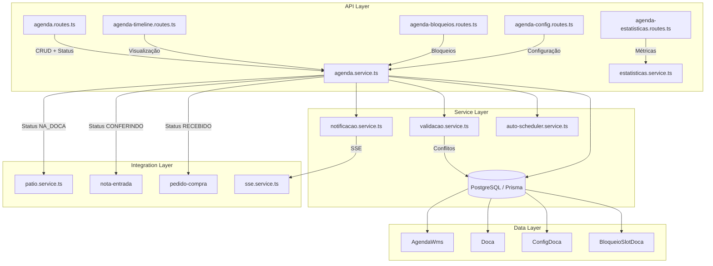
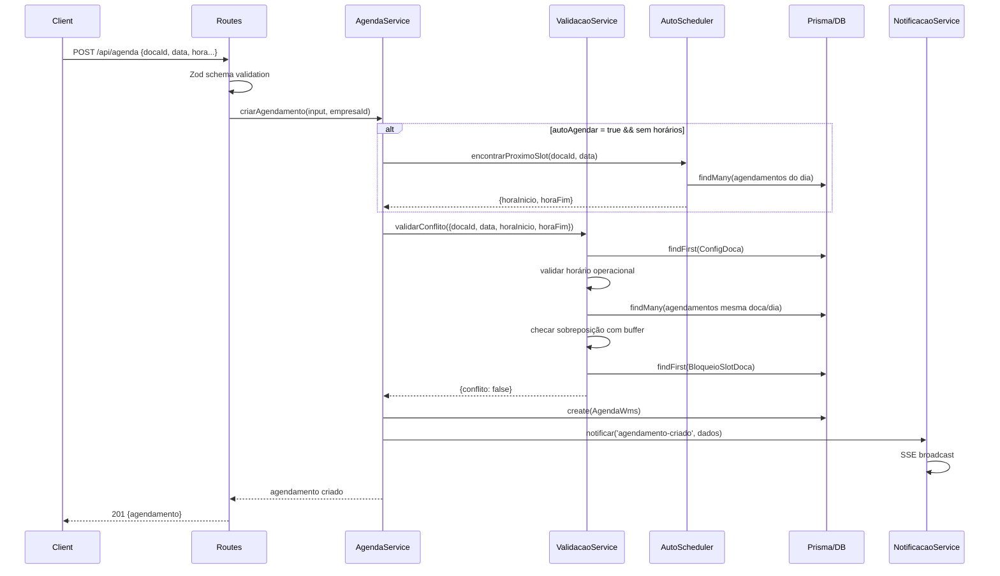
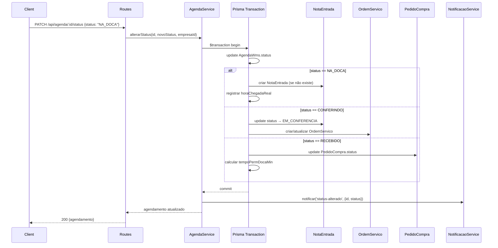
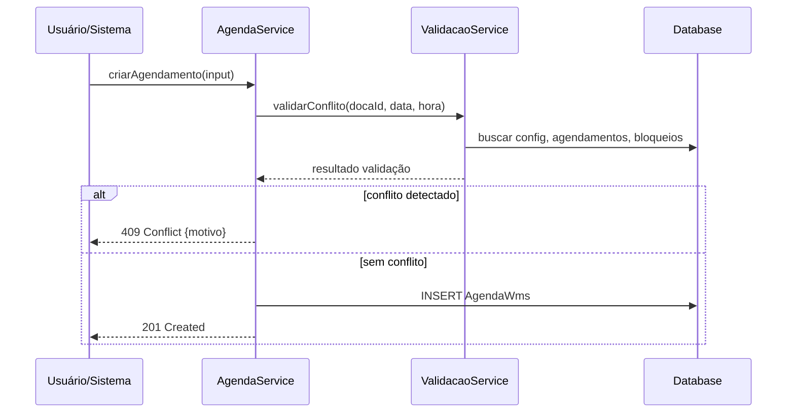

# Design Document: Agenda Backend

## Overview

O módulo **agenda-backend** consolida e evolui o sistema de agendamento de docas do WMS, unificando os módulos existentes `agenda-wms` e `agenda-doca` em uma arquitetura coesa com separação clara de responsabilidades. O sistema gerencia o ciclo completo de um agendamento — desde a criação, passando por validação de conflitos, check-in do veículo, conferência, até a conclusão do recebimento.

A proposta é refatorar a lógica duplicada entre os dois módulos atuais, introduzir um service layer unificado com validações robustas, melhorar a integração com o módulo de pátio (veículos, fila, chamada à doca), e adicionar capacidades como notificações em tempo real, agendamento recorrente, e métricas avançadas de aderência.

O backend mantém compatibilidade com Fastify + Prisma + Zod (stack atual), utilizando o padrão de rotas → service → repository já estabelecido no projeto.

## Architecture



## Sequence Diagrams

### Fluxo Principal: Criação de Agendamento com Validação



### Fluxo de Mudança de Status com Side-Effects



## Components and Interfaces

### Component 1: AgendaService (agenda.service.ts)

**Purpose**: Orquestrador principal das operações de agendamento. Coordena validação, persistência, side-effects e notificações.

**Interface**:
```typescript
interface IAgendaService {
  criarAgendamento(input: CriarAgendamentoInput, empresaId: string): Promise<AgendaWms>
  editarAgendamento(id: string, input: EditarAgendamentoInput, empresaId: string): Promise<AgendaWms>
  moverAgendamento(id: string, input: MoverAgendamentoInput, empresaId: string): Promise<AgendaWms>
  alterarStatus(id: string, novoStatus: StatusAgenda, empresaId: string, userId: string): Promise<AgendaWms>
  concluirRecebimento(id: string, empresaId: string, userId: string): Promise<void>
  registrarChegada(id: string, empresaId: string, horaChegada?: string): Promise<AgendaWms>
  obterDetalhe(id: string, empresaId: string): Promise<AgendaDetalhe>
  listarAgendamentos(filtros: ListarAgendamentosFiltros, empresaId: string): Promise<PaginatedResult<AgendaEnriched>>
}
```

**Responsibilities**:
- Coordenar criação e edição com validação de conflitos
- Executar side-effects de transição de status em transações atômicas
- Enriquecer dados com fornecedor, pedido, doca, nota fiscal
- Delegar notificações ao NotificacaoService

### Component 2: ValidacaoService (validacao.service.ts)

**Purpose**: Encapsula toda lógica de validação de conflitos de agendamento — sobreposição temporal, bloqueios, horário operacional, e regras de negócio.

**Interface**:
```typescript
interface IValidacaoService {
  validarConflito(input: ValidarConflitoInput, empresaId: string): Promise<ValidacaoResult>
  validarHorarioOperacional(horaInicio: string, horaFim: string, config: ConfigDoca): ValidationError | null
  validarBloqueios(docaId: string, dataInicio: Date, dataFim: Date, empresaId: string): Promise<BloqueioSlotDoca | null>
  validarTransicaoStatus(statusAtual: StatusAgenda, novoStatus: StatusAgenda): ValidationError | null
}
```

**Responsibilities**:
- Validar sobreposição temporal com buffer configurável
- Verificar bloqueios de manutenção na doca
- Validar horário dentro da janela operacional
- Validar transições de status permitidas (máquina de estados)

### Component 3: AutoSchedulerService (auto-scheduler.service.ts)

**Purpose**: Algoritmo de auto-agendamento que encontra o próximo slot disponível para uma doca em um dia, respeitando configurações e bloqueios.

**Interface**:
```typescript
interface IAutoSchedulerService {
  encontrarProximoSlot(
    docaId: string,
    data: string,
    duracaoMinutos: number,
    empresaId: string
  ): Promise<{ horaInicio: string; horaFim: string } | null>

  sugerirDocaDisponivel(
    data: string,
    duracaoMinutos: number,
    empresaId: string,
    tipoDoca?: 'ENTRADA' | 'SAIDA' | 'MISTA'
  ): Promise<SugestaoSlot[]>
}
```

**Responsibilities**:
- Buscar slots livres considerando buffer entre agendamentos
- Respeitar horário operacional configurado
- Evitar bloqueios de manutenção
- Sugerir múltiplas opções de docas quando solicitado

### Component 4: TimelineService (timeline.service.ts)

**Purpose**: Gera dados de visualização timeline para o frontend — visão de dia/semana/mês com agendamentos, bloqueios e indicadores de aderência.

**Interface**:
```typescript
interface ITimelineService {
  getTimeline(
    data: string,
    visualizacao: 'dia' | 'semana' | 'mes',
    empresaId: string
  ): Promise<TimelineResponse>

  getGradeDiaria(
    data: string,
    empresaId: string,
    slotMinutos?: number
  ): Promise<GradeResponse>
}
```

**Responsibilities**:
- Mapear agendamentos em slots visuais para timeline
- Calcular indicadores de aderência (no prazo, atraso leve, atrasado)
- Incluir bloqueios no layout visual
- Suportar diferentes granularidades (dia, semana, mês)

### Component 5: EstatisticasService (estatisticas.service.ts)

**Purpose**: Calcula métricas de aderência e performance do agendamento de docas.

**Interface**:
```typescript
interface IEstatisticasService {
  calcularEstatisticas(empresaId: string, dataInicio: string, dataFim: string): Promise<EstatisticasAderencia>
  calcularKPIsDocas(empresaId: string, periodo: string): Promise<DocaKPIs>
  detectarAtrasos(empresaId: string): Promise<number>
}
```

**Responsibilities**:
- % de agendamentos no prazo vs. atrasados
- Tempo médio de permanência na doca
- Tempo médio de atraso
- Métricas por doca para identificar gargalos
- Detecção automática de atrasos além da tolerância

### Component 6: NotificacaoService (notificacao.service.ts)

**Purpose**: Gerencia notificações em tempo real via SSE e potencialmente push notifications para mudanças de status de agendamento.

**Interface**:
```typescript
interface INotificacaoService {
  notificarCriacao(agendamento: AgendaWms, empresaId: string): void
  notificarStatusAlterado(agendamento: AgendaWms, statusAnterior: string, empresaId: string): void
  notificarConflito(docaId: string, detalhes: string, empresaId: string): void
  notificarAtraso(agendamento: AgendaWms, minutosAtraso: number, empresaId: string): void
}
```

**Responsibilities**:
- Broadcast de eventos via SSE (integra com sseService existente)
- Formatação de payloads de notificação
- Agrupamento de notificações para evitar spam

## Data Models

### Model: AgendaWms (existente — sem alterações de schema)

```typescript
interface AgendaWms {
  id: string                // UUID
  empresaId: string         // FK → Empresa
  pedidoCompraId?: string   // FK → PedidoCompra
  fornecedorId?: string     // FK → Fornecedor
  docaId?: string           // FK → Doca
  dataPrevista: Date        // Data do agendamento (UTC midnight)
  horaInicio?: string       // "HH:mm" — início do slot
  horaFim?: string          // "HH:mm" — fim do slot
  motorista?: string        // Nome do motorista
  placa?: string            // Placa do veículo
  tipoVeiculo?: string      // Tipo (carreta, truck, van, etc.)
  qtdCaixas?: number        // Quantidade de caixas prevista
  qtdPaletes?: number       // Quantidade de paletes prevista
  status: StatusAgenda      // Estado atual na máquina de estados
  observacao?: string       // Observações livres
  criadoEm: Date            // Timestamp de criação
  horaChegadaReal?: Date    // Quando o veículo realmente chegou
  tempoPermDocaMin?: number // Tempo real de permanência na doca (minutos)
}
```

**Validation Rules**:
- `horaInicio` e `horaFim` devem estar no formato `HH:mm` (regex `/^\d{2}:\d{2}$/`)
- `horaFim` > `horaInicio` (slot não pode ter duração negativa)
- `dataPrevista` não pode ser no passado (exceto admin)
- `docaId` deve referenciar uma doca ativa (`status: true`)
- `status` deve seguir transições válidas na máquina de estados

### Model: StatusAgenda (Máquina de Estados)

```typescript
type StatusAgenda = 
  | 'AGENDADO'     // Criado, aguardando confirmação
  | 'CONFIRMADO'   // Fornecedor/motorista confirmou presença
  | 'ESPERA'       // Veículo no pátio aguardando chamada
  | 'NA_DOCA'      // Veículo posicionado na doca
  | 'CONFERINDO'   // Conferência de mercadoria em andamento
  | 'CONFERIDO'    // Conferência finalizada
  | 'RECEBIDO'     // Recebimento concluído
  | 'CANCELADO'    // Cancelado

// Transições permitidas:
const TRANSICOES_VALIDAS: Record<StatusAgenda, StatusAgenda[]> = {
  AGENDADO:   ['CONFIRMADO', 'ESPERA', 'NA_DOCA', 'CANCELADO'],
  CONFIRMADO: ['ESPERA', 'NA_DOCA', 'CANCELADO'],
  ESPERA:     ['NA_DOCA', 'CANCELADO'],
  NA_DOCA:    ['CONFERINDO', 'CANCELADO'],
  CONFERINDO: ['CONFERIDO', 'CANCELADO'],
  CONFERIDO:  ['RECEBIDO'],
  RECEBIDO:   [],  // estado final
  CANCELADO:  [],  // estado final
}
```

### Model: ConfigDoca (existente)

```typescript
interface ConfigDoca {
  id: string
  empresaId: string         // Unique constraint
  horaAberturaOp: string    // "06:00" — início do turno operacional
  horaFechamentoOp: string  // "22:00" — fim do turno operacional
  bufferMinutos: number     // Buffer entre agendamentos (default: 15)
  toleranciaAtraso: number  // Minutos de tolerância para atraso (default: 30)
}
```

### Model: BloqueioSlotDoca (existente)

```typescript
interface BloqueioSlotDoca {
  id: string
  empresaId: string
  docaId: string
  dataInicio: Date          // Início do período bloqueado
  dataFim: Date             // Fim do período bloqueado
  motivo: string            // Razão do bloqueio (max 200 chars)
  criadoPorId: string       // Quem criou o bloqueio
  criadoEm: Date
}
```

**Validation Rules**:
- `dataFim` > `dataInicio`
- `motivo` obrigatório, 1-200 caracteres
- Não pode criar bloqueio que conflite com agendamentos já confirmados

## Main Algorithm/Workflow



## Algorithmic Pseudocode

### Algorithm: Validação de Conflito de Agendamento

```typescript
async function validarConflito(input: ValidarConflitoInput, empresaId: string): Promise<ValidacaoResult> {
  const { docaId, dataPrevista, horaInicio, horaFim, excluirId } = input

  // 1. Buscar configuração operacional
  const config = await getConfigOrDefault(empresaId)

  // 2. Validar janela operacional
  if (horaInicio < config.horaAberturaOp || horaFim > config.horaFechamentoOp) {
    return { conflito: true, motivo: `Fora do horário operacional (${config.horaAberturaOp}-${config.horaFechamentoOp})` }
  }

  // 3. Calcular intervalo com buffer (minutos)
  const inicioComBuffer = toMinutes(horaInicio) - config.bufferMinutos
  const fimComBuffer = toMinutes(horaFim) + config.bufferMinutos

  // 4. Buscar agendamentos na mesma doca/dia (excluindo cancelados)
  const existentes = await findAgendamentosMesmaDoca(empresaId, docaId, dataPrevista, excluirId)

  // 5. Verificar sobreposição temporal
  for (const ag of existentes) {
    const agInicio = toMinutes(ag.horaInicio)
    const agFim = toMinutes(ag.horaFim)
    
    // Overlap: inicioA < fimB AND inicioB < fimA
    if (inicioComBuffer < agFim + config.bufferMinutos && agInicio - config.bufferMinutos < fimComBuffer) {
      return { conflito: true, motivo: `Conflito com ${ag.horaInicio}-${ag.horaFim}`, agendamentoConflitante: ag }
    }
  }

  // 6. Verificar bloqueios de slot
  const bloqueio = await findBloqueioNoIntervalo(empresaId, docaId, dataPrevista, horaInicio, horaFim)
  if (bloqueio) {
    return { conflito: true, motivo: `Doca bloqueada: ${bloqueio.motivo}` }
  }

  return { conflito: false }
}
```

**Preconditions:**
- `horaInicio` e `horaFim` são strings válidas no formato "HH:mm"
- `horaFim` > `horaInicio` (duração positiva)
- `docaId` referencia uma doca existente e ativa
- `dataPrevista` é uma data válida no formato "YYYY-MM-DD"

**Postconditions:**
- Retorna `{ conflito: false }` se e somente se o slot está completamente livre
- Retorna `{ conflito: true, motivo }` com descrição legível do conflito
- Nenhuma mutação no banco de dados (operação read-only)

**Loop Invariants:**
- Para cada agendamento verificado: todos os anteriores não conflitam
- O buffer é aplicado simetricamente (antes e depois de cada slot)

### Algorithm: Auto-Scheduling (Encontrar Próximo Slot Disponível)

```typescript
async function encontrarProximoSlot(
  docaId: string,
  data: string,
  duracaoMinutos: number,
  empresaId: string
): Promise<{ horaInicio: string; horaFim: string } | null> {
  const config = await getConfigOrDefault(empresaId)
  const aberturaMin = toMinutes(config.horaAberturaOp)
  const fechamentoMin = toMinutes(config.horaFechamentoOp)

  // Buscar todos os slots ocupados no dia (ordenados por horaInicio)
  const ocupados = await findAgendamentosMesmaDoca(empresaId, docaId, data)
  const bloqueios = await findBloqueiosDoDia(empresaId, docaId, data)

  // Converter para intervalos de minutos (com buffer)
  const intervalosOcupados = [
    ...ocupados.map(ag => ({
      inicio: toMinutes(ag.horaInicio) - config.bufferMinutos,
      fim: toMinutes(ag.horaFim) + config.bufferMinutos
    })),
    ...bloqueios.map(b => ({
      inicio: toMinutesFromDate(b.dataInicio),
      fim: toMinutesFromDate(b.dataFim)
    }))
  ].sort((a, b) => a.inicio - b.inicio)

  // Buscar primeiro gap suficiente
  let candidatoInicio = aberturaMin

  for (const intervalo of intervalosOcupados) {
    // Se há espaço antes deste intervalo
    if (candidatoInicio + duracaoMinutos <= intervalo.inicio) {
      return {
        horaInicio: fromMinutes(candidatoInicio),
        horaFim: fromMinutes(candidatoInicio + duracaoMinutos)
      }
    }
    // Avançar para após este intervalo
    candidatoInicio = Math.max(candidatoInicio, intervalo.fim)
  }

  // Verificar espaço após último intervalo
  if (candidatoInicio + duracaoMinutos <= fechamentoMin) {
    return {
      horaInicio: fromMinutes(candidatoInicio),
      horaFim: fromMinutes(candidatoInicio + duracaoMinutos)
    }
  }

  return null // Nenhum slot disponível
}
```

**Preconditions:**
- `duracaoMinutos` > 0
- `data` é uma data válida "YYYY-MM-DD"
- `docaId` referencia doca ativa

**Postconditions:**
- Se retorna `{ horaInicio, horaFim }`: o slot está garantidamente livre (no momento da consulta)
- Se retorna `null`: não há gap contínuo de `duracaoMinutos` disponível no dia
- O slot retornado respeita horário operacional e buffers

**Loop Invariants:**
- `candidatoInicio` é sempre >= abertura operacional
- Todos os intervalos anteriores ao atual foram verificados e não possuem gap suficiente
- `intervalosOcupados` está ordenado por `inicio` (garantindo busca greedy correta)

### Algorithm: Transição de Status com Side-Effects

```typescript
async function alterarStatus(
  id: string, 
  novoStatus: StatusAgenda, 
  empresaId: string, 
  userId: string
): Promise<AgendaWms> {
  return prisma.$transaction(async (tx) => {
    const agenda = await tx.agendaWms.findFirst({ where: { id, empresaId } })
    if (!agenda) throw { statusCode: 404, message: 'Agendamento não encontrado' }

    // Validar transição
    const erro = validarTransicaoStatus(agenda.status, novoStatus)
    if (erro) throw { statusCode: 422, message: erro.message }

    // Executar side-effects por status
    switch (novoStatus) {
      case 'NA_DOCA':
        await sideEffectNaDoca(tx, agenda, empresaId)
        break
      case 'CONFERINDO':
        await sideEffectConferindo(tx, agenda, empresaId, userId)
        break
      case 'RECEBIDO':
        await sideEffectRecebido(tx, agenda, empresaId)
        break
    }

    // Atualizar status
    const atualizado = await tx.agendaWms.update({
      where: { id },
      data: { 
        status: novoStatus,
        ...(novoStatus === 'NA_DOCA' && !agenda.horaChegadaReal ? { horaChegadaReal: new Date() } : {}),
        ...(novoStatus === 'RECEBIDO' ? { tempoPermDocaMin: calcularPermanencia(agenda) } : {})
      }
    })

    return atualizado
  })
}

async function sideEffectNaDoca(tx: PrismaTransaction, agenda: AgendaWms, empresaId: string): Promise<void> {
  // Criar NotaEntrada a partir do XML da compra efetivada (se não existir)
  const fornecedorDoc = await getFornecedorCnpj(tx, agenda.fornecedorId)
  const notaExistente = await tx.notaEntrada.findFirst({
    where: { fornecedorDoc, status: { in: ['PENDENTE', 'EM_CONFERENCIA'] } }
  })
  
  if (!notaExistente) {
    const xml = await buscarXmlCompra(tx, agenda)
    if (xml) {
      await criarNotaEntradaDoXml(tx, xml, fornecedorDoc)
    }
  }
}

async function sideEffectConferindo(tx: PrismaTransaction, agenda: AgendaWms, empresaId: string, userId: string): Promise<void> {
  // Garantir nota existe + mudar para EM_CONFERENCIA
  // Criar/atualizar OrdemServico de conferência
  const nota = await garantirNotaEntrada(tx, agenda, empresaId)
  if (nota && nota.status === 'PENDENTE') {
    await tx.notaEntrada.update({ where: { id: nota.id }, data: { status: 'EM_CONFERENCIA' } })
  }
  if (nota) {
    await criarOuAtualizarOsConferencia(tx, agenda, nota, empresaId, userId)
  }
}

async function sideEffectRecebido(tx: PrismaTransaction, agenda: AgendaWms, empresaId: string): Promise<void> {
  // Atualizar PedidoCompra para RECEBIDO
  if (agenda.pedidoCompraId) {
    await tx.pedidoCompra.update({ where: { id: agenda.pedidoCompraId }, data: { status: 'RECEBIDO' } })
  }
}
```

**Preconditions:**
- `id` referencia um AgendaWms existente na empresa
- `novoStatus` é um valor válido de StatusAgenda
- A transição de `agenda.status` → `novoStatus` é permitida pela máquina de estados
- `userId` identifica o operador responsável pela ação

**Postconditions:**
- O status foi atualizado atomicamente (transação)
- Side-effects correspondentes foram executados dentro da mesma transação
- Se `NA_DOCA`: horaChegadaReal foi registrada; NotaEntrada criada se necessário
- Se `CONFERINDO`: NotaEntrada em EM_CONFERENCIA; OS de conferência criada/atualizada
- Se `RECEBIDO`: PedidoCompra atualizado; tempoPermDocaMin calculado
- Em caso de falha, nenhuma alteração persiste (rollback da transação)

**Loop Invariants:** N/A (sem loops)

### Algorithm: Cálculo de Estatísticas de Aderência

```typescript
async function calcularEstatisticas(
  empresaId: string, 
  dataInicio: string, 
  dataFim: string
): Promise<EstatisticasAderencia> {
  const agendamentos = await findAgendamentosPeriodo(empresaId, dataInicio, dataFim)

  let noPrazo = 0
  let totalAtrasoMin = 0
  let totalPermanencia = 0
  let countComChegada = 0

  for (const ag of agendamentos) {
    if (ag.horaChegadaReal && ag.horaInicio) {
      countComChegada++
      const previsto = combinarDataHora(ag.dataPrevista, ag.horaInicio)
      const diffMin = (ag.horaChegadaReal.getTime() - previsto.getTime()) / 60000

      if (diffMin <= 15) {  // Tolerância de 15 min = "no prazo"
        noPrazo++
      } else {
        totalAtrasoMin += diffMin
      }
    }
    if (ag.tempoPermDocaMin) {
      totalPermanencia += ag.tempoPermDocaMin
    }
  }

  const atrasados = countComChegada - noPrazo

  return {
    totalAgendamentos: agendamentos.length,
    percentualNoPrazo: countComChegada > 0 ? Math.round((noPrazo / countComChegada) * 100) : 0,
    tempoMedioAtrasoMin: atrasados > 0 ? Math.round(totalAtrasoMin / atrasados) : 0,
    tempoPermanenciaMediaMin: countComChegada > 0 ? Math.round(totalPermanencia / countComChegada) : 0,
  }
}
```

**Preconditions:**
- `dataInicio` e `dataFim` são datas válidas no formato "YYYY-MM-DD"
- `dataFim` >= `dataInicio`
- Agendamentos cancelados são excluídos da base de cálculo

**Postconditions:**
- `percentualNoPrazo` está no intervalo [0, 100]
- `tempoMedioAtrasoMin` >= 0 (0 se não há atrasados)
- Métricas calculadas apenas sobre agendamentos com chegada registrada
- Dados de permanência calculados apenas quando `tempoPermDocaMin` está preenchido

**Loop Invariants:**
- `noPrazo + atrasados == countComChegada`
- `countComChegada <= agendamentos.length`

## Key Functions with Formal Specifications

### Function: toMinutes()

```typescript
function toMinutes(hora: string): number {
  const [h, m] = hora.split(':').map(Number)
  return h * 60 + m
}
```

**Preconditions:**
- `hora` está no formato "HH:mm" (regex `/^\d{2}:\d{2}$/`)
- 0 <= HH <= 23, 0 <= MM <= 59

**Postconditions:**
- Retorna valor no intervalo [0, 1439] (0 = 00:00, 1439 = 23:59)
- `toMinutes("08:30") === 510`
- `toMinutes(fromMinutes(n)) === n` para todo n em [0, 1439]

### Function: fromMinutes()

```typescript
function fromMinutes(minutos: number): string {
  const h = Math.floor(minutos / 60)
  const m = minutos % 60
  return `${String(h).padStart(2, '0')}:${String(m).padStart(2, '0')}`
}
```

**Preconditions:**
- `minutos` é inteiro no intervalo [0, 1439]

**Postconditions:**
- Retorna string no formato "HH:mm"
- `fromMinutes(510) === "08:30"`
- Inversa de `toMinutes`: `fromMinutes(toMinutes(s)) === s`

### Function: calcularPermanencia()

```typescript
function calcularPermanencia(agenda: AgendaWms): number | null {
  if (!agenda.horaChegadaReal) return null
  const agora = new Date()
  return Math.round((agora.getTime() - agenda.horaChegadaReal.getTime()) / 60000)
}
```

**Preconditions:**
- `agenda` possui `horaChegadaReal` preenchida (senão retorna null)

**Postconditions:**
- Retorna valor inteiro >= 0 (minutos de permanência)
- Null se horaChegadaReal não está definida

## Example Usage

```typescript
// Exemplo 1: Criar agendamento com auto-scheduling
const resultado = await agendaService.criarAgendamento({
  docaId: 'doca-uuid-001',
  dataPrevista: '2025-01-15',
  autoAgendar: true,
  duracaoMinutos: 60,
  fornecedorId: 'fornecedor-uuid',
  motorista: 'João Silva',
  placa: 'ABC-1234',
  tipoVeiculo: 'CARRETA',
  qtdPaletes: 12,
}, empresaId)
// resultado: { id: 'xxx', horaInicio: '08:00', horaFim: '09:00', status: 'AGENDADO', ... }

// Exemplo 2: Mover agendamento (drag-and-drop no timeline)
const movido = await agendaService.moverAgendamento('agenda-uuid', {
  docaId: 'doca-uuid-002',      // nova doca
  horaInicio: '10:00',           // novo horário
  horaFim: '11:00',
}, empresaId)

// Exemplo 3: Transição de status com side-effects automáticos
const atualizado = await agendaService.alterarStatus(
  'agenda-uuid',
  'NA_DOCA',      // trigger: cria NotaEntrada, registra chegada
  empresaId,
  userId
)

// Exemplo 4: Consultar timeline para visualização
const timeline = await timelineService.getTimeline('2025-01-15', 'dia', empresaId)
// timeline: { data: '2025-01-15', docas: [...], agendamentos: [...], bloqueios: [...] }

// Exemplo 5: Sugerir melhor doca disponível
const sugestoes = await autoScheduler.sugerirDocaDisponivel(
  '2025-01-15',
  90,              // 90 minutos de duração
  empresaId,
  'ENTRADA'        // apenas docas de entrada
)
// sugestoes: [{ docaId: 'xxx', horaInicio: '08:00', horaFim: '09:30' }, ...]

// Exemplo 6: Métricas de aderência
const stats = await estatisticasService.calcularEstatisticas(empresaId, '2025-01-01', '2025-01-31')
// stats: { totalAgendamentos: 245, percentualNoPrazo: 78, tempoMedioAtrasoMin: 22, ... }
```

## Correctness Properties

*A property is a characteristic or behavior that should hold true across all valid executions of a system — essentially, a formal statement about what the system should do. Properties serve as the bridge between human-readable specifications and machine-verifiable correctness guarantees.*

### Property 1: Não-sobreposição de slots na mesma doca

*For any* dois agendamentos ativos (status ≠ CANCELADO) na mesma doca e mesma data, seus intervalos de tempo (incluindo buffer configurado aplicado simetricamente) nunca se sobrepõem. Adicionalmente, a detecção de conflito é simétrica: se A conflita com B, então B conflita com A.

**Validates: Requirements 1.2, 6.1, 6.2, 6.5**

### Property 2: Horário operacional

*For any* agendamento ativo (status ≠ CANCELADO), horaInicio é maior ou igual a horaAberturaOp e horaFim é menor ou igual a horaFechamentoOp da ConfigDoca da empresa.

**Validates: Requirements 1.3**

### Property 3: Sem agendamento em doca bloqueada

*For any* agendamento ativo e qualquer BloqueioSlotDoca na mesma doca, o intervalo do agendamento não se sobrepõe ao intervalo do bloqueio.

**Validates: Requirements 1.4, 12.3**

### Property 4: Máquina de estados — transições válidas e estados finais absorventes

*For any* sequência de transições de status aplicada a um agendamento, apenas transições definidas no mapa de transições válidas são aceitas. Uma vez que o status atinge RECEBIDO ou CANCELADO, qualquer tentativa de transição adicional é rejeitada.

**Validates: Requirements 4.1, 4.2, 4.3, 4.4**

### Property 5: Atomicidade de side-effects

*For any* transição de status que dispara side-effects, se qualquer side-effect falha durante a transação, o status original permanece inalterado e nenhuma mutação parcial é persistida.

**Validates: Requirements 4.5, 5.7**

### Property 6: Auto-scheduler retorna slot válido

*For any* conjunto de agendamentos existentes, bloqueios e duração solicitada, se o AutoSchedulerService retorna um slot, esse slot está dentro do horário operacional, possui exatamente a duração solicitada, não conflita com nenhum agendamento existente (respeitando buffer) e não sobrepõe nenhum bloqueio ativo.

**Validates: Requirements 2.1, 2.4, 2.5**

### Property 7: Round-trip toMinutes/fromMinutes

*For any* inteiro n no intervalo [0, 1439], toMinutes(fromMinutes(n)) produz n. E *for any* string válida s no formato "HH:mm", fromMinutes(toMinutes(s)) produz s.

**Validates: Requirements 10.3, 10.4**

### Property 8: Estatísticas — percentual no intervalo válido

*For any* conjunto de agendamentos (incluindo conjuntos vazios), o percentualNoPrazo calculado pelo EstatisticasService está sempre no intervalo [0, 100], e métricas são computadas exclusivamente sobre agendamentos não-cancelados que possuem horaChegadaReal.

**Validates: Requirements 8.4, 8.5, 8.6**

### Property 9: Edição de agendamentos finalizados é bloqueada

*For any* agendamento com status RECEBIDO ou CANCELADO, qualquer tentativa de edição ou movimentação é rejeitada com HTTP 422.

**Validates: Requirements 3.3**

### Property 10: Conflito exclui agendamentos cancelados e o próprio em edição

*For any* verificação de conflito, agendamentos com status CANCELADO não participam da detecção de sobreposição. Ao editar um agendamento, o próprio registro editado é excluído da verificação.

**Validates: Requirements 6.3, 6.4**

### Property 11: Isolamento multi-tenant

*For any* consulta ou operação do AgendaService, os resultados contêm exclusivamente registros da empresaId do usuário autenticado. Nenhum dado de outra empresa é acessível.

**Validates: Requirements 11.1**

### Property 12: Duração positiva de slot

*For any* agendamento criado ou editado, horaFim deve ser estritamente maior que horaInicio. Tentativas com horaFim ≤ horaInicio são rejeitadas.

**Validates: Requirements 1.6**

## Error Handling

### Error Scenario 1: Conflito de Agendamento

**Condition**: Tentativa de criar/mover agendamento para slot já ocupado (considerando buffer)
**Response**: HTTP 409 Conflict com `{ message: "Conflito com agendamento existente (08:00-09:00)", agendamentoConflitante: { id, motorista, horaInicio, horaFim } }`
**Recovery**: Cliente pode tentar outro horário ou usar `autoAgendar` para encontrar slot livre

### Error Scenario 2: Horário Fora da Janela Operacional

**Condition**: `horaInicio` < abertura ou `horaFim` > fechamento configurado
**Response**: HTTP 422 Unprocessable Entity com `{ message: "Horário fora do período operacional (06:00-22:00)" }`
**Recovery**: Cliente ajusta horário para dentro da janela

### Error Scenario 3: Doca Bloqueada

**Condition**: Slot solicitado conflita com um BloqueioSlotDoca ativo
**Response**: HTTP 409 Conflict com `{ message: "Doca bloqueada: Manutenção preventiva" }`
**Recovery**: Cliente escolhe outra doca ou outro horário

### Error Scenario 4: Transição de Status Inválida

**Condition**: Tentativa de mudar para status não permitido pela máquina de estados
**Response**: HTTP 422 com `{ message: "Transição de AGENDADO para RECEBIDO não é permitida" }`
**Recovery**: Cliente segue o fluxo correto de transições

### Error Scenario 5: Agendamento no Passado

**Condition**: `dataPrevista` é anterior a hoje, ou é hoje mas `horaInicio` já passou
**Response**: HTTP 422 com `{ message: "Não é possível agendar para um horário que já passou" }`
**Recovery**: Cliente seleciona data/hora futura

### Error Scenario 6: Nenhum Slot Disponível (Auto-Scheduling)

**Condition**: `autoAgendar: true` mas nenhum gap suficiente existe no dia
**Response**: HTTP 422 com `{ message: "Nenhum horário disponível nesta doca para a data selecionada" }`
**Recovery**: Cliente tenta outra data ou outra doca, ou usa `sugerirDocaDisponivel`

### Error Scenario 7: Edição de Agendamento Finalizado

**Condition**: Tentativa de editar agendamento com status RECEBIDO ou CANCELADO
**Response**: HTTP 422 com `{ message: "Não é possível editar agendamento com status RECEBIDO" }`
**Recovery**: Criar novo agendamento se necessário

## Testing Strategy

### Unit Testing Approach

- Testar `toMinutes()` e `fromMinutes()` com valores de fronteira (00:00, 23:59)
- Testar `validarTransicaoStatus()` para todas as combinações de transição
- Testar lógica de overlap (sobreposição) com cenários de borda
- Mock de Prisma para testar services isoladamente
- Framework: **Vitest** (já utilizado no projeto)

### Property-Based Testing Approach

**Property Test Library**: fast-check

```typescript
// PBT 1: toMinutes e fromMinutes são inversas
fc.assert(fc.property(
  fc.integer({ min: 0, max: 1439 }),
  (minutos) => toMinutes(fromMinutes(minutos)) === minutos
))

// PBT 2: Validação de conflito é simétrica
// Se A conflita com B, então B conflita com A
fc.assert(fc.property(
  arbitrarySlot(), arbitrarySlot(),
  (slotA, slotB) => {
    const conflitoAB = hasOverlap(slotA, slotB, buffer)
    const conflitoBA = hasOverlap(slotB, slotA, buffer)
    return conflitoAB === conflitoBA
  }
))

// PBT 3: Auto-scheduler nunca retorna slot que conflita
fc.assert(fc.property(
  arbitraryAgendamentos(), fc.integer({ min: 15, max: 240 }),
  async (existentes, duracao) => {
    const slot = encontrarProximoSlot(existentes, duracao, config)
    if (slot === null) return true // sem slot = ok
    return existentes.every(ag => !hasOverlap(slot, ag, config.bufferMinutos))
  }
))

// PBT 4: Máquina de estados não permite ciclos em estados finais
fc.assert(fc.property(
  arbitraryStatusSequence(),
  (sequencia) => {
    let status = 'AGENDADO'
    for (const novoStatus of sequencia) {
      if (status === 'RECEBIDO' || status === 'CANCELADO') {
        return validarTransicao(status, novoStatus) !== null // deve rejeitar
      }
      const erro = validarTransicao(status, novoStatus)
      if (!erro) status = novoStatus
    }
    return true
  }
))
```

### Integration Testing Approach

- Testar criação de agendamento end-to-end com validação de conflito
- Testar fluxo completo de status: AGENDADO → CONFIRMADO → NA_DOCA → CONFERINDO → RECEBIDO
- Verificar que side-effects (NotaEntrada, OS, PedidoCompra) são criados corretamente
- Testar concorrência: duas requisições simultâneas para mesmo slot devem resultar em apenas uma com sucesso
- Testar integração com pátio: veículo com agendamentoId deve refletir status correto

## Performance Considerations

- **Índices de banco**: O modelo AgendaWms deve ter índice composto em `(empresaId, docaId, dataPrevista, status)` para queries de conflito e timeline
- **BloqueioSlotDoca** já possui índice em `(empresaId, docaId, dataInicio, dataFim)` — adequado
- **Paginação**: Listagem principal usa skip/take com limit máximo de 100 registros por página
- **Enriquecimento N+1**: A listagem atual faz queries N+1 para fornecedor/pedido/doca. Considerar uso de `include` do Prisma ou batch loader para reduzir roundtrips
- **Timeline de semana/mês**: Pode retornar muitos registros — limitar a campos essenciais (`select` explícito) e considerar cache de curta duração (TTL 30s) para visualizações
- **Auto-scheduler**: Algoritmo é O(n log n) onde n = agendamentos do dia — aceitável para volumes esperados (< 100 agendamentos/doca/dia)
- **Transações**: Side-effects de status usam `$transaction` — manter transações curtas para evitar locks prolongados

## Security Considerations

- **Multi-tenant isolation**: Todas as queries filtram por `empresaId` do usuário autenticado — nunca expõe dados de outra empresa
- **Autenticação**: Hook `authenticate` valida JWT em todas as rotas
- **Autorização de módulo**: Hook `moduloGuard('WMS')` restringe acesso a usuários com permissão WMS
- **Validação de input**: Zod schemas validam todos os inputs — proteção contra injection e dados malformados
- **UUID validation**: Todos os IDs são validados como UUID antes de uso em queries
- **Rate limiting**: Considerar rate limit em endpoints de criação para evitar flood de agendamentos
- **Audit trail**: Mudanças de status devem ser registradas no `auditLog` existente (quem, quando, de-para)

## Dependencies

### Internas (módulos do projeto)
- `src/lib/prisma` — Cliente Prisma compartilhado
- `src/middleware/authenticate` — Middleware JWT
- `src/middleware/modulo-guard` — Guard de módulo WMS
- `src/modules/patio/sse.service` — Server-Sent Events para notificações
- `src/modules/patio/patio.service` — Integração com veículos no pátio

### Externas (npm)
- `fastify` — Framework HTTP
- `zod` — Validação de schemas
- `@prisma/client` — ORM
- `fast-check` — Property-based testing (dev dependency)
- `vitest` — Test runner (dev dependency)

### Banco de Dados
- PostgreSQL com modelos: `AgendaWms`, `Doca`, `ConfigDoca`, `BloqueioSlotDoca`
- Modelos relacionados: `VeiculoPatio`, `NotaEntrada`, `OrdemServicoWms`, `PedidoCompra`, `Fornecedor`
