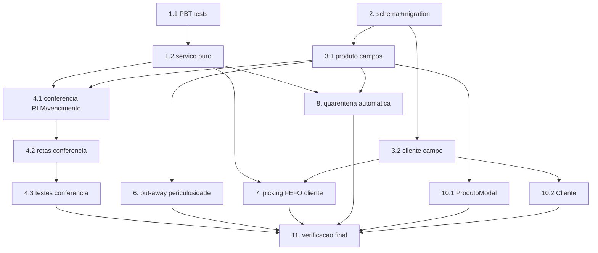

# Implementation Plan: Atributos Logísticos e Shelf Life

## Overview

Fecha 100% o Relatório de Validação Cadastral (`2-RELATORIO DE OCORRENCIAS E
AJUSTES.pdf`). Abrange **dois repositórios**: backend `VisioFab.Wms.Back`
(maioria) e frontend `VisioFab.Wms.Front` (cadastro em ProdutoModal e Cliente).

Abordagem **TDD com property-based (fast-check)** para a lógica pura de datas/
percentuais (`shelf-life-avancado.service.ts`), escrita ANTES da implementação.
Campos novos são **opcionais/nullable** (compatibilidade retroativa). Isolamento
multi-tenant com filtro explícito por `empresaId`. Migração idempotente
(`schema.prisma` + `migrate-prod.ts` no mesmo commit, 2x local).

> **Continuidade entre sessões:** ao concluir CADA tarefa, atualizar a tabela em
> `.kiro/steering/relatorio-validacao-cadastral.md` (status + data + commit).

## Tasks

- [x] 1. Lógica pura de datas/percentuais com property-based tests (TDD) — `VisioFab.Wms.Back`
  - [x]* 1.1 Escrever os testes fast-check ANTES da implementação (Properties 1–7)
    - Criar `src/modules/conferencia-entrada/shelf-life-avancado.service.test.ts`
    - Mín. 100 iterações por propriedade; comentário `// Feature: atributos-logisticos-shelf-life, Property {n}: {texto}`
    - Geradores: datas (fabricação/validade/referência, nulas e futuras), shelfLifeTotal (0..N), percentuais (0..100 e nulos), dias mínimos/limiar (0..N e nulos)
    - **Property 1** (`calcularVencimentoPorFabricacao`) — **Validates: 2.2, 6.1**
    - **Property 2** (`percentualVidaUtilRestante`, limitado/monotônico) — **Validates: 6.2**
    - **Property 3** (`recusaPorPercentualRecebimento`, limiar exato) — **Validates: 3.2, 3.3, 6.3**
    - **Property 4** (`elegivelParaCliente`, limiar exato) — **Validates: 4.2, 4.3, 6.4**
    - **Property 5** (`deveEntrarEmQuarentena`, limiar exato) — **Validates: 5.2, 6.5**
    - **Property 6** (neutralidade sob entradas ausentes) — **Validates: 6.6**
    - **Property 7** (combinação de critérios no recebimento) — **Validates: 3.5**
  - [x] 1.2 Implementar `shelf-life-avancado.service.ts`
    - `calcularVencimentoPorFabricacao`, `diasEntre`, `percentualVidaUtilRestante`, `recusaPorPercentualRecebimento`, `elegivelParaCliente`, `deveEntrarEmQuarentena`
    - Todas puras, determinísticas, neutras sob nulos (nunca lançam)
    - Rodar 1.1 até as 7 propriedades passarem
    - _Requirements: 2.2, 3.2, 3.3, 4.2, 4.3, 5.2, 6.1, 6.2, 6.3, 6.4, 6.5, 6.6_

- [x] 2. Schema Prisma + migração idempotente no MESMO commit — `VisioFab.Wms.Back`
  - Adicionar em `Produto`: `periculosidade` (String? VarChar(20)), `shelfLifeTotalDias` (Int?), `percentualVidaUtilMinimoRecebimento` (Decimal? 5,2), `diasQuarentenaVencimento` (Int?)
  - Adicionar em `Cliente`: `shelfLifeMinimoExpedicaoDias` (Int?)
  - `migrate-prod.ts`: `ADD COLUMN IF NOT EXISTS` para as 5 colunas (aditivo, nullable)
  - `npx prisma generate`; testar `npx tsx prisma/migrate-prod.ts` **2x local** sem erro
  - Commit único: `schema.prisma` + `migrate-prod.ts`
  - _Requirements: 7.1, 7.2, 7.3_

- [x] 3. Produto e Cliente: aceitar os campos novos — `VisioFab.Wms.Back`
  - [x] 3.1 `produto.routes.ts` (POST e PUT): schema Zod com `periculosidade` (enum), `shelfLifeTotalDias`, `percentualVidaUtilMinimoRecebimento` (0–100), `diasQuarentenaVencimento`; todos opcionais/nullable; filtro por `empresaId` preservado
    - _Requirements: 1.1, 1.2, 3.1, 5.1, 7.4_
  - [x] 3.2 `cliente.routes.ts` (POST e PUT): `shelfLifeMinimoExpedicaoDias` (int≥0, nullable); filtro por `empresaId`
    - _Requirements: 4.1, 7.4_

- [x] 4. Conferência de entrada: RLM % + vencimento por fabricação — `VisioFab.Wms.Back`
  - [x] 4.1 Estender `validar-validade-produto.service.ts`
    - Novas entradas: `dataFabricacao?`, `shelfLifeTotalDias?`, `percentualVidaUtilMinimo?`
    - Calcular vencimento por fabricação quando validade ausente (Req 2.2); aviso de divergência (Req 2.3); rejeitar fabricação futura (Req 2.5)
    - Novo bloqueio `RLM_PERCENTUAL` via `recusaPorPercentualRecebimento` (Req 3.2/3.3); aplicar junto com dias quando ambos configurados (Req 3.5)
    - Reusar a lógica pura da Tarefa 1 (não duplicar datas)
    - _Requirements: 2.2, 2.3, 2.5, 3.2, 3.3, 3.4, 3.5_
  - [x] 4.2 `conferencia-entrada.routes.ts`: passar os novos campos do produto (`shelfLifeTotalDias`, `percentualVidaUtilMinimoRecebimento`) ao helper nos três canais. NOTA: a captura da **data de fabricação** na UI da doca ficou como pendência de frontend (o helper já a suporta); o RLM % já opera com a validade digitada.
    - _Requirements: 3.3, 3.6_
  - [ ]* 4.3 Testes de integração da conferência (vencimento por fabricação; RLM %; dois critérios juntos; fabricação futura → erro; isolamento)
    - _Requirements: 2.2, 2.3, 2.5, 3.2, 3.3, 3.5, 3.6_

- [ ] 5. Checkpoint — backend de cadastro + recebimento
  - Ensure all tests pass, ask the user if questions arise.

- [x] 6. Put-away por periculosidade — `VisioFab.Wms.Back`
  - `areaCompativel` (RF004) ganhou 3º critério: produto PERIGOSO/INFLAMAVEL só é compatível com `Endereco.permitePerigosos=true`. Novo campo `Endereco.permitePerigosos` (schema+migração+cadastro). Aplicado em todas as camadas do put-away.
  - _Requirements: 1.3, 1.4, 1.5_
  - [ ]* 6.1 Teste de integração do put-away por periculosidade (perigoso não vai a endereço comum; nulo mantém; isolamento)
    - _Requirements: 1.3, 1.4, 1.5_

- [x] 7. Picking/FEFO por dias mínimos do cliente — `VisioFab.Wms.Back`
  - `selecionarEnderecosFIFO` recebe `diasMinimosCliente` e pula lotes inelegíveis via `elegivelParaCliente`. `iniciarOnda` resolve o cliente por pedido e usa o critério mais restritivo por produto. Cliente sem regra → FEFO atual.
  - _Requirements: 4.2, 4.3, 4.4, 4.5_
  - [ ]* 7.1 Teste de integração do FEFO por cliente (pula lote curto; nenhum elegível → bloqueio; sem regra → FEFO atual)
    - _Requirements: 4.2, 4.3, 4.4_

- [x] 8. Quarentena automática por dias a vencer — `VisioFab.Wms.Back`
  - `selecionarEnderecosFIFO` pula lotes a ≤ `produto.diasQuarentenaVencimento` do vencimento (via `deveEntrarEmQuarentena`) E passou a EXCLUIR saldos `bloqueado=true` (o picking antes NÃO respeitava bloqueio de lote — lacuna corrigida). NOTA: marcação em massa por job/rotina de `SaldoEndereco.bloqueado` fica como melhoria futura; a exclusão na seleção já garante que lotes próximos do vencimento não sejam separados.
  - _Requirements: 5.2, 5.3, 5.4, 5.5, 5.6_
  - [ ]* 8.1 Teste de integração da quarentena automática (lote ≤ limiar bloqueado e não selecionável; sem limiar → sem bloqueio; motivo distinguível)
    - _Requirements: 5.2, 5.3, 5.5_

- [ ] 9. Checkpoint — backend WMS (put-away, picking, quarentena)
  - Ensure all tests pass, ask the user if questions arise.

- [ ] 10. Frontend — cadastro dos novos atributos — `VisioFab.Wms.Front`
  - [ ] 10.1 `ProdutoModal.tsx`: na aba de logística/validade, adicionar Periculosidade (Select), Shelf Life Total (dias), RLM % (0–100) e Dias de Quarentena; enviar no POST e PUT; exibir valores ao editar
    - _Requirements: 1.1, 2.1, 3.1, 5.1_
  - [ ] 10.2 Cadastro de Cliente: adicionar campo "Shelf life mínimo p/ expedição (dias)"; enviar no POST e PUT; exibir ao editar
    - _Requirements: 4.1_

- [ ] 11. Verificação final e atualização do steering
  - `VisioFab.Wms.Back`: vitest do `shelf-life-avancado.service.test.ts` (Properties 1–7) + integração passando; `tsc --noEmit` sem novos erros além da baseline; `migrate-prod.ts` 2x local
  - `VisioFab.Wms.Front`: `tsc --noEmit` sem novos erros; `get_diagnostics` limpo nos arquivos tocados
  - Atualizar `.kiro/steering/relatorio-validacao-cadastral.md`: marcar os blocos 2 (periculosidade) e 3 (shelf lifes/quarentena) como ✅ com data e commits
  - _Requirements: 7.1, 7.2, 7.3, 7.4_

## Task Dependency Graph



```json
{
  "waves": [
    { "id": 0, "tasks": ["1.1", "2"] },
    { "id": 1, "tasks": ["1.2", "3.1", "3.2"] },
    { "id": 2, "tasks": ["4.1", "6", "7", "8", "10.1", "10.2"] },
    { "id": 3, "tasks": ["4.2"] },
    { "id": 4, "tasks": ["4.3", "6.1", "7.1", "8.1"] },
    { "id": 5, "tasks": ["11"] }
  ]
}
```

## Notes

- **Dois repositórios**: Tarefas 1–8 no backend `VisioFab.Wms.Back`; Tarefa 10 no frontend `VisioFab.Wms.Front`; Tarefa 11 verifica ambos.
- **Fonte do pedido**: `2-RELATORIO DE OCORRENCIAS E AJUSTES.pdf`. **Rastreamento**: `.kiro/steering/relatorio-validacao-cadastral.md` (auto-incluído toda sessão) — atualizar ao concluir cada tarefa.
- **Migration obrigatória**: colunas aditivas/nullable; `schema.prisma` + `migrate-prod.ts` no mesmo commit, 2x local; nenhum dado real removido.
- **Compatibilidade retroativa**: todos os campos são opcionais; produtos/clientes existentes mantêm o comportamento até serem preenchidos.
- **Isolamento multi-tenant**: filtro explícito por `empresaId` (não confiar só no `prismaScoped`).
- **Reuso**: NÃO recriar quarentena/bloqueio (usar o mecanismo existente do WMS); estender `validar-validade-produto.service.ts` (não duplicar lógica de datas).
- **Baseline `tsc`**: ~65–85 erros pré-existentes no backend; não aumentar.
- Nesta sessão o usuário autorizou commit direto na `main` com deploy automático (Render/Vercel).
- Tarefas com `*` são testes (opcionais para MVP, mas 1.1 é a base do TDD).
