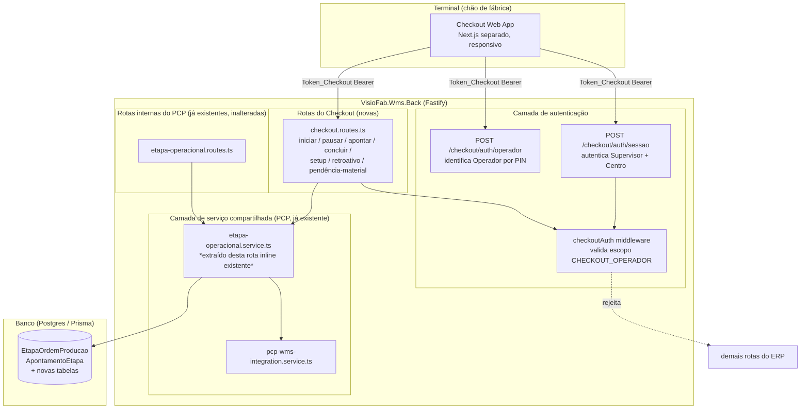
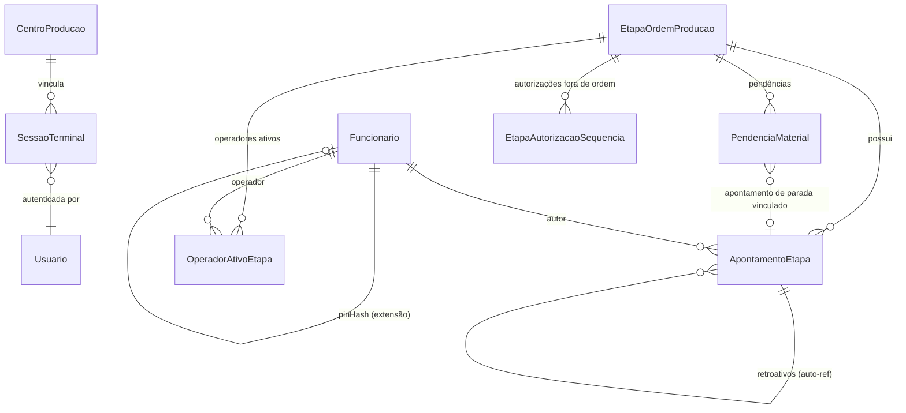
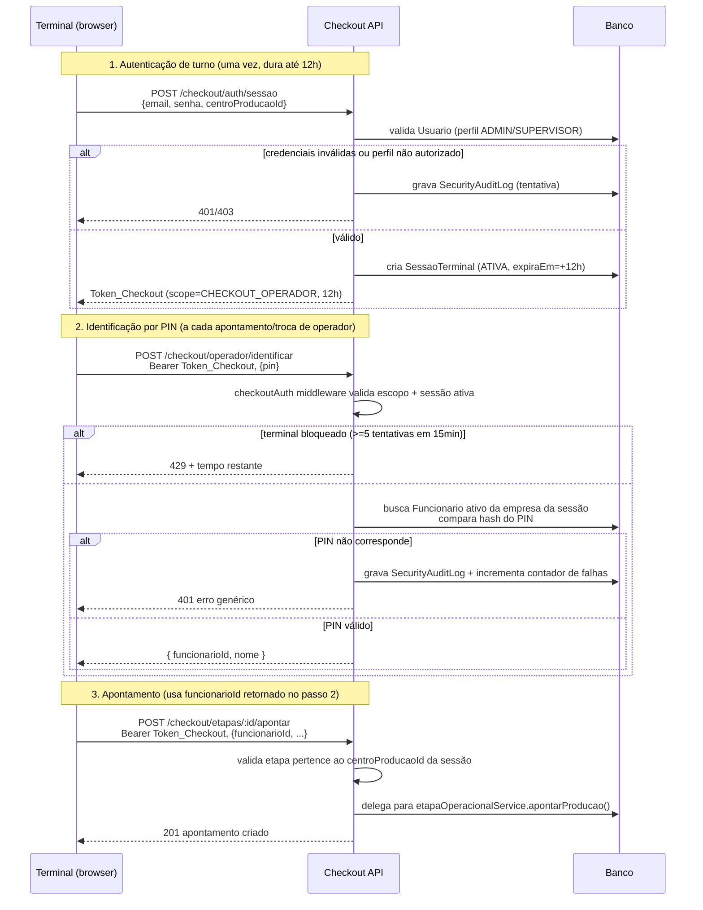

# Design Document

## Overview

O Checkout de Apontamento é uma aplicação web nova e separada do ERP
Vizor, que reaproveita o modelo de dados e as rotas operacionais do módulo
PCP já existente (`EtapaOrdemProducao`, `ApontamentoEtapa`,
`etapa-operacional.routes.ts`) em vez de duplicá-los. A ideia central de
design é: **o Checkout é uma nova casca de autenticação e um conjunto de
telas simplificadas em cima de operações de negócio que já existem e já
funcionam** (iniciar/pausar/apontar/concluir etapa). O que o Checkout
adiciona de fato ao domínio é:

1. Um novo modelo de autenticação em dois níveis (Terminal + Operador),
   com um token de escopo restrito, isolado do login padrão do ERP.
2. Extensões pontuais e não-destrutivas ao modelo de dados existente
   (`Fonte_Apontamento`, tipos novos de apontamento, retroatividade,
   pendência de material, múltiplos operadores, indicador de parada
   planejada) — nenhuma tabela existente perde campo ou comportamento.
3. Regras de negócio novas que não existiam no painel interno (bloqueio de
   sequência entre etapas, setup como evento próprio, alerta de parada
   prolongada) — implementadas como uma camada de validação que roda
   *antes* de delegar para a lógica das rotas existentes.

O design deliberadamente **não recria** a lógica de `iniciar`/`pausar`/
`apontar`/`concluir` — as rotas novas do Checkout chamam a mesma camada de
serviço/rota interna (via chamada de função de service compartilhado, não
HTTP interno) depois de aplicar suas validações extras, para nunca haver
duas implementações divergentes do mesmo cálculo (esse é exatamente o
padrão de bug já documentado no histórico do projeto — `criarEntradaProducao()`
duplicada — que este design evita repetir).

## Architecture

### Visão de alto nível



**Decisão de design**: a lógica hoje inline em
`etapa-operacional.routes.ts` (`iniciar`, `pausar`, `apontar`, `concluir`)
será extraída para um `etapa-operacional.service.ts` novo, com funções
puras de negócio (`iniciarEtapa()`, `pausarEtapa()`, `apontarProducao()`,
`concluirEtapa()`) que recebem `empresaId` explícito e retornam o resultado
— e tanto a rota `/pcp/etapas/:id/...` existente quanto as rotas novas do
Checkout chamam essas mesmas funções. Isso é uma refatoração necessária
(não cosmética): sem ela, qualquer regra nova do Checkout (bloqueio de
sequência, setup obrigatório, etc.) teria que ser copiada para dois lugares
ou o Checkout teria que fazer uma chamada HTTP interna para si mesmo — ambas
as opções são o padrão de duplicação já documentado como fonte de bugs
reais neste projeto (`pcp-wms-integration.service.ts` vs lógica inline).

### Por que dois níveis de autenticação

- **Sessão_Terminal (Supervisor → Terminal)**: dura um turno (até 12h),
  evita que cada operador precise digitar credenciais completas de usuário
  a cada apontamento. Emite o `Token_Checkout`.
- **Identificação de Operador (PIN)**: não gera novo token — é um dado
  passado em cada requisição de apontamento (`funcionarioId` + PIN
  validado no momento da ação, não uma sessão própria), porque o mesmo
  Terminal pode ser usado por operadores diferentes minuto a minuto
  (Requirement 10, múltiplos operadores simultâneos).

Esse desenho evita dois erros comuns: (a) tratar o PIN como login pesado
(geraria fricção incompatível com Requirement 14 — uso rápido, mãos sujas),
e (b) confiar apenas na Sessão_Terminal para autoria dos apontamentos (não
saberíamos *quem* apontou, quebrando Requirement 2.6 e toda a auditoria do
Requirement 16).

## Components and Interfaces

### Backend — novos arquivos

```
src/modules/checkout/
├── checkout-auth.routes.ts       # POST /sessao, POST /operador, PATCH /sessao/trocar-centro
├── checkout-auth.middleware.ts   # valida escopo CHECKOUT_OPERADOR + carrega SessaoTerminal
├── checkout.routes.ts            # rotas operacionais do checkout (ver tabela abaixo)
├── checkout.service.ts           # regras exclusivas do checkout (setup, retroativo,
│                                  #   pendência material, bloqueio de sequência, alerta)
├── pin-operador.service.ts       # hash/verificação de PIN + rate limiting por terminal
└── sessao-terminal.service.ts    # criação/expiração/troca de centro da Sessão_Terminal

src/modules/pcp/
└── etapa-operacional.service.ts  # NOVO — extrai a lógica de negócio hoje inline em
                                   #   etapa-operacional.routes.ts, para ser reutilizada
                                   #   por checkout.routes.ts sem duplicação
```

### Rotas novas do Checkout

| Método | Rota | Reaproveita | Descrição |
|---|---|---|---|
| POST | `/checkout/auth/sessao` | — (novo) | Supervisor autentica, informa `centroProducaoId`; cria `SessaoTerminal`, emite `Token_Checkout`. Req. 1.1–1.3 |
| PATCH | `/checkout/auth/sessao/trocar-centro` | — (novo) | Supervisor troca o centro vinculado à sessão ativa. Req. 1.6 |
| DELETE | `/checkout/auth/sessao` | — (novo) | Encerra a sessão manualmente. |
| POST | `/checkout/operador/identificar` | — (novo) | Valida PIN, retorna `funcionarioId` para uso nas próximas chamadas (sem gerar token novo). Req. 2, 4 |
| GET | `/checkout/painel` | — (novo, filtro reduzido do painel PCP) | Lista etapas do `Centro_Producao` da sessão. Req. 5.4 |
| PATCH | `/checkout/etapas/:id/iniciar` | `etapaOperacionalService.iniciarEtapa()` | Req. 5.1–5.3 |
| POST | `/checkout/etapas/:id/setup/iniciar` | — (novo) | Abre `ApontamentoEtapa` tipo `SETUP`. Req. 6.1–6.2 |
| PATCH | `/checkout/etapas/:id/setup/finalizar` | — (novo) | Fecha o `SETUP` aberto, calcula duração. Req. 6.3 |
| POST | `/checkout/etapas/:id/apontar` | `etapaOperacionalService.apontarProducao()` | Produção/Perda/Retrabalho + foto. Req. 7 |
| PATCH | `/checkout/etapas/:id/pausar` | `etapaOperacionalService.pausarEtapa()` | + indicador planejada/não planejada. Req. 8 |
| PATCH | `/checkout/etapas/:id/concluir` | `etapaOperacionalService.concluirEtapa()` | + bloqueio de sequência antes de delegar. Req. 9 |
| POST | `/checkout/etapas/:id/operadores/entrar` | — (novo) | Registra operador ativo na etapa. Req. 10.1–10.2 |
| PATCH | `/checkout/etapas/:id/operadores/saida` | — (novo) | Registra saída de operador, preserva demais. Req. 10.3 |
| GET | `/checkout/etapas/:id/operadores` | — (novo) | Lista operadores ativos. Req. 10.4 |
| POST | `/checkout/apontamentos/:id/retroativo` | — (novo) | Cria `Apontamento_Retroativo` vinculado, requer autorização de Supervisor. Req. 11 |
| POST | `/checkout/etapas/:id/pendencia-material` | — (novo) | Cria `Pendencia_Material` + apontamento `PARADA`/`FALTA_MATERIAL`. Req. 12 |
| PATCH | `/checkout/pendencias-material/:id/resolver` | — (novo) | Marca pendência resolvida. Req. 12.4 |
| GET | `/checkout/etapas/:id/apontamentos` | reaproveita query de `GET /pcp/etapas/:id/apontamentos` | Histórico. Req. 16.1, 16.3 |
| GET | `/checkout/supervisor/alertas` | — (novo) | Etapas em alerta de parada prolongada. Req. 13 |

**Nenhuma rota existente de `/pcp/etapas/...` é removida ou alterada em
sua assinatura pública** — apenas a lógica interna migra para o service
compartilhado.

### Frontend — novo app web (esboço de estrutura)

Aplicação Next.js separada (não faz parte do `VisioFab.Wms.Front`
existente), com deploy e domínio próprios, focada em telas de toque único:

```
VisioFab.Checkout/                      # novo repositório/app, ou novo diretório
├── src/
│   ├── app/
│   │   ├── login-terminal/page.tsx     # tela de autenticação do Supervisor (Req 1)
│   │   ├── identificar-operador/page.tsx # teclado numérico de PIN (Req 2, 14)
│   │   ├── painel/page.tsx             # fila de etapas do centro (Req 5.4)
│   │   ├── etapa/[id]/
│   │   │   ├── page.tsx                # tela de ação principal (1 botão em destaque, Req 14.2)
│   │   │   ├── apontar/page.tsx        # produção/perda/retrabalho + foto (Req 7)
│   │   │   ├── pausar/page.tsx         # motivo + planejada/não planejada (Req 8)
│   │   │   └── pendencia-material/page.tsx # Req 12
│   │   └── supervisor/
│   │       ├── alertas/page.tsx        # paradas prolongadas (Req 13)
│   │       └── autorizar-retroativo/page.tsx # Req 11
│   ├── lib/
│   │   ├── checkout-api-client.ts      # axios com Token_Checkout, refresh de sessão
│   │   └── pin-keypad.tsx              # componente de teclado numérico grande (Req 14.2)
│   └── contexts/
│       └── sessao-terminal-context.tsx # centro vinculado, tempo restante da sessão
```

Layout responsivo mobile-first (Requirement 14.1), com botões de toque
mínimo de 48x48px (padrão de acessibilidade para controles de toque) e no
máximo 3-4 campos visíveis por tela (Requirement 14.3).

**Nota de segurança**: como o Checkout é uma aplicação web nova e exposta
por URL própria, autenticada, é importante reforçar que toda rota fora do
fluxo de `/checkout/auth/*` exige o `Token_Checkout` — não deve existir
nenhuma rota do módulo aberta sem autenticação (ver seção Error Handling e
Correctness Properties abaixo).

## Data Models

Todas as adições abaixo seguem o padrão idempotente documentado em
`.kiro/steering/database-migrations.md` deste projeto: toda alteração em
`schema.prisma` terá o `ALTER TABLE`/`CREATE TABLE` equivalente em
`prisma/migrate-prod.ts`, usando `ADD COLUMN IF NOT EXISTS` / `CREATE TABLE
IF NOT EXISTS` / `CREATE INDEX IF NOT EXISTS`, testado localmente 2x antes
do commit conjunto.

### Extensões a modelos existentes

**`Funcionario`** — novo campo para PIN (hash, nunca texto puro):

```prisma
model Funcionario {
  // ...campos existentes inalterados...
  pinHash    String?  @map("pin_hash") @db.VarChar(200)
  pinAtivo   Boolean  @default(false) @map("pin_ativo")
}
```

Migration equivalente:
```sql
ALTER TABLE "funcionario" ADD COLUMN IF NOT EXISTS "pin_hash" VARCHAR(200);
ALTER TABLE "funcionario" ADD COLUMN IF NOT EXISTS "pin_ativo" BOOLEAN DEFAULT false;
```

**`ApontamentoEtapa`** — extensão para novos tipos, origem, retroatividade
e vínculo com operadores/pendência (todos os campos são opcionais/com
default, preservando 100% de compatibilidade com os apontamentos já
existentes em produção):

```prisma
model ApontamentoEtapa {
  // ...campos existentes inalterados (tipo, quantidadeProduzida, etc.)...
  // `tipo` passa a aceitar também: SETUP, RETRABALHO (além de PRODUCAO,
  // PERDA, PARADA, RETOMADA já existentes) — sem migração de dados, é
  // apenas um novo valor de string, não um enum de banco.

  quantidadeRetrabalho Decimal   @default(0) @map("quantidade_retrabalho") @db.Decimal(12, 4)

  // Requirement 15 — origem do apontamento
  fonteApontamento     String    @default("MANUAL_OPERADOR") @map("fonte_apontamento") @db.VarChar(30)
  // MANUAL_OPERADOR | INTEGRACAO_MAQUINA

  // Requirement 8 — planejada vs não planejada
  paradaPlanejada      Boolean?  @map("parada_planejada")

  // Requirement 6 — setup como evento com início/fim
  setupInicio          DateTime? @map("setup_inicio")
  setupFim             DateTime? @map("setup_fim")
  setupDuracaoMinutos  Int?      @map("setup_duracao_minutos")

  // Requirement 11 — apontamento retroativo (auto-referência)
  apontamentoOrigemId  String?             @map("apontamento_origem_id")
  apontamentoOrigem    ApontamentoEtapa?   @relation("ApontamentoRetroativo", fields: [apontamentoOrigemId], references: [id])
  retroativos          ApontamentoEtapa[]  @relation("ApontamentoRetroativo")
  motivoRetroativo      String?  @map("motivo_retroativo") @db.Text
  autorizadoPorUsuarioId String? @map("autorizado_por_usuario_id")

  // Requirement 15 — permite ausência de operador quando vier de integração
  // de máquina. `funcionarioId` já era opcional no schema original.

  @@index([fonteApontamento])
  @@index([apontamentoOrigemId])
}
```

Migration equivalente (idempotente):
```sql
ALTER TABLE "apontamento_etapa" ADD COLUMN IF NOT EXISTS "quantidade_retrabalho" DECIMAL(12,4) DEFAULT 0;
ALTER TABLE "apontamento_etapa" ADD COLUMN IF NOT EXISTS "fonte_apontamento" VARCHAR(30) DEFAULT 'MANUAL_OPERADOR';
ALTER TABLE "apontamento_etapa" ADD COLUMN IF NOT EXISTS "parada_planejada" BOOLEAN;
ALTER TABLE "apontamento_etapa" ADD COLUMN IF NOT EXISTS "setup_inicio" TIMESTAMP(3);
ALTER TABLE "apontamento_etapa" ADD COLUMN IF NOT EXISTS "setup_fim" TIMESTAMP(3);
ALTER TABLE "apontamento_etapa" ADD COLUMN IF NOT EXISTS "setup_duracao_minutos" INTEGER;
ALTER TABLE "apontamento_etapa" ADD COLUMN IF NOT EXISTS "apontamento_origem_id" TEXT;
ALTER TABLE "apontamento_etapa" ADD COLUMN IF NOT EXISTS "motivo_retroativo" TEXT;
ALTER TABLE "apontamento_etapa" ADD COLUMN IF NOT EXISTS "autorizado_por_usuario_id" TEXT;
CREATE INDEX IF NOT EXISTS "idx_apontamento_etapa_fonte" ON "apontamento_etapa"("fonte_apontamento");
CREATE INDEX IF NOT EXISTS "idx_apontamento_etapa_origem" ON "apontamento_etapa"("apontamento_origem_id");
-- FK de auto-referência via try/catch individual (Postgres não tem
-- ADD CONSTRAINT IF NOT EXISTS):
try { ALTER TABLE "apontamento_etapa" ADD CONSTRAINT "fk_apontamento_origem"
  FOREIGN KEY ("apontamento_origem_id") REFERENCES "apontamento_etapa"("id"); } catch {}
```

**`EtapaOrdemProducao`** — nenhuma alteração de coluna própria. O bloqueio
de sequência (Requirement 9) e a autorização de conclusão fora de ordem
são resolvidos consultando as etapas irmãs por `sequencia`/`ordemProducaoId`
(já existentes) — não precisa de novo campo, exceto um registro de
autorização, coberto por `LogOrdemProducao` (já existente, reaproveitado
com uma nova `observacao` padronizada) ou pela tabela `EtapaAutorizacao`
abaixo.

### Novos modelos

**`SessaoTerminal`** — sessão de turno que vincula um Terminal a um
Centro_Producao:

```prisma
model SessaoTerminal {
  id                 String    @id @default(uuid())
  empresaId          String    @map("empresa_id")
  centroProducaoId   String    @map("centro_producao_id")
  centroProducao     CentroProducao @relation(fields: [centroProducaoId], references: [id])
  autenticadaPorUsuarioId String @map("autenticada_por_usuario_id")
  status             String    @default("ATIVA") @db.VarChar(20) // ATIVA | EXPIRADA | ENCERRADA
  criadaEm           DateTime  @default(now()) @map("criada_em")
  expiraEm           DateTime  @map("expira_em") // criadaEm + 12h
  encerradaEm        DateTime? @map("encerrada_em")

  @@index([empresaId, status])
  @@index([centroProducaoId, status])
  @@map("sessao_terminal")
}
```

**`PendenciaMaterial`** — Requirement 12:

```prisma
model PendenciaMaterial {
  id                     String   @id @default(uuid())
  empresaId              String   @map("empresa_id")
  etapaOrdemProducaoId   String   @map("etapa_ordem_producao_id")
  apontamentoParadaId    String?  @map("apontamento_parada_id")
  descricao              String?  @db.Text
  status                 String   @default("PENDENTE") @db.VarChar(20) // PENDENTE | RESOLVIDA
  criadaEm               DateTime @default(now()) @map("criada_em")
  resolvidaEm            DateTime? @map("resolvida_em")
  resolvidaPorUsuarioId  String?  @map("resolvida_por_usuario_id")

  @@index([empresaId, status])
  @@index([etapaOrdemProducaoId])
  @@map("pendencia_material")
}
```

**`OperadorAtivoEtapa`** — Requirement 10 (múltiplos operadores
simultâneos):

```prisma
model OperadorAtivoEtapa {
  id                   String    @id @default(uuid())
  empresaId            String    @map("empresa_id")
  etapaOrdemProducaoId String    @map("etapa_ordem_producao_id")
  funcionarioId        String    @map("funcionario_id")
  entradaEm             DateTime  @default(now()) @map("entrada_em")
  saidaEm               DateTime? @map("saida_em")

  @@index([etapaOrdemProducaoId, saidaEm])
  @@map("operador_ativo_etapa")
}
```

**`EtapaAutorizacaoSequencia`** — Requirement 9.4 (autorização explícita de
Supervisor para concluir fora de ordem):

```prisma
model EtapaAutorizacaoSequencia {
  id                    String   @id @default(uuid())
  empresaId             String   @map("empresa_id")
  etapaOrdemProducaoId  String   @map("etapa_ordem_producao_id")
  etapaBloqueadoraId    String   @map("etapa_bloqueadora_id")
  autorizadoPorUsuarioId String  @map("autorizado_por_usuario_id")
  criadaEm              DateTime @default(now()) @map("criada_em")

  @@index([etapaOrdemProducaoId])
  @@map("etapa_autorizacao_sequencia")
}
```

Migration equivalente para as 4 tabelas novas — 4 blocos `CREATE TABLE IF
NOT EXISTS` no padrão já usado em `migrate-prod.ts` (colunas TEXT/VARCHAR/
TIMESTAMP/BOOLEAN, sem FK inline — FKs adicionadas em `ALTER TABLE ...
ADD CONSTRAINT` dentro de `try/catch` individual, seguindo o padrão do
projeto), com índice em `empresaId` + campo de filtro mais comum de cada
tabela.

### Diagrama de entidades (incremento)



## Autenticação — Arquitetura de Dois Níveis

### Escopo do token

Reaproveitando o padrão já existente no projeto para tokens de escopo
restrito (`PortalUser`/`scope: 'portal'` em `portal-auth.middleware.ts`), o
Checkout usa a mesma estratégia com um escopo próprio:

```typescript
// checkout-auth.middleware.ts
export interface CheckoutTokenPayload {
  scope: 'CHECKOUT_OPERADOR'
  sessaoTerminalId: string
  empresaId: string
  centroProducaoId: string
  autenticadaPorUsuarioId: string
}
```

O token é assinado pelo mesmo `app.jwt` (chave compartilhada — não é
necessário um segredo diferente, o campo `scope` já é suficiente para
segregação), mas com expiração de 12h (Requirement 1.5), consistente com a
duração máxima da `SessaoTerminal`.

**Regra de rejeição cruzada (Requirement 3.2, 3.3)**: o hook `authenticate`
já existente (usado por todas as rotas do ERP) passa a verificar
explicitamente que `payload.scope !== 'CHECKOUT_OPERADOR'` antes de aceitar
o request — e o novo `checkoutAuth` middleware rejeita qualquer token cujo
`scope` seja diferente de `CHECKOUT_OPERADOR`. Isso é simétrico e cobre os
dois sentidos exigidos pelo requisito.

### Fluxo de autenticação Terminal + Operador



**Por que a identificação por PIN não gera um segundo token**: gerar um
token por PIN implicaria gerenciar dois tokens simultâneos no cliente
(Terminal + Operador) e não resolveria o caso de múltiplos operadores
simultâneos na mesma etapa (Requirement 10) — o PIN é validado a
cada ação relevante e o resultado (`funcionarioId`) é anexado ao corpo da
requisição, sempre sob o guarda-chuva do `Token_Checkout` da sessão do
Terminal.

### Rate limiting e bloqueio (Requirement 4)

Implementado como contador em memória/tabela por `sessaoTerminalId`
(similar ao `@fastify/rate-limit` já usado globalmente no projeto, mas com
janela e escopo dedicados porque a regra é "5 tentativas por Terminal", não
por IP): usa uma tabela leve `TentativaPinBloqueio` (ou reaproveita
`SecurityAuditLog` com uma consulta agregada de tentativas
`tipo='CHECKOUT_PIN_FALHA'` nos últimos 15 minutos filtradas por
`sessaoTerminalId`) — decisão de implementação a confirmar na fase de
tasks, ambas cobrem os critérios de aceitação sem exigir nova
infraestrutura.

## Isolamento Multi-tenant

Este é o ponto de maior atenção do design, dado o histórico real de bugs de
vazamento neste projeto (`ATENCAO-pontos-verificar.md`, seção 2). Regras
aplicadas em **todas** as rotas novas do Checkout:

1. **`SessaoTerminal` carrega o `empresaId`** determinado no momento da
   autenticação (`empresaId` do `Usuario` Supervisor, mesmo padrão do login
   normal) — e esse `empresaId` fica embutido no `Token_Checkout`. **Toda
   rota do Checkout usa esse `empresaId` do token, nunca um `empresaId`
   implícito de outra fonte.**
2. **`EtapaOrdemProducao` não tem `empresaId` próprio** (mesma situação já
   documentada para as rotas PCP existentes) — toda consulta a uma etapa
   pelo Checkout filtra explicitamente:
   ```ts
   const etapa = await prisma.etapaOrdemProducao.findFirst({
     where: {
       id,
       centroProducaoId: sessao.centroProducaoId, // Requirement 5.2, 17.1
       ordemProducao: { empresaId: checkoutUser.empresaId }, // Requirement 17.1, 17.2
     },
   })
   if (!etapa) return reply.status(404).send({ message: 'Etapa não encontrada' })
   ```
   O filtro por `centroProducaoId` da sessão é **adicional** ao filtro por
   empresa (não substitui) — garante Requirement 5.2 (etapa fora do centro
   do terminal) e Requirement 17.2 (não revelar existência em outra
   empresa) com a mesma resposta 404 em ambos os casos, propositalmente
   indistinguível.
3. **Ao criar `ApontamentoEtapa`, `PendenciaMaterial`, `SessaoTerminal`,
   `OperadorAtivoEtapa`, `EtapaAutorizacaoSequencia`**, o `empresaId`
   gravado é sempre o da **entidade de negócio real** (a `OrdemProducao` da
   etapa, resolvida via o mesmo filtro acima), nunca o `empresaId` do
   `Usuario` que autenticou a `SessaoTerminal` — replicando exatamente a
   correção já aplicada em `criarEntradaProducao()` (ver histórico do bug
   em `ATENCAO-pontos-verificar.md`, linha da sessão anterior sobre PCP→WMS).
4. **Nenhum destes novos modelos entra em `ISOLATED_MODELS`** de
   `prisma-tenant.ts` nesta fase — as rotas do Checkout usam `prisma`
   direto com filtro manual e explícito (mesmo padrão já usado por
   `etapa-operacional.routes.ts`), porque o Checkout não usa
   `request.prismaScoped` (seu middleware de auth é próprio,
   `checkoutAuth`, distinto do fluxo `authenticate` + `tenant-context` do
   ERP). Isso é uma decisão consciente, não uma omissão: documentada aqui
   para que qualquer revisão futura saiba que o filtro manual é
   *intencional* e cada rota deve ser auditada individualmente (mesma
   lição da seção 2 do `ATENCAO-pontos-verificar.md`).
5. **PIN do operador**: a busca do `Funcionario` pelo PIN filtra por
   `empresaId` da sessão (Requirement 2.2, 2.3) — um PIN de 6 dígitos não é
   globalmente único entre empresas, só dentro da empresa do Terminal.

## Correctness Properties

*A property is a characteristic or behavior that should hold true across
all valid executions of a system — essentially, a formal statement about
what the system should do. Properties serve as the bridge between
human-readable specifications and machine-verifiable correctness
guarantees.*

### Property 1: Apontamentos nunca são apagados ou sobrescritos

*For any* sequência de operações do Checkout sobre uma Etapa (incluindo
apontamentos retroativos), o conjunto de `ApontamentoEtapa` existentes
antes da operação permanece um subconjunto do conjunto de `ApontamentoEtapa`
depois da operação — nenhum `id` de apontamento já persistido deixa de
existir ou tem seus campos de negócio (`quantidadeProduzida`,
`quantidadePerda`, `tipo`, `dataHora`) alterados por uma operação
subsequente.

**Validates: Requirements 11.1**

### Property 2: Totais da etapa são sempre reconciliáveis com a soma dos apontamentos (originais + retroativos)

*For any* Etapa e qualquer sequência de apontamentos originais e
retroativos registrados sobre ela, a soma de `quantidadeProduzida` de todos
os `ApontamentoEtapa` (tipo `PRODUCAO`) vinculados à etapa deve ser igual ao
`EtapaOrdemProducao.quantidadeProduzida` da etapa (mesmo raciocínio,
independente, para `quantidadePerda`) — incluindo quando há
`Apontamento_Retroativo` no conjunto.

**Validates: Requirements 7.1, 7.2, 11.4**

### Property 3: Bloqueio de sequência entre etapas dependentes

*For any* Ordem de Produção com duas ou mais etapas em sequência, tentar
concluir uma etapa de sequência N enquanto existir uma etapa de sequência
menor que N (não resultante de desmembramento da mesma sequência) com
status diferente de `CONCLUIDA` deve ser rejeitado, a menos que exista uma
`EtapaAutorizacaoSequencia` correspondente registrada por um Supervisor —
neste caso a conclusão deve ser aceita e a etapa transita para `CONCLUIDA`.

**Validates: Requirements 9.1, 9.2, 9.3, 9.4**

### Property 4: Etapas desmembradas nunca são bloqueadas entre si por sequência

*For any* conjunto de etapas resultantes do mesmo desmembramento (mesma
`sequencia` original, `quantidadePrevista > 0`), concluir qualquer uma
delas nunca deve ser bloqueada pelo status das demais partes desmembradas
da mesma origem.

**Validates: Requirements 9.3**

### Property 5: Isolamento multi-tenant em toda consulta do Checkout

*For any* Etapa, Apontamento, Pendência_Material ou Sessão_Terminal que
não pertença à empresa do `Token_Checkout` de uma requisição, a resposta do
Checkout para qualquer operação de leitura ou escrita sobre esse recurso
deve ser idêntica à resposta obtida para um recurso inexistente
(404, sem distinção observável).

**Validates: Requirements 17.1, 17.2**

### Property 6: Empresa gravada é sempre a da entidade de negócio real

*For any* novo registro criado pelo Checkout (`ApontamentoEtapa`,
`PendenciaMaterial`, `SessaoTerminal`, `OperadorAtivoEtapa`), o `empresaId`
persistido deve ser igual ao `empresaId` da `OrdemProducao`/`Empresa` real
associada à operação, independentemente de qual `empresaId` está no token
do usuário que autenticou a ação (propriedade relevante mesmo quando os
dois valores coincidem — a garantia é que a fonte da verdade é a entidade
de negócio, não o ator).

**Validates: Requirements 17.3**

### Property 7: Escopo do token é respeitado nos dois sentidos

*For any* token JWT válido e qualquer rota do sistema, se o `scope` do
token é `CHECKOUT_OPERADOR`, então requisições a rotas fora do módulo
Checkout devem ser rejeitadas; e se o `scope` do token não é
`CHECKOUT_OPERADOR`, então requisições a rotas do módulo Checkout devem ser
rejeitadas.

**Validates: Requirements 3.2, 3.3**

### Property 8: PIN nunca é aceito fora da empresa do terminal

*For any* PIN de 6 dígitos e qualquer `Funcionario` ativo cujo PIN
corresponda a esse valor, a identificação de operador só deve ter sucesso
se esse `Funcionario` pertencer à mesma empresa da `Sessão_Terminal`
corrente — mesmo que o PIN também corresponda (hash colidindo, ou reuso
intencional do mesmo número) a um `Funcionario` de outra empresa.

**Validates: Requirements 2.2, 2.3, 17.1**

### Property 9: Setup em aberto bloqueia novo setup e bloqueia apontamento de produção

*For any* Etapa com um `ApontamentoEtapa` do tipo `SETUP` sem `setupFim`
preenchido, tentar abrir um segundo `SETUP` para a mesma etapa deve ser
rejeitado, e tentar registrar um apontamento de `PRODUCAO` para a mesma
etapa também deve ser rejeitado até que o `SETUP` em aberto seja
finalizado.

**Validates: Requirements 6.2, 6.4**

### Property 10: Rate limiting de PIN bloqueia e depois libera corretamente

*For any* Terminal que acumule 5 tentativas de identificação de operador
falhas consecutivas, novas tentativas dentro dos 15 minutos seguintes devem
ser rejeitadas com o tempo restante informado; e qualquer tentativa após os
15 minutos (a partir da 5ª falha) deve ser processada normalmente (aceita
ou rejeitada só pela validade do próprio PIN, não mais pelo bloqueio).

**Validates: Requirements 4.1, 4.3, 4.4**

### Property 11: Retrabalho nunca é contado como perda

*For any* apontamento de quantidade retrabalhada registrado numa Etapa, essa
quantidade deve refletir em `quantidadeRetrabalho` (ou campo equivalente) e
nunca incrementar `EtapaOrdemProducao.quantidadePerda`.

**Validates: Requirements 7.3**

### Property 12: Rejeição de quantidades negativas

*For any* apontamento de produção, perda ou retrabalho com quantidade
informada negativa, o Checkout deve rejeitar o registro sem alterar nenhum
total da etapa.

**Validates: Requirements 7.5**

### Property 13: Múltiplos operadores — apontamento vinculado ao autor, demais preservados

*For any* Etapa com dois ou mais operadores ativos, registrar um
apontamento por um desses operadores deve vincular o apontamento apenas ao
operador que o registrou (`funcionarioId` do apontamento) e não deve
alterar o registro de entrada/saída (`OperadorAtivoEtapa`) dos demais
operadores ainda ativos.

**Validates: Requirements 10.5**

### Property 14: Saída de operador preserva os demais ativos

*For any* conjunto de operadores ativos numa Etapa, registrar a saída de um
deles deve marcar `saidaEm` apenas para esse operador, mantendo os demais
sem `saidaEm` preenchido.

**Validates: Requirements 10.3**

### Reflexão sobre redundância (property reflection)

Antes de finalizar a lista acima, as seguintes consolidações foram
aplicadas:
- Uma property separada para "retomada gera ApontamentoEtapa tipo
  RETOMADA" (Requirement 5.3) foi descartada como property dedicada: já é
  coberta implicitamente pela Property 1 (nada é apagado) combinada com
  teste de exemplo direto na Rota reaproveitada existente — o
  comportamento de `iniciarEtapa()` já é validado pelos testes existentes
  do módulo PCP, não precisa duplicar como property nova aqui.
- Property de "histórico exibe retroativo vinculado ao original" (Req.
  16.3) foi absorvida pela Property 1 + Property 2 (a exibição é uma
  consequência direta de nunca apagar e de reconciliar totais
  corretamente) — tratada como teste de exemplo, não property separada.
- Property de "alerta de parada prolongada aparece após 60 min e some ao
  retomar/concluir" (Requirement 13) foi mantida fora da lista de
  properties formais: depende de tempo de relógio (`Date.now()`), o que a
  torna melhor testada com testes de exemplo com tempo controlado (fake
  timers) do que com PBT — ver Testing Strategy.

## Error Handling

| Cenário | Resposta | Requisito |
|---|---|---|
| Credenciais inválidas na autenticação de Sessão_Terminal | 401 + registro em `SecurityAuditLog` | 1.2 |
| Usuário sem perfil ADMIN/SUPERVISOR tenta autenticar Terminal | 403 | 1.3 |
| Token_Checkout expirado/inválido em qualquer rota do Checkout | 401, exige nova autenticação | 3.4 |
| Token de escopo diferente de CHECKOUT_OPERADOR em rota do Checkout | 403 | 3.3 |
| Token CHECKOUT_OPERADOR em rota fora do Checkout | 403 | 3.2 |
| PIN não corresponde a nenhum Funcionario ativo da empresa | 401 genérico (não revela se PIN existe para outro Funcionario) | 2.3 |
| 5ª tentativa de PIN falha consecutiva | 429 + bloqueio 15 min | 4.1 |
| Tentativa durante bloqueio ativo | 429 + tempo restante | 4.3 |
| Etapa fora do Centro_Producao da sessão OU fora da empresa | 404 (mesma resposta para os dois casos) | 5.2, 17.2 |
| Setup já aberto ao tentar abrir novo setup | 400 | 6.2 |
| Apontamento de produção com setup aberto | 400, exige finalizar setup antes | 6.4 |
| Quantidade negativa em apontamento | 400 (Zod) | 7.5 |
| Etapa de sequência anterior não concluída, sem autorização | 400 + qual etapa está pendente | 9.2 |
| OP CANCELADA ou falha de validação na conclusão | Etapa mantém status atual, rota interna de conclusão não é chamada | 9.6 |
| Apontamento_Retroativo sem autorização de Supervisor | 403, bloqueado até autorização | 11.3 |
| PDF/foto em formato ou tamanho inválido | 400/422 (reaproveita validação já existente da rota de apontar) | 7.4 |

## Testing Strategy

### Abordagem dual

- **Testes unitários (exemplos)**: fluxos de autenticação (login válido/
  inválido, expiração de sessão, troca de centro), fluxo de setup
  (abrir/fechar), criação de Pendência_Material, e o caso especial de
  alerta de parada prolongada (usando fake timers para simular 60+
  minutos), e os cenários de Error Handling da tabela acima.
- **Testes de propriedade (property-based)**: as 14 properties listadas
  acima, cobrindo invariantes que precisam valer para qualquer entrada
  (quantidades, sequências de etapas, conjuntos de operadores,
  combinações de apontamentos originais/retroativos).

### Biblioteca e configuração

- Biblioteca: **fast-check** (já usada no ecossistema VisioFab — citada em
  `VisioFab.Wms.Front` como dependência de testes, mantendo consistência
  entre frontend e backend do mesmo projeto).
- Mínimo de **100 iterações** por propriedade (`fc.assert(fc.property(...),
  { numRuns: 100 })`).
- Cada teste de propriedade referencia a propriedade do design via
  comentário/tag no formato:
  **Feature: checkout-apontamento, Property N: {texto da propriedade}**
- Geradores dedicados para os tipos de domínio recorrentes: gerador de
  `EtapaOrdemProducao` sintética com sequência/status/quantidadePrevista
  arbitrários, gerador de sequência de `ApontamentoEtapa` (originais +
  retroativos) para exercitar a Property 1 e Property 2, gerador de
  conjuntos de `OperadorAtivoEtapa` para a Property 13/14.
- Testes que envolvem persistência real usam um banco de teste (ou mocks
  do Prisma Client) — nunca o banco de desenvolvimento/produção; a lógica
  de negócio pura (cálculo de totais, bloqueio de sequência, validação de
  escopo de token) é isolada em funções puras no `service` para poder ser
  testada por propriedade sem precisar de banco a cada execução, seguindo
  o mesmo racional documentado no exemplo de "usar mocks para reduzir
  custo" já presente na convenção deste workflow.

### Testes de integração (não PBT)

- Fluxo completo `POST /checkout/auth/sessao` → `POST
  /checkout/operador/identificar` → `POST /checkout/etapas/:id/apontar`
  contra um banco de teste real, verificando que o apontamento persistido
  tem `fonteApontamento='MANUAL_OPERADOR'` e `empresaId` correto — cobre
  Requirement 15.2 e reforça a Property 6 de ponta a ponta.
- Teste de que a rota `PATCH /checkout/etapas/:id/concluir`, quando é a
  última etapa da OP, efetivamente dispara a mesma integração com WMS já
  testada pela suíte existente de `etapa-operacional.routes.ts`
  (Requirement 9.5) — sem duplicar a suíte, apenas confirmando que a
  chamada ao service compartilhado ocorre.
- Teste de rejeição cruzada de escopo (Property 7) contra pelo menos uma
  rota real do ERP e uma rota real do Checkout, além da versão property-
  based sobre a lógica do middleware isoladamente.
