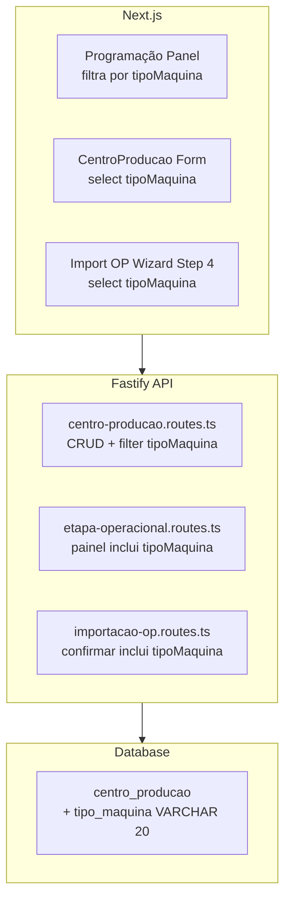

# Design Document: Classificação Tipo Máquina

## Overview

Esta feature adiciona um campo explícito `tipoMaquina` ao modelo `CentroProducao` para classificar máquinas por tipo funcional (IMPRESSAO, ACABAMENTO, CORTADEIRA, COLAGEM, VERNIZ). A classificação determinística substitui as heurísticas baseadas em keywords na descrição que o frontend usa para agrupar centros nas abas da Programação.

### Decisões de Design

1. **Campo VARCHAR(20) nullable** ao invés de enum nativo do PostgreSQL — alinha com o padrão existente do campo `tipo` no mesmo model (que usa VarChar(20) com valores controlados por Zod no backend).
2. **Migração de dados via SQL puro** no migration file — mais confiável que scripts TypeScript para execução automática em produção.
3. **Validação via Zod** no backend — consistente com toda a codebase existente (não usa Prisma enum).
4. **Backward-compatible** — campo nullable permite centros sem classificação continuarem funcionando na aba "Todos".

## Architecture



### Fluxo de Dados

1. **Painel Programação**: `GET /api/pcp/programacao/painel` retorna `tipoMaquina` em cada centro → frontend filtra localmente por aba.
2. **CRUD Centro**: `POST/PUT /api/centros-producao` aceita `tipoMaquina` → persiste no banco.
3. **Import OP**: `POST /api/pcp/importar-op-pdf/confirmar` aceita `tipoMaquina` por centro → atribui ao criar novos centros.
4. **Aguardando Cartão**: resposta do painel inclui `tipoMaquina` da primeira etapa → frontend exibe na aba correta.

## Components and Interfaces

### Backend Components

#### 1. Prisma Schema — `CentroProducao` model

```prisma
model CentroProducao {
  // ... campos existentes ...
  tipoMaquina  String?  @map("tipo_maquina") @db.VarChar(20)
  // IMPRESSAO | ACABAMENTO | CORTADEIRA | COLAGEM | VERNIZ
}
```

#### 2. `centro-producao.routes.ts` — Modificações

**Body schema atualizado:**
```typescript
const centroProducaoBodySchema = z.object({
  codigo: z.string().min(1).max(20),
  descricao: z.string().min(1).max(200),
  tipo: z.enum(['MAQUINA', 'SETOR', 'LINHA']),
  tipoMaquina: z.enum(['IMPRESSAO', 'ACABAMENTO', 'CORTADEIRA', 'COLAGEM', 'VERNIZ']).nullable().optional(),
  capacidadeHora: z.number().min(0).optional().nullable(),
  custoHora: z.number().min(0).optional().nullable(),
})
```

**Query schema atualizado:**
```typescript
const listQuerySchema = z.object({
  busca: z.string().optional(),
  tipo: z.enum(['MAQUINA', 'SETOR', 'LINHA']).optional(),
  tipoMaquina: z.enum(['IMPRESSAO', 'ACABAMENTO', 'CORTADEIRA', 'COLAGEM', 'VERNIZ']).optional(),
  status: z.enum(['true', 'false']).optional(),
  page: z.coerce.number().int().positive().optional().default(1),
  limit: z.coerce.number().int().positive().max(100).optional().default(20),
})
```

**Lógica condicional no create/update:**
- Se `tipo !== 'MAQUINA'`, forçar `tipoMaquina = null` (ignorar valor enviado).
- Se `tipo === 'MAQUINA'` e `tipoMaquina` informado, validar e persistir.

#### 3. `etapa-operacional.routes.ts` — Painel Endpoint

**Modificações no `GET /api/pcp/programacao/painel`:**
- Incluir `tipoMaquina` no select do `centroProducao` no resultado `painelPorCentro`.
- Incluir `tipoMaquina` do centro da primeira etapa pendente no `aguardandoCartao`.

**Resposta atualizada:**
```typescript
// painelPorCentro[].centro
{
  id: string,
  codigo: string,
  descricao: string,
  tipo: string,
  tipoMaquina: string | null  // NOVO
}

// aguardandoCartao[]
{
  // ...campos existentes...
  tipoMaquina: string | null  // NOVO — do centro da primeira etapa
}
```

#### 4. `importacao-op.routes.ts` — Confirmar Import

**Body schema estendido em `centrosVinculados`:**
```typescript
centrosVinculados: z.array(z.object({
  indice: z.number().int().min(0),
  centroProducaoId: z.string().uuid().nullable(),
  nomeEditado: z.string().optional(),
  tipoMaquina: z.enum(['IMPRESSAO', 'ACABAMENTO', 'CORTADEIRA', 'COLAGEM', 'VERNIZ']).optional(),  // NOVO
})).optional(),
```

**Lógica:** Ao criar um novo centro durante a importação (quando `centroProducaoId` é null e `criar` é true), persistir `tipoMaquina` junto com os demais campos.

### Frontend Components

#### 5. Programação Panel — Filtragem por Aba

**Substituição da lógica atual:**
```typescript
// ANTES (heurística por keyword na descricao)
const isCortadeira = (desc: string) => /corta|guilhotina/i.test(desc)

// DEPOIS (campo determinístico)
const tabFilter = {
  'Cortadeira': (c: Centro) => c.tipoMaquina === 'CORTADEIRA',
  'Impressão': (c: Centro) => c.tipoMaquina === 'IMPRESSAO',
  'Acabamento': (c: Centro) => ['ACABAMENTO', 'COLAGEM', 'VERNIZ'].includes(c.tipoMaquina!),
  'Todos': () => true,
}
```

#### 6. CentroProducao CRUD Form

- Campo `Select` "Tipo de Máquina" visível apenas quando `tipo === 'MAQUINA'`.
- Options: `IMPRESSAO`, `ACABAMENTO`, `CORTADEIRA`, `COLAGEM`, `VERNIZ`.
- Renderizado com Mantine `<Select>`.

#### 7. Import OP Wizard — Step 4

- Para cada centro no step de mapeamento, adicionar `<Select>` de `tipoMaquina`.
- Obrigatório quando `criar = true` (novo centro).
- Pre-fill com `tipoMaquina` do centro vinculado quando `centroIdVinculado` existe.

## Data Models

### Schema Change

```sql
ALTER TABLE "centro_producao" ADD COLUMN "tipo_maquina" VARCHAR(20);
```

### Migration Data (SQL na mesma migration)

```sql
-- Classificar centros existentes com base na descricao (case-insensitive)
UPDATE centro_producao
SET tipo_maquina = 'IMPRESSAO'
WHERE tipo = 'MAQUINA'
  AND tipo_maquina IS NULL
  AND (
    descricao ILIKE '%impress%'
    OR descricao ILIKE '%heidelberg%'
    OR descricao ILIKE '%offset%'
  );

UPDATE centro_producao
SET tipo_maquina = 'CORTADEIRA'
WHERE tipo = 'MAQUINA'
  AND tipo_maquina IS NULL
  AND (
    descricao ILIKE '%corta%'
    OR descricao ILIKE '%cortadeira%'
    OR descricao ILIKE '%makpel%'
    OR descricao ILIKE '%guilhotina%'
  );

UPDATE centro_producao
SET tipo_maquina = 'ACABAMENTO'
WHERE tipo = 'MAQUINA'
  AND tipo_maquina IS NULL
  AND (
    descricao ILIKE '%bobst%'
    OR descricao ILIKE '%aft%'
    OR descricao ILIKE '%colagem%'
    OR descricao ILIKE '%verniz%'
    OR descricao ILIKE '%acabamento%'
    OR descricao ILIKE '%dobra%'
    OR descricao ILIKE '%cola%'
  );
```

### Valores do Enum (controlado via Zod)

| Valor       | Descrição                        | Aba na Programação |
|-------------|----------------------------------|--------------------|
| IMPRESSAO   | Máquinas de impressão offset     | Impressão          |
| CORTADEIRA  | Cortadeiras e guilhotinas        | Cortadeira         |
| ACABAMENTO  | Acabamento geral (dobra, etc.)   | Acabamento         |
| COLAGEM     | Máquinas de colagem              | Acabamento         |
| VERNIZ      | Máquinas de verniz               | Acabamento         |

### Regras de Mapeamento Aba → tipoMaquina

| Aba         | Filtro                                       |
|-------------|----------------------------------------------|
| Cortadeira  | `tipoMaquina = 'CORTADEIRA'`                 |
| Impressão   | `tipoMaquina = 'IMPRESSAO'`                  |
| Acabamento  | `tipoMaquina IN ('ACABAMENTO','COLAGEM','VERNIZ')` |
| Todos       | Sem filtro                                   |


## Correctness Properties

*A property is a characteristic or behavior that should hold true across all valid executions of a system — essentially, a formal statement about what the system should do. Properties serve as the bridge between human-readable specifications and machine-verifiable correctness guarantees.*

### Property 1: Keyword classification correctness

*For any* CentroProducao description string, the classification function SHALL return the correct `tipoMaquina` value: IMPRESSAO if the description contains any IMPRESSAO keyword, CORTADEIRA if it contains any CORTADEIRA keyword, ACABAMENTO if it contains any ACABAMENTO keyword, and null if no keywords match. Keywords are matched case-insensitively.

**Validates: Requirements 2.2, 2.3, 2.4, 2.5**

### Property 2: Conditional persistence of tipoMaquina

*For any* CentroProducao create or update request, if `tipo` is "MAQUINA" and `tipoMaquina` is a valid enum value, the persisted record SHALL contain that `tipoMaquina` value. If `tipo` is NOT "MAQUINA", the persisted record SHALL have `tipoMaquina` as null regardless of the value sent in the request.

**Validates: Requirements 1.2, 1.3, 3.4**

### Property 3: Tab filtering correctness for centros

*For any* set of centros and any active tab, a centro is visible in that tab if and only if: (Cortadeira → tipoMaquina === 'CORTADEIRA'), (Impressão → tipoMaquina === 'IMPRESSAO'), (Acabamento → tipoMaquina IN ['ACABAMENTO','COLAGEM','VERNIZ']), (Todos → always visible). Centros with null tipoMaquina SHALL appear only in "Todos".

**Validates: Requirements 4.2, 4.3, 4.4, 4.5, 4.6**

### Property 4: Tab filtering correctness for Aguardando Cartão

*For any* OP in status "Aguardando Cartão" with a first etapa linked to a centro, the OP SHALL be displayed in the tab matching the centro's `tipoMaquina` using the same rules as Property 3. In the "Todos" tab, all OPs SHALL be visible regardless of `tipoMaquina`.

**Validates: Requirements 5.2, 5.3, 5.4, 5.5**

### Property 5: List filter by tipoMaquina query parameter

*For any* tipoMaquina filter value applied to the centros list endpoint, all returned records SHALL have `tipoMaquina` equal to the filter value, and no record matching the filter SHALL be excluded from the results.

**Validates: Requirements 1.5**

### Property 6: Validation rejects invalid tipoMaquina values

*For any* string that is NOT one of the allowed enum values (IMPRESSAO, ACABAMENTO, CORTADEIRA, COLAGEM, VERNIZ), submitting it as `tipoMaquina` SHALL result in a 400 validation error. For any string that IS one of the allowed values, it SHALL be accepted.

**Validates: Requirements 6.4, 6.5**

## Error Handling

| Cenário | Resposta HTTP | Mensagem |
|---------|---------------|----------|
| `tipoMaquina` inválido no body | 400 Bad Request | "tipoMaquina deve ser um dos valores: IMPRESSAO, ACABAMENTO, CORTADEIRA, COLAGEM, VERNIZ" |
| `tipoMaquina` inválido no query param | 400 Bad Request | Erro de validação Zod padrão |
| Centro não encontrado | 404 Not Found | "Centro de produção não encontrado" |
| Código duplicado | 409 Conflict | "Código '{codigo}' já existe para esta empresa" |

### Tratamento de Migração

- Se um centro não puder ser classificado pela heurística (nenhuma keyword match), ele permanece com `tipoMaquina = null`.
- Centros com `tipo !== 'MAQUINA'` NÃO são processados pela migração de dados.
- A migração é idempotente: executar múltiplas vezes não altera registros já classificados (condição `AND tipo_maquina IS NULL`).

## Testing Strategy

### Property-Based Tests (fast-check)

A lib **fast-check** será utilizada para property-based testing (já presente no frontend via `npm run test`). No backend, usar **fast-check** com **Vitest**.

**Configuração:**
- Mínimo 100 iterações por property test
- Cada teste referencia a propriedade do design

**Testes de propriedade a implementar:**

1. **Property 1** — `classificarTipoMaquina(descricao)` retorna o valor correto para qualquer string
   - Generator: strings aleatórias, com e sem keywords inseridos em posições aleatórias
   - Tag: `Feature: classificacao-tipo-maquina, Property 1: Keyword classification correctness`

2. **Property 2** — Persistência condicional via endpoint
   - Generator: payloads com tipo random (MAQUINA|SETOR|LINHA) e tipoMaquina random
   - Tag: `Feature: classificacao-tipo-maquina, Property 2: Conditional persistence of tipoMaquina`

3. **Property 3** — Função de filtro de abas para centros
   - Generator: arrays de centros com tipoMaquina aleatório (incluindo null), tab aleatória
   - Tag: `Feature: classificacao-tipo-maquina, Property 3: Tab filtering correctness for centros`

4. **Property 4** — Função de filtro de abas para Aguardando Cartão
   - Generator: arrays de items aguardandoCartao com tipoMaquina aleatório, tab aleatória
   - Tag: `Feature: classificacao-tipo-maquina, Property 4: Tab filtering correctness for Aguardando Cartão`

5. **Property 5** — Filtro de lista backend
   - Generator: conjuntos de centros com tipoMaquina variado, filter value aleatório
   - Tag: `Feature: classificacao-tipo-maquina, Property 5: List filter by tipoMaquina query parameter`

6. **Property 6** — Validação Zod do enum
   - Generator: strings aleatórias (maioria inválida) + valores válidos
   - Tag: `Feature: classificacao-tipo-maquina, Property 6: Validation rejects invalid tipoMaquina values`

### Unit Tests (Vitest)

- Migração SQL classifica corretamente dados de teste conhecidos (integration test com banco de teste)
- API retorna `tipoMaquina` no GET individual e na listagem
- Import de OP persiste `tipoMaquina` em novos centros
- Pre-fill do select no wizard com dados de centro existente
- Painel inclui `tipoMaquina` no response

### E2E Tests (Playwright — frontend)

- Criar centro com tipo MAQUINA e verificar tipoMaquina no formulário
- Verificar que trocar tipo para SETOR esconde o campo tipoMaquina
- Verificar tabs da Programação filtram corretamente
- Verificar import wizard step 4 mostra e envia tipoMaquina
