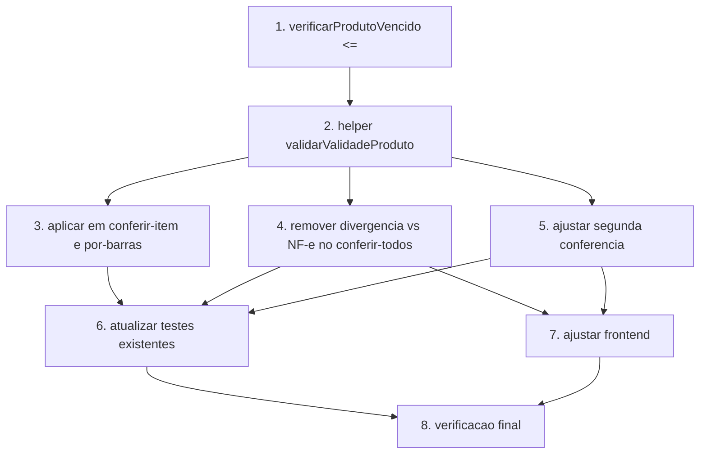

# Implementation Plan

## Overview

Plano de implementação para trocar o critério de validação da data de validade na
conferência de entrada: de comparação contra a validade da NF-e para validação contra
produto vencido (`<=` hoje) e shelf life mínimo, de forma uniforme nos três canais de
conferência, com a conferência cega alimentando o dado direto do produto. Sem alteração
de schema Prisma.

## Tasks

- [x] 1. Ajustar `verificarProdutoVencido` para bloquear no vencimento (`<=`)
  - Em `src/modules/conferencia-entrada/validade.service.ts`, alterar o comparador de `<` para `<=` em `verificarProdutoVencido`, de modo que validade igual à data atual também seja considerada vencida.
  - Atualizar o comentário/JSDoc da função para refletir "menor ou igual à data atual".
  - _Requirements: 1.1, 1.4_

- [x] 2. Criar helper puro `validarValidadeProduto` (vencido + shelf life)
  - [x] 2.1 Escrever teste property-based do helper antes da implementação
    - Criar `src/modules/conferencia-entrada/validar-validade-produto.service.test.ts` com fast-check.
    - Cobrir as propriedades P1–P5 do design: vencido nunca aprova; shelf life curto nunca aprova (se não vencido); validade adequada sempre aprova; independência da NF-e (o tipo de entrada não inclui validade da NF-e); validade nula aprova.
    - _Requirements: 1.1, 1.2, 1.3, 3.1_
  - [x] 2.2 Implementar `validarValidadeProduto`
    - Criar `src/modules/conferencia-entrada/validar-validade-produto.service.ts` como função pura, sem acesso a banco.
    - Ordem de avaliação: (1) validade nula → aprovado; (2) `verificarProdutoVencido` → bloqueio `PRODUTO_VENCIDO`; (3) `validarShelfLife` → bloqueio `SHELF_LIFE` com `diasRestantes`/`dataMinima`.
    - Reutilizar `verificarProdutoVencido` (validade.service) e `validarShelfLife` (shelf-life.service); não duplicar lógica de data.
    - Garantir que os testes de 2.1 passem.
    - _Requirements: 1.1, 1.2, 1.3, 1.4, 3.1, 3.3_

- [x] 3. Aplicar o helper na conferência individual e por código de barras
  - Em `conferencia-entrada.routes.ts`, substituir a chamada inline de `validarShelfLife` por `validarValidadeProduto` em `POST /conferir-item` e `POST /conferir-por-barras/:notaId`.
  - Mapear a reprovação para HTTP 422 com `message`, `bloqueio` (`PRODUTO_VENCIDO` ou `SHELF_LIFE`) e, quando `SHELF_LIFE`, também `diasRestantes` e `dataMinima`.
  - Manter a persistência já existente (`validade` digitada com fallback para a NF-e apenas quando nada é digitado).
  - Manter a consulta de `Produto` filtrada por `empresaId` (isolamento multi-tenant).
  - _Requirements: 1.5, 3.3, 3.4, 3.6, 3.7_

- [x] 4. Remover divergência de validade vs NF-e no `conferir-todos`
  - [x] 4.1 Substituir a validação de validade em lote pelo helper
    - Em `POST /conferir-todos/:notaId`, trocar o `validarShelfLife` inline por `validarValidadeProduto`, adicionando as falhas à lista `falhasShelfLife` com mensagem que distingue produto vencido de shelf life insuficiente.
    - _Requirements: 1.2, 1.6, 3.3_
  - [x] 4.2 Remover o gatilho `VALIDADE_DIVERGENTE`
    - Remover o bloco que compara `validadeConferidaDate` × `item.validade` e faz `tiposDivergentes.push('VALIDADE_DIVERGENTE')`.
    - Preservar intacta a comparação de **lote** contra a NF-e e a lógica de quantidade.
    - _Requirements: 2.1, 2.2_
  - [x] 4.3 Ajustar persistência para preferir a validade digitada
    - Alterar a gravação de `ItemNotaEntrada.validade` para usar `conferido.validade` (digitada) com fallback para `item.validade` apenas quando nada for digitado.
    - Não alterar a persistência de `lote`.
    - _Requirements: 3.4_

- [x] 5. Ajustar a segunda conferência para não reavaliar validade vs NF-e
  - Em `src/modules/conferencia-entrada/segunda-conferencia.service.ts`, remover `validadeCoincide` da condição de auto-resolução do Gate 2 (passa a depender só de `loteCoincide` quando `exigeLote`).
  - Ajustar `determinarTipoDivergencia` para não retornar `'VALIDADE'` e impedir novo registro de `VALIDADE_DIVERGENTE` por este fluxo.
  - Aplicar `validarValidadeProduto` sobre a validade reinformada (vencido + shelf life), bloqueando produto vencido/validade curta na reconferência.
  - Manter o processamento retrocompatível de divergências históricas em `processarDivergenciasPendentes`.
  - _Requirements: 2.3, 2.4, 2.5_

- [x] 6. Atualizar testes existentes da conferência de entrada e segunda conferência
  - Revisar `segunda-conferencia.service.test.ts` e `validade.service.test.ts` para refletir: vencimento com `<=`, ausência de `VALIDADE_DIVERGENTE` gerado na 1ª/2ª conferência, e validade da NF-e divergente com produto válido não gerando segunda conferência (regressão do bug).
  - Adicionar casos de integração/serviço cobrindo os três canais retornando resultado idêntico para a mesma entrada de validade.
  - _Requirements: 1.5, 1.6, 2.1, 2.2, 3.3_

- [x] 7. Ajustar o frontend acoplado ao tipo `VALIDADE_DIVERGENTE`
  - Em `VisioFab.Wms.Front/src/components/wms/SegundaConferenciaPanel.tsx`, remover/neutralizar o badge que depende de `item.tipo.includes('VALIDADE_DIVERGENTE')`, sem quebrar a renderização das divergências de quantidade e lote.
  - Confirmar que `conferencia-entrada/page.tsx` continua consumindo `falhasShelfLife` e que as mensagens de produto vencido e shelf life aparecem corretamente.
  - _Requirements: 5.1, 5.2, 5.3_

- [x] 8. Verificação final de build e regressão
  - Rodar `npm run build`/`tsc --noEmit` no backend e confirmar que a contagem de erros não aumenta em relação à baseline conhecida (~65 erros pré-existentes).
  - Rodar a suíte de testes unitários (Vitest) do módulo de conferência.
  - Revisar os cenários de validade da suíte QA E2E (`test_09_fluxo_recebimento_wms.py`) para refletir que divergência de validade vs NF-e não bloqueia mais o recebimento.
  - Confirmar que nenhuma alteração de schema Prisma foi introduzida (sem migration necessária).
  - _Requirements: 2.5, 2.6, 3.5_

## Task Dependency Graph



```json
{
  "waves": [
    { "wave": 1, "tasks": ["1"] },
    { "wave": 2, "tasks": ["2"] },
    { "wave": 3, "tasks": ["3", "4", "5"] },
    { "wave": 4, "tasks": ["6", "7"] },
    { "wave": 5, "tasks": ["8"] }
  ]
}
```

## Notes

- Feature em `VisioFab.Wms.Back` (backend) com um ajuste pontual no `VisioFab.Wms.Front` (Tarefa 7).
- Sem migration: nenhuma alteração de `schema.prisma`/`migrate-prod.ts`. O enum `VALIDADE_DIVERGENTE` é mantido para retrocompatibilidade de registros históricos.
- O helper `validarValidadeProduto` é a peça central — função pura, testada por property-based, reusada pelos três canais para garantir comportamento idêntico entre conferência manual e coletor.
- Criar branch nova antes de commitar (padrão do repositório).
- Baseline de `tsc`: ~65 erros pré-existentes conhecidos; a mudança não deve aumentar esse número.
