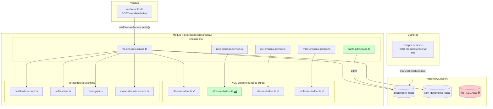
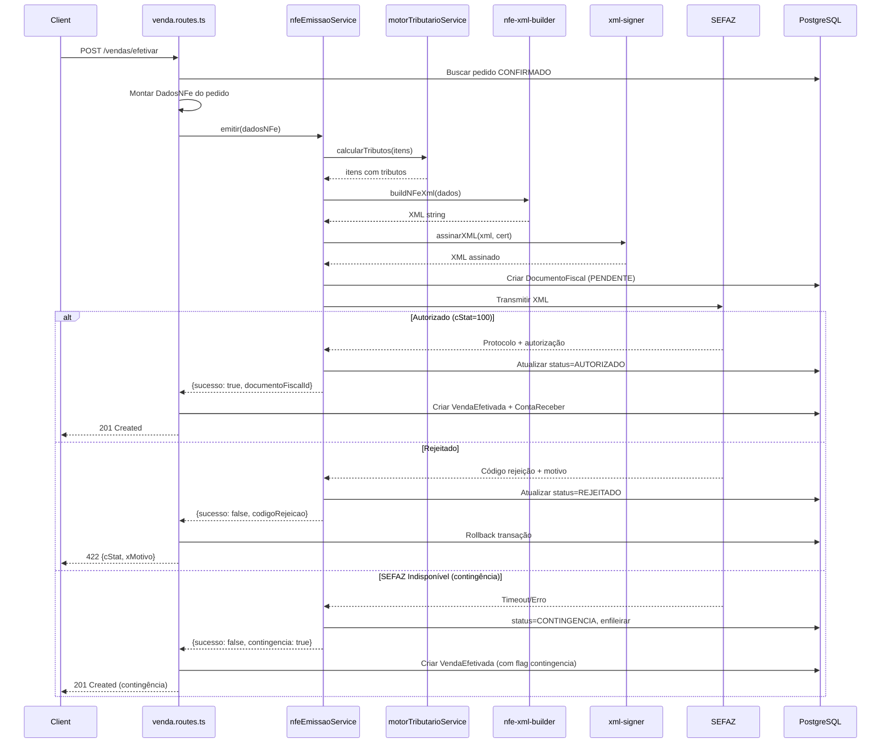
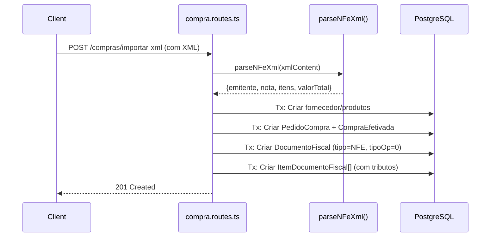
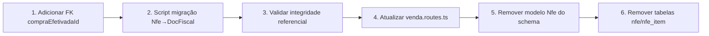

# Design Document — ERP Fiscal Completar

## Overview

Este design completa o módulo fiscal do VisioFab ERP para uso em produção, integrando-o nos fluxos de Vendas e Compras, deprecando o modelo legado `Nfe`, implementando DANFE PDF e adicionando XML builders para NFC-e (modelo 65), CT-e (modelo 57) e MDF-e (modelo 58).

### Decisões de Design

1. **DANFE via pdfkit** — Biblioteca leve já disponível no projeto, sem dependências externas pesadas.
2. **Integração via service call** — Vendas/Compras chamam `nfeEmissaoService.emitir()` dentro da mesma transação Prisma, garantindo atomicidade.
3. **XML Builders como funções puras** — Seguem o padrão já estabelecido em `nfe-xml-builder.ts` (sem I/O, testáveis isoladamente).
4. **Migração em duas etapas** — Primeiro copia dados, depois remove modelo legado, permitindo rollback parcial.
5. **Reutilização de infraestrutura existente** — Certificado, SEFAZ client, assinatura XML e motor tributário já implementados.

## Architecture

### Diagrama de Alto Nível



### Diagrama de Sequência — Vendas → Fiscal



### Diagrama de Sequência — Compras → Fiscal



## Components and Interfaces

### 1. DANFE PDF Service (NOVO)

**Arquivo:** `src/modules/fiscal/emissor-dfe/nfe/danfe-pdf.service.ts`

```typescript
interface DanfeService {
  /** Gera buffer PDF do DANFE a partir de um DocumentoFiscal autorizado */
  gerarDanfe(documentoFiscalId: string, empresaId: string): Promise<Buffer>
}
```

**Responsabilidades:**
- Buscar DocumentoFiscal + itens do banco
- Validar status === 'AUTORIZADO'
- Renderizar PDF com pdfkit contendo: cabeçalho, emitente, destinatário, itens, totais, código de barras Code128, protocolo

### 2. Vendas → Fiscal Integration Service (NOVO)

**Arquivo:** `src/modules/fiscal/integracao/venda-fiscal.service.ts`

```typescript
interface VendaFiscalService {
  /** Monta DadosNFe a partir de um pedido de venda para emissão */
  montarDadosNFe(params: {
    pedidoVenda: PedidoVendaComItens
    empresa: EmpresaComEndereco
    cliente: ClienteComEndereco
  }): DadosNFe

  /** Emite NF-e e retorna resultado (integração com nfeEmissaoService) */
  emitirParaVenda(params: {
    empresaId: string
    pedidoVenda: PedidoVendaComItens
  }): Promise<EmissaoNFeResult>
}
```

### 3. Compras → Fiscal Integration (MODIFICAÇÃO)

**Arquivo:** `src/modules/fiscal/integracao/compra-fiscal.service.ts`

```typescript
interface CompraFiscalService {
  /** Cria DocumentoFiscal de entrada a partir do XML do fornecedor */
  criarDocFiscalEntrada(params: {
    empresaId: string
    xmlNfe: string
    compraEfetivadaId: string
  }): Promise<DocumentoFiscal>
}
```

### 4. NFC-e XML Builder (NOVO)

**Arquivo:** `src/modules/fiscal/emissor-dfe/nfce/nfce-xml-builder.ts`

```typescript
interface NfceXmlBuilder {
  /** Constrói XML NFC-e layout 4.00 modelo 65 */
  buildNFCeXml(dados: DadosNFCe): string
  /** Gera QRCode URL com hash HMAC-SHA1 */
  gerarQrCode(params: QrCodeParams): string
  /** Gera urlChave por UF */
  gerarUrlChave(uf: string, ambiente: number): string
}

interface DadosNFCe extends DadosNFe {
  /** CSC (Código de Segurança do Contribuinte) ID */
  cscId: string
  /** CSC Token (para hash HMAC-SHA1) */
  cscToken: string
}
```

### 5. NFC-e Emissão Service (IMPLEMENTAR stub existente)

**Arquivo:** `src/modules/fiscal/emissor-dfe/nfce/nfce-emissao.service.ts`

```typescript
interface NfceEmissaoService {
  emitir(params: EmissaoNFCeParams): Promise<EmissaoNFeResult>
}

interface EmissaoNFCeParams {
  empresaId: string
  dadosNFCe: DadosNFCe
  forcarContingencia?: boolean
}
```

### 6. CT-e Emissão Service (IMPLEMENTAR stub existente)

**Arquivo:** `src/modules/fiscal/emissor-dfe/cte/cte-emissao.service.ts`

```typescript
interface CTeEmissaoService {
  emitir(params: EmissaoCTeParams): Promise<EmissaoCTeResult>
}

interface EmissaoCTeParams {
  empresaId: string
  dadosCTe: DadosCTe
  forcarContingencia?: boolean
}

interface EmissaoCTeResult {
  sucesso: boolean
  status: StatusDocumento
  documentoFiscalId: string
  protocolo?: string
  chaveAcesso?: string
  xmlAutorizado?: string
  codigoRejeicao?: number
  motivoRejeicao?: string
}
```

### 7. MDF-e Emissão Service (IMPLEMENTAR stub existente)

**Arquivo:** `src/modules/fiscal/emissor-dfe/mdfe/mdfe-emissao.service.ts`

```typescript
interface MDFeEmissaoService {
  emitir(params: EmissaoMDFeParams): Promise<EmissaoMDFeResult>
  /** Encerrar MDF-e (obrigatório ao fim do transporte) */
  encerrar(params: { documentoFiscalId: string; empresaId: string }): Promise<EventoResponse>
}

interface EmissaoMDFeParams {
  empresaId: string
  dadosMDFe: DadosMDFe
  forcarContingencia?: boolean
}
```

### 8. Migration Service (NOVO)

**Arquivo:** `src/modules/fiscal/integracao/migrar-nfe-legado.ts`

```typescript
interface MigracaoResult {
  totalMigrados: number
  totalItens: number
  erros: Array<{ nfeId: string; motivo: string }>
}

/** Migra registros Nfe → DocumentoFiscal preservando vínculos */
function migrarNfeLegado(empresaId?: string): Promise<MigracaoResult>

/** Mapeia campos de um registro Nfe para DadosDocumentoFiscal */
function mapearNfeParaDocFiscal(nfe: NfeComItens): Partial<DocumentoFiscal>
```

## Data Models

### DocumentoFiscal (existente — sem alterações de schema)

O modelo `DocumentoFiscal` já existe com todos os campos necessários:
- `id`, `empresaId`, `tipo`, `modelo`, `serie`, `numero`, `chaveAcesso`
- `status`, `naturezaOp`, `dataEmissao`, `dataSaida`, `tipoOperacao`, `finalidade`
- `emitenteCnpj`, `emitenteRazao`, `emitenteUf`
- `destCpfCnpj`, `destRazao`, `destUf`, `destIe`
- `valorProdutos`, `valorFrete`, `valorSeguro`, `valorDesconto`, `valorOutras`, `valorTotal`
- `valorIcms`, `valorIcmsSt`, `valorIpi`, `valorPis`, `valorCofins`
- `xmlEnviado`, `xmlAutorizado`, `xmlRetorno`
- `protocolo`, `dataAutorizacao`, `codigoRejeicao`, `motivoRejeicao`
- `ambiente`, `contingencia`, `tipoContingencia`
- `vendaEfetivadaId` (FK opcional)
- `compraEfetivadaId` (FK opcional — **ADICIONAR**)

### Alteração necessária no schema Prisma

```prisma
model DocumentoFiscal {
  // ... campos existentes ...
  compraEfetivadaId String?        @map("compra_efetivada_id")
  compraEfetivada   CompraEfetivada? @relation(fields: [compraEfetivadaId], references: [id])
}

model CompraEfetivada {
  // ... campos existentes ...
  documentosFiscais DocumentoFiscal[]
}
```

### Mapeamento Nfe Legado → DocumentoFiscal

| Campo Nfe (legado) | Campo DocumentoFiscal | Transformação |
|---|---|---|
| `id` | — | Novo UUID gerado |
| `empresaId` | `empresaId` | Direto |
| `vendaEfetivadaId` | `vendaEfetivadaId` | Direto |
| `numero` | `numero` | Direto |
| `serie` | `serie` | Direto |
| `chaveAcesso` | `chaveAcesso` | Direto |
| `xmlEnviado` | `xmlEnviado` | Direto |
| `xmlRetorno` | `xmlRetorno` | Direto |
| `protocolo` | `protocolo` | Direto |
| `status` | `status` | Mapear: PENDENTE→PENDENTE, AUTORIZADA→AUTORIZADO, REJEITADA→REJEITADO |
| `tipoNfe` | — | Derivar tipoOperacao (SAIDA→1, ENTRADA→0) |
| `tpNF` | `tipoOperacao` | Direto (0 ou 1) |
| `finNFe` | `finalidade` | Direto (1-4) |
| `ambiente` | `ambiente` | Direto (1 ou 2) |
| — | `tipo` | Fixo: 'NFE' |
| — | `modelo` | Fixo: 55 |
| — | `naturezaOp` | 'VENDA' (default se não preenchido) |

### Mapeamento ItemNfe → ItemDocumentoFiscal

| Campo ItemNfe | Campo ItemDocumentoFiscal | Transformação |
|---|---|---|
| `nItem` | `nItem` | Direto |
| `produtoId` | `produtoId` | Direto |
| `cProd` | `codigoProd` | Direto |
| `xProd` | `descricao` | Direto |
| `ncm` | `ncm` | Direto |
| `cfop` | `cfop` | Direto |
| `uCom` | `unidade` | Direto |
| `qCom` | `quantidade` | Direto |
| `vUnCom` | `valorUnitario` | Direto |
| `vProd` | `valorTotal` | Direto |
| `vICMS` | `valorIcms` | Direto |
| `vIPI` | `valorIpi` | Direto |
| `vPIS` | `valorPis` | Direto |
| `vCOFINS` | `valorCofins` | Direto |

### Estratégia de Migração



1. **Adicionar FK** — Migration Prisma adiciona `compraEfetivadaId` ao DocumentoFiscal
2. **Copiar dados** — Script TypeScript lê todos Nfe, mapeia e insere como DocumentoFiscal
3. **Validar** — Verificar que todo `VendaEfetivada` com `nfeId` agora tem `documentoFiscalId`
4. **Refatorar rotas** — venda.routes.ts usa nfeEmissaoService em vez de criar Nfe direto
5. **Remover modelo** — Deletar model Nfe e NfeItem do schema.prisma
6. **Drop tables** — Migration final remove tabelas legadas

## Correctness Properties

*A property is a characteristic or behavior that should hold true across all valid executions of a system — essentially, a formal statement about what the system should do. Properties serve as the bridge between human-readable specifications and machine-verifiable correctness guarantees.*

### Property 1: DANFE renders all required document data

*For any* valid DocumentoFiscal with status AUTORIZADO and populated emitente, destinatário, itens and totais, the generated DANFE PDF buffer SHALL contain text representations of: razão social do emitente, CNPJ do emitente, nome do destinatário, CPF/CNPJ do destinatário, descrição de cada item, valor total da NF-e, and protocolo de autorização.

**Validates: Requirements 1.2, 1.3, 1.4, 1.5, 1.7**

### Property 2: DANFE rejects non-AUTORIZADO documents

*For any* DocumentoFiscal with status different from AUTORIZADO (PENDENTE, REJEITADO, CANCELADO, CONTINGENCIA, INUTILIZADO), attempting to generate DANFE SHALL throw an error indicating that only authorized documents can have DANFE generated.

**Validates: Requirements 1.8**

### Property 3: Vendas→NF-e data mapping preserves all fields

*For any* valid PedidoVenda with items (each having produtoId, quantidade, precoFinal, and produto with NCM/CFOP), the mapping function `montarDadosNFe()` SHALL produce a DadosNFe where: destinatário.cpfCnpj equals the cliente's CPF/CNPJ, each item's NCM/CFOP comes from the produto, tipoOperacao equals 1 (saída), and the number of items equals the pedido's items count.

**Validates: Requirements 2.2**

### Property 4: Compras XML extraction round-trip

*For any* valid NF-e XML (containing nfeProc or NFe root, valid emitente CNPJ, nNF, serie, and at least one det item), extracting data via the parsing function and then comparing with the original XML tags SHALL produce equivalent values for: chaveAcesso, número, série, CNPJ emitente, razão social emitente, and valor total.

**Validates: Requirements 3.2, 3.6**

### Property 5: Invalid XML rejection

*For any* string that does not contain `<nfeProc` or `<NFe` root elements, or lacks a valid `<CNPJ>` inside `<emit>`, the XML parser SHALL throw a validation error.

**Validates: Requirements 3.5**

### Property 6: Nfe→DocumentoFiscal migration mapping preserves data

*For any* valid Nfe record with at least one ItemNfe, the mapping function SHALL produce a DocumentoFiscal where: tipo='NFE', modelo=55, numero equals original numero, serie equals original serie, tipoOperacao is correctly derived from tpNF, and each ItemDocumentoFiscal preserves codigoProd, descricao, ncm, cfop, unidade, quantidade, valorUnitario, valorTotal, and tributary values (valorIcms, valorIpi, valorPis, valorCofins).

**Validates: Requirements 4.2, 4.3**

### Property 7: NFC-e XML build/parse round-trip

*For any* valid DadosNFCe (modelo=65, with emitente, at least one item, pagamento, and valid CSC), building the XML via `buildNFCeXml()` and then parsing it back SHALL produce equivalent values for all fields: emitente CNPJ/razaoSocial, each item's código/descrição/NCM/CFOP/quantidade/valor, totais, and pagamento.

**Validates: Requirements 5.11**

### Property 8: NFC-e destinatário validation by value threshold

*For any* NFC-e data where the valor total is >= R$ 200.00 and no destinatário CPF/CNPJ is provided, the builder SHALL reject with a validation error. Conversely, *for any* NFC-e data where valor total < R$ 200.00, the builder SHALL accept the data without destinatário identification.

**Validates: Requirements 5.2, 5.3**

### Property 9: NFC-e QRCode and urlChave correctness

*For any* valid NFC-e with chaveAcesso, ambiente, cscId and cscToken, the generated qrCode field SHALL be a URL containing the chaveAcesso (44 digits), the ambiente value, the CSC ID, and a valid hash. The urlChave SHALL correspond to the SEFAZ consultation URL for the emitente's UF.

**Validates: Requirements 5.4, 5.5**

### Property 10: NFC-e model 65 structural invariants

*For any* valid NFC-e XML generated by the builder, the XML SHALL NOT contain a `<transp>` group, and the `<ide>` group SHALL contain `<idDest>1</idDest>`, `<indFinal>1</indFinal>`, and `<indPres>1</indPres>`.

**Validates: Requirements 5.6, 5.7**

### Property 11: Chave de acesso generation correctness for all models

*For any* valid combination of cUF (valid IBGE code), dataEmissao, CNPJ (14 digits), modelo (55, 65, 57, or 58), serie (0-999), número (1-999999999), tpEmis (1-9), and cNF (8 digits), the generated chave de acesso SHALL be exactly 44 numeric digits where the last digit is the correct módulo 11 check digit (with weights 2-9, and remainder < 2 → DV=0, else DV=11-remainder).

**Validates: Requirements 5.9, 6.9, 7.8**

### Property 12: CT-e XML build/parse round-trip

*For any* valid DadosCTe (modelo=57, with emitente, remetente, destinatário, vPrest with components, impostos, and infCTeNorm with infCarga and infDoc containing at least one NF-e chave), building the XML via `buildCTeXml()` and then parsing it back SHALL produce equivalent values for all key fields.

**Validates: Requirements 6.11**

### Property 13: CT-e ICMS tag selection by CST

*For any* valid CT-e ICMS CST value (00, 20, 40, 41, 51, 60, 90, or SN), the generated XML SHALL use the correct ICMS sub-element tag (ICMS00, ICMS20, ICMS45, ICMS60, ICMS90, or ICMSOutraUF respectively) with the appropriate child elements for that CST.

**Validates: Requirements 6.7**

### Property 14: MDF-e XML build/parse round-trip

*For any* valid DadosMDFe (modelo=58, with emitente, at least one infDoc entry containing NF-e or CT-e chaves, totais, veicTracao and at least one condutor), building the XML via `buildMDFeXml()` and then parsing it back SHALL produce equivalent values for all key fields.

**Validates: Requirements 7.12**

### Property 15: MDF-e requires at least one linked document

*For any* DadosMDFe where infDoc is an empty array (no NF-e or CT-e linked), the builder or validator SHALL throw a validation error indicating that at least one fiscal document must be linked.

**Validates: Requirements 7.10, 7.11**

## Error Handling

### Erros por Componente

| Componente | Erro | HTTP | Ação |
|---|---|---|---|
| DANFE | DocumentoFiscal não encontrado | 404 | Retornar mensagem |
| DANFE | Status != AUTORIZADO | 422 | Retornar mensagem com status atual |
| DANFE | Falha pdfkit (erro interno) | 500 | Log + mensagem genérica |
| Vendas→Fiscal | Certificado não cadastrado | 422 | Retornar mensagem indicando configurar certificado |
| Vendas→Fiscal | SEFAZ rejeitou (cStat != 100) | 422 | Rollback tx + retornar {cStat, xMotivo} |
| Vendas→Fiscal | SEFAZ indisponível | — | Ativar contingência, efetivação prossegue |
| Vendas→Fiscal | Motor tributário falha (NCM inválido) | 422 | Retornar erro de validação |
| Compras→Fiscal | XML inválido (não é NF-e) | 422 | Retornar mensagem |
| Compras→Fiscal | NF-e já importada (duplicidade) | 422 | Retornar mensagem com número/série |
| NFC-e | Valor >= 200 sem CPF/CNPJ | 422 | Retornar erro de validação |
| NFC-e | CSC não cadastrado | 422 | Retornar mensagem |
| CT-e | Dados incompletos (remetente/dest) | 422 | Retornar campos faltantes |
| MDF-e | Nenhum documento vinculado | 422 | Retornar mensagem |
| MDF-e | Veículo sem condutor | 422 | Retornar mensagem |
| Migração | Registro inconsistente | — | Log warn + preencher default |

### Estratégia de Contingência (já implementada)

O `nfeEmissaoService` já implementa:
- 3 falhas consecutivas → ativa contingência automática
- Enfileira documentos na `filaContingencia`
- Tipo de contingência por UF (SVC_RS ou SVC_AN)
- Log em `logContingencia`

Para NFC-e: contingência offline (tpEmis=9) com timeout de 5s.

### Retry e Idempotência

- Compras: verificação de duplicidade por (CNPJ fornecedor + nNF + série) antes de importar
- Vendas: transação Prisma garante atomicidade (efetivação + emissão)
- Migração: script idempotente (verifica se já migrado pelo chaveAcesso antes de inserir)

## Testing Strategy

### Abordagem Dual: Testes Unitários + Testes de Propriedade

Este módulo se beneficia fortemente de property-based testing porque os XML builders e funções de mapeamento são **funções puras** com espaço de entrada amplo e propriedades universais claras (round-trips, invariantes estruturais, validações).

### Property-Based Tests (fast-check)

**Biblioteca:** `fast-check` (já disponível no projeto frontend, adicionar ao backend)

**Configuração:** Mínimo 100 iterações por propriedade.

**Tag format:** `Feature: erp-fiscal-completar, Property {N}: {title}`

| Property | Arquivo de Teste | Foco |
|---|---|---|
| 1 — DANFE data | `danfe-pdf.service.test.ts` | Dados presentes no PDF |
| 2 — DANFE reject | `danfe-pdf.service.test.ts` | Status validation |
| 3 — Venda mapping | `venda-fiscal.service.test.ts` | Campo mapping |
| 4 — Compra XML round-trip | `compra-fiscal.service.test.ts` | Parse fidelity |
| 5 — Invalid XML | `compra-fiscal.service.test.ts` | Error generation |
| 6 — Migration mapping | `migrar-nfe-legado.test.ts` | Field preservation |
| 7 — NFC-e round-trip | `nfce-xml-builder.test.ts` | Build/parse equivalence |
| 8 — NFC-e dest threshold | `nfce-xml-builder.test.ts` | Validation logic |
| 9 — NFC-e QR/URL | `nfce-xml-builder.test.ts` | QRCode structure |
| 10 — NFC-e invariants | `nfce-xml-builder.test.ts` | Structural constraints |
| 11 — Chave acesso | `chave-acesso.test.ts` | DV correctness all models |
| 12 — CT-e round-trip | `cte-xml-builder.test.ts` | Build/parse equivalence |
| 13 — CT-e ICMS tags | `cte-xml-builder.test.ts` | CST→tag mapping |
| 14 — MDF-e round-trip | `mdfe-xml-builder.test.ts` | Build/parse equivalence |
| 15 — MDF-e validation | `mdfe-xml-builder.test.ts` | Doc requirement |

### Unit Tests (Vitest)

| Componente | Cenários |
|---|---|
| DANFE | PDF magic bytes, barcode encoding, empty itens edge case |
| Vendas→Fiscal | Integração com mock nfeEmissaoService, rollback on rejection |
| Compras→Fiscal | Criação DocumentoFiscal, ItemDocFiscal, duplicidade check |
| NFC-e builder | tpEmis normal vs contingência, grupo pag obrigatório |
| CT-e builder | Tomador por tpTom, infModal rodoviário |
| MDF-e builder | Múltiplas UFs de descarga, lacres, CIOT |
| Migração | Registros inconsistentes → defaults, idempotência |

### Integration Tests

| Fluxo | Cenário |
|---|---|
| POST /vendas/efetivar | Happy path com mock SEFAZ autorizado |
| POST /vendas/efetivar | SEFAZ rejeita → rollback |
| POST /vendas/efetivar | Contingência → efetivação prossegue |
| POST /compras/importar-xml | Com XML válido → DocumentoFiscal criado |
| POST /compras/importar-xml | Sem XML → sem DocumentoFiscal |
| GET /nfe/:id/danfe | Retorna PDF para doc autorizado |
| POST /nfce/emitir | Happy path com mock SEFAZ |
| POST /cte/emitir | Happy path com mock SEFAZ |
| POST /mdfe/emitir | Happy path com mock SEFAZ |

### Execução

```bash
# Testes unitários + propriedade
npm run test -- --run src/modules/fiscal/

# Testes específicos de propriedade
npm run test -- --run src/modules/fiscal/**/*.test.ts
```
