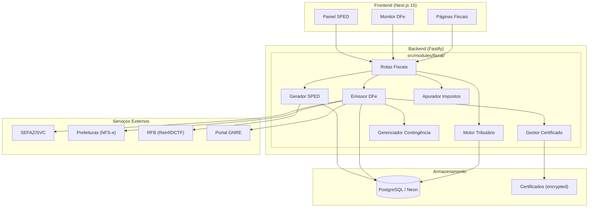
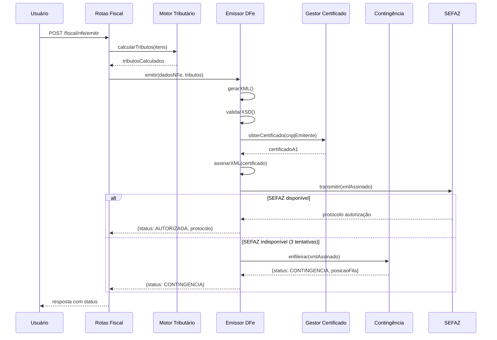
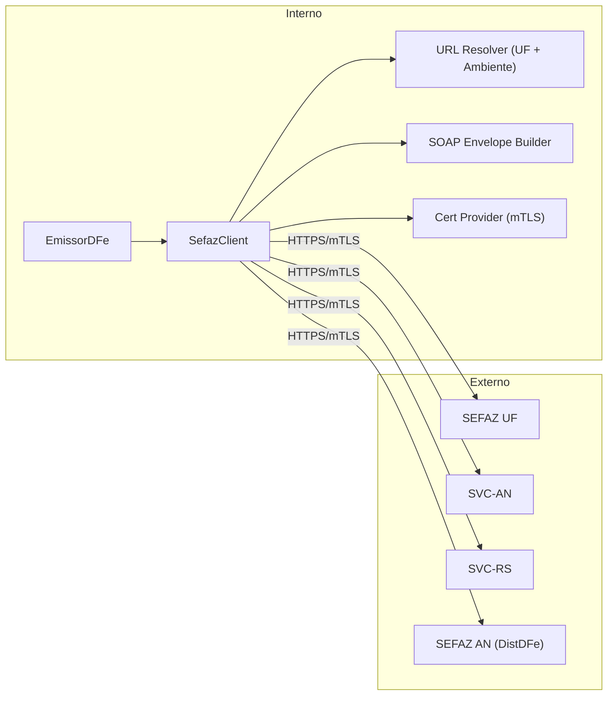
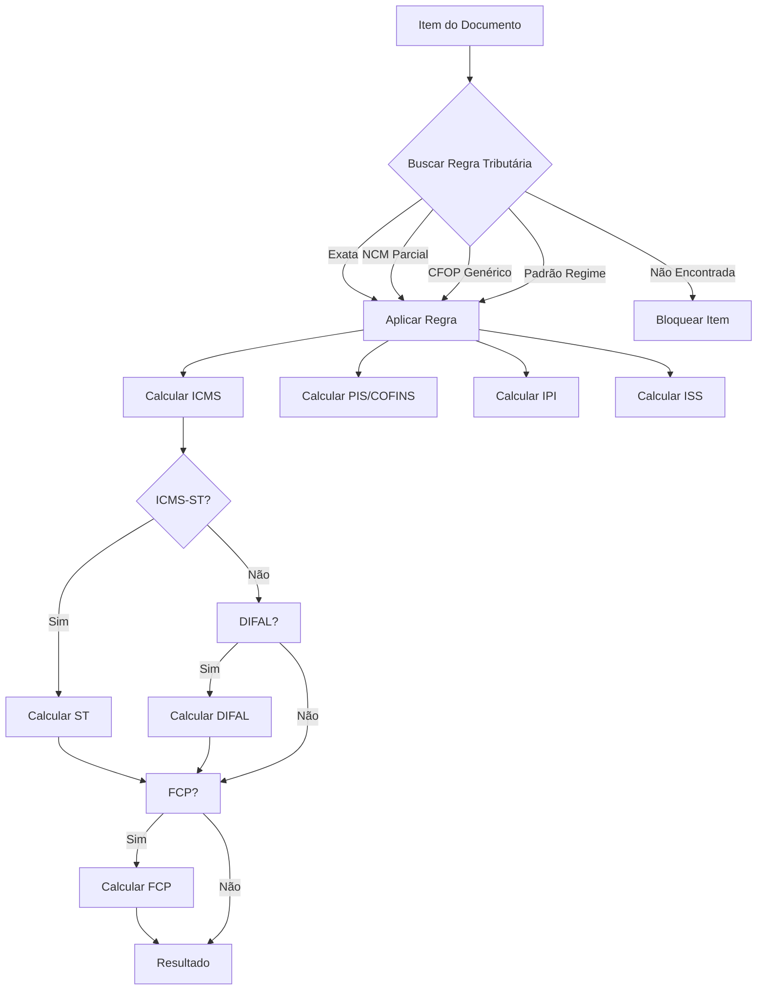
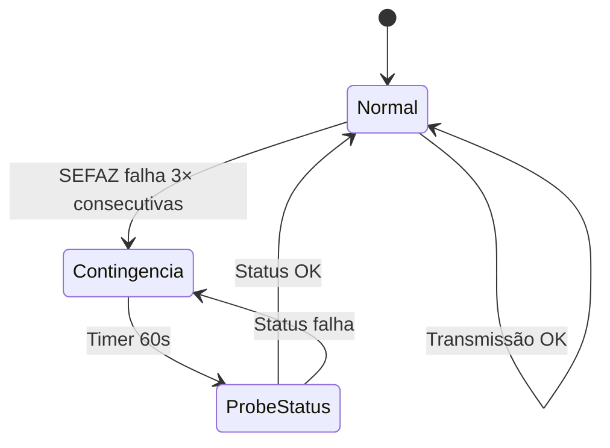

# Design Document: Módulo Fiscal ERP

## Overview

O Módulo Fiscal é um subsistema completo do VisioFab ERP responsável pela automação de todas as obrigações fiscais brasileiras. Ele abrange emissão de documentos fiscais eletrônicos (NF-e, NFC-e, CT-e, MDF-e, NFS-e), motor tributário configurável, apuração de impostos, geração de obrigações acessórias SPED e utilitários fiscais.

O módulo é projetado como um conjunto de serviços desacoplados que se comunicam via interfaces bem definidas, permitindo evolução independente de cada componente. A arquitetura segue o padrão já existente no projeto: módulos Fastify com rotas, serviços de domínio e acesso a dados via Prisma.

### Decisões Arquiteturais Chave

1. **Motor Tributário como serviço puro** — Sem dependências de I/O, testável isoladamente com property-based tests
2. **Comunicação SEFAZ abstraída** — Adapter pattern para diferentes webservices (SEFAZ estaduais, SVC, prefeituras)
3. **Fila de contingência em banco** — Persistente via PostgreSQL para sobreviver a reinicializações
4. **Certificados em storage seguro** — PFX criptografado em repouso, nunca exposto em logs ou respostas
5. **SPED como gerador streaming** — Processa documentos em chunks para suportar grandes volumes sem estouro de memória

## Architecture

### Diagrama de Alto Nível



### Fluxo de Emissão de DFe



## Components and Interfaces

### Estrutura de Módulos

```
src/modules/fiscal/
├── fiscal.routes.ts              # Registro de todas as sub-rotas
├── motor-tributario/
│   ├── motor-tributario.service.ts    # Lógica de busca e aplicação de regras
│   ├── motor-tributario.routes.ts     # CRUD de regras tributárias
│   ├── calculo-icms.ts                # Cálculos ICMS (normal, ST, DIFAL, FCP)
│   ├── calculo-pis-cofins.ts          # Cálculos PIS/COFINS
│   ├── calculo-ipi.ts                 # Cálculos IPI
│   ├── calculo-iss.ts                 # Cálculos ISS
│   └── tipos.ts                       # Tipos/interfaces do motor tributário
├── emissor-dfe/
│   ├── emissor-dfe.routes.ts          # Rotas de emissão (NF-e, NFC-e, CT-e, MDF-e)
│   ├── nfe/
│   │   ├── nfe-emissao.service.ts     # Orquestração de emissão NF-e
│   │   ├── nfe-xml-builder.ts         # Montagem XML NF-e 4.00
│   │   ├── nfe-validador.ts           # Validação XSD + regras de negócio
│   │   ├── nfe-danfe.ts               # Geração DANFE PDF
│   │   └── nfe-eventos.ts             # Cancelamento, CC-e, Inutilização
│   ├── nfce/
│   │   ├── nfce-emissao.service.ts
│   │   └── nfce-danfe.ts
│   ├── cte/
│   │   ├── cte-emissao.service.ts
│   │   └── cte-xml-builder.ts
│   ├── mdfe/
│   │   ├── mdfe-emissao.service.ts
│   │   └── mdfe-xml-builder.ts
│   ├── nfse/
│   │   ├── nfse-emissao.service.ts
│   │   └── adapters/                  # Adapters por padrão municipal
│   │       ├── abrasf.adapter.ts
│   │       ├── ginfes.adapter.ts
│   │       └── issnet.adapter.ts
│   ├── sefaz/
│   │   ├── sefaz-client.ts            # Cliente SOAP genérico
│   │   ├── sefaz-urls.ts              # URLs por UF e ambiente
│   │   ├── sefaz-status.ts            # Consulta status serviço
│   │   └── distribuicao-dfe.ts        # Download XMLs (DistDFe)
│   ├── xml/
│   │   ├── xml-signer.ts             # Assinatura digital XML (xmldsig)
│   │   ├── xml-validator.ts          # Validação XSD
│   │   └── xml-parser.ts             # Parser XML → objetos tipados
│   └── manifesto/
│       └── manifesto-destinatario.ts  # MDe (ciência, confirmação, etc.)
├── contingencia/
│   ├── contingencia.service.ts        # Gerenciamento de modo contingência
│   ├── fila-contingencia.ts           # Fila de documentos pendentes
│   └── contingencia.routes.ts         # Consulta status e fila
├── certificado/
│   ├── certificado.service.ts         # Upload, validação, seleção
│   ├── certificado.routes.ts          # CRUD certificados
│   └── certificado-crypto.ts          # Encrypt/decrypt do PFX
├── sped/
│   ├── sped.routes.ts                 # Rotas de geração SPED
│   ├── sped-fiscal.generator.ts       # EFD ICMS/IPI
│   ├── sped-contribuicoes.generator.ts # EFD PIS/COFINS
│   ├── sped-ecd.generator.ts          # ECD
│   ├── sped-ecf.generator.ts          # ECF
│   ├── sped-reinf.generator.ts        # EFD-Reinf
│   ├── sped-writer.ts                 # Writer streaming (pipe-delimited)
│   └── sped-validator.ts              # Validação estrutural
├── apuracao/
│   ├── apuracao.routes.ts
│   ├── apuracao-icms.service.ts       # Apuração ICMS e ICMS-ST
│   ├── apuracao-pis-cofins.service.ts # Apuração PIS/COFINS
│   ├── apuracao-ipi.service.ts        # Apuração IPI
│   └── livros-fiscais.service.ts      # Geração livros fiscais
├── cadastros/
│   ├── ncm.routes.ts                  # CRUD NCM
│   ├── cfop.routes.ts                 # CRUD CFOP
│   ├── cest.routes.ts                 # CRUD CEST
│   ├── cst-csosn.routes.ts            # CRUD CST/CSOSN
│   └── natureza-operacao.routes.ts    # CRUD Natureza Operação
├── gnre/
│   ├── gnre.service.ts                # Geração GNRE
│   └── gnre.routes.ts
├── importacao/
│   ├── importacao-xml.service.ts      # Importação XML entrada
│   └── importacao-xml.routes.ts
├── auditoria/
│   └── auditoria-fiscal.service.ts    # Log de auditoria fiscal
└── dctf/
    └── dctf-web.service.ts            # Consolidação DCTF-Web
```

### Interfaces Principais

```typescript
// === Motor Tributário ===
interface RegraTributaria {
  id: string
  ncm: string              // 8 dígitos
  cfop: string             // 4 dígitos
  ufOrigem: string         // 2 chars
  ufDestino: string        // 2 chars
  regimeTributario: RegimeTributario
  icms: { aliquota: number; cst: string; baseCalculo: number; reducao: number }
  pis: { aliquota: number; cst: string }
  cofins: { aliquota: number; cst: string }
  ipi: { aliquota: number; cst: string }
  iss?: { aliquota: number }
  fcp?: { aliquota: number }
  icmsSt?: { mva: number; mvaAjustado?: number; aliquotaInterna: number }
}

interface ResultadoCalculoTributario {
  icms: { base: number; aliquota: number; valor: number; cst: string }
  icmsSt?: { base: number; valor: number }
  icmsDifal?: { base: number; valorDestino: number; valorOrigem: number }
  fcp?: { base: number; valor: number }
  pis: { base: number; aliquota: number; valor: number; cst: string }
  cofins: { base: number; aliquota: number; valor: number; cst: string }
  ipi: { base: number; aliquota: number; valor: number; cst: string }
  iss?: { base: number; aliquota: number; valor: number; retido: boolean }
  regraUtilizada: { id: string; nivelFallback: NivelFallback }
}

type NivelFallback = 'EXATO' | 'NCM_PARCIAL' | 'CFOP_GENERICO' | 'PADRAO_REGIME'

// === Emissor DFe ===
interface EmissaoRequest {
  tipo: 'NFE' | 'NFCE' | 'CTE' | 'MDFE' | 'NFSE'
  dados: DadosDocumentoFiscal
  contingencia?: boolean
}

interface EmissaoResponse {
  sucesso: boolean
  status: StatusDocumento
  protocolo?: string
  chaveAcesso?: string
  xmlAutorizado?: string
  erros?: Array<{ codigo: number; descricao: string }>
}

type StatusDocumento = 'AUTORIZADO' | 'REJEITADO' | 'PENDENTE' | 
  'CANCELADO' | 'INUTILIZADO' | 'CONTINGENCIA' | 'FALHA_RETRANSMISSAO'

// === SEFAZ Client ===
interface SefazClient {
  transmitir(xml: string, servico: ServicoSefaz): Promise<RespostaSefaz>
  consultarStatus(uf: string): Promise<StatusServico>
  consultarProtocolo(chaveAcesso: string): Promise<SituacaoDocumento>
  distribuicaoDFe(cnpj: string, nsu: string): Promise<DocumentoDistribuido[]>
}

interface RespostaSefaz {
  sucesso: boolean
  protocolo?: string
  dataRecebimento?: string
  codigoStatus: number
  motivoStatus: string
  xmlRetorno: string
}

// === Gestor Certificado ===
interface GestorCertificado {
  upload(pfxBuffer: Buffer, senha: string, empresaId: string): Promise<CertificadoInfo>
  obterParaAssinatura(cnpjEmitente: string): Promise<CertificadoParaUso>
  verificarVencimentos(): Promise<CertificadoVencendo[]>
}

interface CertificadoParaUso {
  pfxBuffer: Buffer
  senha: string
  cnpj: string
  validoAte: Date
}

// === Gerador SPED ===
interface GeradorSPED {
  gerarEFDICMSIPI(params: PeriodoParams): Promise<ArquivoSPED>
  gerarEFDContribuicoes(params: PeriodoParams): Promise<ArquivoSPED>
  gerarECD(params: PeriodoParams): Promise<ArquivoSPED>
  gerarECF(params: PeriodoParams): Promise<ArquivoSPED>
}

interface ArquivoSPED {
  conteudo: Buffer  // ISO-8859-1 encoded
  nomeArquivo: string
  totalRegistros: number
  blocos: Record<string, number>  // contagem por bloco
  valido: boolean
  erros?: string[]
}
```

## Data Models

### Modelos Prisma

```prisma
// ============================================================================
// MÓDULO FISCAL - MOTOR TRIBUTÁRIO
// ============================================================================

model RegraTributaria {
  id               String   @id @default(uuid())
  empresaId        String   @map("empresa_id")
  ncm              String   @db.VarChar(8)
  cfop             String   @db.VarChar(4)
  ufOrigem         String   @map("uf_origem") @db.VarChar(2)
  ufDestino        String   @map("uf_destino") @db.VarChar(2)
  regimeTributario Int      @map("regime_tributario") // 1=SN, 2=SN Excesso, 3=Normal
  
  // ICMS
  icmsAliquota     Decimal  @default(0) @map("icms_aliquota") @db.Decimal(5,2)
  icmsCst          String?  @map("icms_cst") @db.VarChar(3)
  icmsCsosn        String?  @map("icms_csosn") @db.VarChar(4)
  icmsBaseCalculo  Decimal  @default(100) @map("icms_base_calculo") @db.Decimal(5,2)
  icmsReducao      Decimal  @default(0) @map("icms_reducao") @db.Decimal(5,2)
  
  // ICMS-ST
  icmsStMva        Decimal? @map("icms_st_mva") @db.Decimal(5,2)
  icmsStMvaAjust   Decimal? @map("icms_st_mva_ajust") @db.Decimal(5,2)
  icmsStAliqInterna Decimal? @map("icms_st_aliq_interna") @db.Decimal(5,2)
  
  // FCP
  fcpAliquota      Decimal? @map("fcp_aliquota") @db.Decimal(5,2)
  
  // PIS
  pisAliquota      Decimal  @default(0) @map("pis_aliquota") @db.Decimal(5,2)
  pisCst           String?  @map("pis_cst") @db.VarChar(2)
  
  // COFINS
  cofinsAliquota   Decimal  @default(0) @map("cofins_aliquota") @db.Decimal(5,2)
  cofinsCst        String?  @map("cofins_cst") @db.VarChar(2)
  
  // IPI
  ipiAliquota      Decimal  @default(0) @map("ipi_aliquota") @db.Decimal(5,2)
  ipiCst           String?  @map("ipi_cst") @db.VarChar(2)
  
  // ISS
  issAliquota      Decimal? @map("iss_aliquota") @db.Decimal(5,2)
  
  ativo            Boolean  @default(true)
  criadoEm         DateTime @default(now()) @map("criado_em")
  atualizadoEm     DateTime @updatedAt @map("atualizado_em")

  empresa          Empresa  @relation(fields: [empresaId], references: [id])

  @@unique([empresaId, ncm, cfop, ufOrigem, ufDestino, regimeTributario])
  @@index([empresaId, ncm, cfop])
  @@map("regra_tributaria")
}

// ============================================================================
// MÓDULO FISCAL - DOCUMENTOS FISCAIS ELETRÔNICOS
// ============================================================================

model DocumentoFiscal {
  id              String   @id @default(uuid())
  empresaId       String   @map("empresa_id")
  tipo            String   @db.VarChar(10) // NFE, NFCE, CTE, MDFE, NFSE
  modelo          Int      // 55, 65, 57, 58
  serie           Int
  numero          Int
  chaveAcesso     String?  @map("chave_acesso") @db.VarChar(44)
  
  // Status
  status          String   @default("RASCUNHO") @db.VarChar(30)
  // RASCUNHO, VALIDADO, ASSINADO, TRANSMITIDO, AUTORIZADO, REJEITADO,
  // CANCELADO, INUTILIZADO, CONTINGENCIA, FALHA_RETRANSMISSAO, PENDENTE
  
  // Dados gerais
  naturezaOp      String?  @map("natureza_op") @db.VarChar(100)
  dataEmissao     DateTime @map("data_emissao")
  dataSaida       DateTime? @map("data_saida")
  tipoOperacao    Int      @map("tipo_operacao") // 0=Entrada, 1=Saída
  finalidade      Int      @default(1) // 1=Normal, 2=Complementar, 3=Ajuste, 4=Devolução
  
  // Emitente
  emitenteCnpj    String   @map("emitente_cnpj") @db.VarChar(14)
  emitenteRazao   String   @map("emitente_razao") @db.VarChar(200)
  emitenteUf      String   @map("emitente_uf") @db.VarChar(2)
  
  // Destinatário
  destCpfCnpj     String?  @map("dest_cpf_cnpj") @db.VarChar(14)
  destRazao       String?  @map("dest_razao") @db.VarChar(200)
  destUf          String?  @map("dest_uf") @db.VarChar(2)
  destIe          String?  @map("dest_ie") @db.VarChar(20)
  
  // Totais
  valorProdutos   Decimal  @default(0) @map("valor_produtos") @db.Decimal(15,2)
  valorFrete      Decimal  @default(0) @map("valor_frete") @db.Decimal(15,2)
  valorSeguro     Decimal  @default(0) @map("valor_seguro") @db.Decimal(15,2)
  valorDesconto   Decimal  @default(0) @map("valor_desconto") @db.Decimal(15,2)
  valorOutras     Decimal  @default(0) @map("valor_outras") @db.Decimal(15,2)
  valorTotal      Decimal  @default(0) @map("valor_total") @db.Decimal(15,2)
  valorIcms       Decimal  @default(0) @map("valor_icms") @db.Decimal(15,2)
  valorIcmsSt     Decimal  @default(0) @map("valor_icms_st") @db.Decimal(15,2)
  valorIpi        Decimal  @default(0) @map("valor_ipi") @db.Decimal(15,2)
  valorPis        Decimal  @default(0) @map("valor_pis") @db.Decimal(15,2)
  valorCofins     Decimal  @default(0) @map("valor_cofins") @db.Decimal(15,2)
  valorFcp        Decimal  @default(0) @map("valor_fcp") @db.Decimal(15,2)
  valorIss        Decimal  @default(0) @map("valor_iss") @db.Decimal(15,2)
  
  // XML e protocolo
  xmlEnviado      String?  @map("xml_enviado") @db.Text
  xmlAutorizado   String?  @map("xml_autorizado") @db.Text
  xmlRetorno      String?  @map("xml_retorno") @db.Text
  protocolo       String?  @db.VarChar(20)
  dataAutorizacao DateTime? @map("data_autorizacao")
  
  // Rejeição
  codigoRejeicao  Int?     @map("codigo_rejeicao")
  motivoRejeicao  String?  @map("motivo_rejeicao") @db.VarChar(500)
  
  // Contingência
  contingencia    Boolean  @default(false)
  tipoContingencia String? @map("tipo_contingencia") @db.VarChar(10)
  
  // Ambiente
  ambiente        Int      @default(2) // 1=Produção, 2=Homologação
  
  criadoEm        DateTime @default(now()) @map("criado_em")
  atualizadoEm    DateTime @updatedAt @map("atualizado_em")

  empresa         Empresa  @relation(fields: [empresaId], references: [id])
  itens           ItemDocumentoFiscal[]
  eventos         EventoDocumentoFiscal[]
  gnres           Gnre[]

  @@unique([empresaId, tipo, serie, numero])
  @@index([empresaId, status])
  @@index([empresaId, dataEmissao])
  @@index([chaveAcesso])
  @@map("documento_fiscal")
}

model ItemDocumentoFiscal {
  id                String   @id @default(uuid())
  documentoFiscalId String   @map("documento_fiscal_id")
  nItem             Int      @map("n_item")
  
  // Produto
  produtoId         String?  @map("produto_id")
  codigoProd        String   @map("codigo_prod") @db.VarChar(60)
  descricao         String   @db.VarChar(120)
  ncm               String   @db.VarChar(8)
  cest              String?  @db.VarChar(7)
  cfop              String   @db.VarChar(4)
  unidade           String   @db.VarChar(6)
  quantidade        Decimal  @db.Decimal(15,4)
  valorUnitario     Decimal  @map("valor_unitario") @db.Decimal(15,4)
  valorTotal        Decimal  @map("valor_total") @db.Decimal(15,2)
  valorDesconto     Decimal  @default(0) @map("valor_desconto") @db.Decimal(15,2)
  
  // ICMS
  icmsOrigem        Int      @default(0) @map("icms_origem")
  icmsCst           String?  @map("icms_cst") @db.VarChar(3)
  icmsCsosn         String?  @map("icms_csosn") @db.VarChar(4)
  icmsBase          Decimal  @default(0) @map("icms_base") @db.Decimal(15,2)
  icmsAliquota      Decimal  @default(0) @map("icms_aliquota") @db.Decimal(5,2)
  icmsValor         Decimal  @default(0) @map("icms_valor") @db.Decimal(15,2)
  icmsReducao       Decimal  @default(0) @map("icms_reducao") @db.Decimal(5,2)
  
  // ICMS-ST
  icmsStBase        Decimal  @default(0) @map("icms_st_base") @db.Decimal(15,2)
  icmsStAliquota    Decimal  @default(0) @map("icms_st_aliquota") @db.Decimal(5,2)
  icmsStValor       Decimal  @default(0) @map("icms_st_valor") @db.Decimal(15,2)
  icmsStMva         Decimal  @default(0) @map("icms_st_mva") @db.Decimal(5,2)
  
  // DIFAL
  icmsDifalBase     Decimal  @default(0) @map("icms_difal_base") @db.Decimal(15,2)
  icmsDifalDestino  Decimal  @default(0) @map("icms_difal_destino") @db.Decimal(15,2)
  
  // FCP
  fcpBase           Decimal  @default(0) @map("fcp_base") @db.Decimal(15,2)
  fcpAliquota       Decimal  @default(0) @map("fcp_aliquota") @db.Decimal(5,2)
  fcpValor          Decimal  @default(0) @map("fcp_valor") @db.Decimal(15,2)
  
  // IPI
  ipiCst            String?  @map("ipi_cst") @db.VarChar(2)
  ipiBase           Decimal  @default(0) @map("ipi_base") @db.Decimal(15,2)
  ipiAliquota       Decimal  @default(0) @map("ipi_aliquota") @db.Decimal(5,2)
  ipiValor          Decimal  @default(0) @map("ipi_valor") @db.Decimal(15,2)
  
  // PIS
  pisCst            String?  @map("pis_cst") @db.VarChar(2)
  pisBase           Decimal  @default(0) @map("pis_base") @db.Decimal(15,2)
  pisAliquota       Decimal  @default(0) @map("pis_aliquota") @db.Decimal(5,2)
  pisValor          Decimal  @default(0) @map("pis_valor") @db.Decimal(15,2)
  
  // COFINS
  cofinsCst         String?  @map("cofins_cst") @db.VarChar(2)
  cofinsBase        Decimal  @default(0) @map("cofins_base") @db.Decimal(15,2)
  cofinsAliquota    Decimal  @default(0) @map("cofins_aliquota") @db.Decimal(5,2)
  cofinsValor       Decimal  @default(0) @map("cofins_valor") @db.Decimal(15,2)
  
  // ISS
  issBase           Decimal  @default(0) @map("iss_base") @db.Decimal(15,2)
  issAliquota       Decimal  @default(0) @map("iss_aliquota") @db.Decimal(5,2)
  issValor          Decimal  @default(0) @map("iss_valor") @db.Decimal(15,2)
  issRetido         Boolean  @default(false) @map("iss_retido")
  
  // Rastreabilidade
  regraTributariaId String?  @map("regra_tributaria_id")
  nivelFallback     String?  @map("nivel_fallback") @db.VarChar(20)

  documentoFiscal   DocumentoFiscal @relation(fields: [documentoFiscalId], references: [id])
  produto           Produto?        @relation(fields: [produtoId], references: [id])
  regraTributaria   RegraTributaria? @relation(fields: [regraTributariaId], references: [id])

  @@index([documentoFiscalId])
  @@map("item_documento_fiscal")
}

model EventoDocumentoFiscal {
  id                String   @id @default(uuid())
  documentoFiscalId String   @map("documento_fiscal_id")
  tipoEvento        String   @map("tipo_evento") @db.VarChar(10)
  // 110111=Cancelamento, 110110=CC-e, 210200=Confirmação, 210210=Ciência, etc.
  sequencia         Int
  dataEvento        DateTime @map("data_evento")
  protocolo         String?  @db.VarChar(20)
  justificativa     String?  @db.VarChar(1000)
  textoCorrecao     String?  @map("texto_correcao") @db.Text
  xmlEvento         String?  @map("xml_evento") @db.Text
  xmlRetorno        String?  @map("xml_retorno") @db.Text
  status            String   @db.VarChar(20) // REGISTRADO, REJEITADO

  documentoFiscal   DocumentoFiscal @relation(fields: [documentoFiscalId], references: [id])

  @@index([documentoFiscalId])
  @@map("evento_documento_fiscal")
}

// ============================================================================
// MÓDULO FISCAL - CERTIFICADOS DIGITAIS
// ============================================================================

model CertificadoDigital {
  id           String   @id @default(uuid())
  empresaId    String   @map("empresa_id")
  cnpj         String   @db.VarChar(14)
  tipo         String   @db.VarChar(2) // A1, A3
  titular      String   @db.VarChar(200)
  validoDe     DateTime @map("valido_de")
  validoAte    DateTime @map("valido_ate")
  pfxEncrypted String?  @map("pfx_encrypted") @db.Text // AES-256 encrypted
  senhaEncrypted String? @map("senha_encrypted") @db.VarChar(500)
  ativo        Boolean  @default(true)
  criadoEm     DateTime @default(now()) @map("criado_em")
  atualizadoEm DateTime @updatedAt @map("atualizado_em")

  empresa      Empresa  @relation(fields: [empresaId], references: [id])

  @@index([empresaId, cnpj, ativo])
  @@map("certificado_digital")
}

// ============================================================================
// MÓDULO FISCAL - CONTINGÊNCIA
// ============================================================================

model FilaContingencia {
  id              String   @id @default(uuid())
  empresaId       String   @map("empresa_id")
  documentoFiscalId String @map("documento_fiscal_id")
  xmlAssinado     String   @map("xml_assinado") @db.Text
  tipoContingencia String  @map("tipo_contingencia") @db.VarChar(10) // SVC_AN, SVC_RS, FS_DA
  tentativas      Int      @default(0)
  status          String   @default("PENDENTE") @db.VarChar(20) // PENDENTE, TRANSMITIDO, FALHA
  erro            String?  @db.VarChar(500)
  criadoEm        DateTime @default(now()) @map("criado_em")
  transmitidoEm   DateTime? @map("transmitido_em")

  empresa         Empresa  @relation(fields: [empresaId], references: [id])
  documentoFiscal DocumentoFiscal @relation(fields: [documentoFiscalId], references: [id])

  @@index([empresaId, status, criadoEm])
  @@map("fila_contingencia")
}

model LogContingencia {
  id              String   @id @default(uuid())
  empresaId       String   @map("empresa_id")
  acao            String   @db.VarChar(20) // ENTRADA, SAIDA
  motivo          String   @db.VarChar(200)
  modalidade      String   @db.VarChar(10)
  documentosPendentes Int  @map("documentos_pendentes")
  timestamp       DateTime @default(now())

  empresa         Empresa  @relation(fields: [empresaId], references: [id])

  @@index([empresaId, timestamp])
  @@map("log_contingencia")
}

// ============================================================================
// MÓDULO FISCAL - APURAÇÃO
// ============================================================================

model ApuracaoFiscal {
  id              String   @id @default(uuid())
  empresaId       String   @map("empresa_id")
  tipo            String   @db.VarChar(20) // ICMS, ICMS_ST, PIS, COFINS, IPI
  periodo         String   @db.VarChar(7) // YYYY-MM
  
  totalDebitos    Decimal  @default(0) @map("total_debitos") @db.Decimal(15,2)
  totalCreditos   Decimal  @default(0) @map("total_creditos") @db.Decimal(15,2)
  estornoDebitos  Decimal  @default(0) @map("estorno_debitos") @db.Decimal(15,2)
  estornoCreditos Decimal  @default(0) @map("estorno_creditos") @db.Decimal(15,2)
  ajustes         Decimal  @default(0) @db.Decimal(15,2)
  saldoAnterior   Decimal  @default(0) @map("saldo_anterior") @db.Decimal(15,2)
  saldoFinal      Decimal  @default(0) @map("saldo_final") @db.Decimal(15,2)
  valorRecolher   Decimal  @default(0) @map("valor_recolher") @db.Decimal(15,2)
  
  fechado         Boolean  @default(false)
  criadoEm        DateTime @default(now()) @map("criado_em")
  atualizadoEm    DateTime @updatedAt @map("atualizado_em")

  empresa         Empresa  @relation(fields: [empresaId], references: [id])
  detalhes        DetalheApuracao[]

  @@unique([empresaId, tipo, periodo])
  @@map("apuracao_fiscal")
}

model DetalheApuracao {
  id              String   @id @default(uuid())
  apuracaoId      String   @map("apuracao_id")
  documentoFiscalId String? @map("documento_fiscal_id")
  tipo            String   @db.VarChar(20) // DEBITO, CREDITO, ESTORNO_DEB, ESTORNO_CRED, AJUSTE
  valor           Decimal  @db.Decimal(15,2)
  descricao       String?  @db.VarChar(200)

  apuracao        ApuracaoFiscal @relation(fields: [apuracaoId], references: [id])

  @@index([apuracaoId])
  @@map("detalhe_apuracao")
}

// ============================================================================
// MÓDULO FISCAL - CADASTROS AUXILIARES
// ============================================================================

model Ncm {
  id          String   @id @default(uuid())
  codigo      String   @unique @db.VarChar(8)
  descricao   String   @db.VarChar(500)
  unidadeEstat String? @map("unidade_estat") @db.VarChar(10)
  aliqII      Decimal? @map("aliq_ii") @db.Decimal(5,2)
  aliqIPI     Decimal? @map("aliq_ipi") @db.Decimal(5,2)
  ativo       Boolean  @default(true)
  criadoEm    DateTime @default(now()) @map("criado_em")

  cests       CestNcm[]

  @@map("ncm")
}

model Cfop {
  id          String   @id @default(uuid())
  codigo      String   @unique @db.VarChar(4)
  descricao   String   @db.VarChar(500)
  tipo        String   @db.VarChar(10) // ENTRADA, SAIDA
  ambito      String   @db.VarChar(15) // ESTADUAL, INTERESTADUAL, EXTERIOR
  geraCredIcms Boolean @default(false) @map("gera_cred_icms")
  geraCredPisCofins Boolean @default(false) @map("gera_cred_pis_cofins")
  incideIpi   Boolean  @default(false) @map("incide_ipi")
  ativo       Boolean  @default(true)
  criadoEm    DateTime @default(now()) @map("criado_em")

  @@map("cfop")
}

model Cest {
  id          String   @id @default(uuid())
  codigo      String   @unique @db.VarChar(7)
  descricao   String   @db.VarChar(500)
  segmento    String?  @db.VarChar(200)
  ativo       Boolean  @default(true)
  criadoEm    DateTime @default(now()) @map("criado_em")

  ncms        CestNcm[]

  @@map("cest")
}

model CestNcm {
  id     String @id @default(uuid())
  cestId String @map("cest_id")
  ncmId  String @map("ncm_id")

  cest   Cest   @relation(fields: [cestId], references: [id])
  ncm    Ncm    @relation(fields: [ncmId], references: [id])

  @@unique([cestId, ncmId])
  @@map("cest_ncm")
}

model NaturezaOperacao {
  id            String  @id @default(uuid())
  empresaId     String  @map("empresa_id")
  descricao     String  @db.VarChar(100)
  cfopEntrada   String? @map("cfop_entrada") @db.VarChar(4)
  cfopSaida     String? @map("cfop_saida") @db.VarChar(4)
  tipoOperacao  String  @map("tipo_operacao") @db.VarChar(30)
  // VENDA, DEVOLUCAO, TRANSFERENCIA, REMESSA, BONIFICACAO, etc.
  ativo         Boolean @default(true)
  criadoEm      DateTime @default(now()) @map("criado_em")

  empresa       Empresa @relation(fields: [empresaId], references: [id])

  @@map("natureza_operacao")
}

// ============================================================================
// MÓDULO FISCAL - GNRE
// ============================================================================

model Gnre {
  id                String   @id @default(uuid())
  empresaId         String   @map("empresa_id")
  documentoFiscalId String   @map("documento_fiscal_id")
  ufDestino         String   @map("uf_destino") @db.VarChar(2)
  valor             Decimal  @db.Decimal(15,2)
  codigoReceita     String   @map("codigo_receita") @db.VarChar(10)
  referencia        String   @db.VarChar(7) // YYYY-MM
  status            String   @default("PENDENTE") @db.VarChar(20) // PENDENTE, PAGO, VENCIDO
  dataPagamento     DateTime? @map("data_pagamento")
  nossoNumero       String?  @map("nosso_numero") @db.VarChar(30)
  criadoEm          DateTime @default(now()) @map("criado_em")

  empresa           Empresa @relation(fields: [empresaId], references: [id])
  documentoFiscal   DocumentoFiscal @relation(fields: [documentoFiscalId], references: [id])

  @@index([empresaId, status])
  @@map("gnre")
}

// ============================================================================
// MÓDULO FISCAL - IMPORTAÇÃO XML
// ============================================================================

model XmlImportado {
  id              String   @id @default(uuid())
  empresaId       String   @map("empresa_id")
  chaveAcesso     String   @map("chave_acesso") @db.VarChar(44)
  tipo            String   @db.VarChar(10) // NFE, CTE
  emitenteCnpj    String   @map("emitente_cnpj") @db.VarChar(14)
  emitenteRazao   String   @map("emitente_razao") @db.VarChar(200)
  valorTotal      Decimal  @map("valor_total") @db.Decimal(15,2)
  dataEmissao     DateTime @map("data_emissao")
  xmlCompleto     String   @map("xml_completo") @db.Text
  origem          String   @db.VarChar(20) // UPLOAD, DISTRIBUICAO_DFE, EMAIL
  
  // Manifestação
  manifestacao    String?  @db.VarChar(30) // CIENCIA, CONFIRMACAO, DESCONHECIMENTO, NAO_REALIZADA
  dataManifestacao DateTime? @map("data_manifestacao")
  
  // Vinculação com entrada
  documentoEntradaId String? @map("documento_entrada_id")
  
  criadoEm        DateTime @default(now()) @map("criado_em")

  empresa         Empresa  @relation(fields: [empresaId], references: [id])

  @@unique([empresaId, chaveAcesso])
  @@index([empresaId, manifestacao])
  @@map("xml_importado")
}

// ============================================================================
// MÓDULO FISCAL - AUDITORIA
// ============================================================================

model AuditoriaFiscal {
  id          String   @id @default(uuid())
  empresaId   String   @map("empresa_id")
  usuarioId   String   @map("usuario_id")
  operacao    String   @db.VarChar(50)
  // EMISSAO, CANCELAMENTO, INUTILIZACAO, ALTERACAO_REGRA, IMPORTACAO_XML, etc.
  entidade    String   @db.VarChar(50) // DocumentoFiscal, RegraTributaria, etc.
  entidadeId  String   @map("entidade_id")
  dadosAntes  String?  @map("dados_antes") @db.Text // JSON
  dadosDepois String?  @map("dados_depois") @db.Text // JSON
  ip          String?  @db.VarChar(45)
  timestamp   DateTime @default(now())

  empresa     Empresa  @relation(fields: [empresaId], references: [id])

  @@index([empresaId, timestamp])
  @@index([entidade, entidadeId])
  @@map("auditoria_fiscal")
}
```

## Correctness Properties

*A property is a characteristic or behavior that should hold true across all valid executions of a system — essentially, a formal statement about what the system should do. Properties serve as the bridge between human-readable specifications and machine-verifiable correctness guarantees.*

### Property 1: Validação XSD rejeita dados inválidos e aceita dados válidos

*For any* conjunto de dados de NF-e, se todos os campos obrigatórios estão presentes e conformes ao schema XSD 4.00 (tipos, tamanhos, formatos), a validação local SHALL retornar sucesso; se qualquer campo obrigatório está ausente ou fora do schema, a validação SHALL retornar erro indicando o(s) campo(s) inválido(s).

**Validates: Requirements 1.1, 1.10, 36.1, 36.2**

### Property 2: Cancelamento respeita prazo de 24 horas

*For any* NF-e autorizada com timestamp de autorização T, se o timestamp atual é T + Δ onde Δ < 24h, o cancelamento SHALL ser permitido; se Δ ≥ 24h, o cancelamento SHALL ser bloqueado.

**Validates: Requirements 1.5, 1.6**

### Property 3: CC-e e Inutilização respeitam limites de texto e numeração

*For any* solicitação de CC-e com texto de comprimento L, se 15 ≤ L ≤ 1000 e sequência ≤ 20, SHALL ser aceita; caso contrário, SHALL ser rejeitada. Para inutilização, a faixa SHALL ter no máximo 1000 números e justificativa entre 15 e 255 caracteres.

**Validates: Requirements 1.7, 1.8**

### Property 4: Motor Tributário — busca exata rejeita duplicatas

*For any* duas regras tributárias R1 e R2, se R1 e R2 possuem a mesma combinação exata (NCM + CFOP + UF origem + UF destino + Regime), o cadastro de R2 SHALL ser rejeitado.

**Validates: Requirements 7.1**

### Property 5: Motor Tributário — fallback hierárquico determinístico

*For any* item fiscal com combinação (NCM, CFOP, UF_orig, UF_dest, Regime) sem regra exata, o Motor Tributário SHALL buscar na ordem: 1º NCM parcial (4 dígitos) com demais campos exatos, 2º CFOP genérico (último dígito zero) com NCM exato, 3º regra padrão do regime. A primeira regra encontrada SHALL ser retornada. Se nenhuma existir, SHALL bloquear.

**Validates: Requirements 7.2, 7.3, 7.4**

### Property 6: Preenchimento automático de campos tributários a partir de regra

*For any* item de documento fiscal ao qual uma Regra Tributária foi vinculada (exata ou por fallback), os campos CST/CSOSN, alíquotas e bases de cálculo do item SHALL ser iguais aos valores definidos na regra encontrada.

**Validates: Requirements 7.5**

### Property 7: Cálculo de ICMS normal é correto e arredondado

*For any* item com CST 00 e valores (vProd, vFrete, vSeg, vOutras, vDesc) e alíquota A, o ICMS SHALL ser calculado como round2((vProd + vFrete + vSeg + vOutras - vDesc) × A / 100), onde round2 arredonda para 2 casas decimais conforme ABNT NBR 5891.

**Validates: Requirements 8.1, 8.8**

### Property 8: Invariante do diferimento parcial (CST 51)

*For any* item com CST 51, percentual de diferimento D (0 < D < 100) e base de cálculo B com alíquota A: ICMS_diferido + ICMS_recolher SHALL ser igual a (B × A / 100), onde ICMS_diferido = B × A × D / 10000 e ICMS_recolher = B × A × (100 - D) / 10000.

**Validates: Requirements 8.5**

### Property 9: DIFAL = alíquota interna destino - alíquota interestadual

*For any* operação interestadual a consumidor final não contribuinte com base B, alíquota interna do destino Ai e alíquota interestadual Ae, o DIFAL SHALL ser calculado como B × (Ai - Ae) / 100, com 100% destinado ao estado de destino.

**Validates: Requirements 8.2**

### Property 10: Alíquotas interestaduais seguem tabela legal

*For any* par de UFs (origem, destino) entre contribuintes, a alíquota interestadual SHALL ser: 7% se origem ∈ {SP,RJ,MG,PR,SC,RS} e destino ∈ {N,NE,CO,ES}; 4% se produto importado (conteúdo importação > 40%); 12% em demais combinações interestaduais.

**Validates: Requirements 8.6**

### Property 11: ICMS-ST = (Base ST × alíq interna) - ICMS próprio

*For any* item sujeito a ICMS-ST com Base ST calculada (via MVA ou PMPF), alíquota interna do destino Ai, e ICMS próprio Ip, o valor do ICMS-ST SHALL ser (Base_ST × Ai / 100) - Ip.

**Validates: Requirements 9.3**

### Property 12: Base ST com MVA vs PMPF

*For any* item sujeito a ST, se existir PMPF (preço de pauta), a base ST SHALL ser o PMPF; caso contrário, SHALL ser calculada como valor_operação × (1 + MVA/100), utilizando MVA ajustado quando disponível.

**Validates: Requirements 9.1, 9.2, 9.4**

### Property 13: PIS/COFINS aplica alíquotas corretas por regime

*For any* item com regime não-cumulativo (Lucro Real), PIS SHALL usar alíquota 1,65% e COFINS 7,6%. Para regime cumulativo (Lucro Presumido), PIS SHALL usar 0,65% e COFINS 3%. Se NCM possui alíquota diferenciada, SHALL usar a alíquota específica.

**Validates: Requirements 10.1, 10.2, 10.3**

### Property 14: IPI = base × alíquota (ou quantidade × valor_pauta)

*For any* item tributado por IPI, se tributação por alíquota ad valorem: IPI = (vProd + vFrete + vSeg + vOutras) × alíquota/100. Se tributação por pauta: IPI = quantidade × valor_fixo_unidade. Se CST indica isenção/imunidade/suspensão, IPI SHALL ser zero.

**Validates: Requirements 11.1, 11.2, 11.3**

### Property 15: ISS respeita limites de alíquota (2% a 5%)

*For any* cálculo de ISS, a alíquota efetiva aplicada SHALL estar no intervalo [2%, 5%], independente do valor configurado no cadastro do município.

**Validates: Requirements 12.1, 12.4**

### Property 16: FCP é calculado sobre base do imposto correspondente

*For any* item com FCP aplicável: FCP = base_ICMS × alíq_FCP/100. Para FCP-ST: FCP-ST = base_ST × alíq_FCP/100. Para FCP-DIFAL: FCP-DIFAL = base_DIFAL × alíq_FCP/100.

**Validates: Requirements 13.1, 13.2, 13.3**

### Property 17: SPED Fiscal — Block 9 counts match actual records

*For any* arquivo SPED gerado, a contagem de registros por bloco informada no Bloco 9 SHALL ser igual à contagem real de registros escritos em cada bloco correspondente.

**Validates: Requirements 14.5**

### Property 18: SPED Fiscal — todos os documentos do período aparecem nos blocos C/D

*For any* conjunto de documentos fiscais com data de emissão dentro do período solicitado, todos SHALL aparecer no Bloco C (modelos 01, 1B, 04, 55, 65) ou Bloco D (modelo 57) do arquivo SPED gerado.

**Validates: Requirements 14.2, 14.3**

### Property 19: Apuração ICMS — saldo = débitos - créditos + estornos + ajustes + saldo anterior

*For any* apuração de ICMS de um período, o saldo final SHALL ser igual a: (total_débitos - estorno_débitos) - (total_créditos - estorno_créditos) + ajustes - saldo_credor_anterior. Se resultado > 0, é valor a recolher; se < 0, é crédito acumulado para próximo período.

**Validates: Requirements 20.1, 20.2, 20.3, 20.5**

### Property 20: Round-trip de XML fiscal

*For any* dados válidos de documento fiscal, serializar para XML e depois parsear o XML de volta SHALL produzir um objeto semanticamente equivalente ao original (mesmos valores para todos os campos).

**Validates: Requirements 36.4, 28.2**

### Property 21: Importação de XML rejeita duplicatas (idempotência)

*For any* XML importado com chave de acesso C, uma segunda tentativa de importação do mesmo XML (mesma chave C) SHALL ser rejeitada e o estado do sistema permanece inalterado.

**Validates: Requirements 28.4**

### Property 22: Certificado vencido bloqueia assinatura

*For any* certificado digital com data de validade V, se a data atual > V, qualquer tentativa de assinatura digital usando esse certificado SHALL ser bloqueada.

**Validates: Requirements 29.5**

### Property 23: Seleção automática de certificado por CNPJ

*For any* documento fiscal com CNPJ emitente X, o sistema SHALL selecionar o certificado ativo cuja propriedade CNPJ é igual a X e cuja data de validade > data atual.

**Validates: Requirements 29.7**

### Property 24: Fila de contingência respeita limite de 500 e ordem FIFO

*For any* sequência de documentos enfileirados em contingência offline, a fila SHALL ter no máximo 500 documentos. Ao retransmitir, a ordem SHALL ser cronológica (primeiro a entrar = primeiro a transmitir).

**Validates: Requirements 30.3, 30.4**

### Property 25: Falha de retransmissão de um documento não afeta os demais

*For any* fila de contingência com N documentos, se a retransmissão do documento Di falha após 3 tentativas, Di SHALL ser marcado como "falha_retransmissao" e os documentos D(i+1)...D(N) SHALL continuar sendo processados normalmente.

**Validates: Requirements 30.6**

## Error Handling

### Estratégia de Erros por Camada

| Camada | Tipo de Erro | Tratamento |
|--------|-------------|------------|
| Validação (entrada) | Campos obrigatórios ausentes, tipos incorretos, formato inválido | Retornar 400 com lista de erros Zod. Bloquear operação. |
| Motor Tributário | Regra não encontrada, alíquota ausente | Retornar 422 com indicação do parâmetro fiscal ausente. Bloquear emissão. |
| XML/XSD | Estrutura inválida, campos fora do schema | Retornar 422 com lista de campos com erro. Bloquear transmissão. |
| Assinatura | Certificado vencido, senha incorreta, CNPJ divergente | Retornar 422 com motivo específico. Bloquear assinatura. |
| SEFAZ (comunicação) | Timeout, indisponibilidade, erro de rede | Retry 3× com 5s intervalo. Após falha, ativar contingência. |
| SEFAZ (rejeição) | cStat ≠ 100, regra fiscal violada | Armazenar código/motivo, marcar como REJEITADO, retornar ao usuário. |
| Contingência | Fila cheia (500), retransmissão falha | Bloquear novas emissões se fila cheia. Marcar documento individual como falha. |
| SPED | Inconsistência estrutural | Bloquear download. Apresentar registros com erro. |
| Certificado | Upload inválido (cadeia, expirado, CNPJ) | Rejeitar upload. Não persistir. Retornar motivo específico. |

### Códigos de Erro Padronizados

```typescript
enum CodigoErroFiscal {
  // Validação
  CAMPOS_OBRIGATORIOS_AUSENTES = 'FISCAL_001',
  FORMATO_INVALIDO = 'FISCAL_002',
  
  // Motor Tributário
  REGRA_NAO_ENCONTRADA = 'FISCAL_100',
  ALIQUOTA_AUSENTE = 'FISCAL_101',
  NCM_INVALIDO = 'FISCAL_102',
  CFOP_INCOMPATIVEL = 'FISCAL_103',
  
  // Emissão
  CERTIFICADO_VENCIDO = 'FISCAL_200',
  CERTIFICADO_NAO_ENCONTRADO = 'FISCAL_201',
  SEFAZ_INDISPONIVEL = 'FISCAL_202',
  SEFAZ_REJEICAO = 'FISCAL_203',
  PRAZO_CANCELAMENTO_EXCEDIDO = 'FISCAL_204',
  LIMITE_CCE_EXCEDIDO = 'FISCAL_205',
  FAIXA_INUTILIZACAO_EXCEDE_LIMITE = 'FISCAL_206',
  
  // Contingência
  FILA_CONTINGENCIA_CHEIA = 'FISCAL_300',
  FALHA_RETRANSMISSAO = 'FISCAL_301',
  
  // Importação
  XML_DUPLICADO = 'FISCAL_400',
  XML_CANCELADO_SEFAZ = 'FISCAL_401',
  XML_ESTRUTURA_INVALIDA = 'FISCAL_402',
  
  // SPED
  SPED_INCONSISTENCIA = 'FISCAL_500',
  SPED_PERIODO_SEM_DADOS = 'FISCAL_501',
  
  // Certificado
  CERTIFICADO_CADEIA_INVALIDA = 'FISCAL_600',
  CERTIFICADO_CNPJ_DIVERGENTE = 'FISCAL_601',
  CERTIFICADO_EXPIRADO = 'FISCAL_602',
}
```

### Retry Policy para Comunicação SEFAZ

```typescript
interface RetryConfig {
  maxTentativas: 3
  intervaloMs: 5000        // 5 segundos entre tentativas
  timeoutMs: 30000         // 30 segundos por tentativa (configurável 5-120s)
  backoffMultiplier: 1     // sem backoff exponencial (intervalo fixo)
}
```

### Circuit Breaker para SEFAZ

Quando a SEFAZ é detectada como indisponível:
1. **Estado FECHADO** (normal): Tentativas normais de transmissão
2. **Estado ABERTO** (contingência): Enfileira documentos, não tenta SEFAZ
3. **Estado SEMI-ABERTO** (probe): A cada 60s, consulta NfeStatusServico. Se responder com sucesso, volta para FECHADO e retransmite fila.

## Testing Strategy

### Abordagem Dual: Unit Tests + Property-Based Tests

Este módulo utiliza **Vitest** para testes unitários e **fast-check** (já instalado no projeto) para property-based tests. A combinação garante cobertura ampla:

- **Property-based tests**: Verificam propriedades universais do motor tributário, cálculos fiscais, validações e geração SPED. Cada property test roda **mínimo 100 iterações**.
- **Unit tests**: Cobrem cenários específicos, edge cases de integração com SEFAZ (mocked), e fluxos de estado.

### Property-Based Tests (fast-check)

Cada teste de propriedade referencia seu número do design document:

| Property | Módulo | Descrição |
|----------|--------|-----------|
| 1 | xml-validator | Validação XSD aceita/rejeita corretamente |
| 2 | nfe-eventos | Cancelamento respeita prazo 24h |
| 3 | nfe-eventos | CC-e/Inutilização respeita limites |
| 4 | motor-tributario | Regras rejeitam duplicatas |
| 5 | motor-tributario | Fallback hierárquico determinístico |
| 6 | motor-tributario | Preenchimento automático correto |
| 7 | calculo-icms | ICMS normal arredondamento correto |
| 8 | calculo-icms | Diferimento parcial soma = total |
| 9 | calculo-icms | DIFAL correto |
| 10 | calculo-icms | Alíquotas interestaduais corretas |
| 11 | calculo-icms | ICMS-ST fórmula correta |
| 12 | calculo-icms | Base ST com MVA vs PMPF |
| 13 | calculo-pis-cofins | Alíquotas por regime |
| 14 | calculo-ipi | IPI ad valorem e pauta |
| 15 | calculo-iss | ISS limites 2%-5% |
| 16 | calculo-icms | FCP sobre base correta |
| 17 | sped-writer | Block 9 counts match |
| 18 | sped-fiscal | Documentos do período no arquivo |
| 19 | apuracao-icms | Saldo = fórmula completa |
| 20 | xml-parser | Round-trip XML |
| 21 | importacao-xml | Idempotência importação |
| 22 | certificado | Vencido bloqueia assinatura |
| 23 | certificado | Seleção automática por CNPJ |
| 24 | fila-contingencia | Limite 500 e FIFO |
| 25 | fila-contingencia | Falha individual não afeta fila |

**Tag format nos testes:**
```typescript
// Feature: erp-modulo-fiscal, Property 7: Cálculo de ICMS normal é correto e arredondado
it.prop('ICMS normal = round2(base × aliquota / 100)', [...generators], { numRuns: 100 })
```

### Unit Tests (Vitest)

| Módulo | Cenários |
|--------|----------|
| nfe-emissao | Fluxo completo com mock SEFAZ (autorização, rejeição) |
| nfe-eventos | Cancelamento, CC-e, inutilização com mocks |
| nfce-emissao | Emissão PDV, contingência NFC-e |
| cte-emissao | Emissão CT-e com mock |
| mdfe-emissao | Emissão MDF-e, encerramento |
| nfse-emissao | Adapters por padrão municipal |
| sefaz-client | SOAP envelope formatting, response parsing |
| contingencia | Entrada/saída modo, fila, retransmissão |
| certificado | Upload, validação cadeia, vencimento |
| sped-fiscal | Geração movimento zerado, blocos obrigatórios |
| apuracao | Transporte crédito, fechamento período |
| importacao-xml | XML válido/inválido, duplicidade |
| gnre | Geração vinculada a NF-e |
| cadastros | CRUD NCM, CFOP, CEST, natureza operação |
| auditoria | Log creation, imutabilidade |

### Integration Tests

| Cenário | Approach |
|---------|----------|
| SEFAZ comunicação | Mock server SOAP para testes E2E do fluxo completo |
| Banco de dados | Prisma com banco de teste isolado |
| SPED completo | Geração com dados reais, validação com PVA simulado |
| Certificado A1 | PFX de teste (gerado para testes) |

### Organização de Arquivos de Teste

```
tests/fiscal/
├── motor-tributario/
│   ├── calculo-icms.property.test.ts    # Properties 7-12, 16
│   ├── calculo-pis-cofins.property.test.ts  # Property 13
│   ├── calculo-ipi.property.test.ts     # Property 14
│   ├── calculo-iss.property.test.ts     # Property 15
│   ├── busca-regra.property.test.ts     # Properties 4, 5, 6
│   └── motor-tributario.unit.test.ts    # Edge cases
├── emissor/
│   ├── validacao-xml.property.test.ts   # Property 1
│   ├── xml-roundtrip.property.test.ts   # Property 20
│   ├── nfe-eventos.property.test.ts     # Properties 2, 3
│   ├── nfe-emissao.unit.test.ts
│   ├── nfce-emissao.unit.test.ts
│   ├── cte-emissao.unit.test.ts
│   └── mdfe-emissao.unit.test.ts
├── contingencia/
│   ├── fila.property.test.ts            # Properties 24, 25
│   └── contingencia.unit.test.ts
├── certificado/
│   ├── certificado.property.test.ts     # Properties 22, 23
│   └── certificado.unit.test.ts
├── sped/
│   ├── sped-writer.property.test.ts     # Property 17
│   ├── sped-fiscal.property.test.ts     # Property 18
│   └── sped-fiscal.unit.test.ts
├── apuracao/
│   ├── apuracao-icms.property.test.ts   # Property 19
│   └── apuracao.unit.test.ts
└── importacao/
    ├── importacao.property.test.ts      # Property 21
    └── importacao.unit.test.ts
```

### Configuração fast-check

```typescript
import fc from 'fast-check'

// Generators reutilizáveis para domínio fiscal
export const arbNcm = () => fc.stringOf(fc.constantFrom('0','1','2','3','4','5','6','7','8','9'), { minLength: 8, maxLength: 8 })
export const arbCfop = () => fc.stringOf(fc.constantFrom('1','2','3','4','5','6','7','8','9','0'), { minLength: 4, maxLength: 4 })
export const arbUf = () => fc.constantFrom('AC','AL','AM','AP','BA','CE','DF','ES','GO','MA','MG','MS','MT','PA','PB','PE','PI','PR','RJ','RN','RO','RR','RS','SC','SE','SP','TO')
export const arbRegime = () => fc.constantFrom(1, 2, 3)
export const arbAliquota = () => fc.double({ min: 0, max: 100, noNaN: true }).map(v => Math.round(v * 100) / 100)
export const arbValorMonetario = () => fc.double({ min: 0.01, max: 999999.99, noNaN: true }).map(v => Math.round(v * 100) / 100)
export const arbPercentual = () => fc.double({ min: 0, max: 100, noNaN: true }).map(v => Math.round(v * 100) / 100)
```

## Design Details: Integração SEFAZ

### Arquitetura de Comunicação

A comunicação com a SEFAZ utiliza SOAP 1.2 sobre HTTPS com autenticação mútua (mTLS) via certificado digital A1. O sistema já possui uma implementação básica em `src/modules/nfe/nfe-sefaz.ts` que será refatorada para um cliente genérico reutilizável.



### Serviços SEFAZ por Tipo de Documento

| Serviço | NF-e | NFC-e | CT-e | MDF-e |
|---------|------|-------|------|-------|
| Autorização | NFeAutorizacao4 | NFeAutorizacao4 | CTeRecepcaoSinc | MDFeRecepcaoSinc |
| Consulta Protocolo | NfeConsulta4 | NfeConsulta4 | CteConsulta4 | MDFeConsulta |
| Eventos | RecepcaoEvento | RecepcaoEvento | CteRecepcaoEvento | MDFeRecepcaoEvento |
| Inutilização | NfeInutilizacao4 | NfeInutilizacao4 | CteInutilizacao4 | — |
| Status Serviço | NfeStatusServico4 | NfeStatusServico4 | CteStatusServico4 | MDFeStatusServico |

### URL Resolution

O `SefazURLResolver` mantém mapeamento estático de URLs por UF e ambiente:
- UFs autorizadoras próprias: SP, MG, BA, PR, RS, MT, MS, GO, PE
- UFs via SVRS: demais estados
- Contingência: SVC-AN (SEFAZ Virtual AN) e SVC-RS (SEFAZ Virtual RS)

---

## Design Details: Motor Tributário

### Pipeline de Cálculo



### Regras de Arredondamento

Todos os cálculos monetários seguem ABNT NBR 5891:
- Precisão: 2 casas decimais para valores monetários
- Método: Half-up (arredondamento comercial)
- Implementação: `Math.round(valor * 100) / 100`

### Performance

- Busca de regra: utiliza index composto no banco + cache em memória (LRU com TTL de 5min)
- Target: ≤ 500ms por item (Req. 7.2)
- Para documentos com muitos itens: batch lookup em uma única query

---

## Design Details: Geração SPED

### Arquitetura Streaming

Para suportar grandes volumes (100.000+ documentos), o gerador SPED usa abordagem streaming:

```typescript
class SPEDWriter {
  private output: Buffer[] = []
  private contadores: Record<string, number> = {}
  
  writeRegistro(bloco: string, tipo: string, campos: string[]): void {
    const linha = `|${campos.join('|')}|`
    this.output.push(Buffer.from(linha + '\r\n', 'latin1')) // ISO-8859-1
    this.contadores[bloco] = (this.contadores[bloco] ?? 0) + 1
  }
  
  finalize(): Buffer {
    // Gera Bloco 9 com contagens
    this.gerarBloco9()
    return Buffer.concat(this.output)
  }
}
```

### Estrutura de Blocos

| Bloco | SPED Fiscal | SPED Contribuições | Descrição |
|-------|-------------|-------------------|-----------|
| 0 | ✓ | ✓ | Abertura, identificação, tabelas |
| A | — | ✓ | Documentos de serviço |
| C | ✓ | ✓ | Documentos de mercadoria |
| D | ✓ | ✓ | Documentos de transporte |
| E | ✓ | — | Apuração ICMS/IPI |
| F | — | ✓ | Demais receitas/deduções |
| G | ✓ | — | CIAP |
| H | ✓ | — | Inventário |
| K | ✓ | — | Produção/estoque |
| M | — | ✓ | Apuração PIS/COFINS |
| 1 | ✓ | ✓ | Complemento |
| 9 | ✓ | ✓ | Encerramento (contadores) |

### Validação Estrutural

Antes de disponibilizar o arquivo, o validador verifica:
1. Presença de todos os blocos obrigatórios (abertura + encerramento)
2. Sequência correta de registros pai-filho
3. Totalização Bloco 9 consistente com contagem real
4. Campos obrigatórios preenchidos
5. Encoding ISO-8859-1 correto

---

## Design Details: XML (Geração, Validação, Assinatura)

### Pipeline XML

```
Dados → XML Builder → Validação XSD → Assinatura Digital → XML Assinado
```

### XML Builder

Utiliza template strings tipadas (como já feito no projeto) para montar XML. Cada tipo de documento tem seu builder específico que garante conformidade com o layout:
- NF-e: Layout 4.00 (NT 2019.001 v1.60)
- NFC-e: Layout 4.00 com restrições (sem IE, sem DIFAL)
- CT-e: Layout 4.00 (manual CT-e)
- MDF-e: Layout 3.00

### Validação XSD

```typescript
// Validação usando libxmljs2 (binding Node.js para libxml2)
import { parseXml, parseXmlString } from 'libxmljs2'

function validarXSD(xml: string, schemaPath: string): ValidationResult {
  const xsdDoc = parseXml(fs.readFileSync(schemaPath, 'utf-8'))
  const xmlDoc = parseXmlString(xml)
  const valido = xmlDoc.validate(xsdDoc)
  return {
    valido,
    erros: valido ? [] : xmlDoc.validationErrors.map(e => ({
      linha: e.line,
      mensagem: e.message,
    }))
  }
}
```

**Dependência adicional:** `libxmljs2` para validação XSD nativa (performance superior a alternativas JS puras).

### Assinatura Digital (XML-DSig)

```typescript
// Assinatura XML padrão W3C XML-DSig com enveloped signature
import { SignedXml } from 'xml-crypto'
import { pki } from 'node-forge'

function assinarXMLFiscal(xml: string, pfxBuffer: Buffer, senha: string): string {
  const { key, cert } = extrairChavesCertificado(pfxBuffer, senha)
  
  const sig = new SignedXml()
  sig.signingKey = key
  sig.addReference(
    "//*[local-name()='infNFe']",
    ['http://www.w3.org/2000/09/xmldsig#enveloped-signature',
     'http://www.w3.org/TR/2001/REC-xml-c14n-20010315'],
    'http://www.w3.org/2000/09/xmldsig#sha1'
  )
  sig.signatureAlgorithm = 'http://www.w3.org/2000/09/xmldsig#rsa-sha1'
  sig.keyInfoProvider = new X509KeyInfo(cert)
  sig.computeSignature(xml, { location: { reference: "//*[local-name()='infNFe']", action: 'after' } })
  
  return sig.getSignedXml()
}
```

**Dependências:** `xml-crypto` (assinatura XML-DSig) + `node-forge` (manipulação PFX/P12).

---

## Design Details: Gestão de Certificados

### Storage Seguro

```
┌─────────────────────────────────────┐
│  Upload PFX (Buffer)                │
│  ↓                                  │
│  Validar cadeia ICP-Brasil          │
│  Verificar CNPJ do titular          │
│  Verificar data de validade         │
│  ↓                                  │
│  Criptografar PFX com AES-256-GCM  │
│  (chave derivada de env var)        │
│  ↓                                  │
│  Armazenar no banco (text field)    │
│  Armazenar senha criptografada      │
└─────────────────────────────────────┘
```

### Criptografia em Repouso

- Algoritmo: AES-256-GCM
- Chave: Derivada de `FISCAL_CERT_ENCRYPTION_KEY` (env var obrigatória)
- IV: Gerado aleatoriamente por operação (armazenado junto ao ciphertext)
- A senha do certificado também é criptografada antes de persistir

### Verificação de Vencimento

Job agendado (cron ou setInterval no startup):
- Executa 1x/dia (03:00 UTC)
- Busca certificados ativos com `validoAte <= now() + 30 dias`
- Envia notificação por alerta no sistema e e-mail para administradores
- Não bloqueia operação até data efetiva de expiração

---

## Design Details: Contingência

### Máquina de Estados



### Modalidades de Contingência por UF

| UF | Contingência NF-e | Contingência NFC-e |
|----|-------------------|-------------------|
| SP | SVC-RS | Offline (FS-DA) |
| RJ | SVC-AN | Offline (FS-DA) |
| MG | SVC-RS | Offline (FS-DA) |
| Demais SVRS | SVC-AN | Offline (FS-DA) |

### Fila de Contingência

- Persistida em `fila_contingencia` (PostgreSQL)
- Limite: 500 documentos por empresa
- Ordem: FIFO (ordenada por `criadoEm ASC`)
- Retransmissão: automática ao detectar SEFAZ disponível
- Cada documento tem no máximo 3 tentativas de retransmissão
- Documentos com 3 falhas: marcados como `FALHA_RETRANSMISSAO`, notificam operador

---

## Design Details: Frontend (Páginas Fiscais)

### Páginas Principais

| Rota | Página | Funcionalidade |
|------|--------|----------------|
| `/fiscal/nfe` | Monitor NF-e | Lista, emissão, cancelamento, CC-e, DANFE |
| `/fiscal/nfce` | PDV / NFC-e | Emissão rápida, contingência |
| `/fiscal/cte` | Monitor CT-e | Lista, emissão, DACTE |
| `/fiscal/mdfe` | Monitor MDF-e | Lista, emissão, encerramento |
| `/fiscal/nfse` | Monitor NFS-e | Lista, emissão |
| `/fiscal/motor-tributario` | Regras Tributárias | CRUD de regras NCM×CFOP×UF |
| `/fiscal/certificados` | Certificados | Upload, status, vencimentos |
| `/fiscal/sped` | Geração SPED | Formulário período, download |
| `/fiscal/apuracao` | Apuração Impostos | ICMS, PIS/COFINS, IPI por período |
| `/fiscal/importacao` | Importação XML | Upload, distribuição DFe, MDe |
| `/fiscal/cadastros/ncm` | NCM | Busca, importação tabela |
| `/fiscal/cadastros/cfop` | CFOP | Lista, regras de uso |
| `/fiscal/cadastros/cest` | CEST | Lista, vinculação NCM |
| `/fiscal/cadastros/natureza` | Natureza Operação | CRUD com vinculação CFOP |
| `/fiscal/contingencia` | Contingência | Status, fila, logs |
| `/fiscal/gnre` | GNRE | Geração, vínculo NF-e |
| `/fiscal/auditoria` | Auditoria | Log fiscal, filtros |

### Componentes Reutilizáveis (Mantine 7)

```
components/fiscal/
├── NFeForm.tsx                 # Formulário de emissão NF-e
├── ItemFiscalTable.tsx         # Tabela de itens com tributos
├── TributosPreview.tsx         # Preview de cálculos tributários
├── StatusBadge.tsx             # Badge com cor por status
├── DanfeViewer.tsx             # Visualizador de DANFE
├── CertificadoUpload.tsx       # Upload com validação
├── CertificadoStatus.tsx       # Card com dias restantes
├── SPEDGeneratorForm.tsx       # Formulário de geração SPED
├── FilaContingenciaTable.tsx   # Tabela da fila
├── ImportacaoXMLDropzone.tsx   # Dropzone para XMLs
├── RegraTrinutariaForm.tsx     # Form CRUD regra tributária
├── FallbackIndicator.tsx       # Indicador visual de nível fallback
└── ApuracaoDashboard.tsx       # Dashboard com débitos/créditos
```

### Hooks (@tanstack/react-query)

```typescript
// Exemplos de hooks para o módulo fiscal
export function useNFes(params: NFeFiltros) {
  return useQuery({ queryKey: ['nfes', params], queryFn: () => fiscalApi.listarNFes(params) })
}

export function useEmitirNFe() {
  return useMutation({ mutationFn: fiscalApi.emitirNFe, onSuccess: () => queryClient.invalidateQueries(['nfes']) })
}

export function useMotorTributario(ncm: string, cfop: string, ufOrig: string, ufDest: string) {
  return useQuery({
    queryKey: ['regra-tributaria', ncm, cfop, ufOrig, ufDest],
    queryFn: () => fiscalApi.buscarRegraTributaria({ ncm, cfop, ufOrig, ufDest }),
    enabled: !!(ncm && cfop && ufOrig && ufDest),
  })
}
```

---

## API Endpoints (Rotas Fastify)

### Registro Principal

```typescript
// src/modules/fiscal/fiscal.routes.ts
export async function fiscalRoutes(app: FastifyInstance) {
  app.register(motorTributarioRoutes, { prefix: '/motor-tributario' })
  app.register(nfeEmissaoRoutes, { prefix: '/nfe' })
  app.register(nfceEmissaoRoutes, { prefix: '/nfce' })
  app.register(cteEmissaoRoutes, { prefix: '/cte' })
  app.register(mdfeEmissaoRoutes, { prefix: '/mdfe' })
  app.register(nfseEmissaoRoutes, { prefix: '/nfse' })
  app.register(certificadoRoutes, { prefix: '/certificados' })
  app.register(spedRoutes, { prefix: '/sped' })
  app.register(apuracaoRoutes, { prefix: '/apuracao' })
  app.register(importacaoRoutes, { prefix: '/importacao' })
  app.register(contingenciaRoutes, { prefix: '/contingencia' })
  app.register(cadastrosRoutes, { prefix: '/cadastros' })
  app.register(gnreRoutes, { prefix: '/gnre' })
  app.register(auditoriaRoutes, { prefix: '/auditoria' })
}
// Registrado no server.ts como: app.register(fiscalRoutes, { prefix: '/api/fiscal' })
```

### Endpoints Principais

| Método | Rota | Descrição |
|--------|------|-----------|
| **NF-e** | | |
| POST | `/api/fiscal/nfe/emitir` | Emitir NF-e (validar, assinar, transmitir) |
| POST | `/api/fiscal/nfe/:id/cancelar` | Cancelar NF-e |
| POST | `/api/fiscal/nfe/:id/cce` | Carta de Correção |
| POST | `/api/fiscal/nfe/inutilizar` | Inutilizar faixa |
| GET | `/api/fiscal/nfe` | Listar NF-e |
| GET | `/api/fiscal/nfe/:id` | Detalhe NF-e |
| GET | `/api/fiscal/nfe/:id/danfe` | Download DANFE PDF |
| GET | `/api/fiscal/nfe/:id/xml` | Download XML autorizado |
| **NFC-e** | | |
| POST | `/api/fiscal/nfce/emitir` | Emitir NFC-e (PDV) |
| POST | `/api/fiscal/nfce/:id/cancelar` | Cancelar NFC-e (30min) |
| **CT-e** | | |
| POST | `/api/fiscal/cte/emitir` | Emitir CT-e |
| POST | `/api/fiscal/cte/:id/cancelar` | Cancelar CT-e |
| POST | `/api/fiscal/cte/:id/cce` | CC-e CT-e |
| GET | `/api/fiscal/cte/:id/dacte` | Download DACTE |
| **MDF-e** | | |
| POST | `/api/fiscal/mdfe/emitir` | Emitir MDF-e |
| POST | `/api/fiscal/mdfe/:id/encerrar` | Encerrar MDF-e |
| POST | `/api/fiscal/mdfe/:id/cancelar` | Cancelar MDF-e |
| POST | `/api/fiscal/mdfe/:id/incluir-condutor` | Incluir condutor |
| **NFS-e** | | |
| POST | `/api/fiscal/nfse/emitir` | Emitir NFS-e |
| POST | `/api/fiscal/nfse/:id/cancelar` | Cancelar NFS-e |
| **Motor Tributário** | | |
| POST | `/api/fiscal/motor-tributario/regras` | Criar regra |
| PUT | `/api/fiscal/motor-tributario/regras/:id` | Atualizar regra |
| DELETE | `/api/fiscal/motor-tributario/regras/:id` | Desativar regra |
| GET | `/api/fiscal/motor-tributario/regras` | Listar regras |
| POST | `/api/fiscal/motor-tributario/calcular` | Calcular tributos para item |
| **Certificados** | | |
| POST | `/api/fiscal/certificados/upload` | Upload certificado A1 |
| GET | `/api/fiscal/certificados` | Listar certificados |
| DELETE | `/api/fiscal/certificados/:id` | Desativar certificado |
| GET | `/api/fiscal/certificados/vencimentos` | Alertas de vencimento |
| **SPED** | | |
| POST | `/api/fiscal/sped/fiscal` | Gerar EFD ICMS/IPI |
| POST | `/api/fiscal/sped/contribuicoes` | Gerar EFD PIS/COFINS |
| POST | `/api/fiscal/sped/ecd` | Gerar ECD |
| POST | `/api/fiscal/sped/ecf` | Gerar ECF |
| POST | `/api/fiscal/sped/reinf` | Gerar/transmitir Reinf |
| GET | `/api/fiscal/sped/:id/download` | Download arquivo |
| **Apuração** | | |
| POST | `/api/fiscal/apuracao/icms` | Apurar ICMS do período |
| POST | `/api/fiscal/apuracao/icms-st` | Apurar ICMS-ST |
| POST | `/api/fiscal/apuracao/pis-cofins` | Apurar PIS/COFINS |
| POST | `/api/fiscal/apuracao/ipi` | Apurar IPI |
| GET | `/api/fiscal/apuracao/:tipo/:periodo` | Consultar apuração |
| **Importação** | | |
| POST | `/api/fiscal/importacao/upload` | Upload XML fornecedor |
| POST | `/api/fiscal/importacao/distribuicao` | Buscar DistDFe |
| GET | `/api/fiscal/importacao/pendentes` | XMLs pendentes |
| POST | `/api/fiscal/importacao/:id/manifestar` | Manifestar destinatário |
| **Contingência** | | |
| GET | `/api/fiscal/contingencia/status` | Status atual |
| GET | `/api/fiscal/contingencia/fila` | Documentos na fila |
| POST | `/api/fiscal/contingencia/retransmitir` | Forçar retransmissão |
| **Cadastros** | | |
| GET | `/api/fiscal/cadastros/ncm` | Buscar NCM |
| GET | `/api/fiscal/cadastros/cfop` | Buscar CFOP |
| GET | `/api/fiscal/cadastros/cest` | Buscar CEST |
| CRUD | `/api/fiscal/cadastros/natureza` | Natureza Operação |

---

## Dependências Adicionais

Bibliotecas a adicionar ao projeto:

| Pacote | Propósito | Justificativa |
|--------|-----------|---------------|
| `xml-crypto` | Assinatura XML-DSig | Padrão para assinatura W3C XML Signature |
| `node-forge` | Manipulação PFX/P12, validação cadeia | Parsing de certificados ICP-Brasil |
| `libxmljs2` | Validação XSD nativa | Performance superior para validação de schema |
| `iconv-lite` | Encoding ISO-8859-1 para SPED | Conversão de encoding para arquivos SPED |
| `pdfmake` | Geração DANFE/DACTE em PDF | PDF generation server-side |

