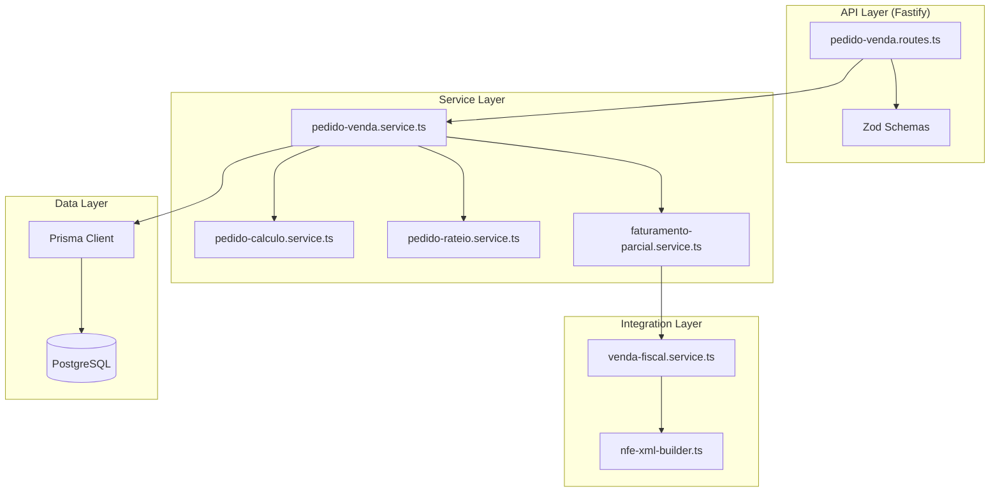

# Design Document — ERP Vendas Pedido Completo

## Overview

Este documento descreve a evolução técnica do módulo de Pedido de Venda do VisioFab ERP, transformando-o de um CRUD básico com fluxo de status em um módulo comercial completo e competitivo. A implementação adiciona campos complementares de cabeçalho/itens, endereço de entrega alternativo, desconto/acréscimo gerais com rateio proporcional, cálculo preciso de preço final, faturamento parcial (backorder), integração de frete/transportadora com NF-e, rastreabilidade via PO do cliente, gestão de prioridade, validações de integridade por status, campos de auditoria/origem, e migração de schema Prisma.

A abordagem é incremental: os novos campos são nullable ou possuem defaults, garantindo compatibilidade com registros existentes. A lógica de cálculo (rateio, preço final) é implementada como funções puras testáveis, separadas da camada de I/O.

## Architecture

### Visão Geral



### Decisões Arquiteturais

1. **Funções puras para cálculos**: `pedido-calculo.service.ts` e `pedido-rateio.service.ts` são módulos sem side-effects, recebem dados e retornam resultados calculados. Isso permite testes unitários e property-based testing sem mocks de banco.

2. **Service layer centralizada**: Toda a lógica de negócio (validação de status, permissões de edição, orquestração de faturamento) fica em `pedido-venda.service.ts`, evitando routes com lógica complexa.

3. **Faturamento parcial como operação atômica**: Usa `prisma.$transaction` para garantir consistência entre atualização de quantidades, criação de VendaEfetivada, emissão NF-e e geração de contas a receber.

4. **VendaEfetivada com relação 1:N**: A relação `PedidoVenda → VendaEfetivada` muda de `@unique` para relação simples (1 pedido pode gerar N vendas efetivadas via faturamento parcial).

5. **EnderecoEntrega como JSON**: Armazenado como campo Json no PedidoVenda ao invés de tabela separada, simplificando CRUD e evitando joins para um dado que é sempre lido/escrito junto com o pedido.

## Components and Interfaces

### 1. pedido-calculo.service.ts (Funções Puras)

```typescript
/**
 * Calcula precoFinal do item
 * Formula: (precoBase × (1 - desconto/100)) - descontoValor
 */
export function calcularPrecoFinal(params: {
  precoBase: number
  descontoPercent: number    // 0-100
  descontoValor: number      // >= 0
}): number

/**
 * Calcula valorTotal do item
 * Formula: (precoFinal × quantidade) + frete + seguro + outrasDespesas
 */
export function calcularValorTotalItem(params: {
  precoFinal: number
  quantidade: number
  frete: number
  seguro: number
  outrasDespesas: number
}): number

/**
 * Calcula valorTotal do pedido a partir dos itens
 */
export function calcularValorTotalPedido(params: {
  itens: Array<{ valorTotal: number }>
  descontoGeralAbsoluto: number  // já convertido de % para valor
  acrescimoGeral: number
}): number

/**
 * Converte desconto percentual para valor absoluto
 */
export function calcularDescontoAbsoluto(params: {
  subtotal: number
  tipoDesconto: 'PERCENTUAL' | 'VALOR_FIXO'
  descontoGeral: number
}): number
```

### 2. pedido-rateio.service.ts (Funções Puras)

```typescript
export interface ItemParaRateio {
  id: string
  valorTotal: number
}

export interface ResultadoRateio {
  itemId: string
  valorRateado: number
}

/**
 * Distribui valor proporcionalmente entre itens, garantindo que
 * sum(valorRateado) === valorTotal (ajusta diferença no item de maior valorTotal)
 */
export function ratearValor(params: {
  itens: ItemParaRateio[]
  valorTotal: number
}): ResultadoRateio[]
```

### 3. pedido-venda.service.ts (Orquestração)

```typescript
export interface CriarPedidoInput {
  clienteId: string
  vendedorId?: string
  tabelaPrecoId: string
  condicaoPagId?: string
  rotaId?: string | null
  // Novos campos de cabeçalho
  dataEntrega?: string
  observacao?: string
  observacaoNota?: string
  transportadoraId?: string
  modalidadeFrete?: string
  origemPedido?: string
  prioridade?: string
  dataValidade?: string
  numeroPedidoCliente?: string
  tipoDesconto?: 'PERCENTUAL' | 'VALOR_FIXO'
  descontoGeral?: number
  acrescimoGeral?: { tipoAcrescimo: string; valor: number }
  enderecoEntrega?: EnderecoEntrega
  orcamentoOrigemId?: string
  itens: ItemInput[]
}

export interface EditarPedidoInput extends Partial<CriarPedidoInput> {}

export class PedidoVendaService {
  async criar(empresaId: string, input: CriarPedidoInput): Promise<PedidoVenda>
  async editar(empresaId: string, pedidoId: string, input: EditarPedidoInput): Promise<PedidoVenda>
  async confirmar(empresaId: string, pedidoId: string): Promise<PedidoVenda>
  async cancelar(empresaId: string, pedidoId: string, motivo: string): Promise<PedidoVenda>
  async listar(empresaId: string, filtros: FiltrosPedido): Promise<{ data: PedidoVenda[]; total: number }>
}
```

### 4. faturamento-parcial.service.ts

```typescript
export interface ItemFaturamento {
  itemId: string
  quantidade: number
}

export interface ResultadoFaturamento {
  vendaEfetivada: VendaEfetivada
  documentoFiscalId: string
  chaveAcesso?: string
  protocolo?: string
  statusPedido: string  // CONFIRMADO ou EFETIVADO
}

export class FaturamentoParcialService {
  /**
   * Processa faturamento parcial ou total de um pedido CONFIRMADO.
   * - Valida saldo disponível de cada item
   * - Cria VendaEfetivada com itens/valores proporcionais
   * - Emite NF-e (com dados de frete/transportadora)
   * - Gera contas a receber proporcionais
   * - Atualiza quantidadeFaturada nos itens
   * - Atualiza status do pedido se totalmente faturado
   */
  async processar(
    empresaId: string,
    pedidoId: string,
    itensFaturamento: ItemFaturamento[]
  ): Promise<ResultadoFaturamento>
}
```

### 5. Validação de Edição por Status

```typescript
/**
 * Determina quais campos são editáveis com base no status e estado de faturamento.
 * Função pura — não faz I/O.
 */
export function obterCamposEditaveis(params: {
  status: string
  temFaturamentosParciais: boolean
}): {
  camposCabecalho: string[]
  podeEditarItens: boolean
  podeEditarItensFaturados: boolean
}

/**
 * Valida se a edição solicitada é permitida para o estado atual do pedido.
 */
export function validarPermissaoEdicao(params: {
  status: string
  temFaturamentosParciais: boolean
  camposAlterados: string[]
  itensAlterados: Array<{ itemId: string; quantidadeFaturada: number }>
}): { permitido: boolean; motivo?: string; itensBloqueados?: ItemBloqueado[] }
```

## Data Models

### PedidoVenda (Evolução do Schema Prisma)

```prisma
model PedidoVenda {
  // --- Campos existentes (sem alteração) ---
  id                 String      @id @default(uuid())
  empresaId          String      @map("empresa_id")
  empresa            Empresa     @relation(fields: [empresaId], references: [id])
  numero             Int
  clienteId          String      @map("cliente_id")
  cliente            Cliente     @relation(fields: [clienteId], references: [id])
  vendedorId         String?     @map("vendedor_id")
  vendedor           Vendedor?   @relation(fields: [vendedorId], references: [id])
  tabelaPrecoId      String      @map("tabela_preco_id")
  tabelaPreco        TabelaPreco @relation(fields: [tabelaPrecoId], references: [id])
  condicaoPagId      String?     @map("condicao_pag_id")
  rotaId             String?     @map("rota_id")
  valorTotal         Decimal     @default(0) @map("valor_total") @db.Decimal(12, 2)
  status             String      @default("RASCUNHO") @db.VarChar(20)
  motivoCancelamento String?     @map("motivo_cancelamento") @db.Text
  criadoEm           DateTime    @default(now()) @map("criado_em")
  atualizadoEm       DateTime    @updatedAt @map("atualizado_em")

  // --- Novos campos de cabeçalho ---
  dataEntrega           DateTime?  @map("data_entrega")
  observacao            String?    @db.Text
  observacaoNota        String?    @map("observacao_nota") @db.Text
  transportadoraId      String?    @map("transportadora_id")
  transportadora        Transportadora? @relation(fields: [transportadoraId], references: [id])
  modalidadeFrete       String?    @map("modalidade_frete") @db.VarChar(1)
  origemPedido          String     @default("MANUAL") @map("origem_pedido") @db.VarChar(20)
  prioridade            String     @default("NORMAL") @db.VarChar(10)
  dataValidade          DateTime?  @map("data_validade")
  numeroPedidoCliente   String?    @map("numero_pedido_cliente") @db.VarChar(60)
  tipoDesconto          String?    @map("tipo_desconto") @db.VarChar(15)
  descontoGeral         Decimal    @default(0) @map("desconto_geral") @db.Decimal(12, 2)
  acrescimoGeral        Decimal    @default(0) @map("acrescimo_geral") @db.Decimal(12, 2)
  tipoAcrescimo         String?    @map("tipo_acrescimo") @db.VarChar(20)
  enderecoEntrega       Json?      @map("endereco_entrega")
  orcamentoOrigemId     String?    @map("orcamento_origem_id")
  dataLimiteAtendimento DateTime?  @map("data_limite_atendimento")

  // --- Relações ---
  itens            ItemPedidoVenda[]
  vendasEfetivadas VendaEfetivada[]  // Mudança: 1:N (antes era 1:1)

  @@unique([empresaId, numero])
  @@map("pedido_venda")
}
```

### ItemPedidoVenda (Evolução do Schema Prisma)

```prisma
model ItemPedidoVenda {
  // --- Campos existentes (sem alteração) ---
  id            String      @id @default(uuid())
  pedidoVendaId String      @map("pedido_venda_id")
  pedidoVenda   PedidoVenda @relation(fields: [pedidoVendaId], references: [id], onDelete: Cascade)
  produtoId     String      @map("produto_id")
  produto       Produto     @relation(fields: [produtoId], references: [id])
  quantidade    Decimal     @db.Decimal(12, 4)
  unidade       String      @default("UN") @db.VarChar(6)
  precoBase     Decimal     @map("preco_base") @db.Decimal(12, 4)
  desconto      Decimal     @default(0) @db.Decimal(5, 2)
  precoFinal    Decimal     @map("preco_final") @db.Decimal(12, 4)
  valorTotal    Decimal     @map("valor_total") @db.Decimal(12, 2)

  // --- Novos campos ---
  descontoValor      Decimal   @default(0) @map("desconto_valor") @db.Decimal(12, 4)
  frete              Decimal   @default(0) @db.Decimal(12, 2)
  seguro             Decimal   @default(0) @db.Decimal(12, 2)
  outrasDespesas     Decimal   @default(0) @map("outras_despesas") @db.Decimal(12, 2)
  observacaoItem     String?   @map("observacao_item") @db.Text
  dataEntregaItem    DateTime? @map("data_entrega_item")
  comissaoPercItem   Decimal   @default(0) @map("comissao_perc_item") @db.Decimal(5, 2)
  quantidadeFaturada Decimal   @default(0) @map("quantidade_faturada") @db.Decimal(12, 4)

  @@map("item_pedido_venda")
}
```

### VendaEfetivada (Alteração de Relação)

```prisma
model VendaEfetivada {
  id             String      @id @default(uuid())
  empresaId      String      @map("empresa_id")
  pedidoVendaId  String      @map("pedido_venda_id")  // Remove @unique para permitir 1:N
  pedidoVenda    PedidoVenda @relation(fields: [pedidoVendaId], references: [id])
  dataEfetivacao DateTime    @default(now()) @map("data_efetivacao")
  valorTotal     Decimal     @map("valor_total") @db.Decimal(12, 2)
  comissaoValor  Decimal?    @map("comissao_valor") @db.Decimal(12, 2)
  statusEntrega  String      @default("PENDENTE") @map("status_entrega") @db.VarChar(20)
  dataEntrega    DateTime?   @map("data_entrega")
  motivoReversao String?     @map("motivo_reversao") @db.Text
  criadoEm       DateTime    @default(now()) @map("criado_em")

  contasReceber     ContaReceber[]
  documentosFiscais DocumentoFiscal[]

  @@map("venda_efetivada")
}
```

### EnderecoEntrega (Schema JSON / Zod)

```typescript
export const enderecoEntregaSchema = z.object({
  logradouro: z.string().min(1).max(200),
  numero: z.string().min(1).max(20),
  complemento: z.string().max(100).optional(),
  bairro: z.string().min(1).max(100),
  cidade: z.string().min(1).max(100),
  uf: z.string().length(2).regex(/^[A-Z]{2}$/),
  cep: z.string().regex(/^\d{8}$/),
  codigoIbge: z.string().regex(/^\d{7}$/).optional(),
})

export type EnderecoEntrega = z.infer<typeof enderecoEntregaSchema>
```

### Enums e Constantes

```typescript
export const MODALIDADES_FRETE = ['0', '1', '2', '3', '4', '9'] as const
export type ModalidadeFrete = typeof MODALIDADES_FRETE[number]

export const ORIGENS_PEDIDO = ['MANUAL', 'ECOMMERCE', 'EDI', 'ORCAMENTO'] as const
export type OrigemPedido = typeof ORIGENS_PEDIDO[number]

export const PRIORIDADES = ['BAIXA', 'NORMAL', 'URGENTE'] as const
export type Prioridade = typeof PRIORIDADES[number]

export const TIPOS_DESCONTO = ['PERCENTUAL', 'VALOR_FIXO'] as const
export type TipoDesconto = typeof TIPOS_DESCONTO[number]

export const TIPOS_ACRESCIMO = ['FRETE', 'SEGURO', 'OUTRAS_DESPESAS'] as const
export type TipoAcrescimo = typeof TIPOS_ACRESCIMO[number]

export const UFS_VALIDAS = [
  'AC','AL','AP','AM','BA','CE','DF','ES','GO','MA','MT','MS',
  'MG','PA','PB','PR','PE','PI','RJ','RN','RS','RO','RR','SC',
  'SP','SE','TO'
] as const
```


## Correctness Properties

*A property is a characteristic or behavior that should hold true across all valid executions of a system — essentially, a formal statement about what the system should do. Properties serve as the bridge between human-readable specifications and machine-verifiable correctness guarantees.*

### Property 1: Price calculation formula (precoFinal)

*For any* item with precoBase ≥ 0, desconto entre 0 e 100, e descontoValor ≥ 0 tal que o resultado seja ≥ 0, o precoFinal calculado SHALL ser exatamente igual a `(precoBase × (1 - desconto/100)) - descontoValor`, arredondado para 4 casas decimais.

**Validates: Requirements 4.2, 5.1**

### Property 2: Item valorTotal formula

*For any* item com precoFinal ≥ 0, quantidade > 0, frete ≥ 0, seguro ≥ 0, outrasDespesas ≥ 0, o valorTotal do item SHALL ser exatamente igual a `(precoFinal × quantidade) + frete + seguro + outrasDespesas`, arredondado para 2 casas decimais.

**Validates: Requirements 4.4, 5.2**

### Property 3: Rateio sum invariant

*For any* pedido com N itens (N ≥ 1) e um valor a ratear (descontoGeral absoluto ou acrescimoGeral) > 0, a soma dos valores rateados distribuídos nos N itens SHALL ser exatamente igual ao valor total a ratear, sem diferença de centavos. A diferença de arredondamento SHALL ser ajustada no item de maior valorTotal.

**Validates: Requirements 3.3, 3.4, 3.5**

### Property 4: Rateio proportionality

*For any* pedido com N itens onde cada item tem valorTotal > 0, o valor rateado para cada item SHALL ser proporcional à fração `item.valorTotal / subtotalPedido`, com desvio máximo de ±0.01 (1 centavo) em relação ao valor proporcional exato.

**Validates: Requirements 3.3, 3.4**

### Property 5: Pedido valorTotal consistency

*For any* pedido com itens calculados, o valorTotal do pedido SHALL ser exatamente igual a `sum(item.valorTotal para cada item)` quando o rateio já está aplicado nos itens, OU `sum(item.valorTotal) - descontoGeralAbsoluto + acrescimoGeral` quando o rateio não foi aplicado.

**Validates: Requirements 4.4, 5.3**

### Property 6: Date validation (past dates rejected)

*For any* data (dataEntrega, dataValidade, dataEntregaItem) cujo valor é anterior à data atual do servidor (considerando apenas a data, sem hora), o sistema SHALL rejeitar a operação. Para qualquer data igual ou posterior à data atual, SHALL aceitar.

**Validates: Requirements 1.6, 1.8, 4.6**

### Property 7: Address format validation

*For any* enderecoEntrega onde uf não corresponde a uma UF brasileira válida de exatamente 2 caracteres maiúsculos, OU onde cep não possui exatamente 8 dígitos numéricos, o sistema SHALL rejeitar a operação. Para qualquer enderecoEntrega com uf válida e cep de 8 dígitos, os campos de formato SHALL ser aceitos.

**Validates: Requirements 2.4, 2.5**

### Property 8: Discount pair validation

*For any* combinação onde tipoDesconto é informado sem descontoGeral, ou descontoGeral é informado sem tipoDesconto, o sistema SHALL rejeitar a operação. Analogamente, para acrescimoGeral informado sem tipoAcrescimo ou sem valor, SHALL rejeitar.

**Validates: Requirements 3.8, 3.9**

### Property 9: Faturamento parcial — accumulated quantity invariant

*For any* sequência de faturamentos parciais sobre um pedido, a quantidadeFaturada de cada item após cada operação SHALL ser exatamente igual à soma de todas as quantidades faturadas em operações anteriores para aquele item. A quantidade original do item SHALL permanecer inalterada.

**Validates: Requirements 6.1, 6.2**

### Property 10: Pedido status reflects billing completeness

*For any* pedido onde existe pelo menos um item com `quantidade - quantidadeFaturada > 0`, o status SHALL permanecer CONFIRMADO. *For any* pedido onde todos os itens possuem `quantidadeFaturada == quantidade`, o status SHALL ser EFETIVADO.

**Validates: Requirements 6.4, 6.5**

### Property 11: Faturamento parcial — rejection atomicity

*For any* solicitação de faturamento parcial onde pelo menos um item possui quantidade solicitada maior que o saldo disponível (`quantidade - quantidadeFaturada`), o sistema SHALL rejeitar a operação inteira sem processar nenhum item e sem alterar nenhuma quantidadeFaturada.

**Validates: Requirements 6.6**

### Property 12: Edit permissions respect status rules

*For any* pedido em status RASCUNHO, todas as edições de campos de cabeçalho e itens SHALL ser permitidas. *For any* pedido em status CONFIRMADO sem faturamentos, apenas o subset de campos permitidos (observacao, observacaoNota, prioridade, dataEntrega, transportadoraId, modalidadeFrete, enderecoEntrega) SHALL ser editável. *For any* pedido EFETIVADO ou CANCELADO, nenhuma edição SHALL ser permitida.

**Validates: Requirements 10.1, 10.2, 10.3, 10.6**

### Property 13: Partially billed items are immutable

*For any* pedido CONFIRMADO com faturamentos parciais, itens cuja `quantidadeFaturada > 0` SHALL ser imutáveis (não podem ser editados nem removidos). Itens com `quantidadeFaturada == 0` SHALL permanecer editáveis.

**Validates: Requirements 10.4, 10.5**

### Property 14: Priority ordering invariant

*For any* listagem de pedidos ordenada por prioridade, todos os pedidos URGENTE SHALL aparecer antes de pedidos NORMAL, e todos NORMAL antes de BAIXA. Dentro da mesma prioridade, pedidos com criadoEm menor (mais antigos) SHALL aparecer primeiro.

**Validates: Requirements 9.2**

### Property 15: Priority filter correctness

*For any* consulta à listagem com filtro prioridade contendo valor válido, todos os pedidos retornados SHALL possuir exatamente a prioridade informada no filtro.

**Validates: Requirements 9.1**

### Property 16: numeroPedidoCliente search (partial, case-insensitive)

*For any* pedido com numeroPedidoCliente não-vazio e qualquer substring de 1+ caractere desse valor (em qualquer combinação de maiúsculas/minúsculas), a busca com esse substring SHALL retornar o pedido nos resultados.

**Validates: Requirements 8.3**

### Property 17: numeroPedidoCliente truncation in NF-e (xPed)

*For any* numeroPedidoCliente de comprimento L, o valor incluído no tag xPed da NF-e SHALL ter exatamente `min(L, 15)` caracteres, correspondendo aos primeiros 15 caracteres do valor armazenado.

**Validates: Requirements 8.2**

### Property 18: observacaoNota truncation in NF-e (infCpl)

*For any* observacaoNota de comprimento L, o valor incluído no campo infCpl da NF-e SHALL ter exatamente `min(L, 5000)` caracteres, correspondendo aos primeiros 5000 caracteres do valor armazenado.

**Validates: Requirements 7.4**

### Property 19: Origin filter correctness

*For any* consulta à listagem com filtro origemPedido contendo valor válido (MANUAL, ECOMMERCE, EDI, ORCAMENTO), todos os pedidos retornados SHALL possuir exatamente a origem informada no filtro.

**Validates: Requirements 11.1**

### Property 20: orcamentoOrigemId requires origemPedido ORCAMENTO

*For any* operação de criação/edição onde orcamentoOrigemId é informado e origemPedido é diferente de ORCAMENTO, o sistema SHALL rejeitar a operação.

**Validates: Requirements 11.5**

## Error Handling

### Estratégia de Erros

| Cenário | HTTP Status | Formato da Resposta |
|---------|-------------|---------------------|
| Validação Zod (campos inválidos) | 400 | `{ message: string, campo?: string, motivo?: string }` |
| Desconto excede subtotal | 400 | `{ message: "Desconto não pode exceder o subtotal", subtotal: number, desconto: number }` |
| Transportadora inexistente/outra empresa | 400 | `{ message: "Transportadora não encontrada ou não pertence a esta empresa" }` |
| Data no passado | 400 | `{ message: "Data deve ser igual ou posterior à data atual", campo: string }` |
| Modalidade de frete inválida | 400 | `{ message: "Modalidade de frete inválida", valoresValidos: string[] }` |
| Pedido não encontrado | 404 | `{ message: "Pedido de venda não encontrado" }` |
| Status não permite operação | 422 | `{ message: string, statusAtual: string }` |
| Edição de campo não permitido | 422 | `{ message: string, camposNaoEditaveis: string[] }` |
| Edição de item faturado | 422 | `{ message: string, itensBloqueados: ItemBloqueado[] }` |
| Saldo insuficiente para faturamento | 422 | `{ message: string, item: string, saldoDisponivel: number }` |
| Transportadora com dados incompletos na efetivação | 422 | `{ message: string, camposIncompletos: string[] }` |
| Cliente sem endereço para NF-e | 422 | `{ message: "Cliente não possui endereço cadastrado para emissão da NF-e" }` |
| NF-e rejeitada pela SEFAZ | 422 | `{ message: string, cStat: string, xMotivo: string }` |
| Filtro prioridade/origemPedido inválido | 400 | `{ message: string, valoresAceitos: string[] }` |

### Tratamento de Arredondamento

- Cálculos intermediários: 4 casas decimais
- Resultado final (valorTotal item e pedido): 2 casas decimais
- Arredondamento: half-up (Math.round para positivos; para controle preciso, usar `Decimal.js` ou multiplicar por 10^n)
- Diferença de rateio: ajustada no item de maior valorTotal

### Validações Cross-Field

1. `tipoDesconto` ↔ `descontoGeral`: obrigatórios em conjunto
2. `acrescimoGeral` → requer `tipoAcrescimo` e `valor` em conjunto  
3. `orcamentoOrigemId` → requer `origemPedido === 'ORCAMENTO'`
4. `enderecoEntrega` → campos obrigatórios internos (logradouro, numero, bairro, cidade, uf, cep)
5. `descontoValor + desconto percentual` → resultado `precoFinal >= 0`
6. Faturamento parcial: `quantidadeSolicitada <= quantidade - quantidadeFaturada` para cada item

## Testing Strategy

### Abordagem Dual

1. **Property-Based Tests** (fast-check) — para validar propriedades universais sobre cálculos, rateio, validações e regras de status
2. **Unit Tests** (vitest) — para cenários específicos, integrações e edge cases

### Property-Based Testing (fast-check)

- **Library**: fast-check (já utilizado no frontend do projeto)
- **Configuração**: mínimo 100 iterações por property test
- **Tag format**: `Feature: erp-vendas-pedido-completo, Property {N}: {descrição}`
- **Arquivos**: `src/tests/pedido-venda/pedido-calculo.property.test.ts`, `src/tests/pedido-venda/pedido-rateio.property.test.ts`, `src/tests/pedido-venda/pedido-validacao.property.test.ts`, `src/tests/pedido-venda/faturamento-parcial.property.test.ts`

### Cobertura por Camada

| Camada | Tipo de Teste | Exemplos |
|--------|--------------|----------|
| `pedido-calculo.service.ts` | Property (Properties 1, 2, 5) | Fórmulas de preço e total |
| `pedido-rateio.service.ts` | Property (Properties 3, 4) | Distribuição proporcional, soma invariante |
| Validações de campo | Property (Properties 6, 7, 8) | Datas, UF/CEP, pares obrigatórios |
| Faturamento parcial | Property (Properties 9, 10, 11) | Acumulação, status, atomicidade |
| Permissões de edição | Property (Properties 12, 13) | Regras por status |
| Listagem/filtros | Property (Properties 14, 15, 16, 19) | Ordenação, filtros, busca |
| NF-e truncation | Property (Properties 17, 18) | xPed, infCpl |
| Integração NF-e | Integration (1-2 exemplos) | XML com transportadora/frete |
| Migration | Smoke (1 execução) | Preservação de dados |

### Unit Tests (Exemplos Específicos)

- Default de origemPedido = MANUAL (Req 1.4)
- Default de prioridade = NORMAL (Req 1.5)
- Modalidade frete padrão 9 quando não informada (Req 7.3)
- dataLimiteAtendimento = criadoEm + 24h para URGENTE (Req 9.3)
- Rejeição de orcamentoOrigemId inexistente (Req 11.2)
- Resposta com itensBloqueados ao editar item faturado (Req 10.7)
- Cliente sem endereço bloqueia efetivação (Req 2.7)
- Transportadora sem CNPJ bloqueia efetivação (Req 7.5)
