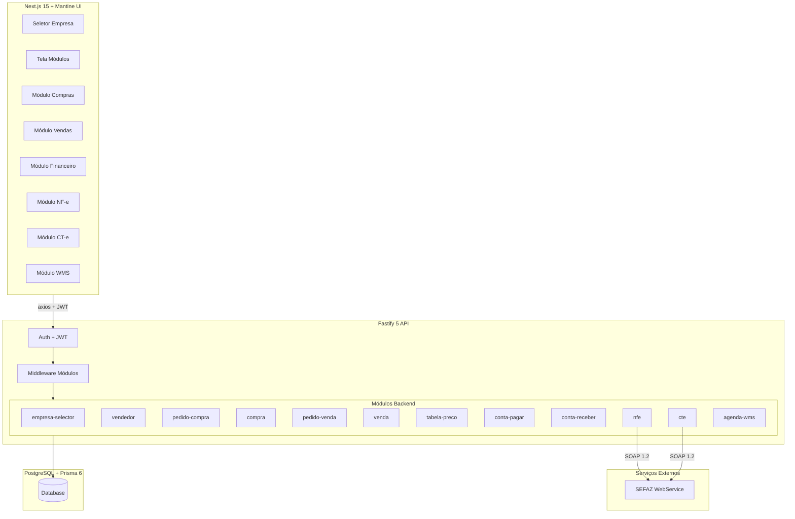
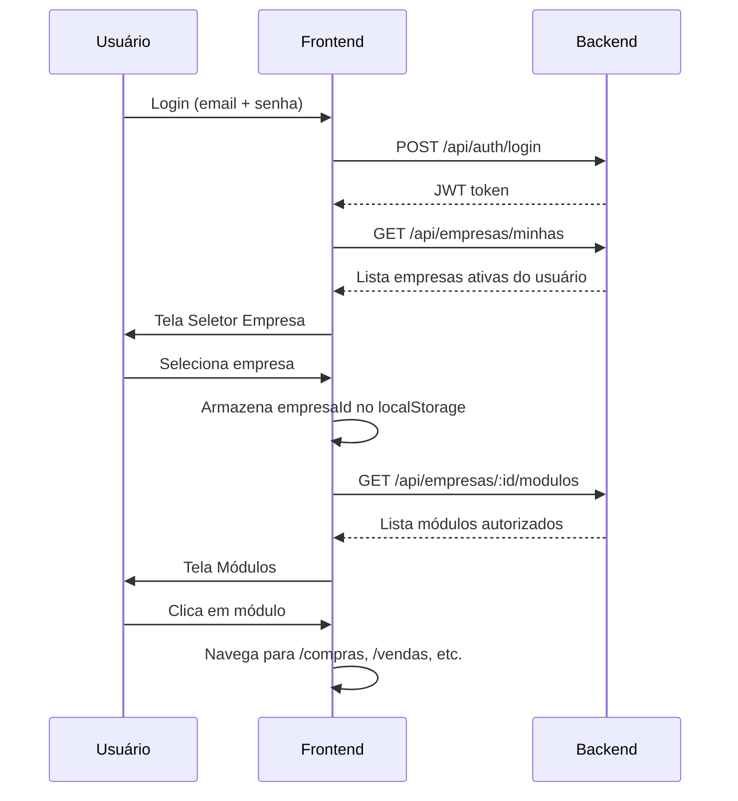
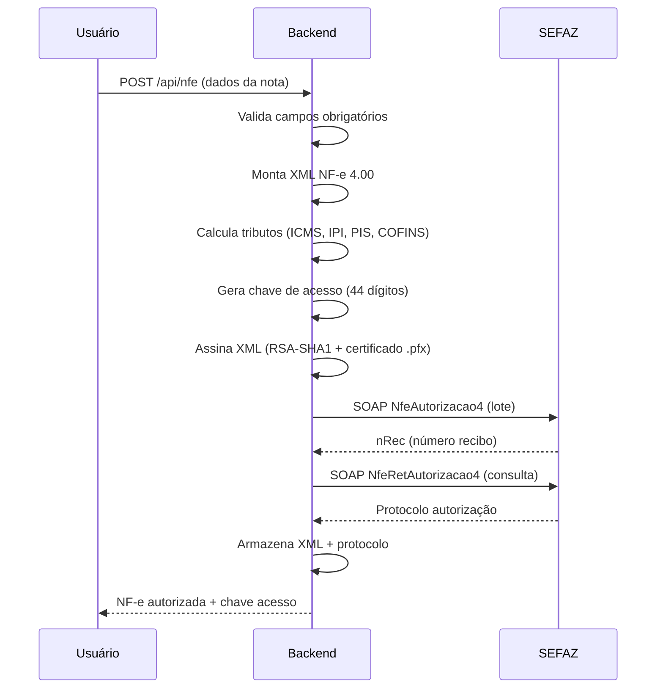
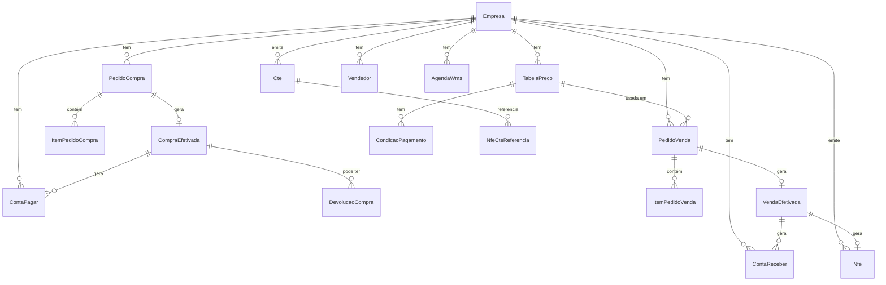
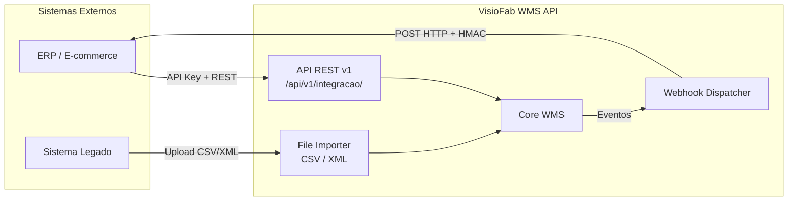

# Documento de Design Técnico — ERP WMS Módulos

## Overview

Este documento descreve o design técnico para a expansão do VisioFab WMS em uma plataforma ERP multi-módulo. O sistema existente já possui autenticação JWT, multiempresa e um WMS funcional. A expansão adiciona:

1. **Seleção de Empresa + Tela de Módulos** — fluxo pós-login com seleção de contexto empresarial e exibição de módulos autorizados
2. **Módulo Compras** — pedidos de compra, efetivação, importação XML NF-e, devolução, transferência entre empresas
3. **Módulo Vendas** — tabelas de preço, pedidos de venda, efetivação com emissão de NF-e, controle de entrega, comissões
4. **Módulo Financeiro** — contas a pagar e contas a receber com baixa e controle de vencimentos
5. **Módulo NF-e** — montagem XML NF-e 4.00, assinatura digital, comunicação SEFAZ, DANFE
6. **Módulo CT-e** — montagem XML CT-e, envio SEFAZ
7. **Integração WMS** — agenda de recebimento vinculada a compras, ordens de separação vinculadas a vendas
8. **Integração Externa** — API REST pública com API Keys, webhooks para notificação de eventos, importação de arquivos CSV/XML para sistemas legados

### Decisões de Design

- **Monorepo existente**: backend Fastify 5 + Prisma 6 + PostgreSQL; frontend Next.js 15 + Mantine UI 7
- **Padrão de módulos**: cada módulo backend segue o padrão `{modulo}.routes.ts` com validação Zod inline, usando `prisma` diretamente (sem camada de service separada, conforme padrão existente)
- **Multiempresa**: todas as queries filtram por `empresaId` extraído do contexto JWT/sessão
- **Controle de acesso por módulo**: middleware Fastify que valida `UsuarioEmpresa.modulos` antes de cada rota
- **NF-e**: montagem XML em memória com `node-forge` para assinatura digital; comunicação SOAP com SEFAZ
- **Numeração sequencial**: uso de `@default(autoincrement())` no Prisma para sequenciais por empresa, com unique constraint composta `[empresaId, numero]`

---

## Architecture

### Diagrama de Arquitetura Geral



### Fluxo Pós-Login



### Fluxo NF-e



---

## Components and Interfaces

### Backend — Novos Módulos

Cada módulo segue o padrão existente: arquivo `{modulo}.routes.ts` registrado no `server.ts` com prefixo `/api/{recurso}`.

#### 1. `empresa-selector` — Seleção de Empresa

| Endpoint | Método | Descrição |
|---|---|---|
| `/api/empresas/minhas` | GET | Lista empresas ativas vinculadas ao usuário autenticado |
| `/api/empresas/:id/modulos` | GET | Retorna módulos autorizados para o usuário na empresa |
| `/api/empresas/:id/selecionar` | POST | Registra seleção de empresa no contexto (retorna token atualizado com empresaId) |

#### 2. `vendedor` — CRUD Vendedores

| Endpoint | Método | Descrição |
|---|---|---|
| `/api/vendedores` | GET | Lista vendedores da empresa (paginado, com busca) |
| `/api/vendedores` | POST | Cria vendedor |
| `/api/vendedores/:id` | PUT | Edita vendedor |
| `/api/vendedores/:id/inativar` | PATCH | Inativa vendedor |

#### 3. `pedido-compra` — Pedidos de Compra

| Endpoint | Método | Descrição |
|---|---|---|
| `/api/pedidos-compra` | GET | Lista pedidos de compra (paginado, filtros por status/fornecedor/período) |
| `/api/pedidos-compra` | POST | Cria pedido de compra com itens |
| `/api/pedidos-compra/:id` | GET | Detalhe do pedido com itens |
| `/api/pedidos-compra/:id` | PUT | Edita pedido (apenas RASCUNHO) |
| `/api/pedidos-compra/:id/confirmar` | PATCH | Altera status para CONFIRMADO |
| `/api/pedidos-compra/:id/cancelar` | PATCH | Cancela pedido (exige motivo ≥ 10 chars) |

#### 4. `compra` — Efetivação de Compra

| Endpoint | Método | Descrição |
|---|---|---|
| `/api/compras` | GET | Lista compras efetivadas |
| `/api/compras/efetivar` | POST | Efetiva pedido de compra (gera contas a pagar + agenda WMS) |
| `/api/compras/:id` | GET | Detalhe da compra efetivada |
| `/api/compras/:id/devolver` | POST | Registra devolução parcial/total |
| `/api/compras/importar-xml` | POST | Importa NF-e XML e cria pedido + compra efetivada |
| `/api/compras/transferir` | POST | Transferência entre empresas |

#### 5. `pedido-venda` — Pedidos de Venda

| Endpoint | Método | Descrição |
|---|---|---|
| `/api/pedidos-venda` | GET | Lista pedidos de venda (paginado, filtros) |
| `/api/pedidos-venda` | POST | Cria pedido de venda com itens |
| `/api/pedidos-venda/:id` | GET | Detalhe do pedido com itens |
| `/api/pedidos-venda/:id` | PUT | Edita pedido (apenas RASCUNHO) |
| `/api/pedidos-venda/:id/confirmar` | PATCH | Altera status para CONFIRMADO |
| `/api/pedidos-venda/:id/cancelar` | PATCH | Cancela pedido (exige motivo ≥ 10 chars) |

#### 6. `venda` — Efetivação de Venda

| Endpoint | Método | Descrição |
|---|---|---|
| `/api/vendas` | GET | Lista vendas efetivadas |
| `/api/vendas/efetivar` | POST | Efetiva pedido de venda (gera NF-e + contas a receber + comissão + ordem WMS) |
| `/api/vendas/:id` | GET | Detalhe da venda efetivada |
| `/api/vendas/:id/entrega` | PATCH | Atualiza status de entrega (sem WMS) |

#### 7. `tabela-preco` — Tabelas de Preço

| Endpoint | Método | Descrição |
|---|---|---|
| `/api/tabelas-preco` | GET | Lista tabelas de preço da empresa |
| `/api/tabelas-preco` | POST | Cria tabela com condições de pagamento |
| `/api/tabelas-preco/:id` | PUT | Edita tabela e condições |
| `/api/tabelas-preco/:id` | GET | Detalhe com condições |

#### 8. `conta-pagar` — Contas a Pagar

| Endpoint | Método | Descrição |
|---|---|---|
| `/api/contas-pagar` | GET | Lista contas a pagar (filtros: status, fornecedor, período) |
| `/api/contas-pagar` | POST | Cria conta a pagar manual |
| `/api/contas-pagar/:id` | GET | Detalhe |
| `/api/contas-pagar/:id/pagar` | PATCH | Registra pagamento (valor > 0) |

#### 9. `conta-receber` — Contas a Receber

| Endpoint | Método | Descrição |
|---|---|---|
| `/api/contas-receber` | GET | Lista contas a receber (filtros: status, cliente, período) |
| `/api/contas-receber` | POST | Cria conta a receber manual |
| `/api/contas-receber/:id` | GET | Detalhe |
| `/api/contas-receber/:id/receber` | PATCH | Registra recebimento (valor > 0) |

#### 10. `nfe` — Emissão de NF-e

| Endpoint | Método | Descrição |
|---|---|---|
| `/api/nfe` | POST | Monta, assina e envia NF-e para SEFAZ |
| `/api/nfe/:id` | GET | Consulta NF-e com XML e protocolo |
| `/api/nfe/:id/cancelar` | POST | Cancela NF-e na SEFAZ |
| `/api/nfe/:id/danfe` | GET | Gera PDF do DANFE |
| `/api/nfe/inutilizar` | POST | Inutiliza faixa de numeração |

#### 11. `cte` — Emissão de CT-e

| Endpoint | Método | Descrição |
|---|---|---|
| `/api/cte` | POST | Monta, assina e envia CT-e para SEFAZ |
| `/api/cte/:id` | GET | Consulta CT-e com XML e protocolo |
| `/api/cte/:id/cancelar` | POST | Cancela CT-e na SEFAZ |

#### 12. `agenda-wms` — Agendamentos WMS

| Endpoint | Método | Descrição |
|---|---|---|
| `/api/agenda-wms` | GET | Lista agendamentos (filtros: data, status) |
| `/api/agenda-wms/:id` | GET | Detalhe do agendamento |
| `/api/agenda-wms/:id/concluir` | PATCH | Marca recebimento como concluído |

### Middleware de Autorização por Módulo

```typescript
// src/middleware/modulo-guard.ts
type Modulo = 'COMPRAS' | 'VENDAS' | 'FINANCEIRO' | 'WMS' | 'CTE' | 'PCP'

function moduloGuard(modulo: Modulo) {
  return async (request: FastifyRequest, reply: FastifyReply) => {
    const { empresaId, usuarioId } = request.user
    const vinculo = await prisma.usuarioEmpresa.findUnique({
      where: { usuarioId_empresaId: { usuarioId, empresaId } }
    })
    if (!vinculo) return reply.status(403).send({ message: 'Sem acesso à empresa' })
    if (vinculo.modulos !== '*' && !vinculo.modulos.split(',').includes(modulo)) {
      return reply.status(403).send({ message: 'Sem acesso ao módulo' })
    }
  }
}
```

Mapeamento de rotas para módulos:
- `/api/pedidos-compra`, `/api/compras` → `COMPRAS`
- `/api/pedidos-venda`, `/api/vendas`, `/api/tabelas-preco`, `/api/vendedores` → `VENDAS`
- `/api/contas-pagar`, `/api/contas-receber` → `FINANCEIRO`
- `/api/nfe` → `VENDAS` (NF-e é parte do fluxo de vendas)
- `/api/cte` → `CTE`
- `/api/agenda-wms` → `WMS`

### Frontend — Novas Páginas

```
src/app/(interna)/
  selecionar-empresa/page.tsx     — Seletor de empresa pós-login
  modulos/page.tsx                — Grid de módulos disponíveis
  compras/
    pedidos/page.tsx              — Lista pedidos de compra
    pedidos/novo/page.tsx         — Formulário novo pedido
    pedidos/[id]/page.tsx         — Detalhe/edição pedido
    compras-efetivadas/page.tsx   — Lista compras efetivadas
    devolucoes/page.tsx           — Devoluções de compra
    transferencias/page.tsx       — Transferências entre empresas
    importar-xml/page.tsx         — Upload e importação de XML NF-e
  vendas/
    pedidos/page.tsx              — Lista pedidos de venda
    pedidos/novo/page.tsx         — Formulário novo pedido
    pedidos/[id]/page.tsx         — Detalhe/edição pedido
    vendas-efetivadas/page.tsx    — Lista vendas efetivadas
    entregas/page.tsx             — Controle de entregas (sem WMS)
    comissoes/page.tsx            — Relatório de comissões
    tabelas-preco/page.tsx        — Gestão de tabelas de preço
  financeiro/
    contas-pagar/page.tsx         — Lista contas a pagar
    contas-receber/page.tsx       — Lista contas a receber
  fiscal/
    nfe/page.tsx                  — Emissão e consulta NF-e
    cte/page.tsx                  — Emissão e consulta CT-e
  configurador/
    vendedores/page.tsx           — CRUD vendedores
    tributacao/page.tsx           — Configuração fiscal por produto
```

### Contexto de Empresa no Frontend

```typescript
// src/providers/EmpresaProvider.tsx
interface EmpresaContextType {
  empresa: Empresa | null
  modulos: string[]
  selecionarEmpresa: (id: string) => Promise<void>
  trocarEmpresa: () => void
}
```

O `empresaId` é enviado em todas as requisições via header `X-Empresa-Id` ou incluído no JWT atualizado após seleção.

---

## Data Models

### Alterações no Schema Prisma Existente

#### Empresa — Campos Adicionais (NF-e/CT-e)

```prisma
model Empresa {
  // ... campos existentes ...

  // Fiscal
  regimeTributario  Int     @default(3) @map("regime_tributario") // 1=Simples, 2=Simples Excesso, 3=Normal
  certificadoPfx    String? @db.Text @map("certificado_pfx")     // base64 do .pfx
  senhaCertificado  String? @db.VarChar(200) @map("senha_certificado") // criptografada
  ambienteNFe       Int     @default(2) @map("ambiente_nfe")     // 1=Produção, 2=Homologação
  serieNFe          Int     @default(1) @map("serie_nfe")
  proximoNumeroNFe  Int     @default(1) @map("proximo_numero_nfe")
  serieCTe          Int     @default(1) @map("serie_cte")
  proximoNumeroCTe  Int     @default(1) @map("proximo_numero_cte")

  // Novas relações
  nfes              Nfe[]
  ctes              Cte[]
  devolucoes        DevolucaoCompra[]
  transferencias    TransferenciaEstoque[]
  agendaWms         AgendaWms[]
}
```

#### Produto — Campos Fiscais

```prisma
model Produto {
  // ... campos existentes ...

  // Fiscal
  ncm           String?  @db.VarChar(8)
  cfopEstadual  String?  @db.VarChar(4) @map("cfop_estadual")   // ex: "5102"
  cfopInterest  String?  @db.VarChar(4) @map("cfop_interest")   // ex: "6102"
  cst           String?  @db.VarChar(3)                          // CST ICMS regime normal
  csosn         String?  @db.VarChar(4)                          // CSOSN Simples Nacional
  aliqICMS      Decimal  @default(0) @db.Decimal(5,2) @map("aliq_icms")
  aliqIPI       Decimal  @default(0) @db.Decimal(5,2) @map("aliq_ipi")
  cstPIS        String?  @db.VarChar(2) @map("cst_pis")
  aliqPIS       Decimal  @default(0) @db.Decimal(5,2) @map("aliq_pis")
  cstCOFINS     String?  @db.VarChar(2) @map("cst_cofins")
  aliqCOFINS    Decimal  @default(0) @db.Decimal(5,2) @map("aliq_cofins")
  origemProd    Int      @default(0) @map("origem_prod")         // 0=nacional, 1=estrangeira
  cEAN          String?  @db.VarChar(14) @map("c_ean")           // código de barras
}
```

### Novos Models

#### Vendedor

```prisma
model Vendedor {
  id            String   @id @default(uuid())
  empresaId     String   @map("empresa_id")
  empresa       Empresa  @relation(fields: [empresaId], references: [id])
  nome          String   @db.VarChar(150)
  cpf           String   @db.VarChar(14)
  comissao      Decimal  @db.Decimal(5,2) // 0.00 a 100.00
  status        Boolean  @default(true)
  criadoEm      DateTime @default(now()) @map("criado_em")
  atualizadoEm  DateTime @updatedAt @map("atualizado_em")

  pedidosCompra PedidoCompra[]
  pedidosVenda  PedidoVenda[]

  @@unique([empresaId, cpf])
  @@map("vendedor")
}
```

#### Pedido de Compra + Itens

```prisma
model PedidoCompra {
  id              String   @id @default(uuid())
  empresaId       String   @map("empresa_id")
  empresa         Empresa  @relation(fields: [empresaId], references: [id])
  numero          Int      @map("numero") // sequencial por empresa
  fornecedorId    String   @map("fornecedor_id")
  fornecedor      Fornecedor @relation(fields: [fornecedorId], references: [id])
  vendedorId      String?  @map("vendedor_id")
  vendedor        Vendedor? @relation(fields: [vendedorId], references: [id])
  dataEntrega     DateTime? @map("data_entrega")
  valorTotal      Decimal  @default(0) @db.Decimal(12,2) @map("valor_total")
  status          String   @default("RASCUNHO") @db.VarChar(20) // RASCUNHO, CONFIRMADO, RECEBIDO, CANCELADO
  motivoCancelamento String? @db.Text @map("motivo_cancelamento")
  criadoEm        DateTime @default(now()) @map("criado_em")
  atualizadoEm    DateTime @updatedAt @map("atualizado_em")

  itens           ItemPedidoCompra[]
  compraEfetivada CompraEfetivada?

  @@unique([empresaId, numero])
  @@map("pedido_compra")
}

model ItemPedidoCompra {
  id              String   @id @default(uuid())
  pedidoCompraId  String   @map("pedido_compra_id")
  pedidoCompra    PedidoCompra @relation(fields: [pedidoCompraId], references: [id], onDelete: Cascade)
  produtoId       String   @map("produto_id")
  produto         Produto  @relation(fields: [produtoId], references: [id])
  quantidade      Decimal  @db.Decimal(12,4)
  precoUnitario   Decimal  @db.Decimal(12,4) @map("preco_unitario")
  classificacao   String   @default("REVENDA") @db.VarChar(20) // REVENDA, MATERIA_PRIMA
  valorTotal      Decimal  @db.Decimal(12,2) @map("valor_total") // quantidade * precoUnitario

  @@map("item_pedido_compra")
}
```

#### Compra Efetivada

```prisma
model CompraEfetivada {
  id              String   @id @default(uuid())
  empresaId       String   @map("empresa_id")
  pedidoCompraId  String   @unique @map("pedido_compra_id")
  pedidoCompra    PedidoCompra @relation(fields: [pedidoCompraId], references: [id])
  dataEfetivacao  DateTime @default(now()) @map("data_efetivacao")
  dataEntrega     DateTime? @map("data_entrega") // preenchido quando usaWms=false
  xmlNfe          String?  @db.Text @map("xml_nfe") // XML original da NF-e importada
  valorTotal      Decimal  @db.Decimal(12,2) @map("valor_total")
  criadoEm        DateTime @default(now()) @map("criado_em")

  devolucoes      DevolucaoCompra[]
  contasPagar     ContaPagar[]

  @@map("compra_efetivada")
}
```

#### Devolução de Compra

```prisma
model DevolucaoCompra {
  id                String   @id @default(uuid())
  empresaId         String   @map("empresa_id")
  empresa           Empresa  @relation(fields: [empresaId], references: [id])
  compraEfetivadaId String   @map("compra_efetivada_id")
  compraEfetivada   CompraEfetivada @relation(fields: [compraEfetivadaId], references: [id])
  dataDevolucao     DateTime @default(now()) @map("data_devolucao")
  valorTotal        Decimal  @db.Decimal(12,2) @map("valor_total")
  criadoEm          DateTime @default(now()) @map("criado_em")

  itens             ItemDevolucaoCompra[]

  @@map("devolucao_compra")
}

model ItemDevolucaoCompra {
  id                  String   @id @default(uuid())
  devolucaoCompraId   String   @map("devolucao_compra_id")
  devolucaoCompra     DevolucaoCompra @relation(fields: [devolucaoCompraId], references: [id], onDelete: Cascade)
  produtoId           String   @map("produto_id")
  produto             Produto  @relation(fields: [produtoId], references: [id])
  quantidade          Decimal  @db.Decimal(12,4)
  precoUnitario       Decimal  @db.Decimal(12,4) @map("preco_unitario")

  @@map("item_devolucao_compra")
}
```

#### Transferência entre Empresas

```prisma
model TransferenciaEstoque {
  id                String   @id @default(uuid())
  empresaOrigemId   String   @map("empresa_origem_id")
  empresaOrigem     Empresa  @relation("TransferenciaOrigem", fields: [empresaOrigemId], references: [id])
  empresaDestinoId  String   @map("empresa_destino_id")
  empresaDestino    Empresa  @relation("TransferenciaDestino", fields: [empresaDestinoId], references: [id])
  dataTransferencia DateTime @default(now()) @map("data_transferencia")
  status            String   @default("PENDENTE") @db.VarChar(20) // PENDENTE, CONFIRMADA, CANCELADA
  criadoEm          DateTime @default(now()) @map("criado_em")

  itens             ItemTransferencia[]

  @@map("transferencia_estoque")
}

model ItemTransferencia {
  id                    String   @id @default(uuid())
  transferenciaId       String   @map("transferencia_id")
  transferencia         TransferenciaEstoque @relation(fields: [transferenciaId], references: [id], onDelete: Cascade)
  produtoId             String   @map("produto_id")
  produto               Produto  @relation(fields: [produtoId], references: [id])
  quantidade            Decimal  @db.Decimal(12,4)

  @@map("item_transferencia")
}
```

#### Tabela de Preço + Condições

```prisma
model TabelaPreco {
  id            String   @id @default(uuid())
  empresaId     String   @map("empresa_id")
  empresa       Empresa  @relation(fields: [empresaId], references: [id])
  nome          String   @db.VarChar(100)
  status        Boolean  @default(true)
  criadoEm      DateTime @default(now()) @map("criado_em")
  atualizadoEm  DateTime @updatedAt @map("atualizado_em")

  condicoes     CondicaoPagamento[]
  pedidosVenda  PedidoVenda[]

  @@map("tabela_preco")
}

model CondicaoPagamento {
  id              String   @id @default(uuid())
  tabelaPrecoId   String   @map("tabela_preco_id")
  tabelaPreco     TabelaPreco @relation(fields: [tabelaPrecoId], references: [id], onDelete: Cascade)
  formaPagamento  String   @db.VarChar(30) // DINHEIRO, BOLETO, CARTAO_CREDITO, PIX, etc.
  parcelas        Int      @default(1)
  percentual      Decimal  @db.Decimal(6,2) // -100.00 a 100.00 (desconto/acréscimo)

  @@map("condicao_pagamento")
}
```

#### Pedido de Venda + Itens

```prisma
model PedidoVenda {
  id              String   @id @default(uuid())
  empresaId       String   @map("empresa_id")
  empresa         Empresa  @relation(fields: [empresaId], references: [id])
  numero          Int      @map("numero") // sequencial por empresa
  clienteId       String   @map("cliente_id")
  cliente         Cliente  @relation(fields: [clienteId], references: [id])
  vendedorId      String?  @map("vendedor_id")
  vendedor        Vendedor? @relation(fields: [vendedorId], references: [id])
  tabelaPrecoId   String   @map("tabela_preco_id")
  tabelaPreco     TabelaPreco @relation(fields: [tabelaPrecoId], references: [id])
  condicaoPagId   String?  @map("condicao_pag_id") // condição selecionada da tabela
  valorTotal      Decimal  @default(0) @db.Decimal(12,2) @map("valor_total")
  status          String   @default("RASCUNHO") @db.VarChar(20) // RASCUNHO, CONFIRMADO, EM_SEPARACAO, FATURADO, CANCELADO
  motivoCancelamento String? @db.Text @map("motivo_cancelamento")
  criadoEm        DateTime @default(now()) @map("criado_em")
  atualizadoEm    DateTime @updatedAt @map("atualizado_em")

  itens           ItemPedidoVenda[]
  vendaEfetivada  VendaEfetivada?

  @@unique([empresaId, numero])
  @@map("pedido_venda")
}

model ItemPedidoVenda {
  id              String   @id @default(uuid())
  pedidoVendaId   String   @map("pedido_venda_id")
  pedidoVenda     PedidoVenda @relation(fields: [pedidoVendaId], references: [id], onDelete: Cascade)
  produtoId       String   @map("produto_id")
  produto         Produto  @relation(fields: [produtoId], references: [id])
  quantidade      Decimal  @db.Decimal(12,4)
  precoBase       Decimal  @db.Decimal(12,4) @map("preco_base")
  precoFinal      Decimal  @db.Decimal(12,4) @map("preco_final") // após aplicar condição
  valorTotal      Decimal  @db.Decimal(12,2) @map("valor_total") // quantidade * precoFinal

  @@map("item_pedido_venda")
}
```

#### Venda Efetivada

```prisma
model VendaEfetivada {
  id              String   @id @default(uuid())
  empresaId       String   @map("empresa_id")
  pedidoVendaId   String   @unique @map("pedido_venda_id")
  pedidoVenda     PedidoVenda @relation(fields: [pedidoVendaId], references: [id])
  dataEfetivacao  DateTime @default(now()) @map("data_efetivacao")
  valorTotal      Decimal  @db.Decimal(12,2) @map("valor_total")
  comissaoValor   Decimal? @db.Decimal(12,2) @map("comissao_valor")
  statusEntrega   String   @default("PENDENTE") @db.VarChar(20) @map("status_entrega") // PENDENTE, EM_TRANSITO, ENTREGUE
  dataEntrega     DateTime? @map("data_entrega")
  motivoReversao  String?  @db.Text @map("motivo_reversao")
  criadoEm        DateTime @default(now()) @map("criado_em")

  contasReceber   ContaReceber[]
  nfe             Nfe?

  @@map("venda_efetivada")
}
```

#### Contas a Pagar

```prisma
model ContaPagar {
  id                String   @id @default(uuid())
  empresaId         String   @map("empresa_id")
  empresa           Empresa  @relation(fields: [empresaId], references: [id])
  compraEfetivadaId String?  @map("compra_efetivada_id")
  compraEfetivada   CompraEfetivada? @relation(fields: [compraEfetivadaId], references: [id])
  fornecedorId      String?  @map("fornecedor_id")
  fornecedor        Fornecedor? @relation(fields: [fornecedorId], references: [id])
  descricao         String   @db.VarChar(300)
  valor             Decimal  @db.Decimal(12,2)
  dataVencimento    DateTime @map("data_vencimento")
  dataPagamento     DateTime? @map("data_pagamento")
  valorPago         Decimal? @db.Decimal(12,2) @map("valor_pago")
  formaPagamento    String?  @db.VarChar(30) @map("forma_pagamento")
  status            String   @default("ABERTA") @db.VarChar(20) // ABERTA, PAGA, VENCIDA (calculado)
  parcela           Int      @default(1)
  totalParcelas     Int      @default(1) @map("total_parcelas")
  criadoEm          DateTime @default(now()) @map("criado_em")

  @@map("conta_pagar")
}
```

#### Contas a Receber

```prisma
model ContaReceber {
  id                String   @id @default(uuid())
  empresaId         String   @map("empresa_id")
  empresa           Empresa  @relation(fields: [empresaId], references: [id])
  vendaEfetivadaId  String?  @map("venda_efetivada_id")
  vendaEfetivada    VendaEfetivada? @relation(fields: [vendaEfetivadaId], references: [id])
  clienteId         String?  @map("cliente_id")
  cliente           Cliente? @relation(fields: [clienteId], references: [id])
  descricao         String   @db.VarChar(300)
  valor             Decimal  @db.Decimal(12,2)
  dataVencimento    DateTime @map("data_vencimento")
  dataRecebimento   DateTime? @map("data_recebimento")
  valorRecebido     Decimal? @db.Decimal(12,2) @map("valor_recebido")
  formaPagamento    String?  @db.VarChar(30) @map("forma_pagamento")
  status            String   @default("ABERTA") @db.VarChar(20) // ABERTA, RECEBIDA, VENCIDA (calculado)
  parcela           Int      @default(1)
  totalParcelas     Int      @default(1) @map("total_parcelas")
  criadoEm          DateTime @default(now()) @map("criado_em")

  @@map("conta_receber")
}
```

#### NF-e

```prisma
model Nfe {
  id                String   @id @default(uuid())
  empresaId         String   @map("empresa_id")
  empresa           Empresa  @relation(fields: [empresaId], references: [id])
  vendaEfetivadaId  String?  @unique @map("venda_efetivada_id")
  vendaEfetivada    VendaEfetivada? @relation(fields: [vendaEfetivadaId], references: [id])
  numero            Int
  serie             Int
  chaveAcesso       String?  @db.VarChar(44) @map("chave_acesso")
  xmlEnviado        String?  @db.Text @map("xml_enviado")
  xmlRetorno        String?  @db.Text @map("xml_retorno")
  protocolo         String?  @db.VarChar(20)
  status            String   @default("PENDENTE") @db.VarChar(20) // PENDENTE, AUTORIZADA, REJEITADA, CANCELADA
  tipoNfe           String   @default("SAIDA") @db.VarChar(20) @map("tipo_nfe") // SAIDA, ENTRADA, DEVOLUCAO, TRANSFERENCIA
  tpNF              Int      @default(1) // 0=entrada, 1=saída
  finNFe            Int      @default(1) // 1=normal, 2=complementar, 3=ajuste, 4=devolução
  ambiente          Int      @default(2) // 1=produção, 2=homologação
  criadoEm          DateTime @default(now()) @map("criado_em")

  itens             ItemNfe[]

  @@unique([empresaId, numero, serie])
  @@map("nfe")
}

model ItemNfe {
  id          String   @id @default(uuid())
  nfeId       String   @map("nfe_id")
  nfe         Nfe      @relation(fields: [nfeId], references: [id], onDelete: Cascade)
  nItem       Int      @map("n_item")
  produtoId   String?  @map("produto_id")
  produto     Produto? @relation(fields: [produtoId], references: [id])
  cProd       String   @db.VarChar(60) @map("c_prod")
  xProd       String   @db.VarChar(120) @map("x_prod")
  ncm         String   @db.VarChar(8)
  cfop        String   @db.VarChar(4)
  uCom        String   @db.VarChar(6) @map("u_com")
  qCom        Decimal  @db.Decimal(12,4) @map("q_com")
  vUnCom      Decimal  @db.Decimal(12,4) @map("v_un_com")
  vProd       Decimal  @db.Decimal(12,2) @map("v_prod")
  // Tributos calculados
  vICMS       Decimal  @default(0) @db.Decimal(12,2) @map("v_icms")
  vIPI        Decimal  @default(0) @db.Decimal(12,2) @map("v_ipi")
  vPIS        Decimal  @default(0) @db.Decimal(12,2) @map("v_pis")
  vCOFINS     Decimal  @default(0) @db.Decimal(12,2) @map("v_cofins")

  @@map("item_nfe")
}
```

#### CT-e

```prisma
model Cte {
  id                String   @id @default(uuid())
  empresaId         String   @map("empresa_id")
  empresa           Empresa  @relation(fields: [empresaId], references: [id])
  numero            Int
  serie             Int
  chaveAcesso       String?  @db.VarChar(44) @map("chave_acesso")
  remetenteId       String?  @map("remetente_id")
  destinatarioId    String?  @map("destinatario_id")
  transportadoraId  String?  @map("transportadora_id")
  descricaoCarga    String   @db.VarChar(300) @map("descricao_carga")
  valorCarga        Decimal  @db.Decimal(12,2) @map("valor_carga")
  valorFrete        Decimal  @db.Decimal(12,2) @map("valor_frete")
  xmlEnviado        String?  @db.Text @map("xml_enviado")
  xmlRetorno        String?  @db.Text @map("xml_retorno")
  protocolo         String?  @db.VarChar(20)
  status            String   @default("PENDENTE") @db.VarChar(20) // PENDENTE, AUTORIZADO, REJEITADO, CANCELADO
  ambiente          Int      @default(2)
  criadoEm          DateTime @default(now()) @map("criado_em")

  nfesReferencia    NfeCteReferencia[]

  @@unique([empresaId, numero, serie])
  @@map("cte")
}

model NfeCteReferencia {
  id        String @id @default(uuid())
  cteId     String @map("cte_id")
  cte       Cte    @relation(fields: [cteId], references: [id], onDelete: Cascade)
  chaveNfe  String @db.VarChar(44) @map("chave_nfe")

  @@map("nfe_cte_referencia")
}
```

#### Agenda WMS

```prisma
model AgendaWms {
  id              String   @id @default(uuid())
  empresaId       String   @map("empresa_id")
  empresa         Empresa  @relation(fields: [empresaId], references: [id])
  pedidoCompraId  String?  @map("pedido_compra_id")
  fornecedorId    String?  @map("fornecedor_id")
  dataPrevista    DateTime @map("data_prevista")
  status          String   @default("AGENDADO") @db.VarChar(20) // AGENDADO, RECEBIDO, CANCELADO
  observacao      String?  @db.Text
  criadoEm        DateTime @default(now()) @map("criado_em")

  @@map("agenda_wms")
}
```

#### Estoque (referência — já existe parcialmente)

```prisma
model Estoque {
  id          String   @id @default(uuid())
  empresaId   String   @map("empresa_id")
  empresa     Empresa  @relation(fields: [empresaId], references: [id])
  produtoId   String   @map("produto_id")
  produto     Produto  @relation(fields: [produtoId], references: [id])
  quantidade  Decimal  @db.Decimal(12,4)
  reservado   Decimal  @default(0) @db.Decimal(12,4)

  @@unique([empresaId, produtoId])
  @@map("estoque")
}
```

### Diagrama ER Simplificado



---

## Correctness Properties

*A property is a characteristic or behavior that should hold true across all valid executions of a system — essentially, a formal statement about what the system should do. Properties serve as the bridge between human-readable specifications and machine-verifiable correctness guarantees.*

### Property 1: Filtragem de empresas ativas retorna apenas empresas com status ativo

*For any* usuário com N vínculos UsuarioEmpresa (onde cada empresa pode ter status true ou false), a lista retornada por `GET /api/empresas/minhas` deve conter exatamente as empresas com `status = true`, e cada item deve incluir os campos `razaoSocial`, `nomeFantasia` e `cnpj`.

**Validates: Requirements 1.1, 1.4**

### Property 2: Filtragem de módulos respeita o campo modulos do UsuarioEmpresa

*For any* string de módulos no campo `modulos` de UsuarioEmpresa (ex.: `"COMPRAS,VENDAS"`, `"FINANCEIRO"`, `"*"`), a lista de módulos retornada por `GET /api/empresas/:id/modulos` deve ser exatamente o subconjunto de módulos válidos presentes na string (ou todos os módulos quando `"*"`).

**Validates: Requirements 2.1, 2.2**

### Property 3: Controle de acesso por módulo nega operações não autorizadas

*For any* combinação de usuário e módulo onde o módulo NÃO está listado no campo `modulos` do UsuarioEmpresa correspondente, qualquer requisição a uma rota protegida desse módulo deve retornar HTTP 403.

**Validates: Requirements 2.5, 18.3**

### Property 4: Round-trip de dados do Vendedor

*For any* Vendedor com dados válidos (nome ≤ 150 chars, CPF válido, comissão entre 0.00 e 100.00), criar o vendedor e depois buscá-lo deve retornar exatamente os mesmos dados de nome, CPF e comissão.

**Validates: Requirements 3.2**

### Property 5: Unicidade de CPF de Vendedor por empresa

*For any* CPF já cadastrado para um Vendedor ativo em uma empresa, tentar criar outro Vendedor com o mesmo CPF na mesma empresa deve resultar em erro de duplicidade, e o número total de vendedores ativos com aquele CPF na empresa deve permanecer 1.

**Validates: Requirements 3.3**

### Property 6: Cálculo de valor total de pedido

*For any* lista de itens de pedido (compra ou venda) onde cada item tem quantidade > 0 e preço unitário > 0, o valor total do pedido deve ser exatamente igual à soma de `quantidade × preçoUnitário` de todos os itens, com precisão de 2 casas decimais.

**Validates: Requirements 4.4, 10.3**

### Property 7: Numeração sequencial única por empresa

*For any* sequência de N pedidos (compra ou venda) criados na mesma empresa, todos os números atribuídos devem ser distintos entre si.

**Validates: Requirements 4.5, 10.4**

### Property 8: Rejeição de itens com quantidade ou preço inválido

*For any* item de pedido com quantidade ≤ 0 ou preço unitário ≤ 0, a tentativa de adicionar o item ao pedido deve ser rejeitada com erro de validação, e o pedido deve permanecer inalterado.

**Validates: Requirements 4.2**

### Property 9: Motivo de cancelamento exige mínimo de 10 caracteres

*For any* string de motivo de cancelamento com comprimento menor que 10 caracteres, a tentativa de cancelar um pedido (compra ou venda) deve ser rejeitada com erro de validação.

**Validates: Requirements 4.7, 10.6**

### Property 10: Geração de parcelas financeiras

*For any* condição de pagamento com N parcelas e valor total V, a efetivação de compra (ou venda) deve gerar exatamente N registros de Conta a Pagar (ou Conta a Receber), e a soma dos valores das parcelas deve ser igual a V.

**Validates: Requirements 5.2, 11.3**

### Property 11: Cálculo de preço com condição de pagamento

*For any* preço base P e percentual de acréscimo/desconto D (entre -100.00 e 100.00), o preço final calculado deve ser exatamente `P × (1 + D/100)`, com precisão de 4 casas decimais.

**Validates: Requirements 9.3**

### Property 12: Cálculo de comissão do vendedor

*For any* venda efetivada com valor total V e vendedor com percentual de comissão C (entre 0.00 e 100.00), o valor da comissão calculado deve ser exatamente `V × C / 100`, com precisão de 2 casas decimais.

**Validates: Requirements 11.6**

### Property 13: Round-trip de valores fiscais XML NF-e

*For any* XML NF-e válido com itens e valores declarados, o valor total calculado pelo sistema ao importar o XML deve ser igual ao valor total (`vNF`) declarado no XML, garantindo que a extração e o cálculo preservam a integridade dos valores fiscais.

**Validates: Requirements 6.7**

### Property 14: Status VENCIDA para contas com data ultrapassada

*For any* Conta a Pagar (ou Conta a Receber) com status `ABERTA` e data de vencimento anterior à data atual, o status exibido pelo sistema deve ser `VENCIDA`.

**Validates: Requirements 15.3, 16.3**

### Property 15: Rejeição de valor inválido em baixa financeira

*For any* valor de pagamento (ou recebimento) que seja zero ou negativo, a tentativa de registrar a baixa em uma Conta a Pagar (ou Conta a Receber) deve ser rejeitada com erro de validação, sem alterar o registro.

**Validates: Requirements 15.5, 16.5**

---

## Error Handling

### Estratégia Geral

O sistema segue o padrão existente de tratamento de erros com Zod para validação de entrada e respostas HTTP padronizadas.

### Códigos de Erro HTTP

| Código | Cenário |
|---|---|
| 400 | Validação de entrada falhou (Zod parse error), XML inválido, dados incompletos |
| 401 | Token JWT ausente, expirado ou inválido |
| 403 | Usuário sem acesso ao módulo ou empresa |
| 404 | Recurso não encontrado (pedido, vendedor, conta, etc.) |
| 409 | Conflito de unicidade (CPF duplicado, número de pedido duplicado) |
| 422 | Regra de negócio violada (quantidade devolvida > recebida, saldo insuficiente para transferência) |
| 500 | Erro interno do servidor |
| 502 | Erro de comunicação com SEFAZ (timeout, indisponibilidade) |

### Formato de Resposta de Erro

```typescript
interface ErrorResponse {
  message: string           // Mensagem legível para o usuário
  code?: string             // Código interno (ex: "CPF_DUPLICADO", "SALDO_INSUFICIENTE")
  details?: Record<string, string[]>  // Erros por campo (validação Zod)
}
```

### Erros Específicos por Módulo

#### Compras
- `PEDIDO_NAO_CONFIRMADO` (422): Tentativa de efetivar pedido que não está CONFIRMADO
- `QUANTIDADE_DEVOLUCAO_EXCEDIDA` (422): Quantidade devolvida > quantidade recebida
- `XML_NFE_INVALIDO` (400): XML não segue schema NF-e da SEFAZ
- `FORNECEDOR_NAO_ENCONTRADO` (404): CNPJ do emitente não encontrado (auto-criação falhou)

#### Vendas
- `TABELA_PRECO_INATIVA` (422): Tentativa de usar tabela de preço inativa
- `PEDIDO_NAO_CONFIRMADO` (422): Tentativa de efetivar pedido que não está CONFIRMADO
- `MOTIVO_CANCELAMENTO_CURTO` (400): Motivo de cancelamento com menos de 10 caracteres

#### Financeiro
- `VALOR_PAGAMENTO_INVALIDO` (400): Valor de pagamento/recebimento ≤ 0
- `CONTA_JA_PAGA` (422): Tentativa de pagar conta já paga/recebida

#### NF-e / CT-e
- `CERTIFICADO_NAO_CONFIGURADO` (422): Empresa sem certificado .pfx configurado
- `SEFAZ_TIMEOUT` (502): Timeout na comunicação com SEFAZ
- `SEFAZ_REJEICAO` (422): SEFAZ rejeitou a NF-e/CT-e (inclui código e motivo da rejeição)
- `CAMPOS_FISCAIS_INCOMPLETOS` (400): Produto sem NCM, CFOP ou outros campos fiscais obrigatórios

#### Transferência
- `SALDO_INSUFICIENTE` (422): Quantidade a transferir > saldo disponível na empresa de origem
- `EMPRESA_DESTINO_INVALIDA` (422): Empresa de destino não encontrada ou inativa

### Tratamento de Erros SEFAZ

A comunicação com a SEFAZ pode falhar por diversos motivos. O sistema implementa:

1. **Retry com backoff**: até 3 tentativas com intervalo exponencial (1s, 3s, 9s)
2. **Contingência**: se SEFAZ indisponível, armazena NF-e como `PENDENTE` para reenvio posterior
3. **Log detalhado**: registra XML enviado, resposta SEFAZ e timestamps para auditoria

---

---

## Integração Externa

### Arquitetura de Integração



### 1. API REST Pública (`/api/v1/integracao/`)

#### Autenticação por API Key

```prisma
model ApiKey {
  id          String    @id @default(uuid())
  empresaId   String    @map("empresa_id")
  empresa     Empresa   @relation(fields: [empresaId], references: [id])
  nome        String    @db.VarChar(100)
  chave       String    @unique @db.VarChar(64)
  secret      String    @db.VarChar(64) // para HMAC dos webhooks
  expiraEm    DateTime? @map("expira_em")
  revogada    Boolean   @default(false)
  criadoEm    DateTime  @default(now()) @map("criado_em")

  logs        LogIntegracao[]

  @@map("api_key")
}
```

#### Endpoints

| Endpoint | Método | Descrição |
|---|---|---|
| `/api/v1/integracao/notas-entrada` | POST | Criar nota de entrada para recebimento |
| `/api/v1/integracao/notas-entrada/:id/status` | GET | Consultar status de recebimento |
| `/api/v1/integracao/estoque` | GET | Consultar saldo de estoque (query: produtoCodigo, produtoId) |
| `/api/v1/integracao/pedidos-separacao` | POST | Solicitar separação de pedido |
| `/api/v1/integracao/pedidos-separacao/:id/status` | GET | Consultar status de separação |
| `/api/v1/integracao/produtos` | POST | Cadastrar ou atualizar produto |

#### Rate Limiting

- 100 requisições/minuto por API Key
- Header `X-RateLimit-Remaining` na resposta
- HTTP 429 quando excedido

#### Formato de Resposta

```typescript
interface ApiResponse<T> {
  success: boolean
  data?: T
  error?: { code: string; message: string; details?: Record<string, string[]> }
}
```

### 2. Webhooks

```prisma
model WebhookConfig {
  id          String   @id @default(uuid())
  empresaId   String   @map("empresa_id")
  empresa     Empresa  @relation(fields: [empresaId], references: [id])
  url         String   @db.VarChar(500)
  eventos     String   @db.VarChar(500) // "nota.recebida,separacao.concluida"
  ativo       Boolean  @default(true)
  criadoEm    DateTime @default(now()) @map("criado_em")

  entregas    WebhookEntrega[]

  @@map("webhook_config")
}

model WebhookEntrega {
  id              String   @id @default(uuid())
  webhookConfigId String   @map("webhook_config_id")
  webhookConfig   WebhookConfig @relation(fields: [webhookConfigId], references: [id])
  evento          String   @db.VarChar(50)
  payload         String   @db.Text
  statusHttp      Int?     @map("status_http")
  tentativas      Int      @default(0)
  sucesso         Boolean  @default(false)
  criadoEm        DateTime @default(now()) @map("criado_em")
  ultimaTentativa DateTime? @map("ultima_tentativa")

  @@map("webhook_entrega")
}
```

#### Eventos Suportados

| Evento | Trigger |
|---|---|
| `nota.recebida` | Conferência de nota concluída com sucesso |
| `nota.divergente` | Conferência detectou divergência |
| `separacao.iniciada` | Separação de pedido iniciada |
| `separacao.concluida` | Separação de pedido finalizada |
| `expedicao.carregada` | Carregamento concluído |
| `estoque.atualizado` | Saldo de estoque alterado |

#### Payload do Webhook

```typescript
interface WebhookPayload {
  evento: string
  timestamp: string // ISO 8601
  empresaId: string
  dados: Record<string, unknown>
  assinatura: string // HMAC-SHA256(payload, apiKey.secret)
}
```

#### Retry: 3 tentativas com backoff exponencial (1min, 5min, 30min)

### 3. Importação de Arquivos (CSV/XML)

#### Endpoints

| Endpoint | Método | Descrição |
|---|---|---|
| `/api/v1/integracao/importar/notas-entrada` | POST | Upload CSV/XML de notas de entrada |
| `/api/v1/integracao/importar/pedidos-separacao` | POST | Upload CSV/XML de pedidos de separação |
| `/api/v1/integracao/importar/produtos` | POST | Upload CSV/XML de cadastro de produtos |
| `/api/v1/integracao/importar/templates/:tipo` | GET | Download de template CSV |

#### Formato CSV de Nota de Entrada (template)

```csv
fornecedor_cnpj,numero_nota,serie,produto_codigo,quantidade,preco_unitario,data_entrega
11111111000100,12345,1,PROD001,100,25.90,2026-05-15
```

#### Resposta de Importação

```typescript
interface ImportResult {
  totalLinhas: number
  importadas: number
  rejeitadas: number
  erros: Array<{ linha: number; campo: string; mensagem: string }>
}
```

### 4. Log de Integração

```prisma
model LogIntegracao {
  id          String   @id @default(uuid())
  apiKeyId    String?  @map("api_key_id")
  apiKey      ApiKey?  @relation(fields: [apiKeyId], references: [id])
  empresaId   String   @map("empresa_id")
  endpoint    String   @db.VarChar(200)
  metodo      String   @db.VarChar(10)
  statusHttp  Int      @map("status_http")
  tempoMs     Int      @map("tempo_ms")
  criadoEm    DateTime @default(now()) @map("criado_em")

  @@map("log_integracao")
}
```

### Módulos Backend — Integração

```
src/modules/
  integracao/
    integracao.routes.ts        — endpoints REST públicos
    api-key.routes.ts           — CRUD de API Keys (admin)
    webhook.routes.ts           — configuração de webhooks (admin)
    webhook-dispatcher.ts       — disparo e retry de webhooks
    file-importer.ts            — parser CSV/XML + validação
    rate-limiter.ts             — middleware de rate limiting
    api-key-guard.ts            — middleware de autenticação por API Key
```

### Páginas Frontend — Integração

```
src/app/(interna)/
  configurador/
    integracao/
      api-keys/page.tsx         — gestão de API Keys
      webhooks/page.tsx         — configuração de webhooks + histórico de entregas
      importar/page.tsx         — upload de arquivos CSV/XML
```

---

## Testing Strategy

### Abordagem Dual: Testes Unitários + Testes de Propriedade

Esta feature é adequada para property-based testing (PBT) porque contém:
- Funções puras de cálculo (totais, tributos, comissões, parcelas)
- Lógica de validação com espaço de entrada amplo (strings, decimais, enums)
- Parsing de XML com round-trip verificável
- Controle de acesso com combinações de módulos

### Biblioteca PBT

- **Backend**: `fast-check` (TypeScript) — biblioteca madura para PBT em Node.js
- **Configuração**: mínimo 100 iterações por teste de propriedade

### Testes de Propriedade (Property-Based Tests)

Cada propriedade do design será implementada como um teste PBT individual:

| Property | Arquivo de Teste | Descrição |
|---|---|---|
| 1 | `empresa-selector.property.test.ts` | Filtragem de empresas ativas |
| 2 | `empresa-selector.property.test.ts` | Filtragem de módulos |
| 3 | `modulo-guard.property.test.ts` | Controle de acesso por módulo |
| 4 | `vendedor.property.test.ts` | Round-trip de dados do vendedor |
| 5 | `vendedor.property.test.ts` | Unicidade de CPF |
| 6 | `pedido.property.test.ts` | Cálculo de valor total |
| 7 | `pedido.property.test.ts` | Numeração sequencial única |
| 8 | `pedido.property.test.ts` | Rejeição de itens inválidos |
| 9 | `pedido.property.test.ts` | Motivo de cancelamento |
| 10 | `financeiro.property.test.ts` | Geração de parcelas |
| 11 | `tabela-preco.property.test.ts` | Cálculo de preço com condição |
| 12 | `venda.property.test.ts` | Cálculo de comissão |
| 13 | `nfe-xml.property.test.ts` | Round-trip de valores XML |
| 14 | `financeiro.property.test.ts` | Status VENCIDA |
| 15 | `financeiro.property.test.ts` | Rejeição de valor inválido |

Cada teste deve incluir o tag:
```
// Feature: erp-wms-modulos, Property {N}: {título}
```

### Testes Unitários (Example-Based)

| Área | Cenários |
|---|---|
| Seleção de empresa | Usuário sem empresas → mensagem de erro; troca de empresa sem re-login |
| Pedido de compra | Criação com itens válidos; transições de status; cancelamento com motivo |
| Efetivação de compra | Pedido CONFIRMADO → CompraEfetivada + ContasPagar; usaWms=true → AgendaWms |
| Importação XML | XML válido → pedido + compra; XML inválido → erro 400 |
| Devolução | Devolução parcial; devolução total; quantidade excedida → erro |
| Transferência | Transferência válida; saldo insuficiente → erro |
| Pedido de venda | Criação com tabela de preço; cálculo de preço final |
| Efetivação de venda | Pedido CONFIRMADO → VendaEfetivada + ContasReceber + comissão |
| Entrega (sem WMS) | Transições de status; reversão com motivo |
| NF-e | Montagem XML; cálculo de tributos por CST; assinatura digital |
| CT-e | Montagem XML; validação de campos obrigatórios |
| Contas a pagar/receber | Criação manual; baixa; filtros |

### Testes de Integração

| Área | Cenários |
|---|---|
| Fluxo completo de compra | Pedido → Confirmação → Efetivação → Contas a Pagar → Agenda WMS |
| Fluxo completo de venda | Pedido → Confirmação → Efetivação → NF-e → Contas a Receber → Ordem WMS |
| Comunicação SEFAZ | Envio NF-e em homologação; consulta protocolo; cancelamento |
| Importação XML end-to-end | Upload XML → Fornecedor auto-criado → Pedido + Compra + Contas |

### Estrutura de Testes

```
src/modules/
  empresa-selector/
    __tests__/
      empresa-selector.property.test.ts
      empresa-selector.test.ts
  vendedor/
    __tests__/
      vendedor.property.test.ts
      vendedor.test.ts
  pedido-compra/
    __tests__/
      pedido.property.test.ts
      pedido-compra.test.ts
  compra/
    __tests__/
      compra.test.ts
  nfe/
    __tests__/
      nfe-xml.property.test.ts
      nfe-calculo.test.ts
      nfe-assinatura.test.ts
  tabela-preco/
    __tests__/
      tabela-preco.property.test.ts
  venda/
    __tests__/
      venda.property.test.ts
      venda.test.ts
  conta-pagar/
    __tests__/
      financeiro.property.test.ts
      conta-pagar.test.ts
  conta-receber/
    __tests__/
      conta-receber.test.ts
  modulo-guard/
    __tests__/
      modulo-guard.property.test.ts
```