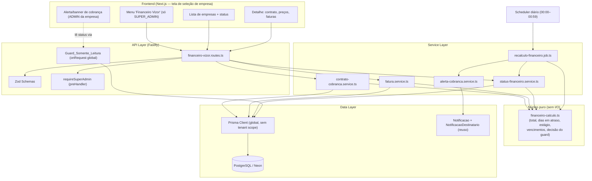
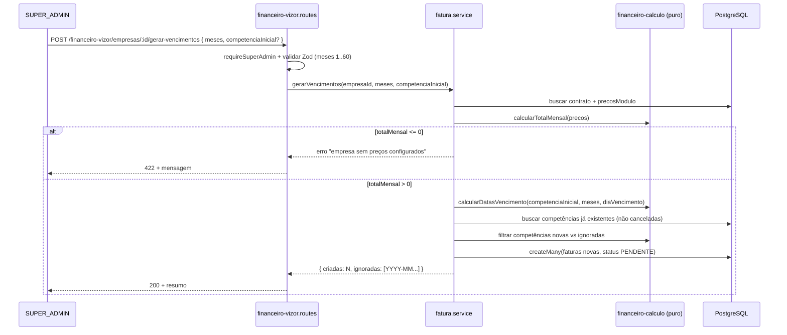
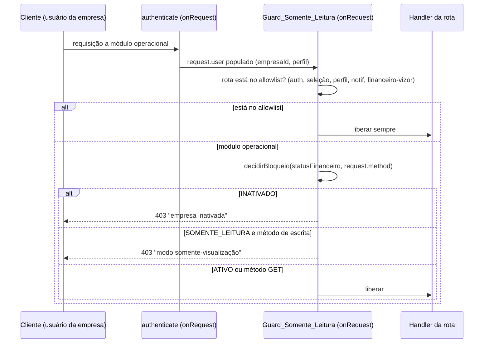

# Design Document — Financeiro Vizor (Billing do SaaS)

## Overview

O **Financeiro Vizor** é o módulo de *billing do SaaS* do próprio Vizor ERP:
controla a cobrança recorrente das empresas clientes que contratam o sistema.
É de uso exclusivo do dono do Vizor (perfil `SUPER_ADMIN`) e não deve ser
confundido com um eventual módulo financeiro interno das empresas (contas a
pagar/receber delas). Aqui o "cliente" é a própria `Empresa` cadastrada no
Vizor, e o "produto vendido" são os módulos do ERP (`COMPRAS`, `VENDAS`,
`FINANCEIRO`, `FISCAL`, `WMS`, `PCP`).

O módulo entrega quatro capacidades principais:

1. **Cadastro comercial por empresa** — contrato de cobrança com data,
   dia de vencimento e preço negociado por módulo (`ContratoCobranca` +
   `PrecoModulo`), com o `TotalMensal` derivado da soma dos preços ativos.
2. **Faturamento recorrente** — geração em lote de N faturas mensais
   (`Fatura`) por competência, com baixa (`PAGA`), cancelamento (`CANCELADA`)
   e recálculo de atraso.
3. **Ciclo de inadimplência automático** — um job diário
   (`Job_Recalculo_Financeiro`) reclassifica cada empresa em `ATIVO`,
   `SOMENTE_LEITURA` ou `INATIVADO` a partir da fatura vencida mais antiga,
   dispara alertas ao atingir 10 dias e bloqueia (somente-leitura) aos 30 dias.
4. **Enforcement transversal** — um guard central (`Guard_Somente_Leitura`)
   plugado no ciclo de requisição do Fastify bloqueia escrita (empresas em
   `SOMENTE_LEITURA`) ou todo acesso operacional (empresas em `INATIVADO`),
   preservando sempre um allowlist de rotas essenciais (auth, seleção de
   empresa, perfil próprio, notificações, e o próprio Financeiro Vizor).

O `Status_Financeiro` é persistido em **campo dedicado** na `Empresa` (enum
como string), preservando o campo `status` boolean já existente e usado por
outros fluxos. Toda a lógica de negócio sensível (cálculo de total, cálculo de
dias em atraso, transição de estágio, decisão do guard) é implementada como
**funções puras testáveis**, separadas da camada de I/O — o mesmo padrão já
adotado em `pedido-calculo.service.ts`.

Como o backend é 100% TypeScript (Fastify + Prisma 6 + Zod), todo o design usa
TypeScript. Alterações de schema seguem a regra obrigatória do projeto: o mesmo
commit atualiza `prisma/schema.prisma` **e** `prisma/migrate-prod.ts` de forma
idempotente (o Vizor não roda `prisma migrate deploy` em produção).

## Architecture

### Visão geral de componentes



### Decisões arquiteturais

1. **Prisma global, não `prismaScoped`.** Todos os endpoints do Financeiro
   Vizor são exclusivos do `SUPER_ADMIN`, que já usa o Prisma global
   (`tenant-context.ts` faz *bypass* de tenant para `SUPER_ADMIN`). O
   isolamento por empresa nas queries é feito **explicitamente** com
   `where: { empresaId }` — nunca confiando em scope automático. Isso atende
   Req 10 (todo acesso a `ContratoCobranca`/`PrecoModulo`/`Fatura` restrito a
   `SUPER_ADMIN` e sempre filtrado por `empresaId`).

2. **Núcleo puro separado da I/O.** `financeiro-calculo.ts` concentra
   `calcularTotalMensal`, `calcularDiasEmAtraso`, `determinarEstagio`,
   `calcularDatasVencimento` e `decidirBloqueio`. Sem acesso a banco, data
   injetada como parâmetro (`agora: Date`) — testável por property-based
   testing sem mocks e sem depender do relógio real.

3. **Guard de somente-leitura como hook `onRequest` global, com allowlist
   por prefixo.** Registrado uma única vez no `server.ts`, roda após o
   `authenticate`, lê o `Status_Financeiro` da empresa da sessão e decide
   bloquear/liberar comparando `request.method` + `request.routerPath` contra
   um allowlist central. Um único ponto de enforcement evita a classe de bug
   "esqueci de proteger uma rota" (mesma filosofia da steering de isolamento
   multi-tenant).

4. **Status financeiro cacheado na `Empresa`, atraso recalculado sob demanda.**
   O `statusFinanceiro` é materializado na `Empresa` (lido a cada requisição
   pelo guard, precisa ser barato). O `Dias_Em_Atraso` é derivado das faturas
   e recalculado (a) no job diário, (b) após cada baixa/cancelamento. O guard
   nunca recalcula atraso — só lê o campo materializado (Req 6.1, 7.6).

5. **Transição de estágio unidirecional para bloqueio, manual para
   desbloqueio.** O job pode mover `ATIVO → SOMENTE_LEITURA` (aos 30 dias),
   mas **nunca** `SOMENTE_LEITURA → ATIVO` nem toca em `INATIVADO`
   (Req 6.12, 8.6). A reativação e a inativação são sempre ações manuais do
   `SUPER_ADMIN`, com auditoria de quem e quando (Req 8.7, 9.5, 9.6).

6. **Reuso do módulo de notificação existente.** Alertas de cobrança criam
   `Notificacao` (`tipo: 'ALERTA'`, `empresaId` da empresa devedora) +
   `NotificacaoDestinatario` para os ADMINs da empresa, aparecendo no sino já
   existente. Um controle de idempotência diária (`ControleAlertaCobranca`)
   garante "no máximo uma vez por dia por empresa" (Req 6.10).

7. **Geração de faturas idempotente por competência.** A unicidade
   `@@unique([empresaId, competencia])` (ignorando canceladas via filtro na
   aplicação) garante que reexecutar "gerar vencimentos" não duplica
   competências (Req 5.8).

## Fluxos principais (sequência)

### Geração de vencimentos em lote (Req 5)



### Job diário de recálculo (Req 6)

```mermaid
sequenceDiagram
    participant S as Scheduler (00:00–00:59)
    participant J as recalculo-financeiro.job
    participant C as financeiro-calculo (puro)
    participant St as status-financeiro.service
    participant A as alerta-cobranca.service
    participant DB as PostgreSQL

    S->>J: executar()
    J->>DB: listar empresas + faturas em aberto
    loop cada empresa
        J->>C: marcar PENDENTE vencida -> VENCIDA
        J->>C: calcularDiasEmAtraso(faturas, hoje)
        J->>C: determinarEstagio(statusAtual, diasEmAtraso)
        alt estágio muda para SOMENTE_LEITURA
            J->>St: aplicarStatus(empresaId, SOMENTE_LEITURA)
        end
        alt diasEmAtraso >= 10 e status != INATIVADO
            J->>A: enviarAlertaSeAindaNaoEnviadoHoje(empresaId, diasEmAtraso)
            A->>DB: upsert ControleAlertaCobranca + Notificacao (idempotente/dia)
        end
    end
    J->>DB: registrar execução (sucesso/falha)
    Note over J,DB: falha em uma empresa não altera status das demais;<br/>status vigente é preservado em caso de erro
```

### Enforcement do guard (Req 7, 9)



## Data Models

### Alterações no model `Empresa`

Campos **adicionados** (nullable/default para compatibilidade com registros
existentes; nenhum campo existente é alterado ou removido):

```prisma
model Empresa {
  // ... campos existentes preservados (id, razaoSocial, cnpj, status boolean, etc.) ...

  // Financeiro Vizor (billing do SaaS)
  statusFinanceiro    String    @default("ATIVO") @map("status_financeiro") @db.VarChar(20)
  // Auditoria de inativação/reativação manual (Req 9.5, 9.6)
  inativadoPor        String?   @map("inativado_por")
  inativadoEm         DateTime? @map("inativado_em")
  reativadoPor        String?   @map("reativado_por")
  reativadoEm         DateTime? @map("reativado_em")

  contratoCobranca    ContratoCobranca?
  faturas             Fatura[]

  @@index([statusFinanceiro])
}
```

- `statusFinanceiro`: enum-como-string, valores `ATIVO | SOMENTE_LEITURA |
  INATIVADO`. Default `ATIVO` (Req 2.8, 2.7). Indexado porque o guard o lê a
  cada requisição.

### `ContratoCobranca`

```prisma
model ContratoCobranca {
  id            String   @id @default(uuid())
  empresaId     String   @unique @map("empresa_id") // 1:1 com Empresa (Req 10.5)
  empresa       Empresa  @relation(fields: [empresaId], references: [id])
  dataContrato  DateTime @map("data_contrato")
  diaVencimento Int      @map("dia_vencimento") // 1..31 (Req 3.4/3.5)
  criadoEm      DateTime @default(now()) @map("criado_em")
  atualizadoEm  DateTime @updatedAt @map("atualizado_em")

  precosModulo  PrecoModulo[]

  @@map("contrato_cobranca")
}
```

### `PrecoModulo`

```prisma
model PrecoModulo {
  id                 String           @id @default(uuid())
  contratoCobrancaId String           @map("contrato_cobranca_id")
  contratoCobranca   ContratoCobranca @relation(fields: [contratoCobrancaId], references: [id], onDelete: Cascade)
  modulo             String           @db.VarChar(20) // COMPRAS|VENDAS|FINANCEIRO|FISCAL|WMS|PCP
  preco              Decimal          @default(0) @db.Decimal(12, 2) // 0,00 .. 999.999.999,99 (Req 3.2/3.6)

  @@unique([contratoCobrancaId, modulo]) // um preço por módulo por contrato
  @@map("preco_modulo")
}
```

- `preco` cabe em `Decimal(12,2)` (máx 9.999.999.999,99 > limite 999.999.999,99).
  A faixa `0..999.999.999,99` é validada no Zod (Req 3.2/3.6).

### `Fatura`

```prisma
model Fatura {
  id             String    @id @default(uuid())
  empresaId      String    @map("empresa_id") // não nulo (Req 10.5)
  empresa        Empresa   @relation(fields: [empresaId], references: [id])
  competencia    String    @db.VarChar(7)  // "YYYY-MM" (Req: Competencia)
  dataVencimento DateTime  @map("data_vencimento")
  valor          Decimal   @db.Decimal(12, 2)
  status         String    @default("PENDENTE") @db.VarChar(20) // PENDENTE|PAGA|VENCIDA|CANCELADA
  dataPagamento  DateTime? @map("data_pagamento")
  criadoEm       DateTime  @default(now()) @map("criado_em")
  atualizadoEm   DateTime  @updatedAt @map("atualizado_em")

  @@index([empresaId, competencia])
  @@index([empresaId, status, dataVencimento])
  @@map("fatura")
}
```

- Não há `@@unique([empresaId, competencia])` no banco porque uma competência
  `CANCELADA` pode coexistir com uma nova `PENDENTE` da mesma competência. A
  idempotência de geração (Req 5.8) é garantida na aplicação, considerando
  apenas faturas **não canceladas** como bloqueio de competência.

### `ControleAlertaCobranca` (idempotência diária de alerta — Req 6.10)

```prisma
model ControleAlertaCobranca {
  id           String   @id @default(uuid())
  empresaId    String   @map("empresa_id")
  tipoAlerta   String   @db.VarChar(30) // ALERTA_10D | SOMENTE_LEITURA_30D
  dataEnvio    String   @db.VarChar(10) // "YYYY-MM-DD" (dia do envio)
  criadoEm     DateTime @default(now()) @map("criado_em")

  @@unique([empresaId, tipoAlerta, dataEnvio]) // no máximo 1x/dia por tipo/empresa
  @@map("controle_alerta_cobranca")
}
```

### `LogExecucaoJobFinanceiro` (rastreio do job — Req 6.2)

```prisma
model LogExecucaoJobFinanceiro {
  id             String    @id @default(uuid())
  iniciadoEm     DateTime  @default(now()) @map("iniciado_em")
  finalizadoEm   DateTime? @map("finalizado_em")
  sucesso        Boolean   @default(false)
  empresasProcessadas Int  @default(0) @map("empresas_processadas")
  erro           String?   @db.Text

  @@map("log_execucao_job_financeiro")
}
```

### Enums e constantes (TypeScript)

```typescript
export const MODULOS = ['COMPRAS', 'VENDAS', 'FINANCEIRO', 'FISCAL', 'WMS', 'PCP'] as const
export type Modulo = (typeof MODULOS)[number]

export type StatusFinanceiro = 'ATIVO' | 'SOMENTE_LEITURA' | 'INATIVADO'
export type StatusFatura = 'PENDENTE' | 'PAGA' | 'VENCIDA' | 'CANCELADA'

// Limites de negócio
export const PRECO_MAX = 999_999_999.99
export const DIA_VENCIMENTO_MIN = 1
export const DIA_VENCIMENTO_MAX = 31
export const MESES_MIN = 1
export const MESES_MAX = 60
export const DIAS_ALERTA = 10
export const DIAS_BLOQUEIO = 30
```

## Components and Interfaces

### 1. `financeiro-calculo.ts` — núcleo puro (sem I/O)

Todas as funções recebem os dados necessários por parâmetro (incluindo o
"agora"), não acessam banco nem relógio global, e são determinísticas.

```typescript
/**
 * Total mensal = soma dos preços de módulo estritamente maiores que zero.
 * Retorna 0 quando nenhum módulo tem preço > 0. (Req 3.3)
 */
export function calcularTotalMensal(precos: { modulo: Modulo; preco: number }[]): number

/**
 * Dias corridos entre a data de vencimento da fatura vencida mais antiga
 * (status PENDENTE ou VENCIDA, vencimento < agora) e agora.
 * Retorna 0 quando não há fatura nessa condição. (Req 6.3, 4.4, 8.5)
 */
export function calcularDiasEmAtraso(
  faturas: { status: StatusFatura; dataVencimento: Date }[],
  agora: Date,
): number

/**
 * Total vencido em aberto = soma dos valores de faturas PENDENTE/VENCIDA
 * com vencimento < agora. Sempre >= 0. (Req 2.5, 4.4)
 */
export function calcularTotalVencidoEmAberto(
  faturas: { status: StatusFatura; dataVencimento: Date; valor: number }[],
  agora: Date,
): number

/**
 * Transição de estágio a partir do status atual e dos dias em atraso.
 * - INATIVADO nunca muda por este cálculo (só ação manual). (Req 6.12)
 * - SOMENTE_LEITURA nunca volta a ATIVO por este cálculo. (Req 8.6)
 * - ATIVO -> SOMENTE_LEITURA quando dias >= 30. (Req 6.7)
 * - ATIVO permanece ATIVO entre 0 e 29 dias. (Req 6.5, 6.11)
 */
export function determinarEstagio(atual: StatusFinanceiro, diasEmAtraso: number): StatusFinanceiro

/**
 * Datas de vencimento para N competências consecutivas a partir da inicial.
 * Usa o diaVencimento; se não existir no mês, usa o último dia do mês. (Req 5.2, 5.3)
 * competenciaInicial no formato "YYYY-MM".
 */
export function calcularDatasVencimento(
  competenciaInicial: string,
  meses: number,
  diaVencimento: number,
): { competencia: string; dataVencimento: Date }[]

/**
 * Competência inicial default = mês seguinte ao mês de `agora`. (Req 5.6)
 */
export function competenciaMesSeguinte(agora: Date): string

/**
 * Decisão central do guard, pura e testável. (Req 7.1/7.2/7.4, 9.2)
 * @returns 'PERMITIR' | 'BLOQUEAR_SOMENTE_LEITURA' | 'BLOQUEAR_INATIVADO'
 */
export function decidirBloqueio(
  status: StatusFinanceiro,
  metodoHttp: string, // GET|POST|PUT|PATCH|DELETE
): 'PERMITIR' | 'BLOQUEAR_SOMENTE_LEITURA' | 'BLOQUEAR_INATIVADO'
```

Implementação de referência das duas funções mais críticas:

```typescript
export function determinarEstagio(atual: StatusFinanceiro, diasEmAtraso: number): StatusFinanceiro {
  if (atual === 'INATIVADO') return 'INATIVADO'          // Req 6.12
  if (atual === 'SOMENTE_LEITURA') return 'SOMENTE_LEITURA' // job não reativa (Req 8.6)
  // atual === 'ATIVO'
  if (diasEmAtraso >= DIAS_BLOQUEIO) return 'SOMENTE_LEITURA' // Req 6.7
  return 'ATIVO'                                          // Req 6.5, 6.11
}

export function decidirBloqueio(status: StatusFinanceiro, metodoHttp: string) {
  const ehEscrita = ['POST', 'PUT', 'PATCH', 'DELETE'].includes(metodoHttp.toUpperCase())
  if (status === 'INATIVADO') return 'BLOQUEAR_INATIVADO'   // Req 9.2 (bloqueia tudo)
  if (status === 'SOMENTE_LEITURA' && ehEscrita) return 'BLOQUEAR_SOMENTE_LEITURA' // Req 7.1
  return 'PERMITIR'                                          // Req 7.2 (GET) e 7.4 (ATIVO)
}
```

### 2. `contrato-cobranca.service.ts`

```typescript
/** Detalhe do contrato + os 6 módulos, com preço 0 para não precificados. (Req 3.1, 4.1) */
export function obterDetalheEmpresa(empresaId: string): Promise<DetalheCobranca>

/** Cria/atualiza contrato (upsert). Valida diaVencimento (1..31), dataContrato
 *  (válida, não futura) e cada preço (0..999.999.999,99). Rejeição preserva o
 *  estado anterior (nada é persistido em caso de erro). (Req 3.4–3.8) */
export function salvarContrato(empresaId: string, input: SalvarContratoInput): Promise<DetalheCobranca>
```

`DetalheCobranca` sempre devolve os **seis** módulos (mesmo os não
precificados, com `preco: 0`), o `totalMensal`, `diaVencimento`, `dataContrato`,
o `totalVencidoEmAberto` e o `diasEmAtraso` (ou `null` quando não há atraso).

### 3. `fatura.service.ts`

```typescript
/** Lista faturas da empresa, competência desc. (Req 4.2) */
export function listarFaturas(empresaId: string): Promise<FaturaView[]>

/** Geração em lote idempotente. (Req 5) */
export function gerarVencimentos(
  empresaId: string,
  meses: number,
  competenciaInicial?: string,
): Promise<{ criadas: number; ignoradas: string[] }>

/** Baixa: PENDENTE|VENCIDA -> PAGA, seta dataPagamento; recalcula atraso.
 *  Mantém SOMENTE_LEITURA até reativação manual. (Req 8.1, 8.3, 8.4, 8.5, 8.6) */
export function darBaixa(empresaId: string, faturaId: string): Promise<FaturaView>

/** Cancelamento: PENDENTE|VENCIDA -> CANCELADA. (Req 8.9, 8.10) */
export function cancelarFatura(empresaId: string, faturaId: string): Promise<FaturaView>
```

### 4. `status-financeiro.service.ts`

```typescript
/** Lista todas as empresas (nome asc) com status, total mensal e total vencido. (Req 2) */
export function listarEmpresasComStatus(): Promise<EmpresaStatusView[]>

/** Aplica um novo status materializado na Empresa (usado por job e ações manuais). */
export function aplicarStatus(empresaId: string, novo: StatusFinanceiro): Promise<void>

/** Reativação manual: SOMENTE_LEITURA|INATIVADO -> ATIVO, com auditoria. (Req 8.7, 9.4, 9.6) */
export function reativarEmpresa(empresaId: string, superAdminId: string): Promise<void>

/** Inativação manual: ATIVO|SOMENTE_LEITURA -> INATIVADO, com auditoria. (Req 9.1, 9.5) */
export function inativarEmpresa(empresaId: string, superAdminId: string): Promise<void>
```

### 5. `recalculo-financeiro.job.ts`

```typescript
/** Executado 1x/dia (00:00–00:59). Idempotente; falha isolada por empresa
 *  não altera as demais; registra LogExecucaoJobFinanceiro. (Req 6.1, 6.2) */
export function executarRecalculoFinanceiro(agora?: Date): Promise<{ empresasProcessadas: number }>
```

Fluxo interno por empresa (dentro de try/catch individual): marcar faturas
`PENDENTE` vencidas como `VENCIDA` (Req 6.4) → `calcularDiasEmAtraso` →
`determinarEstagio` → se mudou, `aplicarStatus` → se `dias >= 10` e status ≠
`INATIVADO`, disparar alerta idempotente.

### 6. `alerta-cobranca.service.ts`

```typescript
/** Cria Notificacao (tipo ALERTA, empresaId da devedora) + destinatários (ADMINs
 *  da empresa), no máximo 1x/dia por tipo/empresa via ControleAlertaCobranca.
 *  Alerta inclui APENAS dados da própria empresa. (Req 6.6, 6.8, 6.9, 6.10, 10.4) */
export function enviarAlertaSeNecessario(params: {
  empresaId: string
  diasEmAtraso: number
  status: StatusFinanceiro
  agora: Date
}): Promise<void>
```

### 7. `requireSuperAdmin` (preHandler dos endpoints do módulo)

```typescript
/** Nega acesso a quem não é SUPER_ADMIN (Req 1.3, 1.5, 10.1–10.3). Não vaza
 *  dados no corpo; responde 401 (sem sessão) / 403 (autenticado sem perfil). */
export async function requireSuperAdmin(request: FastifyRequest, reply: FastifyReply): Promise<void>
```

### 8. `Guard_Somente_Leitura` (hook `onRequest` global)

```typescript
/**
 * Registrado uma vez em server.ts, após o authenticate global.
 * - Rotas do allowlist: sempre liberadas, qualquer método/status. (Req 7.3, 9.3)
 * - SUPER_ADMIN sem empresa de contexto: liberado.
 * - Demais: lê empresa.statusFinanceiro e aplica decidirBloqueio(). (Req 7, 9)
 */
export function registerReadOnlyGuard(app: FastifyInstance): void
```

Allowlist (por prefixo de rota), sempre liberado independentemente do status
(Req 7.3, 9.3):

```typescript
const ALLOWLIST_PREFIXOS = [
  '/api/auth/login',
  '/api/auth/refresh',
  '/api/auth/logout',
  '/api/empresas/minhas',        // seleção de empresa
  '/api/empresas/:id/selecionar',
  '/api/financeiro-vizor',       // o próprio módulo (SUPER_ADMIN)
  '/api/usuarios/perfil',        // leitura/atualização do próprio perfil
  '/api/usuarios/trocar-senha',
  '/api/notificacoes/:id/marcar-lida',
]
```

O guard compara `request.routerPath` (padrão registrado da rota, ex.
`/api/notificacoes/:id/marcar-lida`) contra a allowlist — evita depender de
substring do path concreto e o torna robusto a IDs arbitrários.

## API — Endpoints

Prefixo: `/api/financeiro-vizor`. Todos exigem `requireSuperAdmin`.

| Método | Rota | Descrição | Req |
|---|---|---|---|
| GET | `/empresas` | Lista empresas (nome asc) com `statusFinanceiro`, `totalMensal`, `totalVencidoEmAberto`. | 2 |
| GET | `/empresas/:id` | Detalhe: contrato, 6 preços de módulo, total mensal, total vencido, dias em atraso, faturas (competência desc). | 3.1, 4 |
| PUT | `/empresas/:id/contrato` | Cria/atualiza contrato (dataContrato, diaVencimento, precos[]). | 3 |
| POST | `/empresas/:id/gerar-vencimentos` | Gera N faturas (`meses`, `competenciaInicial?`); retorna `{ criadas, ignoradas[] }`. | 5 |
| POST | `/empresas/:id/faturas/:faturaId/baixa` | Baixa de pagamento. | 8.1–8.5 |
| POST | `/empresas/:id/faturas/:faturaId/cancelar` | Cancela fatura. | 8.9, 8.10 |
| POST | `/empresas/:id/reativar` | Reativa (→ ATIVO), com auditoria. | 8.7, 9.4 |
| POST | `/empresas/:id/inativar` | Inativa (→ INATIVADO), com auditoria. | 9.1 |

### Schemas Zod (validação de entrada)

```typescript
export const salvarContratoSchema = z.object({
  dataContrato: z.coerce.date().refine((d) => d <= new Date(), {
    message: 'A data do contrato deve ser uma data válida e não futura.', // Req 3.8
  }),
  diaVencimento: z.number().int().min(1).max(31, {
    message: 'O dia de vencimento deve ser um inteiro entre 1 e 31.', // Req 3.5
  }),
  precos: z
    .array(
      z.object({
        modulo: z.enum(MODULOS),
        preco: z.number().min(0).max(PRECO_MAX, {
          message: 'O preço deve estar entre 0,00 e 999.999.999,99.', // Req 3.6
        }),
      }),
    )
    .max(6),
})

export const gerarVencimentosSchema = z.object({
  meses: z.number().int().min(1).max(60, {
    message: 'O número de meses deve estar entre 1 e 60.', // Req 5.10
  }),
  competenciaInicial: z
    .string()
    .regex(/^\d{4}-(0[1-9]|1[0-2])$/, { message: 'Competência deve estar no formato YYYY-MM.' })
    .optional(), // Req 5.6/5.7
})
```

Erros de validação são traduzidos por um helper `formatarErroZod()` para
mensagem "campo: motivo" (mesmo padrão de `cte.routes.ts`), retornando 422 e
**preservando o estado anterior** (nenhuma escrita antes da validação passar).

## Correctness Properties

Propriedades universais que devem valer para qualquer entrada válida
(candidatas a property-based testing com fast-check sobre o núcleo puro):

### Property 1: Total mensal ≥ 0 e ignora zeros

Para qualquer lista de preços, `calcularTotalMensal(precos)` é igual à soma dos
preços estritamente maiores que zero e o resultado é `≥ 0`; remover módulos com
preço 0 não altera o total.

**Validates: Requirements 3.3**

### Property 2: Total mensal monotônico

Aumentar o preço de qualquer módulo nunca diminui `calcularTotalMensal`.

**Validates: Requirements 3.3**

### Property 3: Dias em atraso ≥ 0 e usa a fatura mais antiga

Para qualquer conjunto de faturas e `agora`, `calcularDiasEmAtraso ≥ 0`; se
existe ≥1 fatura `PENDENTE/VENCIDA` vencida, o resultado corresponde à de
vencimento mais antigo; caso contrário é `0`.

**Validates: Requirements 6.3, 4.4**

### Property 4: Total vencido não negativo e só conta vencidas em aberto

`calcularTotalVencidoEmAberto ≥ 0` e é igual à soma apenas das faturas
`PENDENTE/VENCIDA` com `vencimento < agora`. Faturas `PAGA`/`CANCELADA` ou
futuras nunca entram.

**Validates: Requirements 2.5, 4.4**

### Property 5: Estágio — INATIVADO é absorvente sob o job

Para qualquer `diasEmAtraso`, `determinarEstagio('INATIVADO', dias) ===
'INATIVADO'`.

**Validates: Requirements 6.12**

### Property 6: Estágio — job nunca reativa

Para qualquer `dias`, `determinarEstagio('SOMENTE_LEITURA', dias) ===
'SOMENTE_LEITURA'`.

**Validates: Requirements 8.6**

### Property 7: Estágio — limiar de bloqueio

`determinarEstagio('ATIVO', dias)` é `'SOMENTE_LEITURA'` se e somente se
`dias >= 30`; caso contrário `'ATIVO'`.

**Validates: Requirements 6.5, 6.7, 6.11**

### Property 8: Guard — INATIVADO bloqueia todo método

Para qualquer método HTTP, `decidirBloqueio('INATIVADO', m) ===
'BLOQUEAR_INATIVADO'`.

**Validates: Requirements 9.2**

### Property 9: Guard — SOMENTE_LEITURA libera exatamente os GET

`decidirBloqueio('SOMENTE_LEITURA', m) === 'PERMITIR'` se e somente se `m` é
`GET` (case-insensitive); qualquer método de escrita bloqueia.

**Validates: Requirements 7.1, 7.2**

### Property 10: Guard — ATIVO nunca bloqueia

Para qualquer método, `decidirBloqueio('ATIVO', m) === 'PERMITIR'`.

**Validates: Requirements 7.4**

### Property 11: Vencimentos — quantidade e dia corretos

`calcularDatasVencimento(comp, n, dia)` retorna exatamente `n` itens em
competências consecutivas; o dia de cada data é `min(dia, últimoDiaDoMês)`.

**Validates: Requirements 5.1, 5.2, 5.3**

### Property 12: Geração idempotente

Gerar vencimentos duas vezes com o mesmo intervalo não cria faturas duplicadas
por competência (considerando não canceladas); a segunda execução retorna
`criadas: 0` e todas em `ignoradas`.

**Validates: Requirements 5.8**

### Property 13: Isolamento por empresa

Todo `FaturaView`/`DetalheCobranca` retornado para um `empresaId` só contém
registros com aquele `empresaId`.

**Validates: Requirements 4.6, 10.4, 10.6**

## Error Handling

| Cenário | Condição | Resposta | Req |
|---|---|---|---|
| Sem sessão | Requisição sem JWT válido a endpoint do módulo | 401, sem corpo de cobrança | 1.5 |
| Perfil insuficiente | Autenticado, perfil ≠ SUPER_ADMIN | 403, sem dados; nada persistido | 1.3, 8.2, 8.8, 9.8, 10.2, 10.3 |
| Dia de vencimento inválido | Não inteiro ou fora de 1..31 | 422 + mensagem; contrato anterior preservado | 3.5 |
| Preço inválido | Negativo ou > 999.999.999,99 | 422 + mensagem; preços anteriores preservados | 3.6 |
| Data de contrato inválida | Inválida ou futura | 422 + mensagem; data anterior preservada | 3.8 |
| Geração sem preços | `totalMensal <= 0` | 422 + mensagem; nenhuma fatura criada | 5.5 |
| Meses fora do intervalo | N < 1 ou N > 60 | 422 + mensagem; nenhuma fatura criada | 5.10 |
| Baixa em status inválido | Fatura já PAGA/CANCELADA | 409 + mensagem; status preservado | 8.3 |
| Fatura inexistente/outra empresa | Não encontrada sob o `empresaId` | 404 + mensagem; nada alterado | 8.4 |
| Cancelar status inválido | Fatura já PAGA/CANCELADA | 409 + mensagem; status preservado | 8.10 |
| Guard bloqueia escrita | SOMENTE_LEITURA + método de escrita | 403 "modo somente-visualização"; nada persistido, sem dados do módulo | 7.1, 7.5 |
| Guard bloqueia inativada | INATIVADO + qualquer método operacional | 403 "empresa inativada, acesso impedido" | 9.2, 9.7 |
| Falha do job | Exceção durante recálculo | Status vigente preservado; `LogExecucaoJobFinanceiro.sucesso=false` + erro | 6.2 |

Regra transversal: **validação antes de qualquer escrita** — toda rejeição
preserva o estado anterior (nenhum efeito colateral parcial). Operações
compostas (baixa + recálculo de atraso; geração em lote) usam
`prisma.$transaction` para atomicidade.

## Testing Strategy

### Testes unitários (núcleo puro `financeiro-calculo.ts`)

Cobrir casos-limite explícitos: dia 31 em fevereiro (→ 28/29), competência
virando o ano (dezembro → janeiro), `diasEmAtraso` exatamente 9/10/29/30,
lista de faturas vazia, todos os módulos com preço 0.

### Property-based testing (fast-check)

Biblioteca: **fast-check** (já usada no ecossistema, ver steering do frontend).
Geradores para preços (`fc.array` de `{ modulo, preco }`), faturas
(`{ status, dataVencimento, valor }`), datas (`agora`), status e métodos HTTP.
Validar as 13 propriedades da seção Correctness Properties. O núcleo puro não
precisa de mocks — data e dados entram por parâmetro.

### Testes de integração (Fastify + Prisma)

- **Autorização**: cada endpoint retorna 401/403 para não-SUPER_ADMIN e
  200 para SUPER_ADMIN (Req 1, 8.2, 9.8, 10).
- **Guard**: com empresa em cada status, uma rota operacional de escrita e uma
  de leitura, mais uma rota do allowlist; verificar 403/200 conforme Req 7/9;
  e que a mudança de status reflete "a partir da requisição seguinte" (Req 7.6).
- **Ciclo completo**: contrato → gerar vencimentos → avançar o "agora" do job →
  VENCIDA → alerta aos 10 → SOMENTE_LEITURA aos 30 → baixa → mantém
  SOMENTE_LEITURA → reativação manual → ATIVO (Req 5, 6, 8).
- **Idempotência**: rodar o job 2x no mesmo dia gera no máximo 1 notificação
  por empresa (Req 6.10); gerar vencimentos 2x não duplica (Req 5.8).

### QA E2E

Adicionar cobertura na suíte Python/Playwright (`tests/e2e-qa/`) para o menu
"Financeiro Vizor" (visível só ao SUPER_ADMIN), o fluxo de detalhe e a
verificação de que uma empresa em SOMENTE_LEITURA vê a tela mas não consegue
salvar.

## Security Considerations

- **Autorização estrita**: todo o módulo é `SUPER_ADMIN`-only; nenhum dado de
  cobrança sai para outros perfis (Req 1, 10). Os endpoints usam Prisma global
  mas **sempre** filtram por `empresaId` explícito — não confiar em scope
  automático.
- **Isolamento de alertas**: a notificação de cobrança carrega apenas dados da
  própria empresa devedora (`empresaId` = empresa do destinatário), nunca de
  terceiros (Req 10.4).
- **Guard como choke point único**: enforcement centralizado em um hook global
  evita rotas desprotegidas; o allowlist é explícito e revisável.
- **Auditoria**: inativação/reativação registram `superAdminId` + timestamp
  (Req 9.5, 9.6).

## Dependencies

- **Prisma 6 / PostgreSQL (Neon)** — persistência. Novas tabelas
  (`contrato_cobranca`, `preco_modulo`, `fatura`, `controle_alerta_cobranca`,
  `log_execucao_job_financeiro`) e colunas em `empresa`.
- **Fastify** — rotas e hooks (`onRequest` para o guard, `preHandler` para
  `requireSuperAdmin`).
- **Zod** — validação de entrada.
- **fast-check** — property-based testing do núcleo puro.
- **Scheduler diário** — para o `Job_Recalculo_Financeiro`. No Render, avaliar
  `node-cron` interno ao processo (janela 00:00–00:59) ou um Cron Job do
  Render; a função `executarRecalculoFinanceiro(agora?)` é agnóstica ao gatilho
  e idempotente, então serve para ambos.
- **Módulo de notificação existente** (`Notificacao` +
  `NotificacaoDestinatario`) — reuso para o sino/alerta.

## Migração de banco (obrigatório no mesmo commit)

Conforme a regra do projeto, `prisma/migrate-prod.ts` deve receber, de forma
**idempotente**, no mesmo commit que altera `schema.prisma`:

- `ALTER TABLE empresa ADD COLUMN IF NOT EXISTS status_financeiro VARCHAR(20)
  NOT NULL DEFAULT 'ATIVO'` (+ `inativado_por/em`, `reativado_por/em`).
- `CREATE INDEX IF NOT EXISTS` em `empresa(status_financeiro)`.
- `CREATE TABLE IF NOT EXISTS` para `contrato_cobranca`, `preco_modulo`,
  `fatura`, `controle_alerta_cobranca`, `log_execucao_job_financeiro`, com os
  índices/uniques descritos.
- FKs via `try/catch` individual (Postgres não tem `ADD CONSTRAINT IF NOT
  EXISTS`).

Testar `npx tsx prisma/migrate-prod.ts` **duas vezes** localmente (idempotência)
antes do push, e commitar `schema.prisma` + `migrate-prod.ts` juntos.
