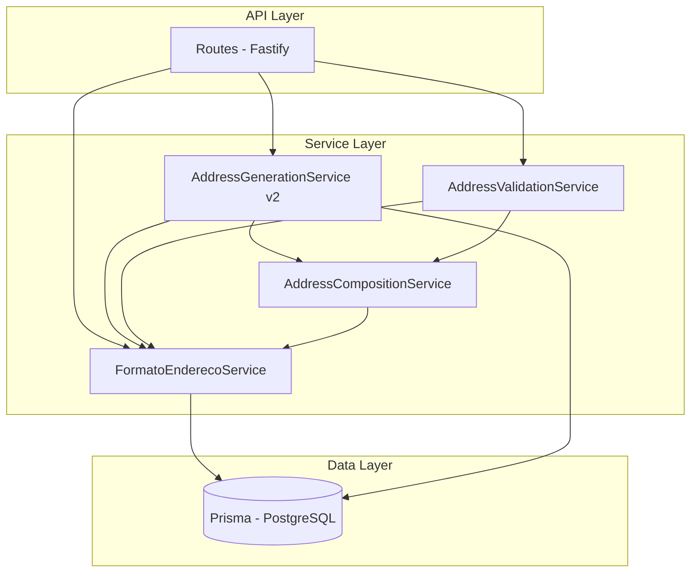
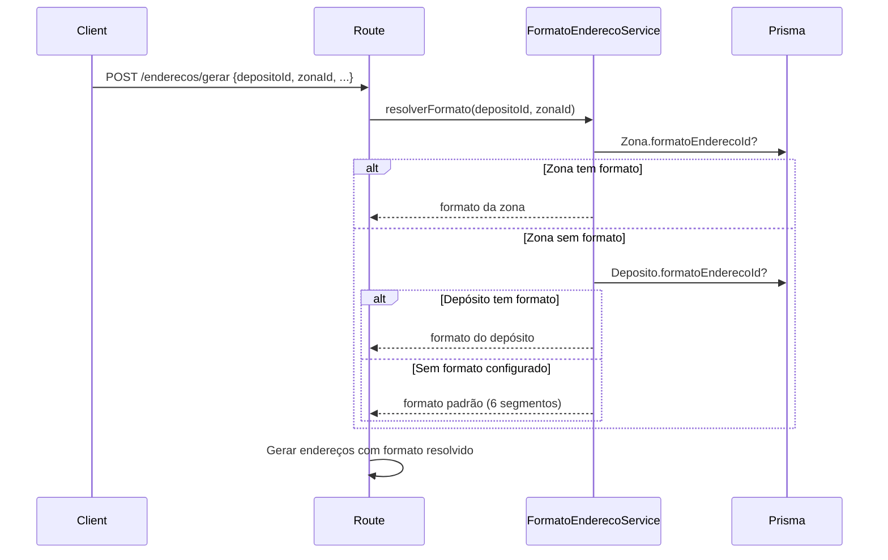

# Design — Formatos de Endereço de Armazém

## Overview

Esta funcionalidade introduz um sistema de formatos configuráveis de endereço para o WMS, substituindo o formato fixo de 6 segmentos (Depósito-Zona-Rua-Prédio-Nível-Apto) por templates flexíveis que se adaptam à estrutura física de cada área de armazenagem.

O design segue uma abordagem de **mapeamento lógico sobre modelo físico existente**: os campos do modelo Prisma `Endereco` permanecem inalterados, e o `FormatoEndereco` define quais campos são "ativos" e em que ordem compõem o `enderecoCompleto`. Segmentos conceituais como "Posição", "Corredor", "Fileira" e "Coluna" são mapeados para os campos existentes (`codigoRua`, `codigoPredio`, `codigoNivel`, `codigoApto`) conforme a ordem definida no template.

### Decisões de Design

1. **Sem alteração no modelo Prisma Endereco** — Garante compatibilidade retroativa total e zero migração de dados.
2. **Formato como entidade separada** — Permite reutilização de formatos entre depósitos/zonas e facilita a administração.
3. **Hierarquia Zona > Depósito > Padrão** — Resolução de formato segue a cadeia mais específica primeiro.
4. **Composição/Parsing como serviço puro** — Lógica de composição e decomposição do `enderecoCompleto` é isolada em um serviço sem side-effects, facilitando testes e reutilização.

## Architecture



### Fluxo de Resolução de Formato



## Components and Interfaces

### 1. FormatoEnderecoService

Responsável pelo CRUD de formatos e pela resolução do formato aplicável a um depósito/zona.

```typescript
interface FormatoEnderecoSegmento {
  /** Nome lógico do segmento (ex: "Rua", "Posição", "Corredor") */
  nome: string
  /** Campo físico no modelo Prisma para onde este segmento mapeia */
  campoFisico: 'codigoDeposito' | 'codigoZona' | 'codigoRua' | 'codigoPredio' | 'codigoNivel' | 'codigoApto'
  /** Ordem do segmento na composição do enderecoCompleto (1-based) */
  ordem: number
  /** Se o segmento usa zero-padding numérico (3 dígitos) */
  numerico: boolean
  /** Prefixo fixo opcional (ex: "PICK", "DOCA") */
  prefixo?: string
}

interface FormatoEndereco {
  id: string
  nome: string
  descricao?: string
  segmentos: FormatoEnderecoSegmento[]
  empresaId: string
  criadoEm: Date
}

interface FormatoEnderecoService {
  criar(data: CriarFormatoDto): Promise<FormatoEndereco>
  atualizar(id: string, data: AtualizarFormatoDto): Promise<FormatoEndereco>
  buscarPorId(id: string): Promise<FormatoEndereco | null>
  listar(empresaId: string): Promise<FormatoEndereco[]>
  excluir(id: string): Promise<void>
  
  /** Resolve o formato aplicável: Zona > Depósito > Padrão */
  resolverFormato(depositoId: string, zonaId?: string): Promise<FormatoEndereco>
  
  /** Retorna o formato padrão de 6 segmentos (legado) */
  getFormatoPadrao(): FormatoEndereco
}
```

### 2. AddressCompositionService

Serviço puro (sem I/O) responsável por compor e decompor o `enderecoCompleto`.

```typescript
interface AddressCompositionService {
  /**
   * Compõe o enderecoCompleto a partir dos valores dos segmentos ativos.
   * Aplica zero-padding e prefixos conforme configuração.
   */
  compor(formato: FormatoEndereco, valores: Record<string, string>): string

  /**
   * Decompõe um enderecoCompleto nos segmentos individuais.
   * Retorna um mapa campo_fisico → valor.
   */
  decompor(formato: FormatoEndereco, enderecoCompleto: string): Record<string, string>

  /**
   * Valida se um enderecoCompleto é compatível com o formato.
   * Retorna { valido: true } ou { valido: false, erro: string }.
   */
  validar(formato: FormatoEndereco, enderecoCompleto: string): { valido: boolean; erro?: string }

  /**
   * Formata um valor de segmento aplicando padding/prefixo.
   */
  formatarSegmento(segmento: FormatoEnderecoSegmento, valor: string | number): string
}
```

### 3. AddressValidationService

Valida endereços na criação/edição conforme o formato configurado.

```typescript
interface ValidacaoResultado {
  valido: boolean
  erros: Array<{
    campo: string
    mensagem: string
  }>
}

interface AddressValidationService {
  /**
   * Valida que todos os segmentos ativos estão preenchidos
   * e que os segmentos inativos estão vazios/nulos.
   */
  validarEndereco(
    formato: FormatoEndereco,
    dados: Partial<Record<string, string | null>>
  ): ValidacaoResultado
}
```

### 4. AddressGenerationService (v2)

Evolução do serviço existente para suportar formatos variáveis.

```typescript
interface GenerationParamsV2 {
  centroDistribuicaoId: string
  depositoId: string
  zonaId?: string
  formatoEnderecoId?: string  // Se não informado, resolve automaticamente
  
  /** Faixas de geração — apenas os segmentos ativos do formato */
  faixas: Array<{
    campoFisico: string
    inicio: number
    fim: number
  }>
  
  // Campos opcionais existentes
  estruturaId?: string
  classificacaoProdutoId?: string
  ambienteArmazenagemId?: string
  formaArmazenagemId?: string
  areaArmazenagem?: 'PULMAO' | 'PICKING'
  tipo?: string
  lado?: 'PAR' | 'IMPAR' | 'AMBOS'
  nivelPicking?: number
}
```

### 5. MapaAdaptadorService

Adapta a resposta do mapa do armazém conforme o formato de endereço da zona.

```typescript
interface MapaConfig {
  tipo: 'grade-4seg' | 'grade-3seg' | 'lista-2seg' | 'lista-1seg'
  agrupadorPrincipal?: string
  colunas?: string
  celulas?: string[]
  rotulos: Record<string, string>
}

interface MapaAdaptadorService {
  /**
   * Determina a configuração de renderização do mapa
   * baseado no número e tipo de segmentos do formato.
   */
  getMapaConfig(formato: FormatoEndereco): MapaConfig

  /**
   * Agrupa endereços conforme a configuração do mapa.
   */
  agruparEnderecos(enderecos: any[], config: MapaConfig, formato: FormatoEndereco): any
}
```

## Data Models

### Novo modelo: FormatoEndereco

```prisma
model FormatoEndereco {
  id          String   @id @default(uuid())
  nome        String   @db.VarChar(100)
  descricao   String?  @db.VarChar(255)
  segmentos   Json     // Array de FormatoEnderecoSegmento serializado
  empresaId   String?  @map("empresa_id")
  criadoEm    DateTime @default(now()) @map("criado_em")
  status      Boolean  @default(true)

  depositos   Deposito[]
  zonas       Zona[]

  @@map("formato_endereco")
}
```

### Alterações em modelos existentes

```prisma
model Deposito {
  // ... campos existentes ...
  formatoEnderecoId  String?  @map("formato_endereco_id")
  formatoEndereco    FormatoEndereco? @relation(fields: [formatoEnderecoId], references: [id])
}

model Zona {
  // ... campos existentes ...
  formatoEnderecoId  String?  @map("formato_endereco_id")
  formatoEndereco    FormatoEndereco? @relation(fields: [formatoEnderecoId], references: [id])
}
```

### Estrutura JSON do campo `segmentos`

```json
[
  {
    "nome": "Rua",
    "campoFisico": "codigoRua",
    "ordem": 1,
    "numerico": true,
    "prefixo": null
  },
  {
    "nome": "Prédio",
    "campoFisico": "codigoPredio",
    "ordem": 2,
    "numerico": true,
    "prefixo": null
  }
]
```

### Formatos Pré-configurados (Seed)

| Nome | Segmentos | Uso |
|------|-----------|-----|
| Porta-palete (6 seg) | Depósito-Zona-Rua-Prédio-Nível-Apto | Formato legado completo |
| Picking de chão | Zona-Posição (→ codigoZona, codigoRua) | Áreas de picking |
| Flow rack | Corredor-Posição (→ codigoRua, codigoPredio) | Flow racks |
| Blocado | Zona-Fileira-Coluna (→ codigoZona, codigoRua, codigoPredio) | Áreas blocadas |
| Doca | Código (→ codigoRua, prefixo "DOCA") | Docas |
| Área de avaria | Código (→ codigoRua, prefixo "AVARIA") | Áreas de avaria |

## Correctness Properties

*A property is a characteristic or behavior that should hold true across all valid executions of a system — essentially, a formal statement about what the system should do. Properties serve as the bridge between human-readable specifications and machine-verifiable correctness guarantees.*

### Property 1: Round-trip composição/decomposição de endereço

*For any* formato de endereço válido e *for any* conjunto de valores de segmentos ativos válidos, compor o `enderecoCompleto` a partir dos segmentos e decompor o resultado de volta nos segmentos SHALL produzir valores equivalentes aos originais.

**Validates: Requirements 1.4, 3.4, 4.1, 4.2, 4.3**

### Property 2: Hierarquia de resolução de formato

*For any* combinação de depósito e zona:
- Se a zona possui um formato associado, `resolverFormato` SHALL retornar o formato da zona (independente do formato do depósito)
- Se a zona não possui formato mas o depósito possui, SHALL retornar o formato do depósito
- Se nenhum possui formato, SHALL retornar o formato padrão de 6 segmentos

**Validates: Requirements 2.3, 2.4**

### Property 3: Formatação de segmentos

*For any* segmento numérico com valor entre 1 e 999, `formatarSegmento` SHALL produzir uma string de exatamente 3 caracteres com zero-padding à esquerda. *For any* segmento com prefixo configurado, o valor formatado SHALL iniciar com o prefixo definido.

**Validates: Requirements 3.5, 3.6**

### Property 4: Validação de segmentos ativos e inativos

*For any* formato de endereço e *for any* dados de endereço submetidos: a validação SHALL rejeitar o endereço se algum segmento ativo estiver vazio/nulo, e SHALL rejeitar o endereço se algum segmento inativo estiver preenchido. Endereços com todos os segmentos ativos preenchidos e todos os inativos nulos SHALL ser aceitos.

**Validates: Requirements 3.3, 7.1, 7.2**

### Property 5: Detecção de endereço incompatível com formato

*For any* string que não corresponde ao formato esperado (número incorreto de segmentos separados por hífen), a função de decomposição SHALL retornar um erro descritivo indicando a incompatibilidade.

**Validates: Requirements 4.4**

### Property 6: Formato requer pelo menos um segmento

*For any* tentativa de criação de formato com lista de segmentos vazia, o sistema SHALL rejeitar a criação. *For any* lista com pelo menos um segmento válido, a validação de segmentos SHALL passar.

**Validates: Requirements 1.2**

### Property 7: Unicidade de código de barras

*For any* dois valores distintos de `enderecoCompleto`, a função `generateBarcode` SHALL produzir códigos de barras distintos.

**Validates: Requirements 8.2**

### Property 8: Rótulos do mapa correspondem aos nomes dos segmentos

*For any* formato de endereço, a configuração do mapa gerada por `getMapaConfig` SHALL incluir rótulos que correspondem exatamente aos nomes dos segmentos definidos no formato.

**Validates: Requirements 5.5**

## Error Handling

### Erros de Validação (HTTP 400)

| Cenário | Mensagem |
|---------|----------|
| Formato sem segmentos | "Formato de endereço deve ter pelo menos um segmento ativo" |
| Segmento ativo em branco | "Segmentos obrigatórios não preenchidos: {lista}" |
| Segmento inativo preenchido | "Segmentos não pertencem ao formato: {lista}" |
| Faixa início > fim | "Valor inicial de {segmento} deve ser menor ou igual ao valor final" |
| enderecoCompleto incompatível | "Endereço '{valor}' não corresponde ao formato '{nome}': esperados {n} segmentos, encontrados {m}" |

### Erros de Entidade Não Encontrada (HTTP 404)

| Cenário | Mensagem |
|---------|----------|
| Formato não encontrado | "Formato de endereço não encontrado" |
| Depósito não encontrado | "Depósito não encontrado" |
| Zona não encontrada | "Zona não encontrada" |

### Erros de Conflito (HTTP 409)

| Cenário | Mensagem |
|---------|----------|
| Formato em uso (exclusão) | "Formato de endereço está associado a {n} depósito(s) e {m} zona(s)" |

### Estratégia de Fallback

- Se o formato associado a um depósito/zona for excluído ou desativado, o sistema utiliza o formato padrão de 6 segmentos.
- Endereços existentes nunca são alterados retroativamente quando o formato muda.

## Testing Strategy

### Testes Property-Based (fast-check)

O projeto não possui framework de testes configurado atualmente. Será necessário instalar `vitest` e `fast-check` como dependências de desenvolvimento.

**Configuração:**
- Framework: Vitest
- PBT Library: fast-check
- Mínimo 100 iterações por propriedade
- Tag format: `Feature: formatos-endereco-armazem, Property {N}: {título}`

**Propriedades a testar:**

1. **Round-trip composição/decomposição** — Gerar formatos aleatórios e valores de segmentos, compor e decompor, verificar equivalência.
2. **Hierarquia de resolução** — Gerar combinações aleatórias de depósito/zona com/sem formato, verificar a prioridade correta.
3. **Formatação de segmentos** — Gerar valores numéricos aleatórios (1-999) e prefixos, verificar padding e prefixo.
4. **Validação ativo/inativo** — Gerar formatos e dados aleatórios, verificar aceitação/rejeição correta.
5. **Detecção de incompatibilidade** — Gerar strings aleatórias incompatíveis com formatos, verificar erro.
6. **Mínimo um segmento** — Gerar listas de segmentos de tamanho 0..N, verificar rejeição para tamanho 0.
7. **Unicidade de barcode** — Gerar pares de enderecoCompleto distintos, verificar barcodes distintos.
8. **Rótulos do mapa** — Gerar formatos aleatórios, verificar correspondência de rótulos.

### Testes Unitários (Vitest)

- Criação de formato com dados válidos
- Formatos pré-configurados existem após seed
- Associação formato → depósito e formato → zona
- Geração de endereços com formato de 2, 3, 4 e 6 segmentos
- Mensagens de erro específicas para cada tipo de validação
- Mapa renderiza corretamente para cada tipo de formato (1, 2, 3, 4+ segmentos)

### Testes de Integração

- Coexistência de formatos legado e novos no mesmo depósito (zonas diferentes)
- Geração em lote com formato variável persiste corretamente no banco
- Lookup de endereço por código de barras funciona independente do formato
- Migração não altera endereços existentes

