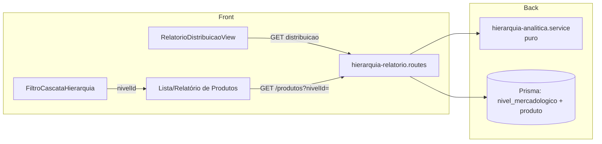

# Design — Hierarquia Mercadológica (Fase 2)

## Overview

A Fase 2 estende a Hierarquia Mercadológica (Fase 1, em produção) com três
frentes analíticas e operacionais, **sem quebrar nada do que já existe**:

1. **Filtro por qualquer nível** — filtrar produtos por Departamento, Seção,
   Categoria ou Subcategoria/Família, retornando todos os produtos cujas folhas
   (`familiaId`) descendem do nível escolhido. A abordagem central é **filtro por
   prefixo de `codigoHierarquico`**: como o código da folha é a concatenação dos
   códigos dos ancestrais (`01.02.04.001`), todos os descendentes de um nível
   compartilham o prefixo do código desse nível (`01.02` pega toda a Seção). Isso
   evita recursão na árvore e resolve o filtro com **uma única query** sobre a
   folha.

2. **Relatório de distribuição** — contar produtos por folha (`GROUP BY
   familiaId`) e agregar subindo a árvore por uma **função pura**
   (`agregarContagensPorNivel`), com totais com/sem hierarquia e exportação
   CSV/Excel.

3. **Migração assistida** — analisar valores legados de `familia`/`subFamilia`,
   sugerir vínculos por texto normalizado (função pura `normalizarTexto`,
   idempotente), permitir revisão humana, confirmar (gravando `familiaId` com o
   `empresaId` do próprio produto e registrando histórico) e **reverter** por
   execução. Nova tabela de histórico (`MigracaoHierarquiaExecucao` +
   `MigracaoHierarquiaItem`). Os campos legados permanecem **intactos**.

O design reaproveita o serviço puro da Fase 1 (`hierarquia.service.ts` —
`TipoNivel`, `composeCodigoHierarquico`, `montarCaminhoCompleto`,
`TIPO_PAI_OBRIGATORIO`) e segue os padrões do projeto: Fastify + Prisma 6 + Zod;
isolamento multi-tenant com **filtro explícito por `empresaId`** (nunca confiar
só no `prismaScoped`, que dá bypass para SUPER_ADMIN); migração idempotente
equivalente em `migrate-prod.ts` no mesmo commit; lógica pura coberta por
property-based testing (fast-check). Frontend Next.js 15 + Mantine 7 +
react-query, com tela compartilhada + wrappers finos em WMS e Compras, como na
Fase 1.

### Decisão-chave: filtro por prefixo de código hierárquico

Um produto pertence à Seção `01.02` sse, e somente se, o `codigoHierarquico` da
sua folha começa por `01.02.` (ou é igual a um código já sob esse ramo). O
prefixo é sempre delimitado por ponto para evitar falso-positivo (`01.02` não
deve casar `01.020` — no nosso schema a largura fixa evita isso, mas ainda assim
usamos o delimitador `.` para robustez). O fluxo do filtro é:

1. Resolver o nível selecionado (o mais profundo escolhido na cascata) →
   validar que pertence à empresa corrente → obter seu `codigoHierarquico`
   (`prefixo`).
2. Buscar as folhas (`tipo = SUBCATEGORIA`) da empresa cujo `codigoHierarquico`
   é o próprio prefixo ou começa por `prefixo + '.'` → coletar seus `id`.
3. Filtrar produtos por `familiaId IN (ids das folhas)` **e** `empresaId` da
   empresa corrente.

Se a folha for selecionada diretamente, o conjunto de ids tem no máximo um
elemento e o filtro vira `familiaId = folha.id`.

## Architecture

```
Backend (VisioFab.Wms.Back)
  prisma/schema.prisma
    - model MigracaoHierarquiaExecucao   (nova tabela — cabeçalho da execução)
    - model MigracaoHierarquiaItem        (nova tabela — item por produto afetado)
  prisma/migrate-prod.ts                  — CREATE TABLE IF NOT EXISTS + índices + FKs (idempotente)

  src/modules/hierarquia-mercadologica/
    hierarquia.service.ts                 — (Fase 1) reaproveitado: TipoNivel, composeCodigoHierarquico…
    hierarquia-analitica.service.ts       — NOVO: lógica pura
        · prefixoDescendentes(codigoHierarquico)
        · folhaDescendeDe(codigoFolha, codigoNivel)
        · agregarContagensPorNivel(niveis, contagensPorFolha)
        · normalizarTexto(texto)
        · gerarSugestoes(valoresLegados, folhas)
    hierarquia-analitica.service.test.ts  — property-based (fast-check)
    hierarquia-relatorio.routes.ts        — NOVO: filtro por nível + distribuição + export
    hierarquia-migracao.routes.ts         — NOVO: analisar / confirmar / reverter / listar execuções

  src/modules/produto/produto.routes.ts   — GET / ganha params de filtro por nível
  src/server.ts                           — registrar os 2 novos prefixos de rota

Frontend (VisioFab.Wms.Front)
  src/components/hierarquia/
    FiltroCascataHierarquia.tsx           — NOVO: componente reutilizável (4 selects + "sem hierarquia")
    RelatorioDistribuicaoView.tsx         — NOVO: tela de relatório + export
    MigracaoAssistidaView.tsx             — NOVO: wizard (analisar → revisar → confirmar) + reverter
  src/app/(interna)/configurador/hierarquia-relatorio/page.tsx   — wrapper WMS
  src/app/(interna)/compras/hierarquia-relatorio/page.tsx        — wrapper Compras
  src/app/(interna)/configurador/hierarquia-migracao/page.tsx    — wrapper WMS
  src/app/(interna)/compras/hierarquia-migracao/page.tsx         — wrapper Compras
  src/components/layout/ModuleSidebar.tsx — itens de menu (grupo Cadastros) em WMS e Compras
```

O fluxo de dados do relatório e do filtro:



## Components and Interfaces

### 1. Serviço puro — hierarquia-analitica.service.ts (NOVO)

Toda a lógica testável por PBT concentrada aqui, sem I/O.

```ts
import type { TipoNivel } from './hierarquia.service'

// ---- Filtro por prefixo (Req 1) --------------------------------------------

/** Prefixo usado para casar descendentes: `codigoHierarquico + '.'`. */
export function prefixoDescendentes(codigoHierarquico: string): string {
  return `${codigoHierarquico}.`
}

/**
 * Verdadeiro se a folha (codigoFolha) é o próprio nível ou descende dele.
 * Descende sse codigoFolha === codigoNivel OU codigoFolha começa por
 * `codigoNivel + '.'`. O delimitador evita casar "01.02" com "01.020".
 */
export function folhaDescendeDe(codigoFolha: string, codigoNivel: string): boolean {
  return codigoFolha === codigoNivel
    || codigoFolha.startsWith(prefixoDescendentes(codigoNivel))
}

// ---- Agregação de contagens (Req 2, 9) -------------------------------------

export interface NivelParaAgregacao {
  id: string
  tipo: TipoNivel
  codigoHierarquico: string
}

/** Contagem de produtos por folha (familiaId → quantidade). */
export type ContagensPorFolha = Record<string, number>

/** Resultado: id do nível → contagem agregada (folhas somam seus ancestrais). */
export type ContagensPorNivel = Record<string, number>

/**
 * Para cada nível (folha ou não), soma as contagens de todas as folhas que
 * descendem dele (usando prefixo de codigoHierarquico). Folha sem produto = 0.
 * Independente da ordem das folhas. Árvore vazia → todos zero.
 */
export function agregarContagensPorNivel(
  niveis: NivelParaAgregacao[],
  contagensPorFolha: ContagensPorFolha,
): ContagensPorNivel {
  const folhas = niveis.filter((n) => n.tipo === 'SUBCATEGORIA')
  const resultado: ContagensPorNivel = {}
  for (const nivel of niveis) {
    let soma = 0
    for (const folha of folhas) {
      if (folhaDescendeDe(folha.codigoHierarquico, nivel.codigoHierarquico)) {
        soma += contagensPorFolha[folha.id] ?? 0
      }
    }
    resultado[nivel.id] = soma
  }
  return resultado
}

// ---- Normalização de texto (Req 8) -----------------------------------------

/**
 * Forma canônica para comparação: minúsculas, sem acentos, espaços internos
 * colapsados em um só, sem espaços nas bordas. null/undefined → ''.
 * Idempotente: normalizarTexto(normalizarTexto(x)) === normalizarTexto(x).
 */
export function normalizarTexto(texto: string | null | undefined): string {
  return (texto ?? '')
    .normalize('NFD')
    .replace(/[\u0300-\u036f]/g, '') // remove diacríticos
    .toLowerCase()
    .replace(/\s+/g, ' ')
    .trim()
}

// ---- Sugestão de vínculo (Req 5) -------------------------------------------

export interface FolhaCandidata {
  id: string
  descricao: string
  codigoHierarquico: string
}

export interface ItemAnalise {
  valorOriginal: string        // primeiro texto original visto para o grupo
  textoNormalizado: string
  quantidade: number
  sugestaoFolhaId: string | null       // menor código entre candidatos
  candidatos: FolhaCandidata[]         // todos os candidatos por texto igual
}

/**
 * Gera as sugestões determinísticas a partir dos valores legados agrupados por
 * texto normalizado e das folhas existentes. Para cada valor, os candidatos são
 * as folhas com descrição normalizada idêntica; a sugestão é o de MENOR
 * codigoHierarquico (Req 5.5). Sem candidato → sugestaoFolhaId null (Req 5.6).
 */
export function gerarSugestoes(
  valoresLegados: { textoNormalizado: string; valorOriginal: string; quantidade: number }[],
  folhas: FolhaCandidata[],
): ItemAnalise[]
```

### 2. Filtro por nível na listagem/relatório de produtos (Req 1)

O `GET /produtos` (e a rota de relatório de produtos) ganham parâmetros:

| Param | Tipo | Efeito |
|---|---|---|
| `nivelId` | uuid opcional | Filtra por descendência do nível (qualquer camada). |
| `semHierarquia` | boolean opcional | Se `true`, retorna só `familiaId = null` e **ignora** `nivelId` (Req 1.7). |

Resolução no handler (padrão idêntico ao restante do módulo, com `empresaId`
explícito):

```ts
const user = request.user as { empresaId?: string }
const empresaId = user.empresaId

if (q.semHierarquia) {
  where.familiaId = null                       // Req 1.7
} else if (q.nivelId) {
  const nivel = await prisma.nivelMercadologico.findFirst({
    where: { id: q.nivelId, empresaId },        // filtro explícito de empresa (Req 1.8, 1.9)
    select: { codigoHierarquico: true },
  })
  if (!nivel) return reply.status(400).send({ message: 'Nível inválido para esta empresa.' }) // Req 1.8

  const folhas = await prisma.nivelMercadologico.findMany({
    where: {
      empresaId, tipo: 'SUBCATEGORIA',
      OR: [
        { codigoHierarquico: nivel.codigoHierarquico },                 // folha selecionada direto
        { codigoHierarquico: { startsWith: `${nivel.codigoHierarquico}.` } }, // descendentes
      ],
    },
    select: { id: true },
  })
  where.familiaId = { in: folhas.map((f) => f.id) }
}
// nivelId ausente e semHierarquia ausente → nenhum filtro de hierarquia (Req 1.6)
```

Observações:
- Como a folha selecionada diretamente não tem descendentes, o `startsWith`
  não retorna nada além dela própria e o resultado é `familiaId = folha.id`
  (Req 1.5).
- `familiaId: { in: [] }` (nível válido mas sem nenhuma folha descendente)
  retorna vazio corretamente, sem erro.
- A cascata em si (opções por camada, limpeza de camadas inferiores) é
  responsabilidade do **frontend** (Req 1.2, 1.3); o backend só recebe o
  `nivelId` do nível mais profundo escolhido.

### 3. Relatório de distribuição — hierarquia-relatorio.routes.ts (NOVO)

Prefixo sugerido: `/api/hierarquia-mercadologica/relatorio`. `onRequest:
authenticate`. Leitura liberada ao módulo (guard de módulo no frontend).

| Método | Rota | Ação |
|---|---|---|
| GET | `/distribuicao` | Contagem por nível (todos os 4 níveis) + totais com/sem hierarquia. Aceita os mesmos params de filtro (`nivelId`, `semHierarquia`) para refletir no relatório. |
| GET | `/distribuicao/export` | Exporta o mesmo conteúdo em CSV ou Excel (`formato=csv|xlsx`). |

Montagem de `/distribuicao` (Req 2):

```ts
const empresaId = user.empresaId
// 1) níveis da empresa (todos, inclusive sem produto — Req 2.4)
const niveis = await prisma.nivelMercadologico.findMany({
  where: { empresaId },
  select: { id: true, tipo: true, codigo: true, codigoHierarquico: true, descricao: true },
  orderBy: [{ codigoHierarquico: 'asc' }],
})
// 2) contagem por folha (GROUP BY familiaId), só produtos da empresa
const grupos = await prisma.produto.groupBy({
  by: ['familiaId'],
  where: { empresaId, familiaId: { not: null } },
  _count: { _all: true },
})
const contagensPorFolha = Object.fromEntries(
  grupos.map((g) => [g.familiaId as string, g._count._all]),
)
// 3) agregação pura subindo a árvore
const porNivel = agregarContagensPorNivel(niveis, contagensPorFolha)
// 4) totais
const totalComHierarquia = await prisma.produto.count({ where: { empresaId, familiaId: { not: null } } })
const totalSemHierarquia = await prisma.produto.count({ where: { empresaId, familiaId: null } })
```

Retorno: lista de `{ id, tipo, codigo, codigoHierarquico, descricao, contagem }`
mais `{ totalComHierarquia, totalSemHierarquia, totalGeral }`. Empresa sem
produto → tudo zero (Req 2.7). Falha de processamento → 500 com indicação de
erro, sem contagens parciais (Req 2.8) — todo o cálculo ocorre antes de montar
a resposta, então ou volta completo ou volta erro.

Exportação (Req 3): gera o arquivo a partir do **mesmo cálculo** de
`/distribuicao` no momento da solicitação (dados mais recentes, sem bloquear —
Req 3.2, 3.3), aplica os mesmos filtros recebidos (Req 3.5), restringe a
`empresaId` (Req 3.4). CSV via serialização simples; Excel via a biblioteca de
planilha já usada no projeto (mesma dependência dos demais exports do ERP).

### 4. Migração assistida — hierarquia-migracao.routes.ts (NOVO)

Prefixo sugerido: `/api/hierarquia-mercadologica/migracao`. `onRequest:
authenticate`. **Confirmar e reverter exigem ADMIN/SUPER_ADMIN** (Req 6.5, 7.4).

| Método | Rota | Ação |
|---|---|---|
| GET | `/analisar` | Levanta valores distintos de `familia`/`subFamilia` (agrupados por texto normalizado) + sugestões. |
| POST | `/confirmar` | Aplica os mapeamentos, grava `familiaId`, cria execução + itens de histórico. |
| GET | `/execucoes` | Lista execuções da empresa (para auditoria/escolha de reversão). |
| POST | `/execucoes/:id/reverter` | Reverte a execução, restaurando o `familiaId` anterior de cada item. |

**Analisar** (Req 5):

```ts
const empresaId = user.empresaId
const produtos = await prisma.produto.findMany({
  where: { empresaId },
  select: { id: true, familia: true, subFamilia: true, familiaId: true },
})
// agrupa por texto normalizado de (familia ?? subFamilia); vazio/nulo → "sem classificação"
// soma quantidades de equivalentes (Req 5.2); item "sem classificação" sem sugestão (Req 5.3)
const folhas = await prisma.nivelMercadologico.findMany({
  where: { empresaId, tipo: 'SUBCATEGORIA' },
  select: { id: true, descricao: true, codigoHierarquico: true },
})
const itens = gerarSugestoes(valoresAgrupados, folhas) // função pura
```

Produtos já com `familiaId` são exibidos com o vínculo atual, **sem sugestão
automática de substituição** (Req 5.9). Nenhum valor legado → análise vazia
(Req 5.7). Filtro explícito por `empresaId` em todas as queries (Req 5.8).

**Confirmar** (Req 6, 7):

Payload: lista de decisões por valor legado —
`{ textoNormalizado, decisao: 'VINCULAR'|'CRIAR'|'IGNORAR', folhaId?, substituirExistente?, novoNivel? }`.

Fluxo (transação por execução):
1. Cria `MigracaoHierarquiaExecucao` (empresaId, usuário, data/hora).
2. Para cada decisão `CRIAR`: cria o nível pelas regras da Fase 1 (tipo, pai,
   segmento, `composeCodigoHierarquico`) e usa o id resultante como destino
   (Req 6.2).
3. Para cada decisão `VINCULAR`/`CRIAR`: valida a folha destino (existe, é
   `SUBCATEGORIA`, mesma empresa). Folha inválida → **rejeita só aquele
   mapeamento** com mensagem, segue os demais (Req 6.7).
4. Seleciona os produtos da empresa cujo texto legado normalizado bate com a
   decisão. Para cada produto:
   - `familiaId` nulo → grava novo (item de histórico: anterior null → novo).
   - `familiaId` já preenchido **e** `substituirExistente !== true` → **mantém**
     inalterado (Req 7.2), não gera item de histórico.
   - `familiaId` já preenchido **e** `substituirExistente === true` → grava novo
     e registra o anterior no histórico (Req 7.3).
   - Grava sempre com o `empresaId` do próprio produto no `where` (Req 6.6, 7.8).
5. Decisão `IGNORAR` → nenhum produto alterado (Req 6.3, 7.1).
6. Cada alteração vira uma linha `MigracaoHierarquiaItem`
   (`produtoId`, `familiaIdAnterior` nullable, `familiaIdNovo`) — Req 7.6.
   Os campos legados nunca são tocados (Req 7.1).

**Reverter** (Req 7.4, 7.5):

```ts
// só ADMIN/SUPER_ADMIN; execução da empresa corrente e ainda não revertida
const execucao = await prisma.migracaoHierarquiaExecucao.findFirst({
  where: { id, empresaId },                        // filtro explícito (Req 7.8)
  include: { itens: true },
})
if (!execucao) return reply.status(404).send(...)   // não existe nesta empresa (Req 7.5)
if (execucao.revertidaEm) return reply.status(409).send(...) // já revertida (Req 7.5)

for (const item of execucao.itens) {
  const produto = await prisma.produto.findFirst({ where: { id: item.produtoId, empresaId } })
  // rejeita este item se o familiaId atual divergir do novo gravado por esta execução
  if (!produto || produto.familiaId !== item.familiaIdNovo) { rejeitados.push(...); continue }
  await prisma.produto.update({ where: { id: produto.id }, data: { familiaId: item.familiaIdAnterior } })
}
await prisma.migracaoHierarquiaExecucao.update({ where: { id }, data: { revertidaEm: new Date() } })
```

Itens cujo estado atual diverge são **rejeitados individualmente** (mensagem de
motivo), os consistentes são revertidos, sem reversão parcial do item rejeitado
(Req 7.5). Campos legados nunca alterados na reversão (Req 7.4).

### 5. Frontend — componentes compartilhados + wrappers

- **`FiltroCascataHierarquia`**: 4 `Select` encadeados (Departamento → Seção →
  Categoria → Subcategoria/Família) + checkbox "sem hierarquia". Carrega níveis
  ativos via `GET /hierarquia-mercadologica?status=true`. Selecionar uma camada
  restringe a inferior aos filhos diretos (`paiId`); trocar/limpar uma camada
  limpa as inferiores (Req 1.2, 1.3). Emite o `nivelId` do nível mais profundo
  escolhido (ou `semHierarquia`). Reutilizado na listagem de produtos e no
  relatório.
- **`RelatorioDistribuicaoView`**: tabela agrupada por tipo de nível com a
  contagem agregada, totais com/sem hierarquia, botões Exportar CSV / Excel.
  Consome `GET .../relatorio/distribuicao`. Estado de erro dedicado (Req 2.8).
- **`MigracaoAssistidaView`**: wizard em 3 passos — **Analisar** (lista os itens
  com quantidade e sugestão), **Revisar** (por item: Vincular / Criar nível /
  Ignorar, com toggle "substituir vínculo existente"), **Confirmar**. Aba
  separada **Execuções** lista o histórico com ação **Reverter**.
- **Wrappers finos**: `/configurador/hierarquia-relatorio` e
  `/compras/hierarquia-relatorio`; `/configurador/hierarquia-migracao` e
  `/compras/hierarquia-migracao`. `detectModule` mantém contexto Compras em
  `/compras/*` (Req 4.2, 4.3). Guard `useModuloGuard(['WMS','COMPRAS'])` (Req 4.4).
- **Menu** (`ModuleSidebar`): itens no grupo Cadastros do WMS apontam para
  `/configurador/*`; itens no grupo Cadastros do Compras apontam para
  `/compras/*` (Req 4.1).

## Data Models

### migracao_hierarquia_execucao (nova tabela)

Cabeçalho de uma execução de migração assistida.

| Campo | Tipo | Observações |
|---|---|---|
| `id` | UUID PK | |
| `empresa_id` | TEXT | isolamento (filtro explícito) |
| `usuario_id` | TEXT nullable | quem executou |
| `total_afetados` | INT | nº de produtos com `familiaId` alterado |
| `revertida_em` | TIMESTAMP nullable | preenchido ao reverter (bloqueia 2ª reversão) |
| `criado_em` | TIMESTAMP | data/hora da execução (Req 7.6) |

### migracao_hierarquia_item (nova tabela)

Um registro por produto efetivamente alterado (Req 7.6).

| Campo | Tipo | Observações |
|---|---|---|
| `id` | UUID PK | |
| `execucao_id` | TEXT FK → migracao_hierarquia_execucao | ON DELETE CASCADE |
| `produto_id` | TEXT FK → produto | |
| `familia_id_anterior` | TEXT nullable | valor antes (pode ser null) |
| `familia_id_novo` | TEXT | valor gravado por esta execução |
| `criado_em` | TIMESTAMP | |

Índices: `@@index([empresaId])` no cabeçalho (via execução) e
`@@index([execucaoId])` no item. Os campos legados `Produto.familia` /
`Produto.subFamilia` **não** entram no schema desta fase — permanecem como já
estão (Req 7.1).

### Model Prisma (a adicionar ao schema.prisma)

```prisma
model MigracaoHierarquiaExecucao {
  id            String   @id @default(uuid())
  empresaId     String   @map("empresa_id")
  usuarioId     String?  @map("usuario_id")
  totalAfetados Int      @default(0) @map("total_afetados")
  revertidaEm   DateTime? @map("revertida_em")
  criadoEm      DateTime @default(now()) @map("criado_em")
  itens         MigracaoHierarquiaItem[]

  @@index([empresaId])
  @@map("migracao_hierarquia_execucao")
}

model MigracaoHierarquiaItem {
  id                String   @id @default(uuid())
  execucaoId        String   @map("execucao_id")
  execucao          MigracaoHierarquiaExecucao @relation(fields: [execucaoId], references: [id], onDelete: Cascade)
  produtoId         String   @map("produto_id")
  familiaIdAnterior String?  @map("familia_id_anterior")
  familiaIdNovo     String   @map("familia_id_novo")
  criadoEm          DateTime @default(now()) @map("criado_em")

  @@index([execucaoId])
  @@map("migracao_hierarquia_item")
}
```

### Migration idempotente (migrate-prod.ts)

Seguindo o padrão do projeto (`CREATE TABLE IF NOT EXISTS`, `CREATE INDEX IF NOT
EXISTS`, FKs em `try/catch` individual). Adicionar no mesmo commit do
`schema.prisma`:

```ts
// Hierarquia Mercadológica Fase 2 — histórico de migração assistida
await prisma.$executeRawUnsafe(`
  CREATE TABLE IF NOT EXISTS "migracao_hierarquia_execucao" (
    "id" TEXT NOT NULL,
    "empresa_id" TEXT NOT NULL,
    "usuario_id" TEXT,
    "total_afetados" INTEGER NOT NULL DEFAULT 0,
    "revertida_em" TIMESTAMP(3),
    "criado_em" TIMESTAMP(3) NOT NULL DEFAULT CURRENT_TIMESTAMP,
    CONSTRAINT "migracao_hierarquia_execucao_pkey" PRIMARY KEY ("id")
  )
`)
await prisma.$executeRawUnsafe(`
  CREATE INDEX IF NOT EXISTS "migracao_hierarquia_execucao_empresa_id_idx"
    ON "migracao_hierarquia_execucao"("empresa_id")
`)
await prisma.$executeRawUnsafe(`
  CREATE TABLE IF NOT EXISTS "migracao_hierarquia_item" (
    "id" TEXT NOT NULL,
    "execucao_id" TEXT NOT NULL,
    "produto_id" TEXT NOT NULL,
    "familia_id_anterior" TEXT,
    "familia_id_novo" TEXT NOT NULL,
    "criado_em" TIMESTAMP(3) NOT NULL DEFAULT CURRENT_TIMESTAMP,
    CONSTRAINT "migracao_hierarquia_item_pkey" PRIMARY KEY ("id")
  )
`)
await prisma.$executeRawUnsafe(`
  CREATE INDEX IF NOT EXISTS "migracao_hierarquia_item_execucao_id_idx"
    ON "migracao_hierarquia_item"("execucao_id")
`)
// FKs — Postgres não tem ADD CONSTRAINT IF NOT EXISTS → try/catch individual
try {
  await prisma.$executeRawUnsafe(`
    ALTER TABLE "migracao_hierarquia_item"
      ADD CONSTRAINT "migracao_hierarquia_item_execucao_id_fkey"
      FOREIGN KEY ("execucao_id") REFERENCES "migracao_hierarquia_execucao"("id")
      ON DELETE CASCADE ON UPDATE CASCADE
  `)
} catch { /* constraint já existe */ }
try {
  await prisma.$executeRawUnsafe(`
    ALTER TABLE "migracao_hierarquia_item"
      ADD CONSTRAINT "migracao_hierarquia_item_produto_id_fkey"
      FOREIGN KEY ("produto_id") REFERENCES "produto"("id")
      ON DELETE CASCADE ON UPDATE CASCADE
  `)
} catch { /* constraint já existe */ }
```

**Checklist database-migrations.md**: `schema.prisma` + `migrate-prod.ts` no
mesmo commit; rodar `npx tsx prisma/migrate-prod.ts` **2x local** sem erro
(idempotente); nenhuma coluna com dado real é removida (só criação).

## Correctness Properties

*Uma propriedade é uma característica ou comportamento que deve valer para
todas as execuções válidas do sistema — uma afirmação formal sobre o que o
software deve fazer. Propriedades servem de ponte entre a especificação
legível por humanos e garantias de correção verificáveis por máquina.*

As propriedades abaixo cobrem exclusivamente a **lógica pura** do módulo
analítico (`hierarquia-analitica.service.ts`): filtro por prefixo de código
hierárquico, agregação de contagens, normalização de texto e geração de
sugestões. Isolamento multi-tenant, persistência, autorização, exportação e
comportamento de UI são validados por testes de integração e exemplo (ver
Testing Strategy), não por PBT.

### Property 1: Filtro por prefixo casa exatamente os descendentes

*Para qualquer* árvore de níveis válida (códigos hierárquicos compostos pela
concatenação dos ancestrais com `.`) e *qualquer* nível selecionado, uma folha
é considerada pertencente ao filtro por `folhaDescendeDe` se, e somente se, essa
folha é o próprio nível ou é descendente dele pelo caminho real da árvore —
incluindo o caso da folha selecionada diretamente (conjunto igual a apenas ela).

**Validates: Requirements 1.4, 1.5**

### Property 2: Agregação soma as folhas descendentes e preserva todos os níveis

*Para qualquer* árvore de níveis e *qualquer* mapa de contagens por folha,
`agregarContagensPorNivel` atribui a cada nível a soma das contagens de todas as
folhas que descendem dele (folha recebe a própria contagem; folha sem produto
recebe zero), e todo nível de entrada — inclusive os que resultam em zero —
aparece no resultado.

**Validates: Requirements 2.2, 2.3, 2.4, 9.1, 9.3**

### Property 3: Conservação por camada

*Para qualquer* árvore de níveis e contagens por folha, a soma das contagens
agregadas dos níveis de uma mesma camada (mesmo `tipo`) é igual à soma das
contagens de todas as folhas.

**Validates: Requirements 9.2**

### Property 4: Independência de ordem da agregação

*Para qualquer* árvore de níveis e contagens por folha, permutar a ordem das
folhas na entrada não altera o resultado de `agregarContagensPorNivel`.

**Validates: Requirements 9.4**

### Property 5: Conservação global do total de produtos

*Para qualquer* conjunto de produtos (com ou sem `familiaId`), a soma das
contagens de todas as folhas somada à contagem de produtos sem hierarquia é
igual ao total de produtos.

**Validates: Requirements 2.6**

### Property 6: Normalização produz forma canônica

*Para qualquer* texto de entrada, `normalizarTexto` produz uma string sem letras
maiúsculas, sem diacríticos (acentos), sem espaços internos consecutivos e sem
espaços nas bordas.

**Validates: Requirements 8.1**

### Property 7: Normalização é idempotente

*Para qualquer* texto `x`, `normalizarTexto(normalizarTexto(x))` é igual a
`normalizarTexto(x)`.

**Validates: Requirements 8.2**

### Property 8: Equivalência sob capitalização, acentuação e espaços

*Para qualquer* texto e *qualquer* variação dele obtida alterando apenas a caixa,
inserindo/removendo acentos ou adicionando espaços redundantes (internos ou nas
bordas), `normalizarTexto` produz o mesmo resultado para ambos.

**Validates: Requirements 8.3**

### Property 9: Sugestões só propõem folhas com texto idêntico e são determinísticas

*Para qualquer* conjunto de folhas e valores legados, os candidatos de cada item
de análise são exatamente as folhas cuja descrição normalizada é idêntica ao
texto normalizado do valor; a sugestão é o candidato de menor `codigoHierarquico`
(ou nula quando não há candidato), independentemente da ordem de entrada.

**Validates: Requirements 5.4, 5.5, 5.6**

### Property 10: Agrupamento por texto normalizado soma quantidades

*Para qualquer* conjunto de valores legados que diferem entre si apenas por
capitalização, acentuação ou espaços redundantes, `gerarSugestoes` os agrupa em
um único item de análise cuja quantidade é a soma das quantidades dos valores
equivalentes.

**Validates: Requirements 5.2**

## Error Handling

- **Nível inválido no filtro** (inexistente ou de outra empresa): `GET
  /produtos?nivelId=...` retorna **400** "Nível inválido para esta empresa",
  sem listar produtos; o frontend preserva o estado anterior (Req 1.8).
- **Relatório não pôde ser gerado**: falha no cálculo retorna **500** com
  indicação de erro, sem contagens parciais — o cálculo é concluído antes de
  montar a resposta (Req 2.8).
- **Exportação**: sempre recalcula no momento; alteração concorrente não
  bloqueia (usa o snapshot mais recente) (Req 3.3).
- **Confirmar sem ser admin**: **403** (Req 6.5).
- **Mapeamento com folha inválida** (inexistente, não `SUBCATEGORIA`, ou de
  outra empresa): rejeita **apenas** aquele mapeamento com mensagem clara e
  aplica os demais válidos, sem alteração parcial do rejeitado (Req 6.7).
- **Criar nível durante a revisão** com dados inválidos (tipo de pai errado,
  segmento inválido, código duplicado): reaproveita os erros da Fase 1 (400 de
  validação, 409 P2002 de código duplicado) (Req 6.2).
- **Reverter execução inexistente/de outra empresa**: **404** (Req 7.5).
- **Reverter execução já revertida**: **409** (Req 7.5).
- **Item com estado divergente na reversão** (`familiaId` atual ≠ novo gravado):
  rejeita **apenas** aquele item com motivo, reverte os consistentes (Req 7.5).
- **Isolamento multi-tenant**: toda query filtra explicitamente por
  `empresaId` (do usuário no filtro/relatório; do próprio produto na gravação —
  Req 1.9, 2.9, 3.4, 5.8, 6.6, 7.8), nunca confiando só no `prismaScoped`.

## Testing Strategy

**Abordagem dual** — testes de propriedade (fast-check) para a lógica pura;
testes de exemplo/integração para I/O, isolamento, autorização, exportação e UI.

### Testes de propriedade (fast-check) — `hierarquia-analitica.service.test.ts`

- Biblioteca já adotada no projeto (**fast-check**); não implementar PBT do zero.
- **Mínimo de 100 iterações** por propriedade.
- Cada teste marcado com comentário no formato
  **Feature: hierarquia-mercadologica-fase2, Property {n}: {texto}**.
- Um teste de propriedade por propriedade (Property 1–10). Geradores:
  - Gerador de **árvore de níveis** válida: monta Departamento→Seção→Categoria→
    Subcategoria com segmentos de largura correta e `codigoHierarquico`
    composto, produzindo o par (nível real, folhas descendentes reais) usado
    como oráculo da Property 1 e 2. Inclui casos de borda: árvore vazia, nível
    sem folhas, folhas sem produtos.
  - Gerador de **contagens por folha** (inclui zeros e folhas ausentes) para
    Properties 2–5.
  - Gerador de **texto** com caixa/acentos/espaços redundantes e strings
    vazias/nulas para Properties 6–8.
  - Gerador de **valores legados + folhas** com descrições variando só em
    caixa/acento/espaço para Properties 9–10.

### Testes de integração/exemplo

- **Filtro** (Req 1.6, 1.7, 1.8, 1.9): sem params == sem filtro; `semHierarquia`
  ignora `nivelId` e traz só `familiaId` null; `nivelId` de outra empresa → 400;
  produtos de outra empresa nunca aparecem (2 empresas).
- **Relatório** (Req 2.1, 2.5, 2.7, 2.8, 2.9): totais batem com o banco;
  empresa vazia → tudo zero; falha simulada → erro sem parcial; isolamento.
- **Exportação** (Req 3.1–3.5): CSV e XLSX válidos, refletem filtros e a empresa.
- **Disponibilidade** (Req 4.1–4.4): wrappers em WMS e Compras, contexto
  mantido por `detectModule`, guard `['WMS','COMPRAS']`.
- **Migração** (Req 5.1, 5.9, 6.1–6.7, 7.1–7.3, 7.6, 7.8): 3 decisões
  (vincular/criar/ignorar); admin-only (não-admin → 403); folha inválida
  rejeitada isoladamente; legados intactos; substituir=false mantém vínculo,
  substituir=true grava novo + histórico; gravação com `empresaId` do produto;
  isolamento com 2 empresas.
- **Reversão** (Req 7.4, 7.5): round-trip confirmar→reverter restaura o
  `familiaId` anterior dos itens consistentes; execução já revertida → 409;
  inexistente/outra empresa → 404; item divergente rejeitado, demais revertidos;
  legados intactos.
- **Migração de schema** (Req 7.7): rodar `npx tsx prisma/migrate-prod.ts` **2x
  local** sem erro (idempotência); `schema.prisma` + `migrate-prod.ts` no mesmo
  commit.
- **Build**: `tsc --noEmit` sem novos erros além da baseline conhecida.
