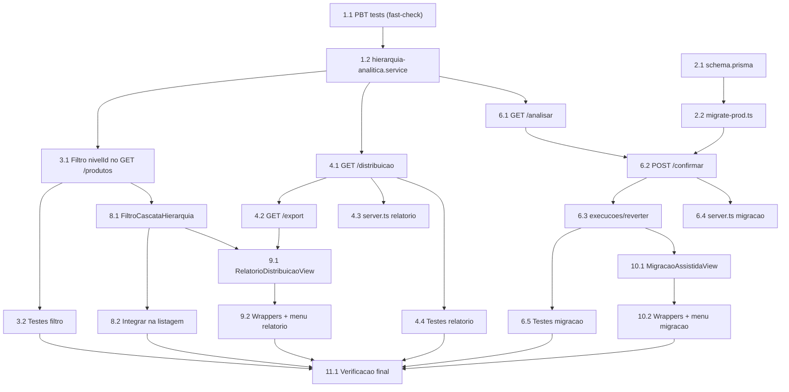

# Implementation Plan: Hierarquia Mercadológica (Fase 2)

## Overview

Esta feature abrange **dois repositórios**: o backend **VisioFab.Wms.Back**
(maioria das tarefas — serviço puro, schema/migração, filtro por nível,
relatório de distribuição, migração assistida) e o frontend
**VisioFab.Wms.Front** (Tarefas 6–8 — componentes e telas de UI). Cada tarefa
indica explicitamente em qual repositório o código é escrito.

A abordagem segue o design: **TDD com property-based testing (fast-check)** para
a lógica pura de `hierarquia-analitica.service.ts` — os testes de propriedade
(Properties 1–10) são escritos **antes** da implementação. O restante (I/O,
isolamento multi-tenant, autorização, exportação, UI) é coberto por testes de
exemplo/integração e verificação de build.

Reaproveita o serviço puro da Fase 1 (`hierarquia.service.ts`) e os padrões do
projeto: Fastify + Prisma 6 + Zod; isolamento multi-tenant com **filtro
explícito por `empresaId`**; migração idempotente no `migrate-prod.ts` no mesmo
commit; tela compartilhada + wrappers finos em WMS e Compras.

## Tasks

- [ ] 1. Serviço puro analítico com property-based tests (TDD) — `VisioFab.Wms.Back`
  - [ ]* 1.1 Escrever os testes fast-check ANTES da implementação (Properties 1–10)
    - Criar `src/modules/hierarquia-mercadologica/hierarquia-analitica.service.test.ts`
    - Um teste de propriedade por propriedade, mínimo **100 iterações** cada (`fc.assert(..., { numRuns: 100 })`)
    - Cada teste com comentário no formato `// Feature: hierarquia-mercadologica-fase2, Property {n}: {texto}`
    - Geradores conforme Testing Strategy: árvore de níveis válida (Departamento→Seção→Categoria→Subcategoria com `codigoHierarquico` composto e folhas descendentes reais como oráculo), contagens por folha (com zeros/folhas ausentes), textos com caixa/acento/espaço/vazio, valores legados + folhas variando só em caixa/acento/espaço
    - Importar as funções a implementar de `hierarquia-analitica.service.ts` (falharão até 1.2 — esperado no TDD)
    - **Property 1: Filtro por prefixo casa exatamente os descendentes** (`folhaDescendeDe`) — **Validates: Requirements 1.4, 1.5**
    - **Property 2: Agregação soma folhas descendentes e preserva todos os níveis** (`agregarContagensPorNivel`) — **Validates: Requirements 2.2, 2.3, 2.4, 9.1, 9.3**
    - **Property 3: Conservação por camada** — **Validates: Requirements 9.2**
    - **Property 4: Independência de ordem da agregação** — **Validates: Requirements 9.4**
    - **Property 5: Conservação global do total de produtos** — **Validates: Requirements 2.6**
    - **Property 6: Normalização produz forma canônica** (`normalizarTexto`) — **Validates: Requirements 8.1**
    - **Property 7: Normalização é idempotente** — **Validates: Requirements 8.2**
    - **Property 8: Equivalência sob capitalização, acentuação e espaços** — **Validates: Requirements 8.3**
    - **Property 9: Sugestões só propõem folhas com texto idêntico e são determinísticas** (`gerarSugestoes`) — **Validates: Requirements 5.4, 5.5, 5.6**
    - **Property 10: Agrupamento por texto normalizado soma quantidades** — **Validates: Requirements 5.2**

  - [ ] 1.2 Implementar `hierarquia-analitica.service.ts` (lógica pura, sem I/O)
    - Criar `src/modules/hierarquia-mercadologica/hierarquia-analitica.service.ts`
    - `prefixoDescendentes(codigoHierarquico)` e `folhaDescendeDe(codigoFolha, codigoNivel)` (filtro por prefixo delimitado por `.`)
    - `agregarContagensPorNivel(niveis, contagensPorFolha)` (soma folhas descendentes por nível; folha sem produto = 0; todos os níveis presentes no resultado; independente de ordem)
    - `normalizarTexto(texto)` (minúsculas, sem acentos via `NFD`, espaços internos colapsados, trim; null/undefined → `''`; idempotente)
    - `gerarSugestoes(valoresLegados, folhas)` (agrupa por texto normalizado somando quantidades; candidatos = folhas com descrição normalizada idêntica; sugestão = menor `codigoHierarquico`; sem candidato → `null`; determinístico)
    - Reaproveitar `TipoNivel` de `hierarquia.service.ts` (Fase 1)
    - Rodar o teste 1.1 até as 10 propriedades passarem
    - _Requirements: 1.4, 1.5, 2.2, 2.3, 2.4, 2.6, 5.2, 5.4, 5.5, 5.6, 8.1, 8.2, 8.3, 9.1, 9.2, 9.3, 9.4_

- [ ] 2. Schema Prisma + migração idempotente no MESMO commit — `VisioFab.Wms.Back`
  - [ ] 2.1 Adicionar models de histórico ao `prisma/schema.prisma`
    - `MigracaoHierarquiaExecucao` (`empresaId`, `usuarioId?`, `totalAfetados`, `revertidaEm?`, `criadoEm`, `@@index([empresaId])`, `@@map("migracao_hierarquia_execucao")`)
    - `MigracaoHierarquiaItem` (`execucaoId` FK cascade, `produtoId` FK, `familiaIdAnterior?`, `familiaIdNovo`, `criadoEm`, `@@index([execucaoId])`, `@@map("migracao_hierarquia_item")`)
    - Rodar `npx prisma migrate dev` local para validar e gerar SQL de referência
    - `npx prisma generate`
    - _Requirements: 7.6, 7.7_

  - [ ] 2.2 Atualizar `prisma/migrate-prod.ts` no MESMO commit (idempotente)
    - `CREATE TABLE IF NOT EXISTS` para as duas tabelas + `CREATE INDEX IF NOT EXISTS` para os índices
    - FKs (`execucao_id`, `produto_id`) em `try/catch` individual (Postgres não tem `ADD CONSTRAINT IF NOT EXISTS`)
    - Testar rodando `npx tsx prisma/migrate-prod.ts` **2x seguidas** contra o banco local — sem erro, sem duplicar (idempotência)
    - Garantir commit único com `schema.prisma` + `migrate-prod.ts` juntos
    - _Requirements: 7.7_

- [ ] 3. Filtro por nível no `GET /produtos` — `VisioFab.Wms.Back`
  - [ ] 3.1 Adicionar params `nivelId`/`semHierarquia` e resolução por prefixo
    - Editar `src/modules/produto/produto.routes.ts` (`GET /`): schema Zod com `nivelId` (uuid opcional) e `semHierarquia` (boolean opcional)
    - `semHierarquia === true` → `where.familiaId = null` e ignora `nivelId` (Req 1.7)
    - `nivelId` presente → resolver nível com `findFirst({ where: { id, empresaId } })`; se não achar → **400** "Nível inválido para esta empresa" (Req 1.8); buscar folhas por `codigoHierarquico` igual ou `startsWith(prefixo + '.')` e filtrar `familiaId IN (ids)`
    - Nenhum param → nenhum filtro de hierarquia (Req 1.6); folha direta → conjunto de 1 (Req 1.5)
    - **Filtro explícito por `empresaId`** em todas as queries (não confiar só no `prismaScoped`)
    - Reutilizar `prefixoDescendentes`/`folhaDescendeDe` da Tarefa 1 onde aplicável
    - _Requirements: 1.4, 1.5, 1.6, 1.7, 1.8, 1.9_

  - [ ]* 3.2 Escrever testes de integração do filtro por nível
    - Sem params == sem filtro de hierarquia (Req 1.6); `semHierarquia` traz só `familiaId` null e ignora `nivelId` (Req 1.7)
    - `nivelId` de outra empresa → 400 (Req 1.8); nível intermediário retorna todos os descendentes; isolamento com 2 empresas (Req 1.9)
    - _Requirements: 1.4, 1.5, 1.6, 1.7, 1.8, 1.9_

- [ ] 4. Relatório de distribuição — `VisioFab.Wms.Back`
  - [ ] 4.1 Criar `hierarquia-relatorio.routes.ts` com `GET /distribuicao`
    - Criar `src/modules/hierarquia-mercadologica/hierarquia-relatorio.routes.ts` (prefixo `/api/hierarquia-mercadologica/relatorio`, `onRequest: authenticate`)
    - Buscar níveis da empresa (todos, inclusive sem produto) + `groupBy familiaId` (só `empresaId`, `familiaId not null`)
    - Chamar `agregarContagensPorNivel` (Tarefa 1) e calcular `totalComHierarquia`/`totalSemHierarquia`/`totalGeral`
    - Empresa vazia → tudo zero (Req 2.7); falha de cálculo → **500** sem parciais (cálculo completo antes de montar resposta — Req 2.8)
    - **Filtro explícito por `empresaId`** em todas as queries (Req 2.9)
    - Aceitar os mesmos params de filtro (`nivelId`, `semHierarquia`) para refletir no relatório
    - _Requirements: 2.1, 2.2, 2.3, 2.4, 2.5, 2.6, 2.7, 2.8, 2.9_

  - [ ] 4.2 Adicionar `GET /distribuicao/export` (CSV/Excel)
    - Param `formato=csv|xlsx`; recalcular no momento da solicitação (dados mais recentes, sem bloquear — Req 3.2, 3.3)
    - CSV por serialização simples; Excel via a biblioteca de planilha já usada no ERP
    - Refletir os mesmos filtros recebidos (Req 3.5) e restringir a `empresaId` (Req 3.4)
    - _Requirements: 3.1, 3.2, 3.3, 3.4, 3.5_

  - [ ] 4.3 Registrar o prefixo em `src/server.ts`
    - Registrar `hierarquiaRelatorioRoutes` com o prefixo `/api/hierarquia-mercadologica/relatorio`
    - _Requirements: 2.1, 3.1_

  - [ ]* 4.4 Escrever testes de integração do relatório e exportação
    - Totais batem com o banco; empresa vazia → tudo zero; falha simulada → erro sem parcial; isolamento (Req 2.1, 2.5, 2.7, 2.8, 2.9)
    - CSV e XLSX válidos, refletem filtros e a empresa (Req 3.1–3.5)
    - _Requirements: 2.1, 2.5, 2.7, 2.8, 2.9, 3.1, 3.2, 3.3, 3.4, 3.5_

- [ ] 5. Checkpoint — backend analítico + relatório
  - Ensure all tests pass, ask the user if questions arise.

- [ ] 6. Migração assistida (backend) — `VisioFab.Wms.Back`
  - [ ] 6.1 Criar `hierarquia-migracao.routes.ts` com `GET /analisar`
    - Criar `src/modules/hierarquia-mercadologica/hierarquia-migracao.routes.ts` (prefixo `/api/hierarquia-mercadologica/migracao`, `onRequest: authenticate`)
    - Levantar valores distintos de `familia`/`subFamilia` dos produtos da empresa; agrupar por texto normalizado somando quantidades; nulo/vazio/só espaços → item "sem classificação" sem sugestão
    - Buscar folhas (`tipo SUBCATEGORIA`) e chamar `gerarSugestoes` (Tarefa 1)
    - Produtos com `familiaId` já preenchido → exibir vínculo atual, sem sugestão automática de substituição (Req 5.9); nenhum valor legado → análise vazia (Req 5.7)
    - **Filtro explícito por `empresaId`** em todas as queries (Req 5.8)
    - _Requirements: 5.1, 5.2, 5.3, 5.7, 5.8, 5.9_

  - [ ] 6.2 Adicionar `POST /confirmar` (transação, histórico, regras de substituição, admin-only)
    - Restrito a ADMIN/SUPER_ADMIN → **403** caso contrário (Req 6.5)
    - Transação: criar `MigracaoHierarquiaExecucao`; para decisão `CRIAR` criar nível pelas regras da Fase 1 (tipo, pai, segmento, `composeCodigoHierarquico`) e usar como destino (Req 6.2)
    - Validar folha destino (existe, é `SUBCATEGORIA`, mesma empresa) → folha inválida rejeita **só** aquele mapeamento com mensagem clara, confirma os demais válidos, sem alteração parcial (Req 6.7)
    - Para cada produto casado: `familiaId` nulo → grava + item histórico (anterior null → novo); já preenchido e `substituirExistente !== true` → mantém, sem histórico (Req 7.2); já preenchido e `substituirExistente === true` → grava novo + histórico do anterior (Req 7.3)
    - `IGNORAR` → nenhum produto alterado (Req 6.3, 7.1); nunca tocar `familia`/`subFamilia` (Req 7.1); gravar sempre com `empresaId` do próprio produto no `where` (Req 6.6, 7.8)
    - Cada alteração vira `MigracaoHierarquiaItem` (`produtoId`, `familiaIdAnterior`, `familiaIdNovo`) (Req 7.6)
    - _Requirements: 6.1, 6.2, 6.3, 6.4, 6.5, 6.6, 6.7, 7.1, 7.2, 7.3, 7.6, 7.8_

  - [ ] 6.3 Adicionar `GET /execucoes` e `POST /execucoes/:id/reverter`
    - `GET /execucoes`: lista execuções da empresa (filtro explícito por `empresaId`) para auditoria/escolha de reversão
    - `POST /execucoes/:id/reverter`: ADMIN/SUPER_ADMIN; `findFirst({ where: { id, empresaId } })` → inexistente/outra empresa **404** (Req 7.5); já revertida (`revertidaEm`) → **409** (Req 7.5)
    - Round-trip: para cada item, restaurar `familiaId` anterior; se `familiaId` atual divergir do `familiaIdNovo` gravado → rejeitar **só** aquele item com motivo, reverter os consistentes, sem reversão parcial (Req 7.5); marcar `revertidaEm`
    - Nunca alterar campos legados na reversão (Req 7.4); filtro explícito por `empresaId` (Req 7.8)
    - _Requirements: 7.4, 7.5, 7.8_

  - [ ] 6.4 Registrar o prefixo em `src/server.ts`
    - Registrar `hierarquiaMigracaoRoutes` com o prefixo `/api/hierarquia-mercadologica/migracao`
    - _Requirements: 5.1, 6.1_

  - [ ]* 6.5 Escrever testes de integração da migração e reversão
    - 3 decisões (vincular/criar/ignorar); admin-only (não-admin → 403); folha inválida rejeitada isoladamente; legados intactos; substituir=false mantém, substituir=true grava novo + histórico; gravação com `empresaId` do produto; isolamento 2 empresas (Req 5.1, 5.9, 6.1–6.7, 7.1–7.3, 7.6, 7.8)
    - Reversão round-trip restaura anterior dos consistentes; já revertida → 409; inexistente/outra empresa → 404; item divergente rejeitado, demais revertidos; legados intactos (Req 7.4, 7.5)
    - _Requirements: 5.1, 5.9, 6.1, 6.2, 6.3, 6.4, 6.5, 6.6, 6.7, 7.1, 7.2, 7.3, 7.4, 7.5, 7.6, 7.8_

- [ ] 7. Checkpoint — backend migração assistida completo
  - Ensure all tests pass, ask the user if questions arise.

- [ ] 8. Filtro em cascata (frontend) — `VisioFab.Wms.Front`
  - [ ] 8.1 Criar componente reutilizável `FiltroCascataHierarquia.tsx`
    - Criar `src/components/hierarquia/FiltroCascataHierarquia.tsx`: 4 `Select` encadeados (Departamento → Seção → Categoria → Subcategoria/Família) + checkbox "sem hierarquia"
    - Carregar níveis ativos via `GET /hierarquia-mercadologica?status=true`, ordenados por `codigoHierarquico`
    - Selecionar uma camada restringe a inferior aos filhos diretos (`paiId`) (Req 1.2); trocar/limpar uma camada limpa as inferiores e recompõe opções (Req 1.3)
    - Emitir o `nivelId` do nível mais profundo escolhido (ou `semHierarquia`)
    - _Requirements: 1.1, 1.2, 1.3, 1.7_

  - [ ] 8.2 Integrar o filtro na listagem de produtos
    - Ligar `FiltroCascataHierarquia` à listagem de produtos, repassando `nivelId`/`semHierarquia` ao `GET /produtos`
    - Tratar 400 de nível inválido preservando o estado anterior da listagem (Req 1.8)
    - _Requirements: 1.4, 1.5, 1.6, 1.7, 1.8_

- [ ] 9. Relatório de distribuição (frontend) — `VisioFab.Wms.Front`
  - [ ] 9.1 Criar `RelatorioDistribuicaoView.tsx`
    - Criar `src/components/hierarquia/RelatorioDistribuicaoView.tsx`: tabela agrupada por tipo de nível com contagem agregada, totais com/sem hierarquia, botões Exportar CSV / Excel
    - Consumir `GET .../relatorio/distribuicao`; reutilizar `FiltroCascataHierarquia`; estado de erro dedicado (Req 2.8)
    - Exportação chama `GET .../relatorio/distribuicao/export?formato=` refletindo os filtros aplicados (Req 3.5)
    - _Requirements: 2.1, 2.4, 2.5, 2.8, 3.1, 3.5_

  - [ ] 9.2 Criar wrappers WMS e Compras + itens de menu
    - `src/app/(interna)/configurador/hierarquia-relatorio/page.tsx` (WMS) e `src/app/(interna)/compras/hierarquia-relatorio/page.tsx` (Compras) — wrappers finos usando `RelatorioDistribuicaoView`
    - `detectModule` mantém contexto Compras em `/compras/*` (Req 4.2, 4.3); guard `useModuloGuard(['WMS','COMPRAS'])` (Req 4.4)
    - Itens de menu no `src/components/layout/ModuleSidebar.tsx` no grupo Cadastros (WMS → `/configurador/*`; Compras → `/compras/*`) (Req 4.1)
    - _Requirements: 4.1, 4.2, 4.3, 4.4_

- [ ] 10. Migração assistida (frontend) — `VisioFab.Wms.Front`
  - [ ] 10.1 Criar `MigracaoAssistidaView.tsx` (wizard + aba execuções)
    - Criar `src/components/hierarquia/MigracaoAssistidaView.tsx`: wizard em 3 passos — **Analisar** (lista itens com quantidade e sugestão), **Revisar** (por item: Vincular / Criar nível / Ignorar, com toggle "substituir vínculo existente"), **Confirmar**
    - Aba **Execuções**: lista histórico (`GET .../migracao/execucoes`) com ação **Reverter** (`POST .../migracao/execucoes/:id/reverter`), tratando 404/409
    - Consumir `GET .../migracao/analisar` e `POST .../migracao/confirmar`
    - _Requirements: 5.1, 6.1, 6.2, 6.3, 6.4, 7.4, 7.5_

  - [ ] 10.2 Criar wrappers WMS e Compras + itens de menu
    - `src/app/(interna)/configurador/hierarquia-migracao/page.tsx` (WMS) e `src/app/(interna)/compras/hierarquia-migracao/page.tsx` (Compras) — wrappers finos usando `MigracaoAssistidaView`
    - `detectModule` mantém contexto Compras em `/compras/*` (Req 4.2, 4.3); guard `useModuloGuard(['WMS','COMPRAS'])` (Req 4.4)
    - Itens de menu no `ModuleSidebar.tsx` no grupo Cadastros (WMS → `/configurador/*`; Compras → `/compras/*`) (Req 4.1)
    - _Requirements: 4.1, 4.2, 4.3, 4.4_

- [ ] 11. Verificação final
  - [ ] 11.1 Rodar a suíte de testes e verificação de build
    - `VisioFab.Wms.Back`: vitest do `hierarquia-analitica.service.test.ts` passando (Properties 1–10, ≥100 iterações cada); demais testes de integração passando
    - `VisioFab.Wms.Back`: `npx tsc --noEmit -p tsconfig.json` sem novos erros além da baseline conhecida (~65–85 erros)
    - `VisioFab.Wms.Front`: `tsc --noEmit` sem novos erros além da baseline
    - `get_diagnostics` limpo nos arquivos novos/alterados de ambos os repositórios
    - Reconfirmar `npx tsx prisma/migrate-prod.ts` **2x local** sem erro; `schema.prisma` + `migrate-prod.ts` no mesmo commit
    - _Requirements: 7.7_

## Notes

- **Dois repositórios**: as Tarefas 1–6 são no backend **VisioFab.Wms.Back**; as
  Tarefas 8–10 são no frontend **VisioFab.Wms.Front**; a Tarefa 11 verifica
  ambos.
- **Regra de migration obrigatória**: toda alteração em `prisma/schema.prisma`
  exige a alteração idempotente equivalente em `prisma/migrate-prod.ts` **no
  mesmo commit**, testada rodando `npx tsx prisma/migrate-prod.ts` **2x local**
  sem erro (o projeto não usa `prisma migrate deploy` em produção). FKs em
  `try/catch` individual.
- **Isolamento multi-tenant explícito por `empresaId`**: NUNCA confiar apenas no
  `request.prismaScoped` (que faz bypass para SUPER_ADMIN). Toda query filtra
  explicitamente por `empresaId` — do usuário no filtro/relatório/análise; do
  próprio produto na gravação e na reversão.
- **Baseline `tsc --noEmit`**: o backend tem ~65–85 erros pré-existentes
  conhecidos (dívida técnica documentada). Não corrigir reativamente; apenas
  garantir que nenhum erro **novo** seja introduzido.
- **Commit direto na main com deploy automático**: o usuário autorizou
  explicitamente, **apenas nesta sessão**, commit direto na `main` (deploy
  automático no Render/backend e Vercel/frontend).
- **Telas compartilhadas em WMS e Compras**: mesmo padrão da Fase 1 — componente
  compartilhado + wrappers finos em `/configurador/*` (WMS) e `/compras/*`
  (Compras), com `detectModule` e guard `useModuloGuard(['WMS','COMPRAS'])`.
- Tarefas marcadas com `*` são opcionais (testes) e podem ser puladas para um
  MVP mais rápido; os testes de propriedade (1.1) são fortemente recomendados por
  serem a base do TDD da lógica pura.
- Cada tarefa referencia os requisitos e, quando implementa lógica coberta por
  PBT, referencia as Properties do design.

## Task Dependency Graph



```json
{
  "waves": [
    { "id": 0, "tasks": ["1.1", "2.1"] },
    { "id": 1, "tasks": ["1.2", "2.2"] },
    { "id": 2, "tasks": ["3.1", "4.1", "6.1"] },
    { "id": 3, "tasks": ["3.2", "4.2", "4.3", "4.4", "6.2", "8.1"] },
    { "id": 4, "tasks": ["6.3", "6.4", "8.2", "9.1"] },
    { "id": 5, "tasks": ["6.5", "9.2", "10.1"] },
    { "id": 6, "tasks": ["10.2"] },
    { "id": 7, "tasks": ["11.1"] }
  ]
}
```
