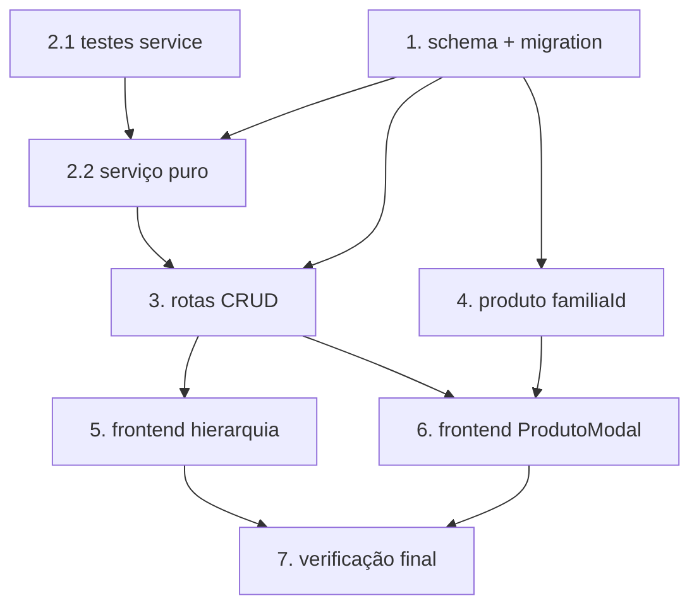

# Implementation Plan

## Overview

Plano de implementação da Hierarquia Mercadológica (5 níveis fixos: Departamento →
Seção → Categoria → Subcategoria → Família). O `Produto` passa a ter `familiaId`
opcional. Uma tabela auto-referenciada `nivel_mercadologico` persiste todos os
níveis. O trabalho envolve backend (schema + migration + serviço puro + rotas) e
frontend (tela de cadastro + campo no ProdutoModal).

## Tasks

- [x] 1. Schema Prisma + Migration idempotente
  - Adicionar o model `NivelMercadologico` (tabela `nivel_mercadologico`) ao `prisma/schema.prisma` conforme o design, incluindo auto-referência `PaiFilho`, unique `[empresaId, codigoHierarquico]` e índice `[empresaId, tipo, status]`.
  - Adicionar `familiaId String? @map("familia_id")` e a relação `familia NivelMercadologico?` ao model `Produto`.
  - Atualizar `prisma/migrate-prod.ts` com as instruções idempotentes: `CREATE TABLE IF NOT EXISTS nivel_mercadologico`, índices, FK auto-referência e `ALTER TABLE produto ADD COLUMN IF NOT EXISTS familia_id TEXT` (FKs em `try/catch` individual, padrão do projeto).
  - Gerar o Prisma Client: `npx prisma generate`.
  - Testar idempotência: rodar `npx tsx prisma/migrate-prod.ts` **2 vezes** localmente sem erro.
  - Commitar `schema.prisma` + `migrate-prod.ts` juntos (regra obrigatória do projeto).
  - _Requirements: 5.1, 5.2, 5.3_

- [x] 2. Serviço puro + testes property-based
  - [x] 2.1 Escrever testes property-based antes da implementação
    - Criar `src/modules/hierarquia-mercadologica/hierarquia.service.test.ts` com fast-check cobrindo: (P1) `composeCodigoHierarquico` é determinístico para qualquer `(tipo, codigoPai, segmento)`; (P2) `validarCodigoSegmento` só aprova strings numéricas com largura exata por tipo; (P3) segmentos com largura errada são sempre rejeitados; (P4) `LARGURA_SEGMENTO` cobre todos os 5 tipos sem exceção.
    - _Requirements: 2.1, 2.2, 2.3_
  - [x] 2.2 Implementar o serviço puro
    - Criar `src/modules/hierarquia-mercadologica/hierarquia.service.ts` com `TipoNivel`, `LARGURA_SEGMENTO`, `TIPO_PAI_OBRIGATORIO`, `validarCodigoSegmento`, `composeCodigoHierarquico` e `montarCaminhoCompleto`.
    - Garantir que os testes de 2.1 passem.
    - _Requirements: 2.1, 2.2, 2.3, 2.4_

- [x] 3. Rotas CRUD do backend
  - Criar `src/modules/hierarquia-mercadologica/hierarquia.routes.ts` com `GET /`, `GET /:id`, `POST /`, `PUT /:id`, `PATCH /:id/status` e `DELETE /:id`.
  - POST: validar tipo do pai via `TIPO_PAI_OBRIGATORIO`; chamar `validarCodigoSegmento`; compor `codigoHierarquico` via `composeCodigoHierarquico`; tratar P2002 → 409 legível.
  - DELETE: verificar filhos (`filhos.count > 0`) e produtos vinculados (`produtos.count > 0`) → 409 com contagem.
  - Escrita restrita a ADMIN/SUPER_ADMIN; leitura aberta.
  - Isolamento multi-tenant: usar `request.prismaScoped || prisma` + filtro explícito por `empresaId`, padrão de `classificacaoProdutoRoutes`.
  - Registrar em `src/server.ts`: `app.register(hierarquiaRoutes, { prefix: '/api/hierarquia-mercadologica' })`.
  - Verificar diagnostics sem erros novos.
  - _Requirements: 1.1, 1.2, 1.3, 1.4, 1.5, 1.6, 2.4, 4.1, 4.2, 4.4_

- [x] 4. Produto: aceitar familiaId no PUT
  - Em `produto.routes.ts`, no `PUT /:id`, adicionar `familiaId: z.string().uuid().nullable().optional()` ao schema do body.
  - Ao atualizar, se `familiaId` for informado, validar que pertence ao tipo `FAMILIA` e à mesma empresa (Req 3.3).
  - Verificar diagnostics sem erros novos.
  - _Requirements: 3.1, 3.3, 3.4_

- [x] 5. Frontend — tela de gerenciamento da hierarquia
  - Criar `src/app/(interna)/configurador/hierarquia/page.tsx` com painel de abas por tipo de nível.
  - Por aba: listar níveis do tipo selecionado com seleção de pai, formulário de novo/editar, toggle de status e exclusão.
  - Exibir `codigoHierarquico` (readonly) e `descricao`. Tratar 403/400/409 com mensagem do backend.
  - Adicionar link "Hierarquia Mercadológica" ao menu do Configurador (`ModuleSidebar.tsx`).
  - _Requirements: 1.1, 1.2, 1.4, 2.1, 4.1, 4.2, 4.3, 4.4_

- [x] 6. Frontend — campo Família no ProdutoModal
  - Adicionar `Select` de Família ao `ProdutoModal.tsx`: busca `GET /hierarquia-mercadologica?tipo=FAMILIA&status=true`.
  - Ao selecionar, buscar `GET /:id` e exibir breadcrumb do caminho completo acima do campo.
  - Quando não há Família: exibir texto "Sem hierarquia definida".
  - Enviar `familiaId` no `PUT /produtos/:id`.
  - _Requirements: 3.1, 3.2, 3.4, 3.5, 3.6_

- [x] 7. Verificação final
  - Rodar `npx vitest run src/modules/hierarquia-mercadologica` e confirmar que os testes passam.
  - Confirmar que `npx tsc --noEmit` no backend não introduz novos erros além da baseline conhecida.
  - Confirmar `get_diagnostics` limpo nos arquivos do frontend tocados.
  - Confirmar `schema.prisma` e `migrate-prod.ts` foram commitados juntos na Tarefa 1.
  - _Requirements: 5.1, 5.3_

## Task Dependency Graph



```json
{
  "waves": [
    { "wave": 1, "tasks": ["1", "2.1"] },
    { "wave": 2, "tasks": ["2.2"] },
    { "wave": 3, "tasks": ["3", "4"] },
    { "wave": 4, "tasks": ["5", "6"] },
    { "wave": 5, "tasks": ["7"] }
  ]
}
```

## Notes

- Feature em `VisioFab.Wms.Back` (maioria) + `VisioFab.Wms.Front` (Tarefas 5 e 6).
- **Migration obrigatória**: a Tarefa 1 altera `schema.prisma` — `migrate-prod.ts` deve ir no mesmo commit, testado 2x local.
- Os campos legados `familia`/`subFamilia` (texto livre) no produto são preservados nesta entrega.
- Criar branch nova antes de commitar (padrão do repositório).
- Baseline de `tsc`: ~65-85 erros pré-existentes conhecidos; a mudança não deve aumentar esse número.
