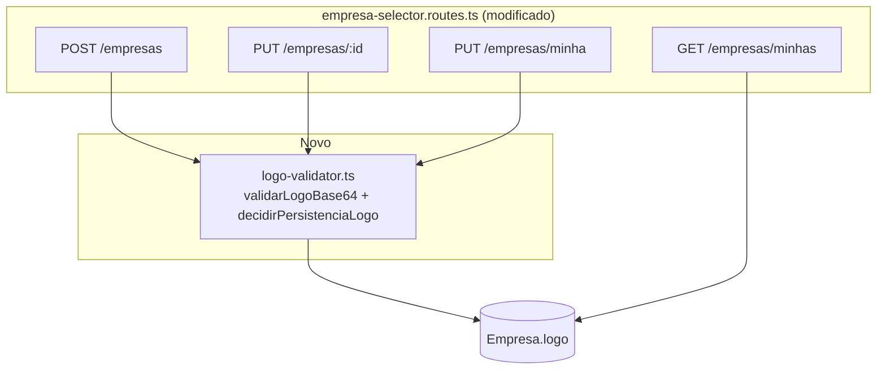
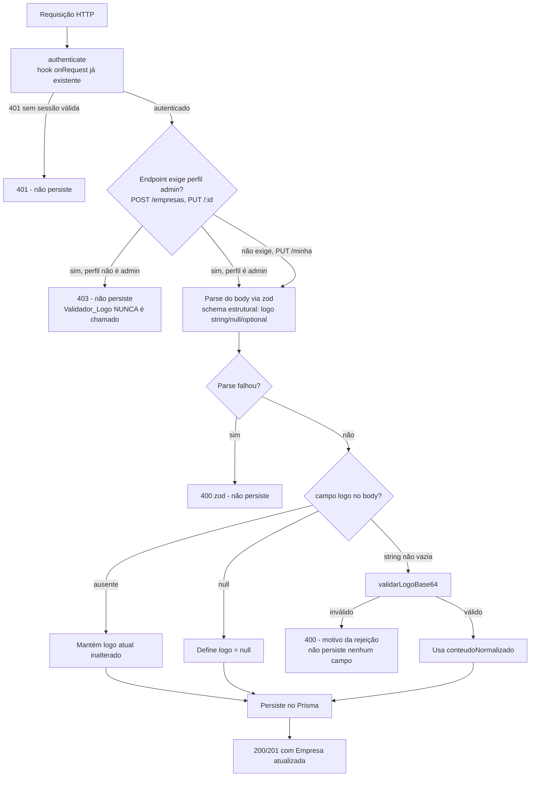

# Design Document — Logo da Empresa

## Overview

Esta feature adiciona suporte ao logo de uma Empresa nos endpoints já
existentes de `src/modules/empresa-selector/empresa-selector.routes.ts`.
Nenhum endpoint novo é criado e nenhum campo novo de schema é necessário —
o campo `logo String? @db.Text` já existe no model `Empresa`.

**Decisão de transporte (fixada neste design):** o logo é enviado como
string base64 (com ou sem prefixo `data:image/...;base64,`) embutida no
corpo JSON dos endpoints existentes (`POST /empresas`, `PUT /empresas/:id`,
`PUT /empresas/minha`). Não é criado um endpoint multipart dedicado. Essa
escolha é consistente com o campo `logo` já ser `Text` no schema — um
endpoint multipart exigiria um mecanismo de armazenamento de arquivo
binário separado, que não existe hoje para este model, e introduziria
complexidade desproporcional ao escopo (imagens pequenas, ≤2MB).

O trabalho se resume a:

1. Extrair uma função pura `validarLogoBase64` (Validador_Logo) que decodifica,
   valida assinatura binária (magic bytes) e tamanho, e normaliza o valor
   a persistir.
2. Adicionar `logo` aos schemas zod dos três endpoints de escrita, com a
   regra de que a permissão administrativa (quando aplicável) é verificada
   **antes** de qualquer validação do campo `logo`.
3. Adicionar `logo: true` ao `select`/`map` de `GET /empresas/minhas`.

### Decisões de Design

- **Validador_Logo como função pura e testável**, em novo arquivo
  `src/modules/empresa-selector/logo-validator.ts`, sem I/O — recebe uma
  string e retorna um resultado discriminado (`valido`/`motivo`), sem
  depender de Prisma, Fastify ou request/response.
- **Detecção de formato por assinatura binária (magic bytes), nunca por
  prefixo declarado ou extensão** — resolve diretamente o Acceptance
  Criteria 6 do Requirement 3 e o Acceptance Criteria 2 do Requirement 5: o
  valor persistido é sempre normalizado com o prefixo `data:image/png;base64,`
  ou `data:image/jpeg;base64,` correspondente ao formato **real** detectado
  no conteúdo binário, independentemente do que o cliente declarou.
- **Ordem fixa de validação em cada handler**: autenticação (já via hook
  `onRequest: authenticate`) → permissão administrativa (quando aplicável)
  → parse do body via zod (schema apenas estrutural, sem validar conteúdo
  de imagem) → Validador_Logo (somente se `logo` fornecido e não-null) →
  persistência. Essa ordem garante que um usuário sem permissão nunca
  aciona o Validador_Logo, e que nenhuma persistência ocorre antes de todas
  as validações passarem.
- **Função de decisão de persistência centralizada e pura**
  (`decidirPersistenciaLogo`), reaproveitada pelos três handlers, para que
  a regra "ausente → mantém; `null` → remove; string não vazia → valida e
  normaliza" seja implementada uma única vez e testada isoladamente.
- **Nenhuma alteração de schema Prisma**: o campo `logo` já existe. Nenhuma
  alteração em `prisma/migrate-prod.ts` é necessária (ver seção
  "Premissas e impacto em banco de dados").

## Architecture



### Fluxo de validação (ordem de verificação)



## Components and Interfaces

### `src/modules/empresa-selector/logo-validator.ts` (novo)

Módulo puro, sem dependências de Fastify/Prisma — testável isoladamente com
property-based tests.

```typescript
export type MotivoRejeicaoLogo = 'FORMATO_INVALIDO' | 'TAMANHO_EXCEDIDO' | 'BASE64_INVALIDO'

export type ResultadoValidacaoLogo =
  | { valido: true; conteudoNormalizado: string }
  | { valido: false; motivo: MotivoRejeicaoLogo }

/** Limite do conteúdo binário decodificado (Requirement 5.3) */
export const TAMANHO_MAXIMO_LOGO_BYTES = 2_000_000

const PNG_MAGIC = Buffer.from([0x89, 0x50, 0x4e, 0x47, 0x0d, 0x0a, 0x1a, 0x0a])
const JPEG_MAGIC = Buffer.from([0xff, 0xd8, 0xff])

/**
 * Remove um prefixo de data-URL (data:image/...;base64,) se presente.
 * Não valida o mimetype declarado — apenas isola a porção base64.
 */
function removerPrefixoDataUrl(valor: string): string {
  const match = valor.match(/^data:[^;]+;base64,(.*)$/s)
  return match ? match[1] : valor
}

/** Detecta o formato pela assinatura binária real, ignorando qualquer metadado declarado. */
function detectarFormato(buffer: Buffer): 'png' | 'jpeg' | null {
  if (buffer.length >= PNG_MAGIC.length && buffer.subarray(0, PNG_MAGIC.length).equals(PNG_MAGIC)) {
    return 'png'
  }
  if (buffer.length >= JPEG_MAGIC.length && buffer.subarray(0, JPEG_MAGIC.length).equals(JPEG_MAGIC)) {
    return 'jpeg'
  }
  return null
}

/**
 * Validador_Logo: decodifica, valida tamanho e formato, e normaliza.
 * Função pura — mesma entrada produz sempre a mesma saída.
 *
 * Ordem de checagem (fixa e testada): base64 válido → tamanho → formato.
 * O tamanho é checado antes do formato porque é a checagem mais barata e
 * porque o Requirement 5.3 trata "tamanho excedido" como rejeição
 * independente do conteúdo ser ou não uma imagem reconhecível.
 */
export function validarLogoBase64(valor: string): ResultadoValidacaoLogo {
  const base64Puro = removerPrefixoDataUrl(valor).trim()

  let buffer: Buffer
  try {
    buffer = Buffer.from(base64Puro, 'base64')
    // Buffer.from com 'base64' não lança para lixo — validamos re-codificando
    // e comparando (ignorando padding/whitespace) para detectar entrada inválida.
    const normalizado = base64Puro.replace(/\s/g, '')
    if (normalizado.length === 0 || !/^[A-Za-z0-9+/]*={0,2}$/.test(normalizado)) {
      return { valido: false, motivo: 'BASE64_INVALIDO' }
    }
    if (buffer.toString('base64').replace(/=+$/, '') !== normalizado.replace(/=+$/, '')) {
      return { valido: false, motivo: 'BASE64_INVALIDO' }
    }
  } catch {
    return { valido: false, motivo: 'BASE64_INVALIDO' }
  }

  if (buffer.length === 0) {
    return { valido: false, motivo: 'BASE64_INVALIDO' }
  }

  if (buffer.length > TAMANHO_MAXIMO_LOGO_BYTES) {
    return { valido: false, motivo: 'TAMANHO_EXCEDIDO' }
  }

  const formato = detectarFormato(buffer)
  if (!formato) {
    return { valido: false, motivo: 'FORMATO_INVALIDO' }
  }

  const mimetype = formato === 'png' ? 'image/png' : 'image/jpeg'
  return { valido: true, conteudoNormalizado: `data:${mimetype};base64,${buffer.toString('base64')}` }
}

/** Mensagem 400 amigável em português para cada motivo de rejeição. */
export function mensagemErroLogo(motivo: MotivoRejeicaoLogo): string {
  switch (motivo) {
    case 'FORMATO_INVALIDO':
      return 'O arquivo enviado não é uma imagem PNG ou JPEG válida.'
    case 'TAMANHO_EXCEDIDO':
      return 'A imagem excede o tamanho máximo permitido de 2MB.'
    case 'BASE64_INVALIDO':
      return 'O conteúdo do logo não é uma string base64 válida.'
  }
}

export type DecisaoPersistenciaLogo =
  | { acao: 'manter' }
  | { acao: 'remover' }
  | { acao: 'persistir'; conteudoNormalizado: string }
  | { acao: 'rejeitar'; motivo: MotivoRejeicaoLogo }

/**
 * Função pura de orquestração, reaproveitada pelos 3 handlers de escrita.
 * Decide o que fazer com o campo `logo` a partir do valor recebido no body
 * (que pode estar ausente — `undefined` — ou ser `null` ou uma string).
 */
export function decidirPersistenciaLogo(logoDoBody: string | null | undefined): DecisaoPersistenciaLogo {
  if (logoDoBody === undefined) return { acao: 'manter' }
  if (logoDoBody === null) return { acao: 'remover' }

  const resultado = validarLogoBase64(logoDoBody)
  if (!resultado.valido) return { acao: 'rejeitar', motivo: resultado.motivo }
  return { acao: 'persistir', conteudoNormalizado: resultado.conteudoNormalizado }
}
```

### `empresa-selector.routes.ts` (modificado)

**Schemas zod** — adicionar em `empresaBodySchema` (usado por `POST /` e
`PUT /:id`) e no `baseSchema` de `PUT /minha`:

```typescript
logo: z.string().nullable().optional(),
```

Nenhuma validação de conteúdo de imagem ocorre no schema zod — o zod
valida apenas que, se presente, o valor é `string | null`. A validação de
conteúdo (Validador_Logo) ocorre depois do parse, na etapa seguinte do
pipeline.

**`POST /` (Endpoint_Criação_Empresa)** — dentro do handler, após a
checagem de permissão administrativa já existente e após
`empresaBodySchema.parse`:

```typescript
const decisao = decidirPersistenciaLogo(body.logo)
if (decisao.acao === 'rejeitar') {
  return reply.status(400).send({ message: mensagemErroLogo(decisao.motivo) })
}
const logoParaPersistir = decisao.acao === 'persistir' ? decisao.conteudoNormalizado : null

// ...verificação de CNPJ duplicado (já existente)...

const empresa = await prisma.empresa.create({
  data: { ...body, logo: logoParaPersistir },
})
```

**`PUT /:id` (Endpoint_Atualização_Empresa)** — mesma lógica, mas quando
`decisao.acao === 'manter'` o campo `logo` **não é incluído** no objeto
`data` do `update` (para não sobrescrever com `undefined`, que o Prisma já
trata como "não alterar", mas explicitamos por clareza):

```typescript
const decisao = decidirPersistenciaLogo(body.logo)
if (decisao.acao === 'rejeitar') {
  return reply.status(400).send({ message: mensagemErroLogo(decisao.motivo) })
}

const data = { ...body }
if (decisao.acao === 'remover') data.logo = null
else if (decisao.acao === 'persistir') data.logo = decisao.conteudoNormalizado
else delete data.logo // 'manter' — não toca no campo
```

**`PUT /minha` (Endpoint_Atualização_Minha)** — mesma lógica que `PUT /:id`,
sem checagem de perfil administrativo adicional (mantém a autorização já
vigente do endpoint: autenticação + `empresaId` selecionado):

```typescript
const decisao = decidirPersistenciaLogo(parsedBody.logo)
if (decisao.acao === 'rejeitar') {
  return reply.status(400).send({ message: mensagemErroLogo(decisao.motivo) })
}

const data = { ...parsedBody }
if (decisao.acao === 'remover') data.logo = null
else if (decisao.acao === 'persistir') data.logo = decisao.conteudoNormalizado
else delete data.logo
```

**`GET /minhas` (Endpoint_Listagem_Minhas)** — adicionar `logo: true` ao
`select` do `include.empresa` e ao objeto retornado pelo `.map()`:

```typescript
include: {
  empresa: {
    select: {
      id: true,
      razaoSocial: true,
      nomeFantasia: true,
      cnpj: true,
      logo: true,
      status: true,
    },
  },
},
```

```typescript
.map((v) => ({
  id: v.empresa.id,
  razaoSocial: v.empresa.razaoSocial,
  nomeFantasia: v.empresa.nomeFantasia,
  cnpj: v.empresa.cnpj,
  logo: v.empresa.logo,
}))
```

`GET /minha` já retorna `logo: true` no `select` — nenhuma alteração
necessária ali (confirmado por leitura do arquivo atual).

## Data Models

Nenhuma alteração de model. Referência do campo já existente (não alterado):

```prisma
model Empresa {
  // ...campos existentes...
  logo String? @db.Text
}
```

### Premissas e impacto em banco de dados

- O campo `logo String? @db.Text` já existe em `prisma/schema.prisma`.
- **Nenhuma migration é necessária.** Nenhuma alteração é feita em
  `prisma/schema.prisma` nem em `prisma/migrate-prod.ts` para esta feature
  (Requirement 6.3). Toda a lógica desta feature vive em código de
  aplicação (`logo-validator.ts` e `empresa-selector.routes.ts`).

## Correctness Properties

*A property is a characteristic or behavior that should hold true across all valid executions of a system — essentially, a formal statement about what the system should do. Properties serve as a bridge between human-readable specifications and machine-verifiable correctness guarantees.*

Todas as properties abaixo testam funções puras (`validarLogoBase64`,
`decidirPersistenciaLogo`, `mensagemErroLogo` e a lógica de
filtragem/mapeamento de `GET /minhas`), sem I/O real — seguindo o padrão de
`src/utils/produtoSku.test.ts` (fast-check + vitest, mínimo 100 iterações).

### Property 1: Imagens PNG e JPEG válidas dentro do limite de tamanho são aceitas

*For any* buffer binário cujo conteúdo comece com a assinatura PNG
(`89 50 4E 47 0D 0A 1A 0A`) ou JPEG (`FF D8 FF`), seguido de bytes
arbitrários, com tamanho total entre 1 e 2.000.000 bytes, codificado em
base64 com ou sem prefixo de data-URL, `validarLogoBase64` SHALL retornar
`{ valido: true }` com `conteudoNormalizado` correspondente ao formato
detectado.

**Validates: Requirements 2.1, 3.1, 4.1, 5.1**

### Property 2: Tamanho excedido é sempre rejeitado, independentemente do formato

*For any* buffer binário com tamanho estritamente maior que 2.000.000
bytes — incluindo buffers que começam com assinatura PNG ou JPEG válida —
`validarLogoBase64` SHALL retornar `{ valido: false, motivo: 'TAMANHO_EXCEDIDO' }`.

**Validates: Requirements 5.3, 4.1**

### Property 3: Formato não reconhecido é sempre rejeitado quando o tamanho está dentro do limite

*For any* buffer binário com tamanho entre 1 e 2.000.000 bytes cujos
primeiros bytes não correspondam à assinatura PNG nem à assinatura JPEG,
`validarLogoBase64` SHALL retornar `{ valido: false, motivo: 'FORMATO_INVALIDO' }`,
independentemente de qualquer prefixo de data-URL ou mimetype declarado
informado junto ao valor.

**Validates: Requirements 5.2**

### Property 4: String que não é base64 válida é sempre rejeitada

*For any* string contendo ao menos um caractere fora do alfabeto base64
válido (`A-Z`, `a-z`, `0-9`, `+`, `/`, `=` de padding), ou string vazia
após remoção de um eventual prefixo de data-URL, `validarLogoBase64` SHALL
retornar `{ valido: false, motivo: 'BASE64_INVALIDO' }`.

**Validates: Requirements 5.2, 4.5**

### Property 5: `validarLogoBase64` é determinística

*For any* string de entrada, chamar `validarLogoBase64` múltiplas vezes
com a mesma entrada SHALL sempre produzir o mesmo resultado (mesmo
`valido`, mesmo `motivo` ou mesmo `conteudoNormalizado`).

**Validates: Requirements 5.1, 5.2, 5.3**

### Property 6: A classificação depende apenas do conteúdo binário, nunca do prefixo declarado

*For any* buffer binário válido (PNG ou JPEG, dentro do limite de tamanho),
codificar esse mesmo buffer em base64 com prefixo `data:image/png;base64,`,
com prefixo `data:image/jpeg;base64,`, ou sem prefixo nenhum, SHALL
produzir sempre o mesmo `conteudoNormalizado` em `validarLogoBase64`
(determinado exclusivamente pela assinatura binária real, nunca pelo
prefixo declarado).

**Validates: Requirements 3.6, 5.2**

### Property 7: Decisão de persistência do campo logo é consistente com o valor recebido

*For any* valor de `logoDoBody` igual a `undefined`, `null`, ou uma string
arbitrária (válida ou inválida como logo), `decidirPersistenciaLogo` SHALL:
(a) retornar `{ acao: 'manter' }` se e somente se `logoDoBody === undefined`;
(b) retornar `{ acao: 'remover' }` se e somente se `logoDoBody === null`;
(c) para string não vazia, retornar `{ acao: 'rejeitar', motivo }` se e
somente se `validarLogoBase64(logoDoBody)` for inválido, com o mesmo
`motivo`; e retornar `{ acao: 'persistir', conteudoNormalizado }` se e
somente se `validarLogoBase64(logoDoBody)` for válido, com o mesmo
`conteudoNormalizado`.

**Validates: Requirements 2.2, 2.4, 3.2, 3.3, 3.5, 3.6, 4.2, 4.3, 4.5, 5.4, 5.5, 6.2**

### Property 8: Cada motivo de rejeição produz uma mensagem 400 não vazia e determinística

*For any* motivo de rejeição (`'FORMATO_INVALIDO'`, `'TAMANHO_EXCEDIDO'`,
`'BASE64_INVALIDO'`), `mensagemErroLogo` SHALL retornar sempre a mesma
string não vazia para o mesmo motivo, e motivos distintos SHALL produzir
mensagens distintas entre si.

**Validates: Requirements 5.4**

### Property 9: Listagem `GET /minhas` preserva campos e filtra corretamente por status ativo

*For any* lista de vínculos usuário-empresa, cada um com uma Empresa
sintética contendo valores arbitrários de `id`, `razaoSocial`,
`nomeFantasia`, `cnpj`, `logo` (incluindo `null` e strings base64
arbitrárias) e `status` (booleano), a função de filtragem+mapeamento usada
por `GET /minhas` SHALL retornar exatamente os vínculos cuja
`empresa.status === true`, e cada item do resultado SHALL conter
`id`, `razaoSocial`, `nomeFantasia`, `cnpj` e `logo` idênticos aos da
Empresa de origem correspondente (incluindo `logo: null` quando a Empresa
de origem não possui logo cadastrado).

**Validates: Requirements 1.1, 1.2, 1.3**

## Error Handling

| Situação | Status | Corpo da resposta | Persiste? |
|---|---|---|---|
| Sem autenticação válida | 401 | (já tratado pelo hook `authenticate` existente) | Não |
| Autenticado sem perfil administrativo (`POST /`, `PUT /:id`) | 403 | `{ message: 'Acesso negado' }` (já existente) | Não — Validador_Logo nunca é chamado |
| Body malformado (tipos incorretos) | 400 | Erro padrão do zod (`.parse` lança `ZodError`) | Não |
| `logo` fornecido e `validarLogoBase64` retorna `BASE64_INVALIDO` | 400 | `{ message: 'O conteúdo do logo não é uma string base64 válida.' }` | Não |
| `logo` fornecido e `validarLogoBase64` retorna `FORMATO_INVALIDO` | 400 | `{ message: 'O arquivo enviado não é uma imagem PNG ou JPEG válida.' }` | Não |
| `logo` fornecido e `validarLogoBase64` retorna `TAMANHO_EXCEDIDO` | 400 | `{ message: 'A imagem excede o tamanho máximo permitido de 2MB.' }` | Não |
| `logo` ausente | — | — | Mantém valor atual (nenhum efeito sobre `logo`) |
| `logo` igual a `null` | — | — | Define `logo = null` |
| `logo` válido | 200/201 | Empresa com `logo` normalizado | Sim |
| CNPJ duplicado (já existente, não afetado por esta feature) | 409 | `{ message: 'Já existe uma empresa com este CNPJ' }` | Não |

Em todos os casos de rejeição (401/403/400), a rejeição ocorre **antes**
de qualquer chamada a `prisma.empresa.create`/`update` — nenhuma alteração
parcial é persistida.

## Testing Strategy

**Testes de propriedade (fast-check + vitest)**, em novo arquivo
`src/modules/empresa-selector/logo-validator.test.ts`, cobrindo as 9
properties acima com no mínimo 100 iterações cada, seguindo o padrão de
`produtoSku.test.ts`:

- Geradores de buffers PNG/JPEG sintéticos válidos: gerar um array de bytes
  aleatórios de tamanho controlado e prefixar com a assinatura correta.
- Gerador de buffers com assinatura inválida: gerar bytes aleatórios e, se
  por acaso colidirem com uma assinatura válida, descartar via `filter`
  do fast-check.
- Gerador de strings não-base64: incluir caracteres fora do alfabeto
  (ex.: espaços internos, `!`, `@`) ou comprimento resultando em padding
  inválido.

**Testes de exemplo (unit tests)**, complementares, para:
- Requirement 4.4 — usuário não-admin consegue atualizar o próprio logo via
  `PUT /minha` com sucesso (verifica que nenhuma checagem de perfil
  administrativo adicional foi introduzida nesse endpoint).
- Integração leve dos 3 handlers de escrita (mock do Prisma) verificando
  que, quando `decidirPersistenciaLogo` retorna `'rejeitar'`, o mock de
  `prisma.empresa.create`/`update` nunca é chamado.
- Caso de borda: `logo` enviado como string vazia (`''`) — deve ser
  tratado como conteúdo inválido pelo Validador_Logo (`BASE64_INVALIDO`,
  buffer de tamanho 0), não como equivalente a `null`.
