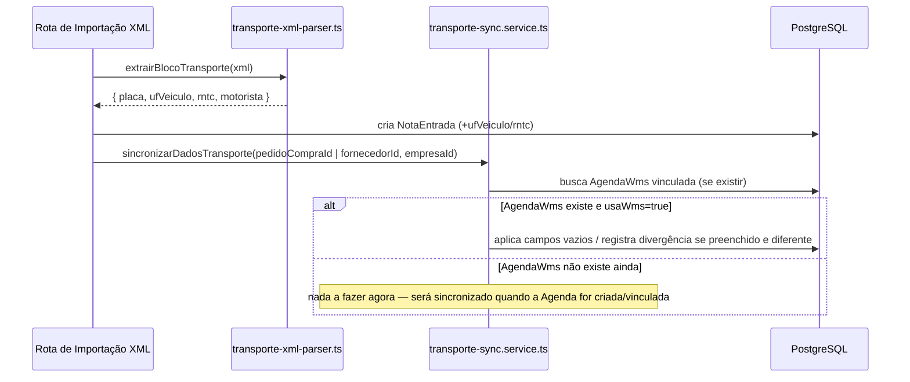
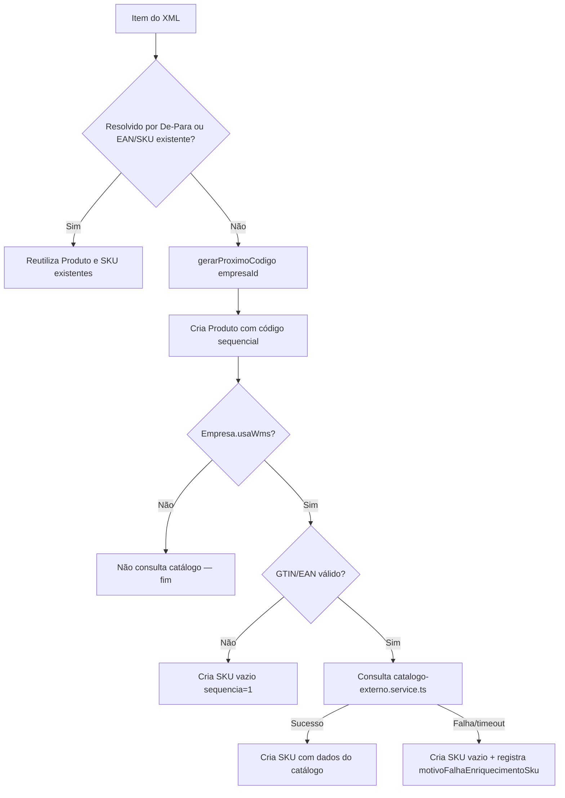
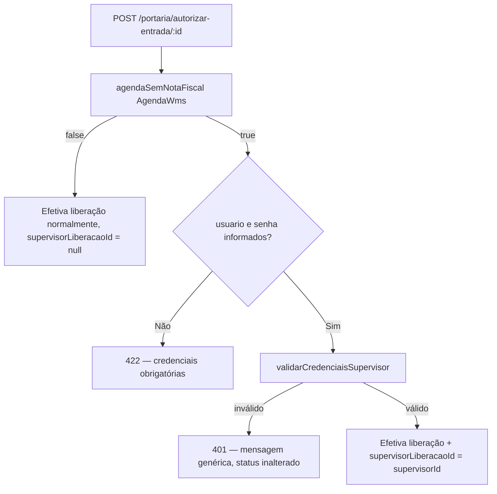
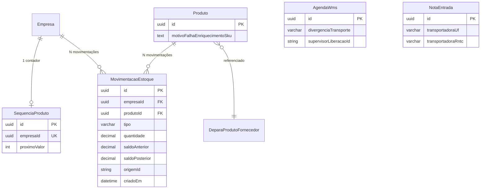

# Design Document — Melhorias Compras, WMS e Fiscal

## Overview

Este design cobre cinco melhorias independentes que tocam módulos distintos do backend (Fastify + Prisma):

1. **Transporte via XML** — extrair placa/UF/RNTC/motorista do `<transp>` da NFe e propagar para `AgendaWms` quando `Empresa.usaWms = true`.
2. **Código sequencial de Produto + enriquecimento de SKU via GTIN** — na importação de XML, produtos novos recebem código interno gerado pelo Sistema (não o `cProd` do fornecedor), e o SKU é enriquecido via consulta externa (Cosmos Bluesoft) quando a empresa usa WMS.
3. **Seed fiscal (NCM/CFOP/CEST)** — endpoint administrativo que popula os cadastros globais a partir de fonte externa, inserindo apenas códigos ainda não existentes.
4. **Kardex de estoque para empresas sem WMS** — nova entidade `MovimentacaoEstoque` com baixa/entrada automática em compra, venda e devoluções, quando `Empresa.usaWms = false`.
5. **Liberação de conferência por senha de Supervisor** — a rota `POST /portaria/autorizar-entrada/:id` passa a exigir credenciais de Supervisor quando o agendamento não tem nota fiscal localizável.

Cada melhoria reaproveita ao máximo módulos e padrões já existentes no código (parser de XML de NFe em `nota-entrada/nfe-xml-parser.ts`, `resolution.service.ts` do De-Para fornecedor×produto, `validarCredenciaisSupervisor` em `conferencia-entrada/validar-supervisor.service.ts`, cadastros fiscais em `fiscal/cadastros/`, e `agenda-wms`/`agenda` para o fluxo de portaria).

### Decisões de Design

- **Extração de transporte centralizada em um único módulo puro** (`nota-entrada/transporte-xml-parser.ts`), importado por todos os pontos de importação de XML (rota dedicada de importação, importação de compras, De-Para, executor de IA), satisfazendo o Requirement 1.7 sem duplicar regex.
- **Geração de código sequencial via UPDATE atômico single-statement** em tabela dedicada `SequenciaProduto` (`UPDATE ... SET proximo_valor = proximo_valor + 1 WHERE empresa_id = $1 RETURNING proximo_valor - 1`), que é atômico no PostgreSQL sem exigir `SELECT ... FOR UPDATE` explícito — a própria semântica de `UPDATE` já serializa concorrência na linha.
- **Reaproveitamento do De-Para existente** (`DeparaProdutoFornecedor`) como registro de mapeamento fornecedor→produto — não é necessário novo modelo para "guardar o cProd"; o De-Para já cumpre esse papel.
- **Serviço de catálogo externo isolado e mockável** (`produto/catalogo-externo.service.ts`), com timeout de 5s via `AbortController`, permitindo testar a lógica de decisão (SKU enriquecido vs. SKU vazio) sem chamadas de rede reais.
- **Seed fiscal com inserção idempotente** — nunca faz `UPDATE` em registros existentes (diferente do fluxo de importação manual de NCM já existente em `ncm.service.ts`, que faz upsert); o seed fiscal é estritamente "insere o que falta".
- **Kardex como serviço transacional único** (`estoque/movimentacao-estoque.service.ts`), reaproveitado dentro das transações já existentes de `/compras/efetivar`, `/vendas/efetivar`, `/compras/:id/devolver` e `devolucao-venda.service.ts`, todos guardados por `if (!empresa.usaWms)`.
- **Decisão de liberação por senha extraída como função pura** (`portaria/liberacao-conferencia.service.ts`), reaproveitando o `validarCredenciaisSupervisor` já existente — nenhuma nova lógica de autenticação é criada.

## Architecture

```mermaid
flowchart TD
    subgraph R1["1. Transporte XML → Agenda"]
        XMLP[transporte-xml-parser.ts]
        NFEP[nfe-xml-parser.ts]
        SYNC[transporte-sync.service.ts]
        AGWMS1[(agenda_wms)]
        NE1[(nota_entrada)]
    end

    subgraph R2["2. Código Sequencial + SKU GTIN"]
        SEQ[codigo-sequencial.service.ts]
        CAT[catalogo-externo.service.ts]
        PIMP[produto-import.service.ts]
        RES[resolution.service.ts]
        PROD[(produto)]
        SKU[(sku)]
        SEQTAB[(sequencia_produto)]
    end

    subgraph R3["3. Seed Fiscal"]
        SEEDR[seed-fiscal.routes.ts]
        SEEDS[seed-fiscal.service.ts]
        FONTE[fonte-externa.service.ts]
        NCM[(ncm)]
        CFOP[(cfop)]
        CEST[(cest)]
    end

    subgraph R4["4. Kardex"]
        MOV[movimentacao-estoque.service.ts]
        KRDX[kardex.routes.ts]
        EST[(estoque)]
        MOVTAB[(movimentacao_estoque)]
    end

    subgraph R5["5. Liberação Supervisor"]
        LIB[liberacao-conferencia.service.ts]
        VSUP[validar-supervisor.service.ts]
        PORT[portaria.routes.ts]
    end

    XMLP --> NFEP --> SYNC --> AGWMS1
    XMLP --> NE1
    PIMP --> RES
    PIMP --> SEQ --> SEQTAB
    PIMP --> CAT
    PIMP --> PROD
    PIMP --> SKU
    SEEDR --> SEEDS --> FONTE
    SEEDS --> NCM
    SEEDS --> CFOP
    SEEDS --> CEST
    MOV --> EST
    MOV --> MOVTAB
    KRDX --> MOVTAB
    PORT --> LIB --> VSUP
```



### Fluxo 1 — Transporte XML → AgendaWms



A sincronização é bidirecional: o mesmo `sincronizarDadosTransporte` é chamado tanto no momento da importação do XML (quando a Agenda pode já existir) quanto no momento em que uma `AgendaWms` é criada ou vinculada a um `pedidoCompraId`/`fornecedorId` (quando a Nota já pode existir).

### Fluxo 2 — Importação de item de XML → Produto/SKU



### Fluxo 5 — Liberação de conferência



## Components and Interfaces

### Requirement 1 — Transporte

| Módulo | Arquivo | Responsabilidade |
|--------|---------|-------------------|
| nota-entrada | `src/modules/nota-entrada/transporte-xml-parser.ts` (novo) | Única implementação de extração do `<transp>` (placa, UF, RNTC, motorista), reusada por todos os pontos de import |
| nota-entrada | `src/modules/nota-entrada/nfe-xml-parser.ts` (modificado) | `parseNfeXml` passa a incluir `transporte: { placa, ufVeiculo, rntc, motorista }` usando o parser compartilhado |
| agenda-wms | `src/modules/agenda-wms/transporte-sync.service.ts` (novo) | `sincronizarDadosTransporte(empresaId, { pedidoCompraId?, fornecedorId? })` — função pura de decisão + I/O que localiza a `AgendaWms` e a `NotaEntrada` mais recentes e aplica/diverge campos |
| compra | `src/modules/compra/compra.routes.ts` (modificado) | `POST /efetivar` e `POST /importar-xml` chamam `transporte-xml-parser` (via `nfe-xml-parser`) e `transporte-sync.service` após persistir |
| agenda-wms / agenda / portaria | rotas de criação/edição de agenda (modificado) | Ao criar/vincular `pedidoCompraId`/`fornecedorId`, chamam `sincronizarDadosTransporte` |
| ai | `src/modules/ai/ai-executor.ts` (modificado) | Ponto de importação via IA passa a usar `nfe-xml-parser`/`transporte-xml-parser` em vez de regex local duplicada |

**Função pura de decisão (testável sem I/O)**:

```typescript
// transporte-sync.service.ts
export interface DadosTransporteXml {
  placa: string | null
  ufVeiculo: string | null
  rntc: string | null
  motorista: string | null
}

export interface AgendaTransporteAtual {
  placa: string | null
  motorista: string | null
  tipoVeiculo: string | null
}

export interface ResultadoSincronizacao {
  placa?: string
  motorista?: string
  tipoVeiculo?: string
  divergenciaTransporte?: string // texto <=500 chars, só quando há conflito de placa
}

/** Normaliza placa para comparação: uppercase, remove espaços e hífens */
export function normalizarPlaca(placa: string): string {
  return placa.toUpperCase().replace(/[\s-]/g, '')
}

/**
 * Função pura: dado o estado atual da Agenda e os dados extraídos do XML,
 * decide quais campos preencher e se há divergência de placa a registrar.
 * Não faz I/O — usada tanto pelo fluxo XML→Agenda quanto Agenda→XML.
 */
export function calcularAtualizacaoTransporte(
  atual: AgendaTransporteAtual,
  extraido: DadosTransporteXml,
): ResultadoSincronizacao {
  const resultado: ResultadoSincronizacao = {}

  if (extraido.motorista && !atual.motorista) {
    resultado.motorista = extraido.motorista.slice(0, 100)
  }

  if (extraido.placa) {
    if (!atual.placa) {
      resultado.placa = extraido.placa
    } else if (normalizarPlaca(atual.placa) !== normalizarPlaca(extraido.placa)) {
      resultado.divergenciaTransporte =
        `placa: XML="${extraido.placa}" em ${new Date().toISOString()}`.slice(0, 500)
    }
  }

  return resultado
}
```

### Requirement 2 — Código sequencial + enriquecimento SKU

| Módulo | Arquivo | Responsabilidade |
|--------|---------|-------------------|
| produto | `src/modules/produto/codigo-sequencial.service.ts` (novo) | `gerarProximoCodigo(tx, empresaId): Promise<string>` — UPDATE atômico, retorna código de 6 dígitos ou lança `CodigoSequencialEsgotadoError` |
| produto | `src/modules/produto/catalogo-externo.service.ts` (novo) | `buscarCatalogoPorGtin(gtin: string, timeoutMs = 5000): Promise<DadosCatalogo | null>` — cliente HTTP para Cosmos Bluesoft com `AbortController` |
| produto | `src/modules/produto/produto-import.service.ts` (existente — já contém `gtinValido` da task 4.5) | `resolverOuCriarProduto(tx, { item, fornecedorId, empresaId, usaWms }): Promise<{ produtoId, skuId, criado }>` — orquestra: 1) tenta De-Para/EAN via `resolution.service.ts`, 2) se não resolvido, gera código sequencial, cria Produto, decide enriquecimento de SKU |
| depara-fornecedor | `src/modules/depara-fornecedor/resolution.service.ts` (reaproveitado, sem alteração) | Continua sendo a fonte da lógica de resolução por De-Para/EAN |
| compra | `src/modules/compra/compra.routes.ts` (modificado) | `POST /importar-xml` passa a chamar `produto-import.service.ts` em vez de criar `Produto` com `codigo: item.cProd` diretamente |
| ai | `src/modules/ai/ai-executor.ts` (modificado) | Mesmo ponto de duplicação (`codigo: item.cProd \|\| ...`) substituído pela chamada ao serviço compartilhado |

**Validação de GTIN (função pura)**:

```typescript
// produto-import.service.ts
export function gtinValido(valor: string | null | undefined): valor is string {
  if (!valor) return false
  const v = valor.trim().toUpperCase()
  if (v === '' || v === 'SEM GTIN') return false
  return /^\d{8}$|^\d{12}$|^\d{13}$|^\d{14}$/.test(v)
}
```

### Requirement 3 — Seed Fiscal

| Módulo | Arquivo | Responsabilidade |
|--------|---------|-------------------|
| fiscal | `src/modules/fiscal/seed-fiscal/seed-fiscal.routes.ts` (novo) | `GET /contagem`, `POST /` — protegidas por `perfilGuard('ADMIN')` |
| fiscal | `src/modules/fiscal/seed-fiscal/seed-fiscal.service.ts` (novo) | `seedTabela(tabela, registros): Promise<{ inseridos, ignorados }>` — insere apenas `codigo` inexistente |
| fiscal | `src/modules/fiscal/seed-fiscal/fonte-externa.service.ts` (novo) | `buscarDadosExternos(tabela): Promise<RegistroExterno[]>` — encapsula chamada HTTP à fonte oficial (mockável em testes) |
| fiscal | `src/modules/fiscal/fiscal.routes.ts` (modificado) | Registra `seedFiscalRoutes` com prefixo `/cadastros/seed` |

```
GET  /api/fiscal/cadastros/seed/contagem            → { ncm: number, cfop: number, cest: number }
POST /api/fiscal/cadastros/seed                     → body: { tabelas: ('NCM'|'CFOP'|'CEST')[] }
                                                        resposta: { [tabela]: { inseridos, ignorados } | { erro } }
```

Cada tabela é processada com `Promise.race([seedTabela(...), timeout(60_000)])`, isoladamente — a falha/timeout de uma tabela não impede o processamento das demais tabelas selecionadas.

### Requirement 4 — Kardex

| Módulo | Arquivo | Responsabilidade |
|--------|---------|-------------------|
| estoque | `src/modules/estoque/movimentacao-estoque.service.ts` (novo) | `registrarMovimentacao(tx, input): Promise<MovimentacaoEstoque>` — valida, atualiza `Estoque` (upsert) e cria `MovimentacaoEstoque` na mesma transação |
| estoque | `src/modules/estoque/kardex.routes.ts` (novo) | `GET /kardex/:produtoId` (filtros `dataInicio`/`dataFim`), `GET /saldo/:produtoId` |
| compra | `src/modules/compra/compra.routes.ts` (modificado) | `POST /efetivar`: quando `!empresa.usaWms`, chama `registrarMovimentacao(tx, { tipo: 'ENTRADA_COMPRA', ... })` para cada item do pedido, dentro da mesma transação |
| venda | `src/modules/venda/venda.routes.ts` (modificado) | `POST /efetivar`: quando `!empresa.usaWms`, chama `registrarMovimentacao(tx, { tipo: 'SAIDA_VENDA', ... })` para cada item |
| compra | `src/modules/compra/compra.routes.ts` (modificado) | `POST /:id/devolver`: quando `!empresa.usaWms`, chama `registrarMovimentacao(tx, { tipo: 'SAIDA_ESTORNO_COMPRA', ... })` |
| devolucao-venda | `src/modules/devolucao-venda/devolucao-venda.service.ts` (modificado) | `criar()`: passa a checar `empresa.usaWms` antes de incrementar `Estoque`, e chama `registrarMovimentacao(tx, { tipo: 'ENTRADA_ESTORNO_VENDA', ... })` |

```typescript
// movimentacao-estoque.service.ts
export type TipoMovimentacaoEstoque =
  | 'ENTRADA_COMPRA' | 'SAIDA_VENDA' | 'AJUSTE_MANUAL'
  | 'ENTRADA_ESTORNO_VENDA' | 'SAIDA_ESTORNO_COMPRA'

const TIPOS_ENTRADA: TipoMovimentacaoEstoque[] = ['ENTRADA_COMPRA', 'ENTRADA_ESTORNO_VENDA']
const TIPOS_QUE_EXIGEM_ORIGEM: TipoMovimentacaoEstoque[] = [
  'ENTRADA_COMPRA', 'SAIDA_VENDA', 'SAIDA_ESTORNO_COMPRA', 'ENTRADA_ESTORNO_VENDA',
]

export interface RegistrarMovimentacaoInput {
  empresaId: string
  produtoId: string
  tipo: TipoMovimentacaoEstoque
  quantidade: number
  origemId?: string | null
}

/** Lança erro de validação (sem tocar no banco) se input inválido */
export function validarMovimentacao(input: RegistrarMovimentacaoInput): string | null {
  if (input.quantidade <= 0) return 'Quantidade deve ser maior que zero'
  if (TIPOS_QUE_EXIGEM_ORIGEM.includes(input.tipo) && !input.origemId) {
    return `Campo origemId é obrigatório para o tipo ${input.tipo}`
  }
  return null
}

export function calcularSaldoPosterior(
  saldoAnterior: number, quantidade: number, tipo: TipoMovimentacaoEstoque,
): number {
  const sentido = TIPOS_ENTRADA.includes(tipo) ? 1 : -1
  return saldoAnterior + sentido * quantidade
}
```

### Requirement 5 — Liberação por senha de Supervisor

| Módulo | Arquivo | Responsabilidade |
|--------|---------|-------------------|
| portaria | `src/modules/portaria/liberacao-conferencia.service.ts` (novo) | `agendaSemNotaFiscal(tx, agendaWms, empresaId): Promise<boolean>` + função pura `precisaSenhaSupervisor` |
| portaria | `src/modules/portaria/portaria.routes.ts` (modificado) | `POST /autorizar-entrada/:id` passa a aceitar `{ usuario?, senha? }` no body e a decidir se exige validação |
| conferencia-entrada | `src/modules/conferencia-entrada/validar-supervisor.service.ts` (reaproveitado, sem alteração) | `validarCredenciaisSupervisor` já implementa a validação exigida pelo Requirement 5.7 |

```typescript
// liberacao-conferencia.service.ts
const autorizarEntradaBodySchema = z.object({
  usuario: z.string().min(1).optional(),
  senha: z.string().min(1).optional(),
})

/**
 * Verifica a condição "agendado sem nota fiscal" (Requirement 5.1):
 * (a) AgendaWms tem pedidoCompraId ou fornecedorId
 * (b) NÃO existe NotaEntrada PENDENTE/EM_CONFERENCIA do fornecedor no dia
 * (c) NÃO existe CompraEfetivada com xmlNfe vinculada ao pedido ou fornecedor
 */
export async function agendaSemNotaFiscal(
  tx: PrismaTransaction, ag: AgendaWms, empresaId: string,
): Promise<boolean> {
  if (!ag.pedidoCompraId && !ag.fornecedorId) return false

  const { hojeUtc, amanhaUtc } = getHojeRange()
  let fornecedorDoc: string | null = null
  if (ag.fornecedorId) {
    const forn = await tx.fornecedor.findUnique({ where: { id: ag.fornecedorId }, select: { cnpj: true } })
    fornecedorDoc = forn?.cnpj ?? null
  }

  const notaLocalizavel = fornecedorDoc
    ? await tx.notaEntrada.findFirst({
        where: { fornecedorDoc, status: { in: ['PENDENTE', 'EM_CONFERENCIA'] }, dataEntrada: { gte: hojeUtc, lt: amanhaUtc } },
      })
    : null
  if (notaLocalizavel) return false

  const compraComXml = await tx.compraEfetivada.findFirst({
    where: {
      xmlNfe: { not: null },
      OR: [
        ...(ag.pedidoCompraId ? [{ pedidoCompraId: ag.pedidoCompraId }] : []),
        ...(ag.fornecedorId ? [{ pedidoCompra: { fornecedorId: ag.fornecedorId } }] : []),
      ],
    },
  })
  if (compraComXml) return false

  return true
}
```

## Data Models

### Requirement 1 — Novos campos

```prisma
model NotaEntrada {
  // ...campos existentes...
  transportadoraUf   String? @map("transportadora_uf") @db.VarChar(2)
  transportadoraRntc String? @map("transportadora_rntc") @db.VarChar(20)
}

model AgendaWms {
  // ...campos existentes...
  divergenciaTransporte String? @map("divergencia_transporte") @db.VarChar(500)
}
```

### Requirement 2 — Novo model + campo

```prisma
/// Contador atômico de código sequencial de Produto por Empresa.
/// A geração usa UPDATE de linha única (atômico no Postgres),
/// evitando corrida mesmo sob concorrência sem lock explícito.
model SequenciaProduto {
  id           String   @id @default(uuid())
  empresaId    String   @unique @map("empresa_id")
  empresa      Empresa  @relation(fields: [empresaId], references: [id])
  proximoValor Int      @default(1) @map("proximo_valor")
  atualizadoEm DateTime @updatedAt @map("atualizado_em")

  @@map("sequencia_produto")
}

model Produto {
  // ...campos existentes...
  motivoFalhaEnriquecimentoSku String? @map("motivo_falha_enriquecimento_sku") @db.Text
}
```

> `DeparaProdutoFornecedor` já possui `codigoProdutoFornecedor` — nenhuma alteração de schema necessária para o Requirement 2.3 (rastreabilidade do `cProd`).

### Requirement 3 — Sem novo model

Nenhuma alteração de schema — `Ncm`, `Cfop` e `Cest` já existem como tabelas globais (sem `empresaId`) com `codigo` único e `ativo`. O seed apenas insere linhas usando os models existentes.

### Requirement 4 — Novo model

```prisma
model MovimentacaoEstoque {
  id            String   @id @default(uuid())
  empresaId     String   @map("empresa_id")
  empresa       Empresa  @relation(fields: [empresaId], references: [id])
  produtoId     String   @map("produto_id")
  produto       Produto  @relation(fields: [produtoId], references: [id])
  tipo          String   @db.VarChar(30) // ENTRADA_COMPRA, SAIDA_VENDA, AJUSTE_MANUAL, ENTRADA_ESTORNO_VENDA, SAIDA_ESTORNO_COMPRA
  quantidade    Decimal  @db.Decimal(12, 4) // sempre positivo
  saldoAnterior Decimal  @map("saldo_anterior") @db.Decimal(12, 4)
  saldoPosterior Decimal @map("saldo_posterior") @db.Decimal(12, 4)
  origemId      String?  @map("origem_id") // PedidoCompra.id ou PedidoVenda.id — nulo apenas para AJUSTE_MANUAL
  criadoEm      DateTime @default(now()) @map("criado_em")

  @@index([empresaId, produtoId, criadoEm])
  @@map("movimentacao_estoque")
}
```

### Requirement 5 — Novo campo

```prisma
model AgendaWms {
  // ...campos existentes + divergenciaTransporte (Requirement 1)...
  supervisorLiberacaoId String? @map("supervisor_liberacao_id")
}
```

### Diagrama ER (novas entidades/campos)



## Correctness Properties

*A property is a characteristic or behavior that should hold true across all valid executions of a system — essentially, a formal statement about what the system should do. Properties serve as the bridge between human-readable specifications and machine-verifiable correctness guarantees.*

Todas as properties abaixo testam **lógica pura** (funções sem I/O) extraída dos serviços descritos em "Components and Interfaces". Chamadas de rede (Cosmos Bluesoft, fonte externa de CFOP/NCM/CEST) e de banco (Prisma) são mockadas nos testes, conforme a estratégia "PBT com mocks" para manter custo baixo em 100+ iterações.

### Property 1: Extração do bloco de transporte é determinística e tolerante a tags ausentes

*For any* XML de NFe sintético contendo um bloco `<transp>` com qualquer subconjunto (incluindo vazio) das tags `<veicTransp><placa>`, `<veicTransp><UF>`, `<veicTransp><RNTC>` e `<transporta><xNome>`, a função `extrairBlocoTransporte` SHALL retornar exatamente os valores presentes (truncados a 8/2/20/100 caracteres respectivamente) e `null` para os campos ausentes, sem lançar exceção, e chamadas repetidas com o mesmo XML SHALL produzir sempre o mesmo resultado.

**Validates: Requirements 1.1, 1.2, 1.3**

### Property 2: Preenchimento automático de transporte respeita campos já preenchidos

*For any* estado atual de `AgendaWms` (placa, motorista, tipoVeiculo cada um `null` ou uma string não vazia) e *for any* dado extraído do XML (mesmos campos, cada um `null` ou uma string não vazia), `calcularAtualizacaoTransporte` SHALL propor a atualização de um campo se e somente se o campo extraído não é `null` E o campo atual é `null`; campos atuais já preenchidos nunca SHALL aparecer no resultado como alterados.

**Validates: Requirements 1.4**

### Property 3: Divergência de placa é registrada apenas quando as placas diferem após normalização

*For any* par de placas (atual, extraída) ambas não nulas, `calcularAtualizacaoTransporte` SHALL propor `divergenciaTransporte` se e somente se `normalizarPlaca(atual) !== normalizarPlaca(extraída)`; quando uma divergência é registrada, o campo `placa` do resultado nunca SHALL ser alterado (o valor manual é preservado), e o texto de divergência SHALL ter no máximo 500 caracteres.

**Validates: Requirements 1.6**

### Property 4: Geração de código sequencial de Produto é incremental, com 6 dígitos e zero-padding

*For any* valor inicial de `proximoValor` entre 1 e 999999, o código gerado por `gerarProximoCodigo` a partir desse valor SHALL ser uma string de exatamente 6 caracteres numéricos, igual ao valor com zeros à esquerda, e uma chamada subsequente SHALL retornar o valor imediatamente seguinte (nunca repetido).

**Validates: Requirements 2.1**

### Property 5: Geração concorrente de código sequencial nunca produz duplicados

*For any* número N de chamadas concorrentes (2 a 50) de `gerarProximoCodigo` para a mesma empresa (simuladas contra um mock de UPDATE atômico que incrementa e retorna o valor pré-incremento), o conjunto de códigos retornados SHALL ter exatamente N elementos distintos.

**Validates: Requirements 2.2**

### Property 6: Consulta ao catálogo externo ocorre se e somente se usaWms=true, produto novo e GTIN válido

*For any* combinação de (usaWms: boolean, produtoJaExistia: boolean, valor de GTIN/EAN arbitrário incluindo strings vazias, "SEM GTIN", tamanhos inválidos e válidos de 8/12/13/14 dígitos), a decisão de invocar `buscarCatalogoPorGtin` SHALL ser verdadeira se e somente se `usaWms === true` AND `produtoJaExistia === false` AND `gtinValido(valor) === true`.

**Validates: Requirements 2.4, 2.7, 2.9**

### Property 7: SKU resultante é sempre válido, com ou sem enriquecimento externo

*For any* resposta simulada do catálogo externo — sucesso com subconjunto arbitrário de campos preenchidos (descrição, unidade, código de barras, dimensões, peso), falha, timeout ou exceção — a função que constrói o SKU a partir dessa resposta SHALL sempre produzir um SKU com `sequencia = 1` e `unidade` não vazia; quando a resposta é de sucesso, os campos disponíveis na resposta SHALL ser copiados para o SKU; quando é falha/timeout/exceção, o SKU SHALL ter apenas `sequencia = 1` e `unidade` copiada do Produto, e um motivo de falha não vazio SHALL ser retornado para ser persistido em `Produto.motivoFalhaEnriquecimentoSku`.

**Validates: Requirements 2.5, 2.6**

### Property 8: Itens resolvidos por De-Para ou EAN nunca geram novo código nem consultam o catálogo externo

*For any* item de XML e conjunto de De-Paras/Produtos/SKUs tal que `resolveItems` (serviço existente) o classifique como resolvido (não pendente), o fluxo de `resolverOuCriarProduto` SHALL retornar o `produtoId`/`skuId` já resolvidos sem invocar `gerarProximoCodigo` nem `buscarCatalogoPorGtin`.

**Validates: Requirements 2.8**

### Property 9: Esgotamento da faixa de códigos sequenciais é sinalizado sem interromper os demais itens

*For any* estado onde `proximoValor > 999999` para uma empresa, `gerarProximoCodigo` SHALL lançar `CodigoSequencialEsgotadoError` sem alterar `SequenciaProduto.proximoValor`; e *for any* lote de itens de XML processados sequencialmente onde um item dispara esse erro, os itens anteriores e posteriores do mesmo lote que não dependem do item com erro SHALL continuar sendo processados normalmente (o erro é capturado por item, não propagado ao lote).

**Validates: Requirements 2.10**

### Property 10: Seed fiscal é idempotente e preserva registros existentes

*For any* conjunto de registros já existentes numa tabela (Ncm, Cfop ou Cest, identificados por `codigo`) e *for any* conjunto de registros retornados pela fonte externa (podendo se sobrepor parcialmente aos existentes por `codigo`), aplicar `seedTabela` uma vez e aplicar `seedTabela` duas vezes consecutivas SHALL produzir exatamente o mesmo conjunto final de registros (idempotência); nenhum campo de um registro pré-existente (descrição, `ativo`, demais campos) SHALL ser alterado pelo seed; a soma `inseridos + ignorados` retornada SHALL ser sempre igual ao total de registros retornados pela fonte externa, e `ignorados` SHALL ser exatamente a contagem de `codigo`s da fonte que já existiam antes da execução.

**Validates: Requirements 3.3, 3.4, 3.7**

### Property 11: Falha ou estrutura inválida da fonte externa interrompe apenas a tabela afetada, preservando o que já foi inserido

*For any* sequência de registros da fonte externa onde uma posição arbitrária do lote causa falha (erro de rede simulado, ou registro com `codigo` ausente/formato inválido), `seedTabela` SHALL preservar no destino todos os registros válidos processados antes da posição de falha, SHALL não inserir o registro que causou a falha nem os posteriores, e SHALL retornar um resultado indicando qual tabela falhou e o motivo (indisponibilidade vs. estrutura inválida).

**Validates: Requirements 3.5**

### Property 12: Movimentação de estoque exige origem para todos os tipos exceto AJUSTE_MANUAL

*For any* combinação de tipo de movimentação (`ENTRADA_COMPRA`, `SAIDA_VENDA`, `AJUSTE_MANUAL`, `ENTRADA_ESTORNO_VENDA`, `SAIDA_ESTORNO_COMPRA`) e presença/ausência de `origemId`, `validarMovimentacao` SHALL retornar um erro se e somente se `origemId` está ausente E o tipo não é `AJUSTE_MANUAL`.

**Validates: Requirements 4.2**

### Property 13: Movimentação com quantidade não positiva é sempre rejeitada sem efeito

*For any* valor de quantidade menor ou igual a zero, `validarMovimentacao` SHALL retornar um erro de validação; e *for any* tentativa de `registrarMovimentacao` com essa quantidade, nem `Estoque` nem `MovimentacaoEstoque` SHALL ser alterados (a chamada à camada de persistência não SHALL ocorrer após falha de validação).

**Validates: Requirements 4.3**

### Property 14: Movimentação altera o saldo exatamente conforme o sentido do tipo, e apenas quando usaWms=false

*For any* saldo anterior (incluindo negativo), quantidade positiva, tipo de movimentação e valor de `Empresa.usaWms`, quando `usaWms=false` o saldo posterior calculado por `calcularSaldoPosterior` SHALL ser `saldoAnterior + quantidade` para tipos de entrada (`ENTRADA_COMPRA`, `ENTRADA_ESTORNO_VENDA`) e `saldoAnterior - quantidade` para tipos de saída (`SAIDA_VENDA`, `SAIDA_ESTORNO_COMPRA`); quando `usaWms=true`, a rotina de efetivação de compra/venda/devolução SHALL não invocar `registrarMovimentacao` nem alterar `Estoque` por este mecanismo.

**Validates: Requirements 4.4, 4.5, 4.6, 4.8, 4.9**

### Property 15: Venda com estoque insuficiente é registrada mesmo assim, permitindo saldo negativo

*For any* saldo disponível e quantidade vendida tal que `quantidade > saldoDisponivel`, `registrarMovimentacao` para o tipo `SAIDA_VENDA` SHALL concluir com sucesso, o `saldoPosterior` resultante SHALL ser negativo (`saldoAnterior - quantidade < 0`), e a operação SHALL sinalizar esse saldo negativo no retorno, sem lançar erro de bloqueio.

**Validates: Requirements 4.7**

### Property 16: Falha em qualquer etapa da transação reverte integralmente compra, venda ou devolução

*For any* ponto de falha simulado dentro da transação (falha ao atualizar `Estoque`, falha ao criar `MovimentacaoEstoque`, ou falha na operação original), após a rejeição da transação SHALL não haver nenhuma alteração visível em `Estoque` nem em `MovimentacaoEstoque` nem no status da operação original (compra/venda/devolução) comparado ao estado anterior à tentativa.

**Validates: Requirements 4.10**

### Property 17: Encadeamento de saldo do Kardex é consistente

*For any* sequência arbitrária (2 a 20 itens) de movimentações válidas geradas para o mesmo produto e empresa, aplicadas em ordem cronológica a partir de um saldo inicial, o `saldoPosterior` de cada movimentação SHALL ser exatamente igual ao `saldoAnterior` da movimentação imediatamente seguinte na sequência.

**Validates: Requirements 4.11**

### Property 18: Consulta do Kardex filtra por data e ordena de forma decrescente

*For any* conjunto de `MovimentacaoEstoque` com datas arbitrárias e *for any* combinação de filtro `dataInicio`/`dataFim` (incluindo ausência de ambos), o resultado da consulta SHALL: (a) conter apenas movimentações cuja `criadoEm` está dentro do intervalo informado quando algum filtro é fornecido, (b) estar ordenado por `criadoEm` decrescente, e (c) conter todas as movimentações do produto/empresa quando nenhum filtro é informado.

**Validates: Requirements 4.12**

### Property 19: Condição "agendado sem nota fiscal" é a conjunção exata das três condições

*For any* combinação booleana independente de (a) `AgendaWms` possui `pedidoCompraId` ou `fornecedorId`, (b) existe `NotaEntrada` PENDENTE/EM_CONFERENCIA do fornecedor no dia, (c) existe `CompraEfetivada` com `xmlNfe` vinculável ao pedido ou fornecedor, a função `agendaSemNotaFiscal` SHALL retornar verdadeiro se e somente se (a) é verdadeiro E (b) é falso E (c) é falso.

**Validates: Requirements 5.1**

### Property 20: Exigência e efetivação da liberação dependem exclusivamente do resultado da condição e da validação de credenciais

*For any* resultado da condição "agendado sem nota fiscal" (true/false) e *for any* resultado simulado de `validarCredenciaisSupervisor` (válido com supervisorId arbitrário, ou inválido por qualquer motivo):
- quando a condição é falsa, a liberação SHALL ser efetivada (transição de status + criação de OS) independentemente de credenciais terem sido fornecidas, e `supervisorLiberacaoId` do resultado SHALL permanecer `null`;
- quando a condição é verdadeira e a validação retorna inválida (ou credenciais ausentes), a liberação SHALL não ser efetivada, o status da `AgendaWms` SHALL permanecer inalterado, nenhuma OS de conferência SHALL ser criada, e `supervisorLiberacaoId` SHALL permanecer `null`;
- quando a condição é verdadeira e a validação retorna válida, a liberação SHALL ser efetivada e `supervisorLiberacaoId` do resultado SHALL ser exatamente igual ao `supervisorId` retornado pela validação.

**Validates: Requirements 5.2, 5.3, 5.4, 5.5**

## Error Handling

### Requirement 1 — Transporte

| Cenário | Comportamento |
|---------|----------------|
| Tag de transporte ausente no XML | Campo correspondente retorna `null`; extração dos demais campos continua (Requirement 1.3) |
| Placa divergente entre XML e valor manual já preenchido | Valor manual preservado; divergência registrada em `AgendaWms.divergenciaTransporte` (não bloqueia o fluxo) |
| `AgendaWms` ainda não existe no momento da importação do XML | `sincronizarDadosTransporte` não encontra agenda e não faz nada; sincronização ocorre depois, quando a Agenda for criada/vinculada |

### Requirement 2 — Código sequencial / SKU

| Cenário | Código HTTP | Resposta |
|---------|-------------|----------|
| Faixa de códigos esgotada (999999) para a empresa | 422 (no item do XML, processamento dos demais continua) | `{ error: { code: "FAIXA_CODIGO_ESGOTADA", message: "..." } }`, item marcado como pendente |
| Catálogo externo indisponível, timeout (5s) ou erro | — (não bloqueia) | SKU vazio criado; `Produto.motivoFalhaEnriquecimentoSku` preenchido com a causa |
| GTIN/EAN inválido ou ausente | — | SKU vazio criado sem tentativa de consulta externa |

### Requirement 3 — Seed Fiscal

| Cenário | Código HTTP | Resposta |
|---------|-------------|----------|
| Usuário não-ADMIN tenta disparar seed ou consultar contagem | 403 | `{ message: "Acesso não autorizado" }` (via `perfilGuard('ADMIN')`) |
| Fonte externa indisponível para uma tabela | 200 (parcial) | `{ [tabela]: { erro: { code: "FONTE_INDISPONIVEL", message: "..." } } }`; demais tabelas processadas normalmente |
| Registro da fonte com `codigo` ausente/inválido | 200 (parcial) | Tabela interrompida na posição da falha; registros válidos anteriores preservados; `{ [tabela]: { erro: { code: "ESTRUTURA_INVALIDA", ... } } }` |
| Timeout de 60s por tabela | 200 (parcial) | `{ [tabela]: { erro: { code: "TIMEOUT", message: "..." } } }`; registros inseridos até o timeout preservados |

### Requirement 4 — Kardex

| Cenário | Código HTTP | Resposta |
|---------|-------------|----------|
| Quantidade <= 0 | 422 | `{ message: "Quantidade deve ser maior que zero" }` |
| `origemId` ausente para tipo que o exige | 422 | `{ message: "Campo origemId é obrigatório para o tipo ..." }` |
| Falha em qualquer ponto da transação de compra/venda/devolução | 500 (propagado) | Transação Prisma revertida integralmente (nenhuma escrita parcial) |
| Venda com estoque insuficiente (usaWms=false) | 201 (não bloqueia) | Resposta inclui `saldoNegativo: true` e o valor do saldo resultante |

### Requirement 5 — Liberação de conferência

| Cenário | Código HTTP | Resposta |
|---------|-------------|----------|
| Condição "agendado sem nota fiscal" verdadeira, sem `usuario`/`senha` no body | 422 | `{ message: "Liberação requer senha de Supervisor — nenhuma nota fiscal localizada para este agendamento" }` |
| Credenciais de Supervisor inválidas | 401 | `{ message: "Credenciais inválidas" }` (mensagem genérica reaproveitada de `validarCredenciaisSupervisor`) |
| Agendamento não está em status `CONFIRMADO` | 422 (comportamento já existente, preservado) | `{ message: "Veículo não está CONFIRMADO..." }` |

## Testing Strategy

### Abordagem

Cada melhoria segue a abordagem dupla já usada no projeto: **testes de propriedade** (fast-check) para a lógica pura extraída em serviços dedicados, e **testes unitários/integração** (vitest + Fastify `inject`) para exemplos concretos, casos de borda de autorização (403/401) e efeitos colaterais de I/O (Prisma, HTTP externo mockado).

- Biblioteca de PBT: **fast-check** (já presente em `devDependencies`), mínimo de **100 iterações** por teste de propriedade.
- Cada teste de propriedade referencia a propriedade do design via tag no formato: **Feature: melhorias-compras-wms-fiscal, Property {N}: {título}**.
- Chamadas de rede (Cosmos Bluesoft, fonte de CFOP/NCM/CEST) e transações Prisma são mockadas nos testes de propriedade — nenhuma chamada real de rede ou banco ocorre durante os 100+ runs.
- Testes de integração (1-3 exemplos) cobrem: autorização ADMIN no seed fiscal (Requirement 3.6, 3.10), timeout de 60s por tabela (Requirement 3.8, 3.9 — cenários de latência controlada, não PBT), endpoint de saldo atual (Requirement 4.13), e o fluxo HTTP completo de `POST /autorizar-entrada/:id`.

### Arquivos de Teste

```
src/modules/nota-entrada/transporte-xml-parser.test.ts        (unit — parsing de XML sintético)
src/modules/nota-entrada/transporte-xml-parser.property.test.ts   (P1)
src/modules/agenda-wms/transporte-sync.service.property.test.ts  (P2, P3)
src/modules/produto/codigo-sequencial.service.property.test.ts  (P4, P5, P9)
src/modules/produto/catalogo-externo.service.property.test.ts   (P7)
src/modules/produto/produto-import.service.property.test.ts (P6, P8)
src/modules/fiscal/seed-fiscal/seed-fiscal.service.property.test.ts (P10, P11)
src/modules/fiscal/seed-fiscal/seed-fiscal.routes.test.ts        (integration — 403 não-ADMIN, timeout)
src/modules/estoque/movimentacao-estoque.service.property.test.ts (P12, P13, P14, P15, P16, P17)
src/modules/estoque/kardex.routes.property.test.ts               (P18)
src/modules/estoque/kardex.routes.test.ts                        (integration — GET /saldo/:produtoId)
src/modules/portaria/liberacao-conferencia.service.property.test.ts (P19, P20)
src/modules/portaria/portaria.routes.test.ts                     (integration — fluxo HTTP completo)
```

### Configuração de PBT

```typescript
import * as fc from 'fast-check'

const PBT_RUNS = 100

describe('Feature: melhorias-compras-wms-fiscal', () => {
  it('Property 4: Geração de código sequencial de Produto é incremental, com 6 dígitos e zero-padding', () => {
    fc.assert(
      fc.property(fc.integer({ min: 1, max: 999999 }), (proximoValor) => {
        const codigo = formatarCodigoSequencial(proximoValor)
        return codigo.length === 6 && /^\d{6}$/.test(codigo) && Number(codigo) === proximoValor
      }),
      { numRuns: PBT_RUNS },
    )
  })
})
```

### Cobertura por Tipo de Teste

| Tipo | Escopo | Framework |
|------|--------|-----------|
| **Property tests** | Extração de transporte, sincronização Agenda↔XML, geração de código sequencial, validação de GTIN, construção de SKU, resolução De-Para/EAN, idempotência do seed, tratamento de falha parcial, validação/cálculo de movimentação de estoque, encadeamento de Kardex, filtros de consulta, condição de liberação por senha | fast-check + vitest |
| **Unit tests** | Parsing de XML com casos concretos (com/sem transporte), formatação de erro de faixa esgotada, mapeamento de erros HTTP | vitest |
| **Integration tests** | `perfilGuard('ADMIN')` nas rotas de seed fiscal, timeout de 60s (latência controlada), endpoints de Kardex/saldo, fluxo HTTP completo de `POST /autorizar-entrada/:id` (com e sem senha) | vitest + Fastify `inject` |

## Migração de Banco de Dados

Conforme `.kiro/steering/database-migrations.md`, toda alteração em `schema.prisma` deve ser acompanhada da alteração equivalente e idempotente em `prisma/migrate-prod.ts` no mesmo commit. Resumo do que este design exige:

```sql
-- NotaEntrada
ALTER TABLE "nota_entrada" ADD COLUMN IF NOT EXISTS "transportadora_uf" VARCHAR(2);
ALTER TABLE "nota_entrada" ADD COLUMN IF NOT EXISTS "transportadora_rntc" VARCHAR(20);

-- AgendaWms
ALTER TABLE "agenda_wms" ADD COLUMN IF NOT EXISTS "divergencia_transporte" VARCHAR(500);
ALTER TABLE "agenda_wms" ADD COLUMN IF NOT EXISTS "supervisor_liberacao_id" TEXT;

-- Produto
ALTER TABLE "produto" ADD COLUMN IF NOT EXISTS "motivo_falha_enriquecimento_sku" TEXT;

-- SequenciaProduto (nova tabela)
CREATE TABLE IF NOT EXISTS "sequencia_produto" (
  "id" TEXT NOT NULL,
  "empresa_id" TEXT NOT NULL UNIQUE,
  "proximo_valor" INTEGER NOT NULL DEFAULT 1,
  "atualizado_em" TIMESTAMP(3) NOT NULL,
  CONSTRAINT "sequencia_produto_pkey" PRIMARY KEY ("id")
);

-- MovimentacaoEstoque (nova tabela)
CREATE TABLE IF NOT EXISTS "movimentacao_estoque" (
  "id" TEXT NOT NULL,
  "empresa_id" TEXT NOT NULL,
  "produto_id" TEXT NOT NULL,
  "tipo" VARCHAR(30) NOT NULL,
  "quantidade" DECIMAL(12,4) NOT NULL,
  "saldo_anterior" DECIMAL(12,4) NOT NULL,
  "saldo_posterior" DECIMAL(12,4) NOT NULL,
  "origem_id" TEXT,
  "criado_em" TIMESTAMP(3) NOT NULL DEFAULT CURRENT_TIMESTAMP,
  CONSTRAINT "movimentacao_estoque_pkey" PRIMARY KEY ("id")
);
CREATE INDEX IF NOT EXISTS "idx_movimentacao_estoque_empresa_produto_criado"
  ON "movimentacao_estoque"("empresa_id", "produto_id", "criado_em");
```

FKs (`ADD CONSTRAINT`) para `sequencia_produto.empresa_id`, `movimentacao_estoque.empresa_id` e `movimentacao_estoque.produto_id` devem ser adicionadas em blocos `try/catch` individuais, seguindo o padrão já usado em `migrate-prod.ts`.
