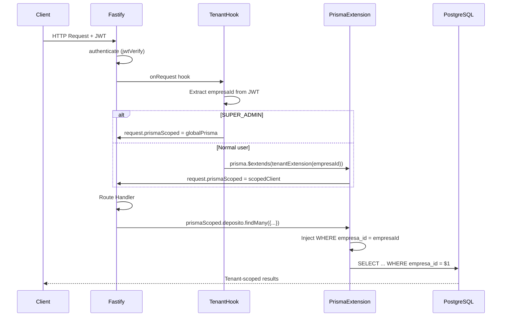
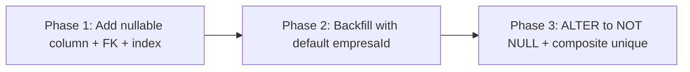
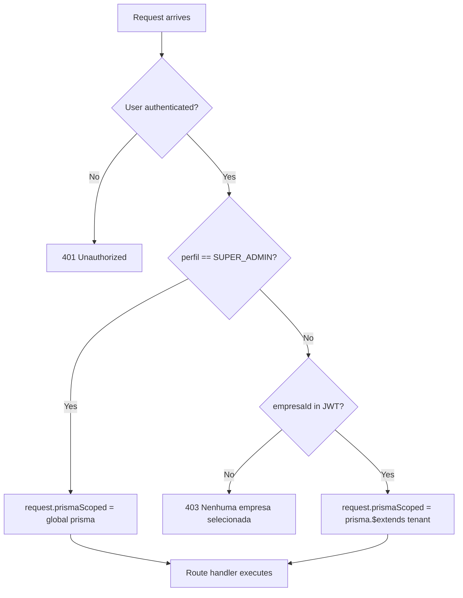

# Design Document: Multi-Tenant Isolation

## Overview

This design implements complete multi-tenant data isolation for the VisioFab WMS system. The approach uses **Prisma Client Extensions** to automatically inject tenant filtering on all database operations, eliminating the need for manual `empresaId` handling in route handlers.

The core idea: a tenant-scoped Prisma client is created per-request using the `empresaId` from the JWT token. This client transparently adds `WHERE empresa_id = ?` on reads and sets `empresa_id` on writes for all isolated tables. Route handlers continue using `prisma.model.findMany(...)` without changes — the extension handles isolation invisibly.

### Key Design Decisions

1. **Prisma Client Extensions over middleware**: Extensions provide compile-time type safety, operate at the query level (not raw SQL), and compose cleanly with existing Prisma usage. Middleware (the older `$use` API) is deprecated in Prisma 6.x.

2. **Per-request scoped client via Fastify decorator**: Rather than a global singleton, each request gets a `request.prismaScoped` client that carries the tenant context. This avoids race conditions in concurrent requests.

3. **Allowlist of isolated models**: The extension only applies filtering to models that have `empresaId`. Non-tenant tables (e.g., `Usuario`, `Empresa`, `UsuarioEmpresa`) are unaffected.

4. **SUPER_ADMIN bypass at client creation**: When the user has `SUPER_ADMIN` perfil, the request gets the unscoped global `prisma` instance instead of a filtered one.

## Architecture



### Migration Strategy (3-Phase)



## Components and Interfaces

### 1. Tenant Extension Factory (`src/lib/prisma-tenant.ts`)

Creates a Prisma Client Extension that intercepts all query operations on isolated models.

```typescript
import { Prisma, PrismaClient } from '@prisma/client'

// Models that have empresaId and require tenant filtering
const ISOLATED_MODELS: string[] = [
  'Produto', 'Fornecedor', 'Cliente', 'Transportadora', 'Vendedor',
  'PedidoCompra', 'PedidoVenda', 'ContaPagar', 'ContaReceber',
  'Nfe', 'Cte', 'Estoque', 'AgendaWms', 'ApiKey', 'WebhookConfig',
  'OndaSeparacao', 'Parametro', 'FichaOperacional', 'CentroDistribuicao',
  // Newly isolated:
  'Deposito', 'Zona', 'Estrutura', 'Endereco', 'Funcionario', 'Doca',
  'EquipamentoMovimentacao', 'Funcao', 'FormaArmazenagem',
  'AmbienteArmazenagem', 'ClassificacaoProduto', 'TipoCarroceria',
  'TipoCarga', 'VeiculoWms', 'NotaEntrada', 'SaldoEndereco',
  'DadosLogisticosArmazenagem', 'DadosLogisticosPicking',
  'DadosLogisticosExpedicao', 'Sku',
]

export function createTenantExtension(empresaId: string) {
  return Prisma.defineExtension({
    name: 'tenantIsolation',
    query: {
      $allOperations({ model, operation, args, query }) {
        if (!model || !ISOLATED_MODELS.includes(model)) {
          return query(args)
        }

        // Read operations: inject empresaId into where
        if (['findMany', 'findFirst', 'findUnique', 'findFirstOrThrow',
             'findUniqueOrThrow', 'count', 'aggregate', 'groupBy'].includes(operation)) {
          args.where = { ...args.where, empresaId }
          return query(args)
        }

        // Create operations: set empresaId
        if (operation === 'create') {
          args.data = { ...args.data, empresaId }
          return query(args)
        }

        if (operation === 'createMany') {
          if (Array.isArray(args.data)) {
            args.data = args.data.map((d: any) => ({ ...d, empresaId }))
          } else {
            args.data = { ...args.data, empresaId }
          }
          return query(args)
        }

        // Update operations: scope where + prevent empresaId change
        if (['update', 'updateMany'].includes(operation)) {
          args.where = { ...args.where, empresaId }
          return query(args)
        }

        // Delete operations: scope where
        if (['delete', 'deleteMany'].includes(operation)) {
          args.where = { ...args.where, empresaId }
          return query(args)
        }

        // Upsert: scope where + set empresaId on create
        if (operation === 'upsert') {
          args.where = { ...args.where, empresaId }
          args.create = { ...args.create, empresaId }
          return query(args)
        }

        return query(args)
      },
    },
  })
}
```

### 2. Tenant Context Hook (`src/middleware/tenant-context.ts`)

A Fastify `onRequest` hook that runs after `authenticate` and decorates the request with a scoped Prisma client.

```typescript
import { FastifyInstance, FastifyRequest, FastifyReply } from 'fastify'
import { prisma } from '../lib/prisma'
import { createTenantExtension } from '../lib/prisma-tenant'

export function registerTenantContext(app: FastifyInstance) {
  app.decorateRequest('prismaScoped', null)

  app.addHook('onRequest', async (request: FastifyRequest, reply: FastifyReply) => {
    // Skip for unauthenticated routes
    if (!request.user) return

    const user = request.user as { id: string; perfil: string; empresaId?: string }

    // SUPER_ADMIN bypass: use global unscoped client
    if (user.perfil === 'SUPER_ADMIN') {
      request.prismaScoped = prisma
      return
    }

    // Normal user must have empresaId
    if (!user.empresaId) {
      return reply.status(403).send({ message: 'Nenhuma empresa selecionada' })
    }

    // Create tenant-scoped client
    request.prismaScoped = prisma.$extends(createTenantExtension(user.empresaId))
  })
}
```

### 3. Fastify Type Augmentation (`src/types/fastify.d.ts`)

```typescript
import { PrismaClient } from '@prisma/client'

declare module 'fastify' {
  interface FastifyRequest {
    prismaScoped: PrismaClient
  }
}
```

### 4. Migration Files

#### Phase 1: Add nullable columns (`prisma/migrations/YYYYMMDD_add_empresa_id_wms_tables`)

```sql
-- Add empresa_id column (nullable initially)
ALTER TABLE deposito ADD COLUMN empresa_id UUID REFERENCES empresa(id);
ALTER TABLE zona ADD COLUMN empresa_id UUID REFERENCES empresa(id);
ALTER TABLE estrutura ADD COLUMN empresa_id UUID REFERENCES empresa(id);
ALTER TABLE endereco ADD COLUMN empresa_id UUID REFERENCES empresa(id);
ALTER TABLE funcionario ADD COLUMN empresa_id UUID REFERENCES empresa(id);
ALTER TABLE doca ADD COLUMN empresa_id UUID REFERENCES empresa(id);
ALTER TABLE equipamento_movimentacao ADD COLUMN empresa_id UUID REFERENCES empresa(id);
ALTER TABLE funcao ADD COLUMN empresa_id UUID REFERENCES empresa(id);
ALTER TABLE forma_armazenagem ADD COLUMN empresa_id UUID REFERENCES empresa(id);
ALTER TABLE ambiente_armazenagem ADD COLUMN empresa_id UUID REFERENCES empresa(id);
ALTER TABLE classificacao_produto ADD COLUMN empresa_id UUID REFERENCES empresa(id);
ALTER TABLE tipo_carroceria ADD COLUMN empresa_id UUID REFERENCES empresa(id);
ALTER TABLE tipo_carga ADD COLUMN empresa_id UUID REFERENCES empresa(id);
ALTER TABLE veiculo_wms ADD COLUMN empresa_id UUID REFERENCES empresa(id);
ALTER TABLE nota_entrada ADD COLUMN empresa_id UUID REFERENCES empresa(id);
ALTER TABLE saldo_endereco ADD COLUMN empresa_id UUID REFERENCES empresa(id);
ALTER TABLE dados_logisticos_armazenagem ADD COLUMN empresa_id UUID REFERENCES empresa(id);
ALTER TABLE dados_logisticos_picking ADD COLUMN empresa_id UUID REFERENCES empresa(id);
ALTER TABLE dados_logisticos_expedicao ADD COLUMN empresa_id UUID REFERENCES empresa(id);
ALTER TABLE sku ADD COLUMN empresa_id UUID REFERENCES empresa(id);

-- Create indexes for efficient tenant-scoped queries
CREATE INDEX idx_deposito_empresa ON deposito(empresa_id);
CREATE INDEX idx_zona_empresa ON zona(empresa_id);
CREATE INDEX idx_estrutura_empresa ON estrutura(empresa_id);
CREATE INDEX idx_endereco_empresa ON endereco(empresa_id);
CREATE INDEX idx_funcionario_empresa ON funcionario(empresa_id);
CREATE INDEX idx_doca_empresa ON doca(empresa_id);
CREATE INDEX idx_equipamento_movimentacao_empresa ON equipamento_movimentacao(empresa_id);
CREATE INDEX idx_funcao_empresa ON funcao(empresa_id);
CREATE INDEX idx_forma_armazenagem_empresa ON forma_armazenagem(empresa_id);
CREATE INDEX idx_ambiente_armazenagem_empresa ON ambiente_armazenagem(empresa_id);
CREATE INDEX idx_classificacao_produto_empresa ON classificacao_produto(empresa_id);
CREATE INDEX idx_tipo_carroceria_empresa ON tipo_carroceria(empresa_id);
CREATE INDEX idx_tipo_carga_empresa ON tipo_carga(empresa_id);
CREATE INDEX idx_veiculo_wms_empresa ON veiculo_wms(empresa_id);
CREATE INDEX idx_nota_entrada_empresa ON nota_entrada(empresa_id);
CREATE INDEX idx_saldo_endereco_empresa ON saldo_endereco(empresa_id);
CREATE INDEX idx_dados_logisticos_arm_empresa ON dados_logisticos_armazenagem(empresa_id);
CREATE INDEX idx_dados_logisticos_pick_empresa ON dados_logisticos_picking(empresa_id);
CREATE INDEX idx_dados_logisticos_exp_empresa ON dados_logisticos_expedicao(empresa_id);
CREATE INDEX idx_sku_empresa ON sku(empresa_id);
```

#### Phase 2: Backfill Script (`prisma/backfill-empresa-id.ts`)

```typescript
import { prisma } from '../src/lib/prisma'

async function backfill() {
  // Get the default empresa (first one or configured via env)
  const defaultEmpresaId = process.env.DEFAULT_EMPRESA_ID
    || (await prisma.empresa.findFirst({ select: { id: true } }))?.id

  if (!defaultEmpresaId) throw new Error('No empresa found for backfill')

  const tables = [
    'deposito', 'zona', 'estrutura', 'endereco', 'funcionario',
    'doca', 'equipamento_movimentacao', 'funcao', 'forma_armazenagem',
    'ambiente_armazenagem', 'classificacao_produto', 'tipo_carroceria',
    'tipo_carga', 'veiculo_wms', 'nota_entrada', 'saldo_endereco',
    'dados_logisticos_armazenagem', 'dados_logisticos_picking',
    'dados_logisticos_expedicao', 'sku',
  ]

  for (const table of tables) {
    const result = await prisma.$executeRawUnsafe(
      `UPDATE ${table} SET empresa_id = $1 WHERE empresa_id IS NULL`,
      defaultEmpresaId
    )
    console.log(`${table}: ${result} records updated`)
  }
}

backfill()
```

#### Phase 3: Set NOT NULL + Composite Unique Constraints

```sql
-- Set NOT NULL after backfill
ALTER TABLE deposito ALTER COLUMN empresa_id SET NOT NULL;
ALTER TABLE zona ALTER COLUMN empresa_id SET NOT NULL;
-- ... (all tables)

-- Composite unique constraints for business keys
ALTER TABLE funcionario ADD CONSTRAINT uq_funcionario_empresa_matricula
  UNIQUE (empresa_id, matricula);
ALTER TABLE veiculo_wms ADD CONSTRAINT uq_veiculo_empresa_placa
  UNIQUE (empresa_id, placa);
ALTER TABLE nota_entrada ADD CONSTRAINT uq_nota_entrada_empresa_numero
  UNIQUE (empresa_id, numero);
```

### 5. Route Handler Migration Pattern

Existing route handlers change minimally — replace `prisma` with `request.prismaScoped`:

```typescript
// Before:
const data = await prisma.deposito.findMany({ where })

// After:
const data = await request.prismaScoped.deposito.findMany({ where })
```

No `empresaId` filtering code is needed in handlers. The extension handles it.

## Data Models

### Affected Models (New `empresaId` field)

| Model | Table | Business Key (Composite Unique) |
|-------|-------|-------------------------------|
| Deposito | deposito | — |
| Zona | zona | — |
| Estrutura | estrutura | — |
| Endereco | endereco | — |
| Funcionario | funcionario | (empresa_id, matricula) |
| Doca | doca | — |
| EquipamentoMovimentacao | equipamento_movimentacao | — |
| Funcao | funcao | — |
| FormaArmazenagem | forma_armazenagem | — |
| AmbienteArmazenagem | ambiente_armazenagem | — |
| ClassificacaoProduto | classificacao_produto | — |
| TipoCarroceria | tipo_carroceria | — |
| TipoCarga | tipo_carga | — |
| VeiculoWms | veiculo_wms | (empresa_id, placa) |
| NotaEntrada | nota_entrada | (empresa_id, numero) |
| SaldoEndereco | saldo_endereco | — |
| DadosLogisticosArmazenagem | dados_logisticos_armazenagem | — |
| DadosLogisticosPicking | dados_logisticos_picking | — |
| DadosLogisticosExpedicao | dados_logisticos_expedicao | — |
| Sku | sku | — |

### Prisma Schema Addition Pattern

Each affected model receives:

```prisma
model Deposito {
  // ... existing fields ...
  empresaId   String   @map("empresa_id")
  empresa     Empresa  @relation(fields: [empresaId], references: [id])
  // ...
}
```

The `Empresa` model receives corresponding relation arrays:

```prisma
model Empresa {
  // ... existing relations ...
  depositos               Deposito[]
  zonas                   Zona[]
  estruturas              Estrutura[]
  enderecos               Endereco[]
  funcionarios            Funcionario[]
  docas                   Doca[]
  equipamentos            EquipamentoMovimentacao[]
  funcoes                 Funcao[]
  formasArmazenagem       FormaArmazenagem[]
  ambientesArmazenagem    AmbienteArmazenagem[]
  classificacoesProduto   ClassificacaoProduto[]
  tiposCarroceria         TipoCarroceria[]
  tiposCarga              TipoCarga[]
  veiculosWms             VeiculoWms[]
  notasEntrada            NotaEntrada[]
  saldosEndereco          SaldoEndereco[]
  dadosLogisticosArm      DadosLogisticosArmazenagem[]
  dadosLogisticosPick     DadosLogisticosPicking[]
  dadosLogisticosExp      DadosLogisticosExpedicao[]
  skus                    Sku[]
}
```

### SUPER_ADMIN Flow



## Correctness Properties

*A property is a characteristic or behavior that should hold true across all valid executions of a system — essentially, a formal statement about what the system should do. Properties serve as the bridge between human-readable specifications and machine-verifiable correctness guarantees.*

### Property 1: Read operations inject empresaId non-destructively

*For any* read operation (`findMany`, `findFirst`, `findUnique`, `count`) on any isolated model, and *for any* existing `where` clause provided by the caller, the tenant extension SHALL produce a final `where` clause that contains `empresaId` equal to the tenant context value AND preserves all original conditions from the caller's `where` clause.

**Validates: Requirements 4.1, 4.2, 4.3**

### Property 2: Create operations set empresaId

*For any* `create` or `createMany` operation on any isolated model, and *for any* valid `data` payload, the tenant extension SHALL produce a final `data` object that includes `empresaId` set to the tenant context value.

**Validates: Requirements 5.1**

### Property 3: Mismatched empresaId on create is rejected

*For any* `create` operation on any isolated model where the `data` payload contains an `empresaId` value different from the tenant context value, and the user is not SUPER_ADMIN, the tenant extension SHALL reject the operation with a tenant mismatch error.

**Validates: Requirements 5.2**

### Property 4: Upsert applies empresaId to both where and create

*For any* `upsert` operation on any isolated model, the tenant extension SHALL inject `empresaId` into the `where` clause AND set `empresaId` on the `create` data, both using the tenant context value.

**Validates: Requirements 5.3**

### Property 5: Mutation operations scope by empresaId

*For any* `update`, `updateMany`, `delete`, or `deleteMany` operation on any isolated model, and *for any* existing `where` clause, the tenant extension SHALL produce a final `where` clause that contains `empresaId` equal to the tenant context value.

**Validates: Requirements 6.1, 6.2**

### Property 6: SUPER_ADMIN bypasses tenant filtering

*For any* database operation (read or write) on any isolated model, when the authenticated user has `SUPER_ADMIN` perfil, the operation SHALL execute without any automatic `empresaId` injection or filtering.

**Validates: Requirements 7.1, 7.2**

### Property 7: Non-isolated models are unaffected

*For any* database operation on a model NOT in the `ISOLATED_MODELS` list, the tenant extension SHALL pass the operation through without modifying the `where` clause or `data` payload.

**Validates: Requirements 4.1 (inverse — ensures no over-filtering)**

### Property 8: Nested creates propagate empresaId

*For any* `create` operation on an isolated model that includes nested `create` operations on child isolated models, the tenant extension SHALL set `empresaId` on all nested child records to the same tenant context value.

**Validates: Requirements 10.1**

### Property 9: Tenant context rejection for missing empresaId

*For any* authenticated request where the JWT payload does not contain an `empresaId` claim and the user's perfil is not `SUPER_ADMIN`, the tenant context hook SHALL reject the request with HTTP 403.

**Validates: Requirements 3.2**

## Error Handling

### Error Categories

| Error | HTTP Status | Message | Trigger |
|-------|-------------|---------|---------|
| Missing tenant context | 403 | `Nenhuma empresa selecionada` | Non-SUPER_ADMIN user without empresaId in JWT |
| Tenant mismatch on create | 400 | `Conflito de tenant: empresaId informado difere do contexto` | Create with explicit empresaId ≠ context |
| Cross-tenant relation | 400 | `Violação de isolamento: referência a registro de outro tenant` | Child references parent from different tenant |
| Record not found (scoped) | 404 | `Registro não encontrado` | Update/delete targets record from another tenant (filtered out by where) |

### Error Handling Strategy

1. **Fail-closed**: If the tenant context cannot be established (no empresaId, no SUPER_ADMIN), the request is rejected before reaching the route handler. No data leaks.

2. **Silent scoping on mutations**: When an update/delete targets a record from another tenant, the `WHERE` clause simply won't match. Prisma throws `RecordNotFound` which the route handler already handles as 404. No special error path needed.

3. **Explicit rejection on create mismatch**: If a create payload explicitly sets a different `empresaId`, this is likely a bug or attack. The extension throws a descriptive error before the query reaches the database.

4. **FK constraint as safety net**: Even if the extension has a bug, the FK constraint on `empresa_id → empresa.id` prevents orphaned records. The NOT NULL constraint prevents records without tenant assignment.

### Graceful Degradation

- If the Prisma extension fails to load, the `registerTenantContext` hook will throw during startup, preventing the server from starting in an insecure state.
- The `ISOLATED_MODELS` list is the single source of truth. Adding a new model to the list is all that's needed to enable isolation for it.

## Testing Strategy

### Property-Based Tests (Vitest + fast-check)

The tenant extension is a pure function that transforms query arguments — ideal for property-based testing. Each property test generates random:
- Model names from `ISOLATED_MODELS`
- Operation types (findMany, create, update, delete, upsert)
- `where` clauses with random conditions
- `data` payloads with random fields
- `empresaId` values (UUIDs)

**Library**: `fast-check` with `vitest`
**Minimum iterations**: 100 per property

Each test is tagged with:
```
// Feature: multi-tenant-isolation, Property N: <property text>
```

### Unit Tests (Example-Based)

- SUPER_ADMIN with explicit empresaId parameter scopes correctly (Req 7.3)
- Backfill script reports correct counts (Req 8.3)
- Empty table is skipped during backfill (Req 8.4)
- Tenant context hook extracts empresaId from various JWT shapes

### Integration Tests

- Full request lifecycle: authenticate → tenant context → scoped query → response contains only tenant data
- Cross-tenant isolation: create data as tenant A, query as tenant B, verify empty result
- Backfill script on real database with test data (Req 8.1, 8.2)
- Update/delete on record from another tenant returns 404 (Req 6.3)

### Smoke Tests (Post-Migration)

- Verify `empresa_id` column exists on all affected tables (Req 1.1)
- Verify FK constraints exist (Req 1.2)
- Verify indexes exist (Req 1.3)
- Verify NOT NULL constraint after backfill (Req 1.5)
- Verify composite unique constraints (Req 9.1, 9.2)
- Verify Prisma schema generates without errors (Req 2.1, 2.2)

