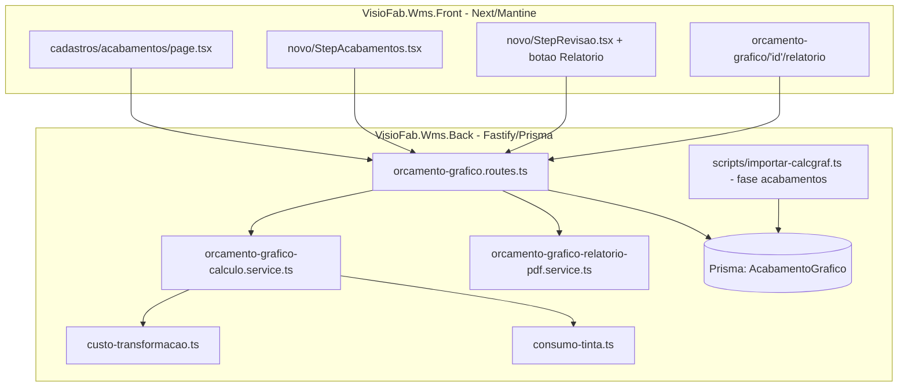
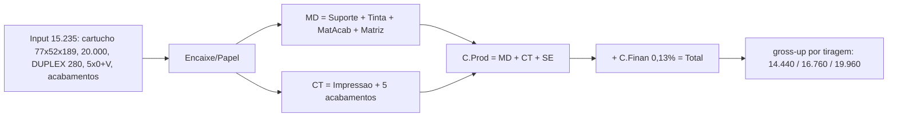

# Design — Módulo de Acabamentos (paridade de relatório com o Calcgraf)

## Overview

Esta feature fecha a lacuna que impede o Vizor de reproduzir, componente a
componente, o pré-cálculo do Calcgraf para trabalhos com acabamentos — e de
emitir um relatório idêntico ao do sistema legado. O caso de referência é o
golden 15.235 (#[[file:docs/calcgraf-golden-15235-acabamentos.md]]).

É uma camada **aditiva** sobre o motor já calibrado
(`orcamento-grafico-calculo.service.ts`): não altera papel, tinta, impressão nem
a formação de preço (todos congelados). Acrescenta:

1. Um **cadastro de acabamentos** multi-tenant (`AcabamentoGrafico`) que
   substitui a lista fixa de 5 itens do wizard.
2. A **importação** das 60+ Atividades do Calcgraf para esse cadastro.
3. O cálculo do bloco **MAT.ACABAMENTO** com três naturezas (kg, un, custo fixo)
   somando no **MD**.
4. A **cadeia de centros de acabamento** no **CT**, reusando
   `calcularCustoTransformacao` (que já aceita uma lista de atividades).
5. Um **relatório** (tela + PDF) no layout do pré-cálculo.
6. Um **teste golden** congelando o 15.235 (≤0,5%).

## Architecture

Repos SEPARADOS (schema/motor/importador/relatório-dados no back; cadastro/
wizard/relatório-UI no front).



## Components and Interfaces

### Backend

| Arquivo | Papel | Mudança |
|---|---|---|
| `prisma/schema.prisma` | Model `AcabamentoGrafico` | NOVO (model + enums) |
| `prisma/migrate-prod.ts` | CREATE TABLE idempotente | NOVO bloco |
| `src/modules/orcamento-grafico/orcamento-grafico.routes.ts` | CRUD `/acabamentos`; `/calcular` lê acabamentos ricos; `GET /:id/relatorio`; `GET /:id/relatorio.pdf` | Estender |
| `src/modules/orcamento-grafico/orcamento-grafico-calculo.service.ts` | MAT.ACABAMENTO (kg/un/fixo) no MD + cadeia de centros no CT | Estender (aditivo) |
| `src/modules/orcamento-grafico/custo-transformacao.ts` | Já aceita lista de `AtividadeCT` | REUSAR (sem mudança) |
| `src/modules/orcamento-grafico/orcamento-grafico-relatorio-pdf.service.ts` | Gera PDF no layout Calcgraf (pdfkit) | NOVO |
| `scripts/importar-calcgraf.ts` | Fase `acabamentos` | NOVO |
| `src/modules/orcamento-grafico/calibracao/golden-acabamentos-15235.{fixture,test}.ts` | Teste golden ≤0,5% | NOVO |

### Frontend

| Arquivo | Papel | Mudança |
|---|---|---|
| `src/app/(interna)/orcamento-grafico/cadastros/acabamentos/page.tsx` | CRUD do cadastro | NOVO |
| `src/components/.../ModuleSidebar` (orçamento gráfico) | Item "Acabamentos" | Estender |
| `src/app/(interna)/orcamento-grafico/novo/StepAcabamentos.tsx` | Ler do cadastro (remove lista fixa de 5) | Reescrever origem dos dados |
| `src/app/(interna)/orcamento-grafico/novo/StepRevisao.tsx` | Botão "Relatório/PDF" | Estender |
| `src/app/(interna)/orcamento-grafico/[id]/relatorio/page.tsx` (ou modal) | Visualização do relatório | NOVO |

## Data Models

### Prisma (`schema.prisma`)

```prisma
enum AcabTipoAtividade { IMPRESSAO ACABAMENTO }
enum AcabPlanoProduto  { PLANO PRODUTO }
enum AcabNaturezaCusto { HORA_MAQUINA MATERIAL_KG MATERIAL_UN CUSTO_FIXO }

model AcabamentoGrafico {
  id                 String   @id @default(uuid())
  empresaId          String   @map("empresa_id")
  codigo             String   // ex.: CG-ACAB-8
  nome               String
  tipoAtividade      AcabTipoAtividade @default(ACABAMENTO) @map("tipo_atividade")
  planoProduto       AcabPlanoProduto  @default(PLANO)      @map("plano_produto")
  naturezaCusto      AcabNaturezaCusto @default(HORA_MAQUINA) @map("natureza_custo")

  // Vínculo p/ hora-máquina (CT). Opcional (materiais/fixos não têm centro).
  centroProducaoId   String?  @map("centro_producao_id")

  // Parâmetros de custo (todos opcionais — calibrados na tela):
  precoUnitario      Decimal? @map("preco_unitario")   @db.Decimal(14,4) // kg/un
  custoHora          Decimal? @map("custo_hora")        @db.Decimal(14,4)
  producaoHora       Decimal? @map("producao_hora")     @db.Decimal(14,2)
  quantAcertos       Int?     @map("quant_acertos")
  tempoPorAcertoMin  Decimal? @map("tempo_por_acerto_min") @db.Decimal(10,2)
  tempoPrimeiroAcertoMin Decimal? @map("tempo_primeiro_acerto_min") @db.Decimal(10,2)
  /** FOLHA (processa folhasBrutas) | PRODUTO (processa a tiragem). */
  unidadeBase        String?  @map("unidade_base") @db.VarChar(10)

  status             Boolean  @default(true)
  criadoEm           DateTime @default(now()) @map("criado_em")
  atualizadoEm       DateTime @updatedAt @map("atualizado_em")

  centroProducao     CentroProducao? @relation(fields: [centroProducaoId], references: [id])

  @@unique([empresaId, codigo])
  @@index([empresaId, status])
  @@map("acabamento_grafico")
}
```
(adicionar o relation reverso em `CentroProducao`: `acabamentos AcabamentoGrafico[]`).

### `migrate-prod.ts` (idempotente)

```ts
await prisma.$executeRawUnsafe(`
  CREATE TABLE IF NOT EXISTS "acabamento_grafico" (
    "id" TEXT NOT NULL,
    "empresa_id" TEXT NOT NULL,
    "codigo" VARCHAR(40) NOT NULL,
    "nome" VARCHAR(200) NOT NULL,
    "tipo_atividade" VARCHAR(20) NOT NULL DEFAULT 'ACABAMENTO',
    "plano_produto" VARCHAR(10) NOT NULL DEFAULT 'PLANO',
    "natureza_custo" VARCHAR(20) NOT NULL DEFAULT 'HORA_MAQUINA',
    "centro_producao_id" TEXT,
    "preco_unitario" DECIMAL(14,4),
    "custo_hora" DECIMAL(14,4),
    "producao_hora" DECIMAL(14,2),
    "quant_acertos" INTEGER,
    "tempo_por_acerto_min" DECIMAL(10,2),
    "tempo_primeiro_acerto_min" DECIMAL(10,2),
    "unidade_base" VARCHAR(10),
    "status" BOOLEAN NOT NULL DEFAULT true,
    "criado_em" TIMESTAMP(3) NOT NULL DEFAULT CURRENT_TIMESTAMP,
    "atualizado_em" TIMESTAMP(3) NOT NULL DEFAULT CURRENT_TIMESTAMP,
    CONSTRAINT "acabamento_grafico_pkey" PRIMARY KEY ("id")
  )`)
await prisma.$executeRawUnsafe(`CREATE UNIQUE INDEX IF NOT EXISTS "acabamento_grafico_empresa_id_codigo_key" ON "acabamento_grafico"("empresa_id","codigo")`)
await prisma.$executeRawUnsafe(`CREATE INDEX IF NOT EXISTS "idx_acabamento_grafico_empresa_status" ON "acabamento_grafico"("empresa_id","status")`)
```
Enums gravados como VARCHAR (evita CREATE TYPE não-idempotente), consistente com o padrão do projeto.

## Extensão do Motor (aditiva)

### Entrada — `ParamsOrcamento.acabamentos` enriquecido

O campo `acabamentos` atual (`{tipo, custoHora, velocidade, setupMinutos,
custoMaterialM2?, custoMaterialUn?}`) é mantido para compatibilidade, mas passa
a aceitar itens ricos com `naturezaCusto`:

```ts
type ItemAcabamento =
  | { naturezaCusto: 'HORA_MAQUINA'; nome: string; custoHora: number
      producaoHora: number; unidadeBase: 'FOLHA' | 'PRODUTO'
      quantAcertos?: number; tempoPorAcertoMin?: number; tempoPrimeiroAcertoMin?: number
      ocorrencias?: number }
  | { naturezaCusto: 'MATERIAL_KG'; nome: string; variavelKg: number; precoKg: number }
  | { naturezaCusto: 'MATERIAL_UN'; nome: string; variavelUn: number; precoUn: number }
  | { naturezaCusto: 'CUSTO_FIXO';  nome: string; valorFixo: number }
```

Regra de compatibilidade: itens sem `naturezaCusto` seguem o caminho LEGADO
(`calcularAcabamentos` atual) — garante não-regressão (Req 3.6, 5.7).

### Saída — `ResultadoOrcamento` separa MAT.ACABAMENTO (MD) de CADEIA (CT)

```ts
matAcabamento: {              // entra no Material Direto
  custoTotal: number
  itens: Array<{ nome: string; natureza: string; fixo: number; variavel: number
                 unitario: number; subtotal: number }>
}
acabamentosCentros: {         // entra no Custo de Transformação
  custoTotal: number
  detalhePorEtapa: Array<{ etapa: string; setupMin: number; operacaoMin: number; custo: number }>
}
```

### Como cada bloco entra no custo

- **MAT.ACABAMENTO → MD**: `materialDireto += matAcabamento.custoTotal`.
  - `MATERIAL_KG`: subtotal = `variavelKg × precoKg`.
  - `MATERIAL_UN`: subtotal = `variavelUn × precoUn`.
  - `CUSTO_FIXO`: subtotal = `valorFixo` (não escala com tiragem).
- **CADEIA DE CENTROS → CT**: para cada acabamento `HORA_MAQUINA`, monta uma
  `AtividadeCT` (`impressao:false`, `custoHora`, `producaoHora`,
  `unidadesProcessadas` = `folhasBrutas` se `unidadeBase=FOLHA` senão
  `quantidade`, `quantAcertos`, `tempoPorAcertoMin`, `tempoPrimeiroAcertoMin`) e
  passa a lista `[impressao, ...acabamentos]` para `calcularCustoTransformacao`.
  Assim `custoTransformacao = impressao + Σ acabamentos` num cálculo único,
  reusando o módulo já calibrado.

O `calcularCustoTransformacao` **já aceita** a lista de atividades mista — não
muda. A integração nova é só montar as `AtividadeCT` dos acabamentos a partir do
cadastro e concatenar com a de impressão.

## Fluxo de cálculo — como o 15.235 bate



Mapeamento linha-a-linha (alvo do golden):

| Bloco | Composição no motor | Alvo |
|---|---|---|
| Suporte | `calcularPapel` (DUPLEX 280, 605×620, 5.000 folhas) | 4.358,66 |
| Tinta | SPANKS: Escala 137,05 + Metálica 303,60 | 440,65 |
| Matriz Impressão | item (entra no MD) KBA 5 PC × 35,2 | 176,00 |
| MAT.ACABAMENTO | Cola KG 1,14×29,15=33,23 + FACA FIXO 1.300 + Verniz KG 5,63×24,2=136,16 + Caixa UN 20×7,7=154 | 1.623,39 |
| **MD** | 4.358,66+440,65+176,00+1.623,39 | **6.598,70** |
| Impressão (CT) | acerto 02:15 + prod 01:05 × 480 | 1.600,00 |
| Acabamentos (CT) | Cortadeira 145,29 + Guilhotina 97,11 + Bobst E 1.050 + Destacar 25 + AFT70 897,40 | 2.214,80 |
| **CT** | 1.600,00 + 2.214,80 | **3.814,80** |
| **C.Prod** | MD + CT + SE(0) | **10.413,50** |
| C.Finan 0,13% | 10.413,50 × 0,0013 | 13,54 |
| **Total** | | **10.427,04** |
| Preço (markup 30,01%) | gross-up `/(1−0,3001−0,1775)` | **19.960,00** |

Observação de calibração: os tempos fixo/variável de cada centro de acabamento
(ex. Cortadeira 00:15 acerto + 01:02 produção × R$ 113,21/h) vêm do cadastro
(`AcabamentoGrafico` / `CentroProducao`). A rotina de calibração ajusta
`quantAcertos`/`tempoPorAcertoMin`/`producaoHora`/`custoHora` até cada subtotal
cair ≤0,5% do golden. A Matriz Impressão (176,00) entra no MD como item fixo de
material (não é hora-máquina).

## Importador — fase `acabamentos`

Nova função `importarAcabamentos(empresaId)` em `scripts/importar-calcgraf.ts`,
no padrão de `importarTiposEmbalagem` (idempotente, `--dry-run`, de-para por
código, atualiza metadados sem sobrescrever ajuste manual):

- Lê `cartoon/export/Atividades.json`; importa `Ativo ∈ {ATIVO, FIXO}`
  (CANCELADO fora). `FIXO` = os 7 processos de impressão base → `tipoAtividade=IMPRESSAO`.
- `codigo = CG-ACAB-<Codigo>`; de-para por `(empresaId, codigo)`.
- `tipoAtividade` por `TipoAtividade` (Impressão→IMPRESSAO, senão ACABAMENTO);
  `planoProduto` por `PlanoProduto` (PLANO/PRODUTO).
- `naturezaCusto` default heurístico por nome (semeadura; calibração ajusta):
  - contém "caixa" → `MATERIAL_UN`
  - contém "verniz"/"cola"/"laminaç" + unidade de material → `MATERIAL_KG`
  - "faca"/"matriz" → `CUSTO_FIXO`
  - demais (cortadeira, guilhotina, bobst, coladeira, destacar, plastific.,
    hotstamping, acoplagem, impressão) → `HORA_MAQUINA`
- Existente → atualiza só `nome/tipoAtividade/planoProduto/status`; **nunca**
  sobrescreve `centroProducaoId`/custos (ajuste manual preservado).
- Conta criados/atualizados/intactos; `--dry-run` só relata.

## Relatório / PDF

- **Dados**: `GET /orcamento-grafico/:id/relatorio` monta a estrutura completa
  de seções a partir do resultado do cálculo (reusa `calcularOrcamentoGrafico` +
  simulação de 3 tiragens). Estrutura espelha o golden: `cabecalho`, `plano`,
  `suporte`, `matrizImpressao`, `tinta`, `matAcabamento`, `impressao`,
  `acabamento`, `custoProducao`, `cev`, `margens[]`.
- **PDF**: `orcamento-grafico-relatorio-pdf.service.ts` com **pdfkit** (mesma lib
  de `cte-dacte-pdf.service.ts`), layout fiel ao pré-cálculo. Rota
  `GET /orcamento-grafico/:id/relatorio.pdf` (aceita token via query p/ abrir em
  nova aba, padrão já usado em `/op-pdf/:opId`).
- **Front**: botão "Relatório / PDF" no `StepRevisao` e no detalhe do orçamento;
  tela/modal de visualização reproduzindo as seções.

## Testing Strategy

- `calibracao/golden-acabamentos-15235.fixture.ts`: input anonimizável do 15.235
  + valores-alvo (subtotais, agregados, 3 margens).
- `calibracao/golden-acabamentos-15235.test.ts` (vitest): assert ≤0,5% por
  componente (Suporte, Matriz, Tinta, MatAcab, Impressão, cada acabamento),
  agregados (MD 6.598,70; CT 3.814,80; C.Prod 10.413,50; Total 10.427,04) e as 3
  margens (14.440 / 16.760 / 19.960). Falha bloqueia a suíte (Req 6.5).
- Não-regressão: suíte `orcamento-grafico` continua verde (91/91 atuais).
- Teste unitário do importador: natureza default por nome + idempotência
  (reusa padrão de `scripts/calcgraf-dedup.test.ts` se extrair função pura).
- Validação por `get_diagnostics` + `npx vitest run src/modules/orcamento-grafico`
  (build/tsc completos travam na máquina).

## Correctness Properties

Propriedades que devem valer sempre (candidatas a property-based/golden):

### Property 1: Não-regressão (aditividade)
Um orçamento SEM itens de acabamento ricos (ou com `naturezaCusto` ausente)
produz exatamente o mesmo resultado de hoje para papel, tinta, impressão,
MD/CT/preço.
**Validates: Requirements 3.6, 5.7**

### Property 2: Custo fixo não escala
Um item `CUSTO_FIXO` tem o mesmo subtotal para qualquer tiragem; só os
componentes variáveis mudam entre as 3 tiragens.
**Validates: Requirements 3.3**

### Property 3: Composição exata
`MD = suporte + tinta + matAcabamento + matriz`; `CT = impressao + Σ
acabamentosCentros`; `C.Prod = MD + CT + SE`; `Total = C.Prod × (1 + encFin%)`.
**Validates: Requirements 3.4, 4.2, 4.5, 5.5**

### Property 4: Determinismo do de-para
A chave `CG-ACAB-<Codigo>` é determinística por atividade → importador
idempotente (2ª execução = 0 criados).
**Validates: Requirements 2.3, 2.5**

### Property 5: Multi-tenant
Toda query de `AcabamentoGrafico` filtra `empresaId`; dois tenants nunca veem o
cadastro um do outro.
**Validates: Requirements 1.2**

## Error Handling

- **Cadastro**: código duplicado por empresa → HTTP 409; registro inexistente →
  404; validação Zod → 400 com mensagem de campo. Soft-delete por `status`.
- **Cálculo**: item de acabamento com `naturezaCusto` desconhecido → erro de
  validação (400) antes de calcular; `HORA_MAQUINA` sem `custoHora/producaoHora`
  → 400 (não calcular com NaN). Divisão por zero em `producaoHora` já tratada no
  CT (retorna 0).
- **Importador**: arquivo ausente/JSON inválido → encerra com mensagem e sem
  gravar (Req 2.7); erro de conexão (pooler Neon) → `comRetry` já existente.
- **Relatório/PDF**: orçamento inexistente → 404; falha na geração do PDF →
  500 com log, sem corromper a resposta JSON do `/relatorio`.
- **Migração**: `migrate-prod` idempotente; 2ª execução não falha nem duplica.

## Decisões e trade-offs

1. **Reusar `calcularCustoTransformacao`** em vez de criar novo cálculo de
   acabamento: o módulo já é calibrado e aceita lista mista — menor risco, uma
   fonte de verdade para o CT.
2. **Enums como VARCHAR no banco** (migrate-prod idempotente sem `CREATE TYPE`),
   consistente com o resto do projeto.
3. **Importador só semeia** natureza/custos; a calibração fina é feita na tela —
   o Calcgraf não exporta os parâmetros de tempo/custo-hora por atividade.
4. **Matriz Impressão no MD** (não no CT): segue o golden (entra em Material
   Direto como item fixo de material, PC × unitário).
5. **Aditivo com fallback**: itens sem `naturezaCusto` usam o caminho legado →
   zero regressão nos cálculos congelados.

## Mapa Requisito → Design

| Req | Onde é atendido |
|---|---|
| 1 Cadastro | model `AcabamentoGrafico` + CRUD `/acabamentos` + migrate-prod |
| 2 Importação | fase `acabamentos` em `importar-calcgraf.ts` |
| 3 Materiais kg/un/fixo | `ItemAcabamento` + MAT.ACABAMENTO no MD |
| 4 Cadeia de centros | `AtividadeCT[]` → `calcularCustoTransformacao` |
| 5 Relatório | `GET /:id/relatorio` + PDF pdfkit + UI |
| 6 Calibração golden | `golden-acabamentos-15235.{fixture,test}.ts` |
| 7 Wizard do cadastro | `StepAcabamentos.tsx` lê `/acabamentos` (remove lista fixa) |
