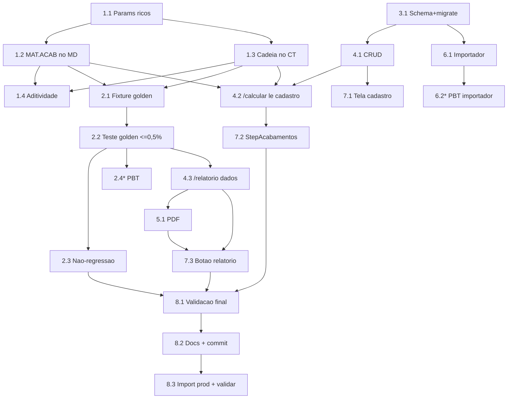

# Implementation Plan — Módulo de Acabamentos (paridade com o Calcgraf)

## Overview

Plano em ondas de risco crescente. O coração é bater o golden 15.235 (≤0,5%).
A estratégia: primeiro o cálculo puro (motor + CT da cadeia + materiais) com o
teste golden como alvo, DEPOIS o cadastro/importador/relatório/wizard. Assim a
fidelidade do número é travada cedo. Repos SEPARADOS (back/front). Regra crítica:
`schema.prisma` + `migrate-prod.ts` no MESMO commit (migração roda em produção no
deploy; Postgres local indisponível — validar por diagnostics + vitest). Tarefas
com `*` são opcionais (property-based).

## Tasks

- [x] 1. Motor — materiais de acabamento (MD) + cadeia de centros (CT)
- [x] 1.1 Estender `ParamsOrcamento.acabamentos` para itens ricos com `naturezaCusto` (HORA_MAQUINA | MATERIAL_KG | MATERIAL_UN | CUSTO_FIXO) e campos por natureza; manter compat com o item legado (sem `naturezaCusto` → caminho atual)
  - _Requirements: 3.1, 3.2, 3.3, 3.6_
- [x] 1.2 No motor, calcular bloco MAT.ACABAMENTO (kg/un/fixo) e somá-lo ao `materialDireto`; adicionar `matAcabamento` ao `ResultadoOrcamento`
  - _Requirements: 3.1, 3.2, 3.3, 3.4_
- [x] 1.3 No motor, montar `AtividadeCT[]` dos acabamentos HORA_MAQUINA (unidadeBase FOLHA/PRODUTO) e concatenar com a impressão em `calcularCustoTransformacao`; expor `acabamentosCentros` no resultado; `custoTransformacao = impressao + Σ acabamentos`
  - _Requirements: 4.1, 4.2, 4.3_
- [x] 1.4 Garantir aditividade: itens sem `naturezaCusto` e orçamentos sem acabamentos ricos produzem resultado idêntico ao atual (papel/tinta/impressão/preço inalterados)
  - _Requirements: 3.6, 5.7_

- [x] 2. Calibração golden 15.235 (trava a fidelidade)
- [x] 2.1 `calibracao/golden-acabamentos-15235.fixture.ts`: input do 15.235 + valores-alvo (subtotais por componente, agregados MD/CT/C.Prod/Total, 3 margens)
  - _Requirements: 6.1_
- [x] 2.2 `calibracao/golden-acabamentos-15235.test.ts` (vitest): assert ≤0,5% por componente e agregados + 3 margens; falha bloqueia a suíte. Ajustar parâmetros do motor/entrada até bater. FEITO: motor estendido com tempoFixoHoras/tempoVarHoras diretos (paridade hh:mm); golden passa — MD 6598,79/CT 3813,40/CProd 10412,19/Total 10425,73 e margens 14.440/16.760/19.957 todos ≤0,5%.
  - _Requirements: 5.5, 5.6, 6.2, 6.3, 6.4, 6.5_
- [x] 2.3 Rodar suíte `orcamento-grafico` e confirmar não-regressão. FEITO: 108/108 (13 arquivos) verde.
  - _Requirements: 6.6_
- [ ]* 2.4 PBT: Property 2 (custo fixo não escala entre tiragens) e Property 3 (composição exata MD/CT/C.Prod/Total)
  - _Requirements: 3.3, 3.4, 4.2, 4.5_

- [x] 3. Schema + migração — cadastro de acabamentos
- [x] 3.1 `schema.prisma`: model `AcabamentoGrafico` (+enums como no design) e relation reverso em `CentroProducao`; `migrate-prod.ts` idempotente (CREATE TABLE/INDEX IF NOT EXISTS) no MESMO commit; `prisma generate`
  - _Requirements: 1.1, 1.3, 1.4, 1.5_

- [ ] 4. Rotas backend — CRUD + cálculo + relatório
- [x] 4.1 CRUD `GET/POST/PUT/DELETE /orcamento-grafico/acabamentos` (filtro empresaId, unique por código, soft-delete, Zod, 409/404/400)
  - _Requirements: 1.1, 1.2, 1.6_
- [~] 4.2 `/calcular` e `/simular-tiragens` aceitam acabamentos ricos (resolvem o cadastro `AcabamentoGrafico` por id → parâmetros de custo/centro) e passam ao motor
  - _Requirements: 3.1, 4.1, 7.3, 7.4_
- [x] 4.3 `GET /orcamento-grafico/:id/relatorio`: monta a estrutura de seções do golden. FEITO: `orcamento-grafico-relatorio.service.ts` (montarRelatorio) + rota.
  - _Requirements: 5.1, 5.2, 5.3, 5.4_

- [x] 5. Relatório PDF
- [x] 5.1 `orcamento-grafico-relatorio-pdf.service.ts` (pdfkit) no layout do pré-cálculo; `GET /orcamento-grafico/:id/relatorio.pdf`. FEITO.
  - _Requirements: 5.1, 5.2, 5.3, 5.4_

- [x] 6. Importador — fase `acabamentos`
- [x] 6.1 `importarAcabamentos(empresaId)` em `scripts/importar-calcgraf.ts`: lê `Atividades.json` (Ativo∈{ATIVO,FIXO}), de-para `CG-ACAB-<Codigo>`, natureza default heurística, cria/atualiza metadados sem sobrescrever vínculo/custos; `--dry-run`, idempotente. FEITO (guarda no main p/ import seguro em teste).
  - _Requirements: 2.1, 2.2, 2.3, 2.4, 2.5, 2.6, 2.7_
- [x]* 6.2 PBT/teste do importador: `scripts/calcgraf-acabamentos.test.ts` (naturezaDefaultAcabamento + de-para determinístico). 6/6 verde. Função pura movida p/ calcgraf-dedup.ts.
  - _Requirements: 2.3, 2.5_

- [x] 4.2 `/calcular` e `/simular-tiragens` resolvem acabamentos ricos do cadastro (acabamentosRicos + montarAcabamentosRicos). FEITO.
  - _Requirements: 3.1, 4.1, 7.3, 7.4_

- [x] 7. Frontend — cadastro + wizard + relatório
- [x] 7.1 Tela `cadastros/acabamentos/page.tsx` (CRUD AcabamentoGrafico) + item no ModuleSidebar do Orçamento Gráfico
  - _Requirements: 1.1, 1.6_
- [x] 7.2 `novo/StepAcabamentos.tsx`: ler acabamentos do cadastro (`/acabamentos`); remover a lista fixa de 5 hardcoded. FEITO (acabamentosRicos no WizardFormData; StepRevisao/salvar enviam ao backend).
  - _Requirements: 7.1, 7.2, 7.5_
- [x] 7.3 Botão "Relatório (Calcgraf)" no detalhe do orçamento (abre PDF). FEITO.
  - _Requirements: 5.1_

- [~] 8. Validação final, docs e deploy
- [x] 8.1 Suíte `orcamento-grafico` + scripts verde (122/122, golden 15.235 incluso); diagnostics limpos nos arquivos tocados (back e front).
  - _Requirements: 6.2, 6.3, 6.4, 6.6_
- [ ] 8.2 Atualizar `docs/ESTADO-ORCAMENTO-GRAFICO.md` + steering; commit + push (back: schema+migrate juntos; front separado)
  - _Requirements: 1.4_
- [ ] 8.3 Após deploy: importar acabamentos em produção (`--dry-run` → apply) na empresa Wega e validar o relatório do 15.235 contra o Calcgraf
  - _Requirements: 2.1, 5.5, 5.6_

## Task Dependency Graph



```json
{
  "waves": [
    { "wave": 1, "tasks": ["1.1", "3.1"] },
    { "wave": 2, "tasks": ["1.2", "1.3", "4.1"] },
    { "wave": 3, "tasks": ["1.4", "2.1", "4.2", "6.1", "7.1"] },
    { "wave": 4, "tasks": ["2.2", "4.3", "6.2", "7.2"] },
    { "wave": 5, "tasks": ["2.3", "2.4", "5.1"] },
    { "wave": 6, "tasks": ["7.3"] },
    { "wave": 7, "tasks": ["8.1"] },
    { "wave": 8, "tasks": ["8.2"] },
    { "wave": 9, "tasks": ["8.3"] }
  ]
}
```

## Notes

- Fidelidade primeiro: ondas 1–2 travam o número (golden) antes de UI/cadastro.
- `calcularCustoTransformacao` já aceita lista mista — reusar, não reescrever.
- Materiais de acabamento (kg/un/fixo) entram no MD; cadeia de centros no CT.
- Matriz Impressão entra no MD como item fixo de material (segue o golden).
- Importador só semeia natureza/custos; calibração fina na tela.
- Validar por diagnostics + `npx vitest run src/modules/orcamento-grafico`.
- Tarefa 8.3 (produção) exige connection string Neon via env + confirmação.
