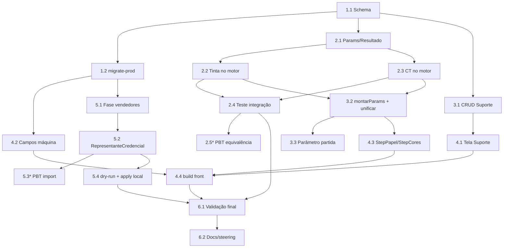

# Implementation Plan — Finalização do Orçamento Gráfico

## Overview

Plano em 6 blocos (ondas) de risco crescente. As ondas 1→2→3 habilitam o motor
calibrado de forma aditiva; a onda 4 (vendedores) é independente e pode rodar em
paralelo após a onda 1. Tudo validado em LOCAL antes de produção. Tarefas com `*`
são opcionais (property-based).

## Tasks

- [x] 1. Onda 1 — Schema + migração (backend)
- [x] 1.1 Adicionar campos novos ao `schema.prisma`
  - `CentroProducao`: `acertoPorCorMin`, `tempoSetupMin` (Decimal?, opcionais)
  - Novo model `SuporteGrafico` (código, descrição, tipoSuporte, coefTinta, gramaturas, status; `@@unique([empresaId, codigo])`)
  - `PrecoMateriaPrima`: `suporteId?`, `gramatura?`, `densidadeTinta?`
  - _Requirements: 1.1, 1.2, 2.1, 2.2_
- [x] 1.2 Atualizar `prisma/migrate-prod.ts` (idempotente) com os ALTER/CREATE equivalentes; `npx prisma generate` OK. (Migração roda em produção no deploy — decisão do usuário; Postgres local indisponível para teste 2×.)
  - _Requirements: 1.5, 5.4_

- [x] 2. Onda 2 — Motor de cálculo calibrado (backend puro)
- [x] 2.1 Estender `ParamsOrcamento`/`ResultadoOrcamento` com os campos aditivos (acertoPorCorMin, tempoSetupMin, cores na máquina; coefTinta no papel; densidade nas cores; partidaConsumoTintaKg; modeloCalculo no resultado)
  - _Requirements: 3.1, 3.2_
- [x] 2.2 Integrar `consumo-tinta.ts` no motor com fallback para `calcularTinta` (usa coefTinta/densidade/partida quando presentes)
  - _Requirements: 2.3, 2.4, 3.1_
- [x] 2.3 Integrar `custo-transformacao.ts` no cálculo de máquina de impressão com fallback para setup atual; remover o 30min hardcoded no caminho novo
  - _Requirements: 1.3, 1.4, 3.1, 3.5_
- [x] 2.4 Teste de integração do motor (`integracao-motor-calibrado.test.ts`, 4 casos) validando roteamento CALIBRADO/LEGADO + equivalência com os módulos puros; suíte `orcamento-grafico` 81/81 verde.
  - _Requirements: 3.3_
- [x]* 2.5 Property-based (fast-check) para Property 1 (equivalência legado quando campos nulos) — `calibracao/pbt-equivalencia-legado.test.ts` (sempre LEGADO + campos neutros ≡ ausentes), 600 runs.
  - _Requirements: 3.3_

- [x] 3. Onda 2b — Rotas backend (cadastros + unificação)
- [x] 3.1 CRUD de Suporte: `GET/POST/PUT/DELETE /orcamento-grafico/suportes` (filtro empresaId explícito)
  - _Requirements: 2.1, 5.1_
- [x] 3.2 Helpers `resolverCoefTintaSuporte`/`resolverPartidaConsumoTinta`; `/calcular` e `/simular-tiragens` leem os campos novos de máquina/suporte e usam o mesmo caminho calibrado
  - _Requirements: 3.1, 3.4_
- [x] 3.3 Parâmetro `orcamento.partidaConsumoTintaKg` (lido via Parametro; default 0,2)
  - _Requirements: 2.5_

- [x] 4. Onda 3 — Frontend (cadastros + wizard)
- [x] 4.1 Tela `cadastros/suportes/page.tsx` (CRUD SuporteGrafico) + item no ModuleSidebar
  - _Requirements: 2.1_
- [x] 4.2 Campos `acertoPorCorMin`/`tempoSetupMin` no cadastro de centro (`pcp/cadastros/centros`) + rota `/centros-producao` (POST/PUT)
  - _Requirements: 1.1, 1.2_
- [x] 4.3 Vínculo papel→suporte + gramatura e densidade da tinta no cadastro de Preços Materiais (ponto natural do vínculo; wizard envia papelId e o motor resolve o coefTinta). Rotas `/precos-mp` estendidas.
  - _Requirements: 2.1, 2.2_
- [~] 4.4 Build do front: validado por `get_diagnostics` (0 erros em todos os arquivos novos/alterados). `npm run build`/`tsc` completos travaram nesta máquina (lento conhecido) — validação final de build fica no deploy.
  - _Requirements: 3.3_

- [x] 5. Onda 4 — Importador de vendedores
- [x] 5.1 Fase `vendedores` em `scripts/importar-calcgraf.ts`: lê `Vendedores.json`, de-para por cpf/nome, cria Vendedor (comissao=0, status por Ativo, cpf placeholder `SEM-DOC-<Codigo>` quando ausente), enriquece vazios; `--dry-run` + idempotente
  - _Requirements: 4.1, 4.2, 4.3, 4.4, 4.5, 4.6_
- [x] 5.2 Criar `RepresentanteCredencial` para e-mails válidos (senhaTemporaria, bcrypt aleatório), respeitando uniques; pular existentes
  - _Requirements: 4.8_
- [x]* 5.3 Property-based (fast-check) para Property 4 e 5 (idempotência e não-sobrescrita) — funções puras extraídas para `scripts/calcgraf-dedup.ts` + `scripts/calcgraf-dedup.test.ts` (8 propriedades, 500 runs cada). Script `importar-calcgraf.ts` passou a importar o módulo puro (sem duplicação).
  - _Requirements: 4.3, 4.6_
- [x] 5.4 EXECUTADO EM PRODUÇÃO (Neon, empresa Wega `75848e24-...`): dry-run (39 criados/11 credenciais) → apply (39 vendedores + 11 RepresentanteCredencial criados) → 2ª execução idempotente (0 criados, 39 intactos, 11 credenciais já existiam). Estado final: 40 vendedores (39 import + 1 pré-existente, sem duplicar), 32 placeholder SEM-DOC, 12 credenciais. Corrigido bug: enriquecimento tentava gravar `telefone` (campo inexistente no model Vendedor) — removido.
  - _Requirements: 4.7, 5.2, 5.3_

- [x] 6. Validação final e documentação
- [x] 6.1 Suíte `orcamento-grafico` 81/81 verde; validação por diagnostics (build/tsc completos travam nesta máquina — validação final no deploy).
  - _Requirements: 3.3_
- [x] 6.2 Docs (`calcgraf-consumo-tinta.md` §6, `calcgraf-custo-transformacao.md` §9) e steering atualizados com o estado "integrado ao motor".
  - _Requirements: 3.1_

## Task Dependency Graph



```json
{
  "waves": [
    { "wave": 1, "tasks": ["1.1"] },
    { "wave": 2, "tasks": ["1.2", "2.1", "3.1"] },
    { "wave": 3, "tasks": ["2.2", "2.3", "4.2", "5.1"] },
    { "wave": 4, "tasks": ["2.4", "3.2", "4.1", "5.2"] },
    { "wave": 5, "tasks": ["2.5", "3.3", "4.3", "5.3", "5.4"] },
    { "wave": 6, "tasks": ["4.4"] },
    { "wave": 7, "tasks": ["6.1"] },
    { "wave": 8, "tasks": ["6.2"] }
  ]
}
```

## Notes

- Repos separados: schema/motor/importador no back; cadastros/wizard no front.
- Regra crítica: `schema.prisma` + `migrate-prod.ts` SEMPRE no mesmo commit.
- Nada em produção (Neon) sem validar em LOCAL + confirmação explícita.
- Fallback garante não-regressão: campos novos ausentes → cálculo legado.
- Importador: `--dry-run` por padrão; `--apply` só após conferir contadores.
