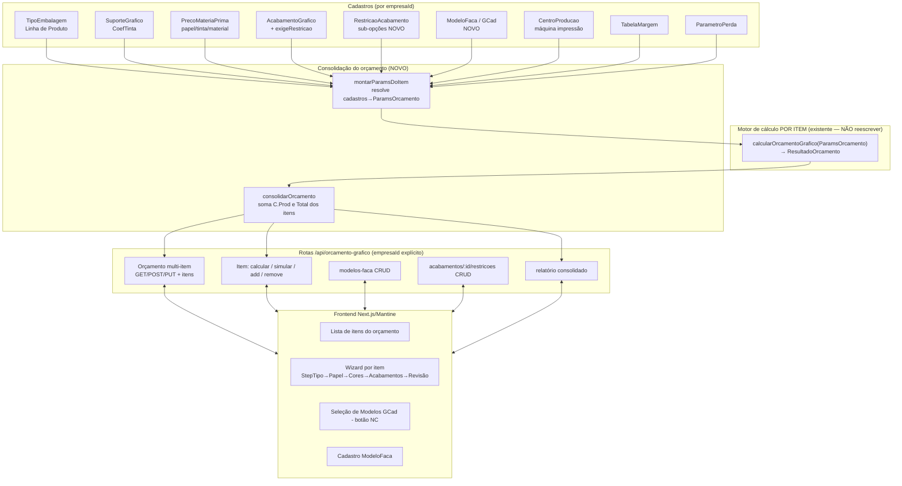
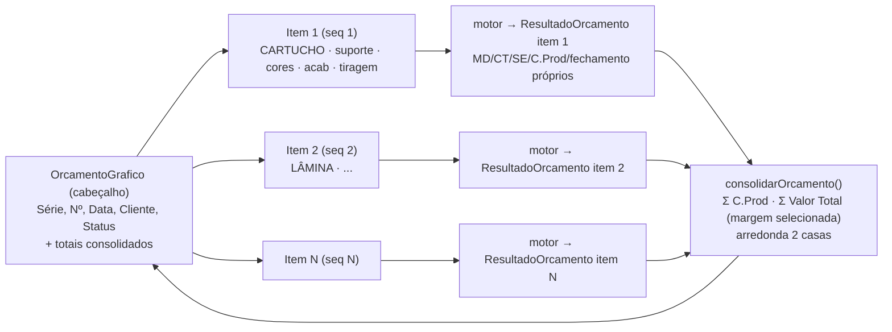
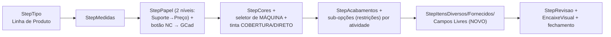

# Design Document — Orçamento Gráfico Multi-Item + GCad

## Overview

### 1. Visão Geral e Princípios de Design

Esta spec evolui o módulo de **Orçamento Gráfico** do Vizor de "1 orçamento = 1 item"
para "1 orçamento (cabeçalho) = N itens de cálculo", reproduzindo a estrutura real do
Calcgraf/GPrint (Orçamento 5.377 → Cálculo 15.235), e acrescenta os recursos que ainda
faltam para o Vizor **gerar** o orçamento sem depender de importação: catálogo de
facas/modelos (GCad), restrições por atividade de acabamento, seletor de máquina de
impressão, matriz de impressão no Material Direto, tinta por cobertura ou consumo
direto, e a UI de Itens Diversos/Fornecidos/Campos Livres.

### 1.1 Princípios-mestre

**(a) Fidelidade ao Calcgraf é o objetivo-mestre.** O relatório/pré-cálculo do Vizor
deve reproduzir o do Calcgraf componente a componente (Suporte, Matriz de Impressão,
Tinta, Material de Acabamento, Impressão, Acabamento) e nos totais (MD, CT, Servex,
C.Prod, C.Finan, Total, CEV, Margem/C.Marg/Unitário/Total por tiragem), com desvio
≤0,5% validado por golden cases congelados (15.235 item único, 15.185 multi-item).
Todo elemento de design existe para servir essa meta — ver mapa Requisito→Design (§10).

**(b) Aditividade e NÃO-REGRESSÃO — o motor puro NÃO é reescrito.** O arquivo
`src/modules/orcamento-grafico/orcamento-grafico-calculo.service.ts` (função
`calcularOrcamentoGrafico`) é o MOTOR de cálculo de **um** item e já bate o golden
15.235 nos testes (≤0,5%). Este design **envelopa** esse motor, não o substitui:

- A estrutura multi-item é um **ENVELOPE** (`ConsolidacaoService`) que itera os itens,
  chama o motor existente **uma vez por item** e **soma** os resultados. O motor
  continua recebendo os parâmetros de **um** item e devolvendo o `ResultadoOrcamento`
  de um item.
- O GCad, as restrições de acabamento e o seletor de máquina entram como **novos
  campos de entrada do `ParamsOrcamento`** (todos opcionais) que ajustam valores já
  existentes do motor (`aproveitamentoManual`, `maquinaImpressao`, tempos de
  acabamento rico) — **pontos de injeção**, não reescrita de fórmula.
- Toda extensão do `ParamsOrcamento`/`ResultadoOrcamento` é **opcional/aditiva**:
  quando os campos novos estão ausentes/nulos, o motor produz resultado **idêntico,
  campo a campo** (desvio zero) ao congelado (Req 4.2, Req 14.4). A suíte
  `orcamento-grafico` (130 testes verdes) permanece verde (Req 4.3).

**(c) Multi-tenant por `empresaId` em TODA query.** Toda leitura/escrita de orçamento,
item, modelo GCad, restrição, acabamento e máquina filtra explicitamente por
`empresaId` da entidade de negócio — nunca confiando apenas no `prismaScoped`
(que faz bypass para SUPER_ADMIN; ver steering `ATENCAO-pontos-verificar.md`). Como
`ItemOrcamentoGrafico` e `RestricaoAcabamento` são entidades FILHAS sem `empresaId`
próprio no caminho natural, o isolamento é feito pela relação com o pai
(`item.orcamento.empresaId`) **e** por `empresaId` denormalizado no item (ver §3).

### 1.2 Implementação faseada

| Fase | Entrega | Requisitos |
|---|---|---|
| **Fase 1** | Estrutura multi-item: cabeçalho + `ItemOrcamentoGrafico` + consolidação + migração de dados não-destrutiva | 1, 2, 3, 4 |
| **Fase 2** | Catálogo GCad (`ModeloFaca`) + seleção preenche geometria/encaixe (ponto de injeção `aproveitamentoOverride`) | 5, 6 |
| **Fase 3** | Restrições por atividade (`RestricaoAcabamento`) sobrepõem acerto/operação no CT | 7 |
| **Fase 4** | Ajustes de calibração/UI: seletor de máquina, preço material acabamento, matriz no MD, tinta cobertura/direto, Itens Diversos/Fornecidos/Campos Livres | 8, 9, 10, 11, 12 |
| **Fase 5** | Validação golden (15.235 e 15.185) + propriedades (property-based) | 13, 14 |

Cada fase é independentemente commitável e preserva a suíte verde. As fases 2–4 só
acrescentam campos opcionais; a Fase 1 é a única com migração estrutural de dados, e
é projetada para ser não-destrutiva e idempotente (§3.6).

### 1.3 Restrições técnicas transversais

- `prisma/schema.prisma` e `prisma/migrate-prod.ts` alterados **no mesmo commit**,
  bloco idempotente (`CREATE TABLE IF NOT EXISTS` / `ADD COLUMN IF NOT EXISTS` /
  índices; FK em `try/catch`), testado rodando `migrate-prod.ts` 2× (steering
  `database-migrations.md`). Postgres local está parado nesta máquina; a migração roda
  no deploy — por isso a idempotência é obrigatória.
- Enums gravados como **VARCHAR** (sem `CREATE TYPE`).
- Em queries de `OrcamentoGrafico` usar **`select` explícito**, nunca `omit` — padrão
  do projeto para não materializar JSONs grandes (`resultadoCalculo`) à toa.
- Build/`tsc` completos TRAVAM nesta máquina — validar por `get_diagnostics` +
  `npx vitest run src/modules/orcamento-grafico --reporter=dot`.

## Architecture

### 2. Arquitetura

### 2.1 Camadas



### 2.2 Fluxo "Orçamento 1→N Itens, cada item isolado, orçamento soma"



Princípio central: **o cálculo de cada item usa exclusivamente os parâmetros do próprio
item** (Req 2.1) — nenhum item influencia o cálculo de outro. A consolidação é apenas
uma soma dos resultados independentes (Req 3). Isso mapeia 1:1 ao modelo mental do
Calcgraf (um Cálculo por item, Orçamento soma) e preserva o motor puro intacto.

### 2.3 Organização de arquivos (backend)

| Arquivo | Papel | Novo/Alterado |
|---|---|---|
| `orcamento-grafico-calculo.service.ts` | Motor puro por item | **inalterado** (só extensão aditiva de `ParamsOrcamento` já existente — `aproveitamentoManual` já existe) |
| `orcamento-grafico-consolidacao.service.ts` | Envelope: soma C.Prod/Total dos itens; funções puras | **novo** |
| `orcamento-grafico-item.service.ts` | `montarParamsDoItem` (resolve cadastros→ParamsOrcamento), inclui GCad/restrições/máquina | **novo** (extrai lógica hoje inline no `POST /` e `/calcular`) |
| `orcamento-grafico.routes.ts` | Rotas (cadastros + orçamento + itens) | **alterado** (rotas de item aninhado, GCad, restrições) |
| `custo-transformacao.ts` / `consumo-tinta.ts` | Submódulos puros do CT/tinta | **inalterado** (restrições injetam tempos via parâmetros já existentes) |

## Data Models

### 3. Modelo de Dados (Prisma)

### 3.1 Decisão central — item filho vs. campos legados no cabeçalho

**Problema:** hoje `OrcamentoGrafico` É o item (carrega `tipoEmbalagemId`, `medidas`,
`papelId`, `numCores`, `cores`, `acabamentos`, `quantidade`, `resultadoCalculo`,
`custoTotal`, `precoVenda`, etc.). Precisamos de N itens por orçamento.

**Duas abordagens avaliadas:**

| Abordagem | Prós | Contras |
|---|---|---|
| **A — item filho** (`ItemOrcamentoGrafico`): mover os campos de cálculo para o item; cabeçalho mantém só comercial + totais; migrar cada orçamento existente para 1 item filho | Modela 1:1 o Calcgraf; consolidação limpa; `GET /:id` natural com `items[]`; sem ambiguidade | Exige migração de dados em produção (criar 1 item por orçamento existente) |
| **B — campos legados no cabeçalho como fallback**: manter os campos atuais no cabeçalho (item "0") e adicionar itens extras numa tabela separada | Sem migração de dados | Dois caminhos de leitura (cabeçalho + filhos); consolidação precisa somar o "item embutido" + filhos; risco permanente de divergência; viola a modelagem limpa do Calcgraf |

**Recomendação: Abordagem A (item filho), com migração de dados idempotente e
não-destrutiva.** Razões:

1. Respeita o Req 4 (não-regressão) com **menor risco de longo prazo**: há UM só
   caminho de cálculo (o motor por item) e UM caminho de leitura (itens), evitando a
   dívida permanente de "cabeçalho é também um item" da abordagem B.
2. A migração é um passo pontual, idempotente e reversível em efeito (só cria filhos a
   partir de dados que já existem; não apaga nada do cabeçalho).
3. Para blindar a não-regressão durante a transição, os **campos legados do cabeçalho
   NÃO são removidos de imediato** — eles permanecem no schema (deprecados) e são
   preenchidos em espelho a partir do item quando o orçamento tem exatamente 1 item.
   Isso garante que qualquer leitura legada (relatório/PDF/listagem que ainda referencie
   `orcamento.custoTotal`/`precoVenda`) continue funcionando sem erro (Req 4.4/4.5/4.6),
   e dá uma janela segura para migrar os consumidores. A remoção dos campos legados fica
   para uma spec futura, após confirmar que nenhum consumidor os lê.

> Nota de não-destrutividade: a Fase 1 **não faz `DROP COLUMN`**. Mantém os campos de
> item no cabeçalho como legado/fallback. A migração só **cria** `ItemOrcamentoGrafico`.

### 3.2 Novo model `ItemOrcamentoGrafico`

Filho de `OrcamentoGrafico` (cascade na exclusão), com sequência única por orçamento.
Recebe os campos de cálculo que hoje vivem no cabeçalho, mais os campos novos desta spec
(modelo GCad, máquina, matriz, tinta, materiais, itens diversos/fornecidos/campos livres).

```prisma
/// Item de cálculo de um Orçamento Gráfico (multi-item). Cada item é um
/// "Cálculo" do Calcgraf: Linha de Produto + suporte + cores + acabamentos +
/// tiragem + fechamento próprios. Isolamento por empresaId denormalizado +
/// relação com o orçamento pai. Enums como VARCHAR.
model ItemOrcamentoGrafico {
  id          String  @id @default(uuid())
  orcamentoId String  @map("orcamento_id")
  empresaId   String  @map("empresa_id") // denormalizado p/ filtro multi-tenant direto
  sequencia   Int     // 1..N único por orçamento (Req 1.5)

  // ── Geometria / produto ──
  tipoEmbalagemId String   @map("tipo_embalagem_id")
  descricao       String?  @db.VarChar(200)
  medidas         Json     // {L, A, P, ...}

  // ── Papel / suporte ──
  papelId        String?  @map("papel_id")
  papelDescricao String?  @map("papel_descricao") @db.VarChar(200)
  suporteId      String?  @map("suporte_id")
  gramatura      Decimal? @db.Decimal(6, 2)

  // ── Impressão ──
  numCores  Int     @default(4) @map("num_cores")
  cores     Json?   // [{nome, tipo, cobertura%, precoKg, ...}]
  maquinaId String? @map("maquina_id") // CentroProducao IMPRESSAO (Req 8)

  // ── Matriz de impressão no MD (Req 10) ──
  matrizQuantidade    Decimal? @map("matriz_quantidade") @db.Decimal(12, 3)
  matrizPrecoUnitario Decimal? @map("matriz_preco_unitario") @db.Decimal(14, 4)

  // ── Tinta por cobertura OU consumo direto (Req 11) ──
  /// COBERTURA | CONSUMO_DIRETO — modo mutuamente exclusivo por item
  tintaModo        String?  @map("tinta_modo") @db.VarChar(20)
  tintaConsumoKg   Decimal? @map("tinta_consumo_kg") @db.Decimal(12, 3)

  // ── Acabamentos (ricos: hora-máquina / material kg / material un / fixo) ──
  acabamentosRicos Json?    @map("acabamentos_ricos")

  // ── GCad / Faca (Req 6) ──
  modeloFacaId     String?  @map("modelo_faca_id")

  // ── Itens Diversos / Fornecidos / Campos Livres (Req 12) ──
  itensDiversos    Json?    @map("itens_diversos")   // [{descricao, quantidade, valor, fixo}]
  itensFornecidos  Json?    @map("itens_fornecidos") // [{descricao, quantidade}]
  camposLivres     Json?    @map("campos_livres")    // [{rotulo, conteudo}]

  // ── Tiragem e resultado ──
  quantidade       Int
  resultadoCalculo Json?    @map("resultado_calculo") // ResultadoOrcamento do motor
  margemSelecionada Decimal? @map("margem_selecionada") @db.Decimal(5, 2) // markup escolhido p/ Total consolidado
  // Fechamento consolidável (margem selecionada) — espelho p/ a soma do orçamento
  custoProducao    Decimal? @map("custo_producao") @db.Decimal(14, 2)
  valorTotal       Decimal? @map("valor_total") @db.Decimal(14, 2)
  pendente         Boolean  @default(false) // Req 7.6 / 8.4 — bloqueia fechamento

  criadoEm     DateTime @default(now()) @map("criado_em")
  atualizadoEm DateTime @updatedAt @map("atualizado_em")

  orcamento  OrcamentoGrafico @relation(fields: [orcamentoId], references: [id], onDelete: Cascade)
  modeloFaca ModeloFaca?      @relation(fields: [modeloFacaId], references: [id], onDelete: Restrict)

  @@unique([orcamentoId, sequencia])
  @@index([empresaId])
  @@index([orcamentoId])
  @@index([modeloFacaId])
  @@map("item_orcamento_grafico")
}
```

Alteração no cabeçalho `OrcamentoGrafico` (aditiva — campos legados preservados):

```prisma
model OrcamentoGrafico {
  // ... todos os campos atuais permanecem (legado/fallback) ...
  // ── NOVO: cabeçalho multi-item ──
  serie               String?  @db.VarChar(10)              // Req 1.1
  dataOrcamento       DateTime? @map("data_orcamento")      // Req 1.1 (Data)
  custoProducaoConsolidado Decimal? @map("custo_producao_consolidado") @db.Decimal(14, 2) // Req 3.2
  valorTotalConsolidado    Decimal? @map("valor_total_consolidado") @db.Decimal(14, 2)    // Req 3.1

  itens ItemOrcamentoGrafico[] // 0..999 (Req 1.2)
}
```

> O enum de Status do cabeçalho (Req 1.1: RASCUNHO/ABERTO/APROVADO/REPROVADO/CANCELADO)
> reutiliza o campo `status String @db.VarChar(20)` já existente. O conjunto de valores
> aceitos passa a ser validado no Zod da rota; valores legados existentes
> (ENVIADO/RECUSADO/VENCIDO) são mapeados na leitura (ABERTO←ENVIADO, REPROVADO←RECUSADO)
> sem alterar dados persistidos (defesa de compatibilidade — Req 4.4).

### 3.3 Novo model `ModeloFaca` (GCad)

```prisma
/// Catálogo de Modelos/Facas (GCad) — gabarito técnico real com dimensões,
/// repetição/encaixe e formato de corte. Selecionar um modelo preenche a
/// geometria e a imposição reais do item. Multi-tenant. Enums como VARCHAR.
model ModeloFaca {
  id          String  @id @default(uuid())
  empresaId   String  @map("empresa_id")
  codigo      String  @db.VarChar(40) // CG-FACA-* p/ importados; livre p/ manuais
  clienteNome String? @map("cliente_nome") @db.VarChar(200)
  modelo      String  @db.VarChar(200) // Req 5.1
  servico     String  @db.VarChar(200)
  larguraMm   Decimal @map("largura_mm") @db.Decimal(10, 2)   // > 0
  alturaMm    Decimal @map("altura_mm") @db.Decimal(10, 2)    // > 0
  repeticaoLinhas  Int @map("repeticao_linhas")  // >= 1
  repeticaoColunas Int @map("repeticao_colunas") // >= 1
  formatoCorteLarguraMm Decimal @map("formato_corte_largura_mm") @db.Decimal(10, 2) // > 0
  formatoCorteAlturaMm  Decimal @map("formato_corte_altura_mm") @db.Decimal(10, 2)  // > 0
  tipoCartucho String? @map("tipo_cartucho") @db.VarChar(100)
  suporteId    String? @map("suporte_id")
  gramatura    Decimal? @db.Decimal(6, 2)
  status       Boolean  @default(true)
  criadoEm     DateTime @default(now()) @map("criado_em")
  atualizadoEm DateTime @updatedAt @map("atualizado_em")

  itens ItemOrcamentoGrafico[]

  @@unique([empresaId, codigo])
  @@index([empresaId, status])
  @@map("modelo_faca")
}
```

A exclusão de `ModeloFaca` é `onDelete: Restrict` na relação com `ItemOrcamentoGrafico`
(Req 5.6): a rota de DELETE verifica vínculo e rejeita com mensagem antes de tentar
excluir (não dependemos apenas da FK para a mensagem amigável).

### 3.4 Restrições de acabamento — `RestricaoAcabamento` + flag `exigeRestricao`

```prisma
/// Sub-opção (restrição) de uma atividade de acabamento (Req 7). Ex.: coladeira
/// AFT70 → "Lateral Simples", "Fundo Automático Normal". Sobrepõe o acerto/tempo
/// da atividade no Custo de Transformação. Filho de AcabamentoGrafico (cascade).
model RestricaoAcabamento {
  id                  String  @id @default(uuid())
  acabamentoGraficoId String  @map("acabamento_grafico_id")
  empresaId           String  @map("empresa_id") // denormalizado p/ multi-tenant
  nome                String  @db.VarChar(100)   // 1..100 (Req 7.1)
  tempoAcertoMin      Decimal @map("tempo_acerto_min") @db.Decimal(10, 2)   // 0..999
  tempoOperacaoMin    Decimal @map("tempo_operacao_min") @db.Decimal(10, 2) // 0..999
  criadoEm            DateTime @default(now()) @map("criado_em")

  acabamento AcabamentoGrafico @relation(fields: [acabamentoGraficoId], references: [id], onDelete: Cascade)

  @@index([acabamentoGraficoId])
  @@index([empresaId])
  @@map("restricao_acabamento")
}
```

Alteração aditiva em `AcabamentoGrafico`:

```prisma
model AcabamentoGrafico {
  // ... campos atuais ...
  exigeRestricao Boolean @default(false) @map("exige_restricao") // Req 7.2
  restricoes     RestricaoAcabamento[]
}
```

### 3.5 Blocos idempotentes de `migrate-prod.ts`

Cada alteração de schema tem seu bloco equivalente, idempotente, no mesmo commit
(steering `database-migrations.md`). Esboço (seguindo o padrão já usado em
`acabamento_grafico`/`suporte_grafico`):

```ts
// ── Fase 1: multi-item ──────────────────────────────────────────────────────
await prisma.$executeRawUnsafe(`CREATE TABLE IF NOT EXISTS "item_orcamento_grafico" (
  "id" TEXT NOT NULL,
  "orcamento_id" TEXT NOT NULL,
  "empresa_id" TEXT NOT NULL,
  "sequencia" INTEGER NOT NULL,
  "tipo_embalagem_id" TEXT NOT NULL,
  "descricao" VARCHAR(200),
  "medidas" JSONB NOT NULL,
  "papel_id" TEXT, "papel_descricao" VARCHAR(200), "suporte_id" TEXT,
  "gramatura" DECIMAL(6,2),
  "num_cores" INTEGER NOT NULL DEFAULT 4, "cores" JSONB, "maquina_id" TEXT,
  "matriz_quantidade" DECIMAL(12,3), "matriz_preco_unitario" DECIMAL(14,4),
  "tinta_modo" VARCHAR(20), "tinta_consumo_kg" DECIMAL(12,3),
  "acabamentos_ricos" JSONB, "modelo_faca_id" TEXT,
  "itens_diversos" JSONB, "itens_fornecidos" JSONB, "campos_livres" JSONB,
  "quantidade" INTEGER NOT NULL, "resultado_calculo" JSONB,
  "margem_selecionada" DECIMAL(5,2),
  "custo_producao" DECIMAL(14,2), "valor_total" DECIMAL(14,2),
  "pendente" BOOLEAN NOT NULL DEFAULT false,
  "criado_em" TIMESTAMP(3) NOT NULL DEFAULT CURRENT_TIMESTAMP,
  "atualizado_em" TIMESTAMP(3) NOT NULL DEFAULT CURRENT_TIMESTAMP,
  CONSTRAINT "item_orcamento_grafico_pkey" PRIMARY KEY ("id")
)`)
await prisma.$executeRawUnsafe(`CREATE UNIQUE INDEX IF NOT EXISTS "item_orcamento_grafico_orcamento_id_sequencia_key" ON "item_orcamento_grafico"("orcamento_id","sequencia")`)
await prisma.$executeRawUnsafe(`CREATE INDEX IF NOT EXISTS "idx_item_orc_grafico_empresa" ON "item_orcamento_grafico"("empresa_id")`)
await prisma.$executeRawUnsafe(`CREATE INDEX IF NOT EXISTS "idx_item_orc_grafico_orcamento" ON "item_orcamento_grafico"("orcamento_id")`)
await prisma.$executeRawUnsafe(`CREATE INDEX IF NOT EXISTS "idx_item_orc_grafico_modelo_faca" ON "item_orcamento_grafico"("modelo_faca_id")`)
// FK em try/catch (Postgres não tem ADD CONSTRAINT IF NOT EXISTS)
try { await prisma.$executeRawUnsafe(`ALTER TABLE "item_orcamento_grafico" ADD CONSTRAINT "item_orc_grafico_orcamento_fk" FOREIGN KEY ("orcamento_id") REFERENCES "orcamento_grafico"("id") ON DELETE CASCADE`) } catch {}
try { await prisma.$executeRawUnsafe(`ALTER TABLE "item_orcamento_grafico" ADD CONSTRAINT "item_orc_grafico_modelo_faca_fk" FOREIGN KEY ("modelo_faca_id") REFERENCES "modelo_faca"("id") ON DELETE RESTRICT`) } catch {}

// cabeçalho — colunas novas aditivas
await prisma.$executeRawUnsafe(`ALTER TABLE "orcamento_grafico" ADD COLUMN IF NOT EXISTS "serie" VARCHAR(10)`)
await prisma.$executeRawUnsafe(`ALTER TABLE "orcamento_grafico" ADD COLUMN IF NOT EXISTS "data_orcamento" TIMESTAMP(3)`)
await prisma.$executeRawUnsafe(`ALTER TABLE "orcamento_grafico" ADD COLUMN IF NOT EXISTS "custo_producao_consolidado" DECIMAL(14,2)`)
await prisma.$executeRawUnsafe(`ALTER TABLE "orcamento_grafico" ADD COLUMN IF NOT EXISTS "valor_total_consolidado" DECIMAL(14,2)`)

// ── Fase 2: GCad ────────────────────────────────────────────────────────────
await prisma.$executeRawUnsafe(`CREATE TABLE IF NOT EXISTS "modelo_faca" ( ... )`)
await prisma.$executeRawUnsafe(`CREATE UNIQUE INDEX IF NOT EXISTS "modelo_faca_empresa_id_codigo_key" ON "modelo_faca"("empresa_id","codigo")`)
await prisma.$executeRawUnsafe(`CREATE INDEX IF NOT EXISTS "idx_modelo_faca_empresa_status" ON "modelo_faca"("empresa_id","status")`)

// ── Fase 3: restrições de acabamento ─────────────────────────────────────────
await prisma.$executeRawUnsafe(`ALTER TABLE "acabamento_grafico" ADD COLUMN IF NOT EXISTS "exige_restricao" BOOLEAN NOT NULL DEFAULT false`)
await prisma.$executeRawUnsafe(`CREATE TABLE IF NOT EXISTS "restricao_acabamento" ( ... )`)
await prisma.$executeRawUnsafe(`CREATE INDEX IF NOT EXISTS "idx_restricao_acab_acabamento" ON "restricao_acabamento"("acabamento_grafico_id")`)
try { await prisma.$executeRawUnsafe(`ALTER TABLE "restricao_acabamento" ADD CONSTRAINT "restricao_acab_acabamento_fk" FOREIGN KEY ("acabamento_grafico_id") REFERENCES "acabamento_grafico"("id") ON DELETE CASCADE`) } catch {}
```

### 3.6 Migração de dados item-único → item-filho (idempotente, não-destrutiva)

Passo rodado **dentro** do `migrate-prod.ts`, após criar `item_orcamento_grafico`, que
só executa quando ainda não há itens — garantindo idempotência e preservação de dados:

```ts
// Preenche 1 ItemOrcamentoGrafico por OrcamentoGrafico existente que ainda não
// tenha item. Idempotente: a 2ª execução não cria nada (NOT EXISTS). Não altera
// nem remove nenhum campo do cabeçalho (não-destrutivo). sequencia = 1.
await prisma.$executeRawUnsafe(`
  INSERT INTO "item_orcamento_grafico" (
    "id","orcamento_id","empresa_id","sequencia","tipo_embalagem_id",
    "medidas","papel_id","papel_descricao","gramatura","num_cores","cores",
    "acabamentos_ricos","quantidade","resultado_calculo","custo_producao","valor_total","pendente"
  )
  SELECT gen_random_uuid(), o."id", o."empresa_id", 1, o."tipo_embalagem_id",
    o."medidas", o."papel_id", o."papel_descricao", o."gramatura", o."num_cores", o."cores",
    o."acabamentos", o."quantidade", o."resultado_calculo",
    o."custo_total", o."preco_venda", false
  FROM "orcamento_grafico" o
  WHERE NOT EXISTS (SELECT 1 FROM "item_orcamento_grafico" i WHERE i."orcamento_id" = o."id")
`)
```

> Observações: a migração copia `resultado_calculo` do cabeçalho tal como está (não
> recalcula — preserva o valor congelado do item, Req 4.1/4.6). `custo_producao`←
> `custo_total` e `valor_total`←`preco_venda` são aproximações de espelho para a
> consolidação; para o item migrado a consolidação do orçamento vai refletir exatamente
> esses valores legados (1 item → soma = o próprio item, Req 3.5). Enums/colunas novas
> ficam nulos (default), tratados como "ausente" pelo motor (resultado idêntico ao
> congelado — Req 4.2).

## Components and Interfaces

### 4. Motor de Cálculo e Consolidação

### 4.1 Ponto de injeção do GCad (encaixe) — sem reescrever o motor

O motor já expõe o parâmetro `aproveitamentoManual?: number` em `ParamsOrcamento`:
quando `> 0`, ele usa esse valor em `folhasNecessarias = ceil(quantidade / aprov)` no
lugar do encaixe geométrico (`calcularEncaixe`). **É exatamente o ponto de injeção do
GCad.** O envelope (`montarParamsDoItem`) faz:

```ts
// quando o item tem modeloFacaId:
const modelo = await prisma.modeloFaca.findFirst({ where: { id: item.modeloFacaId, empresaId } })
const aproveitamentoOverride = modelo.repeticaoLinhas * modelo.repeticaoColunas // poses/folha (Req 6.3/6.5)
params.aproveitamentoManual = aproveitamentoOverride
// e sobrescreve a geometria do item com a do modelo (Req 6.1):
params.maquinaImpressao.formatoLargura = modelo.formatoCorteLarguraMm
params.maquinaImpressao.formatoAltura  = modelo.formatoCorteAlturaMm
params.medidas = { ...medidasDoModelo } // largura/altura do modelo
// suporte do modelo tem precedência sobre o do item
```

- **Sem `modeloFacaId`**: `aproveitamentoManual` fica ausente → motor usa
  `calcularEncaixe` (geométrico), produzindo o resultado do motor puro congelado
  (Req 6.4, comportamento legado).
- **Com `modeloFacaId`**: `aproveitamento = linhas × colunas` (Req 6.3/6.5), e a área
  das poses ≤ área da folha do formato de corte (Req 6.6) — verificado pela propriedade
  P3 (§6) e pelo próprio motor (poses nunca excedem a folha porque linhas/colunas são
  do modelo, cujo formato de corte é a folha).
- `linhas` ou `colunas` ≤ 0 → o envelope rejeita a seleção **antes** de chamar o motor
  (Req 6.7), preservando o estado anterior do item.

### 4.2 Restrições de acabamento no CT

Cada acabamento rico HORA_MAQUINA já aceita, no `ItemAcabamentoRico`, os tempos
`tempoFixoHoras`/`tempoVarHoras` (modo direto) ou `quantAcertos`/`tempoPorAcertoMin`/
`tempoPrimeiroAcertoMin`/`producaoHora` (modo derivado). A restrição selecionada
**sobrepõe o acerto/operação** daquele acabamento no `montarAcabamentosRicos`:

```ts
// Req 7.4: restrição selecionada sobrepõe tempo de acerto/operação
if (item.restricaoAcabamentoId) {
  const r = await prisma.restricaoAcabamento.findFirst({ where: { id, empresaId } })
  acab.tempoPrimeiroAcertoMin = Number(r.tempoAcertoMin)   // acerto da restrição
  acab.tempoPorAcertoMin = Number(r.tempoAcertoMin)
  // operação: traduzida p/ producaoHora equivalente OU tempoVarHoras direto
  acab.tempoVarHoras = Number(r.tempoOperacaoMin) / 60
}
// Req 7.5: sem restrição → tempos padrão do cadastro do acabamento (comportamento atual)
```

O cálculo em si continua em `calcularCustoTransformacao` (submódulo puro inalterado):
a restrição só muda os **números de entrada**, não a fórmula. Req 7.6: se a atividade
tem `exigeRestricao=true` e nenhuma restrição foi escolhida, o item é marcado
`pendente=true` e o fechamento é bloqueado (validação na rota de item, antes de calcular).

### 4.3 Seletor de máquina de impressão

Hoje o cálculo pega a 1ª máquina IMPRESSAO por `posicao` (fallback). Passa a receber
`maquinaId` do item (Req 8.2): o `montarParamsDoItem` carrega o `CentroProducao` por
`{ id: maquinaId, empresaId }` e popula `maquinaImpressao` (velocidade, custoHora,
formato, pinça, `acertoPorCorMin`, `setupMinutos`). Regras:

- `maquinaId` ausente e `numCores >= 1` → `pendente=true`, bloqueia fechamento (Req 8.4).
- Nenhuma máquina IMPRESSAO ativa na empresa → bloqueio com mensagem (Req 8.5).
- Máquina sem `acertoPorCorMin`/`custoHora` → `pendente=true`, preserva seleção (Req 8.6).
- O fallback "1ª por posição" é mantido **apenas** para orçamentos legados sem
  `maquinaId` (não-regressão, Req 4), nunca para itens novos com cores ≥ 1.

### 4.4 Matriz de impressão, tinta e materiais de acabamento no MD

- **Matriz (Req 10):** `matrizQuantidade × matrizPrecoUnitario` entra no MD como
  **custo fixo por ocorrência** (constante para qualquer tiragem). Modelado como um
  `itensDiversos` fixo passado ao motor (`{ descricao: 'Matriz', valor, fixo: true }`),
  que já soma ao MD sem escalar. Sem matriz → MD sem parcela de matriz (Req 10.5).
- **Tinta (Req 11):** modo `COBERTURA` → motor usa SPANKS com densidade 1,0 e a
  cobertura informada (caminho `coefTintaSuporte` já existente). Modo `CONSUMO_DIRETO`
  → o envelope passa a tinta como material direto com `tintaConsumoKg × precoKg`,
  sem SPANKS (injetado como material de tinta no bloco de materiais). Validação do
  intervalo (0–100 cobertura; >0 consumo) na rota antes de calcular (Req 11.4).
- **Materiais de acabamento (Req 9):** preço do cadastro `AcabamentoGrafico.precoUnitario`
  é usado quando presente; se o item informa consumo+preço, o item tem **precedência**
  (já implementado em `montarAcabamentosRicos` — override do orçamento sobre o cadastro).
  Custo = consumo × preço unitário, arredondado 2 casas, somado ao MD (Req 9.7).

### 4.5 Consolidação do orçamento (novo — função pura)

`orcamento-grafico-consolidacao.service.ts` expõe funções puras testáveis:

```ts
export interface FechamentoItem {
  custoProducao: number
  valorTotalPorMargem: Record<string, number> // markup% → Valor Total
  margemSelecionada: number
}

export function consolidarOrcamento(itens: FechamentoItem[]): {
  custoProducaoConsolidado: number
  valorTotalConsolidado: number
} {
  const arred2 = (x: number) => Math.round(x * 100) / 100
  let cProd = 0, total = 0
  for (const it of itens) {
    cProd += it.custoProducao
    total += it.valorTotalPorMargem[String(it.margemSelecionada)] ?? 0 // Req 3.1
  }
  return { custoProducaoConsolidado: arred2(cProd), valorTotalConsolidado: arred2(total) }
}
```

- Soma usa o **Valor Total da margem selecionada** de cada item (Req 3.1).
- Arredondamento a 2 casas (Req 3.1/3.2); orçamento sem itens → 0,00 (Req 3.3).
- Invariante **Σ itens = total** com desvio ≤ R$0,01 (Req 3.5, Req 14.2) — garantida
  porque a consolidação é a própria soma dos valores de fechamento já arredondados.
- Recalculada na mesma operação ao adicionar/alterar/remover item (Req 3.4) — a rota de
  item chama `consolidarOrcamento` e persiste os totais antes de responder.

### 4.6 Algoritmo de imposição/encaixe (fallback geométrico)

Quando **não** há modelo GCad, o motor usa `calcularEncaixe` — uma grade N-up
(step-and-repeat) que testa orientação normal e rotacionada 90°, desconta a pinça
(gripper) na borda e a sangria ao redor da peça, e escolhe a de maior aproveitamento.
Isso segue o padrão de mercado de imposição **step-and-repeat / N-up**: dispor cópias
da mesma peça numa grade dentro da folha de impressão, respeitando acabamento/corte,
margem de pinça e espaçamento, com estratégia de "melhor encaixe" (best-fit gangup)
análoga à de ferramentas de prepress como Fiery Impose e Kodak Preps
([ImpositionPDF](https://impositionpdf.com/), [Fiery — Best Fit for Gangup Repeat](https://help.fiery.com/jobmaster/5.0/en-us/GUID-B337EE10-478C-4546-9F28-4EF6E5161BEB.html),
[Quite Imposing — Step and Repeat](https://www.quite.com/docs/qi6/en/qi6_manual/b6_0030.html)).
Conteúdo reescrito para fins de licenciamento.

Fica explícito no design: **o GCad é a fonte real de poses quando presente** (a faca já
traz a imposição exata, ex.: TR 2×2 = 4-up); o encaixe geométrico é apenas o fallback
para itens sem modelo cadastrado, e é a maior fonte conhecida de divergência vs. o
Calcgraf (3 vs. 4 peças/folha no 15.235) — por isso o 15.235 na tela depende do GCad.

### 5. API / Rotas

Prefixo `/api/orcamento-grafico`. **Todas** as rotas filtram por `empresaId`
explicitamente (nunca só `prismaScoped`). As rotas de cadastro existentes
(`/suportes`, `/precos-mp`, `/acabamentos`, `/tipos-embalagem`, `/tabelas-margem`,
`/parametros-perda`) permanecem; abaixo as **novas** e as **alteradas**.

### 5.1 Modelos de Faca (GCad) — novo CRUD

| Método | Rota | Descrição | Requisito |
|---|---|---|---|
| GET | `/modelos-faca` | Lista paginada; filtros `cliente`/`modelo` (contains, case-insensitive) | 5.2, 5.3 |
| POST | `/modelos-faca` | Cria modelo (valida obrigatórios e dimensões/encaixe > 0) | 5.1, 5.4, 5.5 |
| PUT | `/modelos-faca/:id` | Atualiza (mesmas validações) | 5.4, 5.5 |
| DELETE | `/modelos-faca/:id` | Exclui; **rejeita se vinculado a item** (409) | 5.6 |

```ts
const modeloFacaBody = z.object({
  codigo: z.string().min(1).max(40),
  clienteNome: z.string().max(200).optional().nullable(),
  modelo: z.string().min(1).max(200),
  servico: z.string().min(1).max(200),
  larguraMm: z.number().positive(),
  alturaMm: z.number().positive(),
  repeticaoLinhas: z.number().int().min(1),
  repeticaoColunas: z.number().int().min(1),
  formatoCorteLarguraMm: z.number().positive(),
  formatoCorteAlturaMm: z.number().positive(),
  tipoCartucho: z.string().max(100).min(1),
  suporteId: z.string().uuid(),
  gramatura: z.number().positive(),
})
// DELETE: const vinculo = await prisma.itemOrcamentoGrafico.findFirst({ where: { modeloFacaId: id, empresaId } })
//         if (vinculo) return reply.status(409).send({ message: 'Modelo vinculado a item de orçamento — não pode ser excluído' })
```

### 5.2 Restrições por acabamento — novo CRUD sob `/acabamentos`

| Método | Rota | Descrição | Requisito |
|---|---|---|---|
| GET | `/acabamentos/:acabamentoId/restricoes` | Lista restrições (ordenadas por nome asc) | 7.3 |
| POST | `/acabamentos/:acabamentoId/restricoes` | Cria restrição | 7.1 |
| PUT | `/acabamentos/:acabamentoId/restricoes/:id` | Atualiza | 7.1 |
| DELETE | `/acabamentos/:acabamentoId/restricoes/:id` | Remove | — |
| PUT | `/acabamentos/:id` | **alterado**: aceita `exigeRestricao` (bool) | 7.2 |

```ts
const restricaoBody = z.object({
  nome: z.string().min(1).max(100),
  tempoAcertoMin: z.number().min(0).max(999),
  tempoOperacaoMin: z.number().min(0).max(999),
})
```

### 5.3 Orçamento multi-item (GET/POST/PUT com itens aninhados)

| Método | Rota | Descrição | Requisito |
|---|---|---|---|
| POST | `/` | **alterado**: cria cabeçalho (Série/Nº/Data/Cliente/Status) + itens aninhados; Nº único por empresa; conflito → 409 | 1.1, 1.3, 1.4 |
| GET | `/:id` | **alterado**: retorna cabeçalho + `itens[]` (cada item com `resultadoCalculo` + fechamento) + totais consolidados | 1.2, 3 |
| PUT | `/:id` | **alterado**: edita cabeçalho; preserva dados não editados | 4.5 |
| POST | `/:id/itens` | Adiciona item (seq = max+1); recalcula item e consolida | 1.5, 2, 3.4 |
| PUT | `/:id/itens/:itemId` | Altera item; recalcula **apenas** este item + consolida | 2.3, 3.4 |
| DELETE | `/:id/itens/:itemId` | Remove item; reconsolida (zera se sem itens) | 1.6, 3.4 |
| POST | `/:id/itens/:itemId/calcular` | Calcula/recalcula o item (recebe maquinaId/modeloFacaId/restrições/matriz/tinta/materiais/diversos) | 2.1, 2.2 |
| POST | `/:id/itens/:itemId/simular-tiragens` | Fechamento por N tiragens do item | 2.2 |
| GET | `/:id/relatorio` | **alterado**: relatório consolidado — componentes e totais por item + total do orçamento | 13.7 |

```ts
// Payload do item (POST /:id/itens e /calcular) — todos os campos novos opcionais
const itemBody = z.object({
  tipoEmbalagemId: z.string().uuid(),
  descricao: z.string().max(200).optional(),
  medidas: z.record(z.number()),
  papelId: z.string().uuid().optional().nullable(),
  suporteId: z.string().uuid().optional().nullable(),
  gramatura: z.number().positive().optional(),
  numCores: z.number().int().min(0).default(4),
  cores: z.array(/* ...igual ao atual... */).optional().nullable(),
  maquinaId: z.string().uuid().optional().nullable(),               // Req 8
  modeloFacaId: z.string().uuid().optional().nullable(),            // Req 6
  matriz: z.object({ quantidade: z.number().positive(), precoUnitario: z.number().min(0) }).optional(), // Req 10
  tinta: z.discriminatedUnion('modo', [
    z.object({ modo: z.literal('COBERTURA') }),                     // usa cobertura das cores
    z.object({ modo: z.literal('CONSUMO_DIRETO'), consumoKg: z.number().positive(), precoKg: z.number().positive() }),
  ]).optional(),                                                     // Req 11
  acabamentosRicos: z.array(acabamentoRicoRequestSchema.extend({
    restricaoAcabamentoId: z.string().uuid().optional(),            // Req 7
  })).optional(),
  itensDiversos: z.array(z.object({                                 // Req 12.1
    descricao: z.string().min(1).max(200),
    quantidade: z.number().min(0.001).max(999999.999),
    valor: z.number().min(0.01).max(9999999.99),
    fixo: z.boolean().default(false),
  })).max(50).optional(),
  itensFornecidos: z.array(z.object({                               // Req 12.4
    descricao: z.string().min(1).max(200),
    quantidade: z.number().min(0.001).max(999999.999),
  })).max(50).optional(),
  camposLivres: z.array(z.object({                                  // Req 12.5
    rotulo: z.string().min(1).max(50),
    conteudo: z.string().max(500),
  })).max(20).optional(),
  quantidade: z.number().int().positive(),
  margemSelecionada: z.number().optional(),                         // markup escolhido p/ consolidação
})

// Cabeçalho (POST /)
const cabecalhoBody = z.object({
  serie: z.string().min(1).max(10),
  dataOrcamento: z.coerce.date().optional(),
  clienteId: z.string().uuid().optional().nullable(),
  clienteNome: z.string().max(200).optional().nullable(),
  vendedorId: z.string().uuid().optional().nullable(),
  status: z.enum(['RASCUNHO','ABERTO','APROVADO','REPROVADO','CANCELADO']).default('RASCUNHO'),
  itens: z.array(itemBody).max(999).default([]),
})
```

Geração do Nº único (Req 1.3/1.4): `max(numero)+1` por empresa; a inserção respeita o
`@@unique([empresaId, numero, versao])` — conflito retorna 409 sem persistir duplicado.

### 6. Frontend (Next.js / Mantine)

A grande mudança de fluxo: de **"1 orçamento = 1 wizard"** para **"orçamento com lista
de itens, cada item editado pelo wizard"**. Os componentes de step existentes são
reaproveitados dentro do wizard de item.

### 6.1 Telas

| Tela | Caminho | Descrição | Requisito |
|---|---|---|---|
| Cadastro de Modelos/Facas | `orcamento-grafico/cadastros/modelos-faca` | CRUD do GCad (cliente, modelo, serviço, dimensões, repetição, formato corte, tipo cartucho, suporte, gramatura) + item no `ModuleSidebar` | 5 |
| Restrições por acabamento | aba dentro de `cadastros/acabamentos` (ao editar um acabamento) | Lista/CRUD de restrições + checkbox "Exige restrição" | 7.1, 7.2 |
| Orçamento (cabeçalho + lista de itens) | `orcamento-grafico/[id]` e `.../novo` | Cabeçalho comercial + tabela "Itens do Orçamento" (seq, linha de produto, tiragem, valor total) + botão "Novo Item"/"Remover"/"Editar" + rodapé com totais consolidados | 1, 3 |
| Wizard por item | diálogo/rota do item | Steps reaproveitados (abaixo) | 2, 6, 7, 8, 9, 10, 11, 12 |

### 6.2 Wizard por item — mudanças nos steps (reaproveitando os existentes)



- **Botão "NC" / Seleção de Modelos (GCad)** no StepPapel: abre um modal com a lista de
  `ModeloFaca` (filtro por Cliente e Modelo), colunas Cliente/Modelo/Serviço/Dimensões/
  Repetição/Formato de Corte/Tipo Cartucho/Suporte/Gramatura. Selecionar preenche
  geometria + encaixe do item (Req 6.1) e dispara recálculo (Req 6.2). Reaproveita o
  `EncaixeVisual` para mostrar as poses da imposição real.
- **Sub-opções (restrições) por atividade** no StepAcabamentos: quando a atividade
  marcada tem restrições, exibe um `Select` com as restrições (ordenadas por nome). Se a
  atividade tem `exigeRestricao` e nenhuma foi escolhida, marca o item como pendente com
  indicação visível e bloqueia o fechamento (Req 7.3, 7.6).
- **Seletor de máquina de impressão** no StepCores: `Select` das máquinas IMPRESSAO
  ativas (empresaId). Pendência/mensagem quando ausente (cores ≥ 1), sem máquina ativa,
  ou máquina sem acerto/custo-hora (Req 8).
- **Tinta COBERTURA/DIRETO**: toggle no StepCores — por cobertura (campo % por cor) ou
  consumo direto (kg + preço/kg), mutuamente exclusivos (Req 11).
- **StepItensDiversos/Fornecidos/Campos Livres (novo)**: tabelas editáveis
  (adicionar/remover linha) com as validações de faixa (Req 12). Itens Diversos têm o
  toggle "fixo". A matriz de impressão (Req 10) é um campo no StepCores/Revisão
  (quantidade + preço unitário).
- **StepRevisao**: passa a exibir o fechamento do item e, no contexto do orçamento, o
  item volta para a lista; os totais consolidados aparecem no rodapé do orçamento.

Reaproveitamento explícito: `StepPapel` (2 níveis Suporte→Preço), `StepAcabamentos`,
`StepRevisao`, `EncaixeVisual` já existem e são estendidos, não recriados.

## Correctness Properties

*Uma propriedade é uma característica ou comportamento que deve valer para toda execução
válida do sistema — uma afirmação formal sobre o que o software deve fazer. As
propriedades servem de ponte entre a especificação legível por humanos e garantias de
correção verificáveis por máquina.*

As propriedades abaixo são o resultado da análise de prework consolidada (eliminando
redundâncias): critérios que descreviam a mesma invariante foram unificados numa única
propriedade mais abrangente. Cada propriedade é universalmente quantificada e será
implementada por **um** teste property-based (fast-check), ≥100 iterações.

### Property 1: Invariância da consolidação (soma dos itens = total)

*Para todo* orçamento com 1 a 50 itens, o Custo de Produção consolidado é igual à soma
dos Custos de Produção dos itens e o Valor Total consolidado é igual à soma dos Valores
Totais de fechamento (cada item na sua margem selecionada), ambos com diferença absoluta
≤ R$ 0,01 (arredondamento a duas casas); e para orçamento sem itens ambos são 0,00.

**Validates: Requirements 3.1, 3.2, 3.3, 3.5, 14.2**

### Property 2: Equivalência legado / aditividade (não-regressão)

*Para todo* item único sem modelo GCad, sem restrição de acabamento e sem campos
introduzidos por esta spec (ausentes/nulos), o resultado do envelope (MD, CT, Servex,
Custo de Produção, Custo Financeiro, Total e cada campo de fechamento) é idêntico, com
desvio zero, ao resultado do motor puro congelado para os mesmos parâmetros.

**Validates: Requirements 4.1, 4.2, 6.4, 14.4**

### Property 3: Imposição por modelo GCad

*Para todo* item com um Modelo GCad selecionado, o número de poses da imposição é igual
ao produto do número de linhas pelo número de colunas da repetição/encaixe do modelo, e
a área total ocupada por essas poses é menor ou igual à área da folha do formato de
corte (admitida folga máxima de 0,5% da área da folha).

**Validates: Requirements 6.3, 6.5, 6.6, 14.3**

### Property 4: Custo fixo não escala com a tiragem

*Para toda* tiragem inteira de 1 a 1.000.000 peças, o custo de um Item Diverso marcado
como fixo e o custo da matriz de impressão permanecem exatamente iguais (desvio zero) aos
valores informados, não escalando com a tiragem.

**Validates: Requirements 10.4, 12.2, 14.1**

### Property 5: Isolamento/localidade de item

*Para todo* orçamento com dois ou mais itens, o resultado de cálculo e o fechamento de um
item são iguais quer o item seja calculado isoladamente, quer dentro do orçamento; e
alterar os parâmetros de um item não altera o fechamento de nenhum outro item.

**Validates: Requirements 2.1, 2.3**

### Property 6: Formação de preço por gross-up

*Para todo* par (margem%, CEV%) com soma menor que 100% e todo custo-base positivo, o
preço de venda formado é igual a `custoBase / (1 − (margem% + CEV%)/100)` a menos do
arredondamento a duas casas.

**Validates: Requirements 2.4**

### Property 7: Composição do Material Direto com precedência de preço

*Para todo* material de acabamento e toda matriz de impressão, a parcela incluída no
Material Direto é igual ao consumo (ou quantidade) multiplicado pelo preço unitário
aplicável, arredondado a duas casas, onde o preço informado no item tem precedência sobre
o preço do cadastro.

**Validates: Requirements 9.3, 9.6, 9.7, 10.3**

### Property 8: Sequência de item única e incremental

*Para toda* lista de itens existente em um orçamento, ao adicionar um item a sequência
atribuída é igual ao maior identificador de sequência existente mais 1, e todas as
sequências do orçamento permanecem únicas.

**Validates: Requirements 1.5**

### Property 9: Custo de Transformação sensível à máquina e à restrição

*Para toda* máquina de impressão selecionada, o Custo de Transformação da impressão é
calculado com o acerto-por-cor e o custo-hora da máquina selecionada; e *para toda*
restrição de acabamento selecionada, o Custo de Transformação da atividade usa o tempo de
acerto e o tempo de operação da restrição (sobrepondo os padrão da atividade).

**Validates: Requirements 7.4, 8.3**

### Property 10: Item Diverso variável escala linearmente

*Para toda* tiragem inteira positiva, o custo de um Item Diverso não marcado como fixo é
igual ao seu valor unitário multiplicado pela tiragem.

**Validates: Requirements 12.3**

## Error Handling

| Situação | Resposta | Requisito |
|---|---|---|
| Nº de orçamento duplicado por empresa | 409, nada persistido | 1.4 |
| Status fora do conjunto permitido | 400 (Zod enum) | 1.1 |
| gross-up com (margem%+CEV%) ≥ 100% | motor lança erro; rota retorna 400 e **preserva** o fechamento anterior do item (não grava `resultadoCalculo` novo) | 2.5 |
| Modelo GCad com campo obrigatório ausente/vazio | 400, preserva registro, mensagem do campo | 5.4 |
| Modelo GCad com linhas/colunas < 1 ou dimensão ≤ 0 | 400, mensagem do campo inválido | 5.5, 6.7 |
| Excluir Modelo GCad vinculado a item | 409, preserva, mensagem de vínculo (checagem antes do delete + FK Restrict) | 5.6 |
| Atividade `exigeRestricao` sem restrição escolhida | item marcado `pendente=true`, demais parâmetros preservados, fechamento bloqueado (400 ao tentar fechar) | 7.6 |
| Cores ≥ 1 sem máquina / sem máquina ativa / máquina sem acerto-custo | `pendente=true` + mensagem; fechamento bloqueado | 8.4, 8.5, 8.6 |
| Preço de material ausente/≤0/fora da faixa (cadastro ou item) | 400, preserva valor anterior, mensagem com a faixa | 9.2, 9.5 |
| Matriz quantidade ≤ 0 ou preço < 0 | 400, preserva valor anterior, mensagem | 10.2 |
| Tinta cobertura fora de 0–100 ou consumo ≤ 0 | 400, mensagem com intervalo, fechamento bloqueado | 11.4 |
| Item Diverso/Fornecido/Campo Livre com descrição/rótulo vazio ou fora da faixa | 400, preserva dados já informados, mensagem com faixa | 12.6 |

Padrão: validação de faixa/obrigatoriedade no Zod da rota (mensagem amigável por campo);
bloqueios de pré-condição (pendência, pré-condições de cálculo) antes de chamar o motor,
como defesa em profundidade (o bloqueio principal é no wizard do frontend).

## Testing Strategy

**Abordagem dupla:** testes de exemplo/edge para casos concretos e de erro; testes
property-based para as invariantes universais. PBT **é aplicável** aqui porque o núcleo
(motor por item, consolidação, encaixe, gross-up) é composto de **funções puras** com
propriedades universais (invariantes, equivalência legado, invariância à tiragem, soma).

### 9.1 Property-based (fast-check, ≥100 iterações)

- Biblioteca: **fast-check** (já usada no projeto). Não reimplementar PBT do zero.
- Uma propriedade de design = **um** teste property-based.
- Cada teste anotado com o comentário: **Feature: orcamento-grafico-multi-item-gcad,
  Property N: {texto da propriedade}**.
- Arquivos sugeridos em `src/modules/orcamento-grafico/calibracao/`:
  `pbt-consolidacao.test.ts` (P1), `pbt-equivalencia-legado.test.ts` (P2 — já existe base
  da spec anterior, estender), `pbt-gcad-imposicao.test.ts` (P3), `pbt-custo-fixo.test.ts`
  (P4, P10), `pbt-isolamento-item.test.ts` (P5), `pbt-grossup.test.ts` (P6),
  `pbt-md-precedencia.test.ts` (P7), `pbt-sequencia-item.test.ts` (P8),
  `pbt-ct-maquina-restricao.test.ts` (P9).
- Geradores reusam `coefTintaSuporte`/densidade 1,0 e os defaults já calibrados para não
  mascarar divergência; a propriedade de equivalência (P2) usa campos neutros (0) ≡
  ausentes.

### 9.2 Golden cases (exemplo de referência congelado)

- **15.235 (item único, não-regressão):** confronta os 6 componentes e os totais contra
  `docs/calcgraf-golden-15235-acabamentos.md`, tiragem 20.000, desvio ≤0,5%
  (Req 13.1–13.4). Reusa a fixture existente `golden-acabamentos-15235.{fixture,test}.ts`.
- **15.185 (multi-item):** **harness preparado** — fixture `golden-15185.fixture.ts` com
  a estrutura (cabeçalho + PARTE 01 + PARTE 02, 4 suportes) e os campos a transcrever
  quando o usuário fornecer o print. O teste confronta C.Prod por item ≤0,5% e Total
  consolidado respeitando o arredondamento de 2 casas (Req 13.5). Enquanto os valores não
  forem transcritos, o teste fica `it.todo`/`skip` com o esqueleto pronto.
- Harness em falha indica qual componente/total divergiu e o desvio (Req 13.6).

### 9.3 Exemplos/edge e integração

- Exemplos: criação de cabeçalho e campos (1.1–1.3), presença dos campos de fechamento
  (2.2), CRUD GCad válido (5.1), restrições (7.1/7.2), seleção de máquina (8.1/8.2),
  cadastro de material (9.1), matriz (10.1), tinta por modo (11.x), itens
  diversos/fornecidos/campos livres (12.1/12.4/12.5), relatório consolidado (13.7).
- Edge: Nº duplicado (1.4), gross-up ≥100% (2.5), validações de faixa (5.4/5.5/9.2/9.5/
  10.2/11.4/12.6), bloqueios de pendência (7.6/8.4/8.5/8.6), exclusão de modelo vinculado
  (5.6), ausência de matriz/restrição (10.5/7.5), consolidado vazio (3.3).
- Integração (isolamento multi-tenant, Req 1.7/5.2): entidade de uma empresa não aparece
  nem afeta outra empresa — testes de rota com dois tokens de empresa (padrão do projeto).
- Smoke (Req 4.3): rodar a suíte `orcamento-grafico` e exigir 0 falhas novas.

### 9.4 Verificação nesta máquina

Build/`tsc` completos TRAVAM — validar por `get_diagnostics` nos arquivos tocados +
`npx vitest run src/modules/orcamento-grafico --reporter=dot` (o reporter `basic` foi
removido nesta versão do vitest). Postgres local parado → migração validada no deploy
(idempotência obrigatória).

## 10. Mapa Requisito → Elementos de Design

| Requisito | Elementos de design |
|---|---|
| **1** Cabeçalho + lista de itens | §3.1–§3.2 (`OrcamentoGrafico` + `ItemOrcamentoGrafico`), §5.3 (POST/GET/itens), §6.1 (lista de itens), Property 8 |
| **2** Cálculo e fechamento por item | §2.2/§4 (motor por item), §5.3 (`/calcular`, `/simular`), Properties 5, 6 |
| **3** Consolidação | §4.5 (`consolidarOrcamento`), §5.3, Property 1 |
| **4** Compatibilidade/não-regressão | §1.1(b), §3.1 (fallback legado), §3.6 (migração não-destrutiva), Property 2, §9.2 (golden 15.235) |
| **5** Cadastro GCad | §3.3 (`ModeloFaca`), §5.1 (CRUD), §6.1 (tela) |
| **6** Seleção preenche geometria/encaixe | §4.1 (ponto de injeção `aproveitamentoManual`), §6.2 (botão NC), Property 3 |
| **7** Restrições por acabamento | §3.4 (`RestricaoAcabamento` + `exigeRestricao`), §4.2 (CT), §5.2 (CRUD), §6.2 (sub-opções), Property 9 |
| **8** Seletor de máquina | §4.3, §3.2 (`maquinaId`), §5.3 (payload), §6.2 (seletor), Property 9 |
| **9** Preço material acabamento | §4.4, §3.4 (cadastro), §5.3 (override), Property 7 |
| **10** Matriz no MD | §4.4 (matriz como fixo), §3.2 (`matriz*`), Properties 4, 7 |
| **11** Tinta cobertura/direto | §4.4 (SPANKS vs direto), §3.2 (`tintaModo`/`tintaConsumoKg`), §6.2 (toggle) |
| **12** Itens Diversos/Fornecidos/Campos Livres | §3.2 (JSON), §5.3 (payload), §6.2 (step novo), Properties 4, 10 |
| **13** Fidelidade ao Calcgraf | §1.1(a), §9.2 (golden 15.235/15.185), §5.3 (relatório consolidado) |
| **14** Propriedades de correção | §7 (Properties 1–4 mapeiam 14.1–14.4), §9.1 |

## 11. Decisões e Trade-offs

- **Item filho (`ItemOrcamentoGrafico`) vs. campos no cabeçalho.** Escolhido item filho
  (§3.1) por modelar 1:1 o Calcgraf e evitar o duplo caminho de leitura da alternativa. O
  trade-off (migração de dados em produção) é mitigado por um passo idempotente e
  não-destrutivo (§3.6) e pela preservação dos campos legados no cabeçalho como fallback
  durante a transição (remoção adiada para spec futura, após migrar consumidores).
- **GCad importado do backup vs. cadastro manual — as duas portas abertas.** O
  `ModeloFaca` aceita tanto importação do backup Calcgraf (fase importadora `CG-FACA-*`,
  de-para por código, idempotente, `--dry-run`, seguindo o steering
  `migracao-calcgraf-carton-wega.md`) quanto cadastro manual na tela. `@@unique([empresaId,
  codigo])` evita colisão; importados usam prefixo `CG-FACA-*`, manuais usam código livre.
- **Preservar os 130 testes verdes.** Toda extensão é aditiva/opcional; a Property 2
  (equivalência legado) e o golden 15.235 são a rede de segurança automatizada; o smoke da
  suíte (Req 4.3) é obrigatório antes de cada commit de fase.
- **Encaixe real só via GCad.** Não tentamos "consertar" o encaixe geométrico para bater o
  Calcgraf — a faca real (GCad) é a fonte de verdade da imposição; o geométrico continua
  como fallback honesto para itens sem modelo.
- **Restrição injeta tempos, não reescreve o CT.** A restrição sobrepõe os números de
  entrada de `calcularCustoTransformacao` (submódulo puro inalterado), preservando uma
  única fonte de verdade do CT.

## 12. Riscos e Mitigações

| Risco | Mitigação |
|---|---|
| **Migração de dados em produção** (orçamentos existentes) poderia duplicar/perder dados | Passo idempotente com `WHERE NOT EXISTS` (só cria quando não há item), não-destrutivo (nenhum `DROP`/`UPDATE` no cabeçalho), testado rodando `migrate-prod.ts` 2× no deploy; campos legados preservados como fallback |
| **Divergência de imposição** vs. Calcgraf (3 vs. 4 poses) | GCad como fonte real de poses; Property 3 garante poses = linhas×colunas e área ≤ folha; golden 15.235 confirma na tela quando o modelo é usado |
| **Performance de `pdfData`/JSONs grandes** em queries de orçamento | `select` explícito (nunca `omit`) em todas as queries de `OrcamentoGrafico`/`ItemOrcamentoGrafico`; `resultadoCalculo` só retornado em `GET /:id`/relatório, não em listagem; paginação 50 mantida (steering pcp §9/armadilhas) |
| **Vazamento multi-tenant** em entidades filhas (item/restrição sem `empresaId` natural) | `empresaId` denormalizado em `ItemOrcamentoGrafico` e `RestricaoAcabamento` + filtro explícito por `empresaId` em toda rota (nunca só `prismaScoped`, que faz bypass para SUPER_ADMIN) |
| **Regressão silenciosa** ao estender o motor | Property 2 (desvio zero vs. motor congelado) + golden 15.235 + smoke da suíte; extensões sempre opcionais/aditivas |
| **Zod rejeitando `limit > 100`** nas listagens (bug recorrente do módulo) | Manter `limit` default 50 e `max(100)` em todas as listagens novas (GCad, restrições) |
