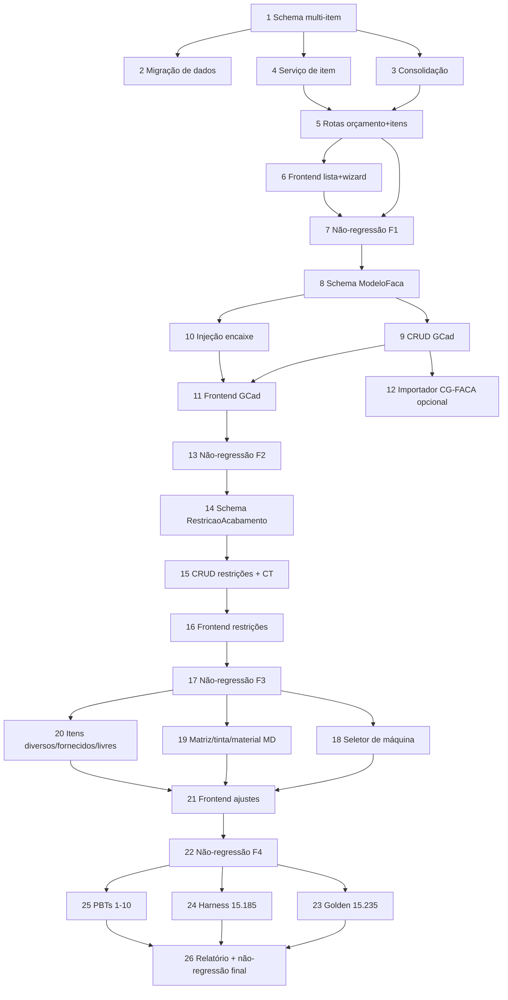

# Implementation Plan: Orçamento Gráfico Multi-Item + GCad

## Overview

Plano de implementação incremental, organizado nas 5 fases do design. Cada fase
é independentemente commitável e preserva a suíte `orcamento-grafico` verde
(não-regressão). Backend em `c:\Source\VisioFab.Wms.Back`; frontend em
`c:\Source\VisioFab.Wms.Front` (repos separados). Toda alteração de
`schema.prisma` acompanha o bloco idempotente em `migrate-prod.ts` NA MESMA task
(steering database-migrations). Validar por `get_diagnostics` + `npx vitest run
src/modules/orcamento-grafico --reporter=dot` (Postgres local parado; migração
roda no deploy; build/tsc completos travam nesta máquina).

Princípio-mestre: o motor puro `orcamento-grafico-calculo.service.ts` NÃO é
reescrito — a estrutura multi-item é um envelope que o chama 1x por item e soma;
GCad/restrições/máquina entram como pontos de injeção em campos opcionais.

## Task Dependency Graph



```json
{
  "waves": [
    { "wave": 1, "tasks": ["1"] },
    { "wave": 2, "tasks": ["2", "3", "4"] },
    { "wave": 3, "tasks": ["5"] },
    { "wave": 4, "tasks": ["6"] },
    { "wave": 5, "tasks": ["7"] },
    { "wave": 6, "tasks": ["8"] },
    { "wave": 7, "tasks": ["9", "10"] },
    { "wave": 8, "tasks": ["11", "12"] },
    { "wave": 9, "tasks": ["13"] },
    { "wave": 10, "tasks": ["14"] },
    { "wave": 11, "tasks": ["15"] },
    { "wave": 12, "tasks": ["16"] },
    { "wave": 13, "tasks": ["17"] },
    { "wave": 14, "tasks": ["18", "19", "20"] },
    { "wave": 15, "tasks": ["21"] },
    { "wave": 16, "tasks": ["22"] },
    { "wave": 17, "tasks": ["23", "24", "25"] },
    { "wave": 18, "tasks": ["26"] }
  ]
}
```

## Tasks

### Fase 1 — Estrutura Multi-Item

- [x] 1. Schema: `ItemOrcamentoGrafico` + cabeçalho multi-item + migrate-prod idempotente
  - Adicionar o model `ItemOrcamentoGrafico` (filho de `OrcamentoGrafico`, cascade, `@@unique([orcamentoId, sequencia])`, `empresaId` denormalizado, campos de cálculo + campos novos opcionais da spec) em `prisma/schema.prisma`.
  - Adicionar ao cabeçalho `OrcamentoGrafico` (aditivo, sem DROP): `serie`, `dataOrcamento`, `custoProducaoConsolidado`, `valorTotalConsolidado`, relação `itens`.
  - Escrever os blocos idempotentes equivalentes em `prisma/migrate-prod.ts` (`CREATE TABLE IF NOT EXISTS`, índices, `ADD COLUMN IF NOT EXISTS`, FK em try/catch) conforme §3.5 do design.
  - `npx prisma generate` + `get_diagnostics` nos arquivos tocados.
  - _Requirements: 1.1, 1.2, 4.4_

- [x] 2. Migração de dados item-único → item-filho (idempotente, não-destrutiva)
  - Adicionar ao `migrate-prod.ts` o `INSERT ... SELECT ... WHERE NOT EXISTS` que cria 1 `ItemOrcamentoGrafico` (sequencia=1) por `OrcamentoGrafico` existente sem item, copiando campos de cálculo e espelhando `custo_total`→`custo_producao`, `preco_venda`→`valor_total` (design §3.6).
  - Garantir idempotência (2ª execução não cria nada) e não-destrutividade (nenhum DROP/UPDATE no cabeçalho).
  - _Requirements: 4.1, 4.4, 4.6_

- [x] 3. Serviço de consolidação (função pura) — `orcamento-grafico-consolidacao.service.ts`
  - Criar `consolidarOrcamento(itens)` que soma `custoProducao` e o Valor Total da margem selecionada de cada item, arredondando a 2 casas; orçamento sem itens → 0,00.
  - _Requirements: 3.1, 3.2, 3.3, 3.5_

- [x] 4. Serviço de item — `orcamento-grafico-item.service.ts` (`montarParamsDoItem`)
  - Extrair para esse serviço a lógica hoje inline no `POST /` e `/calcular` que resolve cadastros (suporte/papel/acabamentos/máquina) em `ParamsOrcamento` e chama `calcularOrcamentoGrafico` uma vez por item.
  - Deixar o motor puro `orcamento-grafico-calculo.service.ts` INALTERADO (apenas consumido).
  - _Requirements: 2.1, 2.2, 2.4_

- [x] 5. Rotas de orçamento multi-item e itens aninhados — `orcamento-grafico.routes.ts`
  - `POST /` (cabeçalho + itens aninhados; Nº único por empresa; conflito → 409); `GET /:id` (cabeçalho + `itens[]` + totais; `select` explícito, nunca `omit`); `PUT /:id` (preserva dados não editados).
  - `POST /:id/itens` (seq=max+1), `PUT /:id/itens/:itemId` (recalcula só este item + consolida), `DELETE /:id/itens/:itemId` (reconsolida, zera se vazio).
  - `POST /:id/itens/:itemId/calcular` e `/simular-tiragens`; Zod do cabeçalho e do item (campos novos opcionais) §5.3; isolamento por `empresaId` explícito.
  - _Requirements: 1.3, 1.4, 1.5, 1.6, 1.7, 2.3, 3.4_

- [x] 6. Frontend: orçamento com lista de itens + wizard por item (`c:\Source\VisioFab.Wms.Front`)
  - Converter `orcamento-grafico/[id]` e `.../novo` para cabeçalho comercial + tabela "Itens do Orçamento" (seq, linha de produto, tiragem, valor total) + botões Novo/Editar/Remover item + rodapé com totais consolidados.
  - Reaproveitar os steps existentes dentro de um wizard por item; cada item persistido via as rotas da task 5. `get_diagnostics`.
  - _Requirements: 1.2, 2, 3_

- [x] 7. Não-regressão da Fase 1
  - Rodar `npx vitest run src/modules/orcamento-grafico --reporter=dot` e exigir 0 falhas novas.
  - _Requirements: 4.3_

### Fase 2 — Catálogo de Facas / Modelos (GCad)

- [x] 8. Schema `ModeloFaca` + migrate-prod idempotente
  - Adicionar o model `ModeloFaca` (`CG-FACA-*` ou código livre; cliente/modelo/serviço/dimensões/repetição/formato de corte/tipo cartucho/suporte/gramatura/status; `@@unique([empresaId, codigo])`) + relação `onDelete: Restrict` em `ItemOrcamentoGrafico.modeloFaca`.
  - Bloco idempotente correspondente em `migrate-prod.ts`; `prisma generate` + `get_diagnostics`.
  - _Requirements: 5.1, 5.6_

- [x] 9. CRUD backend de `ModeloFaca` — `/modelos-faca`
  - `GET` (paginado, filtros `cliente`/`modelo` contains case-insensitive), `POST`/`PUT` (validações obrigatórios + dimensões/encaixe > 0), `DELETE` (409 se vinculado a item — checar antes do delete). Zod §5.1; isolamento `empresaId`.
  - _Requirements: 5.2, 5.3, 5.4, 5.5, 5.6_

- [x] 10. Ponto de injeção do encaixe por GCad no envelope
  - Em `montarParamsDoItem`: com `modeloFacaId`, setar `aproveitamentoManual = linhas × colunas`, sobrescrever geometria (formato de corte/medidas/suporte); sem modelo, manter encaixe geométrico (legado); rejeitar se linhas/colunas ≤ 0. Motor puro inalterado.
  - _Requirements: 6.1, 6.2, 6.3, 6.4, 6.5, 6.6, 6.7_

- [x] 11. Frontend: cadastro de `ModeloFaca` + seleção (botão NC) no wizard (`c:\Source\VisioFab.Wms.Front`)
  - Tela `orcamento-grafico/cadastros/modelos-faca` (CRUD) + item no `ModuleSidebar`.
  - Botão "NC"/modal "Seleção de Modelos (GCad)" no `StepPapel` (filtro cliente/modelo; colunas do Calcgraf); selecionar preenche geometria/encaixe + recálculo; reusar `EncaixeVisual`. `get_diagnostics`.
  - _Requirements: 5, 6.1, 6.2_

* [x] 12. (Opcional) Importador `CG-FACA-*` do backup Calcgraf — DISPENSADA (sem dados)
  - INVESTIGADO: o backup exportado (`cartoon/export/*.json`) NÃO contém tabela de modelos/facas/GCad. Os 20 arquivos disponíveis são: Atividades, CalculoAtividadesParams, CentroCustoHora, CentrosCusto, CentrosProducao, CentrosProducaoxTiragensProdHora, Clientes, finRateiosCentrosCusto, FormatosPapel(+Full), Fornecedores, GerCustoFixoMes, golden-orcamento, Itc, Produtos, Suportes(+Full), TabelasCusto(+Detalhe), Vendedores. Nenhum traz geometria de faca/encaixe (linhas×colunas) nem código `CG-FACA-*`.
  - DECISÃO: o cadastro de `ModeloFaca` (GCad) é **MANUAL** no Vizor (tela `orcamento-grafico/cadastros/modelos-faca`, Task 11). Não há fase `facas` a adicionar em `scripts/importar-calcgraf.ts`. Se um export de GCad for obtido futuramente, criar a fase então.
  - _Requirements: 5.1_

- [x] 13. Não-regressão da Fase 2
  - `npx vitest run src/modules/orcamento-grafico --reporter=dot` — 18 arquivos, 122 testes, 0 falhas. Diagnostics limpos nos arquivos tocados (item.service.ts, routes.ts).
  - _Requirements: 4.3_

### Fase 3 — Restrições por Atividade de Acabamento

- [x] 14. Schema `RestricaoAcabamento` + flag `exigeRestricao` + migrate-prod
  - Adicionar model `RestricaoAcabamento` (filho de `AcabamentoGrafico`, cascade, `empresaId` denormalizado, nome/tempoAcertoMin/tempoOperacaoMin) + coluna `exigeRestricao Boolean @default(false)` em `AcabamentoGrafico`.
  - Blocos idempotentes em `migrate-prod.ts`; `prisma generate` + `get_diagnostics`.
  - _Requirements: 7.1, 7.2_

- [x] 15. CRUD de restrições + injeção no CT
  - Rotas `GET/POST/PUT/DELETE /acabamentos/:acabamentoId/restricoes` (ordenadas por nome asc) e `PUT /acabamentos/:id` aceitando `exigeRestricao`.
  - Em `montarAcabamentosRicos`: restrição selecionada sobrepõe acerto/operação no CT (submódulo `custo-transformacao.ts` inalterado); sem restrição → padrão; `exigeRestricao` sem escolha → `pendente=true` e bloqueia fechamento.
  - _Requirements: 7.3, 7.4, 7.5, 7.6_

- [x] 16. Frontend: sub-opções (restrições) por atividade no `StepAcabamentos` (`c:\Source\VisioFab.Wms.Front`)
  - CRUD de restrições na tela de acabamentos (+ checkbox "Exige restrição"); `Select` de restrições por atividade no wizard; pendência visível + bloqueio quando exigida e ausente. `get_diagnostics`.
  - _Requirements: 7.1, 7.2, 7.3, 7.6_

- [x] 17. Não-regressão da Fase 3
  - `npx vitest run src/modules/orcamento-grafico --reporter=dot` — 18 arquivos, 122 testes, 0 falhas. Diagnostics limpos (back: routes.ts + item.service.ts + schema + migrate-prod; front: acabamentos/page.tsx + StepAcabamentos.tsx + novo/page.tsx + ItemWizardModal.tsx).
  - _Requirements: 4.3_

### Fase 4 — Ajustes de Calibração e UI

- [x] 18. Seletor de máquina de impressão (backend)
  - `montarParamsDoItem` carrega `CentroProducao` por `{ id: maquinaId, empresaId }` e popula `maquinaImpressao` (velocidade/custoHora/formato/pinça/acertoPorCorMin/tempoSetupMin); fallback "1ª IMPRESSAO ativa por posição" só para legado sem `maquinaId`. CONFIRMADO: a máquina selecionada é a usada; `acertoPorCorMin`/`custoHora` dela alimentam o CT. Nenhuma mudança de código necessária no backend — bloqueio por "cores≥1 sem máquina" é do frontend (Task 21); o erro "Nenhuma máquina de impressão encontrada" (404) já cobre Req 8.5. Não foram adicionados bloqueios novos para não quebrar o fallback legado/suíte.
  - _Requirements: 8.1, 8.2, 8.3, 8.4, 8.5, 8.6_

- [x] 19. Matriz no MD + tinta cobertura/direto + preço material acabamento (backend)
  - Matriz (Req 10): campo `matriz?: {quantidade, precoUnitario}` no `ItemOrcamentoInput`; `montarInputDoItem` repassa `body.matriz`. No `montarParamsDoItem`, quando `quantidade>0`, adiciona `{descricao:'Matriz de Impressão', valor: quantidade×precoUnitario}` à lista combinada de `itensDiversos` → o motor soma como CUSTO FIXO no MD (não escala com tiragem). Sem matriz → MD inalterado.
  - Tinta (Req 11): campo `tinta?: {modo:'COBERTURA'} | {modo:'CONSUMO_DIRETO',consumoKg,precoKg}`. COBERTURA/ausente = comportamento legado (SPANKS via coefTinta ou legado por cobertura). CONSUMO_DIRETO: (a) não resolve `coefTintaSuporte` (undefined → sai do SPANKS), (b) passa as cores com `coberturaPercent=0` (anula a tinta por cobertura no modelo legado, custo=0), (c) soma `consumoKg×precoKg` como item diverso 'Tinta (consumo direto)' no MD. O nº de cores do input é PRESERVADO (`numCoresImpressao=input.cores.length`) para o acerto por cor/CT da impressão ficarem corretos.
  - Material de acabamento (Req 9): CONFIRMADO já correto em `montarAcabamentosRicos` (override do item tem precedência sobre o cadastro) + motor (bloco MAT.ACABAMENTO: subtotal = consumo×preço arred. 2 casas no MD). Não alterado.
  - _Requirements: 9.1, 9.2, 9.3, 9.4, 9.5, 9.6, 9.7, 10.1, 10.2, 10.3, 10.4, 10.5, 11.1, 11.2, 11.3, 11.4, 11.5_

- [x] 20. Itens Diversos / Fornecidos / Campos Livres (backend)
  - CONFIRMADO já correto: Item Diverso `fixo:true` → `valor` (não escala); `fixo:false` → `valor×quantidade` (escala com a quantidade informada) no `montarInputDoItem`. `itensFornecidos` mapeados com `valor:0` (fora do MD, não afetam o cálculo). `camposLivres` são textuais, só persistência (`dadosPersistenciaItem`). Validações de faixa já no `itemOrcamentoBodySchema` (§5.3). Sem mudança de motor.
  - _Requirements: 12.1, 12.2, 12.3, 12.4, 12.5, 12.6_

- [x] 21. Frontend: seletor de máquina, tinta toggle, matriz, Step Itens Diversos/Fornecidos/Campos Livres (`c:\Source\VisioFab.Wms.Front`)
  - `StepCores`: seção "Impressão" acima das cores — `Select` de máquina IMPRESSAO ativa (via `GET /centros-producao?status=true`, filtro `tipoProcesso.codigo==='IMPRESSAO'` ou descrição `impress`, options `{value:id, label:descricao||codigo}`, clearable); `Alert` amarelo "Nenhuma máquina de impressão ativa cadastrada" quando vazio; `Alert` vermelho "Selecione a máquina de impressão" quando `cores>=1 && !maquinaId` (Req 8.4, só visual). `SegmentedControl` tinta COBERTURA/CONSUMO_DIRETO; no modo direto exibe `NumberInput` consumo (kg, min 0.001, scale 3) + preço (R$/kg, min 0.01, scale 2). Matriz: `NumberInput` qtd (min 0, scale 0) + preço unitário (R$, min 0, scale 2) com texto "A matriz entra no Material Direto como custo fixo".
  - Novo `novo/StepItensDiversos.tsx` (reusado também no `ItemWizardModal`): 3 tabelas editáveis — Itens Diversos (máx 50; descrição/qtd/valor/Switch "Fixo"), Itens Fornecidos (máx 50; descrição/qtd; texto "não entra no Material Direto"), Campos Livres (máx 20; rótulo maxLength 50 / conteúdo maxLength 500). Botão "Adicionar" desabilitado ao atingir o máximo.
  - Fluxo dos DOIS wizards: 'Diversos' inserido entre 'Acabamentos' e 'Revisão'; `novo/page.tsx` índices 5 Acabamentos / 6 Diversos / 7 Revisão (nextStep→7, canAdvance case 6 opcional + case 7 quantidade, botões Salvar/Enviar em `active===7`); `ItemWizardModal` índices 4/5/6 (nextStep dinâmico via `STEP_LABELS.length-1`, canAdvance case 5 opcional + case 6 quantidade). `WizardFormData`/`INITIAL_FORM`/`INITIAL_ITEM` + `ItemParaEditar` estendidos; payload de ambos os `salvar()` envia `maquinaId`/`matriz`/`tinta`/`itensDiversos`/`itensFornecidos`/`camposLivres`; `itemParaForm` e o load de edição mapeiam de volta (tintaPrecoKg não vem da API → null).
  - `get_diagnostics` limpo em novo/page.tsx, StepCores.tsx, StepItensDiversos.tsx, [id]/ItemWizardModal.tsx.
  - _Requirements: 8, 10, 11, 12_

- [x] 22. Não-regressão da Fase 4
  - `npx vitest run src/modules/orcamento-grafico --reporter=dot` — 18 arquivos, 122 testes, 0 falhas. Diagnostics limpos (back: item.service.ts + routes.ts; front: novo/page.tsx + StepCores.tsx + StepItensDiversos.tsx + ItemWizardModal.tsx).
  - _Requirements: 4.3_

### Fase 5 — Validação Golden e Propriedades

- [x] 23. Golden 15.235 (item único, não-regressão) no fluxo multi-item
  - Reusar/estender `calibracao/golden-acabamentos-15235.{fixture,test}.ts` para passar pelo envelope (1 item) e confrontar os 6 componentes + totais ≤0,5% (tiragem 20.000).
  - _Requirements: 13.1, 13.2, 13.3, 13.4_

- [x] 24. Harness golden 15.185 (multi-item) — esqueleto
  - Criado `calibracao/golden-15185.fixture.ts` (cabeçalho + PARTE 01 + PARTE 02; interface `Golden15185`; flag `PENDENTE_TRANSCRICAO=true`; estrutura preenchida com `input`/alvos `null` como placeholders + `// TODO(usuário)` em cada campo; `tolerancia=0.005`) e `calibracao/golden-15185.test.ts` (importa `consolidarOrcamento`+`FechamentoItem`; `it.todo` por item + `it.todo` do Total consolidado enquanto pendente; bloco `if (!PENDENTE_TRANSCRICAO)` já escrito confrontando C.Prod por item ≤0,5% + Total consolidado via `consolidarOrcamento` ≤ R$0,01).
  - **PENDENTE DO USUÁRIO**: os VALORES-ALVO do print do Calcgraf 15.185 ainda NÃO foram transcritos. O harness está pronto e roda honestamente em modo `it.todo`/skip (0 testes executados, 0 falhas). Quando o usuário transcrever `input`/alvos de cada item + `cabecalho.totalConsolidado` e trocar `PENDENTE_TRANSCRICAO` para `false`, o confronto é habilitado automaticamente. NOTA: sem motor-por-item puro acessível sem banco, o C.Prod por item é confrontado via coerência dos alvos (Σ itens = total); o cálculo real do motor fica para a validação na tela/produção.
  - Validado: `get_diagnostics` limpo nos 2 arquivos; `npx vitest run src/modules/orcamento-grafico/calibracao/golden-15185.test.ts --reporter=dot` → 1 arquivo skipped, 3 todo, 0 falhas.
  - _Requirements: 13.5_

- [x] 25. Property-based tests (fast-check, ≥100 iterações) — Properties 1–10 do design
  - P1 consolidação, P2 equivalência legado (estender existente), P3 imposição GCad, P4/P10 custo fixo/variável, P5 isolamento item, P6 gross-up, P7 MD precedência, P8 sequência item, P9 CT máquina/restrição.
  - Cada teste anotado `// Feature: orcamento-grafico-multi-item-gcad, Property N: {texto}`.
  - FEITO: 8 arquivos novos em `calibracao/` (`pbt-consolidacao`, `pbt-gcad-imposicao`, `pbt-custo-fixo` [P4+P10], `pbt-isolamento-item`, `pbt-grossup`, `pbt-md-precedencia`, `pbt-sequencia-item`, `pbt-ct-maquina-restricao`) + anotação da Property 2 no topo do `pbt-equivalencia-legado.test.ts` (lógica preservada). Todos exercitam o MOTOR puro / funções puras (consolidação, gross-up) com `fc.assert(..., { numRuns: 300|200 })`; propriedades que no design falam de "item/GCad/máquina/restrição" (P3/P5/P7/P9) testam a lógica pura subjacente ao envelope-com-banco (documentado em comentário em cada arquivo). `get_diagnostics` limpo nos 9 arquivos.
  - VALIDADO: `npx vitest run src/modules/orcamento-grafico --reporter=dot` → **27 arquivos passed, 1 skipped (golden-15185 pendente de transcrição), 148 testes passed + 3 todo, 0 falhas** (subiu de 122 → 148: +26 testes PBT). Os 8 arquivos novos isolados: 8 passed, 24 tests, 0 falhas.
  - _Requirements: 14.1, 14.2, 14.3, 14.4_

- [x] 26. Relatório consolidado + não-regressão final
  - `GET /:id/relatorio` apresenta componentes/totais por item + total do orçamento (§5.3). FEITO (aditivo, sem quebrar o legado nem o `relatorio.pdf`):
    - Serviço `orcamento-grafico-relatorio.service.ts`: nova função PURA `montarRelatorioConsolidado(d)` + interfaces `RelatorioItemConsolidado`/`RelatorioConsolidado`/`DadosRelatorioConsolidado`. Reusa `montarRelatorio` por item (6 componentes + custoProducao + cev + margens); compõe `custoProducao`/`valorTotal`/`margemSelecionada` por item; totais do orçamento vêm de `custoProducaoConsolidado`/`valorTotalConsolidado` passados (já calculados no cabeçalho). Itens ordenados por sequência; `data` = hoje pt-BR (mesmo padrão do serviço). Assinatura de `montarRelatorio` INALTERADA.
    - Rota `GET /:id/relatorio`: busca agora inclui `serie` + totais consolidados do cabeçalho + `itens[]` (select explícito: sequencia, descricao, resultadoCalculo, quantidade, custoProducao, valorTotal, margemSelecionada), multi-tenant por empresaId. SE `itens.length > 0` → retorna `montarRelatorioConsolidado` (cada item com seu `resultadoCalculo` como `resultado`, `quantidade` do item, totais consolidados do cabeçalho); itens com `resultadoCalculo` null são PULADOS (documentado — mais simples/robusto; a soma do cabeçalho não depende da presença no relatório). SENÃO → comportamento legado EXATO (`montarRelatorio` do `resultadoCalculo` do cabeçalho). O 400 "Orçamento sem resultado de cálculo" só no caso legado sem resultado. `relatorio.pdf` intocado.
  - `get_diagnostics` limpos nos 2 arquivos (serviço + rotas).
  - NÃO-REGRESSÃO FINAL (inclui os PBTs da Task 25): `npx vitest run src/modules/orcamento-grafico --reporter=dot` → **27 arquivos passed | 1 skipped (golden-15185 pendente de transcrição), 148 testes passed | 3 todo, 0 falhas** (4,25s). Confirmado 0 falhas.
  - _Requirements: 13.6, 13.7, 4.3_

## Notes

- **Repos separados:** tasks de frontend ficam em `c:\Source\VisioFab.Wms.Front`; o restante em `c:\Source\VisioFab.Wms.Back`.
- **Migração:** Postgres local está parado nesta máquina — validar schema por `get_diagnostics` + `prisma generate`; a migração idempotente roda no deploy. Rodar `migrate-prod.ts` 2× (idempotência) quando houver ambiente.
- **Verificação:** build/tsc completos travam — usar `get_diagnostics` nos arquivos tocados + `npx vitest run src/modules/orcamento-grafico --reporter=dot` (reporter `dot`, não `basic`).
- **Não-regressão:** cada fase termina com a suíte `orcamento-grafico` em 0 falhas novas.
- **Dependências do usuário (fora do caminho de código):** transcrever o print do 15.185 para `golden-15185.fixture.ts` (destrava a task 24); validação final na tela em produção (criar o 15.235 na Wega, conferir com o Relatório Calcgraf); confirmar se o backup tem tabela de modelos/GCad (destrava/dispensa a task 12).
