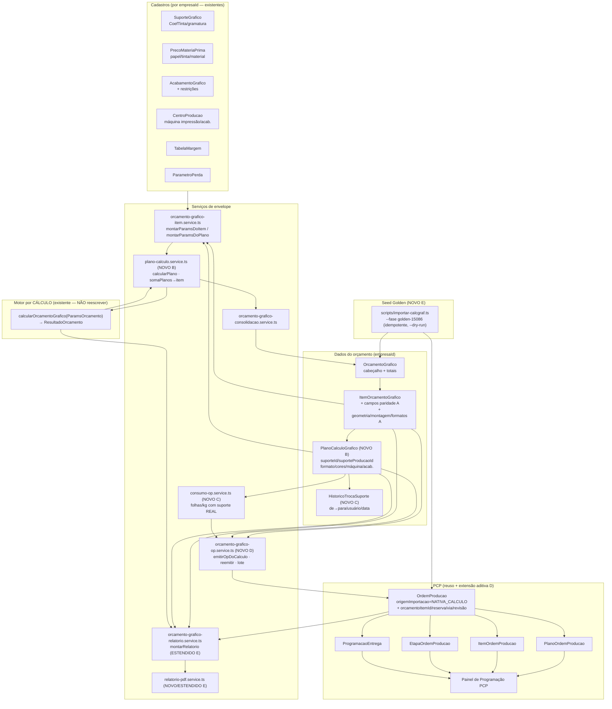
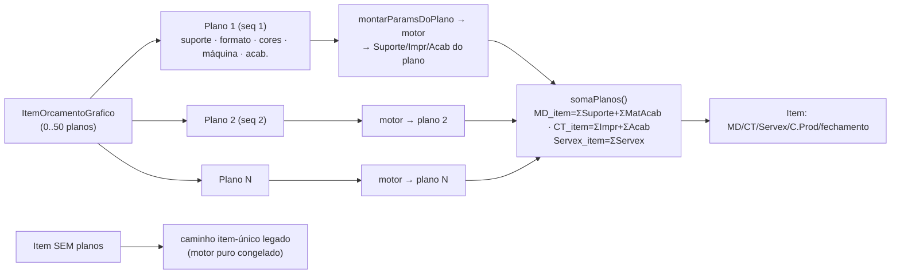
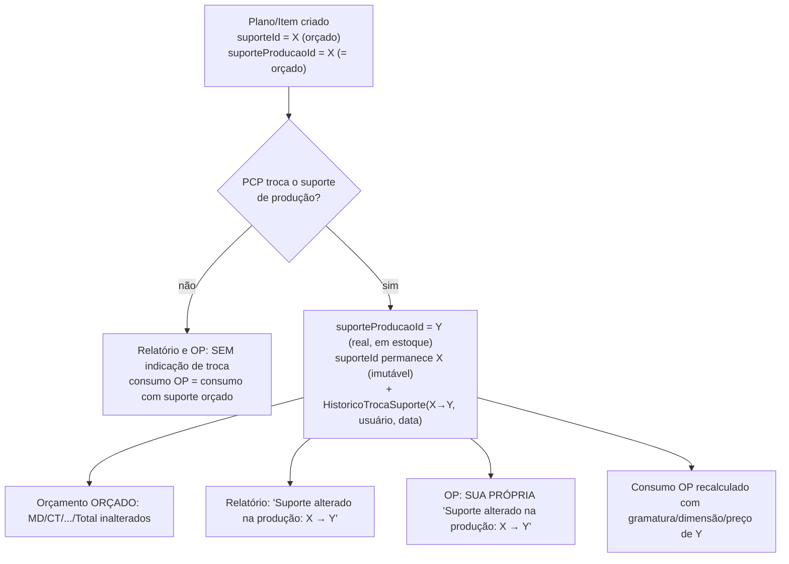
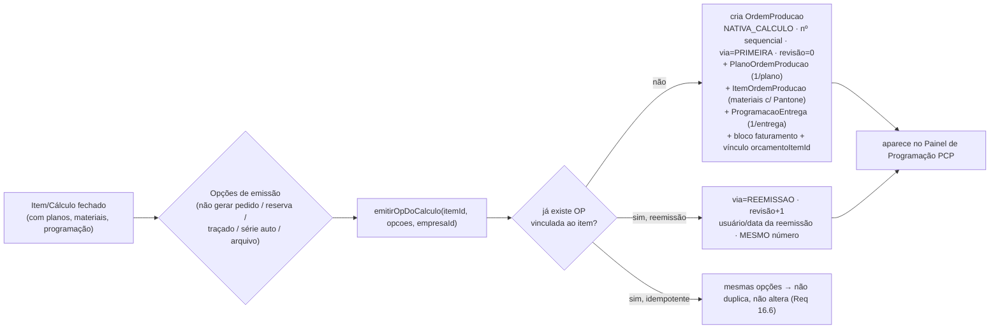

# Design Document — Orçamento Gráfico: OP Nativa, Relatório Fiel e Paridade

## Overview

### 1. Visão Geral e Princípios de Design

Esta spec fecha a **paridade total do fluxo gráfico do Calcgraf/GPrint** no Vizor:
leva o módulo de Orçamento Gráfico de "calcula e orça" para "calcula, orça, **gera OP
nativa** e **emite o relatório oficial fiel ao pré-cálculo**", batendo número a número
(desvio ≤ 0,5%) com o Calcgraf, **sem depender da importação do PDF de OP**. A
importação de PDF permanece intacta como caminho alternativo/legado.

O trabalho se apoia na spec concluída `orcamento-grafico-multi-item-gcad` (cabeçalho +
N itens, `ItemOrcamentoGrafico`, consolidação, `ModeloFaca`/GCad, restrições de
acabamento, seletor de máquina, matriz/tinta/materiais no MD, itens
diversos/fornecidos/campos livres, relatório por item e consolidado) e no módulo PCP
existente (`OrdemProducao` e filhas `ItemOrdemProducao`, `EtapaOrdemProducao`,
`PlanoOrdemProducao`, `ProgramacaoEntrega`). Os documentos de referência são os do
cálculo **15.086** / orçamento **5.316** / OP **3.149** (Cartucho CIMED Super Fresh,
cliente ICEFRESH código 903, vendedor IGOR ARNEIRO, tiragem 100.000, troca de suporte
222 → 234).

A spec cobre cinco frentes:

- **A — Campos faltantes do Cálculo Gráfico**: paridade (sigla acabado, tributação,
  processo de impressão, cobertura de tinta, fabricante, microondulado, fornecido,
  modelos, acondicionamento, observações, ARTE) e geometria/formatos que **afetam** o
  cálculo (montagem linhas×colunas, formato suporte, formato de corte, ajuste micro).
- **B — Planos por Cálculo**: novo nível `PlanoCalculoGrafico` abaixo de
  `ItemOrcamentoGrafico`; custo do item = soma dos planos; item sem planos = caminho
  legado item-único inalterado.
- **C — Troca de suporte Orçamento → Produção**: `suporteId` (orçado) +
  `suporteProducaoId` (real) por plano (ou item quando sem planos); sinalização no
  relatório e na OP; histórico; consumo da OP com suporte real sem alterar o orçamento
  orçado.
- **D — Emissão nativa de OP a partir do Cálculo** (`origemImportacao =
  'NATIVA_CALCULO'`): cabeçalho/revisão/reemissão, programação de entrega,
  planos→produção, materiais consumidos, bloco de faturamento, opções de emissão,
  vínculo orçamento↔OP, presença no painel de PCP.
- **E — Relatório oficial fiel + Seed Golden**: estende `montarRelatorio` com os blocos
  faltantes (por plano; Suporte/Matriz/Tinta/MatAcab com FIXO/VARIÁVEL/UNITÁRIO/
  SUBTOTAL; Custo de Produção com créditos fiscais; Prazos; Comissões; CEV; Cond.Pagto;
  3 pontos de margem Primeiro Mil/Mil Seguinte; incluído/alterado por) + seed golden
  15.086/5.316/3.149.

### 1.1 Princípios-mestre

**(a) Fidelidade ao Calcgraf é o objetivo-mestre.** O relatório/pré-cálculo e a OP
gerados pelo Vizor devem reproduzir o Calcgraf componente a componente (Suporte, Matriz
de Impressão, Tinta, Material de Acabamento, Impressão, Acabamento), nos totais (MD, CT,
Servex, C.Prod, C.Finan, Total, CEV), nos três pontos de margem (Primeiro Mil / Mil
Seguinte) e no consumo de material da OP, com desvio ≤ 0,5% validado pelo golden case
15.086 congelado. Todo elemento de design existe para servir essa meta — ver mapa
Requisito→Design (§11).

**(b) Aditividade e NÃO-REGRESSÃO — o motor puro NÃO é reescrito.** O arquivo
`src/modules/orcamento-grafico/orcamento-grafico-calculo.service.ts`
(`calcularOrcamentoGrafico`) calcula **um** item e já bate os goldens congelados. Esta
spec **envelopa** o motor:

- Planos (frente B) são um **ENVELOPE** por plano: o `PlanoCalculoService` monta os
  `ParamsOrcamento` de cada plano, chama o motor **uma vez por plano** e **soma** os
  resultados no item. O motor continua recebendo os parâmetros de um "cálculo" e
  devolvendo o `ResultadoOrcamento` de um cálculo.
- A geometria/montagem/formatos (frente A, Req 2) entram como **ponto de injeção** no
  parâmetro `aproveitamentoManual` já existente (`montagem.linhas × montagem.colunas`),
  mais os formatos de folha em `maquinaImpressao.formatoLargura/Altura` — nunca
  reescrevem a fórmula de encaixe.
- Todos os campos novos de `ParamsOrcamento`/`ResultadoOrcamento` são
  **opcionais/aditivos**: ausentes/nulos → o motor produz resultado **idêntico, campo a
  campo** (desvio zero) ao congelado (Req 15.3). Campos de paridade (frente A, Req 1/3)
  **não** entram em `ParamsOrcamento` — ficam apenas persistidos no item/plano para
  exibição e repasse à OP (não interferem no custo — Req 1.5/3.5/16.5).
- A suíte `orcamento-grafico` (**148 testes verdes**) permanece verde (Req 15.2).

**(c) Consumo da OP ≠ custo do orçamento (frente C).** O orçamento é fechado com o
**Suporte Orçado** e permanece imutável após a troca (Req 8.2). A OP calcula o consumo
de material (folhas, kg) com o **Suporte de Produção** (Req 8.1/8.3). São dois cálculos
independentes sobre a mesma geometria: só mudam gramatura/dimensões/preço do suporte.

**(d) Reuso do PCP existente, só extensão aditiva.** A emissão nativa de OP (frente D)
**reusa** `OrdemProducao`/`ItemOrdemProducao`/`EtapaOrdemProducao`/`PlanoOrdemProducao`/
`ProgramacaoEntrega`. Só adicionamos campos aditivos onde faltam (novo valor VARCHAR
`NATIVA_CALCULO` em `origemImportacao`; vínculo `orcamentoItemId`; flags de reserva/via/
revisão/faturamento). A OP nativa cai no mesmo painel de Programação do PCP (Req 9.6).

**(e) Multi-tenant por `empresaId` em TODA query.** Toda leitura/escrita de item,
plano, suporte, relatório e OP filtra explicitamente por `empresaId` da entidade de
negócio — nunca confiando só no `prismaScoped` (bypass para SUPER_ADMIN; steering
`ATENCAO-pontos-verificar.md`). As entidades filhas sem `empresaId` natural
(`PlanoCalculoGrafico`, histórico de troca) carregam `empresaId` denormalizado **e** o
isolamento pela relação com o item/orçamento pai.

### 1.2 Implementação faseada

| Fase | Entrega | Requisitos |
|---|---|---|
| **Fase 1** | Campos de paridade + geometria/montagem/formatos + acondicionamento/observações/ARTE no `ItemOrcamentoGrafico` + migração | 1, 2, 3 |
| **Fase 2** | `PlanoCalculoGrafico` — model + cálculo por plano (envelope) + consolidação no item + relatório por plano | 4, 5 |
| **Fase 3** | Suporte orçado × produção + sinalização (relatório e OP) + histórico de troca | 6, 7 |
| **Fase 4** | Emissão nativa de OP (cabeçalho/revisão, programação, planos, materiais, faturamento, opções, vínculo, painel) | 9, 10, 11 |
| **Fase 5** | Relatório fiel completo (HTML+PDF) + seed golden 15.086/5.316/3.149 | 12, 13 |
| **Fase 6** | Validação golden 15.086 + property-based (transversais 14/16) + não-regressão final | 8, 14, 15, 16 |

Cada fase é independentemente commitável e preserva a suíte verde. As fases 1–3 só
acrescentam campos opcionais ao item/plano e extensões aditivas ao envelope; a frente D
só adiciona campos aditivos ao PCP. O motor puro permanece intocado em todas as fases.

### 1.3 Restrições técnicas transversais

- `prisma/schema.prisma` e `prisma/migrate-prod.ts` alterados **no mesmo commit**, bloco
  idempotente (`CREATE TABLE IF NOT EXISTS` / `ADD COLUMN IF NOT EXISTS` / índices; FK em
  `try/catch`), testado rodando `migrate-prod.ts` 2× (steering `database-migrations.md`).
  Postgres local está parado — a migração roda no deploy, por isso a idempotência é
  obrigatória (Req 15.4/15.5).
- Enums gravados como **VARCHAR** (sem `CREATE TYPE`) — Req 15.4.
- Em queries de `OrcamentoGrafico`/`ItemOrcamentoGrafico` usar **`select` explícito**,
  nunca `omit`; em `OrdemProducao` nunca materializar `pdfData` à toa (steering pcp §9).
- Build/`tsc` completos TRAVAM nesta máquina — validar por `get_diagnostics` +
  `npx vitest run src/modules/orcamento-grafico --reporter=dot` (o reporter `basic` foi
  removido nesta versão do vitest). FK em `try/catch`; `prisma generate` valida o schema.

## Architecture

### 2. Arquitetura

### 2.1 Camadas e componentes



### 2.2 Fluxo "Item 1→N Planos, cada plano calcula, item soma"



Princípio central: **cada plano calcula com exclusivamente os seus parâmetros** (Req
5.1), e o item consolida como soma dos planos (Req 5.2). Item **sem** planos usa o
caminho item-único legado, idêntico ao congelado (Req 5.5). Mapeia 1:1 ao Calcgraf (um
Cálculo pode ter N Planos; o Cálculo soma).

### 2.3 Fluxo da troca de suporte Orçamento → Produção (frente C)



### 2.4 Fluxo da emissão nativa de OP (frente D)



### 2.5 Organização de arquivos (backend)

| Arquivo | Papel | Novo/Alterado |
|---|---|---|
| `orcamento-grafico-calculo.service.ts` | Motor puro por cálculo | **inalterado** (só uso de `aproveitamentoManual` já existente p/ montagem) |
| `orcamento-grafico-item.service.ts` | `montarParamsDoItem` / `montarParamsDoPlano` (resolve cadastros→`ParamsOrcamento`) | **alterado** (geometria/montagem/formatos; monta por plano) |
| `plano-calculo.service.ts` | Envelope por plano: `calcularPlano`, `somaPlanos` (puro) | **novo** (B) |
| `orcamento-grafico-consolidacao.service.ts` | Soma dos itens no orçamento | **inalterado** (recebe fechamento já somado dos planos) |
| `consumo-op.service.ts` | Consumo (folhas/kg) com suporte real; identidade quando sem troca | **novo** (C) — função pura |
| `troca-suporte.service.ts` | Aplica troca, grava `HistoricoTrocaSuporte`, monta rótulo de sinalização | **novo** (C) |
| `orcamento-grafico-op.service.ts` | Emite OP nativa do cálculo (cabeçalho/planos/materiais/entregas/faturamento/opções/reemissão/lote) | **novo** (D) |
| `orcamento-grafico-relatorio.service.ts` | `montarRelatorio` fiel (blocos por plano, prazos, comissões, CEV, cond.pagto, 3 margens, incluído/alterado) | **alterado** (E) |
| `relatorio-pdf.service.ts` | PDF do relatório oficial (pdfkit), mesmo conteúdo do HTML | **novo/estendido** (E) |
| `orcamento-grafico.routes.ts` | Rotas (campos A, planos B, troca C, emissão OP D, relatório E) | **alterado** |
| `scripts/importar-calcgraf.ts` | Fase `golden-15086` (seed idempotente, `--dry-run`) | **alterado** (E) |

## Data Models

### 3. Modelo de Dados (Prisma)

Todas as alterações são **aditivas**: colunas novas opcionais em models existentes
(`ItemOrcamentoGrafico`, `OrdemProducao`) e dois models novos (`PlanoCalculoGrafico`,
`HistoricoTrocaSuporte`). Nenhum `DROP`. Enums como VARCHAR. Cada bloco tem equivalente
idempotente em `migrate-prod.ts` no mesmo commit (§3.6).

### 3.1 Extensão de `ItemOrcamentoGrafico` (frente A)

Campos **de paridade** (Req 1/3 — não entram no motor) e **de geometria/formatos** (Req
2 — alimentam `aproveitamentoManual` e os formatos de folha). O item mantém também o
par suporte orçado/produção para o caso **sem planos** (Req 6.1).

```prisma
model ItemOrcamentoGrafico {
  // ... todos os campos atuais permanecem ...

  // ── Frente A: Campos de Paridade (Req 1) — NÃO afetam o custo ──
  siglaAcabado        String?  @map("sigla_acabado") @db.VarChar(60)
  tributacao          String?  @db.VarChar(60)
  processoImpressao   String?  @map("processo_impressao") @db.VarChar(60)
  coberturaTintaTexto String?  @map("cobertura_tinta_texto") @db.VarChar(60)
  fabricante          String?  @db.VarChar(120)
  microondulado       Boolean  @default(false)
  fornecido           Boolean  @default(false)
  qtdModelos          Int      @default(0) @map("qtd_modelos") // Req 1.2 (>= 0)
  arte                String?  @db.VarChar(60)                 // Req 3.3 (ex.: NOVA)
  observacao          String?  @db.VarChar(1000)              // Req 3.3
  observacaoAreasOp   String?  @map("observacao_areas_op") @db.VarChar(1000) // Req 3.3
  conteudoVolume      Int?     @map("conteudo_volume")        // Req 3.2 (>= 1)
  acondicionamento    Json?    // [{descricao}] 0..20 (Req 3.1)

  // ── Frente A: Geometria/formatos (Req 2) — AFETAM o cálculo ──
  comprimentoMm   Decimal? @map("comprimento_mm") @db.Decimal(10, 2) // > 0
  larguraMm       Decimal? @map("largura_mm") @db.Decimal(10, 2)     // > 0
  alturaMm        Decimal? @map("altura_mm") @db.Decimal(10, 2)      // > 0
  abaColaMm       Decimal? @map("aba_cola_mm") @db.Decimal(10, 2)    // >= 0
  abaFechamentoMm Decimal? @map("aba_fechamento_mm") @db.Decimal(10, 2) // >= 0
  fibra           Boolean  @default(false)
  montagemLinhas  Int?     @map("montagem_linhas")   // >= 1 (Req 2.2)
  montagemColunas Int?     @map("montagem_colunas")  // >= 1 (Req 2.2)
  formatoSupLarguraMm   Decimal? @map("formato_sup_largura_mm") @db.Decimal(10, 2) // > 0
  formatoSupAlturaMm    Decimal? @map("formato_sup_altura_mm") @db.Decimal(10, 2)  // > 0
  formatoCorteLarguraMm Decimal? @map("formato_corte_largura_mm") @db.Decimal(10, 2) // > 0
  formatoCorteAlturaMm  Decimal? @map("formato_corte_altura_mm") @db.Decimal(10, 2)  // > 0
  ajusteCorteMicroMm    Decimal? @default(0) @map("ajuste_corte_micro_mm") @db.Decimal(10, 2) // >= 0

  // ── Frente C: suporte orçado/produção quando o item NÃO tem planos (Req 6.1) ──
  suporteProducaoId String? @map("suporte_producao_id") // inicia = suporteId (Req 6.2)

  planos PlanoCalculoGrafico[]
  historicoTrocaSuporte HistoricoTrocaSuporte[]
}
```

> `acondicionamento` como JSON de `[{descricao}]` (0..20, cada descrição 1..100) —
> paridade pura (Req 3.1/3.5). Os campos de geometria são opcionais: ausentes → encaixe
> legado (Req 2.7). `suporteId` já existe no item; `suporteProducaoId` é adicionado.

### 3.2 Novo model `PlanoCalculoGrafico` (frente B)

Filho de `ItemOrcamentoGrafico` (cascade), com sequência única por item **sem
renumerar** ao remover (lacunas permitidas — Req 4.4). Cada plano tem suporte orçado +
produção, formato, pré-impressão, impressão (cores + máquina) e acabamentos próprios.

```prisma
/// Plano de Cálculo de um Item de Orçamento Gráfico (frente B). Um Item pode ter
/// 0..50 planos; item SEM planos = caminho item-único legado inalterado. Custo do
/// item = soma dos planos. Suporte orçado (suporteId) + produção (suporteProducaoId).
/// Multi-tenant por empresaId denormalizado + relação com o item. Enums VARCHAR.
model PlanoCalculoGrafico {
  id        String @id @default(uuid())
  itemId    String @map("item_id")
  empresaId String @map("empresa_id") // denormalizado p/ filtro multi-tenant direto
  sequencia Int    // único por item; NÃO renumera ao remover (Req 4.3/4.4)
  nome      String @db.VarChar(60) // "Cartão", "Cartão (M)" (Req 4.1)

  // ── Suporte orçado × produção (Req 6.1) ──
  suporteId         String? @map("suporte_id")           // orçado
  suporteProducaoId String? @map("suporte_producao_id")  // real (inicia = orçado)
  gramatura         Decimal? @db.Decimal(6, 2)

  // ── Formato do plano (Req 4.1) ──
  formatoLarguraMm Decimal @map("formato_largura_mm") @db.Decimal(10, 2) // > 0
  formatoAlturaMm  Decimal @map("formato_altura_mm") @db.Decimal(10, 2)  // > 0

  // ── Pré-impressão / Impressão (Req 4.1) ──
  preImpressao Json?   @map("pre_impressao") // parâmetros de pré-impressão
  numCores     Int     @default(0) @map("num_cores") // 0..12 (Req 4.5)
  cores        Json?   // [{nome, tipo, cobertura%, precoKg, ...}]
  maquinaId    String? @map("maquina_id") // CentroProducao IMPRESSAO

  // ── Acabamentos próprios do plano (ricos) ──
  acabamentosRicos Json? @map("acabamentos_ricos")

  // ── Resultado por plano (espelho p/ a soma do item) ──
  resultadoCalculo Json?    @map("resultado_calculo") // ResultadoOrcamento do motor
  custoSuporte     Decimal? @map("custo_suporte") @db.Decimal(14, 2)
  custoImpressao   Decimal? @map("custo_impressao") @db.Decimal(14, 2)
  custoAcabamento  Decimal? @map("custo_acabamento") @db.Decimal(14, 2)

  criadoEm     DateTime @default(now()) @map("criado_em")
  atualizadoEm DateTime @updatedAt @map("atualizado_em")

  item                  ItemOrcamentoGrafico    @relation(fields: [itemId], references: [id], onDelete: Cascade)
  historicoTrocaSuporte HistoricoTrocaSuporte[]

  @@unique([itemId, sequencia])
  @@index([empresaId])
  @@index([itemId])
  @@map("plano_calculo_grafico")
}
```

### 3.3 Novo model `HistoricoTrocaSuporte` (frente C)

Registra cada troca de suporte de produção (de→para, usuário, data), ligado ao plano
(ou ao item quando sem planos) — Req 7.4.

```prisma
/// Histórico de troca do Suporte de Produção (frente C, Req 7.4). Um registro por
/// troca: suporte orçado anterior, novo suporte de produção, usuário e data/hora.
/// Ligado ao plano (planoId) OU ao item (itemId) — um dos dois preenchido.
/// Multi-tenant por empresaId.
model HistoricoTrocaSuporte {
  id                 String   @id @default(uuid())
  empresaId          String   @map("empresa_id")
  itemId             String?  @map("item_id")
  planoId            String?  @map("plano_id")
  suporteAnteriorId  String?  @map("suporte_anterior_id") // suporte de produção antes da troca
  suporteNovoId      String   @map("suporte_novo_id")     // novo suporte de produção
  usuarioId          String?  @map("usuario_id")
  trocadoEm          DateTime @default(now()) @map("trocado_em")

  item  ItemOrcamentoGrafico? @relation(fields: [itemId], references: [id], onDelete: Cascade)
  plano PlanoCalculoGrafico?  @relation(fields: [planoId], references: [id], onDelete: Cascade)

  @@index([empresaId])
  @@index([itemId])
  @@index([planoId])
  @@map("historico_troca_suporte")
}
```

### 3.4 Extensão aditiva de `OrdemProducao` (frente D)

A OP nativa **reusa** `OrdemProducao` e suas filhas. Só adicionamos campos aditivos:

```prisma
model OrdemProducao {
  // ... todos os campos atuais permanecem (origemImportacao ganha o valor
  //     'NATIVA_CALCULO'; o campo já é VARCHAR(30), nenhuma migração de tipo) ...

  // ── Frente D: vínculo e metadados da emissão nativa ──
  orcamentoItemId   String?   @map("orcamento_item_id")   // vínculo cálculo↔OP (Req 9.5)
  opReserva         Boolean   @default(false) @map("op_reserva")        // Req 11.3
  via               String?   @db.VarChar(20)             // PRIMEIRA | REEMISSAO (Req 9.2/9.3/9.4)
  revisao           Int       @default(0)                 // incrementa na reemissão (Req 9.4)
  emitidaPorId      String?   @map("emitida_por_id")      // quem emitiu (1ª via)
  emitidaEm         DateTime? @map("emitida_em")
  reemitidaPorId    String?   @map("reemitida_por_id")    // quem reemitiu
  reemitidaEm       DateTime? @map("reemitida_em")
  // Bloco de faturamento (Req 10.6) — campos de exibição/repasse
  faturamentoRazaoSocial String? @map("faturamento_razao_social") @db.VarChar(200)
  faturamentoCodCliente  String? @map("faturamento_cod_cliente") @db.VarChar(30)
  faturamentoPedidoInterno String? @map("faturamento_pedido_interno") @db.VarChar(30)
  faturamentoFichaTecnica  String? @map("faturamento_ficha_tecnica") @db.VarChar(60)
  faturamentoQtdPorAcabado Decimal? @map("faturamento_qtd_por_acabado") @db.Decimal(12, 4)

  @@index([orcamentoItemId])
}
```

> O vínculo é **item → OP** (Req 9.5): o item exibe o status da OP vinculada ("OP:
> 3149"). `ProgramacaoEntrega.codigoPedido` (já existe) guarda o nº do pedido por
> entrega (Req 10.1). O excedente da entrega vai em `ProgramacaoEntrega.observacao` ou
> no `quantidadeExcedente` da OP (já existe). Os materiais consumidos (Req 10.5) usam
> `ItemOrdemProducao` existente: `descricaoProduto` (com código/Pantone),
> `unidadeMedida` (KG/PC/UN), `quantidade`, `tipoMaterial`. Os planos de produção (Req
> 10.2) usam `PlanoOrdemProducao` existente (nome, formato, cores, tiragem, montagem,
> material, gramatura, pesoKg, aproveitamento, matriz); tempos Fixo/Variável de
> impressão/acabamento (Req 10.3/10.4) vão nas `EtapaOrdemProducao`
> (`tempoSetupMinutos`/`tempoOperacaoCalculado`) por plano, com o detalhe em
> `descricao`/`tipoColagem`.

### 3.5 Opções de emissão (não persistido como enum/tabela)

As opções da emissão (Req 11.1) são **parâmetros de requisição**, não estado
persistido: `naoGerarPedido`, `opReserva`, `imprimirTracado`, `serieAutomatica`,
`gerarEmArquivo` (todas booleanas com default). Só `opReserva` persiste na OP; as demais
são decisões de orquestração da emissão (gerar/não gerar pedido, produzir arquivo,
numeração automática). Isso evita poluir o schema com flags efêmeras.

### 3.6 Blocos idempotentes de `migrate-prod.ts`

```ts
// ── Fase 1: campos de paridade/geometria no item ────────────────────────────
for (const [col, tipo] of [
  ['sigla_acabado','VARCHAR(60)'],['tributacao','VARCHAR(60)'],
  ['processo_impressao','VARCHAR(60)'],['cobertura_tinta_texto','VARCHAR(60)'],
  ['fabricante','VARCHAR(120)'],['arte','VARCHAR(60)'],
  ['observacao','VARCHAR(1000)'],['observacao_areas_op','VARCHAR(1000)'],
  ['comprimento_mm','DECIMAL(10,2)'],['largura_mm','DECIMAL(10,2)'],['altura_mm','DECIMAL(10,2)'],
  ['aba_cola_mm','DECIMAL(10,2)'],['aba_fechamento_mm','DECIMAL(10,2)'],
  ['formato_sup_largura_mm','DECIMAL(10,2)'],['formato_sup_altura_mm','DECIMAL(10,2)'],
  ['formato_corte_largura_mm','DECIMAL(10,2)'],['formato_corte_altura_mm','DECIMAL(10,2)'],
  ['suporte_producao_id','TEXT'],['acondicionamento','JSONB'],
] as const) {
  await prisma.$executeRawUnsafe(`ALTER TABLE "item_orcamento_grafico" ADD COLUMN IF NOT EXISTS "${col}" ${tipo}`)
}
await prisma.$executeRawUnsafe(`ALTER TABLE "item_orcamento_grafico" ADD COLUMN IF NOT EXISTS "microondulado" BOOLEAN NOT NULL DEFAULT false`)
await prisma.$executeRawUnsafe(`ALTER TABLE "item_orcamento_grafico" ADD COLUMN IF NOT EXISTS "fornecido" BOOLEAN NOT NULL DEFAULT false`)
await prisma.$executeRawUnsafe(`ALTER TABLE "item_orcamento_grafico" ADD COLUMN IF NOT EXISTS "fibra" BOOLEAN NOT NULL DEFAULT false`)
await prisma.$executeRawUnsafe(`ALTER TABLE "item_orcamento_grafico" ADD COLUMN IF NOT EXISTS "qtd_modelos" INTEGER NOT NULL DEFAULT 0`)
await prisma.$executeRawUnsafe(`ALTER TABLE "item_orcamento_grafico" ADD COLUMN IF NOT EXISTS "montagem_linhas" INTEGER`)
await prisma.$executeRawUnsafe(`ALTER TABLE "item_orcamento_grafico" ADD COLUMN IF NOT EXISTS "montagem_colunas" INTEGER`)
await prisma.$executeRawUnsafe(`ALTER TABLE "item_orcamento_grafico" ADD COLUMN IF NOT EXISTS "conteudo_volume" INTEGER`)
await prisma.$executeRawUnsafe(`ALTER TABLE "item_orcamento_grafico" ADD COLUMN IF NOT EXISTS "ajuste_corte_micro_mm" DECIMAL(10,2) DEFAULT 0`)

// ── Fase 2: planos por cálculo ───────────────────────────────────────────────
await prisma.$executeRawUnsafe(`CREATE TABLE IF NOT EXISTS "plano_calculo_grafico" (
  "id" TEXT NOT NULL, "item_id" TEXT NOT NULL, "empresa_id" TEXT NOT NULL,
  "sequencia" INTEGER NOT NULL, "nome" VARCHAR(60) NOT NULL,
  "suporte_id" TEXT, "suporte_producao_id" TEXT, "gramatura" DECIMAL(6,2),
  "formato_largura_mm" DECIMAL(10,2) NOT NULL, "formato_altura_mm" DECIMAL(10,2) NOT NULL,
  "pre_impressao" JSONB, "num_cores" INTEGER NOT NULL DEFAULT 0, "cores" JSONB, "maquina_id" TEXT,
  "acabamentos_ricos" JSONB, "resultado_calculo" JSONB,
  "custo_suporte" DECIMAL(14,2), "custo_impressao" DECIMAL(14,2), "custo_acabamento" DECIMAL(14,2),
  "criado_em" TIMESTAMP(3) NOT NULL DEFAULT CURRENT_TIMESTAMP,
  "atualizado_em" TIMESTAMP(3) NOT NULL DEFAULT CURRENT_TIMESTAMP,
  CONSTRAINT "plano_calculo_grafico_pkey" PRIMARY KEY ("id")
)`)
await prisma.$executeRawUnsafe(`CREATE UNIQUE INDEX IF NOT EXISTS "plano_calculo_grafico_item_id_sequencia_key" ON "plano_calculo_grafico"("item_id","sequencia")`)
await prisma.$executeRawUnsafe(`CREATE INDEX IF NOT EXISTS "idx_plano_calc_empresa" ON "plano_calculo_grafico"("empresa_id")`)
await prisma.$executeRawUnsafe(`CREATE INDEX IF NOT EXISTS "idx_plano_calc_item" ON "plano_calculo_grafico"("item_id")`)
try { await prisma.$executeRawUnsafe(`ALTER TABLE "plano_calculo_grafico" ADD CONSTRAINT "plano_calc_item_fk" FOREIGN KEY ("item_id") REFERENCES "item_orcamento_grafico"("id") ON DELETE CASCADE`) } catch {}

// ── Fase 3: histórico de troca de suporte ────────────────────────────────────
await prisma.$executeRawUnsafe(`CREATE TABLE IF NOT EXISTS "historico_troca_suporte" (
  "id" TEXT NOT NULL, "empresa_id" TEXT NOT NULL, "item_id" TEXT, "plano_id" TEXT,
  "suporte_anterior_id" TEXT, "suporte_novo_id" TEXT NOT NULL, "usuario_id" TEXT,
  "trocado_em" TIMESTAMP(3) NOT NULL DEFAULT CURRENT_TIMESTAMP,
  CONSTRAINT "historico_troca_suporte_pkey" PRIMARY KEY ("id")
)`)
await prisma.$executeRawUnsafe(`CREATE INDEX IF NOT EXISTS "idx_hist_troca_empresa" ON "historico_troca_suporte"("empresa_id")`)
await prisma.$executeRawUnsafe(`CREATE INDEX IF NOT EXISTS "idx_hist_troca_item" ON "historico_troca_suporte"("item_id")`)
await prisma.$executeRawUnsafe(`CREATE INDEX IF NOT EXISTS "idx_hist_troca_plano" ON "historico_troca_suporte"("plano_id")`)
try { await prisma.$executeRawUnsafe(`ALTER TABLE "historico_troca_suporte" ADD CONSTRAINT "hist_troca_item_fk" FOREIGN KEY ("item_id") REFERENCES "item_orcamento_grafico"("id") ON DELETE CASCADE`) } catch {}
try { await prisma.$executeRawUnsafe(`ALTER TABLE "historico_troca_suporte" ADD CONSTRAINT "hist_troca_plano_fk" FOREIGN KEY ("plano_id") REFERENCES "plano_calculo_grafico"("id") ON DELETE CASCADE`) } catch {}

// ── Fase 4: extensão aditiva da OP (frente D) ────────────────────────────────
for (const [col, tipo] of [
  ['orcamento_item_id','TEXT'],['via','VARCHAR(20)'],
  ['emitida_por_id','TEXT'],['emitida_em','TIMESTAMP(3)'],
  ['reemitida_por_id','TEXT'],['reemitida_em','TIMESTAMP(3)'],
  ['faturamento_razao_social','VARCHAR(200)'],['faturamento_cod_cliente','VARCHAR(30)'],
  ['faturamento_pedido_interno','VARCHAR(30)'],['faturamento_ficha_tecnica','VARCHAR(60)'],
  ['faturamento_qtd_por_acabado','DECIMAL(12,4)'],
] as const) {
  await prisma.$executeRawUnsafe(`ALTER TABLE "ordem_producao" ADD COLUMN IF NOT EXISTS "${col}" ${tipo}`)
}
await prisma.$executeRawUnsafe(`ALTER TABLE "ordem_producao" ADD COLUMN IF NOT EXISTS "op_reserva" BOOLEAN NOT NULL DEFAULT false`)
await prisma.$executeRawUnsafe(`ALTER TABLE "ordem_producao" ADD COLUMN IF NOT EXISTS "revisao" INTEGER NOT NULL DEFAULT 0`)
await prisma.$executeRawUnsafe(`CREATE INDEX IF NOT EXISTS "idx_ordem_producao_orcamento_item" ON "ordem_producao"("orcamento_item_id")`)
```

> Nenhum passo de migração de dados é necessário (todos os campos novos têm default ou
> são nulos). Itens/OPs pré-existentes carregam sem erro com os defaults (Req 15.6).

## Components and Interfaces

### 4. Serviços (backend)

### 4.1 Geometria/montagem → `aproveitamentoManual` (frente A, Req 2)

`montarParamsDoItem`/`montarParamsDoPlano` traduzem a montagem e os formatos do item/plano
para os parâmetros já existentes do motor — **sem reescrever a fórmula**:

```ts
// Req 2.4: montagem linhas×colunas = aproveitamento EXATO (poses/folha)
if (item.montagemLinhas && item.montagemColunas) {
  params.aproveitamentoManual = item.montagemLinhas * item.montagemColunas
}
// Req 2.1/2.2: formato suporte / formato de corte alimentam a folha do motor
if (item.formatoCorteLarguraMm && item.formatoCorteAlturaMm) {
  params.maquinaImpressao.formatoLargura = Number(item.formatoCorteLarguraMm)
  params.maquinaImpressao.formatoAltura  = Number(item.formatoCorteAlturaMm)
}
// Req 2.7: sem montagem/formatos → NÃO seta aproveitamentoManual → encaixe legado
```

- **Com montagem**: `aproveitamento = linhas × colunas` **exato** (Req 2.4 — usa
  exatamente os valores de linhas e colunas, não qualquer par com o mesmo produto; a
  propriedade P-Montagem valida isso gerando o par original e um par diferente de mesmo
  produto e exigindo o par original).
- **Sem montagem/formatos**: `aproveitamentoManual` ausente → `calcularEncaixe`
  geométrico, resultado idêntico ao congelado (Req 2.7).
- Validação de faixa (dimensões > 0; linhas/colunas ≥ 1) na rota **antes** de calcular;
  inválido → rejeita, preserva o item, mensagem do campo (Req 2.6).
- **Campos de paridade (Req 1/3) nunca entram em `params`** — ficam só persistidos; o
  recálculo com eles preenchidos é idêntico ao sem (Req 1.5/3.5/16.5).

### 4.2 `plano-calculo.service.ts` — cálculo por plano e soma no item (frente B)

```ts
export interface FechamentoPlano {
  sequencia: number
  custoSuporte: number    // do bloco Suporte do ResultadoOrcamento
  custoImpressao: number  // CT da impressão do plano
  custoAcabamento: number // CT dos acabamentos do plano
  materialDireto: number  // MD do plano (suporte + matAcab + tinta)
  custoTransformacao: number
  servicoExterno: number
}

/** Soma pura dos planos no item (Req 5.2). */
export function somaPlanos(planos: FechamentoPlano[]): {
  materialDireto: number; custoTransformacao: number; servicoExterno: number
} {
  const r2 = (x: number) => Math.round(x * 100) / 100
  return {
    materialDireto: r2(planos.reduce((s, p) => s + p.materialDireto, 0)),
    custoTransformacao: r2(planos.reduce((s, p) => s + p.custoTransformacao, 0)),
    servicoExterno: r2(planos.reduce((s, p) => s + p.servicoExterno, 0)),
  }
}
```

- Cada plano chama o motor **1×** com os seus parâmetros (`montarParamsDoPlano`), Req
  5.1. O item com planos tem `MD_item = Σ MD_planos`, `CT_item = Σ CT_planos` (Req 5.2).
- Alterar um plano recalcula **só** aquele plano e reconsolida o item (Req 5.3), sem
  tocar nos demais planos (localidade — Property P-LocalidadePlano).
- **Invariante** (Req 5.4/16.1): `|Σ(Suporte+Impressão+Acabamento dos planos) − (MD+CT
  do item)| ≤ 0,01`. Vale porque `Suporte+MatAcab` compõem o MD e `Impressão+Acabamento`
  compõem o CT; a soma é a própria consolidação dos valores já arredondados a 2 casas.
- Item **sem** planos: o item usa `montarParamsDoItem` direto (caminho legado),
  resultado idêntico ao congelado (Req 5.5).
- Sequência: ao adicionar, `seq = max(seq existentes) + 1` (Req 4.3); ao remover, os
  demais **não** renumeram (lacunas ok — Req 4.4).

### 4.3 `troca-suporte.service.ts` + `consumo-op.service.ts` (frente C)

**Troca (Req 6/7):**

```ts
// Req 6.3/6.4: valida que o novo suporte existe e é da empresa; senão rejeita
// com UMA mensagem genérica "suporte inválido" (não distingue inexistente de outra empresa)
async function trocarSuporteProducao({ planoId, itemId, novoSuporteId, usuarioId, empresaId }) {
  const sup = await prisma.suporteGrafico.findFirst({ where: { id: novoSuporteId, empresaId } })
  if (!sup) throw new ErroNegocio('suporte inválido') // Req 6.4 (genérica p/ ambos os casos)
  const alvo = planoId ? plano : item
  const anterior = alvo.suporteProducaoId
  // persiste novo suporteProducaoId; suporteId (orçado) permanece intacto (Req 6.3)
  // grava HistoricoTrocaSuporte(anterior → novo, usuarioId, agora) (Req 7.4)
}
```

**Rótulo de sinalização (Req 7.1/7.2/7.3/7.5)** — função pura reusada por relatório e OP:

```ts
export function rotuloTrocaSuporte(orcadoNome: string, producaoNome: string, orcadoId?, producaoId?)
  : string | null {
  if (!producaoId || orcadoId === producaoId) return null // sem troca → sem indicação
  return `Suporte alterado na produção: ${orcadoNome} → ${producaoNome}`
}
```

> O relatório e a OP chamam `rotuloTrocaSuporte` **cada um por si** — a presença no
> relatório NÃO substitui a exibição na OP (Req 7.3). Sem troca, ambos omitem (Req 7.5).

**Consumo da OP com suporte real (Req 8)** — função pura, mesma geometria do orçamento,
só troca o suporte:

```ts
export interface ParamsConsumo {
  folhasNecessarias: number       // da geometria/montagem (igual ao orçamento)
  larguraFolhaM: number; alturaFolhaM: number
  gramatura: number; precoKg: number // DO SUPORTE DE PRODUÇÃO
}
/** Peso (kg) = folhas × largura(m) × altura(m) × gramatura / 1000; custo = peso × preçoKg.
 *  Mesma fórmula de `calcularPapel` do motor (não reinventa). Req 8.3. */
export function consumoMaterialOp(p: ParamsConsumo): { folhas: number; pesoKg: number; custo: number }
```

- Suporte de produção difere do orçado → consumo usa gramatura/dimensão/preço do real
  (Req 8.1/8.3). Suporte igual → consumo idêntico (2 casas) ao do orçado (Req 8.4,
  Property P-ConsumoIdentidade).
- A troca **não** altera o fechamento do orçamento orçado (Req 8.2, Property
  P-OrcamentoPreservado) — o consumo da OP é um cálculo separado, não grava no item.

### 4.4 `orcamento-grafico-op.service.ts` — emissão nativa de OP (frente D)

```ts
export interface OpcoesEmissaoOp {
  naoGerarPedido?: boolean    // Req 11.2
  opReserva?: boolean         // Req 11.3
  imprimirTracado?: boolean   // Req 11.1
  serieAutomatica?: boolean   // Req 11.4
  gerarEmArquivo?: boolean    // Req 11.5
}

/** Emite (ou reemite) a OP nativa a partir de um Item de Orçamento. Idempotente
 *  por (itemId, mesmas opções): a 2ª aplicação não duplica nem altera (Req 16.6). */
async function emitirOpDoCalculo(itemId: string, opcoes: OpcoesEmissaoOp, usuarioId: string, empresaId: string)
  : Promise<{ op: OrdemProducao; avisos: string[] }>
```

Fluxo (tudo numa transação, filtrado por `empresaId` do orçamento de origem — Req 9.8):

1. Carrega item + planos + materiais + programação; resolve se **já há OP** vinculada
   (`orcamentoItemId = itemId`).
2. **Sem OP**: cria `OrdemProducao` `origemImportacao='NATIVA_CALCULO'`, número
   sequencial (`proximoNumeroOp` por empresa), `via='PRIMEIRA'`, `revisao=0`,
   `emitidaPorId/emitidaEm`, `opReserva` da opção, bloco de faturamento (Req 9.1–9.3,
   10.6). Cria 1 `PlanoOrdemProducao` por `PlanoCalculoGrafico` (nome/formato/cores/
   tiragem/montagem/material/gramatura/pesoKg/aproveitamento/matriz — Req 10.2); 1
   `ItemOrdemProducao` por material (código+Pantone no `descricaoProduto`, `unidadeMedida`
   KG/PC/UN, `quantidade` — Req 10.5); 1 `ProgramacaoEntrega` por entrega (codigoPedido/
   quantidade/dataEntrega + excedente — Req 10.1); `EtapaOrdemProducao` por plano com
   tempos Fixo/Variável de impressão e de acabamento (Req 10.3/10.4). Consumo dos
   materiais usa `consumoMaterialOp` com o **suporte de produção** (frente C).
3. **Reemissão** (OP já existe): `via='REEMISSAO'`, `revisao+1`, `reemitidaPorId/
   reemitidaEm`, **mantém o número** (Req 9.4). Mesmas opções e sem mudança → idempotente
   (Req 16.6): não cria OP nova nem altera a existente.
4. Opções: `naoGerarPedido` → não cria `PedidoVenda` (Req 11.2); `serieAutomatica` →
   numeração automática sem entrada manual (Req 11.4); `gerarEmArquivo` → produz arquivo
   para download (Req 11.5); `opReserva` → marca a OP (Req 11.3).
5. **Seções vazias** (sem materiais/planos/programação): gera a OP mesmo assim e retorna
   `avisos[]` **apenas informativos** (não bloqueia, não exige confirmação — Req 10.7).
6. A OP entra automaticamente no painel de Programação do PCP (Req 9.6) — reusa o fluxo
   existente (status `PROGRAMADA`, etapas na fila). A importação de PDF permanece
   intacta (Req 9.7).

**Emissão em lote (Req 11.7/11.8):** `emitirOpEmLote(itemIds, opcoes, …)` chama
`emitirOpDoCalculo` por item; conclui os sucessos, **não** gera os que falharam e
retorna `{ itemId, status: 'ok' | 'erro', numero?, motivo? }[]` por item.

### 4.5 Relatório fiel ao pré-cálculo (frente E) — extensão de `montarRelatorio`

O `RelatorioOrcamento` atual é **estendido** (aditivo) para o layout fiel do pré-cálculo:

```ts
export interface RelatorioOrcamento {
  cabecalho: {
    empresa?: string; cliente?: string; contato?: string; telefone?: string
    formatoFinal?: string; produto?: string; descricao?: string; codigoAcabado?: string
    quantidade: number; excedente?: number
    programacaoEntrega?: Array<{ codigoPedido?: string; quantidade: number; data: string }>
    numeroOpVinculada?: string | number       // Req 12.2
    data: string; numero?: string | number; serie?: string
  }
  planos: Array<{                               // Req 12.3 — um bloco por plano
    nome: string; ocorrencias?: number; cores?: string; formato?: string
    repeticao?: string; tr?: number; corte?: string; aprovacao?: string
    tiragem?: number; impressao?: string; producaoHora?: number
    quebraPerc?: number; aparaPerc?: number
    trocaSuporte?: string | null               // rótulo "orçado → real" (Req 7.2)
    // seções do plano (Req 12.4/12.5) — cada linha com fixo/variável/unitário/subtotal
    suporte: RelatorioSecaoLinha[]
    matrizImpressao: RelatorioSecaoLinha[]
    tinta: RelatorioSecaoLinha[]
    matAcabamento: RelatorioSecaoLinha[]
    impressao: RelatorioSecaoLinha[]
    acabamento: RelatorioSecaoLinha[]
  }>
  custoProducao: {                              // Req 12.6
    materialDireto: number; custoTransformacao: number; servicoExterno: number
    custoProducao: number
    creditoIcms?: number; creditoIpi?: number; creditoPisCofins?: number
    taxasProducao?: number; encargoFinanceiroPerc: number; total: number
  }
  prazos?: { producaoDias?: number; armazenagemDias?: number; pagamentoDias?: number
    financiamentoDias?: number; totalDias?: number }                 // Req 12.7
  comissoes?: Array<{ vendedor: string; percentual: number }>        // Req 12.7
  cev: { icms?: number; juros?: number; pisCofins?: number; comissoes?: number
    totalPerc: number; impostoIpi?: number }                         // Req 12.8
  condicoesPagamento?: string                                        // Req 12.8
  margens: RelatorioMargem[]  // 3 pontos (Req 12.9) com primeiroMil/milSeguinte
  incluidoPor?: string; alteradoPor?: string                         // Req 12.10
}
export interface RelatorioMargem {
  markupPerc: number; margemValor: number; cmPerc: number; cmValor: number
  primeiroMil: { precoUnitario: number; precoTotal: number }   // Req 12.9
  milSeguinte: { precoUnitario: number; precoTotal: number }   // Req 12.9
}
```

- **Compatibilidade:** item **sem** planos é renderizado como **um** plano implícito (a
  seção "planos" ganha um bloco único derivado do próprio item) — o relatório fica
  uniforme e o caminho legado continua válido.
- **HTML e PDF (Req 12.1):** o `RelatorioOrcamento` é a fonte única; o HTML (rota) e o
  PDF (`relatorio-pdf.service.ts`, pdfkit) renderizam o **mesmo** objeto → conteúdo
  idêntico nos dois formatos.
- **Primeiro Mil / Mil Seguinte (Req 12.9):** cada ponto de margem calcula o preço por
  gross-up (`custoBase/(1−(margem+CEV)/100)`) e deriva o unitário do primeiro milheiro e
  do milheiro seguinte conforme o modelo de precificação por tiragem do Calcgraf.
- Todos os valores (créditos ICMS/IPI/PIS-COFINS, taxas, prazos, comissões, cond.pagto,
  incluído/alterado) vêm do item/orçamento persistido; `empresaId` filtra a geração (Req
  12.11).

### 4.6 Seed Golden (frente E)

Fase `golden-15086` em `scripts/importar-calcgraf.ts` (padrão do steering
`migracao-calcgraf-carton-wega.md`): idempotente, `--dry-run`, cria o cálculo
15.086 / orçamento 5.316 / OP 3.149 **só** na empresa Carton Wega (por `empresaId`),
com os números exatos dos documentos, refletindo a troca de suporte orçado **Stora Enzo
Bobina 222** (formato suporte 720×1000) → produção **Stora Enzo Bobina 234** (formato de
corte 745×1000), com sinalização de troca habilitada (Req 13.1/13.4/13.5).

- Idempotência (Req 13.2): `upsert` por número de orçamento/OP na empresa; 2ª execução
  não duplica nem sobrescreve valores ajustados à mão.
- `--dry-run` (Req 13.3): relata o que faria sem gravar.
- Empresa Carton Wega ausente → aborta sem gravar, mensagem (Req 13.6).

### 5. API / Rotas

Prefixo `/api/orcamento-grafico`. **Todas** filtram por `empresaId` explicitamente. As
rotas existentes (cadastros + orçamento multi-item + itens aninhados + modelos-faca +
restrições + relatório) permanecem; abaixo as **novas/alteradas**.

| Método | Rota | Descrição | Requisito |
|---|---|---|---|
| PUT | `/:id/itens/:itemId` | **alterado**: aceita campos de paridade (A), geometria/montagem/formatos (A), acondicionamento/observações/ARTE | 1, 2, 3 |
| POST | `/:id/itens/:itemId/planos` | Cria plano (seq = max+1); valida nome/formato/cores | 4.1, 4.3, 4.5 |
| PUT | `/:id/itens/:itemId/planos/:planoId` | Altera plano; recalcula só o plano + reconsolida o item | 4.1, 5.3 |
| DELETE | `/:id/itens/:itemId/planos/:planoId` | Remove plano; reconsolida; **não** renumera | 4.4 |
| POST | `/:id/itens/:itemId/planos/:planoId/calcular` | Calcula o plano (suporte/impressão/acabamento) | 5.1 |
| PATCH | `/:id/itens/:itemId/suporte-producao` | Troca o suporte de produção do item (sem planos) | 6.3, 7.4 |
| PATCH | `/:id/itens/:itemId/planos/:planoId/suporte-producao` | Troca o suporte de produção do plano | 6.3, 7.4 |
| GET | `/:id/itens/:itemId/historico-troca-suporte` | Histórico de trocas (de→para/usuário/data) | 7.4 |
| POST | `/:id/itens/:itemId/emitir-op` | Emite OP nativa (opções no body); reemissão incrementa revisão | 9, 10, 11.1–11.6 |
| POST | `/emitir-op-lote` | Emissão em lote (lista de itens + opções); resultado por item | 11.7, 11.8 |
| GET | `/:id/itens/:itemId/op` | Status/numero da OP vinculada ("OP: 3149") | 9.5 |
| GET | `/:id/itens/:itemId/relatorio` | Relatório fiel (HTML/JSON) — blocos por plano, prazos, comissões, CEV, cond.pagto, 3 margens | 12 |
| GET | `/:id/itens/:itemId/relatorio.pdf` | PDF do relatório (mesmo conteúdo do HTML) | 12.1 |

```ts
// Troca de suporte de produção (Req 6.3/6.4)
const suporteProducaoBody = z.object({ suporteProducaoId: z.string().uuid() })
// → 400 "suporte inválido" (genérico) se não existir na empresa (Req 6.4)

// Plano (POST/PUT) — Req 4.1/4.5
const planoBody = z.object({
  nome: z.string().min(1).max(60),
  suporteId: z.string().uuid().optional().nullable(),
  gramatura: z.number().positive().optional(),
  formatoLarguraMm: z.number().positive(),
  formatoAlturaMm: z.number().positive(),
  preImpressao: z.record(z.unknown()).optional(),
  numCores: z.number().int().min(0).max(12),           // Req 4.5
  cores: z.array(/* igual ao item */).optional().nullable(),
  maquinaId: z.string().uuid().optional().nullable(),
  acabamentosRicos: z.array(acabamentoRicoRequestSchema).optional(),
})

// Emissão de OP — Req 11.1 (defaults definidos)
const emitirOpBody = z.object({
  naoGerarPedido: z.boolean().default(false),
  opReserva: z.boolean().default(false),
  imprimirTracado: z.boolean().default(false),
  serieAutomatica: z.boolean().default(true),
  gerarEmArquivo: z.boolean().default(false),
  emails: z.array(z.string().email()).max(20).optional(), // Req 11.6
})

// Geometria/paridade no item (PUT /:id/itens/:itemId) — Req 1/2/3
const itemParidadeBody = z.object({
  siglaAcabado: z.string().max(60).optional(), tributacao: z.string().max(60).optional(),
  processoImpressao: z.string().max(60).optional(), coberturaTintaTexto: z.string().max(60).optional(),
  fabricante: z.string().max(120).optional(), microondulado: z.boolean().optional(),
  fornecido: z.boolean().optional(), qtdModelos: z.number().int().min(0).optional(),
  arte: z.string().max(60).optional(), observacao: z.string().max(1000).optional(),
  observacaoAreasOp: z.string().max(1000).optional(), conteudoVolume: z.number().int().min(1).optional(),
  acondicionamento: z.array(z.object({ descricao: z.string().min(1).max(100) })).max(20).optional(),
  comprimentoMm: z.number().positive().optional(), larguraMm: z.number().positive().optional(),
  alturaMm: z.number().positive().optional(), abaColaMm: z.number().min(0).optional(),
  abaFechamentoMm: z.number().min(0).optional(), fibra: z.boolean().optional(),
  montagemLinhas: z.number().int().min(1).optional(), montagemColunas: z.number().int().min(1).optional(),
  formatoSupLarguraMm: z.number().positive().optional(), formatoSupAlturaMm: z.number().positive().optional(),
  formatoCorteLarguraMm: z.number().positive().optional(), formatoCorteAlturaMm: z.number().positive().optional(),
  ajusteCorteMicroMm: z.number().min(0).optional(),
})
```

### 6. Frontend (Next.js / Mantine)

Estende as telas existentes do orçamento gráfico — reaproveita o wizard por item e a
página de detalhe `[id]`.

| Tela | Caminho | Descrição | Requisito |
|---|---|---|---|
| Wizard por item — campos A | steps do item | Novos campos de paridade (sigla acabado, tributação, processo impressão, cobertura, fabricante, micro, fornecido, modelos, ARTE, observações) + geometria/montagem/formato suporte/formato corte/ajuste micro + acondicionamento/conteúdo-volume | 1, 2, 3 |
| Editor de Planos do item | aba/diálogo no item | Lista de planos (seq, nome, suporte, formato, cores, máquina, acab.) + adicionar/editar/remover; custo do item = soma dos planos | 4, 5 |
| Troca de suporte de produção | ação no item/plano | Select de suporte em estoque; badge de troca "222 → 234"; histórico (quem/quando) | 6, 7 |
| Emissão de OP | botão/diálogo no item + ação em lote | Opções (não gerar pedido / reserva / traçado / série auto / arquivo / e-mail); "OP: 3149" vinculada; emissão em lote com resultado por item | 9, 10, 11 |
| Relatório oficial | `[id]/relatorio` + botão PDF | Layout fiel ao pré-cálculo (cabeçalho, blocos por plano, suporte/matriz/tinta/matacab, impressão/acabamento, custo de produção, prazos, comissões, CEV, cond.pagto, 3 margens Primeiro Mil/Mil Seguinte, incluído/alterado) + download PDF | 12 |

- O badge de troca de suporte aparece no relatório **e** na OP, cada um com seu próprio
  render (Req 7.2/7.3). Sem troca, nenhum badge (Req 7.5).
- A OP nativa abre no painel de Programação do PCP como qualquer outra OP (Req 9.6).

## Correctness Properties

*Uma propriedade é uma característica ou comportamento que deve valer para toda execução
válida do sistema — uma afirmação formal sobre o que o software deve fazer. As
propriedades servem de ponte entre a especificação legível por humanos e garantias de
correção verificáveis por máquina.*

As propriedades abaixo são o resultado da análise de prework consolidada (eliminando
redundâncias — critérios que descreviam a mesma invariante foram unificados). Cada
propriedade é universalmente quantificada e será implementada por **um** teste
property-based (fast-check, ≥ 100 iterações), anotado com **Feature:
orcamento-grafico-op-relatorio-paridade, Property N: {texto}**.

### Property 1: Campos de paridade não interferem no custo

*Para todo* item de orçamento e todo preenchimento (ou remoção) dos Campos de Paridade
(sigla acabado, tributação, processo de impressão, cobertura textual, fabricante,
microondulado, fornecido, modelos, ARTE, observações, acondicionamento, conteúdo por
volume), o fechamento (MD, CT, Servex, Custo de Produção, Custo Financeiro, Total e cada
campo de fechamento) é idêntico, até a segunda casa decimal, ao do mesmo item sem esses
campos.

**Validates: Requirements 1.5, 3.5, 16.5**

### Property 2: Equivalência legado / aditividade (não-regressão)

*Para todo* item sem planos, sem geometria/montagem/formatos novos e sem quaisquer
campos introduzidos por esta spec (ausentes/nulos), o resultado do envelope (todos os
componentes e totais) é idêntico, com desvio zero, ao resultado do motor puro congelado
para os mesmos parâmetros.

**Validates: Requirements 2.7, 5.5, 15.3**

### Property 3: Montagem define o aproveitamento exato

*Para toda* montagem informada com número de linhas e colunas (cada ≥ 1) e toda
quantidade positiva, o número de folhas usado no cálculo é exatamente
`ceil(quantidade / (linhas × colunas))`, usando os valores de linhas e colunas
informados.

**Validates: Requirements 2.4**

### Property 4: Soma dos planos = MD + CT do item

*Para todo* item com 1 a 50 planos, a diferença absoluta entre a soma dos custos de
Suporte, Impressão e Acabamento de todos os planos e o Material Direto mais o Custo de
Transformação do item é menor ou igual a 0,01.

**Validates: Requirements 5.4, 16.1**

### Property 5: Localidade do plano

*Para todo* item com dois ou mais planos, o resultado de cálculo de um plano é igual quer
seja calculado isoladamente, quer dentro do item; e alterar os parâmetros de um plano não
altera o resultado de nenhum outro plano do item.

**Validates: Requirements 5.1, 5.3**

### Property 6: Sequência de plano única e sem renumeração

*Para toda* lista de planos de um item, ao adicionar um plano a sequência atribuída é
igual ao maior identificador de sequência existente mais 1 e todas as sequências
permanecem únicas; e ao remover um plano, as sequências dos planos restantes permanecem
exatamente como estavam (sem renumerar, admitindo lacunas).

**Validates: Requirements 4.3, 4.4**

### Property 7: Preservação do orçamento orçado na troca de suporte

*Para todo* plano ou item, trocar o Suporte de Produção preserva inalterados o Suporte
Orçado e todos os valores de fechamento do orçamento orçado (MD, CT, Servex, Custo de
Produção, Custo Financeiro, Total), iguais antes e depois da troca.

**Validates: Requirements 6.3, 8.2, 16.2**

### Property 8: Sinalização de troca de suporte

*Para todo* par (Suporte Orçado, Suporte de Produção), o rótulo de troca é ausente se, e
somente se, os dois forem iguais; quando diferem, o rótulo é exatamente
`"Suporte alterado na produção: {orçado} → {real}"`; e o relatório e a OP derivam o
rótulo da mesma função (a presença no relatório não substitui a exibição na OP).

**Validates: Requirements 7.1, 7.2, 7.3, 7.5**

### Property 9: Consumo da OP com Suporte de Produção, e identidade quando não há troca

*Para todo* cálculo, o consumo de material da OP (número de folhas e peso em quilogramas)
é calculado a partir das dimensões, da gramatura e do preço do Suporte de Produção; e
quando o Suporte de Produção é igual ao Suporte Orçado, o consumo é igual, até a segunda
casa decimal, ao consumo calculado com o Suporte Orçado.

**Validates: Requirements 8.1, 8.3, 8.4, 16.3, 16.4**

### Property 10: Idempotência da emissão de OP

*Para todo* cálculo e todo conjunto de opções de emissão, aplicar a emissão de OP duas
vezes com as mesmas opções não cria uma segunda OP nem altera a OP já gerada (mesmo
número e mesma revisão após a segunda aplicação).

**Validates: Requirements 16.6**

## Error Handling

| Situação | Resposta | Requisito |
|---|---|---|
| Geometria/formato com dimensão ≤ 0, ou montagem linhas/colunas < 1 | 400, preserva o item, mensagem do campo inválido | 2.6 |
| Acondicionamento com descrição vazia, ou conteúdo por volume < 1 | 400, preserva dados já informados, mensagem do campo | 3.6 |
| Plano com nome vazio, dimensão de formato ≤ 0, ou cores fora de 0–12 | 400, preserva o estado anterior do plano, mensagem do campo | 4.5 |
| Suporte de produção inexistente OU de outra empresa | 400, preserva o suporte anterior, **mensagem genérica única** "suporte inválido" (não distingue os casos) | 6.4 |
| Emissão de OP de cálculo sem materiais/planos/programação | gera a OP com seções vazias + `avisos[]` **informativos** (não bloqueia, não exige confirmação) | 10.7 |
| Emissão em lote com um ou mais cálculos falhando | conclui os sucessos, não gera os que falharam, retorna `{ itemId, status, motivo }` por cálculo | 11.8 |
| Reemissão de OP já existente | mantém o número, `via='REEMISSAO'`, `revisao+1`, grava reemitidaPor/Em | 9.4 |
| Seed golden sem a empresa Carton Wega | aborta sem gravar, mensagem de ausência da empresa | 13.6 |
| gross-up com (margem%+CEV%) ≥ 100% (relatório/margens) | motor lança erro; rota 400 e preserva o fechamento anterior | — (herdado do motor) |
| Golden 15.086 com desvio > 0,5% em qualquer valor | suíte reprova e indica qual valor divergiu e o desvio apurado | 14.6 |

Padrão: validação de faixa/obrigatoriedade no Zod da rota (mensagem amigável por campo),
pré-condições checadas antes de chamar o motor (defesa em profundidade), e `empresaId`
explícito em toda query.

## Testing Strategy

**Abordagem dupla:** testes de exemplo/edge para casos concretos e de erro; testes
property-based para as invariantes universais. PBT **é aplicável** aqui porque o núcleo
(motor por cálculo, soma de planos, consumo de material, rótulo de troca, gross-up,
sequência) é composto de **funções puras** com propriedades universais. A emissão de OP,
a persistência, o painel de PCP e a geração de PDF/HTML são testados por exemplo e
integração (não têm "para todo" significativo). O seed golden e a migração são
smoke/integração.

### 7.1 Property-based (fast-check, ≥ 100 iterações)

- Biblioteca **fast-check** (já usada no projeto). Não reimplementar PBT do zero.
- Uma propriedade de design = **um** teste property-based, anotado com **Feature:
  orcamento-grafico-op-relatorio-paridade, Property N: {texto}**.
- Arquivos sugeridos em `src/modules/orcamento-grafico/calibracao/`:
  `pbt-paridade-nao-interfere.test.ts` (P1), `pbt-equivalencia-legado.test.ts` (P2 —
  estende a base da spec anterior), `pbt-montagem-aproveitamento.test.ts` (P3),
  `pbt-soma-planos.test.ts` (P4), `pbt-localidade-plano.test.ts` (P5),
  `pbt-sequencia-plano.test.ts` (P6), `pbt-orcamento-preservado.test.ts` (P7),
  `pbt-rotulo-troca.test.ts` (P8), `pbt-consumo-op.test.ts` (P9),
  `pbt-idempotencia-emissao.test.ts` (P10).
- Geradores reusam os defaults já calibrados (coefTintaSuporte/densidade) para não
  mascarar divergência; a equivalência legado (P2) usa campos neutros/ausentes.

### 7.2 Golden case 15.086 (congelado, Req 14)

- Fixture `golden-15086.{fixture,test}.ts`: estrutura do cálculo (cabeçalho, planos,
  suporte orçado 222 / produção 234, matriz, tinta, materiais, impressão, acabamentos,
  programação de entrega) + os valores congelados do pré-cálculo (componentes, totais,
  3 pontos de margem Primeiro Mil/Mil Seguinte, consumo de material da OP).
- Confronta cada componente/total/margem/consumo com o valor congelado, desvio ≤ 0,5%
  (Req 14.1–14.5). Falha indica **qual** valor divergiu e o **desvio apurado** (Req
  14.6). Enquanto os valores não forem transcritos do documento, o teste fica
  `it.todo`/`skip` com o esqueleto pronto.

### 7.3 Exemplos / edge / integração / smoke

- **Exemplos:** persistência de campos de paridade/geometria (1.1–1.3, 2.1–2.3),
  acondicionamento (3.1–3.4), CRUD de plano (4.1–4.2), relatório com bloco por plano
  (5.6), histórico de troca (7.4), criação da OP nativa com cabeçalho/planos/materiais/
  faturamento (9.1–9.3, 10.1–10.6), reemissão (9.4), opções de emissão (11.1–11.6),
  lote 1-OP-por-cálculo (11.7), relatório fiel HTML==PDF e presença de todas as seções
  (12.1–12.11), compatibilidade de leitura de registros antigos (15.6).
- **Edge:** validações de faixa (2.6, 3.6, 4.5), suporte inválido com mensagem genérica
  (6.4), seções vazias com aviso informativo (10.7), lote com falhas (11.8), seed sem
  empresa (13.6).
- **Integração (multi-tenant, Req 8.5/9.8/12.11/15.1):** entidade de uma empresa não
  aparece nem afeta outra — testes de rota com dois tokens de empresa (padrão do
  projeto). OP nativa aparece no painel de Programação (9.6).
- **Smoke:** suíte `orcamento-grafico` com **0 falhas novas** (Req 15.2); importação de
  PDF preservada (9.7); `migrate-prod.ts` roda 2× sem erro/duplicação (Req 15.4/15.5).

### 7.4 Verificação nesta máquina

Build/`tsc` completos TRAVAM — validar por `get_diagnostics` nos arquivos tocados +
`npx vitest run src/modules/orcamento-grafico --reporter=dot`. Postgres local parado →
migração validada no deploy (idempotência obrigatória); `prisma generate` valida o
schema.

## 8. Mapa Requisito → Elementos de Design

| Requisito | Elementos de design |
|---|---|
| **1** Campos de paridade | §3.1 (colunas no item), §4.1 (não entram no motor), §5 (rota PUT item), §6, Property 1 |
| **2** Geometria/formatos que afetam o cálculo | §3.1 (geometria/montagem/formatos), §4.1 (`aproveitamentoManual`/formatos), §5, Properties 2, 3 |
| **3** Acondicionamento e observações | §3.1 (acondicionamento/obs/ARTE), §4.1 (paridade), §5, §6, Property 1 |
| **4** Cadastro de planos | §3.2 (`PlanoCalculoGrafico`), §4.2 (sequência), §5 (CRUD plano), §6, Property 6 |
| **5** Cálculo por plano e consolidação | §2.2/§4.2 (envelope por plano, `somaPlanos`), §4.5 (relatório por plano), Properties 2, 4, 5 |
| **6** Suporte orçado × produção | §3.1/§3.2 (`suporteProducaoId`), §4.3 (troca), §5 (rota), Properties 7, 9 |
| **7** Sinalização de troca | §2.3/§4.3 (`rotuloTrocaSuporte`), §3.3 (histórico), §4.5 (relatório), §4.4 (OP), §6, Property 8 |
| **8** Consumo da OP com suporte real | §4.3 (`consumo-op.service.ts`), §4.4 (uso na emissão), Properties 7, 9 |
| **9** OP nativa com cabeçalho | §2.4/§4.4 (`emitirOpDoCalculo`), §3.4 (campos da OP), §5 (rota), §6, Property 10 |
| **10** Programação/planos/materiais na OP | §3.4 (reuso PCP), §4.4 (montagem da OP), §5 |
| **11** Opções de emissão | §3.5 (opções como parâmetro), §4.4 (orquestração + lote), §5 (payload) |
| **12** Relatório fiel (HTML/PDF) | §4.5 (`montarRelatorio` estendido), §4.6? (não — seed), §5 (rotas relatório/PDF), §6 |
| **13** Seed golden | §4.6 (fase `golden-15086`), §2.1 (fluxo seed) |
| **14** Fidelidade ≤ 0,5% (golden 15.086) | §1.1(a), §7.2 (golden congelado) |
| **15** Multi-tenant / não-regressão / migração | §1.1(b)(e), §1.3, §3.6 (migração idempotente), §7.3/§7.4 (smoke), Property 2 |
| **16** Propriedades de correção | §Correctness Properties (P4←16.1, P7←16.2, P9←16.3/16.4, P1←16.5, P10←16.6), §7.1 |

## 9. Decisões e Trade-offs

- **Planos como novo nível (`PlanoCalculoGrafico`) vs. achatar no item.** Escolhido o
  nível próprio (§3.2) por mapear 1:1 o editor de planos do Calcgraf e permitir
  suporte/formato/cores/máquina/acabamentos por plano. Trade-off: o item passa a ter dois
  caminhos de cálculo (com/sem planos); mitigado porque o caminho sem planos é o legado
  intocado (Property 2) e o com planos é só um envelope-soma do mesmo motor.
- **Suporte orçado × produção no plano (ou item quando sem planos).** O par
  `suporteId`/`suporteProducaoId` fica no plano quando há planos e no item caso
  contrário, espelhando onde o suporte "mora". O consumo da OP é um cálculo **separado**
  (`consumo-op.service.ts`) que não grava no orçamento — garante que o orçado permanece
  imutável (Property 7) e o consumo reflete o real (Property 9).
- **Mensagem genérica única no suporte inválido (Req 6.4).** Não distinguir
  "inexistente" de "de outra empresa" é uma decisão **de segurança** (não vazar a
  existência de dados de outra empresa) e está explicitamente no requisito.
- **Reuso do PCP com extensão aditiva (frente D).** A OP nativa não cria um novo modelo
  de OP — reusa `OrdemProducao` e filhas, só adicionando campos aditivos
  (`orcamentoItemId`, via/revisão, faturamento, reserva) e um novo valor VARCHAR
  `NATIVA_CALCULO`. Assim a OP nativa cai no mesmo painel e fluxo do PCP sem bifurcar o
  módulo, e a importação de PDF segue intacta (Req 9.7).
- **Opções de emissão como parâmetro, não schema.** Só `opReserva` persiste; as demais
  opções são decisões de orquestração efêmeras — evita poluir o schema com flags que não
  são estado de negócio.
- **Relatório com um objeto único para HTML e PDF.** `RelatorioOrcamento` é a fonte
  única; HTML e PDF renderizam o mesmo objeto, garantindo conteúdo idêntico (Req 12.1) e
  um só ponto de manutenção. Item sem planos é renderizado como um plano implícito para
  uniformizar o layout.
- **Campos de paridade fora de `ParamsOrcamento`.** Mantê-los apenas persistidos (nunca
  passados ao motor) é a forma mais simples de garantir que não afetam o custo (Property
  1) — a não-interferência vira consequência estrutural, não só um teste.

## 10. Riscos e Mitigações

| Risco | Mitigação |
|---|---|
| **Regressão silenciosa** ao estender o envelope (planos/geometria) | Property 2 (desvio zero vs. motor congelado) + golden 15.086 + smoke da suíte 148 testes; motor puro intocado; campos novos sempre opcionais |
| **Divergência de consumo** entre orçamento orçado e OP (frente C) | Consumo da OP é cálculo separado (`consumo-op.service.ts`) que não grava no item; Property 7 (orçado preservado) + Property 9 (consumo real / identidade sem troca) |
| **Soma de planos ≠ MD+CT do item** por arredondamento | `somaPlanos` arredonda a 2 casas; tolerância 0,01 (Property 4); invariante estrutural (Suporte+MatAcab=MD; Impr+Acab=CT) |
| **Emissão de OP duplicada** em cliques repetidos / lote | Idempotência por `(itemId, opções)` com vínculo `orcamentoItemId` (Property 10); reemissão incrementa revisão e mantém número |
| **Vazamento multi-tenant** em filhas sem `empresaId` natural (plano, histórico, OP nativa) | `empresaId` denormalizado nos novos models + filtro explícito por `empresaId` em toda rota (nunca só `prismaScoped`, bypass SUPER_ADMIN) |
| **Migração dessincronizada em produção** (Neon, sem `migrate deploy`) | `schema.prisma` + `migrate-prod.ts` no mesmo commit, idempotente, rodado 2× (steering `database-migrations.md`); só colunas com default/nulas → sem migração de dados |
| **Golden 15.086 não transcrito ainda** | Fixture com esqueleto pronto e teste `it.todo`/`skip`; harness aponta qual valor divergiu e o desvio quando os números forem preenchidos |
| **PDF divergir do HTML** | Objeto `RelatorioOrcamento` único como fonte dos dois renders; teste de exemplo compara presença das seções em ambos (Req 12.1) |
| **`origemImportacao` novo valor quebrar filtros existentes** | Campo já é VARCHAR(30); `NATIVA_CALCULO` é só mais um valor; nenhuma `CREATE TYPE`; rotas de importação de PDF não filtram por exclusão desse valor |
