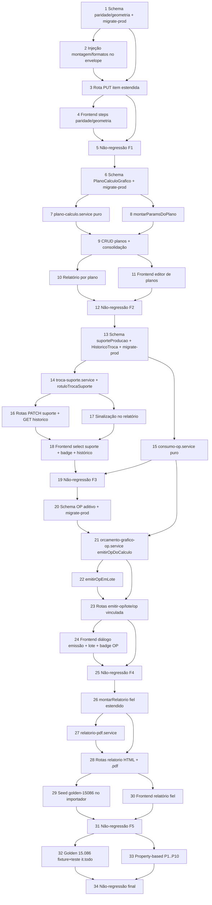

# Implementation Plan: Orçamento Gráfico — OP Nativa, Relatório Fiel e Paridade

## Overview

Plano de implementação incremental, organizado nas 6 fases do design (frentes A–E +
validação). Cada fase é independentemente commitável e preserva a suíte
`orcamento-grafico` verde (não-regressão — hoje 148 testes). O motor puro
`orcamento-grafico-calculo.service.ts` NÃO é reescrito: planos são um envelope que o
chama 1× por plano e soma; geometria/montagem/formatos entram como pontos de injeção em
`aproveitamentoManual`/formatos; campos de paridade só são persistidos (não entram no
cálculo).

Backend em `c:\Source\VisioFab.Wms.Back`; frontend em `c:\Source\VisioFab.Wms.Front`
(repos separados — tasks de frontend marcam o repo). Toda alteração de `schema.prisma`
acompanha o bloco idempotente de `migrate-prod.ts` NA MESMA task (steering
database-migrations): `CREATE TABLE/ADD COLUMN IF NOT EXISTS`, índices, FK em try/catch,
enums como VARCHAR. Postgres local está parado — validar schema por `get_diagnostics` +
`npx prisma generate`; a migração roda no deploy (idempotência obrigatória). Verificação
por `npx vitest run src/modules/orcamento-grafico --reporter=dot` (reporter `dot`, não
`basic`; build/tsc completos travam nesta máquina). Cada fase termina com uma task de
não-regressão.

## Task Dependency Graph



```json
{
  "waves": [
    { "id": 0, "tasks": ["1"] },
    { "id": 1, "tasks": ["2", "3"] },
    { "id": 2, "tasks": ["4"] },
    { "id": 3, "tasks": ["5"] },
    { "id": 4, "tasks": ["6"] },
    { "id": 5, "tasks": ["7", "8"] },
    { "id": 6, "tasks": ["9"] },
    { "id": 7, "tasks": ["10", "11"] },
    { "id": 8, "tasks": ["12"] },
    { "id": 9, "tasks": ["13"] },
    { "id": 10, "tasks": ["14", "15"] },
    { "id": 11, "tasks": ["16", "17"] },
    { "id": 12, "tasks": ["18"] },
    { "id": 13, "tasks": ["19"] },
    { "id": 14, "tasks": ["20"] },
    { "id": 15, "tasks": ["21"] },
    { "id": 16, "tasks": ["22", "23"] },
    { "id": 17, "tasks": ["24"] },
    { "id": 18, "tasks": ["25"] },
    { "id": 19, "tasks": ["26"] },
    { "id": 20, "tasks": ["27", "28"] },
    { "id": 21, "tasks": ["29", "30"] },
    { "id": 22, "tasks": ["31"] },
    { "id": 23, "tasks": ["32", "33"] },
    { "id": 24, "tasks": ["34"] }
  ]
}
```

## Tasks

### Fase 1 — Campos de Paridade + Geometria/Formatos + Acondicionamento (Req 1, 2, 3)

- [x] 1. Schema: campos de paridade/geometria/acondicionamento em `ItemOrcamentoGrafico` + migrate-prod idempotente
  - Adicionar ao model `ItemOrcamentoGrafico` em `prisma/schema.prisma` (todos aditivos/opcionais): campos de paridade (`siglaAcabado`, `tributacao`, `processoImpressao`, `coberturaTintaTexto`, `fabricante`, `microondulado`, `fornecido`, `qtdModelos` default 0, `arte`, `observacao`, `observacaoAreasOp`, `conteudoVolume`, `acondicionamento` JSON) e geometria/formatos (`comprimentoMm`, `larguraMm`, `alturaMm`, `abaColaMm`, `abaFechamentoMm`, `fibra`, `montagemLinhas`, `montagemColunas`, `formatoSup*`, `formatoCorte*`, `ajusteCorteMicroMm`) conforme §3.1 do design.
  - Escrever o bloco idempotente equivalente da Fase 1 em `prisma/migrate-prod.ts` (`ADD COLUMN IF NOT EXISTS`, enums como VARCHAR, defaults de boolean/int) conforme §3.6.
  - `npx prisma generate` + `get_diagnostics` nos arquivos tocados.
  - _Requirements: 1.1, 1.2, 2.1, 2.2, 2.3, 3.1, 3.2, 3.3_

- [x] 2. Injeção de montagem/formatos no envelope (`montarParamsDoItem`) — motor intocado
  - Em `orcamento-grafico-item.service.ts`: quando o item tem `montagemLinhas`/`montagemColunas`, setar `aproveitamentoManual = linhas × colunas` (valores EXATOS, §4.1/Req 2.4); quando tem formato de corte, popular `maquinaImpressao.formatoLargura/Altura`; sem montagem/formatos → não setar nada (encaixe legado, Req 2.7).
  - Garantir que os campos de paridade (Req 1/3) NUNCA entram em `ParamsOrcamento` — só persistidos. Motor puro `orcamento-grafico-calculo.service.ts` INALTERADO.
  - _Requirements: 2.4, 2.5, 2.7, 1.5, 3.5_

- [x] 3. Rota `PUT /:id/itens/:itemId` estendida (paridade + geometria + acondicionamento)
  - Estender o Zod do item (`itemParidadeBody`, §5) para aceitar os campos de paridade, geometria/montagem/formatos, acondicionamento (máx 20, descrição 1–100), observações e ARTE; persistir e recalcular só o item alterado (demais itens inalterados, Req 2.5).
  - Validação de faixa ANTES de calcular: dimensões > 0, montagem linhas/colunas ≥ 1, conteúdo por volume ≥ 1, acondicionamento sem descrição vazia → 400 preservando o item + mensagem do campo (Req 2.6, 3.6). Isolamento por `empresaId` explícito.
  - _Requirements: 1.3, 1.4, 1.6, 2.6, 3.4, 3.6_

- [x] 4. Frontend: steps de paridade/geometria/acondicionamento no wizard (`c:\Source\VisioFab.Wms.Front`)
  - Adicionar aos steps do item campos de paridade (sigla acabado/tributação/processo impressão/cobertura texto/fabricante/microondulado/fornecido/modelos/ARTE), geometria (comprimento/largura/altura/abas/fibra/montagem linhas×colunas/formato suporte/formato de corte/ajuste micro), acondicionamento (lista editável + conteúdo por volume) e observações (observação, observação de áreas de OP).
  - Payload envia os novos campos à rota da Task 3; load de edição mapeia de volta. `get_diagnostics`.
  - _Requirements: 1, 2, 3_

- [x] 5. Não-regressão da Fase 1
  - Rodar `npx vitest run src/modules/orcamento-grafico --reporter=dot` e exigir 0 falhas novas (base 148). `get_diagnostics` limpo nos arquivos tocados.
  - _Requirements: 15.2, 15.3_

### Fase 2 — Planos por Cálculo (Req 4, 5)

- [x] 6. Schema `PlanoCalculoGrafico` + migrate-prod idempotente
  - Adicionar o model `PlanoCalculoGrafico` (filho de `ItemOrcamentoGrafico`, cascade, `empresaId` denormalizado, `@@unique([itemId, sequencia])`, `nome`, suporte orçado/produção, gramatura, formato, pré-impressão, `numCores` 0–12, cores JSON, `maquinaId`, acabamentos ricos JSON, espelhos `custoSuporte/custoImpressao/custoAcabamento` + `resultadoCalculo`) conforme §3.2, e a relação `planos` no item.
  - Bloco idempotente da Fase 2 em `migrate-prod.ts` (`CREATE TABLE IF NOT EXISTS`, índice único item+sequência, índices empresa/item, FK em try/catch). `prisma generate` + `get_diagnostics`.
  - _Requirements: 4.1, 4.2_

- [x] 7. Serviço `plano-calculo.service.ts` — `calcularPlano`/`somaPlanos` (puro)
  - Criar as funções puras `somaPlanos(planos)` (soma MD/CT/Servex arredondando a 2 casas, §4.2) e a interface `FechamentoPlano`; `calcularPlano` monta os params do plano e chama o motor 1× (sem persistência). Motor puro intocado.
  - _Requirements: 5.1, 5.2_

- [x] 8. `montarParamsDoPlano` em `orcamento-grafico-item.service.ts`
  - Traduzir os parâmetros do plano (suporte, gramatura, formato, cores/máquina, acabamentos, montagem) em `ParamsOrcamento`, reusando a injeção de montagem/formatos da Task 2 por plano. Cada plano usa exclusivamente seus próprios parâmetros (Req 5.1).
  - _Requirements: 5.1, 5.3_

- [x] 9. CRUD de planos + consolidação no item (rotas)
  - `POST /:id/itens/:itemId/planos` (seq = max+1, Req 4.3), `PUT .../planos/:planoId` (recalcula só o plano + reconsolida o item, Req 5.3), `DELETE .../planos/:planoId` (reconsolida; NÃO renumera, lacunas ok, Req 4.4), `POST .../planos/:planoId/calcular` (Req 5.1). Zod `planoBody` (§5): nome 1–60, formato > 0, cores 0–12 → 400 preservando estado + mensagem (Req 4.5).
  - Item com planos: MD/CT/Servex = soma dos planos (`somaPlanos`); item sem planos = caminho legado (Req 5.5). Isolamento `empresaId` explícito.
  - _Requirements: 4.3, 4.4, 4.5, 5.2, 5.3, 5.5_

- [x] 10. Relatório por plano (bloco por plano em `montarRelatorio`)
  - Estender `orcamento-grafico-relatorio.service.ts` para apresentar um bloco por plano com custo de Suporte, Impressão e Acabamento (Req 5.6); item sem planos renderizado como plano implícito único (compatibilidade). Função pura, assinatura legada preservada.
  - _Requirements: 5.6_

- [x] 11. Frontend: editor de planos por item (`c:\Source\VisioFab.Wms.Front`)
  - Tabela "Planos do Cálculo" dentro do item (seq, nome, suporte, formato, cores, custo) + botões Novo/Editar/Remover plano consumindo as rotas da Task 9; recálculo e reconsolidação ao salvar. `get_diagnostics`.
  - _Requirements: 4.1, 4.2, 5.6_

- [x] 12. Não-regressão da Fase 2
  - `npx vitest run src/modules/orcamento-grafico --reporter=dot` — 0 falhas novas. `get_diagnostics` limpo.
  - _Requirements: 15.2, 15.3_

### Fase 3 — Troca de Suporte Orçamento → Produção (Req 6, 7, 8)

- [x] 13. Schema `suporteProducaoId` (item/plano) + `HistoricoTrocaSuporte` + migrate-prod
  - Adicionar `suporteProducaoId` ao `ItemOrcamentoGrafico` (já previsto no §3.1) e confirmar no `PlanoCalculoGrafico`; criar o model `HistoricoTrocaSuporte` (§3.3: `empresaId`, `itemId?`/`planoId?`, `suporteAnteriorId?`, `suporteNovoId`, `usuarioId?`, `trocadoEm`, cascade, índices).
  - Bloco idempotente da Fase 3 em `migrate-prod.ts` (`CREATE TABLE IF NOT EXISTS` + índices + FKs em try/catch). `prisma generate` + `get_diagnostics`.
  - _Requirements: 6.1, 7.4_

- [x] 14. `troca-suporte.service.ts` (`trocarSuporteProducao` + `rotuloTrocaSuporte`)
  - `trocarSuporteProducao`: valida o novo suporte por `{ id, empresaId }`; inexistente OU de outra empresa → rejeita com UMA mensagem genérica "suporte inválido" (não distingue, Req 6.4); persiste `suporteProducaoId` preservando `suporteId` orçado (Req 6.3); grava `HistoricoTrocaSuporte` (de→para/usuário/data, Req 7.4). Na criação, inicializa produção = orçado (Req 6.2).
  - `rotuloTrocaSuporte(orcadoNome, producaoNome, orcadoId?, producaoId?)` (função PURA): retorna `null` se igual/sem troca, senão `"Suporte alterado na produção: {orçado} → {real}"` (Req 7.2). Reusada por relatório e OP.
  - _Requirements: 6.2, 6.3, 6.4, 6.5, 7.4_

- [x] 15. `consumo-op.service.ts` — consumo folhas/kg com suporte real (puro)
  - `consumoMaterialOp(params)` PURO: peso(kg) = folhas × larg(m) × alt(m) × gramatura / 1000; custo = peso × preçoKg, usando gramatura/dimensão/preço do SUPORTE DE PRODUÇÃO (mesma fórmula de `calcularPapel`, §4.3). Suporte real = orçado → consumo idêntico (2 casas) ao orçado (Req 8.4). Não grava no item (orçamento orçado preservado, Req 8.2).
  - _Requirements: 8.1, 8.2, 8.3, 8.4, 8.5_

- [x] 16. Rotas PATCH suporte-produção (item e plano) + GET histórico
  - `PATCH /:id/itens/:itemId/suporte-producao` e `PATCH /:id/itens/:itemId/planos/:planoId/suporte-producao` (body `suporteProducaoBody`, §5) → 400 "suporte inválido" genérico quando inexistente/outra empresa (Req 6.4); `GET /:id/itens/:itemId/historico-troca-suporte` (de→para/usuário/data). Isolamento `empresaId`.
  - _Requirements: 6.3, 6.4, 7.4_

- [x] 17. Sinalização de troca no relatório (via `rotuloTrocaSuporte`)
  - No `montarRelatorio`, por plano/item, derivar `trocaSuporte` de `rotuloTrocaSuporte`; sem troca → omitir (Req 7.1/7.5); com troca → exibir "Suporte alterado na produção: {orçado} → {real}" (Req 7.2). A OP deriva o rótulo por si (não substituída pelo relatório, Req 7.3 — consumida pela Fase 4/5).
  - _Requirements: 7.1, 7.2, 7.5_

- [x] 18. Frontend: select de suporte de produção + badge de troca + histórico (`c:\Source\VisioFab.Wms.Front`)
  - No item/plano, `Select` de suporte de produção (consumindo cadastro de suportes) + badge visível "Suporte alterado na produção: X → Y" quando difere do orçado; painel/accordion de histórico de trocas (de→para/usuário/data) via GET da Task 16. `get_diagnostics`.
  - _Requirements: 6.3, 7.2, 7.4_

- [x] 19. Não-regressão da Fase 3
  - `npx vitest run src/modules/orcamento-grafico --reporter=dot` — 0 falhas novas. `get_diagnostics` limpo.
  - _Requirements: 15.2, 15.3_

### Fase 4 — Emissão Nativa de OP a partir do Cálculo (Req 9, 10, 11)

- [x] 20. Schema: extensão aditiva de `OrdemProducao` + migrate-prod
  - Adicionar à `OrdemProducao` (aditivo, §3.4): `orcamentoItemId?`, `opReserva` default false, `via?` (PRIMEIRA|REEMISSAO VARCHAR), `revisao` default 0, `emitidaPorId?/emitidaEm?`, `reemitidaPorId?/reemitidaEm?`, bloco de faturamento (`faturamentoRazaoSocial/CodCliente/PedidoInterno/FichaTecnica/QtdPorAcabado`) + índice em `orcamentoItemId`. `origemImportacao` ganha o valor `NATIVA_CALCULO` (campo já VARCHAR, sem migração de tipo).
  - Bloco idempotente da Fase 4 em `migrate-prod.ts` (`ADD COLUMN IF NOT EXISTS` + índice). `prisma generate` + `get_diagnostics`.
  - _Requirements: 9.1, 9.5, 10.6, 11.3_

- [x] 21. `orcamento-grafico-op.service.ts` — `emitirOpDoCalculo` (cabeçalho/planos/materiais/entregas/faturamento/opções/reemissão)
  - Criar o serviço que, numa transação filtrada por `empresaId` do orçamento (Req 9.8): cria `OrdemProducao` `NATIVA_CALCULO` com número sequencial, `via='PRIMEIRA'`, `revisao=0`, cabeçalho/emitidaPor/Em (Req 9.1–9.3); 1 `PlanoOrdemProducao` por plano (material/formato/kg/TR/corte/aprovação/impressão/acabamento, Req 10.2); `EtapaOrdemProducao` com tempos Fixo/Variável de impressão e acabamento + detalhe (Req 10.3/10.4); 1 `ItemOrdemProducao` por material (código/Pantone/unidade KG-PC-UN/quantidade, Req 10.5) usando `consumoMaterialOp` com suporte de produção; 1 `ProgramacaoEntrega` por entrega + excedente (Req 10.1); bloco de faturamento (Req 10.6).
  - Reemissão quando já existe OP vinculada: `via='REEMISSAO'`, `revisao+1`, reemitidaPor/Em, mantém o número (Req 9.4). Idempotência por (itemId, mesmas opções): não duplica nem altera (Req 16.6). Opções `naoGerarPedido`/`opReserva`/`imprimirTracado`/`serieAutomatica`/`gerarEmArquivo` (Req 11.2–11.5). Seções vazias → gera OP + `avisos[]` apenas informativos, sem bloquear (Req 10.7). OP entra no painel de PCP (Req 9.6); importação de PDF preservada (Req 9.7).
  - _Requirements: 9.1, 9.2, 9.3, 9.4, 9.5, 9.6, 9.7, 9.8, 10.1, 10.2, 10.3, 10.4, 10.5, 10.6, 10.7, 11.2, 11.3, 11.4, 11.5, 16.6_

- [x] 22. `emitirOpEmLote` (emissão em lote)
  - Em `orcamento-grafico-op.service.ts`: `emitirOpEmLote(itemIds, opcoes, usuarioId, empresaId)` chama `emitirOpDoCalculo` por item, aplicando as mesmas opções; conclui os sucessos, NÃO gera os que falharam, retorna `{ itemId, status: 'ok'|'erro', numero?, motivo? }[]` por item (Req 11.7/11.8).
  - _Requirements: 11.7, 11.8_

- [x] 23. Rotas: emitir-op (item), emitir-op-lote e GET OP vinculada
  - `POST /:id/itens/:itemId/emitir-op` (body `emitirOpBody`, §5: opções + emails ≤ 20 para envio por e-mail, Req 11.6); `POST /emitir-op-lote` (lista de itens + opções, resultado por item); `GET /:id/itens/:itemId/op` (status/número da OP vinculada, ex.: "OP: 3149", Req 9.5). Isolamento `empresaId`.
  - _Requirements: 9.5, 11.1, 11.6, 11.7, 11.8_

- [x] 24. Frontend: diálogo de emissão de OP + opções + lote + badge "OP vinculada" (`c:\Source\VisioFab.Wms.Front`)
  - Diálogo "Emitir OP" no item com as opções (não gerar pedido/OP reserva/imprimir traçado/série automática/gerar em arquivo) + campo de e-mails; ação de emissão em lote na lista de itens; badge "OP: {número}" quando há OP vinculada (via GET da Task 23). `get_diagnostics`.
  - _Requirements: 9.5, 11.1, 11.5, 11.6, 11.7_

- [x] 25. Não-regressão da Fase 4
  - `npx vitest run src/modules/orcamento-grafico --reporter=dot` — 0 falhas novas. `get_diagnostics` limpo nos arquivos de OP/rotas.
  - _Requirements: 15.2, 15.3_

### Fase 5 — Relatório Fiel ao Pré-cálculo (HTML+PDF) + Seed Golden (Req 12, 13)

- [x] 26. `montarRelatorio` fiel estendido (blocos por plano, custos, prazos, comissões, CEV, margens)
  - Estender `orcamento-grafico-relatorio.service.ts` com o layout fiel (§4.5): cabeçalho completo (empresa/cliente/contato/telefone/formato/produto/descrição/código acabado/quantidade/excedente/programação/OP vinculada, Req 12.2); por plano (ocorrências/cores/formato/repetição/TR/corte/aprovação/tiragem/impressão/produção-hora/quebra%/apara%, Req 12.3); seções Suporte/Matriz/Tinta/MatAcab com FIXO/VARIÁVEL/UNITÁRIO/SUBTOTAL (Req 12.4); Impressão (fixo/variável h) e Acabamento por centro (Req 12.5); Custo de Produção com MD/CT/Servex/C.Prod/créditos ICMS-IPI-PIS/COFINS/taxas/encargo financeiro%/total (Req 12.6); Prazos e Comissões (Req 12.7); CEV e Condições de Pagamento (Req 12.8); 3 pontos de margem com Primeiro Mil/Mil Seguinte via gross-up (Req 12.9); incluído/alterado por (Req 12.10). Item sem planos = plano implícito. Isolamento `empresaId` (Req 12.11).
  - _Requirements: 12.2, 12.3, 12.4, 12.5, 12.6, 12.7, 12.8, 12.9, 12.10, 12.11_

- [x] 27. `relatorio-pdf.service.ts` — PDF do relatório oficial (pdfkit, mesmo objeto)
  - Criar/estender o serviço de PDF que renderiza o MESMO `RelatorioOrcamento` da Task 26 via pdfkit — conteúdo idêntico ao HTML (Req 12.1).
  - _Requirements: 12.1_

- [x] 28. Rotas de relatório: HTML e `.pdf`
  - `GET /:id/itens/:itemId/relatorio` (HTML/JSON) e `GET /:id/itens/:itemId/relatorio.pdf` (PDF), ambas filtrando por `empresaId` e usando a fonte única da Task 26.
  - _Requirements: 12.1, 12.11_

- [x] 29. Seed golden `golden-15086` em `scripts/importar-calcgraf.ts` (idempotente, --dry-run)
  - Fase `golden-15086`: cria o cálculo 15.086 / orçamento 5.316 / OP 3.149 SÓ na empresa Carton Wega (por `empresaId`) com os números exatos dos documentos (cliente ICEFRESH 903, vendedor IGOR ARNEIRO, tiragem 100.000), refletindo a troca de suporte orçado 222 → produção 234 com sinalização habilitada (Req 13.1/13.4/13.5). Idempotente (upsert por número; não duplica nem sobrescreve ajuste manual, Req 13.2); `--dry-run` relata sem gravar (Req 13.3); empresa Carton Wega ausente → aborta sem gravar + mensagem (Req 13.6). Entregável (não opcional).
  - _Requirements: 13.1, 13.2, 13.3, 13.4, 13.5, 13.6_

- [x] 30. Frontend: relatório fiel em tela + download PDF (`c:\Source\VisioFab.Wms.Front`)
  - Tela de relatório do item consumindo o HTML/JSON da Task 28 (blocos por plano, custos, prazos, comissões, CEV, 3 margens, badge de troca de suporte, OP vinculada) + botão "Baixar PDF". `get_diagnostics`.
  - _Requirements: 12.1, 12.2, 12.9_

- [x] 31. Não-regressão da Fase 5
  - `npx vitest run src/modules/orcamento-grafico --reporter=dot` — 0 falhas novas. `get_diagnostics` limpo nos serviços de relatório/PDF e no importador.
  - _Requirements: 15.2, 15.3_

### Fase 6 — Validação Golden + Property-Based + Não-Regressão Final (Req 8, 14, 15, 16)

- [x] 32. Golden 15.086 — fixture + teste (it.todo/skip até transcrição dos valores pelo usuário)
  - Criar `calibracao/golden-15086.{fixture,test}.ts`: estrutura do cabeçalho + planos + alvos (6 componentes, totais, 3 margens Primeiro Mil/Mil Seguinte, consumo da OP) com flag `PENDENTE_TRANSCRICAO=true` e placeholders `// TODO(usuário)`. Teste em `it.todo`/skip enquanto pendente; bloco `if (!PENDENTE_TRANSCRICAO)` já escrito confrontando cada valor com desvio ≤ 0,5% (Req 14), indicando qual valor divergiu (Req 14.6). Destrava quando o usuário transcrever os números do pré-cálculo e trocar a flag.
  - _Requirements: 8.3, 8.4, 14.1, 14.6_

- [x]* 33. Property-based tests (fast-check, ≥ 100 iterações) — Properties 1–10 do design
  - Criar os arquivos PBT em `calibracao/` anotando cada um com `// Feature: orcamento-grafico-op-relatorio-paridade, Property N: {texto}`:
    - **Property 1**: campos de paridade não interferem no custo — `pbt-paridade-nao-interfere.test.ts` (Valida 1.5, 3.5, 16.5)
    - **Property 2**: equivalência legado / aditividade — `pbt-equivalencia-legado.test.ts` (Valida 2.7, 5.5, 15.3)
    - **Property 3**: montagem define o aproveitamento exato — `pbt-montagem-aproveitamento.test.ts` (Valida 2.4)
    - **Property 4**: soma dos planos = MD + CT do item — `pbt-soma-planos.test.ts` (Valida 5.4, 16.1)
    - **Property 5**: localidade do plano — `pbt-localidade-plano.test.ts` (Valida 5.1, 5.3)
    - **Property 6**: sequência de plano única e sem renumeração — `pbt-sequencia-plano.test.ts` (Valida 4.3, 4.4)
    - **Property 7**: preservação do orçamento orçado na troca — `pbt-orcamento-preservado.test.ts` (Valida 6.3, 8.2, 16.2)
    - **Property 8**: sinalização de troca de suporte — `pbt-rotulo-troca.test.ts` (Valida 7.1, 7.2, 7.3, 7.5)
    - **Property 9**: consumo da OP com suporte real + identidade — `pbt-consumo-op.test.ts` (Valida 8.1, 8.3, 8.4, 16.3, 16.4)
    - **Property 10**: idempotência da emissão de OP — `pbt-idempotencia-emissao.test.ts` (Valida 16.6)
  - Cada teste exercita as funções puras subjacentes (motor/soma de planos/consumo/rótulo/gross-up/sequência) com `fc.assert(..., { numRuns: ≥100 })`.
  - _Requirements: 16.1, 16.2, 16.3, 16.4, 16.5, 16.6, 14.1, 14.2, 14.3, 14.4_

- [x] 34. Não-regressão final
  - `npx vitest run src/modules/orcamento-grafico --reporter=dot` — suíte `orcamento-grafico` com 0 falhas novas (esperado 148 + os novos testes PBT da Task 33). Golden 15.086 permanece em `it.todo`/skip até transcrição. `get_diagnostics` limpo.
  - _Requirements: 15.2, 15.3_

## Notes

- **Repos separados:** tasks de frontend (4, 11, 18, 24, 30) ficam em `c:\Source\VisioFab.Wms.Front`; o restante em `c:\Source\VisioFab.Wms.Back`.
- **Migração:** `schema.prisma` + `migrate-prod.ts` SEMPRE na mesma task (steering database-migrations). Postgres local está parado — validar por `get_diagnostics` + `npx prisma generate`; a migração idempotente roda no deploy. Rodar `migrate-prod.ts` 2× quando houver ambiente. Enums como VARCHAR; FK em try/catch.
- **Verificação:** `npx vitest run src/modules/orcamento-grafico --reporter=dot` (reporter `dot`, não `basic`); build/tsc completos travam nesta máquina. Motor puro `orcamento-grafico-calculo.service.ts` INTOCADO em todas as fases.
- **Não-regressão:** cada fase termina com a suíte `orcamento-grafico` em 0 falhas novas (base 148).
- **Tasks marcadas com `*`** (apenas 33, PBT) são opcionais para MVP; a Task 32 (golden) e o seed (29) são entregáveis, não opcionais.
- **Dependência do usuário (fora do caminho de código):** o golden 15.086 fica em `it.todo`/skip até o usuário transcrever os números do pré-cálculo do Calcgraf para `golden-15086.fixture.ts` (destrava a Task 32 e o confronto ≤ 0,5%). O seed golden (Task 29) cria os registros para visualização em tela independentemente dessa transcrição.
