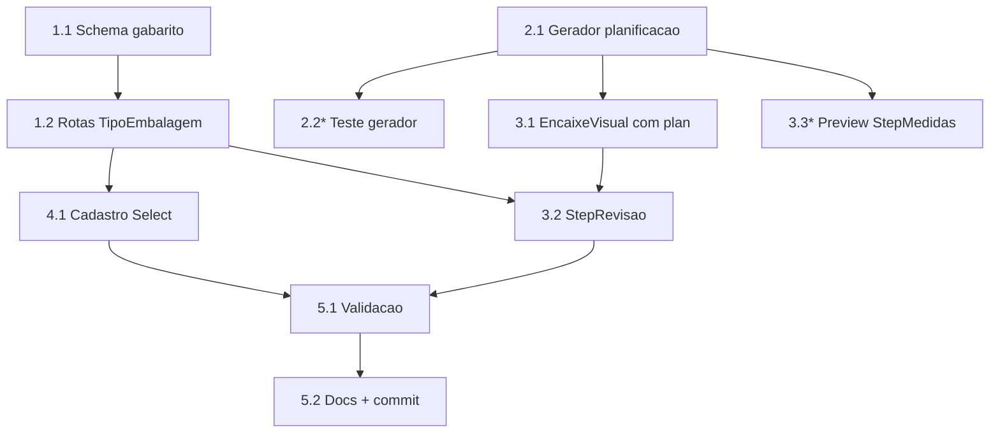

# Implementation Plan — Planificação Visual

## Overview

Feature visual: contorno esquemático da caixa aberta por família + desenho no
encaixe. Puramente de UI; o motor de cálculo não muda. Backend só ganha o campo
`gabaritoPlanificacao` no TipoEmbalagem. Tarefas com `*` são opcionais.

## Tasks

- [x] 1. Backend — campo gabarito no TipoEmbalagem
- [x] 1.1 `schema.prisma`: `TipoEmbalagem.gabaritoPlanificacao String?` + `migrate-prod.ts` idempotente (`ADD COLUMN IF NOT EXISTS`); `prisma generate`
  - _Requirements: 1.1, 3.2_
- [x] 1.2 `orcamento-grafico.routes.ts`: incluir `gabaritoPlanificacao` no select de TipoEmbalagem e nos Zod de POST/PUT `/tipos-embalagem`
  - _Requirements: 1.1_

- [x] 2. Frontend — gerador de planificação (puro)
- [x] 2.1 `novo/planificacao-gabaritos.ts`: `gerarPlanificacao({gabarito,L,A,P,abaMm,sangriaMm})` → `{larguraMm,alturaMm,paths[]}` com gabaritos CARTUCHO, CAIXA_FUNDO_AUTO, CARTELA, RETANGULO (fallback). Bounding box == dimensões externas.
  - _Requirements: 1.2, 1.3, 1.4_
- [ ]* 2.2 Teste unitário do gerador (bounding box por gabarito, fallback retângulo, nº paths > 0)
  - _Requirements: 1.4, 2.4_

- [x] 3. Frontend — desenho no encaixe
- [x] 3.1 `EncaixeVisual.tsx`: prop `plan?` — desenha o contorno (corte sólido + vinco tracejado) repetido na grade, respeitando orientação; sem `plan`, mantém retângulo
  - _Requirements: 2.1, 2.2, 2.4_
- [x] 3.2 `StepRevisao.tsx`: montar `PlanParams` do form + `tipoEmbalagem.gabaritoPlanificacao` e passar ao `EncaixeVisual`
  - _Requirements: 2.1, 2.3_
- [ ]* 3.3 Preview da peça única (sem grade) no `StepMedidas.tsx`
  - _Requirements: 1.2_

- [x] 4. Frontend — cadastro
- [x] 4.1 Tela `cadastros/tipos-embalagem`: Select "Gabarito de planificação" (CARTUCHO/CAIXA_FUNDO_AUTO/CARTELA/RETANGULO)
  - _Requirements: 1.1_

- [x] 5. Validação e docs
- [x] 5.1 Suíte backend `orcamento-grafico` continua 81/81 (não-regressão); diagnostics limpos nos arquivos tocados
  - _Requirements: 3.1_
- [x] 5.2 Atualizar `docs/ESTADO-ORCAMENTO-GRAFICO.md` e steering; commit + push (back e front)
  - _Requirements: 3.1_

## Task Dependency Graph



```json
{
  "waves": [
    { "wave": 1, "tasks": ["1.1", "2.1"] },
    { "wave": 2, "tasks": ["1.2", "2.2", "3.1"] },
    { "wave": 3, "tasks": ["3.2", "3.3", "4.1"] },
    { "wave": 4, "tasks": ["5.1"] },
    { "wave": 5, "tasks": ["5.2"] }
  ]
}
```

## Notes

- Front e back são repos separados; schema+migrate-prod juntos no mesmo commit.
- Feature visual: zero mudança no cálculo de custo/rendimento.
- Gabaritos são esquemáticos (proporção L/A/P + aba padrão), não faca técnica.
- Validar por diagnostics + vitest (build completo trava nesta máquina).
