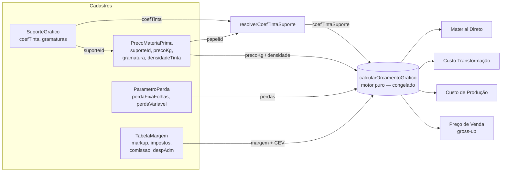
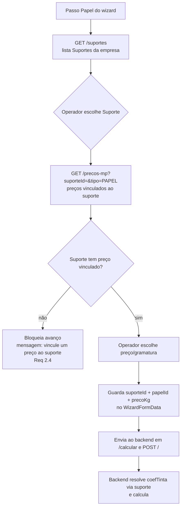

# Design Document

## Overview

Esta spec fecha a paridade de **modelo** entre o Orçamento Gráfico do Vizor e o
Calcgraf (GPrint) para a Carton Wega, sem tocar no núcleo de cálculo já
validado. O trabalho é inteiramente **aditivo**: preencher as lacunas de
cadastro (Suportes, Tabela de Margem, Parâmetros de Perda) e evoluir o passo
"Papel" do wizard para o fluxo em dois níveis do Calcgraf — primeiro escolher
o **Suporte** (ex.: "Duplex 280"), depois o **preço do papel/gramatura**
vinculado a ele.

### Descoberta-chave do levantamento de código

Ao mapear o código existente, confirmamos que **a maior parte da infraestrutura
já está pronta** e validada. Em particular:

- O motor `calcularOrcamentoGrafico` já aceita `coefTintaSuporte` e
  `partidaConsumoTintaKg` e usa SPANKS quando o coeficiente está presente, com
  fallback para o modelo legado `rendimentoM2Kg` (não-regressão garantida).
- A rota `/calcular` já resolve o CoefTinta via
  `resolverCoefTintaSuporte(empresaId, papelId)` (PrecoMateriaPrima.suporteId →
  SuporteGrafico.coefTinta) e a partida de tinta por parâmetro.
- Os quatro models relevantes — `SuporteGrafico`, `PrecoMateriaPrima` (com
  `suporteId`, `gramatura`, `densidadeTinta`), `ParametroPerda`, `TabelaMargem`
  — **já existem no schema com todos os campos necessários**.
- Os CRUDs de `/suportes`, `/precos-mp`, `/parametros-perda`, `/tabelas-margem`
  já existem no backend, e as telas de cadastro correspondentes já existem no
  frontend.

Como consequência, **esta spec NÃO altera o schema Prisma** (ver §3.1) e se
concentra em: (a) uma fase nova de importação de suportes + seed da Tabela de
Margem; (b) dois ajustes aditivos de backend (filtro por `suporteId` e os
bloqueios dos Req 2.4/5.4); (c) a evolução do `StepPapel` do wizard.

### Objetivos

1. **Paridade de modelo Suporte/Fechamento**: o operador reencontra os mesmos
   conceitos (Suporte com CoefTinta, Tabela de Margem, Parâmetros de Perda) e
   nomes do Calcgraf.
2. **Aditivo e sem regressão**: nada no núcleo de cálculo que já bate ≤ 0,5% é
   alterado; todo caminho novo tem fallback para o comportamento atual.
3. **Alvo de validação golden 15.235**: Suporte "Duplex 280" a R$ 8,30/kg →
   Material Direto 6.598,70; Custo de Produção 10.413,50; CEV 17,75%; preço à
   margem de 30,01% = 19.960,00 para 20.000 unidades (desvio ≤ 0,5%).

### Escopo

| Em escopo | Fora de escopo |
|---|---|
| Fase `suportes` no importador | Núcleo de cálculo (congelado) |
| Seed da Tabela de Margem da Wega | Importação de produtos/SKUs |
| Filtro `suporteId` em `/precos-mp` | Comissões por agente/juros (Req 6 — fase futura) |
| Bloqueios Req 2.4 e 5.4 | Mudança de schema (não há) |
| StepPapel em 2 níveis + persistir `suporteId` | Mapa de Custos RKW (já entregue em spec anterior) |

## Architecture

### Como os conceitos se conectam no cálculo

O fluxo de dados do orçamento parte do **Suporte** escolhido pelo operador e
converge no motor puro `calcularOrcamentoGrafico`. O Suporte fornece o
**CoefTinta** (fator Stock da fórmula SPANKS); o **Preço do Papel**
(`PrecoMateriaPrima`, vinculado ao suporte por `suporteId` + `gramatura`)
fornece o `precoKg` e a `densidadeTinta`; os **Parâmetros de Perda** fornecem a
perda fixa (folhas de acerto) e variável (%); e a **Tabela de Margem** fornece
markup + CEV (impostos, comissão, desp. adm) para o gross-up do preço.



### Fluxo do wizard (passo Papel em dois níveis)

Hoje o `StepPapel` busca direto em `/precos-mp` (onde não existe "Duplex"). A
evolução introduz um primeiro nível de Suporte:



### Camadas afetadas (visão macro)

- **Backend (`VisioFab.Wms.Back`)**: ajuste aditivo em `/precos-mp` (filtro
  `suporteId`) e nos handlers `/calcular` e `POST /` (bloqueios 2.4/5.4);
  nova fase `suportes` e seed de `TabelaMargem` no importador.
- **Frontend (`VisioFab.Wms.Front`)**: `StepPapel` em 2 níveis + `suporteId` no
  `WizardFormData`; telas de cadastro já existem (sem trabalho novo além de
  verificação).
- **Schema/migração**: sem alterações (todos os campos já existem).

## Components and Interfaces

### Backend — ajustes aditivos nas rotas (`orcamento-grafico.routes.ts`)

**1. `GET /precos-mp` — aceitar filtro por `suporteId` (Req 2.3).** Hoje o
schema de query aceita `tipo`, `busca`, `status`, `page`, `limit`. Adicionar
`suporteId` opcional ao schema Zod e, quando presente, incluir
`where.suporteId = suporteId`. Mudança isolada, não quebra chamadas atuais (o
StepPapel atual não envia o parâmetro).

```ts
// query schema (adição)
suporteId: z.string().uuid().optional(),
// where (adição)
if (query.suporteId) where.suporteId = query.suporteId
```

**2. `/calcular` e `POST /` — bloqueios de pré-condição (Req 2.4, 5.4).** Hoje
ambos usam fallback silencioso (margem default; perdas default). Os bloqueios
são aditivos, retornando HTTP 400/422 com mensagem clara ANTES de calcular:

- **Suporte sem preço vinculado (Req 2.4)**: quando o request traz `papelId`
  cujo `PrecoMateriaPrima.suporteId` aponta para um Suporte, mas o Suporte
  escolhido no wizard não possui nenhum `PrecoMateriaPrima` de tipo `PAPEL`
  vinculado, bloquear com mensagem "Suporte sem preço de material vinculado —
  vincule um preço ao suporte antes de calcular". A verificação principal é no
  frontend (bloqueio de avanço do wizard), com a validação de backend como
  defesa em profundidade.
- **Sem ParametroPerda (Req 5.4)**: hoje `perdaImpressao` cai em defaults
  (5% / 50 folhas) quando `ParametroPerda` está vazio. Passar a bloquear o
  cálculo quando não houver NENHUM `ParametroPerda` aplicável ao
  processo/empresa, com mensagem "Nenhum Parâmetro de Perda cadastrado —
  cadastre a perda do processo antes de calcular".

> Nota de design: o fallback atual é conveniente para dados de teste, mas o
> requisito do cliente é explícito em exigir o cadastro. Mantemos o fallback
> apenas para suítes de teste que injetam perdas diretamente no motor (o motor
> puro continua aceitando `perdas` como parâmetro — o bloqueio vive na rota,
> não no motor).

### Backend — motor de cálculo (sem mudança)

O motor `calcularOrcamentoGrafico` e `consumo-tinta.ts` (SPANKS) **não são
alterados**. O contrato relevante já existente:

```ts
interface ParamsOrcamento {
  // ...
  coefTintaSuporte?: number        // fator Stock SPANKS (do SuporteGrafico)
  partidaConsumoTintaKg?: number   // default 0,2 kg
  // quando coefTintaSuporte ausente → modelo legado rendimentoM2Kg (fallback)
}
```

### Importador (`scripts/importar-calcgraf.ts`)

Duas adições, seguindo o padrão existente (`main()` roteia por `--fase`;
`garantirEmpresa()`, `temDryRun()`, `comRetry()`, de-para por código,
idempotência, preservação de ajustes manuais):

**Fase `suportes`** — lê `cartoon/export/SuportesFull.json` (fallback
`Suportes.json`) e cria/atualiza `SuporteGrafico`:

```ts
if (fase === 'suportes' || fase === 'tudo') {
  await importarSuportes(empresaId)
}
```

- De-para por `codigo = CG-SUP-<Codigo>` (`@@unique([empresaId, codigo])`).
- Mapeia: `Codigo`, `Descricao`, `CoefTinta`, `Gramaturas` (lista livre),
  `tipoSuporte` (derivado da descrição; default inferido). Ignora registros sem
  código/descrição e registra o motivo (Req 1.6).
- Idempotente: existente → atualiza; inexistente → cria. Conta criados vs
  atualizados (Req 1.5). `--dry-run` só relata (Req 1.7).
- Exemplos reais dos 78 suportes do Calcgraf: Duplex (cód 1051, CoefTinta 1,5),
  Triplex (cód 13, 1,5), Couchê (cód 19, 1,0), Papelão Couro/Paraná (cód 20,
  2,2).

**Sub-rotina de seed da Tabela de Margem** — semeia uma `TabelaMargem` para a
Wega quando ela ainda não tem nenhuma ajustada manualmente (Req 4.2, 4.4, 4.5):

```ts
if (fase === 'suportes' || fase === 'seed-margem' || fase === 'tudo') {
  await semearTabelaMargem(empresaId)
}
```

- Composição CEV do caso 15.235: ICMS 3,00 + juros 2,50 + PIS/COFINS 9,25 +
  comissão 3,00 = **17,75%**, mapeada para os campos de `TabelaMargem`
  (`impostos`/`comissao`/`despAdm`) de forma que a soma reproduza 17,75% no
  gross-up; `markup` default coerente com a margem de 30,01% do golden.
- **Preservação (Req 4.5)**: se já existe `TabelaMargem` para o tenant, NÃO
  semear (preserva ajuste manual). Idempotente por `@@unique([empresaId,
  nome])`.

> Lição de encoding (steering): se for necessário re-exportar `Suportes` do SQL
> Server, usar `sqlcmd -u` (UTF-16 LE) lido como `utf16le` → UTF-8, para não
> corromper acentos. Os JSONs vivem em `cartoon/export/` (gitignored).

### Frontend — `StepPapel` em dois níveis

O `WizardFormData` ganha `suporteId: string | null` e `suporteNome?: string`. O
`StepPapel.tsx` passa a ter dois seletores encadeados:

```tsx
// nível 1 — Suporte
GET /orcamento-grafico/suportes?busca=<termo>  → Select de Suportes
// ao escolher: updateForm({ suporteId, suporteNome })

// nível 2 — Preço do papel vinculado ao suporte
GET /orcamento-grafico/precos-mp?tipo=PAPEL&suporteId=<id>&busca=<termo>
// ao escolher: updateForm({ papelId, papelDescricao, precoKg, gramatura })
```

- Enquanto nenhum Suporte estiver selecionado, o nível 2 fica desabilitado.
- Se o Suporte escolhido não retornar nenhum preço vinculado, exibir alerta e
  **bloquear o avanço** do wizard (Req 2.4) — o botão "Próximo" só habilita com
  `suporteId` + `papelId` + `precoKg > 0`.
- O nome do Suporte exibido é idêntico ao cadastrado a partir do Calcgraf
  (Req 2.5).
- `suporteId` é enviado ao backend em `/calcular` e `POST /` (persistência do
  suporte escolhido — Req 2.6; o `papelId` já é enviado e é o que o backend usa
  para resolver o CoefTinta).

### Frontend — telas de cadastro (já existentes)

As telas já existem em `src/app/(interna)/orcamento-grafico/cadastros/`:
`suportes/`, `tabelas-margem/`, `parametros-perda/`, `precos-materiais/`. O
trabalho é apenas verificar que atendem aos campos do requisito (CRUD de
`SuporteGrafico`, `TabelaMargem` com markup/impostos/comissão/desconto,
`ParametroPerda` com perda fixa/variável e vínculo papel→suporte em
`precos-materiais`). Nenhuma tela nova precisa ser criada.

## Data Models

Os quatro models já existem em `prisma/schema.prisma` com todos os campos
exigidos pela spec. Reproduzidos aqui como referência (sem alteração):

```prisma
model SuporteGrafico {
  id          String  @id @default(uuid())
  empresaId   String  @map("empresa_id")
  codigo      String  @db.VarChar(30)
  descricao   String  @db.VarChar(200)
  tipoSuporte String  @db.VarChar(30)   // CARTAO, KRAFT, OFFSET, COUCHE...
  coefTinta   Decimal @default(1.5) @map("coef_tinta") @db.Decimal(6,3) // fator Stock SPANKS
  gramaturas  String? @db.Text          // "191,230,280"
  status      Boolean @default(true)
  @@unique([empresaId, codigo])
  @@map("suporte_grafico")
}

model PrecoMateriaPrima {
  id             String   @id @default(uuid())
  empresaId      String   @map("empresa_id")
  descricao      String   @db.VarChar(200)
  tipo           String   @db.VarChar(20) // PAPEL, TINTA...
  unidade        String   @db.VarChar(6)
  precoUnitario  Decimal  @map("preco_unitario") @db.Decimal(12,4)
  suporteId      String?  @map("suporte_id")        // vínculo papel → suporte
  gramatura      Decimal? @db.Decimal(6,2)
  densidadeTinta Decimal? @map("densidade_tinta") @db.Decimal(6,3)
  status         Boolean  @default(true)
  @@map("preco_materia_prima")
}

model ParametroPerda {
  id               String  @id @default(uuid())
  empresaId        String  @map("empresa_id")
  tipoProcessoId   String? @map("tipo_processo_id")
  centroProducaoId String? @map("centro_producao_id")
  perdaFixaFolhas  Int     @default(0) @map("perda_fixa_folhas")
  perdaVariavel    Decimal @default(5) @map("perda_variavel") @db.Decimal(5,2)
  @@unique([empresaId, tipoProcessoId, centroProducaoId])
  @@map("parametro_perda")
}

model TabelaMargem {
  id          String  @id @default(uuid())
  empresaId   String  @map("empresa_id")
  nome        String  @db.VarChar(100)
  markup      Decimal @default(30) @db.Decimal(5,2)
  impostos    Decimal @default(15) @db.Decimal(5,2)
  comissao    Decimal @default(5)  @db.Decimal(5,2)
  despAdm     Decimal @default(5)  @map("desp_adm") @db.Decimal(5,2)
  descontoMax Decimal @default(10) @map("desconto_max") @db.Decimal(5,2)
  status      Boolean @default(true)
  @@unique([empresaId, nome])
  @@map("tabela_margem")
}
```

### Objetos de domínio adicionais (frontend)

```ts
// WizardFormData (adições)
interface WizardFormData {
  // ...existentes (papelId, papelDescricao, gramatura, precoKg)...
  suporteId: string | null
  suporteNome?: string
}
```

Isolamento multi-tenant (Req 7.2): todos os `findMany/findFirst/create/update`
dos quatro models filtram por `empresaId` do usuário (padrão já presente nas
rotas), e o importador grava com o `empresaId` resolvido por `garantirEmpresa()`
(Carton Wega `75848e24-742e-461d-b913-1642c5b83ae9` em produção).

## Correctness Properties

*Uma propriedade é uma característica ou comportamento que deve valer para
todas as execuções válidas do sistema — uma afirmação formal sobre o que o
software deve fazer. Propriedades são a ponte entre a especificação legível por
humanos e garantias de correção verificáveis por máquina.*

As propriedades abaixo derivam do prework de critérios de aceite. Os critérios
de valor fixo (goldens 15.235: MD 6.598,70; Custo de Produção 10.413,50; preço
19.960,00) e as interações de UI/CRUD são cobertos por testes de exemplo/golden
na Estratégia de Testes, não por propriedades universais.

### Property 1: Mapeamento de campos do importador de suportes

*Para qualquer* linha de origem válida da tabela `Suportes` (com código e
descrição), a conversão para `SuporteGrafico` preserva o código (como
`CG-SUP-<Codigo>`), a descrição, o `coefTinta` e a lista de gramaturas sem
perda nem alteração de valor.

**Validates: Requirements 1.2**

### Property 2: Idempotência e de-para do importador de suportes

*Para qualquer* conjunto de suportes de origem, aplicar a importação uma vez e
aplicá-la duas vezes produzem o mesmo estado final: o número de
`SuporteGrafico` resultantes é igual ao número de códigos distintos na origem
(nenhuma duplicata), independentemente de quantas vezes a fase é executada.

**Validates: Requirements 1.3, 1.4**

### Property 3: Suportes inválidos são ignorados sem interromper

*Para qualquer* conjunto de linhas de origem contendo registros sem código ou
sem descrição misturados a registros válidos, a importação ignora exatamente os
registros inválidos (registrando o motivo) e importa todos os válidos.

**Validates: Requirements 1.6**

### Property 4: Seleção do modelo de tinta (SPANKS vs legado)

*Para quaisquer* parâmetros de orçamento, se `coefTintaSuporte` está presente e
> 0, o cálculo de tinta usa o modelo SPANKS (`modeloCalculo.tinta ===
'CALIBRADO'` e o consumo segue a fórmula SPANKS); se ausente ou ≤ 0, o cálculo
usa o modelo legado `rendimentoM2Kg` e produz exatamente o mesmo resultado que
`calcularTinta` legado (`modeloCalculo.tinta === 'LEGADO'`), garantindo
não-regressão.

**Validates: Requirements 2.2, 3.1, 3.2**

### Property 5: Filtro de preços por suporte

*Para qualquer* conjunto de `PrecoMateriaPrima` e qualquer `suporteId`, a
consulta `/precos-mp` filtrada por esse `suporteId` retorna somente registros
cujo `suporteId` é igual ao filtro (e, quando `tipo=PAPEL`, somente papéis).

**Validates: Requirements 2.3**

### Property 6: Bloqueio por pré-condição ausente

*Para qualquer* requisição de cálculo de orçamento: (a) se o Suporte escolhido
não possui nenhum `PrecoMateriaPrima` de tipo PAPEL vinculado, o cálculo é
rejeitado com mensagem de pré-condição; e (b) se não há nenhum `ParametroPerda`
aplicável ao processo/empresa, o cálculo é rejeitado. Quando ambas as
pré-condições estão satisfeitas, o cálculo prossegue.

**Validates: Requirements 2.4, 5.4**

### Property 7: Aplicação monotônica das perdas

*Para qualquer* orçamento, aumentar a perda fixa (folhas) ou a perda variável
(%) de um `ParametroPerda` aplicável nunca diminui a quantidade de folhas
brutas calculadas; e as folhas brutas seguem a fórmula
`ceil((folhasNecessárias + perdaFixa) × (1 + perdaVariável/100))`.

**Validates: Requirements 5.3**

### Property 8: Idempotência e preservação do seed da Tabela de Margem

*Para qualquer* estado inicial do tenant: se já existe ao menos uma
`TabelaMargem`, o seed é um no-op (preserva a tabela ajustada manualmente); se
não existe nenhuma, o seed cria exatamente uma, e executá-lo novamente não cria
duplicatas (mesmo estado final independentemente do número de execuções).

**Validates: Requirements 4.4, 4.5**

### Property 9: Isolamento multi-tenant dos cadastros

*Para qualquer* par de empresas A e B com dados de `SuporteGrafico`,
`TabelaMargem` e `ParametroPerda`, toda consulta e toda gravação filtrada pelo
`empresaId` de A retorna/afeta somente registros de A — dados de B nunca são
visíveis nem alterados a partir do contexto de A.

**Validates: Requirements 7.2**

## Error Handling

- **Suporte sem preço vinculado (Req 2.4)**: o backend retorna HTTP 400 com
  mensagem acionável ("Suporte sem preço de material vinculado — vincule um
  preço ao suporte antes de calcular"). O frontend bloqueia o avanço do wizard
  (botão "Próximo" desabilitado) e exibe alerta no passo Papel.
- **Sem Parâmetro de Perda (Req 5.4)**: o backend retorna HTTP 400 ("Nenhum
  Parâmetro de Perda cadastrado — cadastre a perda do processo antes de
  calcular"). O frontend exibe a mensagem e orienta o acesso ao cadastro.
- **Preço do papel obrigatório**: mantido o comportamento atual de `/calcular`
  (400 quando `precoKgPapel`/`precoKg` ausente).
- **Importador — registro inválido (Req 1.6)**: suportes sem código/descrição
  são pulados com log do motivo; a fase continua processando os demais e
  conclui com o resumo de criados/atualizados/ignorados.
- **Importador — falha de conexão (pooler Neon)**: usar o `comRetry()` já
  existente nas operações de banco da nova fase.
- **Multi-tenant (Req 7.2)**: filtro explícito por `empresaId` em todas as
  consultas/gravações; nunca confiar apenas no `prismaScoped` (lição de
  SUPER_ADMIN do steering).
- **Formação de preço**: `formarPrecoVenda` já lança erro quando
  markup + CEV ≥ 100% (preservado).

## Testing Strategy

Alinhada ao ambiente da máquina (steering): usar `vitest` e `get_diagnostics`;
**não** depender de `tsc`/`build` completos (travam nesta máquina). Validação
em produção via script de leitura (sem gravar).

### Abordagem dual

- **Testes de exemplo/golden** (específicos, bordas, integração):
  - Golden 15.235 (Req 3.3, 3.4, 4.3): reusar/estender os testes golden
    existentes em `src/modules/orcamento-grafico/calibracao/` — MD 6.598,70;
    Custo de Produção 10.413,50; preço 19.960,00 para 20.000 un (todos ≤ 0,5%).
  - Não-regressão da suíte existente (Req 7.1): a suíte
    `orcamento-grafico` deve permanecer verde após as mudanças.
  - CRUDs de `/tabelas-margem` e `/parametros-perda` (Req 4.1, 5.1, 5.2):
    exemplos de criação/leitura.
  - Contagem de criados/atualizados e `--dry-run` do importador (Req 1.5, 1.7):
    exemplos (1ª execução cria N; 2ª atualiza N / cria 0; dry-run não grava).
  - Seed da Tabela de Margem com CEV 17,75% (Req 4.2): exemplo verificando a
    composição.
  - StepPapel em 2 níveis (Req 2.1, 2.5): testes de componente opcionais.

- **Testes de propriedade** (universais) — Propriedades 1 a 9 acima.

### Configuração dos testes de propriedade

- Biblioteca: `fast-check` (já usada no ecossistema Vizor) com `vitest`.
- Mínimo de **100 iterações** por teste de propriedade.
- Testar a LÓGICA PURA, não I/O: extrair funções puras onde necessário —
  - mapeamento de linha-origem → `SuporteGrafico` (Prop 1, 3) como função pura
    testável sem banco;
  - idempotência/de-para (Prop 2, 8) via simulação em memória de um "store" de
    códigos (ou mock do Prisma), evitando banco real;
  - seleção de modelo de tinta (Prop 4), perdas (Prop 7) e filtro (Prop 5)
    diretamente sobre o motor puro / função de filtragem;
  - bloqueios (Prop 6) e isolamento (Prop 9) sobre as funções de validação /
    cláusula `where`, com dados gerados — sem rede.
- Cada teste de propriedade deve referenciar a propriedade do design com a tag:
  **Feature: orcamento-grafico-suporte-fechamento, Property N: <texto>**.

### Comandos

```bash
# Backend (apenas o módulo afetado)
npx vitest run src/modules/orcamento-grafico --reporter=dot
```

> O reporter `basic` foi removido nesta versão do vitest — usar `--reporter=dot`
> (lição do steering). Validar arquivos tocados com `get_diagnostics`.

## Decisões e Trade-offs

1. **Sem mudança de schema.** O levantamento confirmou que `SuporteGrafico`,
   `PrecoMateriaPrima` (com `suporteId`/`gramatura`/`densidadeTinta`),
   `ParametroPerda` e `TabelaMargem` já têm todos os campos exigidos. Portanto
   não há alteração em `schema.prisma` nem em `migrate-prod.ts` nesta spec
   (Req 7.3 fica satisfeito de forma vazia — o antecedente "WHERE schema é
   alterado" não ocorre). Se, na implementação, surgir um campo faltante, a
   regra do steering `database-migrations` é obrigatória: `schema.prisma` +
   `migrate-prod.ts` idempotente no MESMO commit, testado 2x local.

2. **Bloqueios dos Req 2.4 e 5.4 confirmados pelo usuário.** Hoje `/calcular`
   usa fallback silencioso (margem/perda default). A spec passa a BLOQUEAR
   quando faltam pré-condições. O fallback de perdas no motor puro é mantido
   (para testes que injetam perdas direto), mas a rota rejeita quando não há
   cadastro — o bloqueio vive na borda (rota/wizard), não no núcleo.

3. **Req 6 (comissões por agente/juros) FORA do MVP.** Documentado como fase
   futura. O comportamento atual (comissão única consolidada no CEV) é
   preservado; o caso 15.235 (Vendedor 1 a 3%, CEV 17,75%) já é reproduzido
   pela composição única — sem necessidade de implementar o detalhamento agora.

4. **Verificação principal do bloqueio no frontend, defesa em profundidade no
   backend.** O wizard impede o avanço (melhor UX); o backend valida de novo
   (robustez e consistência de API).

5. **`suporteId` no payload, resolução de CoefTinta via `papelId`.** O backend
   já deriva o CoefTinta a partir do `papelId` (→ `suporteId` →
   `SuporteGrafico.coefTinta`). O `suporteId` enviado pelo wizard documenta a
   escolha e habilita o filtro de preços; a resolução do coeficiente não muda.

## Mapa Requisito → Componente

| Requisito | Componente(s) | Natureza |
|---|---|---|
| 1.1–1.7 Importação de Suportes | `scripts/importar-calcgraf.ts` (fase `suportes`) | Aditivo |
| 2.1, 2.5 Lista/nome do Suporte no wizard | `StepPapel.tsx` (nível 1) | Aditivo (front) |
| 2.2, 3.1, 3.2 CoefTinta/SPANKS vs legado | `resolverCoefTintaSuporte` + motor (sem mudança) | Existente |
| 2.3 Preços vinculados ao suporte | `GET /precos-mp` (filtro `suporteId`) + `StepPapel.tsx` (nível 2) | Aditivo |
| 2.4 Bloqueio suporte sem preço | `StepPapel.tsx` + validação em `/calcular`,`POST /` | Aditivo |
| 2.6 Registrar suporte/preço no orçamento | `WizardFormData.suporteId` + `POST /` (papelId/papelDescricao já persistidos) | Aditivo |
| 3.3, 3.4 Golden 15.235 (MD, C.Prod) | testes golden `calibracao/` | Teste |
| 4.1 CRUD Tabela de Margem | `/tabelas-margem` + tela `cadastros/tabelas-margem` | Existente |
| 4.2, 4.4, 4.5 Seed Tabela de Margem | `importar-calcgraf.ts` (`semearTabelaMargem`) | Aditivo |
| 4.3 Golden preço 19.960,00 | teste golden | Teste |
| 5.1, 5.2 CRUD Parâmetro de Perda | `/parametros-perda` + tela `cadastros/parametros-perda` | Existente |
| 5.3 Aplicação das perdas | motor `calcularPapel` (sem mudança) | Existente |
| 5.4 Bloqueio sem ParametroPerda | validação em `/calcular`,`POST /` | Aditivo |
| 5.5 Cadastro próprio do Vizor | nenhuma fase do importador grava `ParametroPerda` | Documental |
| 6.1–6.4 Comissões por agente/juros | — | Fora do MVP (fase futura) |
| 7.1 Não-regressão | suíte `orcamento-grafico` | Teste |
| 7.2 Isolamento multi-tenant | filtro `empresaId` em todas as rotas/importador | Existente/verificação |
| 7.3, 7.4 Schema/migração | sem mudança nesta spec | N/A |
