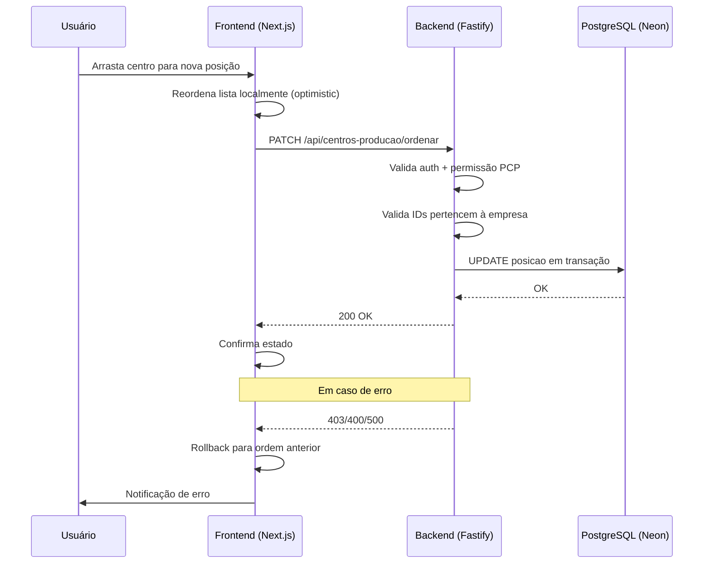
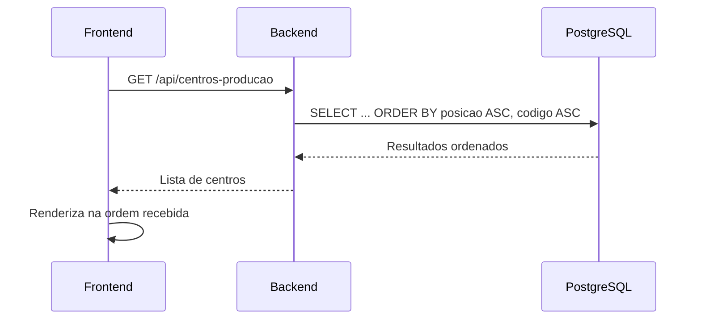

# Design Document — Ordenação de Grupos de Programação

## Overview

Esta feature adiciona reordenação manual de centros de produção no painel PCP. A abordagem é simples: um campo `posicao` inteiro no modelo `CentroProducao` controla a ordem de exibição, persistida no banco por empresa. Um endpoint PATCH permite atualizar posições em batch, e o frontend usa @dnd-kit para drag-and-drop com optimistic update e rollback em caso de falha.

**Decisões de design:**
- Campo `posicao` diretamente no modelo existente (vs. tabela de ordenação separada) — menor complexidade, sem JOINs adicionais
- Atualização em batch com lista completa de posições (vs. troca par-a-par) — mais simples no frontend, uma única requisição
- Ordem compartilhada por empresa (vs. por usuário) — requisito explícito, reduz armazenamento

## Architecture



O fluxo de leitura é mais simples:



## Components and Interfaces

### Backend

**Migração Prisma:**
- Adiciona campo `posicao Int @default(0)` ao model `CentroProducao`
- Migration SQL com backfill: atribui posições sequenciais baseadas na ordem atual (`codigo ASC`) por empresa

**Rota `PATCH /api/centros-producao/ordenar`:**
- Arquivo: `src/modules/centro-producao/centro-producao.routes.ts` (adicionar à mesma função de rotas)
- Middleware: `authenticate` + `moduloGuard('PCP')` (já aplicados no escopo do plugin)
- Schema de validação Zod:

```typescript
const ordenarBodySchema = z.object({
  itens: z.array(
    z.object({
      id: z.string().uuid(),
      posicao: z.number().int().min(0),
    })
  ).min(1, 'Lista de ordenação não pode ser vazia'),
})
```

**Modificação na listagem (`GET /api/centros-producao`):**
- Alterar `orderBy` de `{ codigo: 'asc' }` para `[{ posicao: 'asc' }, { codigo: 'asc' }]`

**Modificação na criação (`POST /api/centros-producao`):**
- Antes de criar, consultar `MAX(posicao)` para a empresa
- Atribuir `posicao = maxPosicao + 1` no novo registro

### Frontend

**Componente de reordenação (no workspace VisioFab.Wms.Front):**
- Hook `useCentrosOrdenacao` — encapsula a mutação com @tanstack/react-query
- Componente `SortableCentroItem` — wrapper @dnd-kit para cada item da lista
- Integração no componente de abas PCP existente

**Bibliotecas utilizadas (já instaladas):**
- `@dnd-kit/core` + `@dnd-kit/sortable` + `@dnd-kit/utilities`
- `@tanstack/react-query` para cache e optimistic updates

## Data Models

### Alteração no Model CentroProducao

```prisma
model CentroProducao {
  id             String   @id @default(uuid())
  empresaId      String   @map("empresa_id")
  codigo         String   @db.VarChar(20)
  descricao      String   @db.VarChar(200)
  tipo           String   @db.VarChar(20)
  tipoMaquina    String?  @map("tipo_maquina") @db.VarChar(20)
  capacidadeHora Decimal? @map("capacidade_hora") @db.Decimal(12, 4)
  custoHora      Decimal? @map("custo_hora") @db.Decimal(12, 4)
  posicao        Int      @default(0)                    // ← NOVO
  status         Boolean  @default(true)
  criadoEm       DateTime @default(now()) @map("criado_em")
  atualizadoEm   DateTime @updatedAt @map("atualizado_em")

  recursos      RecursoProducao[]
  etapasRoteiro EtapaRoteiro[]
  etapasOp      EtapaOrdemProducao[]
  apontamentos  ApontamentoProducao[]

  @@unique([empresaId, codigo])
  @@map("centro_producao")
}
```

### API Contracts

**Request — PATCH /api/centros-producao/ordenar:**
```json
{
  "itens": [
    { "id": "uuid-1", "posicao": 0 },
    { "id": "uuid-2", "posicao": 1 },
    { "id": "uuid-3", "posicao": 2 }
  ]
}
```

**Response — 200 OK:**
```json
{ "message": "Ordem atualizada com sucesso", "count": 3 }
```

**Response — 403 Forbidden:**
```json
{ "message": "Um ou mais centros não pertencem à sua empresa" }
```

**Response — 400 Bad Request:**
```json
{ "message": "Lista de ordenação não pode ser vazia" }
```

### Migration SQL (backfill)

```sql
-- Atribuir posições sequenciais para centros existentes, ordenados por codigo dentro de cada empresa
WITH ranked AS (
  SELECT id, ROW_NUMBER() OVER (PARTITION BY empresa_id ORDER BY codigo ASC) - 1 AS nova_posicao
  FROM centro_producao
)
UPDATE centro_producao
SET posicao = ranked.nova_posicao
FROM ranked
WHERE centro_producao.id = ranked.id;
```

## Correctness Properties

*A property is a characteristic or behavior that should hold true across all valid executions of a system — essentially, a formal statement about what the system should do. Properties serve as the bridge between human-readable specifications and machine-verifiable correctness guarantees.*

### Property 1: Position auto-increment on creation

*For any* company with N existing centers (each with some position value), when a new CentroProducao is created for that company, the new center's `posicao` SHALL be equal to `max(existing positions) + 1`, and centers from other companies SHALL not be affected.

**Validates: Requirements 1.2, 1.3, 6.1**

### Property 2: Reorder updates all positions correctly

*For any* valid reorder request containing a list of `{id, posicao}` pairs where all IDs belong to the authenticated user's company, after the operation completes, each center SHALL have exactly the position specified in the request.

**Validates: Requirements 2.1**

### Property 3: Reorder rejects foreign IDs atomically

*For any* reorder request containing at least one ID that does not belong to the authenticated user's company, the system SHALL return HTTP 403 AND all centers SHALL retain their original positions (no partial updates).

**Validates: Requirements 2.2, 2.3**

### Property 4: Invalid input validation

*For any* request body that does not conform to the expected schema (empty array, missing `id` or `posicao` fields, non-UUID `id`, negative `posicao`, non-integer `posicao`, or non-array body), the system SHALL return HTTP 400.

**Validates: Requirements 2.4**

### Property 5: List ordering invariant

*For any* set of centers belonging to a company, the list endpoint SHALL return them sorted by `posicao` ascending; when two centers share the same `posicao`, they SHALL be ordered by `codigo` ascending (lexicographic).

**Validates: Requirements 3.1, 3.2**

### Property 6: Creation preserves existing positions

*For any* company with existing centers, when a new center is created, all pre-existing centers SHALL maintain their original `posicao` values unchanged.

**Validates: Requirements 6.2**

## Error Handling

| Cenário | HTTP Status | Mensagem | Ação no Frontend |
|---------|-------------|----------|-----------------|
| Usuário não autenticado | 401 | "Token inválido ou ausente" | Redireciona para login |
| Sem permissão PCP | 403 | "Sem acesso ao módulo" | Exibe toast de erro |
| ID de outra empresa no payload | 403 | "Um ou mais centros não pertencem à sua empresa" | Rollback visual + toast |
| Payload vazio ou inválido | 400 | Mensagem descritiva do Zod | Rollback visual + toast |
| Erro interno no banco | 500 | "Erro interno do servidor" | Rollback visual + toast |
| Timeout de rede | — | — | Rollback visual + toast "Falha na conexão" |

**Tratamento de concorrência:**
- Se dois usuários reordenarem simultaneamente, a última escrita vence (last-write-wins)
- Não há necessidade de locking otimista pois a operação é idempotente e rara

**Transação no banco:**
- A atualização de posições usa `prisma.$transaction()` para garantir atomicidade
- Se qualquer UPDATE falhar, todas as posições são revertidas

## Testing Strategy

### Testes Property-Based (Backend — fast-check + Vitest)

A feature é adequada para PBT porque as operações de reordenação e criação possuem propriedades universais que devem valer para qualquer combinação de centros e posições.

**Biblioteca:** `fast-check` (já instalado como devDependency)
**Runner:** Vitest (`vitest run`)
**Iterações:** mínimo 100 por propriedade

Cada propriedade será implementada como um único teste property-based, testando a lógica pura de ordenação isolada do HTTP (funções extraídas para testabilidade):

- `calcularNovaPosicao(existingPositions: number[]): number` — Property 1, 6
- `aplicarReordenacao(centros: Centro[], itens: {id, posicao}[]): Centro[]` — Property 2
- `validarEmpresa(itens: {id}[], centrosEmpresa: {id}[]): boolean` — Property 3
- `ordenarCentros(centros: Centro[]): Centro[]` — Property 5

**Tags de referência:**
```
// Feature: ordenacao-grupos-programacao, Property 1: Position auto-increment on creation
// Feature: ordenacao-grupos-programacao, Property 2: Reorder updates all positions correctly
// Feature: ordenacao-grupos-programacao, Property 3: Reorder rejects foreign IDs atomically
// Feature: ordenacao-grupos-programacao, Property 4: Invalid input validation
// Feature: ordenacao-grupos-programacao, Property 5: List ordering invariant
// Feature: ordenacao-grupos-programacao, Property 6: Creation preserves existing positions
```

### Testes Unitários (Backend — Vitest)

- Validação do schema Zod com exemplos concretos (casos limítrofes: array vazio, UUID inválido, posicao negativa)
- Teste de autenticação/permissão no endpoint (smoke test)
- Teste de idempotência: reordenar com mesmas posições não altera nada

### Testes Unitários (Frontend — Vitest)

- `useCentrosOrdenacao` hook: verifica optimistic update e rollback
- Componente de lista: verifica renderização na ordem correta
- Indicador de salvamento: visível durante mutação pendente

### Testes E2E (Frontend — Playwright)

- Fluxo completo: arrastar centro, verificar chamada API, verificar ordem final
- Fluxo de erro: simular falha de rede, verificar rollback visual
