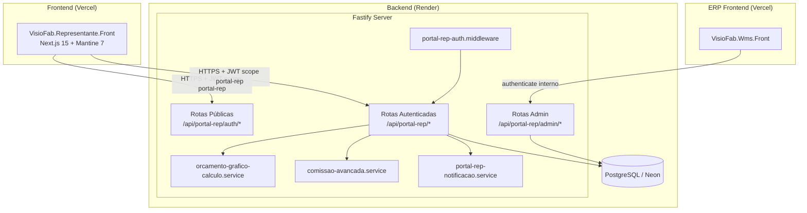
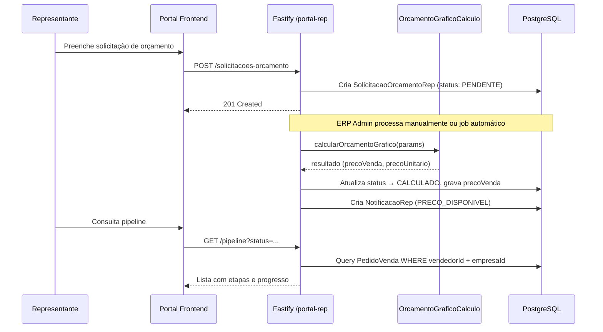

# Design Document — Portal do Representante

## Overview

O Portal do Representante é um módulo que adiciona ao backend Fastify existente um conjunto de rotas dedicadas (`/api/portal-rep`) com autenticação própria (JWT com scope `portal-rep`), permitindo que representantes comerciais externos criem solicitações de orçamento, acompanhem o pipeline de pedidos, visualizem comissões e gerenciem sua carteira de clientes — tudo com isolamento estrito por `empresaId` + `vendedorId`.

O frontend será uma aplicação Next.js 15 separada (`VisioFab.Representante.Front`), consumindo exclusivamente as rotas `/api/portal-rep/*`. O backend reutiliza a mesma instância Fastify e banco PostgreSQL (Neon), mas com models Prisma dedicados para credenciais e um middleware de autenticação isolado do login interno do ERP.

### Decisões Arquiteturais

| Decisão | Justificativa |
|---------|---------------|
| Autenticação separada (model `RepresentanteCredencial`, não `Usuario`) | Isolamento total entre ERP e portal; mesmo padrão do portal 3PL existente (`PortalUsuario`) |
| Mesmo servidor Fastify, rotas prefixadas `/api/portal-rep` | Evita duplicar infra; o Render já hospeda a API |
| JWT com `scope: 'portal-rep'` + campos `empresaId`, `vendedorId`, `representanteId` | Diferenciação de tokens por scope (já usado no portal 3PL com `scope: 'portal'`) |
| Frontend separado (Next.js standalone) | Representante NÃO acessa ERP; deploy independente (Vercel, domínio próprio) |
| Integração com motor de orçamento gráfico via invocação interna (service-to-service) | Sem HTTP extra; `calcularOrcamentoGrafico()` já é função pura importável |
| Comissão calculada em tempo real a partir de `RegraComissao` + campo `comissao` do `Vendedor` | Reutiliza módulo `comissao-avancada` existente como fallback |

---

## Architecture



### Fluxo de Dados Principal



---

## Components and Interfaces

### 1. Módulo de Autenticação (`portal-rep-auth`)

| Componente | Responsabilidade |
|------------|-----------------|
| `portal-rep-auth.middleware.ts` | Verifica JWT, extrai `scope: 'portal-rep'`, popula `request.portalRepUser` |
| `portal-rep-auth.service.ts` | Login, troca de senha, bloqueio por tentativas, refresh token |
| `portal-rep-auth.routes.ts` | `POST /auth/login`, `POST /auth/trocar-senha`, `POST /auth/refresh` |

**Interface `PortalRepUser`**:
```typescript
interface PortalRepUser {
  scope: 'portal-rep'
  empresaId: string
  vendedorId: string
  representanteId: string // id do RepresentanteCredencial
}
```

### 2. Módulo de Solicitação de Orçamento (`portal-rep-solicitacao`)

| Componente | Responsabilidade |
|------------|-----------------|
| `portal-rep-solicitacao.routes.ts` | CRUD de solicitações + consulta de preço |
| `portal-rep-solicitacao.service.ts` | Lógica de criação, validação, integração com motor de cálculo |

**Rotas**:
- `POST /solicitacoes-orcamento` — cria solicitação
- `GET /solicitacoes-orcamento` — lista com filtros
- `GET /solicitacoes-orcamento/:id` — detalhe
- `DELETE /solicitacoes-orcamento/:id` — cancela (só se PENDENTE)

### 3. Módulo de Pipeline (`portal-rep-pipeline`)

| Componente | Responsabilidade |
|------------|-----------------|
| `portal-rep-pipeline.routes.ts` | Consulta de pipeline por vendedorId |
| `portal-rep-pipeline.service.ts` | Monta timeline cruzando PedidoVenda + OrdemProducao + VendaEfetivada |

**Rotas**:
- `GET /pipeline` — lista pedidos com status/etapa atual + filtros
- `GET /pipeline/:pedidoVendaId` — detalhe com progresso de produção

### 4. Módulo de Comissão (`portal-rep-comissao`)

| Componente | Responsabilidade |
|------------|-----------------|
| `portal-rep-comissao.routes.ts` | Consulta de comissões projetadas/realizadas |
| `portal-rep-comissao.service.ts` | Cálculo de comissão usando `RegraComissao` + aggregations por período |

**Rotas**:
- `GET /comissoes` — resumo por período (projetada + realizada)
- `GET /comissoes/detalhe` — detalhamento por pedido

### 5. Módulo de Carteira de Clientes (`portal-rep-clientes`)

| Componente | Responsabilidade |
|------------|-----------------|
| `portal-rep-clientes.routes.ts` | CRUD de clientes vinculados ao vendedor |
| `portal-rep-clientes.service.ts` | Validação CPF/CNPJ, criação no cadastro central, aprovação admin |

**Rotas**:
- `GET /clientes` — lista carteira do representante
- `POST /clientes` — cadastra novo cliente/prospect
- `PUT /clientes/:id` — edita dados complementares
- `PUT /clientes/:id/campos-fiscais` — solicita alteração (requer aprovação)

### 6. Módulo de Notificações (`portal-rep-notificacoes`)

| Componente | Responsabilidade |
|------------|-----------------|
| `portal-rep-notificacao.service.ts` | Criação, listagem, envio de e-mail |
| `portal-rep-notificacao.routes.ts` | API de notificações |

**Rotas**:
- `GET /notificacoes` — lista com paginação + indicador não-lida
- `PUT /notificacoes/:id/lida` — marca como lida
- `PUT /notificacoes/ler-todas` — marca todas como lidas
- `GET /notificacoes/count-nao-lidas` — badge count

### 7. Módulo Admin (`portal-rep-admin`)

Rotas sob `/api/portal-rep/admin/*`, protegidas pelo middleware `authenticate` interno do ERP (perfil ADMIN/SUPER_ADMIN).

**Rotas**:
- `GET /admin/representantes` — lista contas do portal
- `POST /admin/representantes` — cria conta (vincula a Vendedor existente)
- `PUT /admin/representantes/:id` — edita (ativa/inativa, tipo comissão)
- `PUT /admin/representantes/:id/inativar` — inativa conta
- `PUT /admin/representantes/:id/resetar-senha` — gera nova senha temporária
- `GET /admin/solicitacoes-orcamento` — lista todas as solicitações da empresa
- `POST /admin/solicitacoes-orcamento/:id/calcular` — processa orçamento
- `PUT /admin/configuracao-comissao` — define critério de creditamento
- `GET /admin/aprovacoes-cliente` — pendências de alteração fiscal

---

## Data Models

### Novos Models Prisma

```prisma
// ============================================================================
// PORTAL DO REPRESENTANTE
// ============================================================================

model RepresentanteCredencial {
  id                  String    @id @default(uuid())
  empresaId           String    @map("empresa_id")
  vendedorId          String    @map("vendedor_id")
  vendedor            Vendedor  @relation(fields: [vendedorId], references: [id])
  email               String    @db.VarChar(200)
  senhaHash           String    @map("senha_hash")
  senhaTemporaria     Boolean   @default(true) @map("senha_temporaria")
  status              String    @default("ATIVO") @db.VarChar(10) // ATIVO, INATIVO, BLOQUEADO
  tentativasLogin     Int       @default(0) @map("tentativas_login")
  bloqueadoAte        DateTime? @map("bloqueado_ate")
  ultimoAcesso        DateTime? @map("ultimo_acesso")
  tokenRefresh        String?   @map("token_refresh") @db.Text
  notificacaoEmail    Boolean   @default(true) @map("notificacao_email")
  criadoEm            DateTime  @default(now()) @map("criado_em")
  atualizadoEm        DateTime  @updatedAt @map("atualizado_em")

  solicitacoes        SolicitacaoOrcamentoRep[]
  notificacoes        NotificacaoRep[]
  logsAuditoria       LogAuditoriaRep[]

  @@unique([empresaId, email])
  @@unique([empresaId, vendedorId])
  @@map("representante_credencial")
}

model SolicitacaoOrcamentoRep {
  id                    String                  @id @default(uuid())
  empresaId             String                  @map("empresa_id")
  representanteId       String                  @map("representante_id")
  representante         RepresentanteCredencial @relation(fields: [representanteId], references: [id])
  vendedorId            String                  @map("vendedor_id")
  clienteId             String?                 @map("cliente_id")
  clienteNome           String?                 @map("cliente_nome") @db.VarChar(200)
  clienteCpfCnpj        String?                 @map("cliente_cpf_cnpj") @db.VarChar(20)
  
  // Dados simplificados do orçamento
  tipoEmbalagem         String                  @map("tipo_embalagem") @db.VarChar(100)
  medidaLargura         Decimal?                @map("medida_largura") @db.Decimal(10, 2)
  medidaAltura          Decimal?                @map("medida_altura") @db.Decimal(10, 2)
  medidaComprimento     Decimal?                @map("medida_comprimento") @db.Decimal(10, 2)
  quantidade            Int
  acabamentos           String?                 @db.Text // JSON serializado
  observacoes           String?                 @db.Text
  
  // Resultado (preenchido pelo ERP após cálculo)
  precoVenda            Decimal?                @map("preco_venda") @db.Decimal(12, 2)
  precoUnitario         Decimal?                @map("preco_unitario") @db.Decimal(12, 4)
  orcamentoGraficoId    String?                 @map("orcamento_grafico_id") // referência ao orçamento completo no ERP
  
  status                String                  @default("PENDENTE") @db.VarChar(20)
  // Status: PENDENTE → CALCULANDO → CALCULADO → APROVADO → RECUSADO → CANCELADO
  
  criadoEm              DateTime                @default(now()) @map("criado_em")
  atualizadoEm          DateTime                @updatedAt @map("atualizado_em")

  @@index([empresaId, vendedorId, status])
  @@map("solicitacao_orcamento_rep")
}

model NotificacaoRep {
  id                String                  @id @default(uuid())
  empresaId         String                  @map("empresa_id")
  representanteId   String                  @map("representante_id")
  representante     RepresentanteCredencial @relation(fields: [representanteId], references: [id])
  tipo              String                  @db.VarChar(30)
  // Tipos: PRECO_DISPONIVEL, PEDIDO_ATUALIZADO, COMISSAO_CREDITADA, CLIENTE_APROVADO, GERAL
  titulo            String                  @db.VarChar(200)
  mensagem          String                  @db.Text
  referencia        String?                 @db.VarChar(100) // ex: "solicitacao:uuid" ou "pedido:uuid"
  lida              Boolean                 @default(false)
  enviadaEmail      Boolean                 @default(false) @map("enviada_email")
  criadoEm          DateTime                @default(now()) @map("criado_em")

  @@index([empresaId, representanteId, lida])
  @@map("notificacao_rep")
}

model LogAuditoriaRep {
  id                String                  @id @default(uuid())
  empresaId         String                  @map("empresa_id")
  representanteId   String?                 @map("representante_id")
  representante     RepresentanteCredencial? @relation(fields: [representanteId], references: [id])
  acao              String                  @db.VarChar(50)
  // Ações: LOGIN, LOGIN_FALHOU, BLOQUEIO, SOLICITACAO_CRIADA, CLIENTE_CADASTRADO, etc.
  detalhes          String?                 @db.Text
  ip                String?                 @db.VarChar(45)
  criadoEm          DateTime                @default(now()) @map("criado_em")

  @@index([empresaId, representanteId, criadoEm])
  @@map("log_auditoria_rep")
}

model AprovacaoClienteRep {
  id                String    @id @default(uuid())
  empresaId         String    @map("empresa_id")
  representanteId   String    @map("representante_id")
  clienteId         String    @map("cliente_id")
  tipo              String    @db.VarChar(30) // VINCULACAO, ALTERACAO_FISCAL
  dadosAnteriores   Json?     @map("dados_anteriores")
  dadosNovos        Json      @map("dados_novos")
  status            String    @default("PENDENTE") @db.VarChar(15) // PENDENTE, APROVADO, REJEITADO
  aprovadoPorId     String?   @map("aprovado_por_id")
  observacao        String?   @db.Text
  criadoEm          DateTime  @default(now()) @map("criado_em")
  atualizadoEm      DateTime  @updatedAt @map("atualizado_em")

  @@index([empresaId, status])
  @@map("aprovacao_cliente_rep")
}
```

### Alterações em Models Existentes

```prisma
// Adicionar relação em Vendedor:
model Vendedor {
  // ... campos existentes ...
  representanteCredencial RepresentanteCredencial?
}

// Adicionar campo vendedorId em Cliente (para carteira):
model Cliente {
  // ... campos existentes ...
  vendedorId String? @map("vendedor_id")
  // Nota: NÃO é FK formal pois um cliente pode existir sem vendedor
  // A relação é buscada via query direta
}
```

### Configurações via Parametro (tabela existente)

| Chave | Tipo | Default | Descrição |
|-------|------|---------|-----------|
| `portal-rep.habilitado` | boolean | false | Ativa/desativa o portal para a empresa |
| `portal-rep.criterio-creditamento` | string | "ENTREGUE" | Quando creditar comissão: `ENTREGUE`, `FATURADO`, `PAGO` |
| `portal-rep.tipo-comissao-padrao` | string | "FIXA" | Tipo padrão ao criar representante: `FIXA`, `VARIAVEL` |
| `portal-rep.jwt-expiracao-minutos` | number | 480 | Tempo de vida do access token (8h) |
| `portal-rep.refresh-expiracao-dias` | number | 30 | Tempo de vida do refresh token |
| `portal-rep.notificacao-email` | boolean | true | Enviar e-mails em transições críticas |

---

## Correctness Properties

*Uma propriedade (property) é uma característica ou comportamento que deve ser verdadeiro em todas as execuções válidas de um sistema — essencialmente, uma declaração formal sobre o que o sistema deve fazer. Properties servem como ponte entre especificações legíveis por humanos e garantias de corretude verificáveis por máquina.*

### Property 1: Isolamento multi-tenant completo

*Para qualquer* representante autenticado e qualquer endpoint do portal, todos os registros retornados (pedidos, solicitações, clientes, comissões, notificações) devem ter `empresaId` igual ao `empresaId` do representante E devem estar vinculados ao `vendedorId` do representante (quando aplicável ao recurso).

**Validates: Requirements 1.5, 3.1, 5.1, 7.1**

### Property 2: Ocultação de dados sensíveis

*Para qualquer* resposta JSON de qualquer endpoint acessível pelo representante, o payload não deve conter campos de `custoTotal`, `custoMaterial`, `custoMaquina`, `margem`, `margemReal`, `markup`, `impostos`, `despAdm` ou qualquer campo que exponha composição de preço — apenas `precoVenda` e `precoUnitario` são permitidos como informação de valor.

**Validates: Requirements 2.2, 2.3, 4.7**

### Property 3: Bloqueio por tentativas consecutivas

*Para qualquer* credencial de representante, se o número de tentativas de login inválidas consecutivas atingir 5, o campo `status` deve ser `BLOQUEADO` e `bloqueadoAte` deve ser um timestamp ~15 minutos no futuro. Se o número de tentativas for menor que 5, o status não deve ser BLOQUEADO por esse motivo.

**Validates: Requirements 1.4**

### Property 4: Senha temporária bloqueia acesso funcional

*Para qualquer* credencial com `senhaTemporaria = true`, após login bem-sucedido, qualquer requisição a rotas funcionais do portal (exceto `/auth/trocar-senha`) deve retornar HTTP 403 com indicação de que a troca de senha é obrigatória.

**Validates: Requirements 1.2**

### Property 5: Token JWT contém claims obrigatórios

*Para qualquer* login bem-sucedido (senha não temporária, status ATIVO), o token JWT emitido deve conter exatamente os campos: `scope = 'portal-rep'`, `empresaId` (string UUID), `vendedorId` (string UUID) e `representanteId` (string UUID), todos correspondendo aos valores reais da credencial no banco.

**Validates: Requirements 1.3**

### Property 6: Separação de domínios de autenticação

*Para qualquer* token JWT com `scope = 'portal-rep'`, o acesso a rotas internas do ERP (prefixo `/api/` exceto `/api/portal-rep/`) deve ser rejeitado com HTTP 401 ou 403. Inversamente, *para qualquer* token interno do ERP (scope diferente de `portal-rep`), o acesso a rotas `/api/portal-rep/*` autenticadas deve ser rejeitado.

**Validates: Requirements 7.2, 7.5**

### Property 7: Solicitação vinculada ao vendedorId

*Para qualquer* solicitação de orçamento criada via portal, o campo `vendedorId` da solicitação deve ser igual ao `vendedorId` extraído do token JWT do representante que a criou — nunca nulo e nunca um vendedorId diferente.

**Validates: Requirements 2.1**

### Property 8: Transições de status geram notificação

*Para qualquer* solicitação que transiciona para status `CALCULADO`, deve existir exatamente uma `NotificacaoRep` do tipo `PRECO_DISPONIVEL` vinculada. *Para qualquer* pedido do representante que muda de etapa no pipeline, deve existir uma `NotificacaoRep` do tipo `PEDIDO_ATUALIZADO`. *Para qualquer* comissão que transiciona para `REALIZADA`, deve existir uma `NotificacaoRep` do tipo `COMISSAO_CREDITADA`.

**Validates: Requirements 2.5, 8.1, 8.2, 8.3**

### Property 9: Cálculo de comissão correto

*Para qualquer* pedido de venda vinculado a um representante: se o tipo de comissão é FIXA, o valor da comissão projetada deve ser `precoVenda * vendedor.comissao / 100`. Se o tipo é VARIAVEL, o valor deve ser `precoVenda * regraComissao.percentual / 100` onde `regraComissao` é a regra mais específica aplicável (por produto > por categoria > geral).

**Validates: Requirements 4.1, 4.2, 4.3**

### Property 10: Totalização de comissões por período

*Para qualquer* período (mês) consultado, `totalProjetado` deve ser a soma das comissões de pedidos com status antes do critério de creditamento, e `totalRealizado` deve ser a soma das comissões de pedidos que atingiram o critério. A soma dos dois deve ser consistente com a lista individual de pedidos do período.

**Validates: Requirements 4.4, 4.5**

### Property 11: Validação e unicidade de CPF/CNPJ

*Para qualquer* string que não satisfaça o algoritmo de validação de CPF (11 dígitos com dígitos verificadores corretos) ou CNPJ (14 dígitos com dígitos verificadores corretos), a criação de cliente via portal deve ser rejeitada. *Para qualquer* CPF/CNPJ que já existe na tabela Cliente com o mesmo `empresaId`, a criação de um novo registro deve ser rejeitada (oferecendo vinculação).

**Validates: Requirements 5.4, 5.5**

### Property 12: Edição fiscal submete para aprovação

*Para qualquer* tentativa de editar campos fiscais (`razaoSocial`, `cpfCnpj`, `inscEstadual`) de um cliente via portal, o sistema deve: (a) NÃO alterar o registro Cliente diretamente, e (b) criar um registro `AprovacaoClienteRep` com status `PENDENTE` contendo os dados propostos.

**Validates: Requirements 5.7**

### Property 13: Cadastro de cliente propaga para tabela central

*Para qualquer* cliente criado com sucesso via portal do representante, deve existir um registro correspondente na tabela `Cliente` do sistema de vendas com os mesmos dados obrigatórios (razaoSocial, cpfCnpj, endereço) e com `vendedorId` preenchido com o vendedorId do representante.

**Validates: Requirements 5.2, 5.3**

### Property 14: Filtros retornam subconjunto válido

*Para qualquer* consulta com filtros (status, cliente, período, número) em pipeline ou comissões, todos os registros retornados devem satisfazer TODOS os critérios do filtro aplicado. O resultado sem filtro deve ser um superconjunto dos resultados filtrados.

**Validates: Requirements 3.5, 4.6**

### Property 15: Progresso de produção

*Para qualquer* pedido na etapa "Em Produção" com uma Ordem de Produção contendo N etapas totais e K etapas concluídas, o percentual de progresso retornado deve ser `Math.round(K / N * 100)`.

**Validates: Requirements 3.4**

### Property 16: Auditoria registrada

*Para qualquer* operação de login (sucesso ou falha), criação de solicitação de orçamento, ou cadastro de cliente, deve existir um registro correspondente em `LogAuditoriaRep` com a ação correta, o `representanteId` do autor e timestamp ≤ now().

**Validates: Requirements 7.4**

### Property 17: Vinculação 1:1 representante-vendedor

*Para qualquer* tentativa de criar uma `RepresentanteCredencial` com um `vendedorId` que já possui credencial ativa na mesma empresa, a operação deve ser rejeitada com erro de conflito. A constraint `@@unique([empresaId, vendedorId])` garante isso a nível de banco.

**Validates: Requirements 6.2**


---

## Error Handling

### Estratégia de Erros por Camada

| Camada | Tratamento | Código HTTP |
|--------|-----------|-------------|
| **Autenticação** | Token inválido/expirado/revogado | 401 Unauthorized |
| **Autorização** | Scope errado, conta inativa, senha temporária | 403 Forbidden |
| **Validação** | Zod parse errors, CPF/CNPJ inválido | 400 Bad Request |
| **Conflito** | Email duplicado, vendedor já vinculado, CPF/CNPJ existente | 409 Conflict |
| **Não encontrado** | Recurso inexistente ou de outra empresa | 404 Not Found |
| **Rate limiting** | Bloqueio por tentativas de login | 429 Too Many Requests |
| **Erro interno** | Falha no banco, serviço indisponível | 500 Internal Server Error |

### Formato Padrão de Resposta de Erro

```typescript
interface ErrorResponse {
  message: string        // mensagem legível para o frontend
  code?: string          // código de erro máquina (ex: 'SENHA_TEMPORARIA', 'CONTA_BLOQUEADA')
  details?: unknown      // detalhes adicionais (Zod issues, etc.)
}
```

### Cenários Específicos

| Cenário | Resposta | Ação do Frontend |
|---------|----------|------------------|
| Login com senha temporária | `403 { code: 'SENHA_TEMPORARIA' }` | Redirecionar para tela de troca |
| Conta bloqueada por tentativas | `429 { code: 'CONTA_BLOQUEADA', details: { bloqueadoAte } }` | Mostrar timer de desbloqueio |
| Conta inativada pelo admin | `401 { code: 'CONTA_INATIVA' }` | Redirecionar para login com mensagem |
| Token expirado, refresh válido | `401` | Frontend auto-renova via `/auth/refresh` |
| Token expirado, refresh expirado | `401 { code: 'SESSAO_EXPIRADA' }` | Redirecionar para login |
| CPF/CNPJ já existe | `409 { code: 'DOCUMENTO_EXISTENTE', details: { clienteExistente } }` | Oferecer vinculação |
| Vendedor já vinculado a outro representante | `409 { code: 'VENDEDOR_JA_VINCULADO' }` | Mostrar erro |
| Motor de cálculo falha | `500 { code: 'ERRO_CALCULO' }` | Manter solicitação como PENDENTE, notificar admin |

### Auditoria de Erros

Toda tentativa de acesso negado (401, 403) gera um `LogAuditoriaRep`:
- `acao: 'LOGIN_FALHOU'` — credenciais inválidas
- `acao: 'ACESSO_NEGADO'` — token válido mas sem permissão
- `acao: 'BLOQUEIO'` — conta bloqueada por tentativas

---

## Testing Strategy

### Abordagem Dual: Unit + Property-Based Testing

Este módulo é adequado para property-based testing (PBT) porque:
- Há lógica pura testável (cálculo de comissão, validação CPF/CNPJ, isolamento de dados, mapeamento de pipeline)
- As propriedades são universais (devem valer para qualquer input válido)
- O espaço de inputs é grande (combinações de vendedores, pedidos, valores, documentos)

### Configuração de PBT

- **Biblioteca**: `fast-check` (já usada no projeto frontend, adotar também no backend)
- **Mínimo de iterações**: 100 por propriedade
- **Tag**: Cada teste referencia a propriedade do design com formato: `Feature: portal-representante, Property N: [título]`

### Distribuição de Testes

| Tipo | Escopo | Ferramentas |
|------|--------|-------------|
| **Property-based** | Lógica de isolamento, cálculo de comissão, validação CPF/CNPJ, ocultação de campos, filtros, progressão, auditoria | `fast-check` + Vitest |
| **Unit (example-based)** | Fluxo de login, troca de senha, CRUD admin, refresh token, cenários de borda | Vitest |
| **Integration** | Integração com motor de orçamento, envio de e-mail (mock), transições de status end-to-end | Vitest + mocks |
| **E2E** | Fluxo completo: login → criar solicitação → receber preço → ver pipeline | Playwright (frontend) |

### Prioridades de Implementação

1. **P1 — Isolamento multi-tenant** (Property 1): risco mais alto, bug mais perigoso
2. **P2 — Ocultação de dados sensíveis** (Property 2): vazamento de informação comercial
3. **P3 — Autenticação/bloqueio** (Properties 3, 4, 5, 6): segurança de acesso
4. **P4 — Cálculo de comissão** (Properties 9, 10): impacto financeiro direto
5. **P5 — Validação CPF/CNPJ** (Property 11): integridade de dados
6. **P6 — Demais propriedades**: pipeline, notificações, auditoria, filtros

### Mocking Strategy

| Dependência | Mock |
|-------------|------|
| `prisma` | In-memory mock (já existem padrões no projeto) |
| Motor de orçamento gráfico | Mock de `calcularOrcamentoGrafico()` retornando resultado fixo |
| Envio de e-mail (SMTP) | Mock de `ConfigSmtp` + verificação de chamada |
| JWT | Real (verificação de claims via decode) |
| Banco PostgreSQL | Testcontainers para integration tests |

### Exemplos de Generators (fast-check)

```typescript
// Generator de representante válido
const representanteArb = fc.record({
  empresaId: fc.uuid(),
  vendedorId: fc.uuid(),
  email: fc.emailAddress(),
  nome: fc.string({ minLength: 2, maxLength: 150 }),
})

// Generator de CPF válido
const cpfValidoArb = fc.string({ minLength: 11, maxLength: 11 })
  .filter(s => validarCpf(s))
// Ou construtor: gera 9 dígitos aleatórios + calcula verificadores

// Generator de pedido com valor de venda
const pedidoComissaoArb = fc.record({
  precoVenda: fc.float({ min: 0.01, max: 999999.99 }),
  percentualComissao: fc.float({ min: 0, max: 100 }),
})
```
