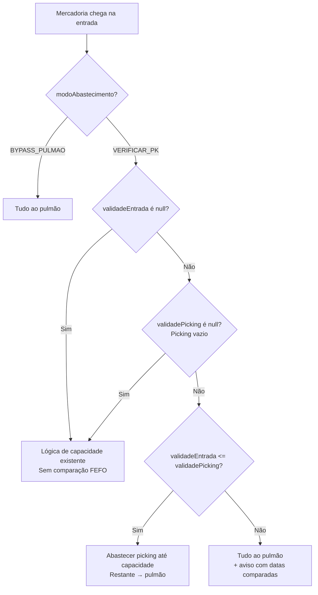
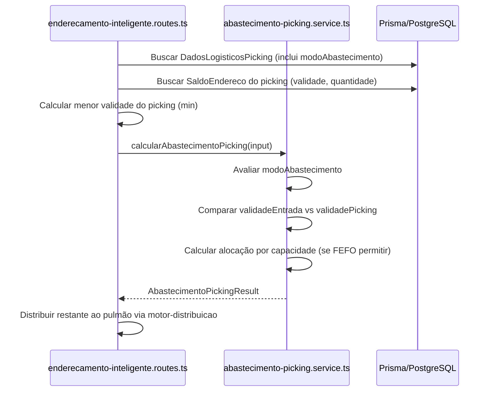

# Design Document — Regras FEFO no Abastecimento de Picking (Entrada)

## Overview

Este documento descreve o design técnico da implementação de regras FEFO (First Expired, First Out) no serviço de abastecimento de picking durante o endereçamento de mercadorias na entrada. A funcionalidade estende o serviço puro existente `abastecimento-picking.service.ts` para incorporar comparação de validade antes de decidir se a mercadoria vai para o picking ou para o pulmão.

**Princípio fundamental:** O picking SEMPRE deve conter o produto com validade mais próxima do vencimento. Portanto, mercadoria nova só vai ao picking se sua validade for menor ou igual à que já está lá.

**Decisão de design:** Manter a natureza de função pura — todos os dados necessários (validadeEntrada, validadePicking, modoAbastecimento) são passados como parâmetros. A obtenção da menor validade do picking e do modo de operação é responsabilidade do chamador (rota de endereçamento inteligente).

## Architecture

### Visão Geral da Cadeia de Decisão



### Camadas Envolvidas



## Components and Interfaces

### Alterações na Interface `DadosPickingConfig`

```typescript
export interface DadosPickingConfig {
  enderecoPickingId: string
  enderecoCompleto: string
  capacidade: number
  pontoReposicao: number | null
  saldoAtual: number
  enderecoAtivo: boolean
  sequencia: number
  // ── Novos campos ──
  validadePicking: Date | null    // menor validade encontrada no picking para este endereço/produto
  modoAbastecimento: 'VERIFICAR_PK' | 'BYPASS_PULMAO'  // modo de operação do produto
}
```

### Alterações na Interface `AbastecimentoPickingInput`

```typescript
export interface AbastecimentoPickingInput {
  quantidadeRestante: number
  dadosPicking: DadosPickingConfig[]
  // ── Novo campo ──
  validadeEntrada: Date | null    // validade da mercadoria sendo endereçada
}
```

### Nova Função Utilitária: `obterMenorValidadePicking`

```typescript
/**
 * Dado um array de validades (possivelmente com nulls), retorna a menor data
 * (mais próxima do vencimento). Retorna null se todas forem null ou o array vazio.
 */
export function obterMenorValidadePicking(validades: (Date | null)[]): Date | null
```

### Alteração na Lógica Central: `calcularAbastecimentoPicking`

A função `calcularAbastecimentoPicking` receberá o novo campo `validadeEntrada` no input e o novo campo `validadePicking` + `modoAbastecimento` em cada `DadosPickingConfig`. A lógica de decisão dentro do loop de endereços passará a incluir:

1. **Bypass check** (antes de qualquer outra verificação):
   - Se `config.modoAbastecimento === 'BYPASS_PULMAO'` → pular endereço, registrar aviso.

2. **FEFO check** (depois de ponto de reposição, antes do cálculo de capacidade):
   - Se `input.validadeEntrada === null` → comportamento existente (só capacidade).
   - Se `config.validadePicking === null` → comportamento existente (picking vazio, só capacidade).
   - Se `input.validadeEntrada <= config.validadePicking` → permitir abastecimento (capacidade).
   - Se `input.validadeEntrada > config.validadePicking` → bloquear abastecimento, registrar aviso com datas.

### Alteração na Rota `/distribuir`

No trecho de montagem do `dadosPickingConfigs[]`, a rota passará a:

1. Buscar o campo `modoAbastecimento` de `DadosLogisticosPicking` (novo campo no schema).
2. Buscar os registros de `SaldoEndereco` do picking com `validade` não-null e calcular a menor usando `obterMenorValidadePicking`.
3. Obter `validadeEntrada` do body da requisição (campo `validade` já existente no schema Zod da rota, só precisa passar como `Date` no input).

## Data Models

### Alteração no Schema Prisma — `DadosLogisticosPicking`

```prisma
model DadosLogisticosPicking {
  id                    String   @id @default(uuid())
  produtoId             String   @map("produto_id")
  skuSeq                Int      @map("sku_seq")
  sequencia             Int
  enderecoPickingId     String?  @map("endereco_picking_id")
  tipoPicking           String   @default("NORMAL") @db.VarChar(20)
  capacidade            Decimal  @default(0) @db.Decimal(12, 4)
  pontoReposicao        Decimal  @default(0) @map("ponto_reposicao") @db.Decimal(12, 4)
  pontoReposicaoPercent Decimal  @default(0) @map("ponto_reposicao_percent") @db.Decimal(5, 2)
  pontoReposicaoDias    Int      @default(0) @map("ponto_reposicao_dias")
  // ── Novo campo ──
  modoAbastecimento     String   @default("VERIFICAR_PK") @map("modo_abastecimento") @db.VarChar(20)
  criadoEm              DateTime @default(now()) @map("criado_em")
  atualizadoEm          DateTime @updatedAt @map("atualizado_em")

  @@map("dados_logisticos_picking")
}
```

### Migração de Produção (`prisma/migrate-prod.ts`)

```sql
-- Adicionar campo modoAbastecimento à tabela dados_logisticos_picking
ALTER TABLE dados_logisticos_picking
  ADD COLUMN IF NOT EXISTS modo_abastecimento VARCHAR(20) NOT NULL DEFAULT 'VERIFICAR_PK';
```

A migração é idempotente (usa `IF NOT EXISTS`) e o valor default `VERIFICAR_PK` garante que todos os produtos existentes continuam com o comportamento atual (regras FEFO aplicadas).

### Modelo de Dados Existente Utilizado (sem alteração)

- **`SaldoEndereco`**: campo `validade DateTime?` já existe — será consultado para obter a menor validade do picking.
- **`DadosLogisticosPicking`**: campo `enderecoPickingId` já aponta para o endereço de picking.

## Correctness Properties

*Uma propriedade é uma característica ou comportamento que deve ser verdadeiro em todas as execuções válidas de um sistema — essencialmente, uma declaração formal sobre o que o sistema deve fazer. Propriedades servem como ponte entre especificações legíveis por humanos e garantias de corretude verificáveis por máquina.*

### Property 1: Validade menor ou igual permite abastecimento por capacidade

*Para qualquer* combinação válida onde `validadeEntrada <= validadePicking` (ambas não-null) e `modoAbastecimento === 'VERIFICAR_PK'`, a quantidade abastecida no picking SHALL ser igual a `min(quantidadeRestante, capacidade - saldoAtual)` (o mesmo cálculo da lógica de capacidade existente).

**Validates: Requirements 1.1, 1.2, 2.1, 10.2**

### Property 2: Validade maior bloqueia picking completamente

*Para qualquer* combinação onde `validadeEntrada > validadePicking` (ambas não-null) e `modoAbastecimento === 'VERIFICAR_PK'`, a quantidade abastecida no picking SHALL ser zero, independentemente do saldo ou capacidade disponível.

**Validates: Requirements 3.1, 3.2, 10.3**

### Property 3: Ausência de validade no picking ou na entrada desativa FEFO

*Para qualquer* input onde `validadeEntrada === null` OU `validadePicking === null` (com `modoAbastecimento === 'VERIFICAR_PK'`), o serviço SHALL aplicar apenas a lógica de capacidade existente, produzindo o mesmo resultado que a função produziria sem a feature FEFO (comportamento retrocompatível).

**Validates: Requirements 4.1, 4.2, 5.1, 5.2**

### Property 4: Bypass pulmão ignora picking completamente

*Para qualquer* combinação de validades, capacidade e saldo onde `modoAbastecimento === 'BYPASS_PULMAO'`, a quantidade abastecida no picking SHALL ser zero.

**Validates: Requirements 6.1, 6.3**

### Property 5: Aviso com datas ao bloquear por FEFO

*Para qualquer* cenário onde a mercadoria é direcionada ao pulmão por regra FEFO (validadeEntrada > validadePicking, ambas não-null), o array `avisos` do resultado SHALL conter pelo menos uma mensagem que inclua ambas as datas (validadeEntrada e validadePicking) formatadas.

**Validates: Requirements 9.4**

### Property 6: Idempotência da decisão

*Para qualquer* input válido, invocar `calcularAbastecimentoPicking` duas vezes com os mesmos parâmetros SHALL produzir resultados idênticos (mesma quantidade abastecida, mesma quantidade restante, mesmas alocações).

**Validates: Requirements 10.1**

## Error Handling

### Validações de Entrada (já existentes, estendidas)

| Condição | Comportamento |
|----------|---------------|
| `modoAbastecimento` com valor inválido (nem `VERIFICAR_PK` nem `BYPASS_PULMAO`) | Tratar como `VERIFICAR_PK` (default seguro) + registrar aviso |
| `validadeEntrada` ou `validadePicking` com tipo inválido (não-Date quando não-null) | Erro `PARAMETROS_INVALIDOS` — falha explícita para evitar comparação incorreta |
| `capacidade < 1` | Comportamento existente: erro `PARAMETROS_INVALIDOS` |
| `saldoAtual < 0` | Comportamento existente: erro `PARAMETROS_INVALIDOS` |

### Graceful Degradation na Rota

| Cenário | Comportamento |
|---------|---------------|
| Falha ao buscar `SaldoEndereco` para calcular validade do picking | Considerar `validadePicking = null` → regra FEFO não aplicada, lógica de capacidade preservada |
| Campo `modoAbastecimento` inexistente no banco (migração pendente) | Default `VERIFICAR_PK` (valor default do schema garante isso) |
| Erro inesperado no `calcularAbastecimentoPicking` | Comportamento existente: graceful degradation → tudo ao pulmão |

## Testing Strategy

### Abordagem Dual

- **Testes de propriedade (property-based tests)**: Validam as 6 propriedades formais usando `fast-check`. Cada teste roda com mínimo 100 iterações, gerando combinações aleatórias de datas, capacidades, saldos e modos de operação.
- **Testes unitários (example-based)**: Cobrem cenários específicos, edge cases e verificação de contrato de interface.

### Configuração de Property-Based Tests

- **Biblioteca**: `fast-check` (já utilizada no projeto frontend `VisioFab.Wms.Front`)
- **Iterações mínimas**: 100 por propriedade
- **Tag format**: `Feature: regras-fefo-picking-entrada, Property {N}: {descrição}`

### Generators Necessários

```typescript
// Gerador de datas válidas (range razoável: 2024-2027)
const arbDate = fc.date({ min: new Date('2024-01-01'), max: new Date('2027-12-31') })

// Gerador de DadosPickingConfig com FEFO
const arbDadosPickingConfig = fc.record({
  enderecoPickingId: fc.uuid(),
  enderecoCompleto: fc.string(),
  capacidade: fc.integer({ min: 1, max: 10000 }),
  pontoReposicao: fc.option(fc.integer({ min: 0, max: 5000 }), { nil: null }),
  saldoAtual: fc.integer({ min: 0, max: 10000 }),
  enderecoAtivo: fc.constant(true),
  sequencia: fc.integer({ min: 1, max: 10 }),
  validadePicking: fc.option(arbDate, { nil: null }),
  modoAbastecimento: fc.constantFrom('VERIFICAR_PK', 'BYPASS_PULMAO'),
})
```

### Testes Unitários (Example-Based)

| Cenário | Tipo |
|---------|------|
| Bypass pulmão com picking vazio e validade menor | Unit |
| Validade entrada = validade picking + picking cheio | Unit |
| Múltiplos endereços picking com modos diferentes | Unit |
| `obterMenorValidadePicking` com array vazio | Unit |
| `obterMenorValidadePicking` com todas null | Unit |
| `obterMenorValidadePicking` com 1 elemento | Unit |
| Aviso FEFO contém formato correto de data | Unit |
| Migração idempotente (rodar 2x sem erro) | Integration |
| Rota `/distribuir` com BYPASS_PULMAO não retorna picking | Integration |

### Testes de Integração

| Cenário | Descrição |
|---------|-----------|
| 6.2 — Motor exclui picking em BYPASS_PULMAO | Configurar produto com BYPASS_PULMAO, chamar `/distribuir`, verificar ausência de alocações picking |
| 7.3 — Alteração de modo surte efeito imediato | Alterar modoAbastecimento, reexecutar endereçamento, confirmar mudança de comportamento |
