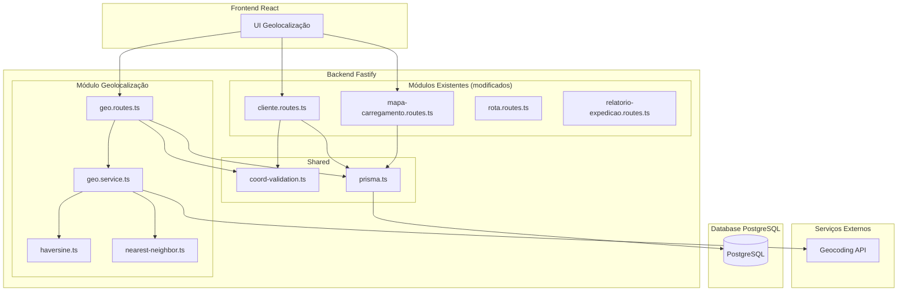
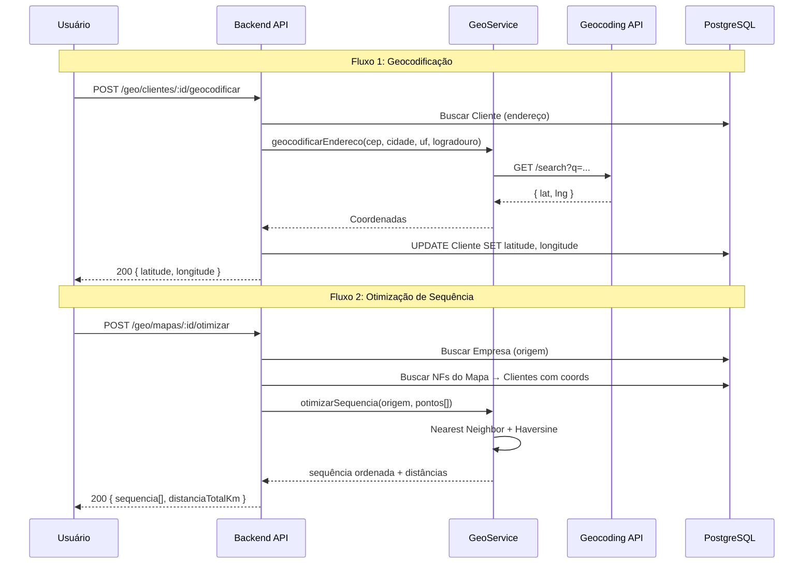

# Design Document: Roteirização com Geolocalização

## Overview

Este documento descreve o design técnico para a funcionalidade de Roteirização com Geolocalização (Nível 1 - Básico) do sistema VisioFab WMS. A funcionalidade adiciona capacidades de geolocalização ao sistema existente, permitindo:

- Armazenamento de coordenadas geográficas (lat/lng) em Cliente e Empresa
- Geocodificação automática de endereços via serviço externo
- Cálculo de distâncias usando fórmula de Haversine
- Otimização de sequência de entrega (Nearest Neighbor)
- Sugestão de rotas por proximidade geográfica
- Visualização de áreas de cobertura por rota

A implementação segue os padrões existentes do projeto: módulos Fastify com validação Zod, persistência via Prisma/PostgreSQL, e isolamento multi-tenant.

### Decisões de Design

| Decisão | Escolha | Justificativa |
|---------|---------|---------------|
| Algoritmo de otimização | Nearest Neighbor (guloso) | Simples, determinístico, adequado para Nível 1. Pode ser substituído por metaheurísticas no futuro |
| Fórmula de distância | Haversine | Precisão suficiente para distâncias rodoviárias estimadas no Brasil |
| Serviço de geocodificação | API externa configurável (ViaCEP + Nominatim/Google) | Flexibilidade para trocar provider sem alterar lógica interna |
| Armazenamento de sequência | Tabela `mapa_carregamento_nf` com campo `ordem_entrega` | Reutiliza relação existente, evita nova tabela |
| Precisão de coordenadas | Decimal(10,7) | ~1.1cm de precisão, padrão para geolocalização |

---

## Architecture

### Diagrama de Componentes



### Fluxo de Dados Principal



---

## Components and Interfaces

### Novos Arquivos

| Arquivo | Responsabilidade |
|---------|-----------------|
| `src/modules/geolocalizacao/geo.routes.ts` | Endpoints REST para geocodificação, distância, otimização, sugestão de rota, cobertura |
| `src/modules/geolocalizacao/geo.service.ts` | Lógica de negócio: geocodificação, batch, sugestão de rota |
| `src/modules/geolocalizacao/haversine.ts` | Função pura de cálculo de distância Haversine |
| `src/modules/geolocalizacao/nearest-neighbor.ts` | Algoritmo Nearest Neighbor para otimização de sequência |
| `src/modules/geolocalizacao/coord-validation.ts` | Schemas Zod compartilhados para validação de coordenadas |
| `src/tests/haversine.test.ts` | Testes unitários e property-based para Haversine |
| `src/tests/nearest-neighbor.test.ts` | Testes unitários e property-based para Nearest Neighbor |
| `src/tests/coord-validation.test.ts` | Testes property-based para validação de coordenadas |
| `src/tests/geo-coverage.test.ts` | Testes property-based para área de cobertura |

### Arquivos Modificados

| Arquivo | Modificação |
|---------|-------------|
| `prisma/schema.prisma` | Adicionar campos lat/lng em Cliente e Empresa; campo `ordemEntrega` e `distanciaParcialKm` em MapaCarregamentoNf; campo `distanciaTotalKm` e `sequenciaValida` em MapaCarregamento |
| `src/modules/cliente/cliente.routes.ts` | Aceitar/retornar lat/lng na criação/atualização; trigger invalidação de sequências |
| `src/modules/mapa-carregamento/mapa-carregamento.routes.ts` | Retornar `distanciaTotalKm` no detalhe e listagem; invalidar sequência ao adicionar/remover NFs |
| `src/modules/relatorio-expedicao/relatorio-expedicao.routes.ts` | Incluir sequência de entrega no romaneio |
| `src/server.ts` | Registrar novas rotas do módulo geolocalização |

### Interfaces dos Componentes

#### `haversine.ts`

```typescript
export interface Coordenada {
  latitude: number
  longitude: number
}

/**
 * Calcula a distância em km entre dois pontos usando a fórmula de Haversine.
 * Raio da Terra: 6371 km
 * @returns distância em km com precisão de 2 casas decimais
 */
export function calcularDistanciaHaversine(
  origem: Coordenada,
  destino: Coordenada
): number
```

#### `nearest-neighbor.ts`

```typescript
export interface PontoEntrega {
  id: string
  clienteId: string
  coordenada: Coordenada
}

export interface SequenciaEntrega {
  ordem: number
  pontoId: string
  clienteId: string
  coordenada: Coordenada
  distanciaParcialKm: number
}

export interface ResultadoOtimizacao {
  sequencia: SequenciaEntrega[]
  distanciaTotalKm: number
}

/**
 * Aplica o algoritmo Nearest Neighbor para otimizar a sequência de entrega.
 * Parte do ponto de origem e a cada passo seleciona o ponto não-visitado mais próximo.
 */
export function otimizarSequenciaNearestNeighbor(
  origem: Coordenada,
  pontos: PontoEntrega[]
): ResultadoOtimizacao
```

#### `coord-validation.ts`

```typescript
import { z } from 'zod'

export const latitudeSchema = z.number().min(-90).max(90)
export const longitudeSchema = z.number().min(-180).max(180)

export const coordenadasOptionalSchema = z.object({
  latitude: z.number().min(-90).max(90).optional().nullable(),
  longitude: z.number().min(-180).max(180).optional().nullable(),
}).refine(
  (data) => {
    const hasLat = data.latitude !== undefined && data.latitude !== null
    const hasLng = data.longitude !== undefined && data.longitude !== null
    return hasLat === hasLng // ambas presentes ou ambas ausentes
  },
  { message: 'Latitude e longitude devem ser fornecidas em conjunto' }
)
```

#### `geo.service.ts`

```typescript
export interface GeocodingResult {
  success: boolean
  latitude?: number
  longitude?: number
  error?: string
}

export interface BatchGeocodingResult {
  total: number
  sucessos: number
  falhas: number
  detalhes: Array<{ clienteId: string; success: boolean; error?: string }>
}

export interface SugestaoRota {
  rotaId: string
  codigo: string
  descricao: string
  distanciaMediaKm: number
  quantidadeClientes: number
}

export interface AreaCobertura {
  rotaId: string
  codigo: string
  descricao: string
  totalClientesGeocodificados: number
  totalClientesNaoGeocodificados: number
  cidades: Array<{
    nome: string
    quantidadeClientes: number
    bairros: Array<{ nome: string; quantidadeClientes: number }>
  }>
}

export class GeoService {
  /** Geocodifica o endereço de um cliente usando serviço externo */
  async geocodificarCliente(clienteId: string, empresaId: string): Promise<GeocodingResult>

  /** Geocodifica endereços em lote */
  async geocodificarBatch(clienteIds: string[], empresaId: string): Promise<BatchGeocodingResult>

  /** Geocodifica o endereço da empresa */
  async geocodificarEmpresa(empresaId: string): Promise<GeocodingResult>

  /** Sugere rotas para um cliente por proximidade */
  async sugerirRotas(clienteId: string, empresaId: string): Promise<SugestaoRota[]>

  /** Retorna área de cobertura de uma rota */
  async areaCoberturaRota(rotaId: string, empresaId: string): Promise<AreaCobertura>

  /** Retorna área de cobertura consolidada de todas as rotas */
  async areaCoberturaConsolidada(empresaId: string): Promise<{
    rotas: AreaCobertura[]
    sobreposicoes: Array<{ cidade: string; bairro: string; rotaIds: string[] }>
  }>
}
```

---

## Data Models

### Alterações no Prisma Schema

```prisma
model Empresa {
  // ... campos existentes ...
  latitude      Decimal?  @db.Decimal(10,7)
  longitude     Decimal?  @db.Decimal(10,7)
}

model Cliente {
  // ... campos existentes ...
  latitude      Decimal?  @db.Decimal(10,7)
  longitude     Decimal?  @db.Decimal(10,7)
}

model MapaCarregamento {
  // ... campos existentes ...
  distanciaTotalKm  Decimal?  @db.Decimal(10,2) @map("distancia_total_km")
  sequenciaValida   Boolean   @default(false) @map("sequencia_valida")
}

model MapaCarregamentoNf {
  // ... campos existentes ...
  ordemEntrega        Int?      @map("ordem_entrega")
  distanciaParcialKm  Decimal?  @db.Decimal(10,2) @map("distancia_parcial_km")
}
```

### Migration SQL

```sql
ALTER TABLE empresa ADD COLUMN latitude DECIMAL(10,7);
ALTER TABLE empresa ADD COLUMN longitude DECIMAL(10,7);

ALTER TABLE cliente ADD COLUMN latitude DECIMAL(10,7);
ALTER TABLE cliente ADD COLUMN longitude DECIMAL(10,7);

ALTER TABLE mapa_carregamento ADD COLUMN distancia_total_km DECIMAL(10,2);
ALTER TABLE mapa_carregamento ADD COLUMN sequencia_valida BOOLEAN DEFAULT false;

ALTER TABLE mapa_carregamento_nf ADD COLUMN ordem_entrega INTEGER;
ALTER TABLE mapa_carregamento_nf ADD COLUMN distancia_parcial_km DECIMAL(10,2);
```

### API Endpoints

| Método | Rota | Descrição |
|--------|------|-----------|
| POST | `/geo/clientes/:id/geocodificar` | Geocodificar endereço de um cliente |
| POST | `/geo/clientes/geocodificar-batch` | Geocodificação em lote |
| POST | `/geo/empresa/geocodificar` | Geocodificar endereço da empresa |
| POST | `/geo/distancia` | Calcular distância entre dois pontos |
| GET | `/geo/distancia/cliente/:clienteId` | Distância empresa→cliente |
| POST | `/geo/mapas/:id/otimizar` | Calcular sequência otimizada |
| POST | `/geo/mapas/:id/salvar-sequencia` | Salvar sequência no mapa |
| GET | `/geo/clientes/:id/sugestao-rota` | Sugerir rotas por proximidade |
| GET | `/geo/rotas/:id/cobertura` | Área de cobertura de uma rota |
| GET | `/geo/rotas/cobertura-consolidada` | Cobertura consolidada (sobreposições) |

### Contratos de API Detalhados

#### POST `/geo/distancia`

**Request:**
```json
{
  "origem": { "latitude": -23.5505, "longitude": -46.6333 },  // opcional, usa Empresa se omitido
  "destino": { "latitude": -22.9068, "longitude": -43.1729 }
}
```

**Response 200:**
```json
{
  "distanciaKm": 357.89
}
```

#### POST `/geo/mapas/:id/otimizar`

**Response 200:**
```json
{
  "sequencia": [
    {
      "ordem": 1,
      "clienteId": "uuid",
      "razaoSocial": "Cliente A",
      "endereco": "Rua X, 100 - Centro - São Paulo/SP",
      "latitude": -23.5505,
      "longitude": -46.6333,
      "distanciaParcialKm": 12.45
    }
  ],
  "clientesSemGeolocalizacao": [
    {
      "clienteId": "uuid",
      "razaoSocial": "Cliente B",
      "endereco": "Rua Y, 200 - Bairro - Cidade/UF"
    }
  ],
  "distanciaTotalKm": 87.32
}
```

#### GET `/geo/clientes/:id/sugestao-rota`

**Response 200:**
```json
{
  "sugestoes": [
    {
      "rotaId": "uuid",
      "codigo": "R001",
      "descricao": "Zona Norte",
      "distanciaMediaKm": 5.67,
      "quantidadeClientes": 12
    }
  ]
}
```

#### GET `/geo/rotas/:id/cobertura`

**Response 200:**
```json
{
  "rotaId": "uuid",
  "codigo": "R001",
  "descricao": "Zona Norte",
  "totalClientesGeocodificados": 15,
  "totalClientesNaoGeocodificados": 3,
  "cidades": [
    {
      "nome": "São Paulo",
      "quantidadeClientes": 10,
      "bairros": [
        { "nome": "Santana", "quantidadeClientes": 5 },
        { "nome": "Tucuruvi", "quantidadeClientes": 5 }
      ]
    }
  ]
}
```

#### GET `/geo/rotas/cobertura-consolidada`

**Response 200:**
```json
{
  "rotas": [ /* array de AreaCobertura */ ],
  "sobreposicoes": [
    {
      "cidade": "São Paulo",
      "bairro": "Centro",
      "rotas": [
        { "rotaId": "uuid1", "codigo": "R001" },
        { "rotaId": "uuid2", "codigo": "R002" }
      ]
    }
  ]
}
```

---

## Correctness Properties

*A property is a characteristic or behavior that should hold true across all valid executions of a system — essentially, a formal statement about what the system should do. Properties serve as the bridge between human-readable specifications and machine-verifiable correctness guarantees.*

### Property 1: Coordinate validation rejects incomplete pairs

*For any* valid latitude value provided without a longitude (or vice-versa), the coordinate validation schema SHALL reject the input and the entity (Cliente or Empresa) SHALL remain unchanged.

**Validates: Requirements 1.3, 2.3**

### Property 2: Coordinate validation rejects out-of-range values

*For any* numeric value outside the range [-90, 90] for latitude or outside [-180, 180] for longitude, the coordinate validation schema SHALL reject the input.

**Validates: Requirements 1.4, 1.5, 2.4, 2.5, 4.4**

### Property 3: Valid coordinate round-trip preservation

*For any* valid coordinate pair (latitude ∈ [-90, 90], longitude ∈ [-180, 180]), storing the coordinates in a Cliente or Empresa and then retrieving them SHALL return values equal to the original input (within Decimal(10,7) precision).

**Validates: Requirements 1.2, 2.2**

### Property 4: Haversine distance symmetry

*For any* two valid coordinate pairs A and B, `calcularDistanciaHaversine(A, B)` SHALL equal `calcularDistanciaHaversine(B, A)`.

**Validates: Requirements 4.1**

### Property 5: Haversine distance non-negativity and identity

*For any* valid coordinate pair A, `calcularDistanciaHaversine(A, A)` SHALL equal 0. *For any* two distinct valid coordinate pairs A and B, `calcularDistanciaHaversine(A, B)` SHALL be greater than 0.

**Validates: Requirements 4.1**

### Property 6: Haversine distance triangle inequality

*For any* three valid coordinate pairs A, B, and C, `calcularDistanciaHaversine(A, C)` SHALL be less than or equal to `calcularDistanciaHaversine(A, B) + calcularDistanciaHaversine(B, C)`.

**Validates: Requirements 4.1**

### Property 7: Nearest Neighbor greedy selection

*For any* origin point and set of delivery points, at each step of the Nearest Neighbor algorithm, the selected next point SHALL be the unvisited point with the minimum Haversine distance from the current position.

**Validates: Requirements 5.2**

### Property 8: Optimization total distance equals sum of partials

*For any* set of delivery points and origin, the `distanciaTotalKm` returned by the optimization SHALL equal the sum of all `distanciaParcialKm` values in the sequence (within floating-point tolerance of 0.01 km).

**Validates: Requirements 5.5, 7.2**

### Property 9: Batch geocoding summary consistency

*For any* batch geocoding result, `sucessos + falhas` SHALL equal `total`, and the count of items with `success: true` in `detalhes` SHALL equal `sucessos`.

**Validates: Requirements 3.7**

### Property 10: Route suggestion ordering and limit

*For any* set of route suggestions returned, the list SHALL be sorted in ascending order by `distanciaMediaKm` and SHALL contain at most 5 items.

**Validates: Requirements 8.3**

### Property 11: Route suggestion average distance correctness

*For any* route with N geocoded active clients, the `distanciaMediaKm` for that route SHALL equal the sum of Haversine distances from the target client to each of the N clients, divided by N.

**Validates: Requirements 8.2**

### Property 12: Coverage area aggregation correctness

*For any* route with a set of active clients, the coverage area SHALL list exactly the distinct cities of those clients, and for each city exactly the distinct bairros, with client counts matching the actual number of active clients in each city/bairro combination.

**Validates: Requirements 9.2, 9.3, 9.4, 9.5**

### Property 13: Romaneio ordering matches saved sequence

*For any* Mapa_de_Carregamento with a saved delivery sequence, generating the romaneio SHALL return NFs ordered by their `ordemEntrega` value in ascending order.

**Validates: Requirements 6.1**

### Property 14: Distance precision constraint

*For any* distance value returned by the system (distanciaTotalKm, distanciaParcialKm, distanciaMediaKm), the value SHALL have at most 2 decimal places.

**Validates: Requirements 4.2, 5.5, 7.5**

---

## Error Handling

### Estratégia de Erros

| Cenário | HTTP Status | Mensagem |
|---------|-------------|----------|
| Coordenada incompleta (lat sem lng) | 422 | "Latitude e longitude devem ser fornecidas em conjunto" |
| Latitude fora do intervalo | 422 | "Latitude deve estar entre -90 e 90" |
| Longitude fora do intervalo | 422 | "Longitude deve estar entre -180 e 180" |
| Serviço de geocodificação indisponível | 503 | "Serviço de geocodificação indisponível. Tente novamente mais tarde" |
| Geocodificação não encontrou resultado | 422 | "Não foi possível geocodificar o endereço fornecido" |
| Empresa sem coordenadas (para otimização) | 422 | "A empresa precisa ter geolocalização configurada para otimizar rotas" |
| Cliente sem coordenadas (para sugestão) | 422 | "O cliente precisa ter geolocalização para receber sugestões de rota" |
| Mapa não encontrado | 404 | "Mapa de carregamento não encontrado" |
| Cliente não encontrado | 404 | "Cliente não encontrado" |
| Rota não encontrada | 404 | "Rota não encontrada" |

### Tratamento de Falhas no Serviço Externo

- **Timeout**: 10 segundos para cada requisição de geocodificação
- **Retry**: Não implementar retry automático no Nível 1 (o usuário pode tentar novamente)
- **Fallback**: Sem fallback — retornar erro claro ao usuário
- **Batch**: Processar sequencialmente; falha em um item não interrompe o lote

### Validação de Entrada

Toda validação de entrada usa schemas Zod, seguindo o padrão existente do projeto. Erros de validação retornam HTTP 422 com a mensagem do Zod formatada.

---

## Testing Strategy

### Abordagem Dual

A estratégia de testes combina:

1. **Property-Based Tests (fast-check)**: Para funções puras e invariantes matemáticos
2. **Unit Tests (vitest)**: Para exemplos específicos, edge cases e integração de componentes

### Property-Based Tests

Biblioteca: `fast-check` (já instalada como devDependency)
Configuração: Mínimo 100 iterações por propriedade

| Arquivo de Teste | Properties Cobertas |
|------------------|---------------------|
| `src/tests/haversine.test.ts` | Properties 4, 5, 6, 14 |
| `src/tests/nearest-neighbor.test.ts` | Properties 7, 8 |
| `src/tests/coord-validation.test.ts` | Properties 1, 2, 3 |
| `src/tests/geo-coverage.test.ts` | Properties 12 |
| `src/tests/geo-service.test.ts` | Properties 9, 10, 11, 13 |

Cada teste property-based deve ser tagueado com:
```typescript
// Feature: roteirizacao-geolocalizacao, Property 4: Haversine distance symmetry
```

### Unit Tests

| Cenário | Tipo |
|---------|------|
| Geocodificação com mock de API externa | Integration (mock) |
| Geocodificação batch com mix de sucesso/falha | Integration (mock) |
| Endpoint de distância com coordenadas conhecidas (SP→RJ ≈ 358km) | Example |
| Otimização com 0 pontos geocodificados | Edge case |
| Otimização com 1 ponto geocodificado | Edge case |
| Sugestão de rota sem rotas ativas | Edge case |
| Invalidação de sequência ao atualizar coordenadas do cliente | Example |
| Invalidação de sequência ao adicionar/remover NF do mapa | Example |
| Romaneio sem sequência salva (ordem original) | Example |
| Cobertura consolidada com sobreposições | Example |

### Execução

```bash
# Rodar todos os testes
npx vitest run

# Rodar apenas testes de geolocalização
npx vitest run src/tests/haversine.test.ts src/tests/nearest-neighbor.test.ts src/tests/coord-validation.test.ts src/tests/geo-coverage.test.ts src/tests/geo-service.test.ts
```
