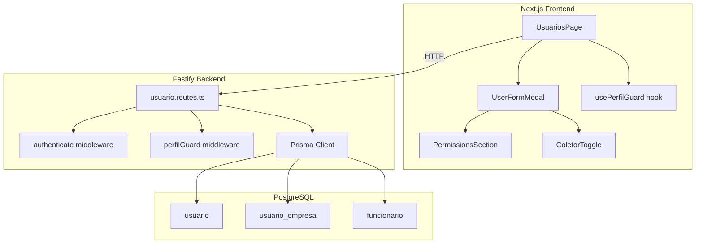
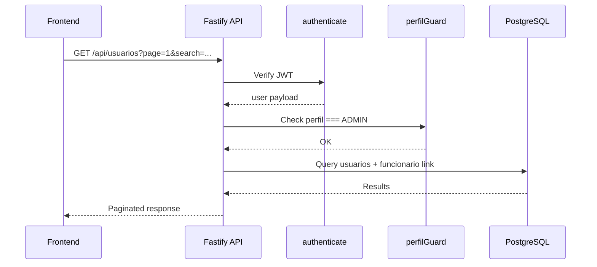

# Design Document: User Management

## Overview

This design covers the full-stack implementation of the User Management feature for VisioFab WMS. The feature provides administrators with a comprehensive interface to manage system users, including CRUD operations, module permission assignment, and coletor (mobile app) access linking.

The backend extends the existing Fastify + Prisma stack with enhanced `/api/usuarios` endpoints that support pagination, filtering, permission management, and funcionário linking. The frontend evolves the existing `UsuariosPage` into a full-featured management screen with modal forms, permission checkboxes, and coletor toggle.

**Key Design Decisions:**
- **Soft delete over hard delete**: Users are deactivated (status=false) rather than removed, preserving audit history.
- **Admin-only access**: A new `perfilGuard` middleware restricts user management endpoints to ADMIN users.
- **Single modal for create/edit**: Reduces UI complexity by reusing a single form modal with conditional fields.
- **Permissions inline in edit modal**: Module checkboxes appear as a section within the edit modal rather than a separate screen, reducing navigation.
- **Funcionário linking via toggle**: A switch in the edit form controls coletor access, showing a funcionário dropdown when enabled.

## Architecture



### Request Flow



## Components and Interfaces

### Backend Components

#### 1. `perfilGuard` Middleware (`src/middleware/perfil-guard.ts`)

A new Fastify preHandler that restricts access based on user perfil. Follows the same pattern as the existing `moduloGuard`.

```typescript
export function perfilGuard(...perfis: string[]) {
  return async (request: FastifyRequest, reply: FastifyReply) => {
    const user = request.user as { id: string; perfil: string }
    if (!perfis.includes(user.perfil)) {
      return reply.status(403).send({ message: 'Acesso não autorizado' })
    }
  }
}
```

#### 2. Enhanced `usuario.routes.ts`

| Method | Path | Description |
|--------|------|-------------|
| GET | `/usuarios` | List users with pagination, search, and funcionário join |
| GET | `/usuarios/:id` | Get single user with permissions and funcionário link |
| POST | `/usuarios` | Create user (replaces `/auth/registrar` for admin use) |
| PUT | `/usuarios/:id` | Update user fields (nome, perfil, status, senha) |
| PUT | `/usuarios/:id/modulos` | Update module permissions for user's empresa |
| PUT | `/usuarios/:id/coletor` | Link/unlink funcionário for coletor access |
| DELETE | `/usuarios/:id` | Soft delete (set status=false) |

#### 3. API Request/Response Schemas

**GET /usuarios** (query params):
```typescript
{
  page: number       // default 1
  limit: number      // default 20
  search?: string    // filters by nome or email (case-insensitive)
}
```

**GET /usuarios response**:
```typescript
{
  data: Array<{
    id: string
    nome: string
    email: string
    perfil: 'ADMIN' | 'SUPERVISOR' | 'OPERADOR'
    status: boolean
    criadoEm: string
    funcionario: { id: string; nome: string } | null
  }>
  total: number
  page: number
  limit: number
  totalPages: number
}
```

**POST /usuarios** (body):
```typescript
{
  nome: string          // min 3 chars
  email: string         // valid email
  senha: string         // min 6 chars
  perfil: 'ADMIN' | 'SUPERVISOR' | 'OPERADOR'
  funcionarioId?: string // optional link to funcionário
}
```

**PUT /usuarios/:id** (body):
```typescript
{
  nome?: string
  perfil?: 'ADMIN' | 'SUPERVISOR' | 'OPERADOR'
  status?: boolean
  senha?: string        // if provided, updates password; if empty/absent, keeps current
}
```

**PUT /usuarios/:id/modulos** (body):
```typescript
{
  modulos: string[]     // e.g. ["WMS", "COMPRAS"] or ["*"]
}
```

**PUT /usuarios/:id/coletor** (body):
```typescript
{
  enabled: boolean
  funcionarioId?: string  // required when enabled=true
}
```

### Frontend Components

#### 1. `usePerfilGuard` Hook

```typescript
export function usePerfilGuard(perfil: string) {
  // Decodes JWT from localStorage to get user perfil
  // Redirects to dashboard with notification if not matching
}
```

#### 2. Enhanced `UsuariosPage`

- Uses `usePerfilGuard('ADMIN')` on mount
- Paginated table with columns: Nome, Email, Perfil, Status, Coletor, Ações
- Search input with debounced filtering (server-side)
- "Novo" button opens creation modal
- Row actions: Edit (pencil icon), Deactivate (trash icon)

#### 3. `UserFormModal` Component

A single modal component handling both create and edit modes:
- **Create mode**: All fields editable, senha required
- **Edit mode**: Email read-only, senha optional, includes permissions section and coletor toggle
- Uses React Hook Form with Zod validation
- Sections: Basic Info → Permissions (edit only) → Coletor (edit only)

#### 4. `PermissionsSection` Component

- Renders checkboxes for: WMS, COMPRAS, VENDAS, FINANCEIRO, FISCAL
- "Selecionar todos" checkbox that toggles all
- Warning text when no modules selected
- Calls `PUT /usuarios/:id/modulos` on save

#### 5. `ColetorToggle` Component

- Switch component for enabling/disabling coletor access
- When enabled: shows Select dropdown with available funcionários
- Dropdown only shows funcionários where `usuarioId IS NULL` (plus the currently linked one)
- Calls `PUT /usuarios/:id/coletor` on save

## Data Models

### Existing Models (No Schema Changes Required)

The feature uses the existing Prisma models without modifications:

```prisma
model Usuario {
  id           String   @id @default(uuid())
  nome         String   @db.VarChar(150)
  email        String   @unique @db.VarChar(200)
  senha        String   @db.VarChar(200)
  perfil       String   @default("OPERADOR") @db.VarChar(30)
  status       Boolean  @default(true)
  criadoEm     DateTime @default(now()) @map("criado_em")
  atualizadoEm DateTime @updatedAt @map("atualizado_em")
  empresas     UsuarioEmpresa[]
  @@map("usuario")
}

model UsuarioEmpresa {
  usuarioId String  @map("usuario_id")
  usuario   Usuario @relation(fields: [usuarioId], references: [id])
  empresaId String  @map("empresa_id")
  empresa   Empresa @relation(fields: [empresaId], references: [id])
  modulos   String  @default("*") @db.VarChar(200)
  @@id([usuarioId, empresaId])
  @@map("usuario_empresa")
}

model Funcionario {
  id                   String   @id @default(uuid())
  codigo               Int      @default(autoincrement())
  nome                 String   @db.VarChar(150)
  matricula            String   @db.VarChar(20)
  tipo                 String   @default("OPERADOR") @db.VarChar(30)
  centroDistribuicaoId String?  @map("centro_distribuicao_id")
  usuarioId            String?  @unique @map("usuario_id")
  presente             Boolean  @default(false)
  status               Boolean  @default(true)
  criadoEm             DateTime @default(now()) @map("criado_em")
  @@map("funcionario")
}
```

### Data Flow for Module Permissions

The `modulos` field in `UsuarioEmpresa` stores permissions as:
- `"*"` — full access to all modules
- `"WMS,COMPRAS,VENDAS"` — comma-separated list of allowed modules
- `""` (empty string) — no module access

### Data Flow for Coletor Linking

The `Funcionario.usuarioId` field (unique, nullable) establishes the 1:1 relationship:
- `null` — funcionário not linked to any user (available for linking)
- `<uuid>` — funcionário linked to a specific user (coletor access enabled)


## Correctness Properties

*A property is a characteristic or behavior that should hold true across all valid executions of a system — essentially, a formal statement about what the system should do. Properties serve as the bridge between human-readable specifications and machine-verifiable correctness guarantees.*

### Property 1: Search filter returns only matching results

*For any* list of users and *any* non-empty search term, all users returned by the search endpoint must have the search term as a case-insensitive substring of either their `nome` or `email`, and no user matching the criteria should be excluded from the results.

**Validates: Requirements 1.4**

### Property 2: Input validation correctness

*For any* string `nome` with length < 3, *any* string `email` that is not a valid email format, or *any* string `senha` with length < 6, the creation endpoint SHALL reject the request with a validation error. Conversely, *for any* `nome` with length >= 3, valid `email`, and `senha` with length >= 6, validation SHALL pass.

**Validates: Requirements 2.2**

### Property 3: Password is always stored as a bcrypt hash

*For any* user creation or password update operation with a plain-text password input, the stored `senha` value SHALL be a valid bcrypt hash (matching pattern `$2[ab]$`) and SHALL NOT equal the plain-text input.

**Validates: Requirements 2.3, 3.3**

### Property 4: Omitting password preserves existing hash

*For any* user update request that does not include a `senha` field (or includes an empty string), the user's stored `senha` SHALL remain identical to its value before the update.

**Validates: Requirements 3.4**

### Property 5: Module selection serialization round-trip

*For any* subset of the available modules (WMS, COMPRAS, VENDAS, FINANCEIRO, FISCAL), storing the selection and then reading it back SHALL produce the same set of modules. When all modules are selected, the stored value SHALL be `"*"`. When parsed back, `"*"` SHALL expand to the full set of modules.

**Validates: Requirements 4.2, 4.3**

### Property 6: Available funcionarios excludes already-linked ones

*For any* set of funcionarios in the database, the "available funcionarios" query SHALL return only those where `usuarioId IS NULL` or `usuarioId` equals the current user being edited. No funcionario linked to a different user SHALL appear in the results.

**Validates: Requirements 5.6**

### Property 7: Soft delete preserves record with inactive status

*For any* user deactivation (delete) operation, the user record SHALL still exist in the database after the operation, and its `status` field SHALL be `false`. The total count of user records SHALL not decrease.

**Validates: Requirements 6.2, 6.3**

### Property 8: Deactivated users cannot authenticate

*For any* user with `status = false` and *any* valid credential pair (correct email + password), the login endpoint SHALL reject the authentication attempt and return an error message indicating the account is deactivated.

**Validates: Requirements 6.6**

### Property 9: Non-ADMIN users are denied access to user management

*For any* authenticated user with perfil other than ADMIN (i.e., SUPERVISOR or OPERADOR), *any* request to the `/api/usuarios` endpoints SHALL return HTTP 403.

**Validates: Requirements 7.1**

## Error Handling

### Backend Error Handling

| Scenario | HTTP Status | Response Body |
|----------|-------------|---------------|
| Invalid JWT / no token | 401 | `{ message: "Não autenticado" }` |
| Non-ADMIN user accessing endpoints | 403 | `{ message: "Acesso não autorizado" }` |
| Validation error (Zod) | 400 | `{ message: "Validation error", issues: [...] }` |
| Duplicate email on create | 409 | `{ message: "Email já cadastrado" }` |
| User not found | 404 | `{ message: "Usuário não encontrado" }` |
| Funcionario not found | 404 | `{ message: "Funcionário não encontrado" }` |
| Funcionario already linked | 409 | `{ message: "Funcionário já vinculado a outro usuário" }` |
| Database error | 500 | `{ message: "Erro interno do servidor" }` |

### Frontend Error Handling

- API errors are caught and displayed via Mantine `notifications.show()` with `color: 'red'`
- Network errors show a generic "Erro de conexão com o servidor" notification
- Form validation errors are displayed inline below each field using React Hook Form's error state
- Optimistic updates are NOT used — the list refreshes only after confirmed server response

### Login Rejection for Deactivated Users

The existing `/api/auth/login` endpoint must be updated to check `usuario.status` before validating credentials. If `status === false`, return:
```json
{ "message": "Conta desativada. Contate o administrador" }
```
with HTTP 401.

## Testing Strategy

### Unit Tests

Unit tests cover pure logic functions and validation:

- **Validation schemas**: Test Zod schemas for user creation/update with valid and invalid inputs
- **Module serialization**: Test conversion between module arrays and comma-separated strings
- **Available funcionarios filter**: Test the query logic for filtering linked/unlinked funcionarios
- **perfilGuard middleware**: Test that it correctly allows/denies based on perfil

### Property-Based Tests

Property-based tests verify universal properties using **fast-check** (TypeScript PBT library):

- Each property test runs a minimum of **100 iterations**
- Each test is tagged with: `Feature: user-management, Property {N}: {description}`
- Properties test the backend service/logic layer with mocked Prisma client where needed

**Properties to implement:**
1. Search filter correctness (Property 1)
2. Input validation correctness (Property 2)
3. Password hashing (Property 3)
4. Password preservation (Property 4)
5. Module serialization round-trip (Property 5)
6. Available funcionarios filter (Property 6)
7. Soft delete preservation (Property 7)
8. Deactivated user login rejection (Property 8)
9. Admin-only access control (Property 9)

### Integration Tests

Integration tests verify end-to-end flows with a test database:

- Create user → verify record exists with hashed password
- Create user with funcionario link → verify funcionario.usuarioId is set
- Update user modules → verify UsuarioEmpresa record is updated
- Enable/disable coletor → verify funcionario linking/unlinking
- Deactivate user → verify status change and login rejection
- Reactivate user → verify login works again

### Frontend Tests

- Component tests using React Testing Library:
  - Modal opens/closes correctly
  - Form validation displays errors
  - Table renders correct columns and data
  - Search input triggers filtering
  - Permission checkboxes reflect stored state
  - Coletor toggle shows/hides funcionario dropdown
- Access control: non-ADMIN redirect behavior
