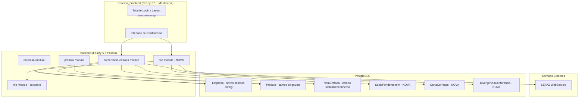
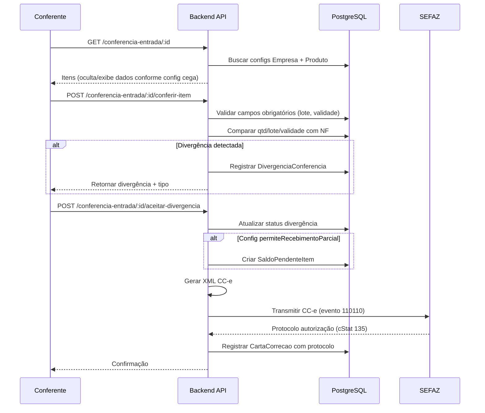

# Design Document: WMS Conferência Avançada + Rename

## Overview

Este design especifica a arquitetura técnica para evolução do módulo de conferência de entrada do WMS, adicionando configurações avançadas de conferência cega (quantidade, lote e validade), emissão automática de CC-e (Carta de Correção Eletrônica), controle de lote por produto, recebimento parcial e renomeação da marca de "VisioFab" para "Vizor" no frontend.

O backend é construído com **Fastify 5 + Prisma (PostgreSQL) + TypeScript + Zod**, usando uma arquitetura modular por domínio em `src/modules/`. O frontend é **Next.js 15 + Mantine v7**. O sistema é multi-tenant por `empresaId`.

### Decisões-Chave de Design

1. **Configurações por Empresa via campos diretos**: ao invés de usar a tabela genérica `Parametro`, adicionar campos booleanos diretamente no model `Empresa` para garantir type-safety e simplificar queries.
2. **CC-e como novo módulo dedicado**: separar da lógica de NF-e existente em `src/modules/cce/` pois tem ciclo de vida próprio (geração, assinatura, transmissão, resposta).
3. **Recebimento parcial com tabela de saldo**: nova tabela `SaldoPendenteItem` para rastrear quantidades pendentes sem alterar a estrutura de `ItemNotaEntrada`.
4. **Rename apenas no frontend**: mudanças isoladas em componentes de layout, sem alteração de nomes técnicos ou URLs.

## Architecture



### Fluxo de Conferência Expandido



## Components and Interfaces

### 1. Módulo `conferencia-entrada` (expandido)

**Arquivo:** `src/modules/conferencia-entrada/conferencia-entrada.routes.ts`

Responsabilidades adicionais:
- Consultar configurações de conferência cega da empresa
- Filtrar dados retornados conforme `conferenciaQuantidadeCega` e `conferenciaLoteCega`
- Validar campos obrigatórios baseado em `exigeLote` do produto e configs de empresa
- Comparar validade digitada com validade da NF
- Registrar divergências tipadas
- Gerenciar recebimento parcial e saldo pendente

**Novas Rotas:**

```typescript
// POST /:id/aceitar-divergencia — aceita divergência e dispara CC-e
interface AceitarDivergenciaBody {
  itemNotaEntradaId: string
  quantidadeAceita: number
  observacao?: string
}

// GET /notas-parciais — notas com saldo pendente
// POST /:id/receber-saldo — receber saldo pendente de nota parcial
interface ReceberSaldoBody {
  itemNotaEntradaId: string
  quantidadeRecebida: number
  lote?: string
  validade?: string
}
```

### 2. Módulo `cce` (NOVO)

**Diretório:** `src/modules/cce/`

```
src/modules/cce/
├── cce.routes.ts          # Endpoints REST
├── cce-xml-builder.ts     # Geração do XML do evento CC-e
├── cce-sefaz.ts           # Transmissão à SEFAZ (evento 110110)
└── cce.service.ts         # Lógica de negócio (orquestração)
```

**Interface principal:**

```typescript
interface CceService {
  emitirCCe(params: {
    empresaId: string
    notaEntradaId: string
    divergenciaId: string
    item: string
    quantidadeOriginal: number
    quantidadeCorrigida: number
  }): Promise<ResultadoCCe>
}

interface ResultadoCCe {
  sucesso: boolean
  protocolo?: string
  sequencia: number  // nSeqEvento (1-20)
  motivoRejeicao?: string
}
```

### 3. Módulo `empresa` (expandido)

Novos campos de configuração expostos via API existente de update/get empresa.

### 4. Módulo `produto` (expandido)

Novo campo `exigeLote` exposto via API existente de CRUD de produtos.

### 5. Frontend — Renomeação (Sistema_Frontend)

**Escopo de alteração:**
- `src/components/layout/Header.tsx` — trocar "VisioFab" por "Vizor"
- `src/app/layout.tsx` — alterar metadata title prefix
- `src/app/login/page.tsx` — atualizar textos e logo
- Busca global por "VisioFab" em textos visíveis ao usuário (breadcrumbs, footer, about)
- **NÃO alterar**: package.json name, pasta do repositório, variáveis de ambiente, URLs de API

## Data Models

### Alterações no model `Empresa`

```prisma
model Empresa {
  // ... campos existentes ...

  // NOVOS — Configurações de Conferência
  conferenciaQuantidadeCega  Boolean @default(false) @map("conferencia_quantidade_cega")
  conferenciaLoteCega        Boolean @default(false) @map("conferencia_lote_cega")
  permiteRecebimentoParcial  Boolean @default(false) @map("permite_recebimento_parcial")
}
```

### Alteração no model `Produto`

```prisma
model Produto {
  // ... campos existentes ...

  // NOVO — Controle de lote
  exigeLote Boolean @default(false) @map("exige_lote")
}
```

### Novo model `DivergenciaConferencia`

```prisma
model DivergenciaConferencia {
  id                String   @id @default(uuid())
  empresaId         String   @map("empresa_id")
  notaEntradaId     String   @map("nota_entrada_id")
  itemNotaEntradaId String   @map("item_nota_entrada_id")
  tipo              String   @db.VarChar(30)  // QUANTIDADE_FALTA, QUANTIDADE_EXCESSO, VALIDADE_DIVERGENTE, LOTE_DIVERGENTE
  quantidadeEsperada Decimal? @map("quantidade_esperada") @db.Decimal(12, 4)
  quantidadeConferida Decimal? @map("quantidade_conferida") @db.Decimal(12, 4)
  loteEsperado      String?  @map("lote_esperado") @db.VarChar(30)
  loteConferido     String?  @map("lote_conferido") @db.VarChar(30)
  validadeEsperada  DateTime? @map("validade_esperada")
  validadeConferida DateTime? @map("validade_conferida")
  status            String   @default("PENDENTE") @db.VarChar(20)  // PENDENTE, ACEITA, REJEITADA, PENDENTE_CCE
  observacao        String?  @db.Text
  criadoEm          DateTime @default(now()) @map("criado_em")

  cartaCorrecao CartaCorrecao?

  @@map("divergencia_conferencia")
}
```

### Novo model `CartaCorrecao`

```prisma
model CartaCorrecao {
  id              String   @id @default(uuid())
  empresaId       String   @map("empresa_id")
  notaEntradaId   String   @map("nota_entrada_id")
  divergenciaId   String   @unique @map("divergencia_id")
  divergencia     DivergenciaConferencia @relation(fields: [divergenciaId], references: [id])
  chaveNfe        String   @map("chave_nfe") @db.VarChar(44)
  sequenciaEvento Int      @map("sequencia_evento")  // 1 a 20
  textoCorrecao   String   @map("texto_correcao") @db.Text
  xmlEnviado      String?  @map("xml_enviado") @db.Text
  xmlRetorno      String?  @map("xml_retorno") @db.Text
  protocolo       String?  @db.VarChar(20)
  status          String   @default("PENDENTE") @db.VarChar(20)  // PENDENTE, AUTORIZADA, REJEITADA
  motivoRejeicao  String?  @map("motivo_rejeicao") @db.Text
  criadoEm        DateTime @default(now()) @map("criado_em")

  @@map("carta_correcao")
}
```

### Novo model `SaldoPendenteItem`

```prisma
model SaldoPendenteItem {
  id                String   @id @default(uuid())
  empresaId         String   @map("empresa_id")
  notaEntradaId     String   @map("nota_entrada_id")
  itemNotaEntradaId String   @map("item_nota_entrada_id")
  quantidadeNf      Decimal  @map("quantidade_nf") @db.Decimal(12, 4)
  quantidadeRecebida Decimal @map("quantidade_recebida") @db.Decimal(12, 4)
  saldoPendente     Decimal  @map("saldo_pendente") @db.Decimal(12, 4)
  status            String   @default("PENDENTE") @db.VarChar(20)  // PENDENTE, RECEBIDO
  criadoEm          DateTime @default(now()) @map("criado_em")
  atualizadoEm      DateTime @updatedAt @map("atualizado_em")

  @@map("saldo_pendente_item")
}
```

### Alteração no model `NotaEntrada`

```prisma
model NotaEntrada {
  // ... campos existentes ...

  // NOVO — suporte a status de recebimento parcial
  statusRecebimento String @default("PENDENTE") @map("status_recebimento") @db.VarChar(30)
  // Valores: PENDENTE, PARCIALMENTE_RECEBIDO, CONFERIDA

  divergencias       DivergenciaConferencia[]
  saldosPendentes    SaldoPendenteItem[]
  cartasCorrecao     CartaCorrecao[]
}
```

## Correctness Properties

*A property is a characteristic or behavior that should hold true across all valid executions of a system — essentially, a formal statement about what the system should do. Properties serve as the bridge between human-readable specifications and machine-verifiable correctness guarantees.*

### Property 1: Visibilidade de quantidade conforme configuração cega

*For any* item de nota de entrada e qualquer estado da configuração `conferenciaQuantidadeCega` da empresa, o DTO retornado pela API de detalhe da conferência SHALL incluir `quantidadeEsperada` se e somente se a configuração estiver **inativa** (false).

**Validates: Requirements 1.2, 1.4**

### Property 2: Visibilidade de lote conforme configuração cega

*For any* item de nota de entrada que possua lote na NF e qualquer estado da configuração `conferenciaLoteCega`, o DTO retornado pela API SHALL incluir o `lote` pré-preenchido se e somente se a configuração estiver **inativa** (false).

**Validates: Requirements 2.2, 2.4**

### Property 3: Obrigatoriedade de quantidade manual na conferência cega

*For any* payload de conferência de item, WHEN `conferenciaQuantidadeCega` estiver ativa, o sistema SHALL rejeitar submissões onde `quantidadeConferida` não for explicitamente informada (null/undefined).

**Validates: Requirements 1.3**

### Property 4: Obrigatoriedade de lote manual na conferência cega

*For any* payload de conferência de item, WHEN `conferenciaLoteCega` estiver ativa, o sistema SHALL rejeitar submissões onde `lote` não for informado.

**Validates: Requirements 2.3**

### Property 5: Comparação de validade e registro de divergência

*For any* par de datas (validade digitada, validade da NF) onde ambas são definidas, WHEN as datas forem diferentes, o sistema SHALL registrar uma divergência com tipo "VALIDADE_DIVERGENTE".

**Validates: Requirements 3.2, 3.3**

### Property 6: Bloqueio de produto vencido

*For any* data de validade digitada que seja anterior à data atual, o sistema SHALL bloquear o recebimento do item e emitir alerta "PRODUTO VENCIDO".

**Validates: Requirements 3.4**

### Property 7: Exigência de lote baseada no produto

*For any* produto e qualquer estado de `exigeLote`, WHEN `exigeLote` for true, a conferência do item SHALL rejeitar submissões sem campo lote preenchido. WHEN `exigeLote` for false, a conferência SHALL aceitar submissões sem lote.

**Validates: Requirements 5.2, 5.3, 5.4**

### Property 8: Aceitação de recebimento parcial conforme configuração

*For any* item cuja quantidade conferida seja menor que a quantidade na NF, WHEN `permiteRecebimentoParcial` estiver ativa, o sistema SHALL aceitar o recebimento e registrar saldo pendente. WHEN inativa, o sistema SHALL tratar como divergência padrão.

**Validates: Requirements 6.2, 6.5**

### Property 9: Invariante do saldo pendente

*For any* recebimento parcial aceito, o saldo pendente registrado SHALL ser igual a (quantidade NF - quantidade recebida), e essa soma SHALL ser sempre > 0 e ≤ quantidade NF.

**Validates: Requirements 6.3**

### Property 10: Transição de status ao completar recebimento

*For any* nota de entrada com itens parcialmente recebidos, WHEN a soma de todas as quantidades recebidas (incluindo recebimentos parciais subsequentes) igualar a quantidade total da NF para todos os itens, o status da nota SHALL transicionar para "CONFERIDA".

**Validates: Requirements 6.6**

### Property 11: Limite de CC-e por NF-e

*For any* nota fiscal, o sistema SHALL rejeitar a emissão de uma nova CC-e quando já existirem 20 CC-e registradas para essa NF.

**Validates: Requirements 4.6**

### Property 12: Conteúdo do texto de correção da CC-e

*For any* divergência aceita com item, quantidade original e quantidade corrigida, o texto de correção gerado SHALL conter a descrição do item, a quantidade original e a quantidade corrigida.

**Validates: Requirements 4.7, 4.1**

## Error Handling

| Cenário | Comportamento | HTTP Status |
|---------|--------------|-------------|
| Empresa não encontrada | Retornar erro 404 | 404 |
| Nota em status incompatível para conferência | Retornar erro com status atual | 422 |
| Item não pertence à nota | Retornar erro 404 | 404 |
| Validade digitada com formato inválido | Retornar erro de validação Zod | 400 |
| Produto vencido (validade < hoje) | Bloquear com alerta, exigir aprovação supervisor | 422 |
| Lote obrigatório não informado | Retornar erro de campo obrigatório | 400 |
| CC-e rejeitada pela SEFAZ | Registrar rejeição, manter status PENDENTE_CCE, notificar | 200 (com flag de erro) |
| Limite de 20 CC-e atingido | Retornar erro informando limite excedido | 422 |
| Certificado digital expirado/inválido | Retornar erro, não transmitir à SEFAZ | 422 |
| Falha de comunicação com SEFAZ | Registrar tentativa, manter status PENDENTE, retry posterior | 200 (com flag de erro) |
| Tentativa de recebimento parcial com config desabilitada | Tratar como divergência padrão | 200 |

## Testing Strategy

### Abordagem Dual

**Property-Based Tests (fast-check):** Para validar propriedades universais que devem valer para qualquer combinação de inputs. Configuração: mínimo 100 iterações por property test.

**Unit Tests (vitest):** Para cenários específicos, integrações e edge cases.

### Property-Based Tests

Biblioteca: **fast-check** (já instalada no projeto como devDependency)
Framework: **vitest** (já configurado)

Cada property test deve:
- Referenciar a propriedade do design: `// Feature: wms-conferencia-avancada-rename, Property N: <texto>`
- Executar mínimo 100 iterações
- Usar geradores (arbitraries) para gerar dados aleatórios de empresa, produto, item, datas

**Testes de propriedade planejados:**

1. **Property 1 & 2** — Visibilidade de dados na conferência cega (quantidade e lote)
2. **Property 3 & 4** — Validação de campos obrigatórios na conferência cega
3. **Property 5** — Comparação de validade e registro de divergência
4. **Property 6** — Bloqueio de produto vencido
5. **Property 7** — Exigência de lote por produto
6. **Property 8** — Aceitação/rejeição de recebimento parcial
7. **Property 9** — Invariante matemática do saldo pendente
8. **Property 10** — Transição de status ao completar recebimento
9. **Property 11** — Limite de 20 CC-e por NF
10. **Property 12** — Conteúdo do texto de correção

### Unit Tests (example-based)

- **CC-e SEFAZ integration**: Mock de respostas SEFAZ (cStat 135 autorização, cStat 573 rejeição) — Valida 4.4, 4.5
- **Assinatura digital CC-e**: Verificar que o fluxo de assinatura é invocado corretamente — Valida 4.2
- **Transmissão CC-e**: Verificar envelope SOAP correto para evento 110110 — Valida 4.3
- **Frontend rename**: Verificar que textos visíveis contêm "Vizor" e não "VisioFab" — Valida 7.1-7.4

### Smoke Tests

- Campo `conferenciaQuantidadeCega` existe no schema com default false — Valida 1.1
- Campo `conferenciaLoteCega` existe no schema com default false — Valida 2.1
- Campo `exigeLote` existe no Produto com default false — Valida 5.1
- Campo `permiteRecebimentoParcial` existe na Empresa com default false — Valida 6.1
- Nomes técnicos (package.json, variáveis) não foram alterados — Valida 7.5, 7.6

### Estrutura de Testes

```
tests/
├── integration/
│   └── cce-sefaz.integration.test.ts
src/
├── modules/
│   ├── conferencia-entrada/
│   │   └── conferencia-entrada.properties.test.ts   # Properties 1-10
│   └── cce/
│       └── cce.properties.test.ts                   # Properties 11-12
└── tests/
    └── conferencia-avancada.unit.test.ts            # Unit + smoke tests
```
