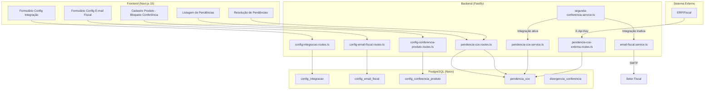
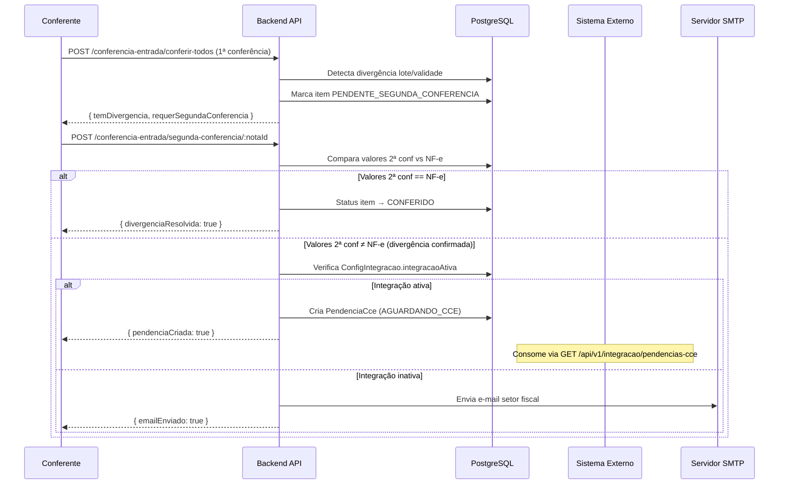
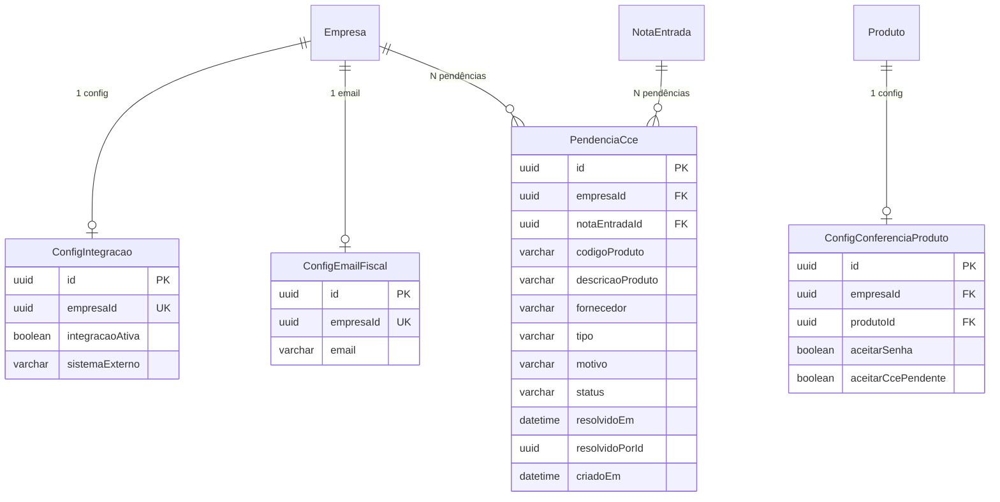

# Design Document — Conferência, Integração e Pendências

## Overview

Este design evolui o fluxo de conferência cega existente para suportar: (1) configuração de integração com sistema externo, (2) gestão de pendências de CC-e, (3) envio de e-mail fiscal automático, e (4) reformulação do cadastro de bloqueio de conferência por produto. O fluxo é acionado quando a segunda conferência obrigatória confirma divergência de lote ou validade, bifurcando em pendência (integração ativa) ou e-mail (integração inativa).

### Decisões de Design

- **Reutilização do modelo `DivergenciaConferencia`** existente como ponto de partida para o novo fluxo de segunda conferência. Novos campos são adicionados para rastrear o número da conferência (1ª vs 2ª).
- **Novo modelo `PendenciaCce`** separado do modelo `DivergenciaConferencia` para representar as pendências consumíveis pelo sistema externo via API.
- **Configuração de integração via tabela dedicada** (`ConfigIntegracao`) com constraint de unicidade por empresa, ao invés de usar a tabela genérica `Parametro`.
- **E-mail via Nodemailer** com SMTP configurado via variáveis de ambiente, com retry de 3 tentativas e intervalo de 10s.
- **Reformulação do `ConfigConferenciaProduto`** — substituir `modoResolucaoLote` / `modoResolucaoValidade` (enum único) por dois booleanos `aceitarSenha` e `aceitarCcePendente`, removendo a opção `ACEITAR_LIVRE`.

## Architecture



### Fluxo de Segunda Conferência



## Components and Interfaces

### Backend Modules (novos)

| Módulo | Arquivo | Responsabilidade |
|--------|---------|------------------|
| config-integracao | `src/modules/config-integracao/config-integracao.routes.ts` | CRUD da configuração de integração |
| config-email-fiscal | `src/modules/config-email-fiscal/config-email-fiscal.routes.ts` | CRUD do e-mail do setor fiscal |
| pendencia-cce | `src/modules/pendencia-cce/pendencia-cce.routes.ts` | Listagem e resolução interna de pendências |
| pendencia-cce | `src/modules/pendencia-cce/pendencia-cce-externa.routes.ts` | API externa (X-Api-Key) para consulta e resolução |
| pendencia-cce | `src/modules/pendencia-cce/pendencia-cce.service.ts` | Lógica de criação/resolução de pendências |
| email-fiscal | `src/modules/email-fiscal/email-fiscal.service.ts` | Envio de e-mail SMTP com retry |
| conferencia-entrada | `src/modules/conferencia-entrada/segunda-conferencia.service.ts` | Lógica da segunda conferência obrigatória |

### Backend Modules (modificados)

| Módulo | Arquivo | Modificação |
|--------|---------|-------------|
| conferencia-entrada | `conferencia-entrada.routes.ts` | Adicionar endpoint de segunda conferência |
| conferencia-entrada | `config-conferencia-produto.service.ts` | Adaptar para novos modos booleanos |
| conferencia-entrada | `divergencia-lote-validade.service.ts` | Remover `ACEITAR_LIVRE`, adaptar resolução |

### API Endpoints

#### Configuração de Integração
```
GET    /api/config-integracao          → retorna config da empresa logada
POST   /api/config-integracao          → cria/atualiza config integração
```

#### Configuração de E-mail Fiscal
```
GET    /api/config-email-fiscal        → retorna config da empresa logada
POST   /api/config-email-fiscal        → cria/atualiza e-mail fiscal
```

#### Pendências (UI interna, autenticação JWT)
```
GET    /api/pendencias-cce             → lista pendências com filtros
PATCH  /api/pendencias-cce/:id/resolver → resolução manual (RESOLVIDA/CANCELADA)
```

#### Pendências (API externa, autenticação X-Api-Key)
```
GET    /api/v1/integracao/pendencias-cce       → lista pendências por status
PATCH  /api/v1/integracao/pendencias-cce/:id   → atualiza status para RESOLVIDA
```

#### Segunda Conferência
```
POST   /api/conferencia-entrada/segunda-conferencia/:notaId  → submete 2ª conferência
```

### Schemas Zod (contratos)

```typescript
// ConfigIntegracao
const configIntegracaoSchema = z.object({
  integracaoAtiva: z.boolean(),
  sistemaExterno: z.string().max(100).nullable(),
})

// ConfigEmailFiscal
const configEmailFiscalSchema = z.object({
  email: z.string().max(254).email(),
})

// SegundaConferencia
const segundaConferenciaSchema = z.object({
  itens: z.array(z.object({
    itemNotaEntradaId: z.string().uuid(),
    quantidadeConferida: z.number().min(0),
    lote: z.string().optional(),
    validade: z.string().optional(),
  })),
})

// ResoluçãoPendência
const resolverPendenciaSchema = z.object({
  status: z.enum(['RESOLVIDA', 'CANCELADA']),
})
```

## Data Models

### Novos Models Prisma

```prisma
model ConfigIntegracao {
  id              String   @id @default(uuid())
  empresaId       String   @unique @map("empresa_id")
  empresa         Empresa  @relation(fields: [empresaId], references: [id])
  integracaoAtiva Boolean  @default(false) @map("integracao_ativa")
  sistemaExterno  String?  @map("sistema_externo") @db.VarChar(100)
  criadoEm        DateTime @default(now()) @map("criado_em")
  atualizadoEm    DateTime @updatedAt @map("atualizado_em")

  @@map("config_integracao")
}

model ConfigEmailFiscal {
  id           String   @id @default(uuid())
  empresaId    String   @unique @map("empresa_id")
  empresa      Empresa  @relation(fields: [empresaId], references: [id])
  email        String   @db.VarChar(254)
  criadoEm     DateTime @default(now()) @map("criado_em")
  atualizadoEm DateTime @updatedAt @map("atualizado_em")

  @@map("config_email_fiscal")
}

model PendenciaCce {
  id               String    @id @default(uuid())
  empresaId        String    @map("empresa_id")
  empresa          Empresa   @relation(fields: [empresaId], references: [id])
  notaEntradaId    String    @map("nota_entrada_id")
  notaEntrada      NotaEntrada @relation(fields: [notaEntradaId], references: [id])
  codigoProduto    String    @map("codigo_produto") @db.VarChar(60)
  descricaoProduto String    @map("descricao_produto") @db.VarChar(200)
  fornecedor       String    @db.VarChar(200)
  tipo             String    @db.VarChar(10) // LOTE ou VALIDADE
  motivo           String    @db.VarChar(50) // "Aguardando CCE de lote" | "Aguardando CCE de validade"
  status           String    @default("AGUARDANDO_CCE") @db.VarChar(20) // AGUARDANDO_CCE, RESOLVIDA, CANCELADA
  resolvidoEm      DateTime? @map("resolvido_em")
  resolvidoPorId   String?   @map("resolvido_por_id")
  criadoEm         DateTime  @default(now()) @map("criado_em")

  @@index([empresaId, status])
  @@map("pendencia_cce")
}
```

### Modificações em Models Existentes

```prisma
// ConfigConferenciaProduto — SUBSTITUIR enum por booleanos
model ConfigConferenciaProduto {
  id                    String   @id @default(uuid())
  empresaId             String   @map("empresa_id")
  empresa               Empresa  @relation(fields: [empresaId], references: [id])
  produtoId             String   @map("produto_id")
  produto               Produto  @relation(fields: [produtoId], references: [id])
  aceitarSenha          Boolean  @default(false) @map("aceitar_senha")
  aceitarCcePendente    Boolean  @default(false) @map("aceitar_cce_pendente")
  criadoEm              DateTime @default(now()) @map("criado_em")
  atualizadoEm          DateTime @updatedAt @map("atualizado_em")

  @@unique([empresaId, produtoId])
  @@map("config_conferencia_produto")
}

// ItemNotaEntrada — ADICIONAR campo para rastrear status de conferência individual
// Adicionar campo: statusConferencia String @default("PENDENTE") @db.VarChar(30)
// Valores: PENDENTE, CONFERIDO, PENDENTE_SEGUNDA_CONFERENCIA, DIVERGENCIA_CONFIRMADA

// NotaEntrada — ADICIONAR relação com PendenciaCce
// pendenciasCce PendenciaCce[]
```

### Diagrama ER (novas tabelas)




## Correctness Properties

*A property is a characteristic or behavior that should hold true across all valid executions of a system — essentially, a formal statement about what the system should do. Properties serve as the bridge between human-readable specifications and machine-verifiable correctness guarantees.*

### Property 1: Config Integração persistence round-trip

*For any* valid ConfigIntegracao input (integracaoAtiva boolean, sistemaExterno string ≤100 chars or null), storing it and then reading it back for the same empresa should produce an identical record.

**Validates: Requirements 1.1**

### Property 2: Config Integração conditional validation

*For any* ConfigIntegracao input, the system should accept the input if and only if: (integracaoAtiva=false) OR (integracaoAtiva=true AND sistemaExterno is a non-empty, non-whitespace string ≤100 chars). All other combinations should be rejected.

**Validates: Requirements 1.4, 1.5**

### Property 3: Email format validation

*For any* string submitted as e-mail fiscal, the system should accept it if and only if: it is non-empty, non-whitespace-only, has ≤254 chars, contains exactly one "@", the local part (before @) has 1-64 chars, and the domain (after @) contains at least one dot separating two non-empty parts.

**Validates: Requirements 2.2, 2.5**

### Property 4: Config Email upsert (last write wins)

*For any* empresa and any sequence of valid email updates, reading the config should always return the most recently submitted email value — never a previous value.

**Validates: Requirements 2.4**

### Property 5: Bloqueio Conferência persistence round-trip

*For any* valid product configuration with (aceitarSenha: boolean, aceitarCcePendente: boolean), storing it and reading it back should produce identical boolean values.

**Validates: Requirements 3.4**

### Property 6: Default bloqueio mode

*For any* product where both aceitarSenha=false and aceitarCcePendente=false (or no configuration exists), the resolution decision should be BLOQUEAR — requiring mandatory re-conference without immediate acceptance.

**Validates: Requirements 3.5**

### Property 7: Pendência creation integrity

*For any* confirmed divergence (lote or validade) during a second conference with integration active, the created PendenciaCce record should have: all mandatory fields non-null (empresaId, notaEntradaId, codigoProduto, descricaoProduto, fornecedor), tipo equal to "LOTE" or "VALIDADE" matching the divergence type, motivo equal to "Aguardando CCE de lote" when tipo=LOTE or "Aguardando CCE de validade" when tipo=VALIDADE, and status equal to "AGUARDANDO_CCE".

**Validates: Requirements 4.1, 4.2, 4.3**

### Property 8: Pendência listing returns ordered and filtered results

*For any* set of PendenciaCce records and any combination of filters (fornecedor partial match, date range, status), the returned list should: (a) contain only records matching all applied filters, (b) be ordered by criadoEm descending, and (c) never include records that don't match the filter criteria.

**Validates: Requirements 6.2, 6.5, 4.5**

### Property 9: Email content contains all required fields

*For any* divergence data (fornecedor name, nota fiscal number, data emissão, produto description, divergent value, expected vs. conferido values), the generated email body should contain all these fields as substrings and the subject should identify the nota fiscal number and divergence type.

**Validates: Requirements 5.2**

### Property 10: Email retry exhaustion produces failure state

*For any* email send attempt where the transport consistently fails, the system should attempt exactly 3 sends and then mark the divergence as "pendente de notificação fiscal", without throwing an exception to the caller.

**Validates: Requirements 5.5**

### Property 11: Pendência resolution records audit data

*For any* pendência with status AGUARDANDO_CCE that is resolved (status → RESOLVIDA or CANCELADA), the resulting record should have resolvidoEm set to a non-null DateTime and resolvidoPorId set to the identifier of the user/system that performed the resolution.

**Validates: Requirements 7.1, 7.2**

### Property 12: Recebimento blocking invariant

*For any* NotaEntrada, the recebimento finalization is blocked if and only if there exists at least one associated PendenciaCce with status AGUARDANDO_CCE. When all associated pendências have status in {RESOLVIDA, CANCELADA}, the recebimento should be released for endereçamento.

**Validates: Requirements 7.5, 7.6**

### Property 13: Second conference auto-resolution

*For any* item in PENDENTE_SEGUNDA_CONFERENCIA status, if the second conference submits lote and validade values that match the NF-e values, the item status should transition to CONFERIDO and the divergence should be automatically resolved.

**Validates: Requirements 8.4**

### Property 14: Second conference confirmed divergence triggers correct flow

*For any* item where the second conference values differ from NF-e values (regardless of whether they match or differ from the first conference values), the system should consider the divergence confirmed and: (a) create a PendenciaCce if ConfigIntegracao.integracaoAtiva=true, or (b) invoke the email sending flow if ConfigIntegracao.integracaoAtiva=false.

**Validates: Requirements 8.3, 8.5**

### Property 15: Resolution mode decision

*For any* confirmed divergence and product configuration, the system should: offer supervisor password liberation if aceitarSenha=true (before proceeding to pendência/email), proceed directly to pendência/email flow if aceitarCcePendente=true and aceitarSenha=false, and block (require re-conference) if both are false.

**Validates: Requirements 8.6, 8.7, 3.5**

## Error Handling

### Erros de Validação (400/422)

| Cenário | Código HTTP | Resposta |
|---------|-------------|----------|
| Config integração: ativa sem sistema externo | 422 | `{ error: { code: "SISTEMA_EXTERNO_OBRIGATORIO", message: "..." } }` |
| Config integração: duplicada para empresa | 409 | `{ error: { code: "CONFIG_JA_EXISTE", message: "..." } }` |
| E-mail fiscal: formato inválido | 422 | `{ error: { code: "EMAIL_INVALIDO", message: "..." } }` |
| E-mail fiscal: vazio/whitespace | 422 | `{ error: { code: "EMAIL_OBRIGATORIO", message: "..." } }` |
| Resolução pendência: UUID inexistente | 404 | `{ error: { code: "PENDENCIA_NAO_ENCONTRADA", message: "..." } }` |
| Resolução pendência: já processada | 409 | `{ error: { code: "PENDENCIA_JA_PROCESSADA", message: "..." } }` |
| Finalizar recebimento: pendências abertas | 422 | `{ error: { code: "PENDENCIAS_NAO_RESOLVIDAS", message: "..." } }` |

### Erros de Autorização (401/403)

| Cenário | Código HTTP | Resposta |
|---------|-------------|----------|
| API externa: X-Api-Key ausente | 401 | `{ error: { code: "API_KEY_MISSING" } }` |
| API externa: X-Api-Key inválida/revogada | 401 | `{ error: { code: "API_KEY_INVALID" } }` |
| API externa: empresa não corresponde ao config | 403 | `{ error: { code: "INTEGRACAO_NAO_AUTORIZADA" } }` |

### Falhas de E-mail (não-bloqueantes)

| Cenário | Comportamento |
|---------|---------------|
| E-mail fiscal não configurado | Log de erro + notificação ao operador (continua fluxo) |
| SMTP indisponível após 3 tentativas | Log de erro + notificação ao operador + marca divergência como "pendente notificação fiscal" |
| E-mail enviado com sucesso | Registra timestamp de envio para rastreabilidade |

### Estratégia de Retry (E-mail)

```typescript
const RETRY_CONFIG = {
  maxAttempts: 3,
  intervalMs: 10_000, // 10 segundos entre tentativas
  backoff: 'fixed',   // sem exponential backoff (conforme requisito)
}
```

## Testing Strategy

### Property-Based Tests (fast-check)

A biblioteca **fast-check** (já presente em `node_modules/fast-check`) será utilizada para testes de propriedade.

Cada property test deve:
- Rodar no mínimo **100 iterações**
- Referenciar a propriedade do design com tag no formato: `Feature: wms-conferencia-integracao-pendencias, Property {N}: {title}`
- Testar lógica pura isolada de I/O (mocks para Prisma e SMTP)

### Cobertura por Tipo de Teste

| Tipo | Escopo | Framework |
|------|--------|-----------|
| **Property tests** | Validação de e-mail, decisão de fluxo, criação de pendência, filtros, resolução, auto-resolução, email builder | fast-check + vitest |
| **Unit tests** | Edge cases (UUID inexistente, config duplicada, retry exaustão), mapeamento de status | vitest |
| **Integration tests** | Endpoints REST completos, FK constraints, transações | vitest + light-my-request (Fastify inject) |

### Arquivos de Teste

```
src/tests/
├── config-integracao.property.test.ts       (P1, P2)
├── email-validation.property.test.ts        (P3)
├── config-email-fiscal.property.test.ts     (P4)
├── bloqueio-conferencia.property.test.ts    (P5, P6)
├── pendencia-cce.property.test.ts           (P7, P8, P11, P12)
├── email-fiscal-builder.property.test.ts    (P9, P10)
├── segunda-conferencia.property.test.ts     (P13, P14, P15)
└── integration/
    ├── config-integracao.integration.test.ts
    ├── pendencia-cce-api.integration.test.ts
    └── segunda-conferencia.integration.test.ts
```

### Configuração de PBT

```typescript
// vitest.config.ts — já existente, sem alterações necessárias
// fast-check já está no package.json

// Exemplo de setup em cada arquivo .property.test.ts:
import * as fc from 'fast-check'

const PBT_RUNS = 100

describe('Feature: wms-conferencia-integracao-pendencias', () => {
  it('Property 3: Email format validation', () => {
    fc.assert(
      fc.property(fc.string(), (input) => {
        // ... validação
      }),
      { numRuns: PBT_RUNS }
    )
  })
})
```
