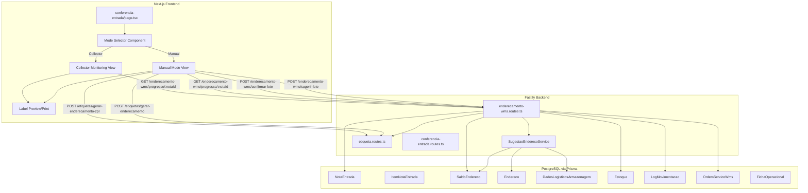

# Design Document: WMS Endereçamento Dual Mode

## Overview

This feature extends the existing WMS addressing (endereçamento) flow to support two operational modes: **Manual Mode** (operator selects addresses via web UI) and **Collector/App Monitoring Mode** (operator uses mobile scanner while web shows real-time progress). Both modes generate mandatory address labels (HTML + ZPL) after each item is addressed.

The design extends the existing `enderecamento-wms.routes.ts`, `conferencia-entrada.routes.ts`, `etiqueta.routes.ts`, and the frontend `conferencia-entrada/page.tsx` rather than rewriting them.

### Key Design Decisions

1. **Extend existing routes** — New endpoints are added to the existing `enderecamento-wms.routes.ts` module. The frontend addressing tab in `conferencia-entrada/page.tsx` is refactored to support dual-mode.
2. **Address Suggestion Service** — A new `SugestaoEnderecoService` class encapsulates the suggestion priority logic (fixed → consolidation → FEFO/FIFO → free), making it testable independently of routes.
3. **Label generation reuses existing infrastructure** — The `etiqueta.routes.ts` already supports HTML and ZPL label generation. New `ENDERECAMENTO_ITEM` label type is added for item-level addressing labels.
4. **Polling for collector monitoring** — The frontend polls the backend every 5 seconds for addressing progress, reusing the existing pattern from the conferência acompanhamento mode.
5. **Batch addressing transaction** — All items of a nota are addressed in a single Prisma transaction to ensure atomicity of SaldoEndereco creation, Estoque updates, LogMovimentacao entries, and nota status change.

## Architecture



## Components and Interfaces

### 1. SugestaoEnderecoService (New)

A pure service class that encapsulates the address suggestion priority logic, extracted from the existing inline logic in `enderecamento-wms.routes.ts` and `conferencia-entrada.routes.ts`.

**File:** `src/modules/enderecamento/sugestao-endereco.service.ts`

```typescript
interface SugestaoResultado {
  sugestao: 'ENDERECO_FIXO' | 'CONSOLIDAR' | 'ENDERECO_LIVRE'
  enderecoId: string
  enderecoCompleto: string
  motivo: string
  rua: string | null
  predio: string | null
  nivel: string | null
  apto: string | null
}

interface SugestaoInput {
  produtoId: string
  empresaId: string
  quantidade: number
  lote?: string
  validade?: Date
}

class SugestaoEnderecoService {
  /**
   * Computes the best address suggestion for a product following priority:
   * 1. Fixed address (DadosLogisticosArmazenagem.enderecoFixoId)
   * 2. Consolidation (existing SaldoEndereco > 0 for same product)
   * 3. Norm-based ordering (FEFO by expiry, FIFO by receipt date)
   * 4. First available free address (sorted by rua, prédio, nível)
   */
  async sugerir(input: SugestaoInput): Promise<SugestaoResultado | null>

  /**
   * Batch suggestion for all items of a nota.
   * Ensures no two items are suggested the same free address.
   */
  async sugerirLote(
    itens: Array<{ itemId: string; produtoId: string; quantidade: number; lote?: string; validade?: Date }>,
    empresaId: string
  ): Promise<Map<string, SugestaoResultado | null>>
}
```

**Priority Chain:**
1. Query `DadosLogisticosArmazenagem` for the product. If `enderecoFixoId` is set and the address is active, return it.
2. Query `SaldoEndereco` for existing stock of the same product (and same lot if FEFO). If found, suggest consolidation.
3. If `tipoNorma` is FEFO, sort candidate addresses by the earliest expiry date of existing stock. If FIFO, sort by earliest `atualizadoEm` (receipt proxy).
4. Fall back to the first free address sorted by `codigoRua ASC, codigoPredio ASC, codigoNivel ASC, codigoApto ASC`.
5. Return `null` if no address is available.

### 2. New Backend Routes (enderecamento-wms.routes.ts)

#### GET `/sugerir-lote`
Batch suggestion for all items of a nota.

```typescript
// Query params
{ notaEntradaId: string }

// Response
{
  sugestoes: Array<{
    itemId: string
    produtoId: string
    produtoCodigo: string
    produtoNome: string
    quantidade: number
    lote: string | null
    validade: string | null
    sugestao: SugestaoResultado | null
  }>
}
```

#### POST `/confirmar-lote`
Batch addressing confirmation for all items of a nota. Executes in a single transaction.

```typescript
// Body
{
  notaEntradaId: string
  itens: Array<{
    itemNotaEntradaId: string
    produtoId: string
    enderecoId: string
    quantidade: number
    lote?: string
    validade?: string
  }>
}

// Response
{
  message: string
  itensEnderecados: number
  etiquetas: Array<{ itemId: string; enderecoCompleto: string; produtoNome: string }>
}
```

**Transaction steps:**
1. Validate all addresses exist and are available
2. For each item: upsert `SaldoEndereco`, upsert `Estoque`, create `LogMovimentacao`
3. Update `NotaEntrada.status` to `ENDERECADA`
4. Close `OrdemServicoWms` (operacao=ENDERECAMENTO) with status `CONCLUIDO`
5. Return label data for batch printing

#### GET `/progresso/:notaEntradaId`
Returns addressing progress for a nota (used by both modes).

```typescript
// Response
{
  notaEntradaId: string
  totalItens: number
  itensEnderecados: number
  percentual: number
  itens: Array<{
    itemId: string
    item: number
    codigoProduto: string
    descricao: string
    quantidade: number
    lote: string | null
    validade: string | null
    enderecoDestino: string | null
    status: 'PENDENTE' | 'ENDERECADO'
  }>
}
```

#### POST `/validar-endereco`
Validates that an address exists and is available for storage.

```typescript
// Body
{ enderecoId: string }

// Response
{
  valido: boolean
  endereco?: { id: string; enderecoCompleto: string; tipo: string; rua: string; predio: string; nivel: string }
  mensagem?: string
}
```

### 3. New Label Routes (etiqueta.routes.ts)

#### POST `/gerar-enderecamento`
Generates HTML labels for addressed items.

```typescript
// Body
{
  itens: Array<{
    enderecoCompleto: string
    produtoCodigo: string
    produtoNome: string
    quantidade: number
    lote?: string
    validade?: string
  }>
  quantidade: number // copies per label
}

// Response: text/html
```

#### POST `/gerar-enderecamento-zpl`
Generates ZPL labels for addressed items.

```typescript
// Body (same as above plus dimensions)
{
  itens: Array<{ ... }>
  quantidade: number
  larguraMm: number  // default 100
  alturaMm: number   // default 50
}

// Response: text/plain (ZPL commands)
```

### 4. Frontend Components

#### Mode Selector
Replaces the current single "Endereçar Automático" button with a dual-mode selection.

```
┌─────────────────────────────────────────────────┐
│  Endereçamento — NF 12345                       │
│                                                 │
│  ┌──────────────┐  ┌──────────────────────┐     │
│  │ 📝 Manual    │  │ 📱 Acompanhamento    │     │
│  │              │  │    (Coletor)         │     │
│  └──────────────┘  └──────────────────────┘     │
└─────────────────────────────────────────────────┘
```

#### Manual Mode View
Table with all items, suggested addresses, and editable destination fields.

```
┌──────────────────────────────────────────────────────────────────────┐
│ # │ Código   │ Produto        │ Qtd │ Lote │ Validade │ Sugestão    │ Destino [▼] │
│ 1 │ PROD001  │ Papel A4       │ 100 │ L01  │ 12/2025  │ R01.P02.N01 │ [________]  │
│ 2 │ PROD002  │ Caneta Azul    │  50 │ —    │ —        │ R01.P03.N01 │ [________]  │
├──────────────────────────────────────────────────────────────────────┤
│ [Aceitar Sugestões] [Imprimir Ficha] [Importar Ficha OCR]          │
│                                          [Confirmar Endereçamento]  │
└──────────────────────────────────────────────────────────────────────┘
```

**Interactions:**
- "Aceitar Sugestões" fills all destination fields with the suggested addresses
- "Imprimir Ficha" generates the addressing sheet HTML (existing `/gerar-ficha` + `/ficha/:id/html`)
- "Importar Ficha OCR" opens the OCR modal (reuses existing OCR flow from conferência)
- "Confirmar Endereçamento" calls `POST /confirmar-lote` and then offers label printing

#### Collector Monitoring View
Real-time progress view with polling.

```
┌──────────────────────────────────────────────────────────────────────┐
│ 📱 Acompanhamento em Tempo Real          [Atualiza a cada 5s]      │
│                                                                      │
│ Progresso: 3/10 itens endereçados                                   │
│ ████████░░░░░░░░░░░░░░░░░░░░░░ 30%                                 │
│                                                                      │
│ # │ Código   │ Produto        │ Qtd │ Endereço     │ Status         │
│ 1 │ PROD001  │ Papel A4       │ 100 │ R01.P02.N01  │ ✅ Endereçado  │
│ 2 │ PROD002  │ Caneta Azul    │  50 │ R01.P03.N01  │ ✅ Endereçado  │
│ 3 │ PROD003  │ Grampeador     │  25 │ R02.P01.N01  │ ✅ Endereçado  │
│ 4 │ PROD004  │ Borracha       │  80 │ —            │ ⏳ Pendente    │
│ ...                                                                  │
├──────────────────────────────────────────────────────────────────────┤
│                                          [Finalizar Endereçamento]  │
└──────────────────────────────────────────────────────────────────────┘
```

#### Employee Selector Fix
The existing `useQuery` for funcionários uses `enabled: funcModal || endFuncModal`. This is correct but the query key should be specific to the addressing context. The fix ensures:
- `enabled` is tied to the modal open state
- Error handling shows a notification with retry
- Format: `${matricula} — ${nome}`

### 5. Addressing Sheet (Ficha) Integration

The existing `FichaService.gerarHtmlEnderecamento()` already generates the addressing sheet with blank address fields. The OCR import flow from `conferencia-entrada` is reused for the addressing context:

1. User clicks "Imprimir Ficha" → calls existing `POST /enderecamento-wms/gerar-ficha` → `GET /enderecamento-wms/ficha/:id/html`
2. User fills in addresses on paper
3. User clicks "Importar Ficha OCR" → uploads PDF/image → calls `POST /ocr/extrair-pdf` or `POST /ocr/processar`
4. OCR results are displayed for review → user confirms → destination fields are populated

## Data Models

No new Prisma models are required. The feature uses existing models:

| Model | Usage |
|-------|-------|
| `NotaEntrada` | Source of items to address; status transitions CONFERIDA → ENDERECADA |
| `ItemNotaEntrada` | Individual items with product code, quantity, lot, expiry |
| `Endereco` | Destination addresses with rua/prédio/nível/apto hierarchy |
| `SaldoEndereco` | Created/updated when items are addressed |
| `Estoque` | Consolidated stock updated on addressing |
| `DadosLogisticosArmazenagem` | Provides enderecoFixoId, tipoNorma (FEFO/FIFO) for suggestions |
| `LogMovimentacao` | Audit trail with tipo=ENDERECAMENTO |
| `OrdemServicoWms` | Work order closed on completion |
| `FichaOperacional` | Addressing sheet tracking |
| `Funcionario` | Employee selection for work order assignment |
| `Produto` | Product data for labels and suggestions |

### Addressing Progress Tracking

Progress is computed dynamically by comparing `ItemNotaEntrada` items against `SaldoEndereco` records:

```sql
-- For each item in the nota, check if a SaldoEndereco exists
-- with matching produtoId (via Produto.codigo = ItemNotaEntrada.codigoProduto)
SELECT
  ine.id,
  ine."codigo_produto",
  ine.descricao,
  ine.quantidade,
  se."endereco_id" IS NOT NULL AS enderecado,
  e."endereco_completo" AS endereco_destino
FROM item_nota_entrada ine
LEFT JOIN produto p ON p.codigo = ine."codigo_produto"
LEFT JOIN saldo_endereco se ON se."produto_id" = p.id AND se.quantidade > 0
LEFT JOIN endereco e ON e.id = se."endereco_id"
WHERE ine."nota_entrada_id" = :notaId
```

## Correctness Properties

*A property is a characteristic or behavior that should hold true across all valid executions of a system — essentially, a formal statement about what the system should do. Properties serve as the bridge between human-readable specifications and machine-verifiable correctness guarantees.*

### Property 1: Suggestion Engine Priority Chain

*For any* product with a `DadosLogisticosArmazenagem` record where `enderecoFixoId` is non-null and the address is active, the `SugestaoEnderecoService` SHALL return that fixed address as the suggestion, regardless of other available addresses or existing stock.

**Validates: Requirements 3.1, 3.2, 3.3**

### Property 2: Consolidation Fallback

*For any* product without a fixed address but with existing `SaldoEndereco` (quantity > 0) at an active address, the `SugestaoEnderecoService` SHALL return that address with sugestao type `CONSOLIDAR`.

**Validates: Requirements 3.2**

### Property 3: Norm-Based Ordering

*For any* product with `tipoNorma` FEFO, the suggestion engine SHALL prefer addresses where existing stock has expiry dates in ascending order. *For any* product with `tipoNorma` FIFO, the suggestion engine SHALL prefer addresses where existing stock has receipt dates in ascending order.

**Validates: Requirements 3.4, 3.5**

### Property 4: Free Address Sort Order

*For any* product without a fixed address, consolidation address, or norm-based match, the suggestion engine SHALL return the first available free address sorted by `codigoRua ASC`, `codigoPredio ASC`, `codigoNivel ASC`, `codigoApto ASC`.

**Validates: Requirements 3.3**

### Property 5: Address Validation

*For any* address ID, the validation function SHALL return `valido: true` if and only if the address exists in the database, has `status: true`, and has `tipo` in `['ARMAZENAGEM', 'LIVRE']`.

**Validates: Requirements 2.3**

### Property 6: Batch Addressing Record Creation

*For any* set of items with valid addresses submitted to `confirmar-lote`, after the transaction completes, each item SHALL have a corresponding `SaldoEndereco` record with the correct `produtoId`, `enderecoId`, and `quantidade`, and the `Estoque` for each product SHALL be incremented by the item's quantity.

**Validates: Requirements 2.4, 10.1, 10.2, 10.3**

### Property 7: Addressing Completion State Transitions

*For any* `NotaEntrada` where all items have been addressed, the nota status SHALL be `ENDERECADA`, the associated `OrdemServicoWms` with operacao `ENDERECAMENTO` SHALL have status `CONCLUIDO`, and a `LogMovimentacao` entry with tipo `ENDERECAMENTO` SHALL exist for each addressed item.

**Validates: Requirements 10.1, 10.2, 10.3**

### Property 8: Label Data Completeness

*For any* addressed item, the generated label (HTML or ZPL) SHALL contain: the destination address as a scannable barcode, the product code, the product name, the quantity, the lot number (if present), and the expiry date (if present).

**Validates: Requirements 6.3, 8.3**

### Property 9: ZPL Validity

*For any* addressed item, the generated ZPL output SHALL start with `^XA` and end with `^XZ`, contain a `^BC` (Code128 barcode) command with the address barcode value, and have `^PW` and `^LL` values corresponding to 100mm × 50mm at 8 dots/mm.

**Validates: Requirements 9.1, 9.2, 9.3**

### Property 10: Progress Calculation

*For any* nota with `N` total items and `K` addressed items (0 ≤ K ≤ N, N > 0), the progress endpoint SHALL return `percentual` equal to `(K / N) * 100`, `totalItens` equal to `N`, and `itensEnderecados` equal to `K`.

**Validates: Requirements 5.1**

### Property 11: Employee Formatting

*For any* employee with `matricula` and `nome`, the Employee_Selector SHALL display the option formatted as `"{matricula} — {nome}"`.

**Validates: Requirements 7.3**

### Property 12: Addressing Sheet Completeness

*For any* nota with items, the generated addressing sheet HTML SHALL contain each item's number, product code, product name, quantity, lot, and a blank destination address field, plus a unique barcode identifier.

**Validates: Requirements 4.1, 4.2**

## Error Handling

| Scenario | Handling |
|----------|----------|
| No available addresses | `SugestaoEnderecoService` returns `null`; frontend shows warning alert "Nenhum endereço disponível" |
| Invalid address selected | `POST /confirmar-lote` returns 422 with message identifying the invalid address |
| Product not found for item | `POST /confirmar-lote` returns 404; transaction is rolled back |
| Partial addressing failure | Entire transaction rolls back; no partial SaldoEndereco records are created |
| Employee API failure | Frontend shows error notification via Mantine `notifications.show()` with retry option |
| OCR low confidence | Fields with confidence < 80% are highlighted in yellow for manual review |
| Concurrent addressing conflict | Prisma transaction isolation prevents double-addressing; second request gets 422 |
| Polling failure in collector mode | Silently ignored (existing pattern); next poll retries automatically |

## Testing Strategy

### Property-Based Tests (PBT)

The feature is suitable for property-based testing, particularly for the `SugestaoEnderecoService` logic, address validation, label generation, and progress calculation.

**Library:** `fast-check` (already available in the Node.js ecosystem, compatible with Vitest/Jest)

**Configuration:**
- Minimum 100 iterations per property test
- Each test tagged with: `Feature: wms-enderecamento-dual-mode, Property {N}: {title}`

**Properties to test with PBT:**
- Property 1–4: Suggestion engine priority chain, consolidation, norm ordering, free address sort
- Property 5: Address validation
- Property 8: Label data completeness
- Property 9: ZPL validity
- Property 10: Progress calculation
- Property 11: Employee formatting
- Property 12: Addressing sheet completeness

### Unit Tests (Example-Based)

- Mode selection renders correct view (Requirements 1.1, 1.2, 1.3)
- OCR result display with confidence scores (Requirement 4.4)
- OCR confirmation populates address fields (Requirement 4.5)
- Collector mode polling interval is 5 seconds (Requirement 5.2)
- Batch print option appears after completion (Requirement 6.6)
- Employee query enabled only when modal is open (Requirement 7.2)
- HTML label uses Code128 barcode (Requirement 8.2)
- ZPL dimensions match 100mm × 50mm (Requirement 9.3)

### Integration Tests

- Full addressing flow: suggest → confirm → verify SaldoEndereco + Estoque + LogMovimentacao + nota status
- OCR upload and extraction pipeline
- Employee list API loading in modal context
- Collector mode: address via API → poll progress → verify update

### Edge Case Tests

- No available addresses (all occupied)
- Employee API failure with retry
- Nota with zero items
- Product with no DadosLogisticosArmazenagem record
- Address with status=false (inactive)
- Concurrent addressing of same nota
