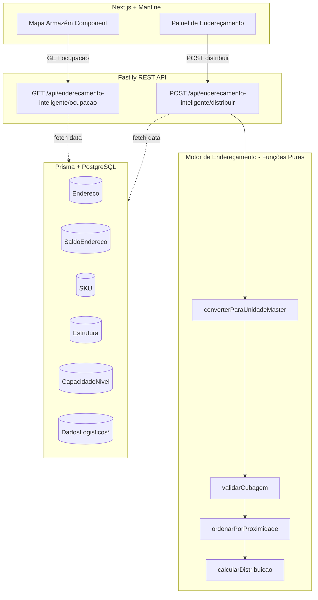
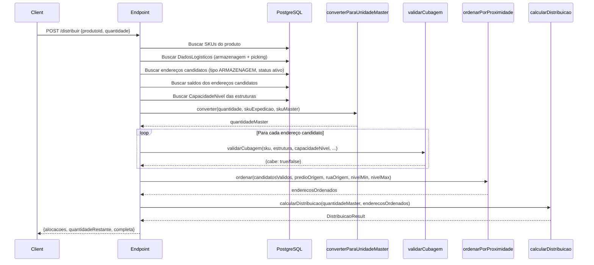

# Design — Endereçamento Inteligente com Distribuição por Capacidade e Visualização Gráfica

## Visão Geral (Overview)

Este documento descreve a arquitetura e design do módulo de Endereçamento Inteligente, que substitui o `SugestaoEnderecoService` existente por um motor de distribuição por capacidade com alocação por proximidade e visualização gráfica do armazém.

O sistema atual sugere um único endereço por item sem considerar capacidade física. O novo motor:
1. Calcula a capacidade real de cada posição (lastro × camada)
2. Distribui a quantidade entre múltiplos endereços quando necessário (split)
3. Ordena candidatos por proximidade ao picking/endereço fixo (algoritmo par/ímpar)
4. Valida cubagem (dimensões SKU vs Estrutura)
5. Expõe uma API de ocupação para o frontend renderizar o mapa do armazém

### Decisões de Design

| Decisão | Escolha | Justificativa |
|---------|---------|---------------|
| Motor como função pura | Sim | Testabilidade, sem side-effects, recebe dados pré-fetched |
| Algoritmo de proximidade | Par/ímpar Delphi | Compatibilidade com lógica legada validada em produção |
| Validador de cubagem | Função pura separada | Reutilizável, testável isoladamente |
| Mapa do armazém | React + CSS Grid | Performance com muitas posições, sem dependência de lib pesada |
| Conversão de unidades | Pré-processamento | Converter antes de entrar no motor, mantendo motor agnóstico |

---

## Arquitetura (Architecture)



### Fluxo de Dados

1. **Request** → Endpoint recebe `produtoId`, `quantidade`, `lote`, `validade`, `empresaId`
2. **Fetch** → Busca SKU master, endereços candidatos, saldos, capacidades, dados logísticos
3. **Conversão** → Converte quantidade de unidade de expedição para unidade master
4. **Validação** → Filtra endereços por cubagem (dimensões SKU ≤ dimensões Estrutura)
5. **Ordenação** → Ordena candidatos por proximidade (algoritmo par/ímpar)
6. **Distribuição** → Aloca quantidade iterativamente respeitando capacidade de cada posição
7. **Response** → Retorna lista de alocações com quantidades e endereços

---

## Componentes e Interfaces (Components and Interfaces)

### 1. `converterParaUnidadeMaster` — Conversor de Unidades

```typescript
interface SkuInfo {
  id: string
  sequencia: number
  qtdEmbalagem: number
  lastro: number | null
  camada: number | null
}

interface ConversaoInput {
  quantidade: number
  skuExpedicao: SkuInfo    // SKU da unidade de entrada
  skuMaster: SkuInfo       // SKU master (maior sequência com lastro/camada)
}

interface ConversaoResult {
  quantidadeMaster: number  // Quantidade convertida para unidade master
  fatorConversao: number    // Fator usado na conversão
}

function converterParaUnidadeMaster(input: ConversaoInput): ConversaoResult
```

**Lógica**: `quantidadeMaster = quantidade × (skuExpedicao.qtdEmbalagem / skuMaster.qtdEmbalagem)`

### 2. `validarCubagem` — Validador de Cubagem

```typescript
interface DimensoesSku {
  largura: number | null
  altura: number | null
  comprimento: number | null
  volume: number | null
  pesoBruto: number | null
}

interface DimensoesEstrutura {
  largura: number | null
  altura: number | null
  comprimento: number | null
  cubagem: number | null
}

interface CapacidadeNivelConfig {
  pesoMaximo: number | null
  volumeMaximo: number | null
  paletesMaximo: number | null
}

interface CubagemInput {
  sku: DimensoesSku
  estrutura: DimensoesEstrutura
  capacidadeNivel: CapacidadeNivelConfig | null
  quantidadeDesejada: number
  saldoAtualPeso: number
  saldoAtualVolume: number
  saldoAtualPaletes: number
}

interface CubagemResult {
  cabe: boolean
  motivo?: string
  tipo?: 'DIMENSAO' | 'PESO' | 'VOLUME'
}

function validarCubagem(input: CubagemInput): CubagemResult
```

**Regras**:
- Se SKU não tem dimensões → permite (graceful degradation)
- Se Estrutura não tem dimensões → permite
- Verifica: `sku.largura ≤ estrutura.largura AND sku.altura ≤ estrutura.altura AND sku.comprimento ≤ estrutura.comprimento`
- Verifica peso total: `(saldoAtualPeso + sku.pesoBruto × quantidade) ≤ capacidadeNivel.pesoMaximo`
- Verifica volume total: `(saldoAtualVolume + sku.volume × quantidade) ≤ capacidadeNivel.volumeMaximo`
- Se `capacidadeNivel` é null → permite sem restrição de peso/volume

### 3. `ordenarPorProximidade` — Alocador de Proximidade

```typescript
interface EnderecoCandidate {
  id: string
  rua: string
  predio: number        // Código numérico do prédio
  nivel: number         // Código numérico do nível
  apartamento: number   // Código numérico do apartamento
  enderecoCompleto: string
  estruturaId: string | null
  classificacaoProdutoId: string | null
}

interface ProximidadeInput {
  candidatos: EnderecoCandidate[]
  predioOrigem: number       // Prédio do picking ou endereço fixo
  ruaOrigem: string          // Rua do picking ou endereço fixo
  nivelMin: number           // Nível mínimo permitido (DadosLogisticos)
  nivelMax: number           // Nível máximo permitido (DadosLogisticos)
}

function ordenarPorProximidade(input: ProximidadeInput): EnderecoCandidate[]
```

**Algoritmo par/ímpar**:
1. Filtrar candidatos por `nivel >= nivelMin AND nivel <= nivelMax`
2. Agrupar por rua (priorizar `ruaOrigem`)
3. Dentro de cada rua, ordenar prédios:
   - Prédio de origem primeiro (diferença = 0)
   - Mesmo lado: diferença par crescente (+2, -2, +4, -4, ...)
   - Lado oposto: diferença ímpar crescente (+1, -1, +3, -3, ...)
4. Dentro de cada prédio, ordenar por nível e apartamento

### 4. `calcularDistribuicao` — Motor de Distribuição

```typescript
interface EnderecoComCapacidade {
  id: string
  enderecoCompleto: string
  rua: string
  predio: string
  nivel: string
  apartamento: string
  capacidadePalete: number    // lastro × camada
  saldoAtual: number          // Quantidade já armazenada
  disponivel: number          // capacidadePalete - saldoAtual
}

interface DistribuicaoInput {
  quantidade: number                    // Quantidade total a distribuir (em unidade master)
  enderecosOrdenados: EnderecoComCapacidade[]  // Já ordenados por proximidade
}

interface Alocacao {
  enderecoId: string
  enderecoCompleto: string
  rua: string
  predio: string
  nivel: string
  apartamento: string
  quantidadeAlocada: number
}

interface DistribuicaoResult {
  alocacoes: Alocacao[]
  quantidadeTotal: number
  quantidadeAlocada: number
  quantidadeRestante: number
  completa: boolean            // true se toda quantidade foi alocada
}

function calcularDistribuicao(input: DistribuicaoInput): DistribuicaoResult
```

**Lógica**:
1. Iterar sobre `enderecosOrdenados`
2. Para cada endereço: `alocar = min(quantidadeRestante, endereco.disponivel)`
3. Se `alocar > 0`: adicionar à lista de alocações
4. Decrementar `quantidadeRestante`
5. Se `quantidadeRestante === 0`: parar
6. Retornar resultado com flag `completa`

### 5. Endpoint REST — Distribuição

```typescript
// POST /api/enderecamento-inteligente/distribuir
interface DistribuirRequest {
  produtoId: string
  quantidade: number
  lote?: string
  validade?: string   // ISO date
  skuId?: string      // SKU de expedição (opcional, default = primeiro SKU)
}

// Response: DistribuicaoResult (definido acima)
```

### 6. Endpoint REST — Ocupação

```typescript
// GET /api/enderecamento-inteligente/ocupacao?depositoId=xxx
interface OcupacaoEnderecoResponse {
  enderecos: Array<{
    id: string
    enderecoCompleto: string
    rua: string
    predio: string
    nivel: string
    apartamento: string
    status: 'VAZIO' | 'PARCIAL' | 'CHEIO' | 'BLOQUEADO'
    percentualOcupacao: number
    capacidadePalete: number
    saldoAtual: number
    produto?: {
      id: string
      nome: string
      quantidade: number
      lote?: string
    }
  }>
}
```

### 7. `MapaArmazem` — Componente React

```typescript
interface MapaArmazemProps {
  enderecos: OcupacaoEnderecoResponse['enderecos']
  sugestoes?: Array<{ enderecoId: string; quantidade: number }>
  filtroRua?: string
  filtroPredio?: string
  filtroProduto?: string
  onEnderecoClick?: (enderecoId: string) => void
}
```

**Renderização**:
- CSS Grid com colunas = apartamentos, linhas = níveis (invertido, nível 1 embaixo)
- Cada rua é uma seção, cada prédio é um bloco dentro da seção
- Cores: verde (#4CAF50) vazio, amarelo (#FFC107) parcial, vermelho (#F44336) cheio, azul (#2196F3) bloqueado, roxo (#9C27B0) sugerido
- Tooltip/popover no hover com detalhes
- Click abre painel lateral com informações completas

---

## Modelos de Dados (Data Models)

### Modelos Existentes Utilizados (sem alteração)

| Modelo | Campos Relevantes |
|--------|-------------------|
| `Produto` | id, nome, empresaId |
| `SKU` | id, produtoId, sequencia, qtdEmbalagem, largura, altura, comprimento, volume, pesoBruto, lastro, camada |
| `Estrutura` | id, capacidade, largura, altura, comprimento, cubagem |
| `Endereco` | id, rua, predio, nivel, apartamento, codigoRua, codigoPredio, codigoNivel, codigoApto, enderecoCompleto, estruturaId, tipo, status, classificacaoProdutoId |
| `SaldoEndereco` | id, enderecoId, produtoId, quantidade, lote, validade |
| `CapacidadeNivel` | id, estruturaId, codigoNivel, pesoMaximo, volumeMaximo, paletesMaximo |
| `DadosLogisticosArmazenagem` | id, produtoId, enderecoFixoId, tipoNorma, nivMinPP, nivMaxPP |
| `DadosLogisticosPicking` | id, produtoId, enderecoPickingId |

### Tipos Derivados (runtime, não persistidos)

```typescript
// Resultado intermediário do motor — usado internamente
interface EnderecoAvaliado {
  endereco: EnderecoCandidate
  estrutura: DimensoesEstrutura | null
  capacidadeNivel: CapacidadeNivelConfig | null
  capacidadePalete: number          // lastro × camada (do SKU master)
  saldoAtual: number                // Soma de SaldoEndereco.quantidade para este endereço
  disponivel: number                // capacidadePalete - saldoAtual
  cubagemValida: boolean            // Resultado do validarCubagem
}
```

### Fluxo de Dados no Motor (Diagrama)



---


## Correctness Properties

*A property is a characteristic or behavior that should hold true across all valid executions of a system — essentially, a formal statement about what the system should do. Properties serve as the bridge between human-readable specifications and machine-verifiable correctness guarantees.*

### Property 1: Cálculo de capacidade com fallback

*For any* SKU, if lastro and camada are both defined and positive, the pallet capacity SHALL equal lastro × camada. If either is null or zero, the system SHALL use the Estrutura's capacity as the limit.

**Validates: Requirements 1.1, 1.2**

### Property 2: Validação dimensional de cubagem

*For any* SKU with defined dimensions (largura, altura, comprimento) and any Estrutura with defined dimensions, `validarCubagem` SHALL return `cabe = true` if and only if `sku.largura ≤ estrutura.largura AND sku.altura ≤ estrutura.altura AND sku.comprimento ≤ estrutura.comprimento`.

**Validates: Requirements 1.3**

### Property 3: Rejeição por peso e volume

*For any* combination of SKU (pesoBruto, volume), quantidade, saldo atual (peso, volume), and CapacidadeNivel (pesoMaximo, volumeMaximo), `validarCubagem` SHALL reject the allocation if and only if `(saldoAtualPeso + pesoBruto × quantidade) > pesoMaximo` OR `(saldoAtualVolume + volume × quantidade) > volumeMaximo`.

**Validates: Requirements 1.4, 1.5**

### Property 4: Configuração nula permite tudo

*For any* SKU, quantidade, and endereço where CapacidadeNivel is null, `validarCubagem` SHALL return `cabe = true` regardless of peso ou volume calculados.

**Validates: Requirements 1.6**

### Property 5: Alocação gulosa (greedy)

*For any* distribution where the quantity exceeds a single address capacity, each non-final allocation in the result SHALL equal the full available capacity (`disponivel`) of that address.

**Validates: Requirements 2.1, 2.2**

### Property 6: Invariante de conservação de quantidade

*For any* distribution where the total available capacity across all candidate addresses is greater than or equal to the requested quantity, the sum of all `quantidadeAlocada` values SHALL equal the input quantity, and `completa` SHALL be true.

**Validates: Requirements 2.6**

### Property 7: Alocação parcial com resto

*For any* distribution where the total available capacity is less than the requested quantity, `quantidadeRestante` SHALL equal `quantidade - sum(alocações)`, `completa` SHALL be false, and all available capacity SHALL be fully utilized.

**Validates: Requirements 2.4, 2.5**

### Property 8: Ordenação por proximidade (par/ímpar)

*For any* set of candidate addresses and an origin building P, `ordenarPorProximidade` SHALL return addresses ordered such that: (1) all addresses in building P come first, (2) followed by same-side buildings (even difference: |diff| = 2, 4, 6...) in ascending absolute difference, (3) followed by opposite-side buildings (odd difference: |diff| = 1, 3, 5...) in ascending absolute difference. Within each building, addresses are ordered by level then apartment.

**Validates: Requirements 3.1, 3.2, 3.3, 3.4, 3.5**

### Property 9: Expansão entre ruas

*For any* set of candidate addresses spanning multiple streets, all addresses in the origin street SHALL appear before addresses in other streets in the proximity ordering.

**Validates: Requirements 3.6**

### Property 10: Filtro por classificação de produto

*For any* set of candidate addresses with `classificacaoProdutoId` defined, the proximity ordering SHALL exclude addresses whose classification is incompatible with the product being allocated.

**Validates: Requirements 3.7**

### Property 11: Cadeia de prioridade (fixo → consolidação → livre)

*For any* product with an active fixed address configured, the first allocation in the distribution result SHALL target that fixed address. If no fixed address exists but stock of the same product exists elsewhere, the first allocation SHALL target the consolidation address.

**Validates: Requirements 5.2**

### Property 12: Conversão de unidades

*For any* quantity in expedition SKU units and a pair of SKUs (expedition and master), the converted quantity SHALL equal `quantidade × (skuExpedicao.qtdEmbalagem / skuMaster.qtdEmbalagem)`.

**Validates: Requirements 6.1**

### Property 13: Seleção do SKU master

*For any* product with multiple SKUs, the selected master SKU SHALL be the one with the highest `sequencia` value among those that have both `lastro` and `camada` defined and non-null.

**Validates: Requirements 6.2**

### Property 14: Classificação de ocupação

*For any* address with a defined pallet capacity, the occupancy status SHALL be: `VAZIO` when saldo = 0, `PARCIAL` when 0 < saldo < capacidadePalete, `CHEIO` when saldo ≥ capacidadePalete, and `BLOQUEADO` when status = false. The percentage SHALL equal `(saldo / capacidadePalete) × 100`.

**Validates: Requirements 7.2, 7.3, 7.4**

### Property 15: Filtragem de endereços no mapa

*For any* set of addresses and a filter (by rua, prédio, or produto), the filtered result SHALL contain only addresses matching all active filter criteria, and SHALL contain ALL addresses that match.

**Validates: Requirements 4.5**

---

## Tratamento de Erros (Error Handling)

| Cenário | Comportamento | Código HTTP |
|---------|---------------|-------------|
| Produto sem SKU master (sem lastro/camada) | Retorna erro com mensagem "SKU master não cadastrado para este produto. Configure lastro e camada." | 422 |
| Produto não encontrado | Retorna erro "Produto não encontrado" | 404 |
| Nenhum endereço disponível no depósito | Retorna distribuição vazia com `quantidadeRestante = quantidade` e `completa = false` | 200 |
| Capacidade insuficiente (parcial) | Retorna alocações parciais + `quantidadeRestante > 0` + `completa = false` | 200 |
| Endereço fixo inativo/bloqueado | Ignora endereço fixo, segue para consolidação/livre | — |
| SKU sem dimensões para cubagem | Graceful degradation: permite alocação (skip validação dimensional) | — |
| Estrutura sem dimensões | Graceful degradation: permite alocação (skip validação dimensional) | — |
| CapacidadeNivel não configurada | Permite alocação sem restrição de peso/volume | — |
| Quantidade zero ou negativa | Retorna erro de validação Zod | 400 |
| empresaId inválido (tenant) | Middleware de tenant retorna 403 | 403 |
| depositoId não encontrado (ocupação) | Retorna erro "Depósito não encontrado" | 404 |

### Estratégia de Graceful Degradation

O motor segue o princípio de **permitir quando não há informação suficiente para rejeitar**:
- Sem dimensões no SKU → não valida cubagem dimensional
- Sem dimensões na Estrutura → não valida cubagem dimensional
- Sem CapacidadeNivel → não valida peso/volume
- Sem DadosLogisticosPicking → usa primeiro endereço livre como origem
- Sem DadosLogisticosArmazenagem → sem filtro de nível min/max (usa todos)

---

## Estratégia de Testes (Testing Strategy)

### Abordagem Dual

O projeto utiliza uma abordagem dual de testes:
- **Testes unitários (example-based)**: Cenários específicos, edge cases, integração entre componentes
- **Testes de propriedade (property-based)**: Propriedades universais validadas com inputs gerados aleatoriamente

### Biblioteca de Property-Based Testing

**Escolha**: [fast-check](https://github.com/dubzzz/fast-check) — biblioteca PBT madura para TypeScript/JavaScript.

**Justificativa**: 
- Suporte nativo a TypeScript
- Arbitraries composáveis para gerar dados complexos (SKUs, endereços, etc.)
- Integração com test runners padrão (Jest/Vitest)
- Shrinking automático para encontrar o menor caso de falha

### Configuração

```typescript
// Cada teste de propriedade deve rodar no mínimo 100 iterações
fc.assert(fc.property(...), { numRuns: 100 })
```

### Mapeamento de Propriedades para Testes

Cada propriedade do design será implementada como um teste PBT individual:

| Property | Função Testada | Tag |
|----------|---------------|-----|
| P1 | `calcularCapacidadePalete` | Feature: wms-enderecamento-inteligente, Property 1: Cálculo de capacidade com fallback |
| P2 | `validarCubagem` | Feature: wms-enderecamento-inteligente, Property 2: Validação dimensional de cubagem |
| P3 | `validarCubagem` | Feature: wms-enderecamento-inteligente, Property 3: Rejeição por peso e volume |
| P4 | `validarCubagem` | Feature: wms-enderecamento-inteligente, Property 4: Configuração nula permite tudo |
| P5 | `calcularDistribuicao` | Feature: wms-enderecamento-inteligente, Property 5: Alocação gulosa |
| P6 | `calcularDistribuicao` | Feature: wms-enderecamento-inteligente, Property 6: Invariante de conservação |
| P7 | `calcularDistribuicao` | Feature: wms-enderecamento-inteligente, Property 7: Alocação parcial com resto |
| P8 | `ordenarPorProximidade` | Feature: wms-enderecamento-inteligente, Property 8: Ordenação par/ímpar |
| P9 | `ordenarPorProximidade` | Feature: wms-enderecamento-inteligente, Property 9: Expansão entre ruas |
| P10 | `ordenarPorProximidade` | Feature: wms-enderecamento-inteligente, Property 10: Filtro por classificação |
| P11 | `calcularDistribuicaoCompleta` | Feature: wms-enderecamento-inteligente, Property 11: Cadeia de prioridade |
| P12 | `converterParaUnidadeMaster` | Feature: wms-enderecamento-inteligente, Property 12: Conversão de unidades |
| P13 | `selecionarSkuMaster` | Feature: wms-enderecamento-inteligente, Property 13: Seleção do SKU master |
| P14 | `classificarOcupacao` | Feature: wms-enderecamento-inteligente, Property 14: Classificação de ocupação |
| P15 | `filtrarEnderecos` | Feature: wms-enderecamento-inteligente, Property 15: Filtragem de endereços |

### Testes Unitários (Example-Based)

| Cenário | Tipo |
|---------|------|
| Produto sem SKU master retorna erro 422 | Edge case |
| Endpoint POST /distribuir retorna shape correto | Smoke |
| Endpoint GET /ocupacao retorna shape correto | Smoke |
| Filtro por lote exclui endereços incompatíveis | Example |
| Mapa renderiza hierarquia rua > prédio > nível > apto | Example |
| Click em posição abre painel de detalhes | Example |
| Posições sugeridas recebem cor diferenciada | Example |
| LogMovimentacao criado após confirmação | Integration |

### Generators (Arbitraries) para PBT

```typescript
// Exemplo de generators para fast-check
const skuArb = fc.record({
  id: fc.uuid(),
  sequencia: fc.integer({ min: 1, max: 10 }),
  qtdEmbalagem: fc.integer({ min: 1, max: 100 }),
  largura: fc.option(fc.float({ min: 0.1, max: 200 })),
  altura: fc.option(fc.float({ min: 0.1, max: 200 })),
  comprimento: fc.option(fc.float({ min: 0.1, max: 200 })),
  volume: fc.option(fc.float({ min: 0.001, max: 50 })),
  pesoBruto: fc.option(fc.float({ min: 0.1, max: 1000 })),
  lastro: fc.option(fc.integer({ min: 1, max: 20 })),
  camada: fc.option(fc.integer({ min: 1, max: 10 })),
})

const enderecoArb = fc.record({
  id: fc.uuid(),
  rua: fc.stringOf(fc.constantFrom('A', 'B', 'C', 'D'), { minLength: 1, maxLength: 1 }),
  predio: fc.integer({ min: 1, max: 30 }),
  nivel: fc.integer({ min: 1, max: 6 }),
  apartamento: fc.integer({ min: 1, max: 4 }),
  enderecoCompleto: fc.string(),
  estruturaId: fc.option(fc.uuid()),
  classificacaoProdutoId: fc.option(fc.uuid()),
})

const capacidadeNivelArb = fc.option(fc.record({
  pesoMaximo: fc.option(fc.float({ min: 100, max: 5000 })),
  volumeMaximo: fc.option(fc.float({ min: 1, max: 100 })),
  paletesMaximo: fc.option(fc.integer({ min: 1, max: 10 })),
}))
```

### Estrutura de Arquivos de Teste

```
src/modules/enderecamento-inteligente/
├── __tests__/
│   ├── calcular-capacidade.property.test.ts    (P1)
│   ├── validar-cubagem.property.test.ts        (P2, P3, P4)
│   ├── calcular-distribuicao.property.test.ts  (P5, P6, P7)
│   ├── ordenar-proximidade.property.test.ts    (P8, P9, P10)
│   ├── cadeia-prioridade.property.test.ts      (P11)
│   ├── conversao-unidade.property.test.ts      (P12)
│   ├── selecionar-sku-master.property.test.ts  (P13)
│   ├── classificar-ocupacao.property.test.ts   (P14)
│   ├── filtrar-enderecos.property.test.ts      (P15)
│   └── enderecamento-inteligente.unit.test.ts  (unit/integration)
```
