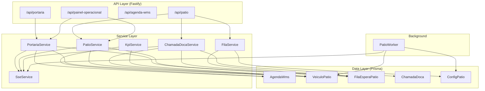
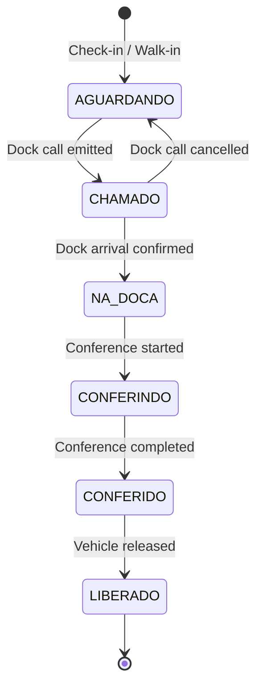

# Design Document: Integração Agenda/Portaria ↔ Pátio/Doca

## Overview

This design unifies the existing Agenda/Portaria scheduling system with the Patio yard management module into a single, end-to-end vehicle lifecycle for the WMS inbound flow. Currently these two modules operate independently — the portaria `conferir` action transitions AgendaWms statuses but never creates VeiculoPatio records, and the patio module has its own entry flow disconnected from scheduling.

**After integration**, the system follows the professional WMS standard:

```
AgendaWms (AGENDADO) → Gate Check-in → VeiculoPatio (AGUARDANDO) + FilaEsperaPatio
   → ChamadaDoca (CHAMADO) → VeiculoPatio (CHAMADO) → Dock Arrival → VeiculoPatio (NA_DOCA)
   → Conference Start → VeiculoPatio (CONFERINDO) → Conference End → VeiculoPatio (CONFERIDO)
   → Release → VeiculoPatio (LIBERADO)
```

AgendaWms status is kept in sync as a read-only reflection of VeiculoPatio lifecycle transitions.

**Key design decisions:**
1. **VeiculoPatio is the single operational record** — AgendaWms remains the planning entity, with its status derived from VeiculoPatio transitions
2. **Portaria `conferir` route is refactored** to also create VeiculoPatio + FilaEsperaPatio in the same transaction
3. **ChamadaDoca gains a two-step flow**: CHAMADO (called) → ATENDIDO (arrived at dock), with VeiculoPatio status CHAMADO as an intermediate state before NA_DOCA
4. **Walk-in vehicles** enter the same workflow via a dedicated endpoint that creates VeiculoPatio without agendamentoId
5. **SSE notifications** are emitted for dock calls, expirations, dock releases, and permanence alerts

## Architecture



### Module Responsibilities

| Module | Responsibility |
|--------|---------------|
| **PortariaService** | Gate check-in (scheduled + walk-in), creating VeiculoPatio + FilaEsperaPatio, syncing AgendaWms |
| **PatioService** | Vehicle listing, release, dock operations, conference lifecycle hooks |
| **FilaService** | Queue ordering logic, priority assignment from ConfigPatio, position management |
| **ChamadaDocaService** | Dock call creation, SSE emission, attendance confirmation, cancellation with re-queue |
| **KpiService** | Metric computation (tempo_espera, tempo_doca, aderencia, pontualidade) |
| **SseService** | Centralized SSE connection management and event broadcasting |
| **PatioWorker** | Periodic permanence alert evaluation with SSE emission |

### Transaction Boundaries

All multi-entity operations use Prisma `$transaction`:

1. **Check-in**: AgendaWms update + VeiculoPatio create + FilaEsperaPatio insert
2. **Dock call emit**: ChamadaDoca create + VeiculoPatio update (CHAMADO)
3. **Dock arrival**: ChamadaDoca update (ATENDIDO) + VeiculoPatio update (NA_DOCA) + FilaEsperaPatio delete + AgendaWms sync
4. **Release**: VeiculoPatio update (LIBERADO) + AgendaWms sync

## Components and Interfaces

### 1. PortariaService (Refactored)

```typescript
interface CheckInInput {
  agendamentoId: string
  placa: string
  motorista: string
  motoristaDocumento: string
  qtdCaixas?: number
  qtdPaletes?: number
  observacao?: string
}

interface WalkInInput {
  placa: string
  motoristaNome: string
  motoristaDocumento: string
  tipoOperacao: 'CARGA' | 'DESCARGA' | 'DEVOLUCAO' | 'TRANSFERENCIA'
  transportadoraId?: string
  cdId: string
}

class PortariaService {
  /** Check-in: validates AgendaWms AGENDADO, creates VeiculoPatio + FilaEsperaPatio, syncs AgendaWms → ESPERA */
  async conferirCheckin(empresaId: string, data: CheckInInput, usuarioId: string): Promise<CheckInResult>

  /** Walk-in: creates VeiculoPatio without agendamentoId */
  async registrarWalkIn(empresaId: string, data: WalkInInput, usuarioId: string): Promise<VeiculoPatio>

  /** Sync AgendaWms status from VeiculoPatio transition (called internally) */
  async sincronizarAgendaStatus(tx: PrismaTransaction, veiculoId: string, novoStatus: string): Promise<void>
}
```

### 2. ChamadaDocaService (Enhanced)

```typescript
interface EmitirChamadaInput {
  veiculoId: string
  docaId: string
}

class ChamadaDocaService {
  /** Suggest next vehicle for a dock based on priority queue + dock compatibility */
  async sugerirProximo(empresaId: string, docaId: string): Promise<SugestaoResult | null>

  /** Create dock call: ChamadaDoca CHAMADO + VeiculoPatio.status → CHAMADO + SSE */
  async emitirChamada(empresaId: string, data: EmitirChamadaInput, usuarioId: string): Promise<ChamadaDoca>

  /** Confirm dock arrival: ChamadaDoca ATENDIDO + VeiculoPatio.status → NA_DOCA + remove from queue + sync AgendaWms */
  async confirmarChegada(empresaId: string, chamadaId: string): Promise<ChamadaDoca>

  /** Cancel dock call: return vehicle to queue at original priority + sync AgendaWms */
  async cancelarChamada(empresaId: string, chamadaId: string, motivo: string): Promise<ChamadaDoca>
}
```

### 3. FilaService (Extracted)

```typescript
class FilaService {
  /** Determine priority for a vehicle based on ConfigPatio and operation type */
  async calcularPrioridade(empresaId: string, cdId: string, tipoOperacao: string, isAgendado: boolean): Promise<number>

  /** Insert vehicle into queue at next position */
  async inserirNaFila(tx: PrismaTransaction, empresaId: string, cdId: string, veiculoId: string, prioridade: number): Promise<FilaEsperaPatio>

  /** Remove vehicle from queue */
  async removerDaFila(tx: PrismaTransaction, empresaId: string, veiculoId: string): Promise<void>

  /** Re-insert vehicle at elevated priority (after cancelled dock call) */
  async reinserirComPrioridade(tx: PrismaTransaction, empresaId: string, cdId: string, veiculoId: string, prioridade: number): Promise<FilaEsperaPatio>
}
```

### 4. KpiService (New)

```typescript
interface KpiFilters {
  cdId?: string
  dataInicio: Date
  dataFim: Date
}

interface KpiMetrics {
  tempoEsperaMedio: number
  tempoEsperaMax: number
  tempoEsperaP90: number
  tempoDocaMedio: number
  tempoDocaMax: number
  tempoDocaP90: number
  aderenciaMedia: number
  pontualidade: number  // percentage 0-100
  totalVeiculos: number
}

class KpiService {
  /** Compute aggregated metrics for released vehicles in period */
  async computarMetricas(empresaId: string, filters: KpiFilters): Promise<KpiMetrics>
}
```

### 5. SseService (Extracted & Extended)

```typescript
type SseEventType = 'chamada-doca' | 'chamada-expirada' | 'doca-liberada' | 'alerta-permanencia'

interface SseEvent {
  type: SseEventType
  data: Record<string, unknown>
}

class SseService {
  /** Register a new SSE connection for an empresa */
  addConnection(empresaId: string, reply: FastifyReply): void

  /** Remove a disconnected client */
  removeConnection(empresaId: string, reply: FastifyReply): void

  /** Broadcast event to all connected clients for an empresa */
  broadcast(empresaId: string, event: SseEvent): void
}
```

### 6. Unified Dashboard Endpoint

```
GET /api/painel-operacional?cdId=<uuid>
```

Returns a combined view:
```typescript
interface PainelOperacional {
  agendamentosHoje: AgendaWmsEnriched[]
  filaEspera: FilaEsperaView[]
  docasOcupadas: DocaOcupacaoView[]
  metricas: { totalFila: number; tempoMedioEspera: number; docasDisponiveis: number }
}
```

## Data Models

### Schema Changes (Prisma Migration)

#### VeiculoPatio — Add FK to AgendaWms + new status CHAMADO

```prisma
model VeiculoPatio {
  // ... existing fields ...
  agendamentoId       String?             @map("agendamento_id")
  agendamento         AgendaWms?          @relation(fields: [agendamentoId], references: [id], onDelete: SetNull)
  // status values: AGUARDANDO | CHAMADO | NA_DOCA | CONFERINDO | CONFERIDO | LIBERADO
}
```

#### AgendaWms — Add reverse relation

```prisma
model AgendaWms {
  // ... existing fields ...
  veiculoPatio  VeiculoPatio?
}
```

### Status State Machines

#### VeiculoPatio Status Flow



#### AgendaWms Status Mapping (Synced)

| VeiculoPatio Status | AgendaWms Status |
|---------------------|------------------|
| AGUARDANDO          | ESPERA           |
| CHAMADO             | ESPERA           |
| NA_DOCA             | NA_DOCA          |
| CONFERINDO          | CONFERINDO       |
| CONFERIDO           | CONFERIDO        |
| LIBERADO            | RECEBIDO         |

### Priority Rules (ConfigPatio)

| Field | Default | Description |
|-------|---------|-------------|
| prioridadeAgendado | 10 | Vehicles with AgendaWms link |
| prioridadeDescarga | 5 | Walk-in DESCARGA |
| prioridadeCarga | 3 | Walk-in CARGA |
| prioridadePadrao | 1 | Other walk-in types |

Queue ordering: `ORDER BY prioridade DESC, posicao ASC`

### KPI Computed Fields

| Metric | Formula |
|--------|---------|
| tempo_espera | chamadaDocaEm - entradaEm (minutes) |
| tempo_doca | saidaEm - chegadaDocaEm (minutes) |
| aderencia_agendamento | abs(entradaEm - scheduled_time) (minutes) |
| pontualidade | count(within 30min) / count(scheduled) × 100 |


## Correctness Properties

*A property is a characteristic or behavior that should hold true across all valid executions of a system — essentially, a formal statement about what the system should do. Properties serve as the bridge between human-readable specifications and machine-verifiable correctness guarantees.*

### Property 1: Priority Assignment Follows ConfigPatio Rules

*For any* vehicle entering the yard (scheduled or walk-in), with *any* ConfigPatio configuration for the CD, the assigned FilaEsperaPatio.prioridade SHALL equal:
- ConfigPatio.prioridadeAgendado when agendamentoId is non-null
- ConfigPatio.prioridadeDescarga when tipoOperacao is DESCARGA and agendamentoId is null
- ConfigPatio.prioridadeCarga when tipoOperacao is CARGA and agendamentoId is null
- ConfigPatio.prioridadePadrao for all other walk-in types

**Validates: Requirements 1.2, 1.3, 1.4, 5.3**

### Property 2: Queue Ordering Invariant

*For any* set of vehicles in FilaEsperaPatio for a given CD, the queue suggestion function SHALL always return the vehicle with the highest prioridade value; when multiple vehicles share the same prioridade, it SHALL return the one with the lowest posicao value.

**Validates: Requirements 3.1, 8.1**

### Property 3: Status Synchronization Mapping

*For any* VeiculoPatio with a non-null agendamentoId, when VeiculoPatio.status transitions to a new value, the linked AgendaWms.status SHALL be updated according to the mapping: AGUARDANDO→ESPERA, NA_DOCA→NA_DOCA, CONFERINDO→CONFERINDO, CONFERIDO→CONFERIDO, LIBERADO→RECEBIDO.

**Validates: Requirements 4.1, 4.2, 4.3, 4.4, 4.5**

### Property 4: Walk-in Isolation from AgendaWms

*For any* VeiculoPatio with agendamentoId equal to null, *no* AgendaWms record SHALL be created or modified when that vehicle transitions through any status in its lifecycle (AGUARDANDO → CHAMADO → NA_DOCA → CONFERINDO → CONFERIDO → LIBERADO).

**Validates: Requirements 4.6**

### Property 5: Duplicate Vehicle Rejection

*For any* placa that already exists in VeiculoPatio with a status other than LIBERADO for the same empresaId, *any* check-in or walk-in registration attempt with that same placa SHALL be rejected (HTTP 409).

**Validates: Requirements 1.5**

### Property 6: Dock Call Cancellation Round-Trip

*For any* VeiculoPatio in status CHAMADO with an active ChamadaDoca, cancelling the dock call SHALL restore VeiculoPatio.status to AGUARDANDO, clear chamadaDocaEm, clear docaId, and re-insert the vehicle into FilaEsperaPatio with a priority greater than or equal to its original priority.

**Validates: Requirements 3.6**

### Property 7: Status Guard Enforcement

*For any* VeiculoPatio that is NOT in status NA_DOCA, attempting to start a conference SHALL be rejected; and *for any* VeiculoPatio that is NOT in status CONFERIDO, attempting to release SHALL be rejected.

**Validates: Requirements 6.3, 7.3**

### Property 8: Time Computation Correctness

*For any* released VeiculoPatio with timestamps entradaEm, chamadaDocaEm, chegadaDocaEm, and saidaEm, the computed tempoPermMinutos SHALL equal floor((saidaEm - entradaEm) / 60000), the KPI tempo_espera SHALL equal floor((chamadaDocaEm - entradaEm) / 60000), and the KPI tempo_doca SHALL equal floor((saidaEm - chegadaDocaEm) / 60000).

**Validates: Requirements 7.1, 9.1, 9.2**

### Property 9: Schedule Adherence Computation

*For any* released VeiculoPatio with a linked AgendaWms that has dataPrevista and horaInicio, the computed aderencia_agendamento SHALL equal the absolute difference in minutes between the scheduled arrival time (dataPrevista + horaInicio) and VeiculoPatio.entradaEm; and pontualidade SHALL equal (count of vehicles with aderencia ≤ 30) / (total scheduled vehicles) × 100.

**Validates: Requirements 9.3, 9.4**

### Property 10: Position Monotonicity

*For any* CD queue, when a new vehicle is inserted into FilaEsperaPatio, its assigned posicao SHALL be exactly max(existing positions for that CD) + 1, guaranteeing strictly increasing positions within a CD.

**Validates: Requirements 5.4, 8.2**

### Property 11: Dock Call Lifecycle State Transitions

*For any* vehicle in AGUARDANDO status, emitting a dock call SHALL transition VeiculoPatio.status to CHAMADO and set chamadaDocaEm; subsequently confirming dock arrival SHALL transition status to NA_DOCA, set chegadaDocaEm, assign docaId, and remove the vehicle from FilaEsperaPatio.

**Validates: Requirements 3.2, 3.4**

### Property 12: Data Scoping Invariant

*For any* API request to the unified dashboard endpoint with a given empresaId and cdId, all returned records (AgendaWms, VeiculoPatio, FilaEsperaPatio) SHALL belong to that empresaId, and when cdId is specified, all records SHALL belong to that CD.

**Validates: Requirements 10.5**

## Error Handling

### HTTP Error Responses

| Scenario | Status | Message |
|----------|--------|---------|
| Duplicate vehicle in yard | 409 | `Veículo com placa {placa} já está no pátio` |
| Check-in on non-AGENDADO | 422 | `Agendamento não está AGENDADO. Status atual: {status}` |
| Conference on non-NA_DOCA | 422 | `Veículo deve estar na doca para iniciar conferência` |
| Release on non-CONFERIDO | 422 | `Conferência deve ser concluída antes da liberação` |
| Dock call on non-AGUARDANDO | 422 | `Veículo não está aguardando. Status atual: {status}` |
| Cancel non-CHAMADO call | 422 | `Chamada não pode ser cancelada. Status atual: {status}` |
| Invalid placa format | 422 | `Placa inválida. Use formato antigo (ABC1234) ou Mercosul (ABC1D23)` |
| Record not found | 404 | `{Entidade} não encontrado(a)` |
| Transaction failure | 500 | `Erro interno — operação revertida` |
| No empresaId on user | 403 | `Usuário sem empresa vinculada` |

### Transaction Rollback Strategy

All multi-entity operations use Prisma `$transaction` (interactive mode). On any error:
1. All changes within the transaction are automatically rolled back
2. SSE events are NOT emitted until after successful transaction commit
3. Audit log entries are fire-and-forget (outside transaction) to avoid blocking

### SSE Error Handling

- If SSE write fails (client disconnected), the connection is silently removed from the pool
- SSE emission never blocks the main operation — it runs post-commit
- Clients receive `:keepalive` pings every 30 seconds to detect stale connections

### Worker Error Isolation

- PatioWorker catches all errors per-cycle to avoid crashing the process
- Individual vehicle alert failures don't block processing of other vehicles
- Worker logs errors to console and continues on next interval

## Testing Strategy

### Dual Testing Approach

This feature combines **property-based tests** (for universal correctness guarantees) with **example-based tests** (for integration points and specific scenarios).

### Property-Based Tests (fast-check + vitest)

Each correctness property maps to a single property-based test. Configuration:
- **Library**: fast-check v4 (already in devDependencies)
- **Runner**: vitest (already configured)
- **Minimum iterations**: 100 per property
- **Tag format**: `Feature: wms-integracao-agenda-patio-doca, Property {N}: {title}`

Test file structure:
```
tests/
  integracao-agenda-patio/
    priority-assignment.property.test.ts     (Property 1)
    queue-ordering.property.test.ts          (Property 2)
    status-sync.property.test.ts             (Property 3, 4)
    duplicate-rejection.property.test.ts     (Property 5)
    dock-call-roundtrip.property.test.ts     (Property 6)
    status-guards.property.test.ts           (Property 7)
    time-computation.property.test.ts        (Property 8, 9)
    position-monotonicity.property.test.ts   (Property 10)
    dock-call-lifecycle.property.test.ts     (Property 11)
    data-scoping.property.test.ts            (Property 12)
```

**Generator strategy**: Each test uses custom fast-check arbitraries to generate:
- Random `ConfigPatio` values (prioridades between 1-100)
- Random `VeiculoPatio` records with valid placa formats, random tipoOperacao
- Random timestamps (entradaEm always before saidaEm)
- Random queue states (N vehicles with varying priorities/positions)

### Example-Based Unit Tests

- FK constraint violation with invalid agendamentoId
- SET NULL behavior on AgendaWms deletion
- SSE event emission format verification
- Walk-in endpoint schema validation
- Unified dashboard endpoint response structure

### Integration Tests

- Full check-in → dock call → arrival → conference → release lifecycle
- Transaction rollback on mid-operation failure
- PatioWorker alert generation with real DB
- Concurrent check-in with same placa (race condition)
- SSE connection lifecycle (connect, receive events, disconnect)
