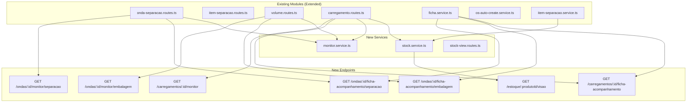
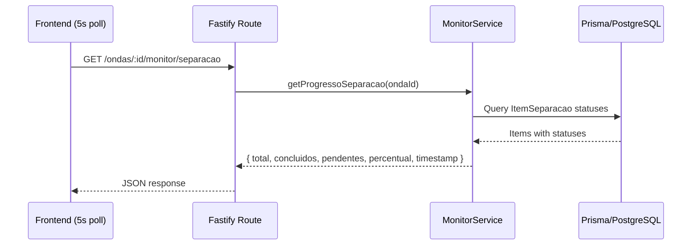
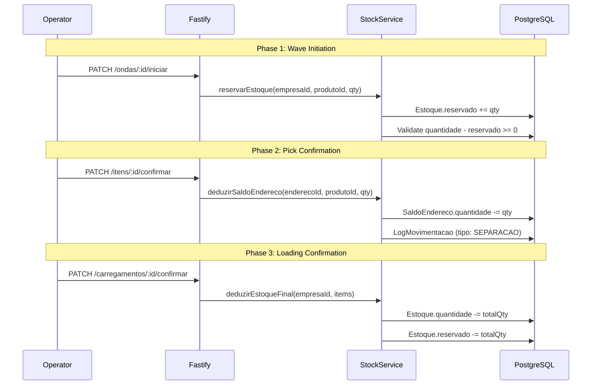
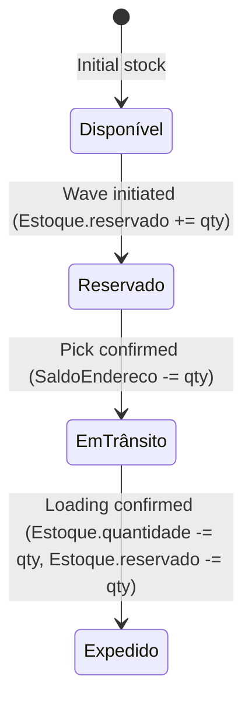

# Design Document — WMS Outbound Flow Evolution

## Overview

This design extends the existing outbound flow (Separação → Embalagem → Carregamento) with four capabilities:

1. **Fichas de Acompanhamento** — Printable tracking sheets for manual-mode operations at each stage, generated by new methods in `FichaService`.
2. **Monitores de Supervisão** — Read-only monitoring endpoints returning progress summaries for each stage, designed for 5-second polling from the frontend.
3. **Sincronização de OS** — Hooks embedded in existing route handlers that automatically transition `OrdemServicoWms` status (ABERTO → EXECUTANDO → CONCLUIDO) as operations progress.
4. **Gestão de Saldo Granular** — Stock reservation on wave initiation, address-level deduction on pick confirmation, aggregate deduction on loading confirmation, and a stock view API with status breakdown (disponível, reservado, em trânsito).

All changes extend existing modules. No new Prisma models are required — the existing `Estoque`, `SaldoEndereco`, `LogMovimentacao`, `OrdemServicoWms`, and `FichaOperacional` models already support the needed fields.

### Design Decisions

- **Polling over WebSockets**: Monitoring endpoints return timestamped snapshots. The frontend polls at 5s intervals. This avoids WebSocket infrastructure complexity and is sufficient for supervisor dashboards.
- **Hooks in existing routes**: OS synchronization is embedded directly in the existing `onda-separacao.routes.ts`, `volume.routes.ts`, and `carregamento.routes.ts` handlers rather than using event emitters. This keeps the codebase simple and transactional.
- **Stock deduction timing**: Address-level deduction (`SaldoEndereco`) happens at pick confirmation (already implemented in `confirmarItem`). Aggregate deduction (`Estoque.quantidade` and `Estoque.reservado`) happens at carregamento confirmation. This two-phase approach matches the physical flow: items leave the shelf at picking, but leave the warehouse at loading.
- **Existing `confirmarItem` already handles stock**: The current `item-separacao.service.ts` already decrements both `SaldoEndereco` and `Estoque` at pick confirmation. The design adjusts this to only decrement `SaldoEndereco` at pick, deferring `Estoque.quantidade` deduction to carregamento confirmation. `Estoque.reservado` is decremented at carregamento confirmation as well.

## Architecture



### Request Flow — Monitoring



### Request Flow — Stock Reservation & Deduction



## Components and Interfaces

### 1. FichaService — New Tracking Sheet Methods

Extend `src/modules/ficha-operacional/ficha.service.ts` with three new methods:

```typescript
// New method signatures in FichaService
class FichaService {
  // Existing methods remain unchanged...

  /**
   * Generates tracking sheet for separação with route-optimized items,
   * barcodes from SKU, checkbox column, and employee header.
   */
  gerarHtmlFichaAcompanhamentoSeparacao(
    onda: OndaComItensEnriquecidos
  ): string;

  /**
   * Generates tracking sheet for embalagem grouped by volume,
   * with pending items section and editable dimension fields.
   */
  gerarHtmlFichaAcompanhamentoEmbalagem(
    onda: OndaComVolumesEPendentes
  ): string;

  /**
   * Generates tracking sheet for carregamento with checkbox column,
   * vehicle/dock header, and weight/count summary footer.
   */
  gerarHtmlFichaAcompanhamentoCarregamento(
    carregamento: CarregamentoComVolumesCompleto
  ): string;
}
```

New composite types needed:

```typescript
interface ItemSeparacaoEnriquecido extends ItemSeparacao {
  produto: Pick<Produto, 'id' | 'codigo' | 'nome' | 'unidade'> | null;
  enderecoOrigem: Pick<Endereco, 'id' | 'enderecoCompleto'> | null;
  codigoBarra: string | null; // from SKU
}

interface OndaComItensEnriquecidos extends OndaSeparacao {
  ordens: (OrdemSeparacao & {
    itens: ItemSeparacaoEnriquecido[];
    funcionario?: { nome: string } | null;
  })[];
}

interface OndaComVolumesEPendentes extends OndaComVolumes {
  itensPendentes: ItemSeparacaoEnriquecido[];
}

interface CarregamentoComVolumesCompleto extends CarregamentoComVolumes {
  // Already has doca, transportadora, volumes with items
}
```

### 2. MonitorService — New Service

New file: `src/modules/monitor/monitor.service.ts`

```typescript
interface ProgressoSeparacao {
  ondaId: string;
  total: number;
  concluidos: number;
  pendentes: number;
  emAndamento: number;
  percentual: number;
  itens: ItemMonitorSeparacao[];
  timestamp: string; // ISO 8601
}

interface ItemMonitorSeparacao {
  id: string;
  produtoNome: string;
  enderecoOrigem: string;
  quantidadeSolicitada: number;
  quantidadeSeparada: number;
  status: 'Pendente' | 'Em Andamento' | 'Concluído';
}

interface ProgressoEmbalagem {
  ondaId: string;
  totalItensSeparados: number;
  itensEmbalados: number;
  itensPendentes: number;
  percentual: number;
  volumes: VolumeMonitor[];
  timestamp: string;
}

interface VolumeMonitor {
  volumeId: string;
  codigo: number;
  tipo: string;
  totalItens: number;
  percentualConcluido: number;
}

interface ProgressoCarregamento {
  carregamentoId: string;
  totalVolumes: number;
  volumesCarregados: number;
  volumesPendentes: number;
  percentual: number;
  volumes: VolumeCarregamentoMonitor[];
  timestamp: string;
}

interface VolumeCarregamentoMonitor {
  sequencia: number;
  volumeCodigo: number;
  tipo: string;
  pesoKg: number;
  status: 'Pendente' | 'Concluído';
}

class MonitorService {
  async getProgressoSeparacao(ondaId: string): Promise<ProgressoSeparacao>;
  async getProgressoEmbalagem(ondaId: string): Promise<ProgressoEmbalagem>;
  async getProgressoCarregamento(carregamentoId: string): Promise<ProgressoCarregamento>;
}
```

### 3. StockService — New Service

New file: `src/modules/estoque/stock.service.ts`

```typescript
interface StockBreakdown {
  produtoId: string;
  empresaId: string;
  quantidadeTotal: number;
  reservado: number;
  emTransito: number;
  disponivel: number;
}

class StockService {
  /**
   * Validates and reserves stock for a wave.
   * Increments Estoque.reservado. Throws if insufficient available stock.
   */
  async reservarEstoqueOnda(
    empresaId: string,
    itens: { produtoId: string; quantidade: number }[],
    tx?: PrismaTransaction
  ): Promise<void>;

  /**
   * Deducts from SaldoEndereco and logs the movement.
   * Called at pick confirmation. Does NOT touch Estoque.quantidade.
   */
  async deduzirSaldoEndereco(
    empresaId: string,
    enderecoId: string,
    produtoId: string,
    quantidade: number,
    usuarioId: string,
    tx?: PrismaTransaction
  ): Promise<void>;

  /**
   * Final deduction at carregamento confirmation.
   * Decrements Estoque.quantidade and Estoque.reservado.
   */
  async deduzirEstoqueFinal(
    empresaId: string,
    itens: { produtoId: string; quantidade: number }[],
    tx?: PrismaTransaction
  ): Promise<void>;

  /**
   * Returns stock breakdown for a product.
   */
  async getVisaoEstoque(
    empresaId: string,
    produtoId: string
  ): Promise<StockBreakdown>;
}
```

### 4. OS Synchronization Hooks

Embedded in existing route handlers (no new files):

| Trigger | Location | OS Action |
|---------|----------|-----------|
| Onda status → EM_SEPARACAO | `onda-separacao.routes.ts` PATCH `/:id/iniciar` | Find/create OS SEPARACAO → EXECUTANDO, set horaInicio, funcionarioId |
| All items SEPARADO | `item-separacao.service.ts` `confirmarItem` | Find OS SEPARACAO → CONCLUIDO, set horaFim, calc tempoTotal |
| First volume created | `volume.routes.ts` POST `/` | Find/create OS EMBALAGEM → EXECUTANDO, set horaInicio |
| Onda status → EMBALADA | `volume.routes.ts` POST `/:id/itens` | Find OS EMBALAGEM → CONCLUIDO, set horaFim, calc tempoTotal |
| First volume loaded | `carregamento.routes.ts` POST `/:id/carregar-scanner` | Find OS CARREGAMENTO → EXECUTANDO, set horaInicio |
| Carregamento → CONCLUIDO | `carregamento.routes.ts` PATCH `/:id/confirmar` | Find OS CARREGAMENTO → CONCLUIDO, set horaFim, calc tempoTotal |

### 5. New Route Registrations

Add to `src/server.ts`:

```typescript
// Monitoring endpoints (added to existing route files)
// GET /ondas/:id/monitor/separacao    → onda-separacao.routes.ts
// GET /ondas/:id/monitor/embalagem    → onda-separacao.routes.ts
// GET /ondas/:id/ficha-acompanhamento/separacao  → onda-separacao.routes.ts
// GET /ondas/:id/ficha-acompanhamento/embalagem  → onda-separacao.routes.ts

// GET /carregamentos/:id/monitor      → carregamento.routes.ts
// GET /carregamentos/:id/ficha-acompanhamento → carregamento.routes.ts

// New stock view route file
// GET /estoque/:produtoId/visao       → stock-view.routes.ts
import { stockViewRoutes } from './modules/estoque/stock-view.routes'
app.register(stockViewRoutes, { prefix: '/estoque' })
```

## Data Models

No new Prisma models are needed. The design uses existing models:

### Existing Models Used

| Model | Role in This Feature |
|-------|---------------------|
| `Estoque` | `reservado` field tracks reserved qty; `quantidade` is total stock |
| `SaldoEndereco` | Address-level balance, decremented at pick confirmation |
| `LogMovimentacao` | Audit trail for stock movements; new tipo `SEPARACAO` added |
| `OrdemServicoWms` | OS records with `horaInicio`, `horaFim`, `status`, `funcionarioId` |
| `OsFuncionarioWms` | Employee assignment to OS with time tracking |
| `FichaOperacional` | Tracking sheet records with barcode and status |
| `OndaSeparacao` | Wave with status transitions |
| `ItemSeparacao` | Pick items with status and quantities |
| `Volume` / `ItemVolume` | Packed units |
| `Carregamento` / `CarregamentoVolume` | Loading records |
| `Sku` | Product barcode (`codigoBarra`) for tracking sheets |

### Stock State Machine



### Calculated Fields

- **disponível** = `Estoque.quantidade` - `Estoque.reservado` - `emTransito`
- **emTransito** = SUM of `quantidadeSeparada` for all `ItemSeparacao` with status IN (`SEPARADO`, `SEPARADO_PARCIAL`) whose parent `OndaSeparacao.status` NOT IN (`CONCLUIDA`, `CANCELADA`)
- **reservado** = `Estoque.reservado` (maintained by reservation/deduction logic)

## Correctness Properties

*A property is a characteristic or behavior that should hold true across all valid executions of a system — essentially, a formal statement about what the system should do. Properties serve as the bridge between human-readable specifications and machine-verifiable correctness guarantees.*

### Property 1: Separação tracking sheet contains all required item fields

*For any* OndaSeparacao with one or more ItemSeparacao records, the generated separação tracking sheet HTML SHALL contain, for every item: the product code, product name, source address (enderecoCompleto), quantity to pick, unit of measure, and the SKU barcode when the product has an associated SKU with codigoBarra. The HTML SHALL also contain a header with the onda number, date, assigned employee name, and total items count.

**Validates: Requirements 1.1, 1.3, 1.4**

### Property 2: Separação tracking sheet orders items by collection route

*For any* set of ItemSeparacao records with associated addresses, the generated separação tracking sheet SHALL render items in ascending order of codigoRua, then codigoPredio, then codigoNivel.

**Validates: Requirements 1.2**

### Property 3: Embalagem tracking sheet groups items by volume with required fields

*For any* OndaSeparacao with one or more Volumes, the generated embalagem tracking sheet HTML SHALL group items by volume, and each volume section SHALL contain the volume sequential code, type (CAIXA/PALETE/FARDO), and for each ItemVolume: the product code, product name, quantity, and barcode.

**Validates: Requirements 2.1, 2.3**

### Property 4: Embalagem tracking sheet lists pending items correctly

*For any* OndaSeparacao where some separated items are not yet assigned to volumes, the generated embalagem tracking sheet SHALL include a "Pendentes de Embalagem" section listing exactly those unassigned items with their product and quantity information. Items fully assigned to volumes SHALL NOT appear in the pending section.

**Validates: Requirements 2.4**

### Property 5: Carregamento tracking sheet ordered by sequence with correct totals

*For any* Carregamento with one or more CarregamentoVolume records, the generated tracking sheet HTML SHALL list volumes in ascending sequência order, include the vehicle plate, dock description, and transportadora name in the header, and display a footer where total weight equals the sum of individual volume weights and total count equals the number of volumes.

**Validates: Requirements 3.1, 3.2, 3.4**

### Property 6: Separação monitor returns correct progress counts

*For any* OndaSeparacao with ItemSeparacao records in mixed statuses, the separação monitoring endpoint SHALL return: total equal to the count of all items, concluidos equal to the count of items with status SEPARADO or SEPARADO_PARCIAL, pendentes equal to the count of items with status PENDENTE, and percentual equal to round(concluidos / total * 100). Each item SHALL include product name, source address, quantities, and a mapped status (Pendente/Em Andamento/Concluído).

**Validates: Requirements 4.1, 4.2**

### Property 7: Embalagem monitor returns correct progress counts

*For any* OndaSeparacao with separated items and volumes, the embalagem monitoring endpoint SHALL return: totalItensSeparados equal to the count of items with status SEPARADO or SEPARADO_PARCIAL, itensEmbalados equal to the count of items fully linked to volumes, itensPendentes equal to totalItensSeparados minus itensEmbalados, and each volume SHALL include code, type, item count, and completion percentage.

**Validates: Requirements 5.1, 5.2**

### Property 8: Carregamento monitor returns correct progress counts

*For any* Carregamento with CarregamentoVolume records, the carregamento monitoring endpoint SHALL return: totalVolumes equal to the count of all CarregamentoVolume records, volumesCarregados equal to the count where carregadoEm is not null, volumesPendentes equal to totalVolumes minus volumesCarregados, and each volume SHALL include sequence, code, type, weight, and status (Pendente/Concluído).

**Validates: Requirements 6.1, 6.2**

### Property 9: OS tempoTotal calculation

*For any* two timestamps horaInicio and horaFim where horaFim >= horaInicio, the calculated tempoTotal SHALL equal round((horaFim - horaInicio) / 60000) minutes.

**Validates: Requirements 7.3, 8.3, 9.3**

### Property 10: Stock reservation validates and increments correctly

*For any* set of products with known Estoque records, when reserving stock for a wave, the system SHALL increment Estoque.reservado by the requested quantity per product only when Estoque.quantidade minus current Estoque.reservado is greater than or equal to the requested quantity. When available stock is insufficient, the system SHALL reject the reservation and leave Estoque.reservado unchanged.

**Validates: Requirements 10.1, 10.3, 10.4**

### Property 11: Address balance deduction validates and decrements correctly

*For any* SaldoEndereco record and pick confirmation quantity, the system SHALL decrement SaldoEndereco.quantidade by quantidadeSeparada only when the resulting value is greater than or equal to zero. When the deduction would result in a negative balance, the system SHALL reject the confirmation and leave SaldoEndereco.quantidade unchanged.

**Validates: Requirements 11.1, 11.3**

### Property 12: Final stock deduction at carregamento confirmation

*For any* Carregamento being confirmed as CONCLUIDO, the system SHALL decrement Estoque.quantidade and Estoque.reservado by the total quantity of all items across all loaded volumes, only when Estoque.quantidade minus the deduction amount is greater than or equal to zero. When the deduction would result in negative Estoque.quantidade, the system SHALL reject the confirmation.

**Validates: Requirements 12.1, 12.2, 12.3, 12.4**

### Property 13: Stock view breakdown consistency

*For any* product with an Estoque record, the stock view SHALL return: quantidadeTotal equal to Estoque.quantidade, reservado equal to Estoque.reservado, emTransito equal to the sum of quantidadeSeparada for all ItemSeparacao with status IN (SEPARADO, SEPARADO_PARCIAL) whose parent OndaSeparacao.status is NOT IN (CONCLUIDA, CANCELADA), and disponivel equal to quantidadeTotal minus reservado minus emTransito.

**Validates: Requirements 13.1, 13.2**

## Error Handling

### Stock Operations

| Error Condition | HTTP Status | Message | Recovery |
|----------------|-------------|---------|----------|
| Insufficient available stock for reservation | 422 | `Estoque insuficiente para produto {codigo}. Disponível: {qty}, Solicitado: {qty}` | User must reduce wave quantity or wait for stock replenishment |
| SaldoEndereco would become negative on pick | 422 | `Saldo insuficiente no endereço {endereco}. Disponível: {qty}, Solicitado: {qty}` | User should check alternative addresses or report discrepancy |
| Estoque.quantidade would become negative on loading | 422 | `Inconsistência de estoque para produto {codigo}. Estoque: {qty}, Dedução: {qty}` | Requires inventory reconciliation before proceeding |
| Product not found in Estoque table | 422 | `Produto {codigo} não possui registro de estoque` | Product must be stocked before wave creation |

### OS Synchronization

| Error Condition | Behavior |
|----------------|----------|
| OS not found for operation | Silently skip (logged via console.warn). OS sync is non-blocking. |
| OS already in target status | No-op. Idempotent transitions. |
| Multiple OS records for same onda/operation | Use most recent (orderBy criadoEm desc). |

### Monitoring Endpoints

| Error Condition | HTTP Status | Message |
|----------------|-------------|---------|
| Onda not found | 404 | `Onda não encontrada` |
| Carregamento not found | 404 | `Carregamento não encontrado` |
| Onda belongs to different empresa | 404 | `Onda não encontrada` (security: don't reveal existence) |

### Tracking Sheet Generation

| Error Condition | HTTP Status | Message |
|----------------|-------------|---------|
| Onda has no items | 422 | `Onda não possui itens para gerar ficha` |
| Carregamento has no volumes | 422 | `Carregamento não possui volumes para gerar ficha` |

## Testing Strategy

### Property-Based Tests (fast-check)

The project uses TypeScript with Vitest. Property-based tests will use [fast-check](https://github.com/dubzzz/fast-check) with a minimum of 100 iterations per property.

**Testable pure logic extracted into service methods:**

| Property | Target Function | Generator Strategy |
|----------|----------------|-------------------|
| P1: Separação tracking sheet fields | `FichaService.gerarHtmlFichaAcompanhamentoSeparacao` | Random OndaComItensEnriquecidos with 1-20 items, random product/address data, optional SKU barcodes |
| P2: Collection route ordering | `FichaService.gerarHtmlFichaAcompanhamentoSeparacao` | Random items with varying codigoRua/codigoPredio/codigoNivel values |
| P3: Embalagem tracking sheet grouping | `FichaService.gerarHtmlFichaAcompanhamentoEmbalagem` | Random ondas with 1-5 volumes, 1-10 items per volume |
| P4: Pending items section | `FichaService.gerarHtmlFichaAcompanhamentoEmbalagem` | Random ondas with mixed assigned/unassigned items |
| P5: Carregamento tracking sheet | `FichaService.gerarHtmlFichaAcompanhamentoCarregamento` | Random carregamentos with 1-10 volumes, shuffled sequences |
| P6: Separação monitor counts | `MonitorService.getProgressoSeparacao` | Random item sets with mixed PENDENTE/SEPARADO/SEPARADO_PARCIAL statuses |
| P7: Embalagem monitor counts | `MonitorService.getProgressoEmbalagem` | Random separated items with partial volume assignments |
| P8: Carregamento monitor counts | `MonitorService.getProgressoCarregamento` | Random CarregamentoVolume sets with mixed loaded/pending states |
| P9: tempoTotal calculation | Pure function `calcularTempoTotal` | Random timestamp pairs where end >= start |
| P10: Stock reservation | `StockService.reservarEstoqueOnda` | Random Estoque states and reservation amounts (both valid and invalid) |
| P11: Address balance deduction | `StockService.deduzirSaldoEndereco` | Random SaldoEndereco values and deduction amounts |
| P12: Final stock deduction | `StockService.deduzirEstoqueFinal` | Random Estoque states and carregamento item totals |
| P13: Stock view breakdown | `StockService.getVisaoEstoque` | Random Estoque records with varying reservado, and ItemSeparacao records in various states |

**Tag format:** `Feature: wms-outbound-flow-evolution, Property {N}: {title}`

### Unit Tests (Vitest)

Example-based tests for specific scenarios:

- Tracking sheet checkbox column presence (Req 1.5, 3.3)
- Monitoring timestamp format validation (Req 4.3, 5.3, 6.3)
- Stock view single response structure (Req 13.3)
- Embalagem editable dimension fields presence (Req 2.2)

### Integration Tests

OS synchronization lifecycle tests (Req 7.1, 7.2, 8.1, 8.2, 9.1, 9.2):

- Full separação lifecycle: initiate wave → confirm all items → verify OS transitions
- Full embalagem lifecycle: create first volume → pack all items → verify OS transitions
- Full carregamento lifecycle: load first volume → load all volumes → verify OS transitions
- LogMovimentacao creation on pick confirmation (Req 11.2)

### Smoke Tests

- Monitoring reflects status changes without caching delay (Req 4.4, 5.4, 6.4)
- SaldoEndereco unchanged during EM_SEPARACAO before any confirmation (Req 10.2)

