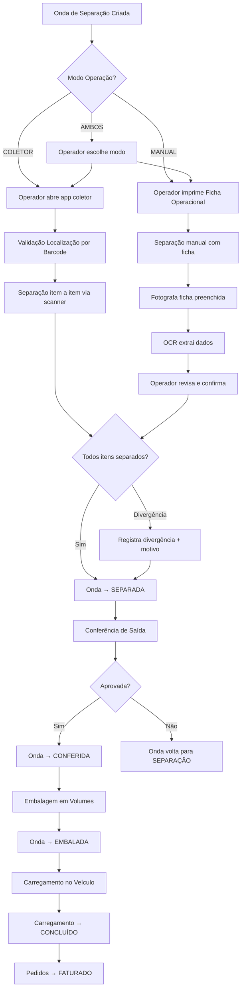
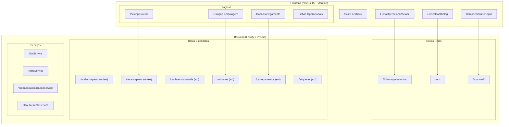
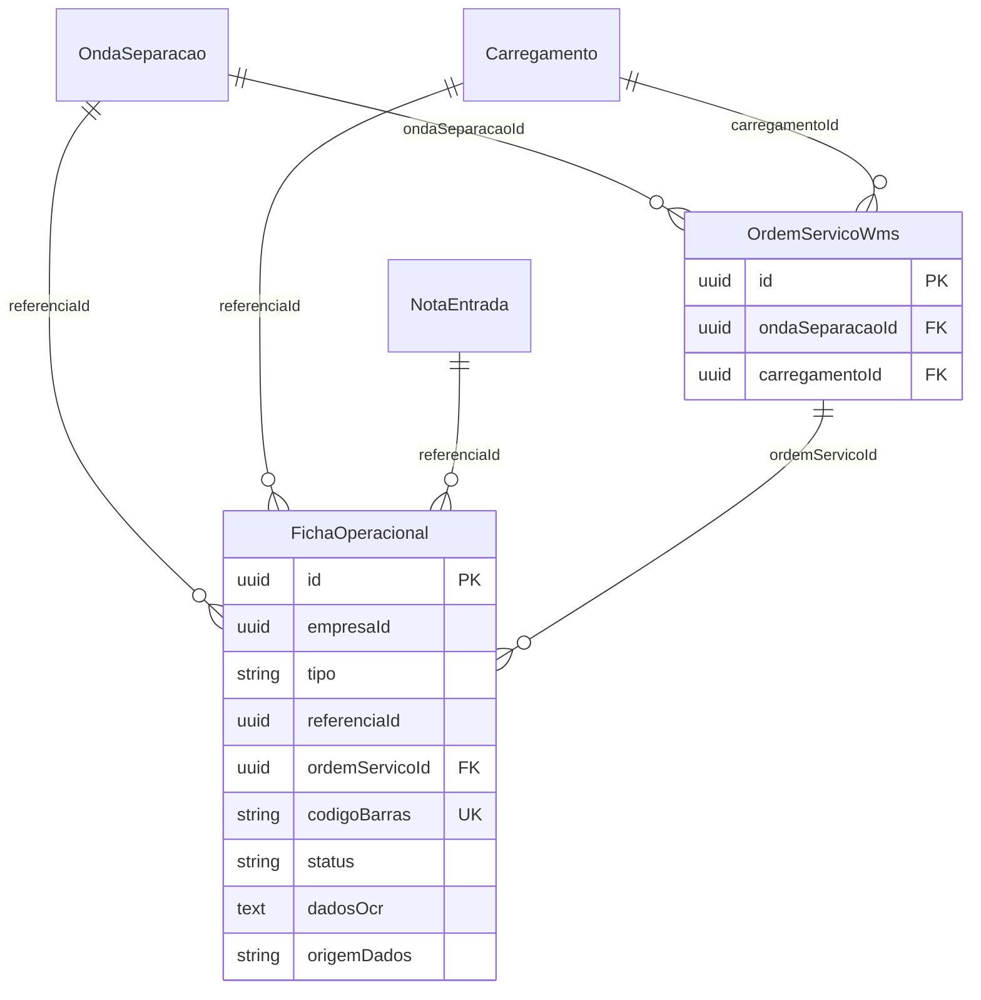

# Design — Operações Outbound WMS (Dual-Mode)

## Visão Geral

Este design detalha a implementação do módulo de operações outbound (saída) do VisioFab WMS, cobrindo o fluxo completo **Separação → Conferência → Embalagem → Carregamento** com suporte dual-mode: **Modo Manual** (fichas impressas + OCR) e **Modo Coletor** (leitura de código de barras em tempo real).

A arquitetura se integra ao stack existente (Fastify + Prisma + PostgreSQL no backend, Next.js 15 + Mantine UI + TanStack Query no frontend) e estende os módulos já implementados (`ondas-separacao`, `itens-separacao`, `conferencias-saida`, `volumes`, `carregamentos`, `etiquetas`, `os-wms`) com novas rotas, componentes e modelos.

### Decisões Arquiteturais Chave

1. **Dual-mode via parâmetro `WMS_MODO_OPERACAO`**: Configurável por empresa (`MANUAL`, `COLETOR`, `AMBOS`), lido do model `Parametro` existente.
2. **OCR como serviço abstrato**: Interface `IOcrService` com implementação placeholder (mock) e futura integração com Google Cloud Vision API. Não será implementado Tesseract.js no servidor — o OCR será chamado via API REST externa.
3. **Fichas Operacionais**: Novo model `FichaOperacional` para rastrear fichas impressas, vinculação com OS e resultados OCR.
4. **Componente reutilizável de scanner**: `<BarcodeScannerInput>` usado em todas as operações do modo coletor.
5. **Feedback sensorial**: Web Audio API para sons + CSS animations para feedback visual (verde/vermelho/amarelo).
6. **SSE para notificações em tempo real**: Reutiliza o endpoint `/api/eventos` existente para notificar progresso de operações.

---

## Arquitetura

### Diagrama de Fluxo Outbound



### Diagrama de Componentes



---

## Componentes e Interfaces

### 1. Backend — Novas Rotas

#### 1.1 `/api/fichas-operacionais` — Fichas Operacionais

| Método | Rota | Descrição |
|--------|------|-----------|
| `POST` | `/` | Gera ficha operacional (separação, embalagem, carregamento, endereçamento) |
| `GET` | `/:id` | Retorna dados da ficha com status OCR |
| `GET` | `/:id/html` | Retorna HTML renderizado para impressão |
| `GET` | `/:id/zpl` | Retorna ZPL para impressora térmica |
| `PATCH` | `/:id/confirmar` | Confirma dados da ficha (pós-OCR ou manual) |

**Schema de criação:**
```typescript
const criarFichaSchema = z.object({
  tipo: z.enum(['SEPARACAO', 'EMBALAGEM', 'CARREGAMENTO', 'ENDERECAMENTO', 'CONFERENCIA']),
  referenciaId: z.string().uuid(), // ondaSeparacaoId, carregamentoId, notaEntradaId
  ordemServicoId: z.string().uuid().optional(),
})
```

#### 1.2 `/api/ocr` — Processamento OCR

| Método | Rota | Descrição |
|--------|------|-----------|
| `POST` | `/processar` | Recebe imagem e retorna dados extraídos |
| `GET` | `/resultado/:fichaId` | Retorna resultado OCR de uma ficha |

**Schema de processamento:**
```typescript
const processarOcrSchema = z.object({
  fichaOperacionalId: z.string().uuid(),
  imagem: z.string(), // base64 da imagem
  formato: z.enum(['JPEG', 'PNG', 'PDF']),
})

// Resposta
interface OcrResultado {
  fichaOperacionalId: string
  campos: Array<{
    nome: string
    valor: string
    confianca: number // 0-100
    necessitaRevisao: boolean // true se confiança < 80
  }>
  imagemProcessada: boolean
}
```

#### 1.3 `/api/scanner` — Operações via Scanner (Modo Coletor)

| Método | Rota | Descrição |
|--------|------|-----------|
| `POST` | `/validar-localizacao` | Valida barcode de endereço vs esperado |
| `POST` | `/validar-produto` | Valida barcode de produto vs item esperado |
| `POST` | `/confirmar-separacao` | Confirma item separado via scanner |
| `POST` | `/confirmar-embalagem` | Vincula item ao volume via scanner |
| `POST` | `/confirmar-carregamento` | Confirma volume carregado via scanner |

**Schema de validação de localização:**
```typescript
const validarLocalizacaoSchema = z.object({
  ordemServicoId: z.string().uuid(),
  barcodeEscaneado: z.string().min(1),
  enderecoEsperadoId: z.string().uuid(),
})

// Resposta
interface ValidacaoLocalizacaoResult {
  valido: boolean
  enderecoEsperado: string
  enderecoEscaneado: string
  timestamp: string
  mensagem?: string // mensagem de erro se inválido
}
```

**Schema de validação de produto:**
```typescript
const validarProdutoSchema = z.object({
  barcodeEscaneado: z.string().min(1),
  itemSeparacaoId: z.string().uuid(),
})

// Resposta
interface ValidacaoProdutoResult {
  valido: boolean
  produtoEsperado: { id: string; nome: string; codigo: string; ean: string | null }
  barcodeEscaneado: string
  mensagem?: string
}
```

### 2. Backend — Extensões de Rotas Existentes

#### 2.1 `/api/ondas-separacao` (extensões)

| Método | Rota | Descrição |
|--------|------|-----------|
| `GET` | `/:id/rota-coleta` | Retorna itens ordenados por rota otimizada (rua→prédio→nível) |
| `POST` | `/:id/gerar-ficha` | Gera ficha operacional de separação para a onda |

#### 2.2 `/api/itens-separacao` (extensões)

| Método | Rota | Descrição |
|--------|------|-----------|
| `POST` | `/:id/confirmar-scanner` | Confirma separação via scanner com validação de produto |
| `GET` | `/:id/enderecos-alternativos` | Sugere endereços alternativos quando saldo insuficiente |

#### 2.3 `/api/conferencias-saida` (extensões)

| Método | Rota | Descrição |
|--------|------|-----------|
| `POST` | `/:id/conferir-scanner` | Confere item via scanner no modo coletor |
| `POST` | `/:id/gerar-ficha` | Gera ficha de conferência para modo manual |

#### 2.4 `/api/volumes` (extensões)

| Método | Rota | Descrição |
|--------|------|-----------|
| `POST` | `/:id/embalar-scanner` | Vincula item ao volume via scanner |
| `GET` | `/pendentes-embalagem/:ondaId` | Lista itens pendentes de embalagem por pedido |

#### 2.5 `/api/carregamentos` (extensões)

| Método | Rota | Descrição |
|--------|------|-----------|
| `POST` | `/:id/carregar-scanner` | Confirma volume carregado via scanner |
| `GET` | `/:id/romaneio` | Retorna dados completos do romaneio |
| `GET` | `/:id/romaneio/html` | Retorna HTML do romaneio para impressão |
| `GET` | `/:id/romaneio/pdf` | Retorna PDF do romaneio |

#### 2.6 `/api/etiquetas` (extensões)

| Método | Rota | Descrição |
|--------|------|-----------|
| `GET` | `/volume/:id/html` | Retorna HTML da etiqueta de volume |
| `GET` | `/volume/:id/zpl` | Retorna ZPL da etiqueta de volume |

### 3. Frontend — Componentes Reutilizáveis

#### 3.1 `<BarcodeScannerInput>`

Componente central para leitura de código de barras no modo coletor.

```typescript
interface BarcodeScannerInputProps {
  onScan: (barcode: string) => Promise<ScanResult>
  placeholder?: string
  autoFocus?: boolean // default: true
  disabled?: boolean
  label?: string
}

interface ScanResult {
  status: 'success' | 'error' | 'warning'
  message: string
  data?: Record<string, unknown>
}
```

**Comportamento:**
- Campo `<TextInput>` com `autoFocus` e `ref` para retorno automático de foco
- Detecta leitura de scanner por velocidade de digitação (< 50ms entre caracteres)
- Ao detectar Enter ou timeout, dispara `onScan`
- Limpa o campo após cada leitura
- Integra com `<ScanFeedback>` para feedback visual/sonoro

#### 3.2 `<ScanFeedback>`

Componente de feedback sensorial para operações de scanner.

```typescript
interface ScanFeedbackProps {
  status: 'idle' | 'success' | 'error' | 'warning'
  message?: string
  duration?: number // ms, default: 2000
}
```

**Comportamento:**
- **Sucesso**: Flash verde + som de "beep" curto (Web Audio API, 800Hz, 150ms)
- **Erro**: Flash vermelho + som de "buzz" (300Hz, 300ms) + mensagem descritiva
- **Aviso**: Flash amarelo + som de "ding" (600Hz, 200ms) + mensagem
- Animação CSS `@keyframes` para flash de cor no container

#### 3.3 `<FichaOperacionalViewer>`

Componente para visualizar e imprimir fichas operacionais.

```typescript
interface FichaOperacionalViewerProps {
  fichaId: string
  onPrint?: () => void
}
```

#### 3.4 `<OcrUploadDialog>`

Modal para upload de imagem de ficha preenchida e revisão de dados OCR.

```typescript
interface OcrUploadDialogProps {
  fichaId: string
  opened: boolean
  onClose: () => void
  onConfirm: (dadosRevisados: Record<string, string>) => void
}
```

**Comportamento:**
- Upload de imagem (JPEG, PNG, PDF)
- Exibe preview da imagem
- Chama `/api/ocr/processar`
- Exibe campos extraídos com indicador de confiança
- Campos com confiança < 80% destacados em amarelo para revisão
- Botão "Confirmar" envia dados revisados

### 4. Frontend — Páginas

#### 4.1 `/picking/[ondaId]/coletor` — Picking Modo Coletor

Página fullscreen otimizada para dispositivos móveis/coletores.

**Layout:**
- Header: número da onda, progresso (X/Y itens), timer
- Corpo: item atual com endereço de origem, produto, quantidade
- `<BarcodeScannerInput>` para validação de localização e produto
- `<ScanFeedback>` para feedback
- Footer: botões de divergência e navegação

#### 4.2 `/picking/[ondaId]/manual` — Picking Modo Manual

Página para operação manual com formulário de digitação ou upload OCR.

**Layout:**
- Lista de itens com campos editáveis para quantidade separada
- Botão "Imprimir Ficha" → abre ficha HTML em nova aba
- Botão "Digitalizar Ficha" → abre `<OcrUploadDialog>`
- Campos pré-preenchidos pelo OCR com indicadores de confiança

#### 4.3 `/expedicao/embalagem/[ondaId]` — Estação de Embalagem

**Layout:**
- Painel esquerdo: lista de itens pendentes de embalagem (agrupados por pedido)
- Painel direito: volume ativo com itens vinculados
- `<BarcodeScannerInput>` para vincular itens ao volume
- Formulário de peso/dimensões
- Botão "Finalizar Volume" → gera etiqueta

#### 4.4 `/expedicao/carregamento/[carregamentoId]` — Doca de Carregamento

**Layout:**
- Header: dados do veículo, doca, progresso
- Lista de volumes com sequência e status (carregado/pendente)
- `<BarcodeScannerInput>` para confirmar volumes
- Aviso de sequência incorreta (amarelo)
- Botão "Imprimir Romaneio"
- Botão "Concluir Carregamento"

#### 4.5 `/wms/fichas-operacionais` — Gestão de Fichas

**Layout:**
- Tabela de fichas com filtros (tipo, status, data)
- Ações: imprimir, digitalizar, ver resultado OCR

### 5. Serviços Backend

#### 5.1 `OcrService` (Interface Abstrata)

```typescript
interface IOcrService {
  processarImagem(imagem: Buffer, formato: 'JPEG' | 'PNG' | 'PDF'): Promise<OcrCampo[]>
}

interface OcrCampo {
  nome: string
  valor: string
  confianca: number
  boundingBox?: { x: number; y: number; width: number; height: number }
}

// Implementação placeholder (mock)
class MockOcrService implements IOcrService {
  async processarImagem(imagem: Buffer): Promise<OcrCampo[]> {
    // Retorna campos vazios para preenchimento manual
    return []
  }
}

// Futura implementação
class GoogleVisionOcrService implements IOcrService {
  async processarImagem(imagem: Buffer, formato: string): Promise<OcrCampo[]> {
    // Chama Google Cloud Vision API
    // POST https://vision.googleapis.com/v1/images:annotate
  }
}
```

**Decisão**: Usar interface abstrata permite trocar a implementação sem alterar rotas. O mock permite que o fluxo manual funcione sem OCR real — o operador preenche manualmente os campos.

#### 5.2 `FichaService`

Responsável por gerar HTML e ZPL das fichas operacionais.

```typescript
class FichaService {
  gerarHtmlSeparacao(onda: OndaComItens): string
  gerarHtmlEmbalagem(onda: OndaComVolumes): string
  gerarHtmlCarregamento(carregamento: CarregamentoComVolumes): string
  gerarHtmlEnderecamento(nota: NotaComItens): string
  gerarHtmlConferencia(conferencia: ConferenciaComItens): string
  gerarZplFicha(ficha: FichaOperacional): string
  gerarRomaneioHtml(carregamento: CarregamentoCompleto): string
  gerarRomaneioPdf(carregamento: CarregamentoCompleto): Buffer
}
```

#### 5.3 `ValidacaoLocalizacaoService`

```typescript
class ValidacaoLocalizacaoService {
  async validar(
    barcodeEscaneado: string,
    enderecoEsperadoId: string,
    ordemServicoId: string,
    empresaId: string,
    usuarioId: string
  ): Promise<ValidacaoLocalizacaoResult>
}
```

Registra cada validação no `AuditLog` com entidade `VALIDACAO_LOCALIZACAO`.

#### 5.4 `OsAutoCreateService`

Cria automaticamente OS para operações outbound.

```typescript
class OsAutoCreateService {
  async criarOsSeparacao(empresaId: string, ondaSeparacaoId: string): Promise<OrdemServicoWms>
  async criarOsEmbalagem(empresaId: string, ondaSeparacaoId: string): Promise<OrdemServicoWms>
  async criarOsCarregamento(empresaId: string, carregamentoId: string): Promise<OrdemServicoWms>
}
```

---

## Modelos de Dados

### Novo Model: `FichaOperacional`

```prisma
model FichaOperacional {
  id                String   @id @default(uuid())
  empresaId         String   @map("empresa_id")
  tipo              String   @db.VarChar(20) // SEPARACAO, EMBALAGEM, CARREGAMENTO, ENDERECAMENTO, CONFERENCIA
  referenciaId      String   @map("referencia_id") // ondaSeparacaoId, carregamentoId, notaEntradaId
  ordemServicoId    String?  @map("ordem_servico_id")
  codigoBarras      String   @unique @db.VarChar(30) @map("codigo_barras") // código único para vincular ficha física à digital
  status            String   @default("GERADA") @db.VarChar(20) // GERADA, IMPRESSA, DIGITALIZADA, CONFIRMADA
  dadosOcr          String?  @db.Text @map("dados_ocr") // JSON com resultado OCR
  origemDados       String?  @db.VarChar(10) @map("origem_dados") // MANUAL, OCR, SCANNER
  criadoEm          DateTime @default(now()) @map("criado_em")
  atualizadoEm      DateTime @updatedAt @map("atualizado_em")

  @@index([empresaId, tipo])
  @@index([referenciaId])
  @@map("ficha_operacional")
}
```

### Extensão do Model `OrdemServicoWms`

O model existente já suporta os campos necessários. Adicionamos vinculação com `ondaSeparacaoId` e `carregamentoId`:

```prisma
// Adicionar ao OrdemServicoWms existente:
  ondaSeparacaoId String?  @map("onda_separacao_id")
  carregamentoId  String?  @map("carregamento_id")
```

### Extensão do Model `AuditLog`

O model existente já suporta os tipos necessários. Novos valores para o campo `entidade`:
- `VALIDACAO_LOCALIZACAO` — registros de validação de endereço por barcode
- `OCR` — registros de processamento OCR
- `FICHA_OPERACIONAL` — registros de fichas geradas/confirmadas

### Extensão do Model `Parametro`

Novas chaves de parâmetro:
- `WMS_MODO_OPERACAO`: `MANUAL` | `COLETOR` | `AMBOS` (default: `AMBOS`)
- `WMS_OCR_PROVIDER`: `MOCK` | `GOOGLE_VISION` (default: `MOCK`)
- `WMS_OCR_API_KEY`: chave da API OCR (quando provider = `GOOGLE_VISION`)

### Diagrama ER das Novas Relações



