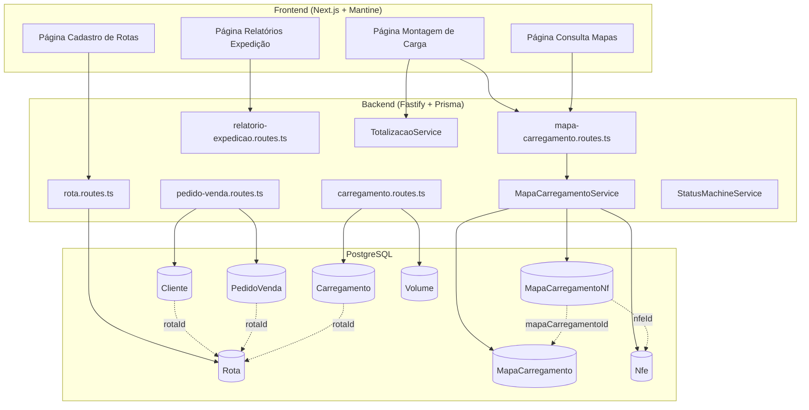
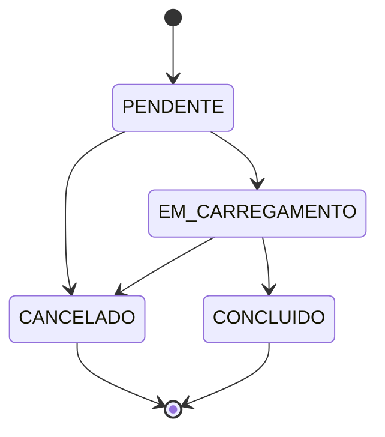
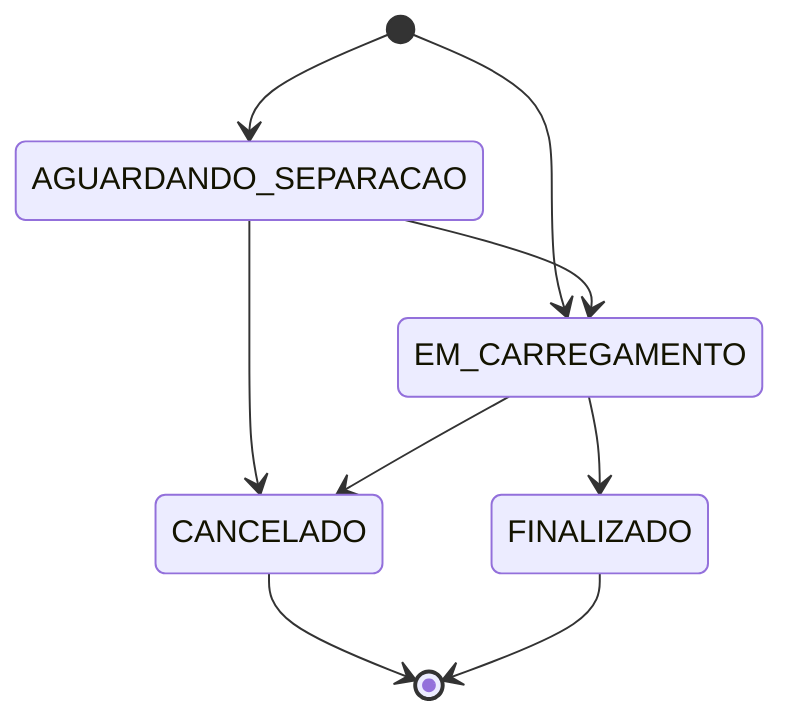

# Design Document — Roteirização e Montagem de Carga

## Visão Geral (Overview)

Este documento descreve o design técnico da funcionalidade de Roteirização e Montagem de Carga para o WMS. A feature introduz:

1. **Cadastro de Rotas** — CRUD completo de rotas de entrega com associação a transportadoras
2. **Associação Rota-Cliente** — Rota padrão por cliente, propagada automaticamente para pedidos de venda
3. **Montagem de Carga** — Seleção de NFs por rota, totalização, geração de Mapa de Carregamento com numeração sequencial
4. **Fluxo de Status** — Máquina de estados para Carregamento e Mapa de Carregamento com cancelamento, transferência de NFs e fechamento
5. **Relatórios de Expedição** — Totais por roteiro, total expedição, consulta de mapas e romaneio

A solução segue a arquitetura existente: Fastify + Prisma + PostgreSQL no backend, Next.js + Mantine no frontend, React Native + Expo no mobile.

---

## Arquitetura (Architecture)

### Diagrama de Alto Nível



### Diagrama de Fluxo de Status — Carregamento



### Diagrama de Fluxo de Status — Mapa de Carregamento



---

## Componentes e Interfaces (Components and Interfaces)

### Módulos Backend

| Módulo | Arquivo | Responsabilidade |
|--------|---------|-----------------|
| Rota | `src/modules/rota/rota.routes.ts` | CRUD de rotas |
| Rota | `src/modules/rota/rota.service.ts` | Lógica de negócio de rotas |
| Mapa Carregamento | `src/modules/mapa-carregamento/mapa-carregamento.routes.ts` | Endpoints do mapa |
| Mapa Carregamento | `src/modules/mapa-carregamento/mapa-carregamento.service.ts` | Geração, cancelamento, transferência, fechamento |
| Mapa Carregamento | `src/modules/mapa-carregamento/totalizacao.service.ts` | Cálculo de totais por rota |
| Carregamento | `src/modules/carregamento/carregamento.routes.ts` | Endpoints existentes + cancelamento, remoção de volume |
| Carregamento | `src/modules/carregamento/status-machine.service.ts` | Validação de transições de status |
| Relatórios | `src/modules/relatorio-expedicao/relatorio-expedicao.routes.ts` | Endpoints de relatórios |

### Endpoints da API

#### Rota (`/api/rotas`)

| Método | Path | Descrição |
|--------|------|-----------|
| POST | `/api/rotas` | Criar rota |
| GET | `/api/rotas` | Listar rotas (paginado, filtro status) |
| GET | `/api/rotas/:id` | Buscar rota por ID |
| PUT | `/api/rotas/:id` | Atualizar rota |
| PATCH | `/api/rotas/:id/desativar` | Desativar rota |

#### Mapa de Carregamento (`/api/mapas-carregamento`)

| Método | Path | Descrição |
|--------|------|-----------|
| POST | `/api/mapas-carregamento` | Gerar mapa (agrupa NFs marcadas) |
| GET | `/api/mapas-carregamento` | Listar mapas (paginado, filtros) |
| GET | `/api/mapas-carregamento/:id` | Buscar mapa por ID (reemissão) |
| PATCH | `/api/mapas-carregamento/:id/status` | Transição de status |
| POST | `/api/mapas-carregamento/:id/cancelar` | Cancelar mapa |
| POST | `/api/mapas-carregamento/:id/fechar` | Fechar mapa (confirmar entregas) |
| POST | `/api/mapas-carregamento/transferir-nfs` | Transferir NFs entre mapas |

#### Montagem de Carga (NFs disponíveis)

| Método | Path | Descrição |
|--------|------|-----------|
| GET | `/api/mapas-carregamento/nfs-disponiveis` | Listar NFs disponíveis (filtros: rotaId, clienteId, etc.) |
| POST | `/api/mapas-carregamento/nfs/marcar` | Marcar NFs para carga |
| POST | `/api/mapas-carregamento/nfs/desmarcar` | Desmarcar NFs |
| POST | `/api/mapas-carregamento/nfs/marcar-rota` | Marcar todas NFs de uma rota |
| POST | `/api/mapas-carregamento/nfs/desmarcar-rota` | Desmarcar todas NFs de uma rota |
| GET | `/api/mapas-carregamento/totalizacao` | Totais por rota (filtros aplicados) |

#### Carregamento (extensões em `/api/carregamentos`)

| Método | Path | Descrição |
|--------|------|-----------|
| POST | `/api/carregamentos/:id/cancelar` | Cancelar carregamento |
| DELETE | `/api/carregamentos/:id/volumes/:volumeId` | Remover volume do carregamento |
| PATCH | `/api/carregamentos/:id/status` | Transição de status com validação |

#### Relatórios (`/api/relatorios/expedicao`)

| Método | Path | Descrição |
|--------|------|-----------|
| GET | `/api/relatorios/expedicao/total-roteiro` | Total por roteiro |
| GET | `/api/relatorios/expedicao/total-expedicao` | Total expedição |
| GET | `/api/relatorios/expedicao/consulta-mapas` | Consulta mapas |
| GET | `/api/relatorios/expedicao/romaneio/:mapaId` | Romaneio de um mapa |

### Interfaces TypeScript Principais

```typescript
// Schemas de criação
interface CreateRotaInput {
  codigo: string
  descricao: string
  transportadoraId?: string
}

interface CreateMapaCarregamentoInput {
  veiculoPlaca: string
  motorista?: string
  motoristaCpf?: string
  observacoes?: string
  usaColetor: boolean
}

interface FecharMapaInput {
  nfs: Array<{
    nfeId: string
    statusEntrega: 'ENTREGUE' | 'DEVOLVIDO'
    motivoDevolucao?: string
  }>
}

interface TransferirNfsInput {
  sourceMapaId: string
  targetMapaId: string
  nfeIds: string[]
}

interface CancelarCarregamentoInput {
  motivoCancelamento: string
}

// Resposta de totalização
interface TotalizacaoRota {
  rotaId: string | null
  rotaCodigo: string | null
  rotaDescricao: string | null
  quantidadeNfs: number
  valorTotal: number       // 2 casas decimais
  pesoTotalKg: number      // 3 casas decimais
  totalVolumes: number
}

interface TotalizacaoGeral {
  porRota: TotalizacaoRota[]
  geral: {
    quantidadeNfs: number
    valorTotal: number
    pesoTotalKg: number
    totalVolumes: number
  }
}
```

---

## Modelos de Dados (Data Models)

### Novos Modelos Prisma

```prisma
model Rota {
  id                String   @id @default(uuid())
  empresaId         String   @map("empresa_id")
  empresa           Empresa  @relation(fields: [empresaId], references: [id])
  codigo            String   @db.VarChar(20)
  descricao         String   @db.VarChar(200)
  transportadoraId  String?  @map("transportadora_id")
  status            Boolean  @default(true)
  criadoEm          DateTime @default(now()) @map("criado_em")
  atualizadoEm      DateTime @updatedAt @map("atualizado_em")

  clientes          Cliente[]
  pedidosVenda      PedidoVenda[]
  carregamentos     Carregamento[]
  mapasCarregamento MapaCarregamento[]

  @@unique([empresaId, codigo])
  @@map("rota")
}

model MapaCarregamento {
  id                  String    @id @default(uuid())
  empresaId           String    @map("empresa_id")
  empresa             Empresa   @relation(fields: [empresaId], references: [id])
  numero              Int
  rotaId              String?   @map("rota_id")
  rota                Rota?     @relation(fields: [rotaId], references: [id])
  veiculoPlaca        String    @db.VarChar(10) @map("veiculo_placa")
  motorista           String?   @db.VarChar(200)
  motoristaCpf        String?   @db.VarChar(14) @map("motorista_cpf")
  observacoes         String?   @db.Text
  status              String    @default("AGUARDANDO_SEPARACAO") @db.VarChar(30)
  // Status: AGUARDANDO_SEPARACAO, EM_CARREGAMENTO, FINALIZADO, CANCELADO
  motivoCancelamento  String?   @db.Text @map("motivo_cancelamento")
  criadoPorId         String    @map("criado_por_id")
  canceladoPorId      String?   @map("cancelado_por_id")
  fechadoPorId        String?   @map("fechado_por_id")
  emissaoEm           DateTime  @default(now()) @map("emissao_em")
  finalizadoEm        DateTime? @map("finalizado_em")
  canceladoEm         DateTime? @map("cancelado_em")
  criadoEm            DateTime  @default(now()) @map("criado_em")
  atualizadoEm        DateTime  @updatedAt @map("atualizado_em")

  nfs                 MapaCarregamentoNf[]

  @@unique([empresaId, numero])
  @@map("mapa_carregamento")
}

model MapaCarregamentoNf {
  id                    String            @id @default(uuid())
  mapaCarregamentoId    String            @map("mapa_carregamento_id")
  mapaCarregamento      MapaCarregamento  @relation(fields: [mapaCarregamentoId], references: [id], onDelete: Cascade)
  nfeId                 String            @map("nfe_id")
  nfe                   Nfe               @relation(fields: [nfeId], references: [id])
  statusEntrega         String?           @db.VarChar(20) @map("status_entrega")
  // Status: null (pendente), ENTREGUE, DEVOLVIDO
  motivoDevolucao       String?           @db.Text @map("motivo_devolucao")

  @@unique([mapaCarregamentoId, nfeId])
  @@map("mapa_carregamento_nf")
}
```

### Modificações em Modelos Existentes

```prisma
// Cliente — adicionar campo rotaId
model Cliente {
  // ... campos existentes ...
  rotaId        String?  @map("rota_id")
  rota          Rota?    @relation(fields: [rotaId], references: [id])
}

// PedidoVenda — adicionar campo rotaId
model PedidoVenda {
  // ... campos existentes ...
  rotaId        String?  @map("rota_id")
  rota          Rota?    @relation(fields: [rotaId], references: [id])
}

// Carregamento — adicionar campos motorista, motoristaCpf, rotaId, cancelamento
model Carregamento {
  // ... campos existentes ...
  motorista           String?   @db.VarChar(200)
  motoristaCpf        String?   @db.VarChar(14) @map("motorista_cpf")
  rotaId              String?   @map("rota_id")
  rota                Rota?     @relation(fields: [rotaId], references: [id])
  motivoCancelamento  String?   @db.Text @map("motivo_cancelamento")
  canceladoPorId      String?   @map("cancelado_por_id")
  canceladoEm         DateTime? @map("cancelado_em")
  emCarregamentoEm    DateTime? @map("em_carregamento_em")
  // status existente ganha valor CANCELADO: PENDENTE, EM_CARREGAMENTO, CONCLUIDO, CANCELADO
}

// Nfe — adicionar campo mapaOk para seleção temporária
model Nfe {
  // ... campos existentes ...
  mapaOk              Boolean   @default(false) @map("mapa_ok")
  mapasCarregamento   MapaCarregamentoNf[]
}
```

### Migração de Dados

A migração será feita via Prisma Migrate com os seguintes passos:
1. Criar tabelas `rota`, `mapa_carregamento`, `mapa_carregamento_nf`
2. Adicionar colunas `rota_id` em `cliente`, `pedido_venda`, `carregamento`
3. Adicionar colunas `motorista`, `motorista_cpf`, `motivo_cancelamento`, `cancelado_por_id`, `cancelado_em`, `em_carregamento_em` em `carregamento`
4. Adicionar coluna `mapa_ok` em `nfe`
5. Todos os novos campos são opcionais (nullable), portanto não há breaking change nos dados existentes

---

</text>
</invoke>

## Propriedades de Corretude (Correctness Properties)

*Uma propriedade é uma característica ou comportamento que deve ser verdadeiro em todas as execuções válidas de um sistema — essencialmente, uma declaração formal sobre o que o sistema deve fazer. Propriedades servem como ponte entre especificações legíveis por humanos e garantias de corretude verificáveis por máquina.*

### Property 1: Unicidade de código de Rota por Empresa

*Para qualquer* empresa e qualquer par de rotas com o mesmo código dentro dessa empresa, a segunda criação deve ser rejeitada com erro de conflito. Rotas de empresas diferentes podem ter o mesmo código.

**Validates: Requirements 1.2, 1.3**

### Property 2: Isolamento multi-tenant de Rota

*Para qualquer* rota pertencente a uma empresa A e qualquer usuário autenticado de uma empresa B (onde A ≠ B), todas as operações de leitura, atualização e exclusão sobre essa rota devem retornar erro (not found ou forbidden).

**Validates: Requirements 1.8**

### Property 3: Validação cross-empresa de rotaId

*Para qualquer* atribuição de rotaId (em Cliente, PedidoVenda ou Carregamento), se a rota pertence a uma empresa diferente da entidade alvo, a operação deve ser rejeitada.

**Validates: Requirements 2.6, 16.5, 18.4**

### Property 4: Auto-preenchimento de rotaId no PedidoVenda

*Para qualquer* cliente com rotaId definido, ao criar um pedido de venda para esse cliente sem especificar rotaId explicitamente, o pedido resultante deve ter rotaId igual ao rotaId do cliente. Para qualquer cliente sem rotaId, o pedido deve ter rotaId nulo.

**Validates: Requirements 2.3, 2.4, 18.2**

### Property 5: Imutabilidade de Carregamento concluído/cancelado

*Para qualquer* carregamento com status CONCLUIDO ou CANCELADO, todas as tentativas de atualização (motorista, motoristaCpf, rotaId, adição/remoção de volumes, cancelamento) devem ser rejeitadas.

**Validates: Requirements 3.5, 4.5, 5.3, 16.3**

### Property 6: Máquina de estados do Carregamento

*Para qualquer* carregamento em um dado status e qualquer status alvo, a transição deve ser aceita se e somente se o par (statusAtual, statusAlvo) pertence ao conjunto {(PENDENTE, EM_CARREGAMENTO), (EM_CARREGAMENTO, CONCLUIDO), (PENDENTE, CANCELADO), (EM_CARREGAMENTO, CANCELADO)}. Todas as outras transições devem ser rejeitadas.

**Validates: Requirements 6.1, 6.2, 6.5**

### Property 7: Cancelamento de Carregamento restaura volumes

*Para qualquer* carregamento com N volumes associados (N ≥ 0), após cancelamento com motivo válido, o carregamento deve ter 0 registros CarregamentoVolume associados e todos os volumes previamente associados devem ter status EMBALADO.

**Validates: Requirements 4.3, 4.4**

### Property 8: Remoção de volume restaura status

*Para qualquer* volume associado a um carregamento (não CONCLUIDO/CANCELADO), após remoção individual, o volume deve ter status EMBALADO e não deve existir registro CarregamentoVolume para esse par.

**Validates: Requirements 5.2**

### Property 9: Filtro de NFs disponíveis por rota

*Para qualquer* consulta de NFs disponíveis com filtro rotaId, todos os resultados retornados devem ter seu PedidoVenda associado com rotaId igual ao filtro aplicado.

**Validates: Requirements 7.2**

### Property 10: Exclusão de NFs já carregadas

*Para qualquer* NF associada a um MapaCarregamento ativo (não CANCELADO) ou a um Carregamento ativo (não CANCELADO), essa NF não deve aparecer na lista de NFs disponíveis para montagem de carga.

**Validates: Requirements 7.5, 9.7**

### Property 11: Totalização por rota é soma dos itens

*Para qualquer* conjunto de NFs agrupadas por rota, o total por rota (quantidadeNfs, valorTotal, pesoTotalKg, totalVolumes) deve ser igual à soma dos valores individuais das NFs naquele grupo. O total geral deve ser igual à soma de todos os totais por rota.

**Validates: Requirements 8.1, 8.2, 8.3**

### Property 12: Numeração sequencial do Mapa de Carregamento

*Para qualquer* sequência de criações de MapaCarregamento dentro de uma empresa, cada novo mapa deve receber número = max(números existentes na empresa) + 1. O primeiro mapa deve receber número 1.

**Validates: Requirements 10.1, 10.2**

### Property 13: Geração de mapa associa NFs marcadas e limpa flags

*Para qualquer* conjunto de NFs com mapaOk=true no momento da geração, após a criação do mapa: (a) todas essas NFs devem estar associadas ao novo mapa via MapaCarregamentoNf, e (b) todas devem ter mapaOk=false.

**Validates: Requirements 10.3, 10.6**

### Property 14: Máquina de estados do Mapa de Carregamento

*Para qualquer* MapaCarregamento em um dado status e qualquer status alvo, a transição deve ser aceita se e somente se o par (statusAtual, statusAlvo) pertence ao conjunto {(AGUARDANDO_SEPARACAO, EM_CARREGAMENTO), (AGUARDANDO_SEPARACAO, CANCELADO), (EM_CARREGAMENTO, FINALIZADO), (EM_CARREGAMENTO, CANCELADO)}. Todas as outras transições devem ser rejeitadas.

**Validates: Requirements 11.1, 11.2, 11.3, 11.4**

### Property 15: Cancelamento de mapa libera NFs

*Para qualquer* MapaCarregamento com N NFs associadas (N ≥ 0), após cancelamento com motivo válido, o mapa deve ter 0 registros MapaCarregamentoNf associados (NFs retornam ao pool disponível).

**Validates: Requirements 12.3**

### Property 16: Transferência de NFs respeita status dos mapas

*Para qualquer* operação de transferência de NFs, se o mapa de origem tem status FINALIZADO, ou se o mapa de destino tem status FINALIZADO ou CANCELADO, a transferência deve ser rejeitada.

**Validates: Requirements 13.2, 13.3**

### Property 17: Fechamento de mapa exige motivo para devoluções

*Para qualquer* requisição de fechamento de mapa que contenha uma NF com statusEntrega=DEVOLVIDO sem motivoDevolucao (vazio ou ausente), a requisição deve ser rejeitada.

**Validates: Requirements 15.3**

### Property 18: Fechamento de mapa exige status EM_CARREGAMENTO

*Para qualquer* MapaCarregamento com status diferente de EM_CARREGAMENTO, uma requisição de fechamento deve ser rejeitada.

**Validates: Requirements 15.5**

### Property 19: Reemissão de mapa funciona em qualquer status

*Para qualquer* MapaCarregamento em qualquer status (AGUARDANDO_SEPARACAO, EM_CARREGAMENTO, FINALIZADO, CANCELADO), a consulta para reemissão deve retornar os dados completos do mapa.

**Validates: Requirements 14.4**

### Property 20: Rejeição de rotaId em PedidoVenda não-RASCUNHO

*Para qualquer* PedidoVenda com status diferente de RASCUNHO e qualquer usuário sem privilégios administrativos, tentativas de alterar o rotaId devem ser rejeitadas.

**Validates: Requirements 18.5**

---

## Tratamento de Erros (Error Handling)

### Estratégia Geral

| Tipo de Erro | HTTP Status | Formato de Resposta |
|---|---|---|
| Validação de entrada (Zod) | 400 Bad Request | `{ message: string, errors: ZodError[] }` |
| Recurso não encontrado | 404 Not Found | `{ message: string }` |
| Conflito (duplicidade) | 409 Conflict | `{ message: string }` |
| Transição de status inválida | 422 Unprocessable Entity | `{ message: string, statusAtual: string, statusSolicitado: string }` |
| Operação não permitida (status guard) | 422 Unprocessable Entity | `{ message: string }` |
| Violação multi-tenant | 404 Not Found | `{ message: "Recurso não encontrado" }` |
| Erro interno | 500 Internal Server Error | `{ message: "Erro interno do servidor" }` |

### Erros Específicos por Domínio

#### Rota
- `ROTA_CODIGO_DUPLICADO`: "Já existe uma rota com o código '{codigo}' para esta empresa"
- `ROTA_NAO_ENCONTRADA`: "Rota não encontrada"

#### Carregamento
- `CARREGAMENTO_TRANSICAO_INVALIDA`: "Não é possível transicionar de '{statusAtual}' para '{statusAlvo}'"
- `CARREGAMENTO_CONCLUIDO_IMUTAVEL`: "Carregamento concluído não pode ser alterado"
- `CARREGAMENTO_CANCELADO_IMUTAVEL`: "Carregamento cancelado não pode ser alterado"
- `VOLUME_NAO_ASSOCIADO`: "Volume não está associado a este carregamento"
- `MOTIVO_CANCELAMENTO_OBRIGATORIO`: "Motivo de cancelamento é obrigatório"

#### Mapa de Carregamento
- `MAPA_TRANSICAO_INVALIDA`: "Não é possível transicionar de '{statusAtual}' para '{statusAlvo}'"
- `MAPA_SEM_NFS_MARCADAS`: "Nenhuma NF marcada para geração do mapa"
- `MAPA_FINALIZADO_IMUTAVEL`: "Mapa finalizado não pode ser cancelado"
- `MAPA_NAO_EM_CARREGAMENTO`: "Mapa deve estar em status EM_CARREGAMENTO para ser fechado"
- `NF_JA_EM_MAPA_ATIVO`: "NF já está associada a um mapa de carregamento ativo"
- `MOTIVO_DEVOLUCAO_OBRIGATORIO`: "Motivo de devolução é obrigatório para NFs devolvidas"
- `TRANSFERENCIA_ORIGEM_FINALIZADA`: "Não é possível transferir NFs de um mapa finalizado"
- `TRANSFERENCIA_DESTINO_INVALIDO`: "Mapa de destino não aceita transferências (finalizado ou cancelado)"

### Transações e Consistência

- Todas as operações que modificam múltiplas tabelas (cancelamento, geração de mapa, transferência, fechamento) devem usar `prisma.$transaction()` para garantir atomicidade.
- Em caso de falha parcial, a transação é revertida automaticamente pelo Prisma.

### Logging e Auditoria

- Operações críticas (cancelamento, transferência, fechamento) registram entrada na tabela de auditoria existente via `registrarAudit()`.
- Campos de auditoria (criadoPorId, canceladoPorId, fechadoPorId) são preenchidos com o ID do usuário autenticado.

---

## Estratégia de Testes (Testing Strategy)

### Abordagem Dual

A estratégia de testes combina:

1. **Testes de Propriedade (Property-Based Tests)** — Verificam propriedades universais com 100+ iterações usando inputs gerados aleatoriamente
2. **Testes Unitários (Example-Based)** — Verificam cenários específicos, edge cases e integrações
3. **Testes de Integração** — Verificam endpoints completos com banco de dados real (test database)

### Biblioteca de Property-Based Testing

- **Biblioteca**: `fast-check` (já disponível no ecossistema Node.js/TypeScript)
- **Configuração**: Mínimo 100 iterações por propriedade (`fc.assert(property, { numRuns: 100 })`)
- **Tag format**: `Feature: wms-roteirizacao-montagem-carga, Property {number}: {property_text}`

### Estrutura de Testes

```
src/modules/
├── rota/
│   ├── rota.service.ts
│   ├── rota.service.spec.ts          (unit + property tests)
│   └── rota.routes.spec.ts           (integration tests)
├── mapa-carregamento/
│   ├── mapa-carregamento.service.ts
│   ├── mapa-carregamento.service.spec.ts  (unit + property tests)
│   ├── totalizacao.service.ts
│   ├── totalizacao.service.spec.ts        (property tests)
│   └── mapa-carregamento.routes.spec.ts   (integration tests)
├── carregamento/
│   ├── status-machine.service.ts
│   ├── status-machine.service.spec.ts     (property tests)
│   └── carregamento.routes.spec.ts        (integration tests)
└── relatorio-expedicao/
    └── relatorio-expedicao.routes.spec.ts (integration tests)
```

### Mapeamento Propriedades → Testes

| Propriedade | Tipo de Teste | Arquivo |
|---|---|---|
| P1: Unicidade código rota | Property (fast-check) | `rota.service.spec.ts` |
| P2: Isolamento multi-tenant | Integration | `rota.routes.spec.ts` |
| P3: Validação cross-empresa rotaId | Property (fast-check) | `rota.service.spec.ts` |
| P4: Auto-preenchimento rotaId | Property (fast-check) | `pedido-venda.service.spec.ts` |
| P5: Imutabilidade CONCLUIDO/CANCELADO | Property (fast-check) | `status-machine.service.spec.ts` |
| P6: Máquina de estados Carregamento | Property (fast-check) | `status-machine.service.spec.ts` |
| P7: Cancelamento restaura volumes | Property (fast-check) | `carregamento.service.spec.ts` |
| P8: Remoção restaura volume | Property (fast-check) | `carregamento.service.spec.ts` |
| P9: Filtro NFs por rota | Property (fast-check) | `mapa-carregamento.service.spec.ts` |
| P10: Exclusão NFs carregadas | Property (fast-check) | `mapa-carregamento.service.spec.ts` |
| P11: Totalização = soma | Property (fast-check) | `totalizacao.service.spec.ts` |
| P12: Numeração sequencial | Property (fast-check) | `mapa-carregamento.service.spec.ts` |
| P13: Geração associa e limpa | Property (fast-check) | `mapa-carregamento.service.spec.ts` |
| P14: Máquina de estados Mapa | Property (fast-check) | `status-machine.service.spec.ts` |
| P15: Cancelamento mapa libera NFs | Property (fast-check) | `mapa-carregamento.service.spec.ts` |
| P16: Transferência respeita status | Property (fast-check) | `mapa-carregamento.service.spec.ts` |
| P17: Fechamento exige motivo devolução | Property (fast-check) | `mapa-carregamento.service.spec.ts` |
| P18: Fechamento exige EM_CARREGAMENTO | Property (fast-check) | `mapa-carregamento.service.spec.ts` |
| P19: Reemissão em qualquer status | Property (fast-check) | `mapa-carregamento.service.spec.ts` |
| P20: Rejeição rotaId não-RASCUNHO | Property (fast-check) | `pedido-venda.service.spec.ts` |

### Generators (fast-check)

Os seguintes generators customizados serão criados:

```typescript
// Generators para testes de propriedade
const rotaArb = fc.record({
  codigo: fc.string({ minLength: 1, maxLength: 20 }),
  descricao: fc.string({ minLength: 1, maxLength: 200 }),
  transportadoraId: fc.option(fc.uuid()),
})

const carregamentoStatusArb = fc.constantFrom(
  'PENDENTE', 'EM_CARREGAMENTO', 'CONCLUIDO', 'CANCELADO'
)

const mapaStatusArb = fc.constantFrom(
  'AGUARDANDO_SEPARACAO', 'EM_CARREGAMENTO', 'FINALIZADO', 'CANCELADO'
)

const nfArb = fc.record({
  numero: fc.integer({ min: 1, max: 999999999 }),
  serie: fc.integer({ min: 1, max: 999 }),
  valorTotal: fc.float({ min: 0.01, max: 999999.99 }),
  pesoKg: fc.float({ min: 0.001, max: 99999.999 }),
  totalVolumes: fc.integer({ min: 1, max: 1000 }),
})

const statusEntregaArb = fc.constantFrom('ENTREGUE', 'DEVOLVIDO')
```

### Testes Unitários (Example-Based)

Cenários específicos a cobrir:
- Criação de rota com todos os campos opcionais
- Desativação de rota (soft delete)
- Atribuição de rota a cliente
- Criação de carregamento com motorista
- Remoção do último volume (não auto-cancela)
- Geração de mapa com/sem coletor
- Transferência de NFs entre mapas
- Fechamento com mix de ENTREGUE e DEVOLVIDO
- Relatórios com dados vazios

### Testes de Integração

- Endpoints completos via Fastify inject
- Banco de dados de teste (PostgreSQL em container ou in-memory)
- Seed de dados para cenários complexos
- Verificação de multi-tenancy end-to-end
