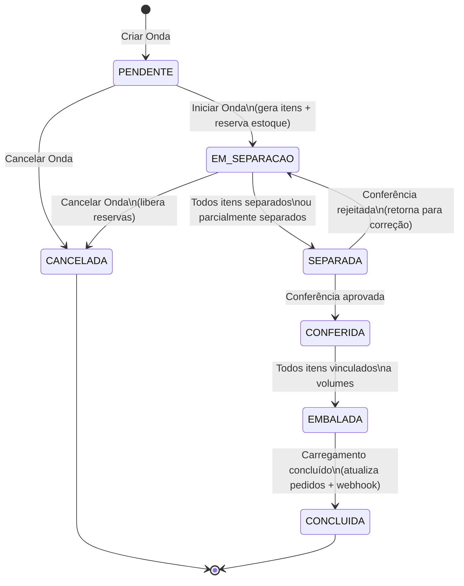
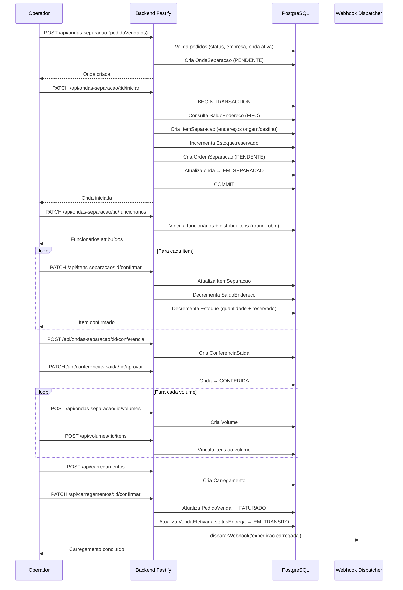
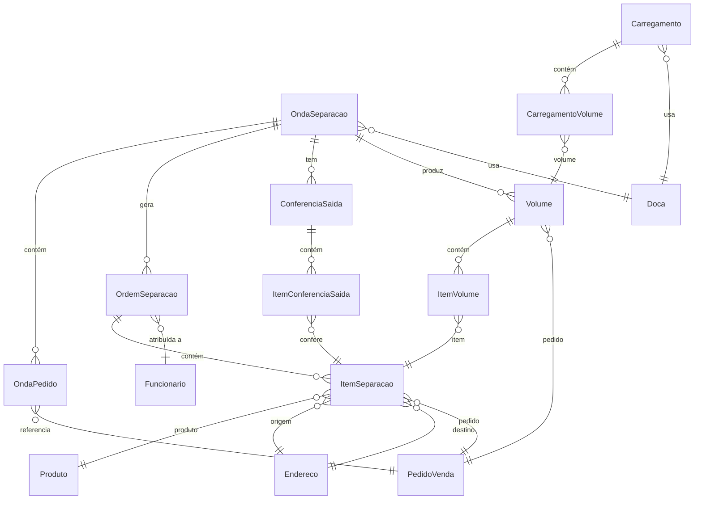

# Design Document — WMS Separação, Embalagem e Carregamento

## Overview

Este documento descreve o design técnico do fluxo completo de saída de mercadorias no WMS VisioFab, cobrindo desde o agrupamento de pedidos de venda em ondas de separação até a expedição final com carregamento em veículo.

O fluxo segue o ciclo: **Criação de Onda → Separação (Picking) → Conferência de Saída → Embalagem (Packing) → Carregamento (Loading)**, integrando-se ao módulo de Vendas existente (pedidos com status `EM_SEPARACAO`) e ao sistema de estoque com saldo por endereço (`SaldoEndereco`).

### Decisões de Design

1. **Transações atômicas** — Reserva de estoque e geração de itens de separação ocorrem na mesma transação Prisma para evitar inconsistências.
2. **FIFO por data de entrada** — A seleção de endereços de origem usa `atualizadoEm` do `SaldoEndereco` como proxy da data de entrada do lote, ordenando do mais antigo para o mais recente.
3. **Balanceamento round-robin** — Itens de separação são distribuídos entre funcionários usando round-robin por quantidade de itens, garantindo carga equilibrada.
4. **Máquina de estados linear** — A onda segue um ciclo de vida linear com transições controladas pelo backend, impedindo saltos de estado.
5. **Reutilização de infraestrutura** — Usa o `dispararWebhook` existente, o middleware `authenticate` + `moduloGuard('WMS')`, e o padrão de rotas Fastify já estabelecido no projeto.

## Architecture

### Diagrama de Fluxo — Ciclo de Vida da Onda



### Diagrama de Sequência — Fluxo Principal



### Camadas da Aplicação

O módulo segue a mesma arquitetura já utilizada no projeto:

- **Routes** (`*.routes.ts`) — Definição de rotas Fastify com validação Zod, hooks de autenticação e guard de módulo.
- **Services** (`*.service.ts`) — Lógica de negócio isolada, incluindo transações Prisma, cálculos FIFO e balanceamento.
- **Prisma Client** — Acesso ao banco via `prisma` singleton existente em `src/lib/prisma.ts`.

```
src/modules/
├── onda-separacao/
│   ├── onda-separacao.routes.ts      # Rotas REST da onda
│   ├── onda-separacao.service.ts     # Lógica: criar, iniciar, cancelar
│   └── onda-separacao.schemas.ts     # Schemas Zod de validação
├── item-separacao/
│   ├── item-separacao.routes.ts      # Rota de confirmação de picking
│   └── item-separacao.service.ts     # Lógica: confirmar, atualizar saldo
├── conferencia-saida/
│   ├── conferencia-saida.routes.ts   # Rotas de conferência
│   └── conferencia-saida.service.ts  # Lógica: conferir, aprovar, rejeitar
├── volume/
│   ├── volume.routes.ts              # Rotas de embalagem
│   └── volume.service.ts             # Lógica: criar volume, vincular itens
└── carregamento/
    ├── carregamento.routes.ts        # Rotas de carregamento
    └── carregamento.service.ts       # Lógica: criar, adicionar volumes, confirmar
```

## Components and Interfaces

### 1. Módulo Onda de Separação (`onda-separacao`)

**Responsabilidade:** Gerenciar o ciclo de vida completo da onda de separação.

**Rotas:**

| Método | Rota | Descrição |
|--------|------|-----------|
| `GET` | `/api/ondas-separacao` | Lista paginada com filtros (status, prioridade, data) |
| `POST` | `/api/ondas-separacao` | Cria onda com pedidoVendaIds, prioridade, docaId |
| `GET` | `/api/ondas-separacao/:id` | Detalhe com ordens, itens, funcionários, progresso |
| `PATCH` | `/api/ondas-separacao/:id/iniciar` | Inicia onda (gera itens + reserva estoque) |
| `PATCH` | `/api/ondas-separacao/:id/cancelar` | Cancela onda (libera reservas) |
| `PATCH` | `/api/ondas-separacao/:id/funcionarios` | Atribui funcionários e distribui itens |

**Schemas Zod:**

```typescript
// onda-separacao.schemas.ts
const criarOndaSchema = z.object({
  pedidoVendaIds: z.array(z.string().uuid()).min(1),
  prioridade: z.enum(['ALTA', 'MEDIA', 'BAIXA']).default('MEDIA'),
  docaId: z.string().uuid(),
})

const listarOndasSchema = z.object({
  page: z.coerce.number().int().positive().default(1),
  limit: z.coerce.number().int().positive().max(100).default(20),
  status: z.string().optional(),
  prioridade: z.string().optional(),
  dataInicio: z.coerce.date().optional(),
  dataFim: z.coerce.date().optional(),
})

const atribuirFuncionariosSchema = z.object({
  funcionarioIds: z.array(z.string().uuid()).min(1),
})
```

### 2. Lógica FIFO para Seleção de Endereços

A função `selecionarEnderecosFIFO` é o coração da geração de itens de separação:

```typescript
// onda-separacao.service.ts
async function selecionarEnderecosFIFO(
  produtoId: string,
  quantidadeNecessaria: Decimal,
  tx: PrismaTransactionClient
): Promise<{ enderecoId: string; quantidade: Decimal }[]> {
  // 1. Busca saldos do produto ordenados por atualizadoEm ASC (FIFO)
  const saldos = await tx.saldoEndereco.findMany({
    where: { produtoId, quantidade: { gt: 0 } },
    orderBy: { atualizadoEm: 'asc' },
  })

  const alocacoes: { enderecoId: string; quantidade: Decimal }[] = []
  let restante = quantidadeNecessaria

  for (const saldo of saldos) {
    if (restante.lte(0)) break

    const disponivel = saldo.quantidade
    const alocar = Decimal.min(disponivel, restante)

    alocacoes.push({ enderecoId: saldo.enderecoId, quantidade: alocar })
    restante = restante.sub(alocar)
  }

  return alocacoes
  // Se restante > 0, o chamador registra a falta
}
```

**Invariantes:**
- A soma das quantidades alocadas nunca excede a quantidade necessária.
- A soma das quantidades alocadas nunca excede o saldo disponível total.
- Endereços são consumidos na ordem FIFO (mais antigo primeiro).

### 3. Lógica de Reserva de Estoque

```typescript
async function reservarEstoque(
  empresaId: string,
  produtoId: string,
  quantidade: Decimal,
  tx: PrismaTransactionClient
): Promise<{ reservado: Decimal; falta: Decimal }> {
  const estoque = await tx.estoque.findUnique({
    where: { empresaId_produtoId: { empresaId, produtoId } },
  })

  if (!estoque) return { reservado: new Decimal(0), falta: quantidade }

  const disponivel = estoque.quantidade.sub(estoque.reservado)
  const aReservar = Decimal.min(disponivel, quantidade)
  const falta = quantidade.sub(aReservar)

  await tx.estoque.update({
    where: { id: estoque.id },
    data: { reservado: { increment: aReservar.toNumber() } },
  })

  return { reservado: aReservar, falta }
}
```

**Invariante:** `Estoque.reservado` nunca excede `Estoque.quantidade`.

### 4. Lógica de Balanceamento de Itens entre Funcionários

```typescript
function distribuirItensRoundRobin(
  itens: ItemSeparacao[],
  ordens: OrdemSeparacao[]
): Map<string, ItemSeparacao[]> {
  const distribuicao = new Map<string, ItemSeparacao[]>()
  ordens.forEach(o => distribuicao.set(o.id, []))

  const ordensIds = ordens.map(o => o.id)
  itens.forEach((item, index) => {
    const ordemId = ordensIds[index % ordensIds.length]
    distribuicao.get(ordemId)!.push(item)
  })

  return distribuicao
}
```

**Invariante:** A diferença de quantidade de itens entre qualquer par de funcionários é no máximo 1.

### 5. Módulo Item de Separação (`item-separacao`)

| Método | Rota | Descrição |
|--------|------|-----------|
| `PATCH` | `/api/itens-separacao/:id/confirmar` | Confirma separação com quantidade e motivo divergência |

**Schema:**

```typescript
const confirmarItemSchema = z.object({
  quantidadeSeparada: z.number().positive(),
  motivoDivergencia: z.enum([
    'PRODUTO_NAO_ENCONTRADO',
    'QUANTIDADE_INSUFICIENTE',
    'AVARIA',
  ]).optional(),
})
```

### 6. Módulo Conferência de Saída (`conferencia-saida`)

| Método | Rota | Descrição |
|--------|------|-----------|
| `POST` | `/api/ondas-separacao/:id/conferencia` | Cria conferência para onda SEPARADA |
| `PATCH` | `/api/conferencias-saida/:id/itens/:itemId` | Registra conferência de um item |
| `PATCH` | `/api/conferencias-saida/:id/aprovar` | Aprova conferência → onda CONFERIDA |
| `PATCH` | `/api/conferencias-saida/:id/rejeitar` | Rejeita → onda volta a EM_SEPARACAO |

### 7. Módulo Volume (`volume`)

| Método | Rota | Descrição |
|--------|------|-----------|
| `POST` | `/api/ondas-separacao/:id/volumes` | Cria volume (tipo, peso, dimensões) |
| `POST` | `/api/volumes/:id/itens` | Vincula itens ao volume |
| `GET` | `/api/volumes/:id/etiqueta` | Dados para impressão de etiqueta |

### 8. Módulo Carregamento (`carregamento`)

| Método | Rota | Descrição |
|--------|------|-----------|
| `POST` | `/api/carregamentos` | Cria carregamento (doca, veículo, transportadora) |
| `POST` | `/api/carregamentos/:id/volumes` | Adiciona volumes com sequência |
| `PATCH` | `/api/carregamentos/:id/confirmar` | Confirma → FATURADO + webhook |

## Data Models

### Diagrama ER — Novos Models



### Novos Models Prisma

```prisma
// ============================================================================
// SEPARAÇÃO, EMBALAGEM E CARREGAMENTO
// ============================================================================

enum PrioridadeOnda {
  ALTA
  MEDIA
  BAIXA
}

enum StatusOnda {
  PENDENTE
  EM_SEPARACAO
  SEPARADA
  CONFERIDA
  EMBALADA
  CONCLUIDA
  CANCELADA
}

enum StatusOrdemSeparacao {
  PENDENTE
  EM_SEPARACAO
  CONCLUIDA
}

enum StatusItemSeparacao {
  PENDENTE
  SEPARADO
  SEPARADO_PARCIAL
}

enum MotivoDivergencia {
  PRODUTO_NAO_ENCONTRADO
  QUANTIDADE_INSUFICIENTE
  AVARIA
}

enum StatusConferencia {
  EM_CONFERENCIA
  APROVADA
  REJEITADA
}

enum ResultadoConferencia {
  CONFORME
  DIVERGENTE
}

enum TipoDivergencia {
  FALTA
  EXCESSO
  PRODUTO_ERRADO
}

enum TipoVolume {
  CAIXA
  PALETE
  FARDO
}

enum StatusVolume {
  EMBALADO
  CARREGADO
}

enum StatusCarregamento {
  PENDENTE
  EM_CARREGAMENTO
  CONCLUIDO
}

model OndaSeparacao {
  id            String         @id @default(uuid())
  empresaId     String         @map("empresa_id")
  numero        Int
  prioridade    PrioridadeOnda @default(MEDIA)
  status        StatusOnda     @default(PENDENTE)
  docaId        String         @map("doca_id")
  criadoPorId   String         @map("criado_por_id")
  criadoEm      DateTime       @default(now()) @map("criado_em")
  atualizadoEm  DateTime       @updatedAt @map("atualizado_em")

  pedidos       OndaPedido[]
  ordens        OrdemSeparacao[]
  conferencias  ConferenciaSaida[]
  volumes       Volume[]

  @@unique([empresaId, numero])
  @@map("onda_separacao")
}

model OndaPedido {
  id                String         @id @default(uuid())
  ondaSeparacaoId   String         @map("onda_separacao_id")
  ondaSeparacao     OndaSeparacao  @relation(fields: [ondaSeparacaoId], references: [id], onDelete: Cascade)
  pedidoVendaId     String         @map("pedido_venda_id")

  @@unique([ondaSeparacaoId, pedidoVendaId])
  @@map("onda_pedido")
}

model OrdemSeparacao {
  id                String              @id @default(uuid())
  ondaSeparacaoId   String              @map("onda_separacao_id")
  ondaSeparacao     OndaSeparacao       @relation(fields: [ondaSeparacaoId], references: [id], onDelete: Cascade)
  funcionarioId     String?             @map("funcionario_id")
  status            StatusOrdemSeparacao @default(PENDENTE)
  criadoEm          DateTime            @default(now()) @map("criado_em")

  itens             ItemSeparacao[]

  @@map("ordem_separacao")
}

model ItemSeparacao {
  id                    String              @id @default(uuid())
  ordemSeparacaoId      String              @map("ordem_separacao_id")
  ordemSeparacao        OrdemSeparacao      @relation(fields: [ordemSeparacaoId], references: [id], onDelete: Cascade)
  pedidoVendaId         String              @map("pedido_venda_id")
  produtoId             String              @map("produto_id")
  enderecoOrigemId      String              @map("endereco_origem_id")
  enderecoDestinoId     String              @map("endereco_destino_id")
  quantidadeSolicitada  Decimal             @db.Decimal(12, 4) @map("quantidade_solicitada")
  quantidadeSeparada    Decimal             @default(0) @db.Decimal(12, 4) @map("quantidade_separada")
  status                StatusItemSeparacao @default(PENDENTE)
  motivoDivergencia     MotivoDivergencia?  @map("motivo_divergencia")
  separadoEm            DateTime?           @map("separado_em")

  itensConferencia      ItemConferenciaSaida[]
  itensVolume           ItemVolume[]

  @@map("item_separacao")
}

model ConferenciaSaida {
  id                String            @id @default(uuid())
  ondaSeparacaoId   String            @map("onda_separacao_id")
  ondaSeparacao     OndaSeparacao     @relation(fields: [ondaSeparacaoId], references: [id])
  conferenteId      String            @map("conferente_id")
  status            StatusConferencia @default(EM_CONFERENCIA)
  criadoEm          DateTime          @default(now()) @map("criado_em")
  concluidaEm       DateTime?         @map("concluida_em")

  itens             ItemConferenciaSaida[]

  @@map("conferencia_saida")
}

model ItemConferenciaSaida {
  id                    String              @id @default(uuid())
  conferenciaSaidaId    String              @map("conferencia_saida_id")
  conferenciaSaida      ConferenciaSaida    @relation(fields: [conferenciaSaidaId], references: [id], onDelete: Cascade)
  itemSeparacaoId       String              @map("item_separacao_id")
  itemSeparacao         ItemSeparacao       @relation(fields: [itemSeparacaoId], references: [id])
  quantidadeConferida   Decimal             @db.Decimal(12, 4) @map("quantidade_conferida")
  resultado             ResultadoConferencia
  tipoDivergencia       TipoDivergencia?    @map("tipo_divergencia")
  observacao            String?             @db.Text

  @@map("item_conferencia_saida")
}

model Volume {
  id                String         @id @default(uuid())
  ondaSeparacaoId   String         @map("onda_separacao_id")
  ondaSeparacao     OndaSeparacao  @relation(fields: [ondaSeparacaoId], references: [id])
  pedidoVendaId     String         @map("pedido_venda_id")
  codigo            Int
  tipo              TipoVolume
  pesoKg            Decimal        @db.Decimal(10, 3) @map("peso_kg")
  comprimentoCm     Decimal        @db.Decimal(10, 2) @map("comprimento_cm")
  larguraCm         Decimal        @db.Decimal(10, 2) @map("largura_cm")
  alturaCm          Decimal        @db.Decimal(10, 2) @map("altura_cm")
  status            StatusVolume   @default(EMBALADO)
  criadoEm          DateTime       @default(now()) @map("criado_em")

  itens             ItemVolume[]
  carregamentos     CarregamentoVolume[]

  @@unique([ondaSeparacaoId, codigo])
  @@map("volume")
}

model ItemVolume {
  id                String         @id @default(uuid())
  volumeId          String         @map("volume_id")
  volume            Volume         @relation(fields: [volumeId], references: [id], onDelete: Cascade)
  itemSeparacaoId   String         @map("item_separacao_id")
  itemSeparacao     ItemSeparacao  @relation(fields: [itemSeparacaoId], references: [id])
  quantidade        Decimal        @db.Decimal(12, 4)

  @@map("item_volume")
}

model Carregamento {
  id                String             @id @default(uuid())
  empresaId         String             @map("empresa_id")
  docaId            String             @map("doca_id")
  veiculoPlaca      String             @db.VarChar(10) @map("veiculo_placa")
  transportadoraId  String?            @map("transportadora_id")
  status            StatusCarregamento @default(PENDENTE)
  criadoEm          DateTime           @default(now()) @map("criado_em")
  concluidoEm       DateTime?          @map("concluido_em")

  volumes           CarregamentoVolume[]

  @@map("carregamento")
}

model CarregamentoVolume {
  id              String       @id @default(uuid())
  carregamentoId  String       @map("carregamento_id")
  carregamento    Carregamento @relation(fields: [carregamentoId], references: [id], onDelete: Cascade)
  volumeId        String       @map("volume_id")
  volume          Volume       @relation(fields: [volumeId], references: [id])
  sequencia       Int
  carregadoEm     DateTime?    @map("carregado_em")

  @@unique([carregamentoId, volumeId])
  @@map("carregamento_volume")
}
```

### Relações com Models Existentes

Os novos models referenciam models existentes sem alterá-los:

- `OndaSeparacao.empresaId` → `Empresa.id` (filtro multi-empresa)
- `OndaSeparacao.docaId` → `Doca.id` (tabela `doca` existente)
- `OndaSeparacao.criadoPorId` → `Funcionario.id` (tabela `funcionario` existente)
- `OndaPedido.pedidoVendaId` → `PedidoVenda.id` (tabela `pedido_venda` existente)
- `OrdemSeparacao.funcionarioId` → `Funcionario.id`
- `ItemSeparacao.produtoId` → `Produto.id` (tabela `produto` do WMS)
- `ItemSeparacao.enderecoOrigemId` / `enderecoDestinoId` → `Endereco.id` (tabela `endereco` existente)
- `Carregamento.transportadoraId` → `Transportadora.id` (tabela `transportadora` existente)

### SaldoEndereco Existente

A tabela `saldo_endereco` já existe com a estrutura:

| Campo | Tipo | Descrição |
|-------|------|-----------|
| `id` | TEXT PK | UUID |
| `quantidade` | FLOAT | Saldo atual no endereço |
| `lote` | VARCHAR(30) | Identificador do lote (nullable) |
| `validade` | TIMESTAMP | Data de validade (nullable) |
| `atualizadoEm` | TIMESTAMP | Usado como proxy FIFO |
| `enderecoId` | TEXT FK | Referência ao endereço |
| `produtoId` | TEXT FK | Referência ao produto |

**Unique constraint:** `(enderecoId, produtoId, lote)`

### Estoque Existente

A tabela `estoque` já existe com a estrutura:

| Campo | Tipo | Descrição |
|-------|------|-----------|
| `id` | TEXT PK | UUID |
| `empresaId` | TEXT FK | Referência à empresa |
| `produtoId` | TEXT FK | Referência ao produto |
| `quantidade` | DECIMAL(12,4) | Quantidade total |
| `reservado` | DECIMAL(12,4) | Quantidade reservada (default 0) |

**Unique constraint:** `(empresaId, produtoId)`

**Disponível** = `quantidade - reservado`

## Correctness Properties

*A property is a characteristic or behavior that should hold true across all valid executions of a system — essentially, a formal statement about what the system should do. Properties serve as the bridge between human-readable specifications and machine-verifiable correctness guarantees.*

### Property 1: Alocação FIFO preserva ordem e soma

*For any* produto com N registros de `SaldoEndereco` e uma quantidade solicitada Q, a função `selecionarEnderecosFIFO` SHALL retornar alocações onde: (a) os endereços aparecem na ordem crescente de `atualizadoEm`, (b) a soma das quantidades alocadas é igual a `min(Q, saldoTotalDisponível)`, e (c) nenhuma alocação individual excede o saldo do respectivo endereço.

**Validates: Requirements 2.2, 2.3, 2.5**

### Property 2: Reserva de estoque é round-trip

*For any* onda de separação que é iniciada (reservando estoque) e depois cancelada, o valor de `Estoque.reservado` para cada produto envolvido SHALL retornar ao valor anterior à iniciação da onda.

**Validates: Requirements 3.1, 3.4**

### Property 3: Geração de itens é completa e consistente

*For any* onda de separação iniciada contendo N pedidos de venda, a soma de `quantidadeSolicitada` dos `ItemSeparacao` gerados para cada produto SHALL ser igual à soma das quantidades desse produto nos itens dos pedidos de venda (limitada ao estoque disponível), todos os itens SHALL ter `enderecoDestinoId` igual ao `docaId` da onda, e todos os itens SHALL pertencer a uma `OrdemSeparacao` da onda.

**Validates: Requirements 2.1, 2.4, 2.6**

### Property 4: Balanceamento round-robin distribui uniformemente

*For any* conjunto de I itens de separação distribuídos entre F funcionários, a diferença de quantidade de itens entre qualquer par de funcionários SHALL ser no máximo 1, ou seja: `max(contagens) - min(contagens) <= 1`.

**Validates: Requirements 4.4**

### Property 5: Confirmação de separação define status corretamente

*For any* `ItemSeparacao` confirmado com `quantidadeSeparada` e `quantidadeSolicitada`: se `quantidadeSeparada == quantidadeSolicitada`, o status SHALL ser `SEPARADO`; se `quantidadeSeparada < quantidadeSolicitada`, o status SHALL ser `SEPARADO_PARCIAL` e `motivoDivergencia` SHALL estar preenchido; e `separadoEm` SHALL estar preenchido em ambos os casos.

**Validates: Requirements 5.1, 5.2, 5.5**

### Property 6: Confirmação de separação decrementa saldos corretamente

*For any* `ItemSeparacao` confirmado com `quantidadeSeparada` = X, o `SaldoEndereco` do endereço de origem SHALL ser decrementado em X, e o `Estoque` do produto SHALL ter `quantidade` decrementada em X e `reservado` decrementado em X. Adicionalmente, `Estoque.reservado` SHALL nunca ser negativo.

**Validates: Requirements 5.3, 5.4**

### Property 7: Cálculo de progresso da onda é correto

*For any* `OndaSeparacao` com itens em estados variados, o percentual de progresso SHALL ser igual a `(itens com status SEPARADO ou SEPARADO_PARCIAL) / (total de itens) × 100`, e WHEN todos os itens atingem status `SEPARADO` ou `SEPARADO_PARCIAL`, o status da onda SHALL transicionar para `SEPARADA`.

**Validates: Requirements 6.1, 6.3**

### Property 8: Classificação de resultado de conferência é determinística

*For any* `ItemConferenciaSaida` com `quantidadeConferida` e o respectivo `ItemSeparacao.quantidadeSeparada`: se `quantidadeConferida == quantidadeSeparada`, o `resultado` SHALL ser `CONFORME`; caso contrário, SHALL ser `DIVERGENTE` com `tipoDivergencia` preenchido.

**Validates: Requirements 7.2, 7.3**

### Property 9: Quantidade vinculada a volume não excede quantidade separada

*For any* `ItemSeparacao`, a soma de `quantidade` em todos os `ItemVolume` vinculados a esse item SHALL ser menor ou igual a `quantidadeSeparada` do item. Adicionalmente, todos os itens vinculados a um volume SHALL pertencer à mesma `OndaSeparacao` do volume.

**Validates: Requirements 8.3**

### Property 10: Conclusão de carregamento atualiza todos os pedidos vinculados

*For any* `Carregamento` concluído, todos os `PedidoVenda` vinculados (via Volume → OndaPedido) SHALL ter status `FATURADO`, e todas as `VendaEfetivada` correspondentes SHALL ter `statusEntrega` = `EM_TRANSITO`.

**Validates: Requirements 9.5, 9.6**

### Property 11: Pedido de venda pertence a no máximo uma onda ativa

*For any* `PedidoVenda`, não SHALL existir mais de uma `OndaSeparacao` com status diferente de `CANCELADA` e `CONCLUIDA` que contenha esse pedido na tabela `OndaPedido`.

**Validates: Requirements 1.4**

### Property 12: Máquina de estados da onda respeita transições válidas

*For any* `OndaSeparacao`, as transições de status SHALL seguir exclusivamente o grafo: `PENDENTE → EM_SEPARACAO`, `PENDENTE → CANCELADA`, `EM_SEPARACAO → SEPARADA`, `EM_SEPARACAO → CANCELADA`, `SEPARADA → CONFERIDA`, `SEPARADA → EM_SEPARACAO` (rejeição), `CONFERIDA → EMBALADA`, `EMBALADA → CONCLUIDA`. Qualquer outra transição SHALL ser rejeitada.

**Validates: Requirements 7.5, 7.6, 8.1**

## Error Handling

### Erros de Validação (HTTP 422)

| Cenário | Mensagem | Ação |
|---------|----------|------|
| Pedido sem status EM_SEPARACAO | `Pedidos inválidos: [ids]. Status deve ser EM_SEPARACAO` | Rejeita criação da onda |
| Pedido de outra empresa | `Pedidos não pertencem à empresa do operador` | Rejeita criação |
| Pedido já em onda ativa | `Pedido [numero] já vinculado à onda [numero]` | Rejeita inclusão |
| Funcionário de outro CD | `Funcionário [nome] não pertence ao centro de distribuição` | Rejeita atribuição |
| Onda em status inválido para operação | `Onda em status [status]. Esperado: [status_esperado]` | Rejeita operação |
| Quantidade vinculada excede separada | `Quantidade excede o separado para o item [id]` | Rejeita vinculação |
| Volume não EMBALADO no carregamento | `Volumes com status inválido: [ids]` | Rejeita confirmação |

### Erros de Recurso (HTTP 404)

| Cenário | Mensagem |
|---------|----------|
| Onda não encontrada | `Onda de separação não encontrada` |
| Item de separação não encontrado | `Item de separação não encontrado` |
| Conferência não encontrada | `Conferência de saída não encontrada` |
| Volume não encontrado | `Volume não encontrado` |
| Carregamento não encontrado | `Carregamento não encontrado` |

### Erros de Estoque

| Cenário | Comportamento |
|---------|---------------|
| Saldo insuficiente para produto | Gera itens para quantidade disponível, registra falta. Não bloqueia a onda. |
| Estoque.reservado ficaria negativo | Reserva apenas o disponível (`quantidade - reservado`). Registra diferença como falta. |
| SaldoEndereco zerado após separação | Atualiza `Endereco.estado` para `LIVRE`. |

### Tratamento de Transações

Todas as operações que modificam estoque (`iniciar onda`, `confirmar item`, `cancelar onda`) usam `prisma.$transaction()` para garantir atomicidade. Em caso de falha em qualquer etapa, toda a transação é revertida.

```typescript
// Padrão de transação usado em todas as operações de estoque
const resultado = await prisma.$transaction(async (tx) => {
  // 1. Validações
  // 2. Operações de escrita
  // 3. Atualização de saldos
  // Se qualquer etapa falhar, tudo é revertido
  return resultado
})
```

## Testing Strategy

### Abordagem Dual: Unit Tests + Property-Based Tests

Este módulo combina lógica de negócio pura (FIFO, balanceamento, cálculos de saldo) com operações de banco de dados. A estratégia de testes reflete essa dualidade:

- **Property-Based Tests (PBT):** Para funções puras e invariantes de negócio (Properties 1-12).
- **Unit Tests:** Para cenários específicos, edge cases e validações de estado.
- **Integration Tests:** Para rotas REST, transações de banco e webhook dispatch.

### Biblioteca PBT

**fast-check** (TypeScript) — biblioteca madura para property-based testing em TypeScript, compatível com Vitest.

### Configuração PBT

- Mínimo **100 iterações** por property test.
- Cada test referencia a property do design document.
- Tag format: `Feature: wms-separacao-embalagem-carregamento, Property {N}: {título}`

### Property-Based Tests

| Property | Função Testada | Generators |
|----------|---------------|------------|
| P1: Alocação FIFO | `selecionarEnderecosFIFO` | `fc.array(fc.record({ enderecoId: fc.uuid(), quantidade: fc.float({min: 0.01, max: 1000}), atualizadoEm: fc.date() }))`, `fc.float({min: 0.01, max: 5000})` |
| P2: Reserva round-trip | `reservarEstoque` + `liberarReserva` | `fc.record({ quantidade: fc.float({min: 1, max: 10000}), reservado: fc.float({min: 0}) })`, `fc.float({min: 0.01})` |
| P3: Geração de itens | `gerarItensSeparacao` | `fc.array(fc.record({ produtoId: fc.uuid(), quantidade: fc.float({min: 0.01, max: 100}) }))` |
| P4: Balanceamento | `distribuirItensRoundRobin` | `fc.array(fc.anything(), {minLength: 1})`, `fc.integer({min: 1, max: 20})` |
| P5: Status confirmação | `confirmarItemSeparacao` | `fc.record({ solicitada: fc.float({min: 1}), separada: fc.float({min: 0.01}) })` |
| P6: Decremento saldos | `confirmarItemSeparacao` | `fc.float({min: 0.01, max: 1000})` |
| P7: Progresso onda | `calcularProgresso` | `fc.array(fc.constantFrom('PENDENTE', 'SEPARADO', 'SEPARADO_PARCIAL'), {minLength: 1})` |
| P8: Resultado conferência | `classificarResultado` | `fc.record({ conferida: fc.float({min: 0}), separada: fc.float({min: 0.01}) })` |
| P9: Quantidade volume | `vincularItemVolume` | `fc.array(fc.float({min: 0.01}))`, `fc.float({min: 0.01})` |
| P10: Conclusão carregamento | `concluirCarregamento` | `fc.array(fc.uuid(), {minLength: 1})` |
| P11: Unicidade pedido-onda | `criarOnda` | `fc.array(fc.uuid(), {minLength: 1})` |
| P12: Máquina de estados | `transitarStatus` | `fc.constantFrom(...statusOnda)`, `fc.constantFrom(...statusOnda)` |

### Unit Tests (Exemplos e Edge Cases)

| Cenário | Tipo | Descrição |
|---------|------|-----------|
| Criar onda com 1 pedido | Example | Verifica criação básica com número sequencial |
| Criar onda com pedido RASCUNHO | Edge Case | Verifica rejeição |
| Iniciar onda sem estoque | Edge Case | Verifica geração parcial com registro de falta |
| Confirmar item com quantidade zero | Edge Case | Verifica rejeição |
| Cancelar onda já CONCLUIDA | Edge Case | Verifica rejeição |
| Conferência com todos itens CONFORME | Example | Verifica aprovação |
| Volume com peso zero | Edge Case | Verifica validação |
| Carregamento com volumes de ondas diferentes | Edge Case | Verifica rejeição |
| Funcionário já em outra onda ativa | Example | Verifica aviso retornado |
| Endereço fica com saldo zero | Edge Case | Verifica estado LIVRE |

### Integration Tests

| Cenário | Descrição |
|---------|-----------|
| Fluxo completo onda → carregamento | Testa todo o ciclo de vida com banco real |
| Transação atômica na iniciação | Verifica rollback se geração de itens falha |
| Webhook dispatch no carregamento | Verifica chamada ao `dispararWebhook` com mock |
| Paginação e filtros de listagem | Verifica query params nas rotas GET |
| Autenticação e guard WMS | Verifica 401/403 sem token ou sem módulo |

### Frontend Tests

| Cenário | Tipo | Descrição |
|---------|------|-----------|
| Página Picking renderiza dados da API | Component | Mock da API, verifica tabela |
| Página Expedição tabs funcionam | Component | Verifica navegação entre abas |
| Modal Nova Onda valida campos | Component | Verifica validação Zod no form |
| Cards de estatísticas calculam corretamente | Component | Mock da API, verifica valores |
| TanStack Query revalida após mutação | Component | Verifica invalidação de cache |
