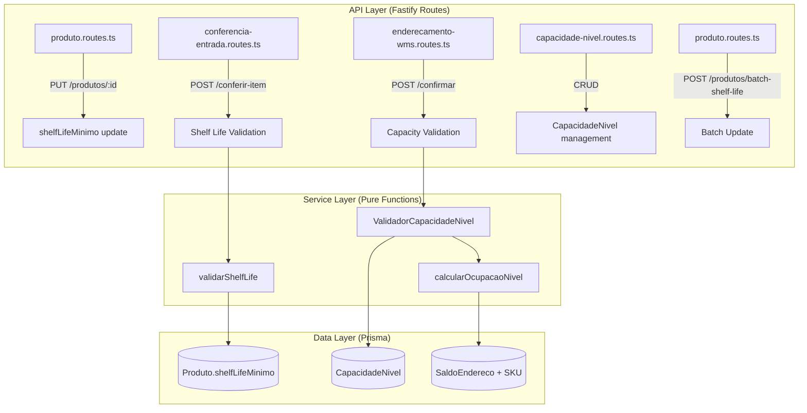

# Design Document: Controle de Shelf Life e Capacidade por Nível

## Overview

Esta funcionalidade adiciona dois controles complementares ao WMS VisioFab:

1. **Shelf Life Mínimo**: Campo configurável por produto que define a quantidade mínima de dias restantes até o vencimento para aceitar um item durante a conferência de entrada. A validação é implementada como uma **função pura** que recebe (shelfLifeMinimo, dataValidade, dataAtual) e retorna aceite/rejeição com mensagem detalhada.

2. **Capacidade por Nível**: Modelo de configuração que permite definir limites de peso, volume e paletes por nível dentro de cada estrutura de armazenagem. O cálculo de ocupação é uma **função pura** que agrega saldos de estoque por nível, e a validação de capacidade verifica se o endereçamento proposto excede os limites configurados.

### Decisões de Design

- **Funções puras para lógica de negócio**: As validações de shelf life e capacidade são implementadas como funções puras (sem side effects), facilitando testes unitários e property-based testing.
- **Extensão do ValidadorCapacidade existente**: O serviço `ValidadorCapacidade` já existe e valida capacidade por endereço individual. Será estendido para suportar validação por nível agregado.
- **Migração incremental**: Novos campos e tabelas são adicionados via `migrate-prod.ts` com `ALTER TABLE IF NOT EXISTS` / `CREATE TABLE IF NOT EXISTS`, mantendo o padrão existente.
- **Multi-tenant**: Todas as operações são escopadas por `empresaId` do usuário autenticado.

## Architecture



## Components and Interfaces

### 1. Shelf Life Validation Service

**Arquivo**: `src/modules/conferencia/shelf-life.service.ts`

```typescript
export interface ShelfLifeInput {
  shelfLifeMinimo: number | null  // dias mínimos configurados no produto
  dataValidade: Date | null        // data de validade informada na conferência
  dataAtual: Date                  // data atual (injetada para testabilidade)
  produtoNome: string              // nome do produto para mensagem
}

export interface ShelfLifeResult {
  aprovado: boolean
  diasRestantes: number | null
  mensagem?: string                // mensagem de rejeição detalhada
  dataMinima?: string              // data mínima aceitável (ISO string)
}

/**
 * Função pura que valida shelf life.
 * Regras:
 * - Se shelfLifeMinimo é null → aprovado (sem validação)
 * - Se dataValidade é null → aprovado (sem validação)
 * - Se diasRestantes >= shelfLifeMinimo → aprovado
 * - Se diasRestantes < shelfLifeMinimo → rejeitado com mensagem
 */
export function validarShelfLife(input: ShelfLifeInput): ShelfLifeResult
```

### 2. Level Occupancy Calculation Service

**Arquivo**: `src/modules/endereco/ocupacao-nivel.service.ts`

```typescript
export interface SaldoComSku {
  quantidade: number
  pesoBruto: number | null   // do SKU
  volume: number | null      // do SKU
}

export interface OcupacaoNivel {
  pesoTotal: number          // kg
  volumeTotal: number        // m³
  paletesTotal: number       // contagem de saldos distintos com qty > 0
}

/**
 * Função pura que calcula a ocupação de um nível.
 * Recebe a lista de saldos com dados de SKU já resolvidos.
 * Produtos sem SKU contribuem zero para peso/volume.
 */
export function calcularOcupacaoNivel(saldos: SaldoComSku[]): OcupacaoNivel
```

### 3. Level Capacity Validator

**Arquivo**: `src/modules/endereco/validador-capacidade-nivel.service.ts`

```typescript
export interface CapacidadeNivelConfig {
  pesoMaximo: number | null
  volumeMaximo: number | null
  paletesMaximo: number | null
}

export interface ValidacaoCapacidadeNivelInput {
  config: CapacidadeNivelConfig | null  // null = sem config → permitir
  ocupacaoAtual: OcupacaoNivel
  pesoIncoming: number
  volumeIncoming: number
  paletesIncoming: number               // geralmente 1 por endereçamento
}

export interface ValidacaoCapacidadeNivelResult {
  permitido: boolean
  motivo?: string
  detalhes?: {
    tipo: 'PESO' | 'VOLUME' | 'PALETES'
    atual: number
    incoming: number
    limite: number
  }
}

/**
 * Função pura que valida capacidade do nível.
 * Regras:
 * - Se config é null → permitido
 * - Verifica peso: se pesoMaximo > 0 e (pesoAtual + pesoIncoming) > pesoMaximo → rejeitar
 * - Verifica volume: se volumeMaximo > 0 e (volumeAtual + volumeIncoming) > volumeMaximo → rejeitar
 * - Verifica paletes: se paletesMaximo > 0 e (paletesAtual + paletesIncoming) > paletesMaximo → rejeitar
 * - Se nenhum limite excedido → permitido
 */
export function validarCapacidadeNivel(input: ValidacaoCapacidadeNivelInput): ValidacaoCapacidadeNivelResult
```

### 4. Alert Level Classification

**Arquivo**: `src/modules/endereco/alert-nivel.service.ts`

```typescript
export type AlertLevel = 'NORMAL' | 'ALERTA' | 'CRITICO'

/**
 * Função pura que classifica o nível de alerta baseado no percentual de ocupação.
 * - >= 95% → CRITICO (vermelho)
 * - >= 80% → ALERTA (amarelo)
 * - < 80% → NORMAL (sem destaque)
 */
export function classificarAlertaNivel(percentualOcupacao: number): AlertLevel
```

### 5. CapacidadeNivel CRUD Routes

**Arquivo**: `src/modules/capacidade-nivel/capacidade-nivel.routes.ts`

```typescript
// POST   /api/capacidades-nivel       → criar configuração
// GET    /api/capacidades-nivel?estruturaId=xxx → listar por estrutura
// PUT    /api/capacidades-nivel/:id    → atualizar
// DELETE /api/capacidades-nivel/:id    → excluir
// GET    /api/capacidades-nivel/ocupacao?estruturaId=xxx → ocupação atual de todos os níveis
```

### 6. Batch Shelf Life Update

**Arquivo**: Adicionado ao `src/modules/produto/produto.routes.ts`

```typescript
// POST /api/produtos/batch-shelf-life
// Body: { itens: [{ produtoId?: string, codigo?: string, shelfLifeMinimo: number | null }] }
// Response: { total, sucessos, falhas, resultados: [{ produtoId, codigo, sucesso, erro? }] }
```

## Data Models

### Alteração no modelo Produto

```prisma
model Produto {
  // ... campos existentes ...
  shelfLifeMinimo  Int?  @map("shelf_life_minimo")  // dias mínimos de validade
}
```

### Novo modelo CapacidadeNivel

```prisma
model CapacidadeNivel {
  id            String    @id @default(uuid())
  empresaId     String    @map("empresa_id")
  estruturaId   String    @map("estrutura_id")
  estrutura     Estrutura @relation(fields: [estruturaId], references: [id])
  codigoNivel   String    @db.VarChar(10) @map("codigo_nivel")
  pesoMaximo    Decimal?  @db.Decimal(12,3) @map("peso_maximo")    // kg
  volumeMaximo  Decimal?  @db.Decimal(12,6) @map("volume_maximo")  // m³
  paletesMaximo Int?      @map("paletes_maximo")
  status        Boolean   @default(true)
  criadoEm      DateTime  @default(now()) @map("criado_em")
  atualizadoEm  DateTime  @updatedAt @map("atualizado_em")

  @@unique([estruturaId, codigoNivel])
  @@map("capacidade_nivel")
}
```

### Migração (migrate-prod.ts)

```sql
-- Shelf Life no Produto
ALTER TABLE "produto" ADD COLUMN IF NOT EXISTS "shelf_life_minimo" INTEGER;

-- Tabela CapacidadeNivel
CREATE TABLE IF NOT EXISTS "capacidade_nivel" (
  "id" TEXT PRIMARY KEY DEFAULT gen_random_uuid(),
  "empresa_id" TEXT NOT NULL,
  "estrutura_id" TEXT NOT NULL,
  "codigo_nivel" VARCHAR(10) NOT NULL,
  "peso_maximo" DECIMAL(12,3),
  "volume_maximo" DECIMAL(12,6),
  "paletes_maximo" INTEGER,
  "status" BOOLEAN DEFAULT true,
  "criado_em" TIMESTAMP DEFAULT NOW(),
  "atualizado_em" TIMESTAMP DEFAULT NOW(),
  UNIQUE("estrutura_id", "codigo_nivel")
);

CREATE INDEX IF NOT EXISTS "idx_capacidade_nivel_empresa_id" ON "capacidade_nivel"("empresa_id");
CREATE INDEX IF NOT EXISTS "idx_capacidade_nivel_estrutura_id" ON "capacidade_nivel"("estrutura_id");
```

## Correctness Properties

*A property is a characteristic or behavior that should hold true across all valid executions of a system — essentially, a formal statement about what the system should do. Properties serve as the bridge between human-readable specifications and machine-verifiable correctness guarantees.*

### Property 1: Shelf Life Validation Correctness

*For any* combinação de (shelfLifeMinimo, dataValidade, dataAtual), a função `validarShelfLife` SHALL:
- Retornar `aprovado = true` quando shelfLifeMinimo é null
- Retornar `aprovado = true` quando dataValidade é null
- Retornar `aprovado = true` quando diasRestantes >= shelfLifeMinimo
- Retornar `aprovado = false` quando diasRestantes < shelfLifeMinimo

Onde diasRestantes = diferença em dias entre dataValidade e dataAtual.

**Validates: Requirements 2.1, 2.2, 2.3, 2.4**

### Property 2: Batch Shelf Life Filtering

*For any* lista de itens com diferentes combinações de (shelfLifeMinimo, dataValidade), a função de validação em lote SHALL rejeitar exatamente o subconjunto de itens onde `validarShelfLife` retorna `aprovado = false`, e aprovar todos os demais.

**Validates: Requirements 2.6**

### Property 3: Rejection Message Completeness

*For any* cenário onde `validarShelfLife` retorna `aprovado = false`, a mensagem de rejeição SHALL conter: o nome do produto, o shelfLifeMinimo configurado, os dias restantes calculados e a data mínima de validade aceitável (dataAtual + shelfLifeMinimo).

**Validates: Requirements 2.7**

### Property 4: CapacidadeNivel Uniqueness Constraint

*For any* par (estruturaId, codigoNivel), a criação de uma segunda configuração de CapacidadeNivel com o mesmo par SHALL ser rejeitada com erro de duplicidade.

**Validates: Requirements 3.6**

### Property 5: CapacidadeNivel Requires At Least One Limit

*For any* combinação de (pesoMaximo, volumeMaximo, paletesMaximo), a criação de uma CapacidadeNivel SHALL ser rejeitada se todos os valores forem null ou zero, e aceita se pelo menos um for maior que zero.

**Validates: Requirements 3.7**

### Property 6: Alert Level Classification

*For any* percentual de ocupação (número >= 0), a função `classificarAlertaNivel` SHALL retornar:
- `CRITICO` quando percentual >= 95
- `ALERTA` quando 80 <= percentual < 95
- `NORMAL` quando percentual < 80

**Validates: Requirements 4.7**

### Property 7: Level Capacity Validation

*For any* combinação de (CapacidadeNivelConfig, ocupacaoAtual, incoming), a função `validarCapacidadeNivel` SHALL:
- Retornar `permitido = true` quando config é null
- Rejeitar quando pesoMaximo > 0 e (pesoAtual + pesoIncoming) > pesoMaximo
- Rejeitar quando volumeMaximo > 0 e (volumeAtual + volumeIncoming) > volumeMaximo
- Rejeitar quando paletesMaximo > 0 e (paletesAtual + paletesIncoming) > paletesMaximo
- Retornar `permitido = true` quando nenhum limite é excedido

**Validates: Requirements 5.2, 5.3, 5.4, 5.5**

### Property 8: Auto-Addressing Skips Full Levels

*For any* conjunto de endereços com diferentes níveis e capacidades configuradas, o algoritmo de endereçamento automático SHALL selecionar apenas endereços em níveis onde a capacidade não será excedida após o endereçamento.

**Validates: Requirements 5.7**

### Property 9: Level Occupancy Calculation

*For any* conjunto de saldos (quantidade, pesoBruto, volume) em endereços de um mesmo nível, a função `calcularOcupacaoNivel` SHALL:
- Calcular pesoTotal = Σ(quantidade × pesoBruto) para saldos com pesoBruto não-null
- Calcular volumeTotal = Σ(quantidade × volume) para saldos com volume não-null
- Calcular paletesTotal = contagem de saldos distintos com quantidade > 0
- Tratar pesoBruto/volume null como zero

**Validates: Requirements 6.1, 6.2, 6.3, 6.4, 6.6**

### Property 10: Batch Update Report Correctness

*For any* lista de itens de atualização em lote (mix de válidos e inválidos), o relatório retornado SHALL conter exatamente um resultado por item de entrada, e a soma de sucessos + falhas SHALL ser igual ao total de itens enviados.

**Validates: Requirements 7.3**

## Error Handling

### Shelf Life Validation Errors

| Cenário | HTTP Status | Mensagem |
|---------|-------------|----------|
| Validade insuficiente | 422 | `Produto "{nome}" requer no mínimo {shelfLifeMinimo} dias de validade. Dias restantes: {diasRestantes}. Data mínima aceitável: {dataMinima}.` |
| Produto não encontrado | 404 | `Produto não encontrado` |

### Capacity Validation Errors

| Cenário | HTTP Status | Mensagem |
|---------|-------------|----------|
| Peso excedido | 422 | `Capacidade de peso do nível {codigoNivel} excedida. Atual: {pesoAtual}kg + Entrada: {pesoIncoming}kg > Limite: {pesoMaximo}kg` |
| Volume excedido | 422 | `Capacidade de volume do nível {codigoNivel} excedida. Atual: {volumeAtual}m³ + Entrada: {volumeIncoming}m³ > Limite: {volumeMaximo}m³` |
| Paletes excedido | 422 | `Capacidade de paletes do nível {codigoNivel} excedida. Atual: {paletesAtual} + Entrada: 1 > Limite: {paletesMaximo}` |

### CapacidadeNivel CRUD Errors

| Cenário | HTTP Status | Mensagem |
|---------|-------------|----------|
| Duplicidade (estruturaId + codigoNivel) | 409 | `Já existe configuração para o nível {codigoNivel} nesta estrutura` |
| Nenhum limite informado | 422 | `Pelo menos um limite (peso, volume ou paletes) deve ser maior que zero` |
| Estrutura não encontrada | 404 | `Estrutura não encontrada` |
| Acesso negado (multi-tenant) | 403 | `Acesso negado` |

### Batch Update Errors

| Cenário | HTTP Status | Mensagem |
|---------|-------------|----------|
| Lista vazia | 422 | `A lista de itens não pode ser vazia` |
| Item com produto inválido | — | Registrado no relatório: `Produto não encontrado: {codigo}` |
| Item com valor inválido | — | Registrado no relatório: `Valor inválido para shelfLifeMinimo` |

## Testing Strategy

### Abordagem Dual: Unit Tests + Property-Based Tests

**Property-Based Testing Library**: [fast-check](https://github.com/dubzzz/fast-check) (TypeScript)

As funções puras (`validarShelfLife`, `calcularOcupacaoNivel`, `validarCapacidadeNivel`, `classificarAlertaNivel`) são ideais para property-based testing por serem determinísticas, sem side effects, e com espaço de entrada grande.

### Property Tests (mínimo 100 iterações cada)

Cada property test referencia a propriedade do design document:

- **Feature: wms-shelf-life-capacidade-nivel, Property 1**: Shelf Life Validation Correctness
- **Feature: wms-shelf-life-capacidade-nivel, Property 2**: Batch Shelf Life Filtering
- **Feature: wms-shelf-life-capacidade-nivel, Property 3**: Rejection Message Completeness
- **Feature: wms-shelf-life-capacidade-nivel, Property 5**: CapacidadeNivel Requires At Least One Limit
- **Feature: wms-shelf-life-capacidade-nivel, Property 6**: Alert Level Classification
- **Feature: wms-shelf-life-capacidade-nivel, Property 7**: Level Capacity Validation
- **Feature: wms-shelf-life-capacidade-nivel, Property 9**: Level Occupancy Calculation
- **Feature: wms-shelf-life-capacidade-nivel, Property 10**: Batch Update Report Correctness

### Unit Tests (example-based)

- Shelf life: cenários específicos com datas fixas (hoje, amanhã, ontem, exatamente no limite)
- CapacidadeNivel CRUD: criação, listagem, atualização, exclusão, duplicidade
- Batch update: cenários com mix de itens válidos/inválidos
- Multi-tenant isolation: acesso cruzado entre empresas

### Integration Tests

- Conferência de entrada com shelf life validation (conferir-item, conferir-por-barras, conferir-todos)
- Endereçamento manual e automático com capacity validation
- CRUD completo de CapacidadeNivel via API
- Endpoint de ocupação por nível

### Configuração

```json
{
  "devDependencies": {
    "fast-check": "^3.x",
    "vitest": "^1.x"
  }
}
```

Cada property test deve rodar com `numRuns: 100` no mínimo.
