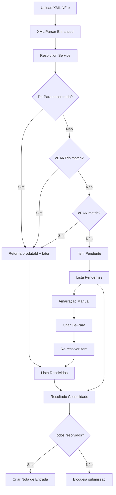
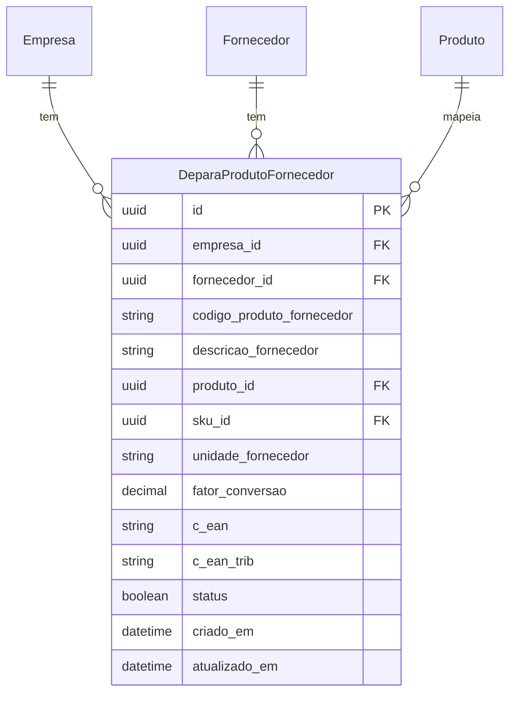

# Design Document — De-Para / Amarração Fornecedor x Produto

## Overview

Esta funcionalidade implementa o mapeamento (De-Para) entre códigos de produtos de fornecedores e produtos internos do sistema VisioFab WMS. O objetivo é resolver automaticamente itens de XML de NF-e para produtos internos durante a importação, utilizando uma cadeia de prioridade: De-Para cadastrado → cEANTrib → cEAN. Itens não resolvidos são apresentados ao operador para amarração manual, que é persistida para importações futuras.

### Decisões de Design

1. **Serviço de resolução puro**: A lógica de resolução é implementada como função pura (recebe dados, retorna resultado) separada da camada de I/O, facilitando testes unitários e property-based testing.
2. **Parser XML aprimorado**: O parser existente é estendido para extrair cEAN, cEANTrib, uTrib e qTrib, mantendo compatibilidade com o formato atual.
3. **Transação atômica para criação de Produto + De-Para**: Quando o operador cria um novo produto durante o fluxo de amarração, ambos os registros são criados em uma única transação Prisma.
4. **Fator de conversão decimal(12,4)**: Permite conversões fracionárias (ex: 1 caixa = 12 unidades → fator 12.0000).

## Architecture



### Componentes Principais

| Componente | Responsabilidade |
|---|---|
| `parseNfeXml` (enhanced) | Extrai todos os campos do XML incluindo cEAN, cEANTrib, uTrib, qTrib |
| `ResolutionService` | Lógica pura de resolução por prioridade |
| `DeparaRoutes` | CRUD de mapeamentos De-Para |
| `ImportFlowRoutes` | Orquestra upload → parse → resolve → resposta |
| `DeparaPage` (frontend) | Tela de gerenciamento de mapeamentos |
| `PendingMappingModal` (frontend) | Modal de amarração manual no fluxo de importação |

## Components and Interfaces

### Backend — Módulo `depara-fornecedor`

#### `src/modules/depara-fornecedor/depara-fornecedor.routes.ts`

```typescript
// CRUD De-Para
GET    /api/depara-fornecedor          → Lista paginada com filtros
GET    /api/depara-fornecedor/:id      → Detalhe de um registro
POST   /api/depara-fornecedor          → Criar mapeamento
PUT    /api/depara-fornecedor/:id      → Atualizar mapeamento
DELETE /api/depara-fornecedor/:id      → Excluir mapeamento
```

#### `src/modules/depara-fornecedor/resolution.service.ts`

```typescript
interface XmlItem {
  codigoProdutoFornecedor: string  // cProd
  descricao: string                // xProd
  unidade: string                  // uCom
  quantidade: number               // qCom
  valorUnitario: number            // vUnCom
  valorTotal: number               // vProd
  ncm: string
  cEAN: string | null
  cEANTrib: string | null
  uTrib: string | null
  qTrib: number | null
}

interface ResolvedItem {
  xmlItem: XmlItem
  produtoId: string
  produtoNome: string
  skuId: string | null
  fatorConversao: number
  quantidadeOriginal: number
  quantidadeConvertida: number
  unidadeInterna: string
  resolvidoPor: 'DEPARA' | 'EAN_TRIB' | 'EAN'
}

interface PendingItem {
  xmlItem: XmlItem
  sugestoes: Array<{ produtoId: string; nome: string; cEAN: string | null }>
}

interface ResolutionResult {
  resolvidos: ResolvedItem[]
  pendentes: PendingItem[]
}

// Função pura de resolução
function resolveItems(
  items: XmlItem[],
  deparas: DeparaRecord[],
  produtos: ProdutoRecord[],
  skus: SkuRecord[]
): ResolutionResult
```

#### `src/modules/nota-entrada/importar-xml-depara.routes.ts`

```typescript
// Fluxo de importação com De-Para
POST   /api/notas-entrada/importar-xml-depara   → Upload + parse + resolve
POST   /api/notas-entrada/criar-produto-depara  → Criar produto + De-Para em transação
```

### Frontend — Páginas e Componentes

#### Página de Gerenciamento: `src/app/(interna)/cadastros/depara-fornecedor/page.tsx`

- Tabela com listagem paginada de mapeamentos
- Filtros por fornecedor, produto, status
- Ações: editar, desativar, excluir

#### Modal de Amarração: `src/components/depara/PendingMappingModal.tsx`

- Lista itens pendentes do XML
- Para cada item: busca de produto interno (autocomplete)
- Campo de fator de conversão
- Opção de criar novo produto

#### Hooks: `src/data/hooks/useDepara.ts`

- `useDepara()` — lista paginada com filtros
- `useDeparaCreate()` — mutation de criação
- `useDeparaUpdate()` — mutation de atualização
- `useImportarXmlDepara()` — mutation do fluxo de importação

## Data Models

### Prisma Schema — `DeparaProdutoFornecedor`

```prisma
model DeparaProdutoFornecedor {
  id                       String   @id @default(uuid())
  empresaId                String   @map("empresa_id")
  fornecedorId             String   @map("fornecedor_id")
  codigoProdutoFornecedor  String   @db.VarChar(60) @map("codigo_produto_fornecedor")
  descricaoFornecedor      String?  @db.VarChar(200) @map("descricao_fornecedor")
  produtoId                String   @map("produto_id")
  skuId                    String?  @map("sku_id")
  unidadeFornecedor        String   @db.VarChar(6) @map("unidade_fornecedor")
  fatorConversao           Decimal  @default(1) @db.Decimal(12,4) @map("fator_conversao")
  cEAN                     String?  @db.VarChar(14) @map("c_ean")
  cEANTrib                 String?  @db.VarChar(14) @map("c_ean_trib")
  status                   Boolean  @default(true)
  criadoEm                 DateTime @default(now()) @map("criado_em")
  atualizadoEm             DateTime @updatedAt @map("atualizado_em")

  empresa     Empresa     @relation(fields: [empresaId], references: [id])
  fornecedor  Fornecedor  @relation(fields: [fornecedorId], references: [id])
  produto     Produto     @relation(fields: [produtoId], references: [id])

  @@unique([empresaId, fornecedorId, codigoProdutoFornecedor])
  @@index([empresaId, fornecedorId])
  @@index([produtoId])
  @@map("depara_produto_fornecedor")
}
```

### Relações adicionais no schema existente

```prisma
// Em Empresa:
deparasProdutoFornecedor  DeparaProdutoFornecedor[]

// Em Fornecedor:
deparasProduto  DeparaProdutoFornecedor[]

// Em Produto:
deparasFornecedor  DeparaProdutoFornecedor[]
```

### Diagrama ER



## Correctness Properties

*Uma propriedade é uma característica ou comportamento que deve ser verdadeiro em todas as execuções válidas de um sistema — essencialmente, uma declaração formal sobre o que o sistema deve fazer. Propriedades servem como ponte entre especificações legíveis por humanos e garantias de correção verificáveis por máquina.*

### Property 1: Extração e Normalização do XML

*Para qualquer* bloco XML de item NF-e válido contendo campos cEAN, cEANTrib, uTrib e qTrib, o parser SHALL extrair todos os campos corretamente, e valores "SEM GTIN" ou vazios SHALL ser normalizados para null.

**Validates: Requirements 2.1, 2.2, 2.3, 2.4, 2.5, 2.6**

### Property 2: Cadeia de Prioridade na Resolução

*Para qualquer* item XML e qualquer estado do banco de dados (De-Para ativos, Produtos, SKUs), o serviço de resolução SHALL seguir estritamente a prioridade: (1) De-Para ativo com match em fornecedorId+cProd, (2) cEANTrib match em Produto.cEAN ou SKU.codigoBarra, (3) cEAN match em Produto.cEAN ou SKU.codigoBarra, (4) pendente. Se um nível superior encontra match, os inferiores não são consultados.

**Validates: Requirements 3.1, 3.2, 3.3, 3.4, 3.5, 3.6, 3.7**

### Property 3: Correção da Conversão de Quantidade

*Para qualquer* item resolvido com fatorConversao `f` e quantidade original `q`, a quantidade convertida SHALL ser igual a `q * f`, e o resultado SHALL conter tanto a quantidade original quanto a convertida, junto com a unidade interna do produto/SKU.

**Validates: Requirements 5.1, 5.2, 5.3**

### Property 4: Unicidade do Mapeamento

*Para qualquer* par de registros De-Para com a mesma combinação (empresaId, fornecedorId, codigoProdutoFornecedor), o sistema SHALL rejeitar a criação do segundo registro com erro de conflito.

**Validates: Requirements 1.2, 9.1**

### Property 5: Isolamento Multi-Tenant na Resolução

*Para qualquer* operação de resolução, o sistema SHALL considerar apenas De-Para ativos (status=true) pertencentes à mesma empresaId, e SHALL ignorar registros inativos ou de outras empresas.

**Validates: Requirements 6.5, 6.6**

### Property 6: Correção dos Filtros de Listagem

*Para qualquer* combinação de filtros (fornecedorId, produtoId, codigoProdutoFornecedor, status) aplicada à listagem de De-Para, todos os registros retornados SHALL satisfazer todos os filtros aplicados, e nenhum registro que satisfaça os filtros SHALL ser omitido (dentro da página).

**Validates: Requirements 6.2**

### Property 7: Validação do Fator de Conversão

*Para qualquer* valor de fatorConversao menor ou igual a zero, o sistema SHALL rejeitar a criação/atualização do De-Para. Para qualquer valor positivo com até 4 casas decimais, o sistema SHALL armazenar e recuperar o valor sem perda de precisão.

**Validates: Requirements 1.3, 9.3**

### Property 8: Determinismo na Seleção de SKU

*Para qualquer* conjunto de SKUs de um mesmo Produto que compartilham o mesmo código de barras (codigoBarra), o sistema SHALL sempre retornar o SKU com menor valor de `sequencia`.

**Validates: Requirements 9.5**

### Property 9: Rejeição de Submissão com Itens Pendentes

*Para qualquer* conjunto de itens onde pelo menos um está marcado como pendente de amarração, o sistema SHALL rejeitar a criação da nota de entrada e SHALL listar os itens não resolvidos na mensagem de erro.

**Validates: Requirements 7.4**

### Property 10: Vinculação Preserva Produto Existente

*Para qualquer* operação de vinculação (link) de um item pendente a um Produto existente, o sistema SHALL criar apenas o registro De-Para sem modificar nenhum campo do Produto vinculado.

**Validates: Requirements 8.5**

## Error Handling

| Cenário | Código HTTP | Mensagem |
|---|---|---|
| XML malformado ou sem estrutura NF-e | 400 | "Erro ao processar XML: [detalhe]" |
| Duplicata (empresaId, fornecedorId, cProd) | 409 | "Já existe um mapeamento para este fornecedor e código de produto" |
| fatorConversao ≤ 0 | 400 | "Fator de conversão deve ser maior que zero" |
| produtoId inexistente ou de outra empresa | 404 | "Produto não encontrado" |
| fornecedorId inexistente ou de outra empresa | 404 | "Fornecedor não encontrado" |
| skuId não pertence ao produto | 400 | "SKU não pertence ao produto informado" |
| Submissão com itens pendentes | 422 | "Existem X itens pendentes de amarração: [lista]" |
| Conversão resulta em fração para unidade inteira | 200 (com warning) | Campo `avisos[]` no response |
| Múltiplos SKUs com mesmo EAN | 200 (com warning) | Campo `avisos[]` indicando múltiplos matches |

### Estratégia de Erros

- Erros de validação (Zod) retornam 400 com detalhes dos campos inválidos
- Erros de unicidade (Prisma P2002) são capturados e convertidos em 409
- Erros de FK inexistente (Prisma P2003) são capturados e convertidos em 404
- Warnings não bloqueiam a operação, são retornados em array `avisos` no response

## Testing Strategy

### Abordagem Dual: Unit Tests + Property-Based Tests

**Property-Based Testing Library**: `fast-check` (TypeScript)

A lógica de resolução e parsing é implementada como funções puras, tornando-as ideais para property-based testing. Os testes de propriedade validam comportamentos universais com mínimo 100 iterações cada.

### Property Tests (fast-check)

Cada propriedade do documento será implementada como um teste property-based:

- **Tag format**: `Feature: xml-depara-fornecedor-produto, Property {N}: {título}`
- **Mínimo 100 iterações** por propriedade
- Foco nas funções puras: `parseNfeXml`, `resolveItems`, `calculateConversion`
- Generators customizados para: XML items, De-Para records, Produtos, SKUs

### Unit Tests (exemplo-based)

- Criação de De-Para com valores default (fator=1, status=true)
- Fluxo completo de importação com XML real de exemplo
- Auto-criação de fornecedor a partir do CNPJ do XML
- Criação de Produto + De-Para em transação única
- Pré-preenchimento de campos do Produto a partir do XML

### Integration Tests

- CRUD completo via API (create, read, update, delete)
- Fluxo de upload XML → resolução → amarração → nota de entrada
- Isolamento multi-tenant (empresa A não vê dados de empresa B)
- Paginação e filtros na listagem

### Edge Cases (cobertos pelos generators do PBT)

- cEAN = "SEM GTIN", cEANTrib = "", ambos nulos
- XML com 0 itens, 1 item, muitos itens
- Todos itens resolvidos, nenhum resolvido, mix
- fatorConversao com 4 casas decimais (ex: 0.0833)
- Múltiplos SKUs com mesmo EAN
